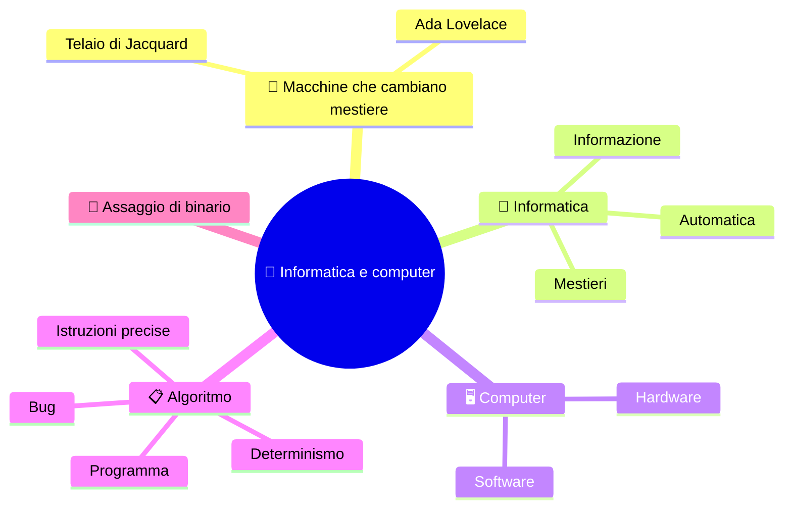

# 🧭 Informatica e computer

**1CI · Settembre-Ottobre · S1 · Teoria**
⏱️ **Tempo di studio: circa 15 minuti per i soli ✅** · 🔍 altri 5 · 🤓 facoltativo · nessun compito a casa obbligatorio.

> **Legenda:** ✅ da sapere · 🔍 per capire fino in fondo · 🤓 facoltativo, per curiosi · 📜 storia · ⚙️ tecnica · 🧪 esempio · 🧠 da ricordare · ✏️ da fare · ⚠️ errore comune · 🎮 gioco · 🎬 video · 🃏 flashcard: rispondi a voce, poi apri per controllare



## 📜 Una macchina che cambia mestiere

Per millenni ogni macchina ha fatto **un solo mestiere**. Il mulino macina. L'orologio segna l'ora. Il telaio tesse.

Nel 1804 Joseph-Marie Jacquard costruisce un telaio guidato da **schede forate**. Buco: il filo sale. Pieno: il filo scende. Cambi le schede e cambia il disegno. **Il telaio resta lo stesso.**

Nel 1843 Ada Lovelace scrive che la macchina di Babbage potrebbe lavorare con i simboli come il telaio lavora con i fili. Aveva intuito che una macchina può trattare **qualsiasi cosa si possa descrivere con regole**.

Oggi quella macchina sta nella tua tasca. Questo corso racconta come funziona. 🚀

📌 *Schema:* una macchina, tante istruzioni.

```text
telaio + schede A       ->  fiori
telaio + schede B       ->  onde
computer + programma A  ->  testo
computer + programma B  ->  gioco
```

## 🧠 Che cos'è l'informatica

### ✅ Informazione automatica

**Informatica** = **informazione** + **automatica**: trattare informazioni con macchine, in modo automatico. In italiano la parola viene dal francese *informatique* (1962, Philippe Dreyfus).

🧠 ==Informatica non vuol dire «usare il computer»: vuol dire capire come si fa fare un lavoro a una macchina.==

È come la differenza fra guidare e sapere come funziona un motore. Puoi fare entrambe le cose. Qui impariamo il motore.

<details>
<summary>🃏 <b>Che cosa significa la parola informatica?</b></summary>
Informazione + automatica: trattare informazioni in modo automatico con una macchina.
</details>

<details>
<summary>🃏 <b>Usare un'app è lo stesso che studiare informatica?</b></summary>
No. Usarla è come guidare; l'informatica studia come funziona il motore.
</details>

### ✅ Chi lavora con l'informatica

| Ruolo | Che cosa fa | Esempio meno ovvio |
|---|---|---|
| Sviluppatore | scrive programmi | app che legge i testi ad alta voce per chi vede poco |
| Sistemista | prepara e protegge PC e servizi | tiene vivo l'archivio digitale di una biblioteca |
| Tecnico di rete | fa comunicare i dispositivi | collega sensori in un parco naturale |
| Analista di dati | trasforma dati in grafici e decisioni | aiuta una mensa solidale a capire cosa serve |
| Esperto di sicurezza | previene accessi non autorizzati | protegge i dati di un'associazione |
| Digital humanist | usa l'informatica per studiare testi e arte | ricostruisce lettere storiche |

📌 Non esiste «l'informatico»: esistono tanti mestieri che nascono da un bisogno di qualcuno.

<details>
<summary>🃏 <b>Un informatico lavora solo in aziende informatiche?</b></summary>
No. Lavora anche in ospedali, biblioteche, teatri, redazioni e associazioni.
</details>

### 🔍 Tre abilità che servono anche senza computer

1. **Scomporre** un problema confuso in passi piccoli.
2. **Controllare** se un risultato è affidabile, invece di fidarsi dello schermo.
3. **Progettare** strumenti che risparmiano tempo o errori a qualcuno.

🧪 Una lista di compiti sul telefono è solo un elenco. Un foglio ben costruito segna le scadenze e dice chi ha bisogno di aiuto. La differenza non è il programma: è **come hai ragionato sui dati**.

<details>
<summary>🃏 <b>Quali sono le tre abilità dell'informatica?</b></summary>
Scomporre, controllare, progettare.
</details>

### 🤓 Chi non c'era nella foto

> Le prime programmatrici dei calcolatori degli anni '40 furono in gran parte donne. Con il tempo la loro presenza è stata cancellata dai racconti. Ada, le «computer» di ENIAC e le colleghe sono una storia da recuperare: la trovi in *Ada Lovelace, le pioniere dell'informatica e il gender gap*.

## 🖥️ Hardware e software

### ✅ Due metà di una macchina

**Hardware** è la parte che puoi toccare: CPU, memoria, schermo, cavi.
**Software** è la parte fatta di istruzioni: programmi e dati.

🧠 ==Il computer è hardware + software. Senza software l'hardware è un fermacarte.==

È come un forno e una ricetta. Il forno senza ricetta non cucina. La ricetta senza forno non scalda nulla. 🍕

⚠️ La metafora ha un limite: una ricetta la legge una persona, il software lo esegue direttamente la macchina.

> Nella prossima dispensa la distinzione diventa più precisa, con tre livelli.

<details>
<summary>🃏 <b>Che cos'è l'hardware?</b></summary>
La parte fisica del computer: quella che puoi toccare.
</details>

<details>
<summary>🃏 <b>Che cos'è il software?</b></summary>
L'insieme di programmi e dati: le istruzioni che l'hardware esegue.
</details>

## 📋 Algoritmo

### ✅ Istruzioni precise

Un **algoritmo** è una sequenza **precisa e ordinata** di passi per risolvere un problema.

🧪 Una ricetta, le istruzioni di un mobile IKEA, le indicazioni stradali.

Un **programma** è un algoritmo scritto in un linguaggio che il computer può eseguire.

🧠 ==Il computer fa esattamente quello che gli dici, non quello che volevi dire.==

Per questo gli algoritmi devono essere precisi. Li disegneremo con i diagrammi di flusso più avanti nell'anno.

<details>
<summary>🃏 <b>Che cos'è un algoritmo?</b></summary>
Una sequenza precisa e ordinata di passi per risolvere un problema.
</details>

<details>
<summary>🃏 <b>Che differenza c'è fra algoritmo e programma?</b></summary>
L'algoritmo è il ragionamento; il programma è l'algoritmo scritto in un linguaggio che il computer esegue.
</details>

### 🎮 Il robot umano

Un compagno fa il **robot**. Può eseguire solo quattro ordini: `avanza`, `gira a destra`, `gira a sinistra`, `raccogli`. Il resto della classe fa i **programmatori**.

```text
[R] [ ] [ ] [ ]      R = robot    O = ostacolo
[ ] [O] [ ] [ ]      X = oggetto da raccogliere
[ ] [ ] [ ] [ ]
[ ] [ ] [ ] [X]
```

Se l'ordine è ambiguo («vai di là») il robot **non si muove**. Dopo il primo tentativo, scrivete un algoritmo completo e fatelo eseguire a un altro robot.

🧠 Un buon algoritmo funziona **anche con un altro esecutore**.

### 🔍 Algoritmo deterministico e bug

Un algoritmo è **deterministico** se, con gli stessi dati di partenza, segue sempre gli stessi passi e dà lo stesso risultato.

- «Se il numero è pari, dividilo per 2; altrimenti sottrai 1» è deterministico.
- «Sistema le carte come ti sembra meglio» no: ognuno lo capisce a modo suo.

Quando un programma fa qualcosa di inatteso, i programmatori parlano di **bug**. Prima di correggerlo bisogna riuscire a **ripeterlo con precisione**.

📜 Nel 1947 chi usava il computer Harvard Mark II trovò una falena in un relè e la incollò nel registro, con la nota «first actual case of bug being found». La parola *bug* esisteva già: quello fu il primo bug «in carne e ossa». 🪲

⚠️ **Il computer non sbaglia «di testa sua».** Esegue ciò che gli abbiamo scritto, anche se era sbagliato.

<details>
<summary>🃏 <b>Quando un algoritmo è deterministico?</b></summary>
Quando, con gli stessi dati di partenza, segue sempre gli stessi passi e dà lo stesso risultato.
</details>

<details>
<summary>🃏 <b>Che cos'è un bug?</b></summary>
Un comportamento inatteso di un programma. Prima di correggerlo bisogna saperlo riprodurre.
</details>

<details>
<summary>🃏 <b>Perché il robot umano si ferma davanti a «vai di là»?</b></summary>
Perché l'ordine è ambiguo: un algoritmo deve essere preciso.
</details>

### 🤓 Algoritmi prima dei computer

> La parola *algoritmo* viene dal nome del matematico al-Khwarizmi, vissuto a Baghdad nel IX secolo. Molto prima dei computer esistevano algoritmi: il metodo di Euclide per trovare il massimo comun divisore ha più di duemila anni.

## 🔢 Assaggio di binario

### ✅ Il 13 in tre modi

Il computer scrive i numeri con **due sole cifre**. Guarda lo stesso numero scritto in tre modi:

| Scrittura | Si chiama |
|---|---|
| `13` | decimale (base 10) |
| `1101` | binario (base 2) |
| `D` | esadecimale (base 16) |

Non è magia: è un modo diverso di **scrivere** lo stesso numero. Nelle prossime settimane impariamo il metodo.

🧠 ==Il numero non cambia. Cambia come lo scriviamo.==

😄 Vecchia battuta da nerd: *esistono 10 tipi di persone: quelle che capiscono il binario e quelle che no.* Se non l'hai capita, tra due settimane sì.

<details>
<summary>🃏 <b>Con quante cifre scrive i numeri il computer?</b></summary>
Con due: 0 e 1 (binario).
</details>

<details>
<summary>🃏 <b>13, 1101 e D sono numeri diversi?</b></summary>
No. Sono tre modi di scrivere lo stesso numero.
</details>

## ✏️ Metti alla prova

1. **Prevedi.** Scrivi 5 ordini per far arrivare un compagno dalla porta alla cattedra, usando **solo** `avanza`, `gira a destra`, `gira a sinistra`. Poi fallo eseguire **senza** aggiungere spiegazioni. Che cosa è successo?
2. **Trova l'ambiguità.** In «metti in ordine i libri» che cosa non è preciso? Riscrivi l'ordine in modo che due persone ottengano lo stesso risultato.
3. **Sorteggia.** Fra questi, quali sono hardware e quali software: tastiera, browser, SSD, un videogioco, cavo HDMI, sistema operativo?
4. **Spiega in una frase.** Perché un computer senza programma non serve a niente?
5. **Collega.** Il robot umano si ferma davanti a un ordine ambiguo. Che cosa succederebbe a un programma con un'istruzione ambigua?

🚪 **Uscita:** scrivi su un foglietto che differenza c'è fra *algoritmo* e *programma*, in una frase.

🏠 *Facoltativo:* chiedi a una persona di casa di spiegarti una ricetta e annota se ogni passo è preciso.

## 📚 Fonti e risorse

- **CS Unplugged, numeri binari** (in inglese): [csunplugged.org](https://www.csunplugged.org/en/topics/binary-numbers/). Attività senza computer: utile per anticipare S3 con le carte.
- **Informatica**: [it.wikipedia.org/wiki/Informatica](https://it.wikipedia.org/wiki/Informatica). Definizione e origine della parola.
- **Il primo bug**: [Wikimedia Commons, registro di Harvard Mark II](https://commons.wikimedia.org/wiki/File:First_Computer_Bug,_1945.jpg). Guarda la pagina con la falena incollata (il registro è del 1947, anche se il nome del file dice «1945»).
- **Origine di «informatica» (in inglese)**: [en.wikipedia.org/wiki/Informatics](https://en.wikipedia.org/wiki/Informatics). Per chi vuole la storia di *Informatik* e *informatique*.

---

[🗺️ Indice](%28STU%29%201CI%20-%20SETT-OTT.md) · [S2 - Dati e informazioni ➡️](%28STU%29%201CI%20sett-ott%20S2%20-%20Dati%20e%20informazioni.md)
