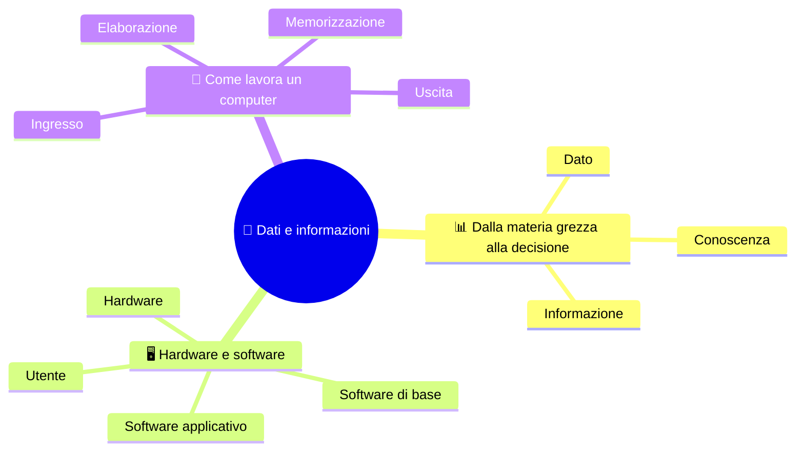
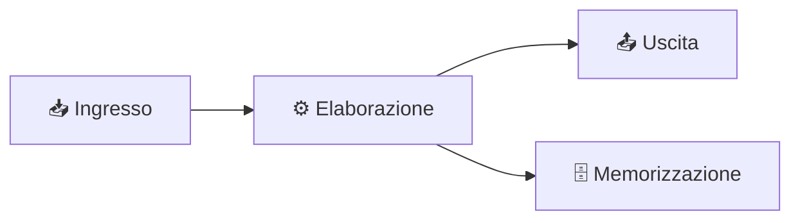

# 🧩 Dati e informazioni

**1CI · Settembre-Ottobre · S2 · Teoria**
⏱️ **Tempo di studio: circa 15 minuti per i soli ✅** · 🔍 altri 5 · 🤓 facoltativo · nessun compito a casa obbligatorio.

> **Legenda:** ✅ da sapere · 🔍 per capire fino in fondo · 🤓 facoltativo, per curiosi · 📜 storia · ⚙️ tecnica · 🧪 esempio · 🧠 da ricordare · ✏️ da fare · ⚠️ errore comune · 🎮 gioco · 🃏 flashcard: rispondi a voce, poi apri per controllare



## 📊 Dato, informazione, conoscenza

Immagina di trovare un foglietto con scritto soltanto **39**. Che cos'è? Un'età? Un prezzo? Una temperatura? Un numero di scarpe? Il foglietto non lo dice. Ma basta aggiungere due parole e cambia tutto: **39 °C di febbre**. 🌡️

Questo piccolo passo è il cuore dell'informatica: i computer maneggiano miliardi di numeri, ma a noi servono quando **significano qualcosa**.

### ✅ Tre gradini

```text
  CONOSCENZA   «Ho la febbre: resto a casa e riposo»
      ^
  INFORMAZIONE «39 °C di febbre»
      ^
  DATO         39
```

- **Dato**: un fatto grezzo, senza contesto. Esempi: `39`, `rosso`, `120`.
- **Informazione**: il dato **con il suo contesto**. Ha un significato per chi legge.
- **Conoscenza**: l'informazione **usata** con l'esperienza, per decidere.

🧠 ==Informazione = dato + contesto.==

📜 La parola *dato* viene dal latino *datum*: «ciò che è dato», cioè ciò che ti arriva da misurare o osservare.

⚠️ **Dato e informazione non sono sinonimi.** Un computer può archiviare miliardi di dati: se nessuno li interpreta, restano inutili.

<details>
<summary>🃏 <b>Che cos'è un dato?</b></summary>
Un fatto grezzo, senza contesto: per esempio 39.
</details>

<details>
<summary>🃏 <b>Che cos'è un'informazione?</b></summary>
Un dato con il suo contesto, cioè con un significato: per esempio «39 °C di febbre».
</details>

<details>
<summary>🃏 <b>Che cos'è la conoscenza?</b></summary>
L'informazione usata con l'esperienza per decidere o risolvere un problema.
</details>

<details>
<summary>🃏 <b>Dato e informazione sono la stessa cosa?</b></summary>
No. L'informazione è il dato più il contesto che gli dà significato.
</details>

### 🔍 Lo stesso dato, tanti contesti

Il dato `120` può diventare informazioni molto diverse:

| Dato | Contesto | Informazione |
|---|---|---|
| 120 | frequenza cardiaca | 120 battiti al minuto |
| 120 | velocità | 120 km/h |
| 120 | prezzo | 120 € |

Cambia il contesto, cambia il significato. Anche un **errore di contesto** è un errore: 120 km/h in centro è un guaio, 120 € per un panino è un furto.

<details>
<summary>🃏 <b>Che cosa cambia se il contesto di 120 passa da «velocità» a «prezzo»?</b></summary>
Il dato resta lo stesso, ma l'informazione cambia completamente.
</details>

## 🖥️ Hardware e software

### ✅ Che cosa vede l'utente e che cosa c'è sotto

Il computer funziona a **livelli**. Ognuno usa quello sotto di sé.

```text
┌────────────────────────────────────────────┐
│ UTENTE                                     │
├────────────────────────────────────────────┤
│ SOFTWARE APPLICATIVO  (browser, Word, gioco)│
├────────────────────────────────────────────┤
│ SOFTWARE DI BASE      (sistema operativo)  │
├────────────────────────────────────────────┤
│ HARDWARE              (CPU, RAM, SSD, ...) │
└────────────────────────────────────────────┘
```

📌 *Didascalia:* ogni livello si appoggia a quello sotto.

- **Hardware**: le parti fisiche. Esempi: processore, memoria, scheda madre, schermo.
- **Software di base**: il **sistema operativo** (Windows, Linux, macOS, Android). Fa da ponte fra hardware e programmi.
- **Software applicativo**: i programmi per un compito dell'utente. Esempi: browser, Word, videogiochi.

🧠 ==Hardware = ciò che tocchi. Software = istruzioni e dati che esegue.==

📜 La parola *software* si deve a John W. Tukey, che la usò nel 1958 in contrasto con *hardware*, che in inglese è la «ferramenta». Letteralmente: la parte «dura» e quella «morbida». 😄

⚠️ **Il sistema operativo non è hardware.** È un programma, anche se lavora molto vicino alla macchina. Lo studieremo meglio a novembre.

<details>
<summary>🃏 <b>Che cos'è il software di base?</b></summary>
Il sistema operativo: fa da ponte fra l'hardware e i programmi dell'utente.
</details>

<details>
<summary>🃏 <b>Che cos'è il software applicativo?</b></summary>
Un programma per un compito specifico dell'utente, come un browser o Word.
</details>

<details>
<summary>🃏 <b>Il sistema operativo è hardware o software?</b></summary>
Software: è un programma, anche se lavora vicino alla macchina.
</details>

<details>
<summary>🃏 <b>Chi usa chi, nello schema a livelli?</b></summary>
L'utente usa i programmi; i programmi usano il sistema operativo; il sistema operativo usa l'hardware.
</details>

### 🤓 Astrazione

> Quando premi `Ctrl+S` non pensi ai transistor del disco. Ogni livello **nasconde i dettagli** di quello sotto: si chiama **astrazione**. I dettagli esistono ancora, ma coperti da uno strato più comodo. È la grande idea che permette di costruire cose complicate: nessuno le tiene in testa tutte insieme.

## 🔄 Come lavora un computer

### ✅ Ingresso, elaborazione, uscita, memorizzazione

Ogni lavoro del computer, dal clic al risultato, passa per **quattro funzioni**.



📌 *Didascalia:* i dati entrano, vengono elaborati, escono o vengono conservati.

| Funzione | Che cosa fa | Esempi |
|---|---|---|
| 📥 **Ingresso** | riceve dati dall'esterno | tastiera, mouse, microfono, sensore |
| ⚙️ **Elaborazione** | trasforma i dati con un programma | CPU |
| 📤 **Uscita** | mostra il risultato | schermo, altoparlanti, stampante |
| 🗄️ **Memorizzazione** | conserva i dati nel tempo | SSD, hard disk, chiavetta USB |

🧪 **Scatti una foto con il telefono.** Ingresso: la fotocamera. Elaborazione: il telefono migliora i colori. Uscita: la foto sullo schermo. Memorizzazione: il file nella galleria.

🧠 ==Un computer non fa altro: riceve, elabora, mostra, conserva.==

🔧 *In laboratorio vedrai dove vivono i file sul disco. Per ora basta sapere che un file è un **dato con un nome**.*

<details>
<summary>🃏 <b>Quali sono le quattro funzioni di un computer?</b></summary>
Ingresso, elaborazione, uscita, memorizzazione.
</details>

<details>
<summary>🃏 <b>Quale componente fa l'elaborazione?</b></summary>
La CPU, il processore.
</details>

<details>
<summary>🃏 <b>A che cosa serve la memorizzazione?</b></summary>
A conservare i dati nel tempo, anche quando il computer si spegne.
</details>

### 🔍 Le periferiche sono ingresso, uscita o tutte e due?

Alcune periferiche fanno **entrambe** le cose. Lo schermo touch mostra (uscita) e riceve il tocco (ingresso). Una chiavetta USB riceve file (ingresso) e li restituisce (uscita), ma la sua funzione principale è memorizzare.

Per classificare, chiediti: **«In questo momento, dove vanno i dati: dentro o fuori dal computer?»**.

<details>
<summary>🃏 <b>Lo schermo touch è ingresso o uscita?</b></summary>
Tutte e due: mostra le immagini (uscita) e riceve il tocco (ingresso).
</details>

## ✏️ Metti alla prova

1. **Prevedi.** Il dato `18` può diventare tre informazioni diverse. Scrivine tre, con contesti diversi.
2. **Riordina.** Metti in ordine dal più semplice al più utile: «Posso uscire senza giacca», «21 °C», «Oggi a Torino ci sono 21 °C».
3. **Disegna.** Disegna lo schema a quattro livelli (utente, applicativo, di base, hardware) e metti uno strumento reale in ciascun livello.
4. **Trova l'errore.** Un compagno dice: «Windows è hardware perché è dentro il PC». Che cosa gli rispondi?
5. **Classifica.** Per ogni caso scrivi: ingresso, elaborazione, uscita o memorizzazione. Microfono, CPU, cuffie, SSD, webcam, schermo.
6. **Spiega.** Racconta a voce, in tre frasi, che cosa succede dall'istante in cui scrivi un messaggio a quello in cui compare sullo schermo, usando le quattro funzioni.

🚪 **Uscita:** scrivi un dato e poi un contesto che lo trasformi in informazione.

🏠 *Facoltativo:* guarda una notizia e trova un numero senza contesto.

## 📚 Fonti e risorse

- **Dato**: [it.wikipedia.org/wiki/Dato_(informatica)](https://it.wikipedia.org/wiki/Dato_%28informatica%29). Definizione ed esempi: leggi solo l'introduzione.
- **Software** (in inglese): [en.wikipedia.org/wiki/Software](https://en.wikipedia.org/wiki/Software). Per vedere la storia della parola.

---

[⬅️ S1 - Informatica e computer](%28STU%29%201CI%20sett-ott%20S1%20-%20Informatica%20e%20computer.md) · [🗺️ Indice](%28STU%29%201CI%20-%20SETT-OTT.md) · [S3 - Bit e byte ➡️](%28STU%29%201CI%20sett-ott%20S3%20-%20Bit%20e%20byte.md)
