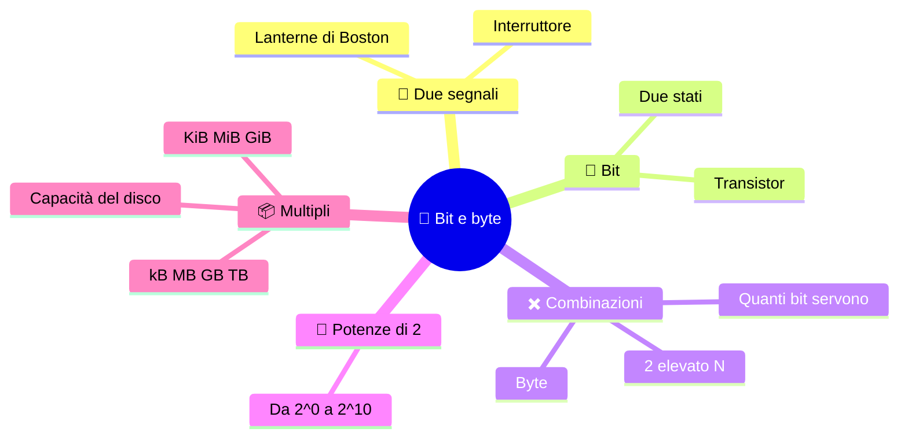

# 🔘 Bit e byte

**1CI · Settembre-Ottobre · S3 · Teoria**
⏱️ **Tempo di studio: circa 20 minuti per i soli ✅** · 🔍 altri 5 · 🤓 facoltativo · nessun compito a casa obbligatorio.

> **Legenda:** ✅ da sapere · 🔍 per capire fino in fondo · 🤓 facoltativo, per curiosi · 📜 storia · ⚙️ tecnica · 🧪 esempio · 🧠 da ricordare · ✏️ da fare · ⚠️ errore comune · 🎮 gioco · 🃏 flashcard: rispondi a voce, poi apri per controllare



## 📜 Due segnali bastano

Boston, aprile 1775. Le colonie americane sono in rivolta contro il dominio britannico e la guerra d'indipendenza sta per cominciare. I patrioti vogliono avvisare chi si trova fuori città dell'arrivo delle truppe inglesi: dal campanile della Old North Church si concorda di mostrare **una lanterna** se arrivano via terra, **due lanterne** se arrivano via mare. Il segnale comunica una scelta fra due possibilità, proprio come un bit.

Ecco l'idea più importante del corso: con **scelte fra due** si possono dire molte cose, se le si mettono in fila. Il computer è fatto così. Dentro non ci sono numeri, lettere o colori: ci sono **interruttori**. 💡

## 🔘 Il bit

### ✅ Un interruttore con due stati

Un **bit** (*binary digit*, cifra binaria) è la più piccola unità di informazione: ha **due stati**, che scriviamo `0` e `1`.

```text
interruttore spento   interruttore acceso
        0                     1
```

📌 *Didascalia:* un bit = una scelta fra due.

Nel computer i bit vivono nei **transistor**: minuscoli interruttori elettronici. Semplificando, o lasciano passare corrente (1) o no (0).

🧠 ==Un bit è una scelta fra due possibilità: 0 oppure 1.==

⚠️ **Un bit non è «0 e 1 insieme».** Ha *un* valore alla volta. E da solo non è né una lettera né una foto: è solo un posto dove scegliere fra due.

<details>
<summary>🃏 <b>Che cos'è un bit?</b></summary>
La più piccola unità di informazione: una scelta fra due stati, 0 o 1.
</details>
<details>
<summary>🃏 <b>Che cos'è un transistor, in modo semplice?</b></summary>
Un minuscolo interruttore elettronico: passa corrente (1) o non passa (0).
</details>

![[image-1-21.webp|229x191]]*Dei transistor. Questi sono giganti, quelli che abbiamo nei computer si vedono solo al microscopio elettronico.*

### 🤓 Chi ha inventato il bit

> **1679-1703, Leibniz.** Il filosofo e matematico tedesco Gottfried Leibniz studia i numeri con solo 0 e 1 e li pubblica nel 1703. Per lui 1 era la Creazione e 0 il Nulla.
> **1937, Shannon.** Un ventunenne, Claude Shannon, nella sua tesi al MIT (un'università americana prestigiosissima) mostra che i relè (interruttori accesi o spenti) possono eseguire la logica di George Boole.
> **1947, Tukey.** John Tukey, dei Bell Labs, conia la parola *bit*, dalla fusione di *binary digit*.
> **1948, Shannon** la usa come unità di misura dell'informazione.

<details>
<summary>🃏 <b>Chi ha coniato la parola bit?</b></summary>
John Tukey, nel 1947. Shannon la rese l'unità dell'informazione nel 1948.
</details>
<details>
<summary>🃏 <b>Che cosa mostrò Shannon nella sua tesi del 1937?</b></summary>
Che i relè, interruttori accesi o spenti, possono eseguire la logica di Boole.
</details>

![[image-1-22.webp|176x176]]*Un relé (o "relay", in inglese): un'interruttore elettromagnetico.*

## ✖️ Quante combinazioni

### ✅ Ogni bit raddoppia, i byte sono 8 bit
Se usiamo i bit per rappresentare i numeri.
Con **1 bit** hai 2 possibilità (zero, uno). Con **2 bit** ne hai 4 (zero, uno, due, tre). Con **3 bit**, 8. Ogni bit in più **raddoppiano** le possibilità di rappresentazione.

| Bit | Calcolo | Combinazioni | Esempi |
|---:|---:|---:|---|
| 1 | 2¹ | 2 | `0`, `1` |
| 2 | 2² | 4 | `00`, `01`, `10`, `11` |
| 3 | 2³ | 8 | da `000` a `111` |
| 4 | 2⁴ | 16 | da `0000` a `1111` |
| 8 | 2⁸ | 256 | da `00000000` a `11111111` |

🧠 Con N bit puoi scrivere 2^N combinazioni diverse.

⚠️ **2^N non è 2·N.** Con 3 bit le combinazioni sono 2·2·2 = **8**, non 2·3 = 6.

Un gruppo di **8 bit** si chiama **byte**. Un byte ha 256 combinazioni: se le usiamo per contare, vanno da **0 a 255**. Sono 256 numeri perché si conta anche lo zero.

🧪 Con due bit le combinazioni sono già `00`, `01`, `10`, `11`: non ne esiste una quinta. Testi, foto e musica devono essere tradotti in gruppi finiti di bit.

⚠️ **Un byte non è un carattere.** Può bastare per un carattere semplice, ma in generale è un'unità di quantità, non di significato.

<details>
<summary>🃏 <b>Quante combinazioni si ottengono con N bit?</b></summary>
2^N.
</details>
<details>
<summary>🃏 <b>Che cos'è un byte?</b></summary>
Un gruppo di 8 bit: 256 combinazioni, per esempio i numeri da 0 a 255.
</details>
<details>
<summary>🃏 <b>Perché con un byte i numeri vanno da 0 a 255 e non da 1 a 256?</b></summary>
Perché si conta anche lo zero: sono 256 valori in tutto.
</details>
<details>
<summary>🃏 <b>Con 3 bit le combinazioni sono 6?</b></summary>
No: sono 2·2·2 = 8. Ogni bit raddoppia, non aggiunge 2.
</details>

### 🔍 Quanti bit servono

Vuoi dare un codice diverso a **20 oggetti**. Con 4 bit hai 16 combinazioni: **non bastano**. Con 5 bit ne hai 32: bastano, anzi ne avanzano 12.

```text
4 bit ->  16  < 20   non bastano
5 bit ->  32 >= 20   bastano
```

📌 Regola: scegli il **più piccolo N** tale che 2^N sia almeno quanto ti serve.

<details>
<summary>🃏 <b>Come si trova quanti bit servono per dare un codice a un certo numero di oggetti?</b></summary>
Si cerca il più piccolo N per cui 2^N è almeno uguale al numero di oggetti.
</details>

## 📏 Potenze di 2

### ✅ Da 2⁰ a 2¹⁰

Questa scala ricorre sempre. Ricordala a memoria: ti farà risparmiare molti conti.

```text
2^0 = 1     2^1 = 2     2^2 = 4      2^3 = 8
2^4 = 16    2^5 = 32    2^6 = 64     2^7 = 128
2^8 = 256   2^9 = 512   2^10 = 1024
```

📌 Ogni numero è il **doppio** del precedente.

✏️ *Trucco:* ricorda solo fino a 2⁴ = 16 e poi **raddoppia** a mente: 32, 64, 128, 256, 512, 1024.

<details>
<summary>🃏 <b>Quanto fa 2^8?</b></summary>
256.
</details>
<details>
<summary>🃏 <b>Quanto fa 2^10?</b></summary>
1024.
</details>
<details>
<summary>🃏 <b>Come si passa da una potenza di 2 alla successiva?</b></summary>
Raddoppiando il numero.
</details>

## 📦 Multipli del byte

### ✅ kB, MB, GB, TB

Per quantità grandi si usano i **multipli**. Di solito, per la capacità dei dischi:

| Simbolo | Valore | In parole |
|---|---:|---|
| kB (kilobyte) | 10³ byte | mille byte |
| MB (megabyte) | 10⁶ byte | un milione |
| GB (gigabyte) | 10⁹ byte | un miliardo |
| TB (terabyte) | 10¹² byte | mille miliardi |

🧪 *Ordini di grandezza indicativi:* una foto del telefono pesa qualche MB; un film in alta definizione qualche GB. Dipende dalla qualità.

<details>
<summary>🃏 <b>Quanti byte sono 1 GB (nella scala decimale)?</b></summary>
Un miliardo: 10⁹ byte.
</details>
<details>
<summary>🃏 <b>Che cos'è un TB?</b></summary>
Un terabyte: 10¹² byte, cioè mille GB.
</details>

### 🔍 kB o KiB

Le memorie elettroniche crescono per **potenze di 2**, e 2¹⁰ = 1024 è vicino a 1000. Per anni «kilobyte» ha voluto dire a volte 1000 e a volte 1024 byte. Alla fine degli anni '90 gli standard hanno separato i due significati con nuovi nomi:

| Scala decimale | Valore | Scala binaria | Valore |
|---|---:|---|---:|
| kB | 10³ | KiB | 2¹⁰ = 1024 |
| MB | 10⁶ | MiB | 2²⁰ |
| GB | 10⁹ | GiB | 2³⁰ |
| TB | 10¹² | TiB | 2⁴⁰ |

🧪 Un disco venduto come **500 GB** ha 500 · 10⁹ byte, cioè circa **465 GiB**. Alcuni sistemi (per esempio Windows) scrivono «GB» ma calcolano in GiB: sembra che manchi spazio. Non è sparito nulla: **sono cambiate le unità**.

😄 *La capacità del disco è come i «100 grammi» di una scatola di biscotti: dipende da chi sta pesando.*

<details>
<summary>🃏 <b>Qual è la differenza fra kB e KiB?</b></summary>
Un kB sono 1000 byte; un KiB sono 1024 byte (2¹⁰).
</details>
<details>
<summary>🃏 <b>Perché un disco da 500 GB sembra più piccolo nel computer?</b></summary>
Perché il produttore conta in GB (10⁹ byte) e il sistema può mostrare GiB (2³⁰ byte): cambiano le unità, non lo spazio.
</details>

### 🤓 Quanto costa un bit

> Conservare e spostare bit richiede energia: i **data center**, enormi edifici pieni di computer, consumano molta elettricità e hanno bisogno di raffreddamento. Anche una foto che «sta nel cloud» sta in un edificio reale, che costa energia e acqua. Ridurre sprechi (cancellare file inutili, comprimere, evitare copie) è un piccolo gesto che ha una logica, ma non risolve da solo: contano soprattutto come sono progettati e alimentati i servizi.

![[image-1-23.webp|281x158]]*Un datacenter*

## ✏️ Metti alla prova

1. **Prevedi.** Quante combinazioni si ottengono con 6 interruttori? Scrivi un numero a intuito, poi calcolalo.
2. **Completa.** Scrivi tutte le combinazioni di 3 bit **senza ripeterne** nessuna. Quante sono? Controlla con 2^N.
3. **Trova l'errore.** «Con 5 bit ho 10 combinazioni, perché 2·5 = 10.» Spiega dov'è l'errore.
4. **Quanti bit servono.** Vuoi dare un codice diverso a 30 studenti. Quanti bit servono? Mostra come hai scelto.
5. **Disegna.** Disegna un byte come una fila di otto interruttori e coloralo per scrivere una combinazione a tua scelta.
6. **Collega.** Una chiavetta da «64 GB» mostra una capacità un po' più bassa nel PC. Spiega perché senza dire «è rotta».

🚪 **Uscita:** scrivi 2⁶ e spiega in una frase che cos'è un byte.

🏠 *Facoltativo:* guarda in un telefono o in un PC la capacità del disco e scrivi quale unità usa.

## 📚 Fonti e risorse

- **CS Unplugged, numeri binari** (in inglese): [csunplugged.org](https://www.csunplugged.org/en/topics/binary-numbers/). Attività con carte: giocale in coppia per «sentire» il raddoppio.
- **Bit**: [it.wikipedia.org/wiki/Bit](https://it.wikipedia.org/wiki/Bit). Definizione e storia.
- **Byte**: [it.wikipedia.org/wiki/Byte](https://it.wikipedia.org/wiki/Byte). Per vedere perché 8 bit sono una convenzione.
- **Prefissi binari, NIST** (in inglese): [physics.nist.gov](https://physics.nist.gov/cuu/Units/binary.html). Tabella ufficiale da KiB in su.

---

[⬅️ S2 - Dati e informazioni](%28STU%29%201CI%20sett-ott%20S2%20-%20Dati%20e%20informazioni.md) · [🗺️ Indice](%28STU%29%201CI%20-%20SETT-OTT.md) · [S4 - Binario e decimale ➡️](%28STU%29%201CI%20sett-ott%20S4%20-%20Binario%20e%20decimale.md)
