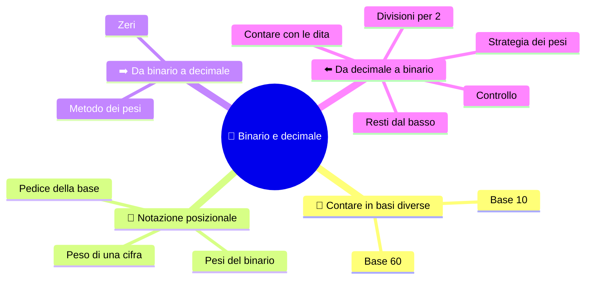

⬅️ [S3 - Bit e byte](%28STU%29%201CI%20sett-ott%20S3%20-%20Bit%20e%20byte.md) · 🏠 [Indice](%28STU%29%201CI%20-%20SETT-OTT.md) · [S5 - Esadecimale e ottale](%28STU%29%201CI%20sett-ott%20S5%20-%20Esadecimale%20e%20ottale.md) ➡️

# 🔢 Binario e decimale

**1CI · Settembre-Ottobre · S4 · Teoria**
⏱️ **Tempo di studio: circa 20 minuti per i soli ✅** · 🔍 altri 5 · 🤓 facoltativo · nessun compito a casa obbligatorio.

> **Legenda:** ✅ da sapere · 🔍 per capire fino in fondo · 🤓 facoltativo, per curiosi · 📜 storia · ⚙️ tecnica · 🧪 esempio · 🧠 da ricordare · ✏️ da fare · ⚠️ errore comune · 🎮 gioco · 🃏 flashcard: rispondi a voce, poi apri per controllare



## 📜 Perché contiamo in base 10

Abbiamo dieci dita, quindi contiamo a **dieci**. Ma non è l'unico modo. I babilonesi, quattromila anni fa, contavano a **sessanta**: per questo un'ora ha 60 minuti. I Maya contavano a **venti**. I computer contano a **due**, perché i loro interruttori hanno due stati.

La grande invenzione, in India e poi nel mondo arabo, fu la **posizione**: la stessa cifra vale di più o di meno a seconda di dove sta. Con la posizione e lo zero bastano poche cifre per scrivere numeri enormi. Il binario usa la **stessa idea**, con meno cifre.

![[Scuola/Public/1CI - Informatica/1 SETT-OTT/Allegati/image-1.webp|171x246]]*Una tavoletta babilonese*

## 📍 Il valore dipende dalla posizione

### ✅ I pesi

In `345` il `3` non vale tre: vale tre **centinaia**.

$$345 = 3\cdot 10^2 + 4\cdot 10^1 + 5\cdot 10^0$$

Le colonne hanno **pesi** 100, 10, 1: potenze di **10**.

In binario le colonne hanno pesi che sono potenze di **2**:

```text
peso:        32   16    8    4    2    1
              ^    ^    ^    ^    ^    ^
             2^5  2^4  2^3  2^2  2^1  2^0
```

📌 *Didascalia:* da destra a sinistra, ogni peso è il doppio del precedente.

🧠 <u>Cambia la base, non l'idea: il valore di una cifra dipende dalla sua posizione.</u>

Per non confondersi si scrive la **base come pedice**: `10` in base 10 vale dieci; `10` in base 2 vale due. Si scrive $(10)_{10}$ e $(10)_2$.

<details>
<summary>🃏 <b>Che cos'è il peso di una cifra?</b></summary>
Il valore della colonna in cui si trova: in base 2 sono le potenze di 2, da destra 1, 2, 4, 8…
</details>
<details>
<summary>🃏 <b>Come cambiano i pesi in binario, andando verso sinistra?</b></summary>
Raddoppiano a ogni posizione: 1, 2, 4, 8, 16, 32…
</details>
<details>
<summary>🃏 <b>A che cosa serve il pedice della base?</b></summary>
A capire in quale base è scritto un numero: (10)₂ vale due, (10)₁₀ vale dieci.
</details>

## ➡️ Da binario a decimale

### ✅ Metodo dei pesi

1. Scrivi i pesi **da destra verso sinistra**: 1, 2, 4, 8…
2. Metti ogni cifra sotto il suo peso.
3. **Somma solo i pesi che hanno un 1.**

🧪 Esempio svolto: $(1101)_2$.

```text
peso:     8   4   2   1
cifra:    1   1   0   1
valore:   8 + 4 + 0 + 1 = 13
quindi (1101)2 = (13)10
```

🧪 Un altro: $(101101)_2$.

```text
peso:    32  16   8   4   2   1
cifra:    1   0   1   1   0   1
valore:  32 + 0 + 8 + 4 + 0 + 1 = 45
quindi (101101)2 = (45)10
```

⚠️ **Gli zeri contano.** Non aggiungono valore, ma tengono ogni cifra al suo posto.
⚠️ **Non leggere** `101101` come «centounomilacentouno»: leggilo come una scelta di pesi.

<details>
<summary>🃏 <b>Come si converte un numero da binario a decimale?</b></summary>
Si scrivono i pesi 1, 2, 4, 8… da destra e si sommano quelli sotto un 1.
</details>
<details>
<summary>🃏 <b>Da quale lato si comincia a scrivere i pesi?</b></summary>
Da destra: lì c'è il peso 1.
</details>
<details>
<summary>🃏 <b>Perché gli zeri sono importanti in un numero binario?</b></summary>
Perché mantengono ogni cifra nella sua posizione e quindi con il suo peso.
</details>

### 🔍 Zeri a sinistra, zeri a destra

Come in decimale: `025` e `25` valgono lo stesso, ma `250` vale dieci volte tanto. In binario:

- `0011` = `11` (zeri a **sinistra** non cambiano il valore);
- `110` = 6, mentre `1100` = 12: uno zero a **destra** **raddoppia** il numero.

🧪 Per questo i nibble e i byte si scrivono con gli zeri iniziali: `00000101` e `101` sono lo stesso numero.

<details>
<summary>🃏 <b>Che cosa succede aggiungendo uno zero a destra di un numero binario?</b></summary>
Il numero raddoppia, come in decimale uno zero a destra lo moltiplica per 10.
</details>
<details>
<summary>🃏 <b>Gli zeri a sinistra cambiano il valore?</b></summary>
No: 0011 e 11 valgono lo stesso.
</details>

## ⬅️ Da decimale a binario

### ✅ Divisioni successive per 2

1. Dividi il numero per 2 e scrivi il **resto** (0 o 1).
2. Dividi il **quoziente** per 2. Continua fino a quoziente 0.
3. Leggi i resti **dal basso verso l'alto**.

🧪 Esempio svolto: $45_{10}$.

```text
45 : 2 = 22  resto 1   ^
22 : 2 = 11  resto 0   |
11 : 2 =  5  resto 1   |   leggi
 5 : 2 =  2  resto 1   |   in questo
 2 : 2 =  1  resto 0   |   verso
 1 : 2 =  0  resto 1   |

risultato: 101101
```

📌 *Didascalia:* il primo resto è il bit di peso 1, l'ultimo è il primo a sinistra.

🧠 <u>Si dividono per 2 i quozienti, e i resti si leggono dal basso verso l'alto.</u>

⚠️ **Errore tipico:** leggere i resti dall'alto: il risultato viene **rovesciato**.

✅ **Controllo:** torna indietro con i pesi. Se ottieni ancora 45, il procedimento è giusto.

<details>
<summary>🃏 <b>Come si converte un numero da decimale a binario?</b></summary>
Si divide per 2 più volte fino a quoziente 0, annotando i resti, che si leggono dal basso verso l'alto.
</details>
<details>
<summary>🃏 <b>In che verso si leggono i resti?</b></summary>
Dal basso verso l'alto: l'ultimo resto è il primo a sinistra.
</details>
<details>
<summary>🃏 <b>Come si controlla una conversione?</b></summary>
Si torna indietro con il metodo dei pesi e si vede se esce il numero di partenza.
</details>

### 🔍 Strategia dei pesi, un controllo mentale

Cerca il **peso più grande che sta nel numero**, sottrailo e continua col resto.

🧪 Per $25$:

```text
25 contiene 16  -> resto 9
 9 contiene  8  -> resto 1
 1 contiene  1  -> resto 0

pesi usati: 16, 8, 1   ->   11001
```

Metti `1` sotto i pesi usati e `0` sotto gli altri. È un buon **controllo** delle divisioni.

<details>
<summary>🃏 <b>Come funziona la strategia dei pesi?</b></summary>
Si sottrae il peso più grande che sta nel numero e si ripete col resto: i pesi usati diventano 1, gli altri 0.
</details>

### 🤓 Contare fino a 31 con una mano

> Ogni dito è un bit: **alzato = 1, abbassato = 0**. Con una mano (5 dita) hai 2⁵ = 32 combinazioni: puoi contare da **0 a 31**. Con due mani, 2¹⁰ = 1024 combinazioni: da 0 a 1023. 🖐️ Attenzione al 4 (`00100`): ti toccherà alzare solo il dito medio. 😉

<details>
<summary>🃏 <b>Fino a quanto si può contare con le dita di una mano usando il binario?</b></summary>
Da 0 a 31: 5 bit danno 32 combinazioni.
</details>

## ✏️ Metti alla prova

1. **Prevedi.** Senza calcolare: $(10000)_2$ è più grande o più piccolo di $(1111)_2$? Poi controlla con i pesi.
2. **Pesi.** Converti $(10110)_2$ in decimale e scrivi la tabella dei pesi.
3. **Divisioni.** Converti $22_{10}$ in binario con le divisioni. Controlla tornando ai pesi.
4. **Trova l'errore.** Un compagno converte $12_{10}$ e scrive 0011, leggendo i resti dall'alto. Che cosa ha sbagliato? Qual è la risposta giusta?
5. **Riordina.** Metti in ordine di valore: $(1001)_2$, $(111)_2$, $(10100)_2$, $(1101)_2$.
6. **Collega.** Perché il numero $(1000)_2$ è uguale a $2^3$? Che cosa hanno in comune tutti i numeri binari fatti da un 1 seguito da zeri?

🚪 **Uscita:** scrivi $(26)_{10}$ in binario e controlla il risultato.

🏠 *Facoltativo:* conta con le dita fino a 15 usando il binario e mostralo a casa.

## 📚 Fonti e risorse

- **CS Unplugged, numeri binari** (in inglese): [csunplugged.org](https://www.csunplugged.org/en/topics/binary-numbers/). Con le carte a puntini si capiscono i pesi senza calcoli.
- **Sistema numerico binario**: [it.wikipedia.org](https://it.wikipedia.org/wiki/Sistema_numerico_binario). Per rivedere metodi e storia.
- **Convertitore binario-decimale-esadecimale** (in inglese): [mathsisfun.com](https://www.mathsisfun.com/binary-decimal-hexadecimal-converter.html). Usalo **solo per controllare** dopo aver fatto a mano.

---

⬅️ [S3 - Bit e byte](%28STU%29%201CI%20sett-ott%20S3%20-%20Bit%20e%20byte.md) · 🏠 [Indice](%28STU%29%201CI%20-%20SETT-OTT.md) · [S5 - Esadecimale e ottale](%28STU%29%201CI%20sett-ott%20S5%20-%20Esadecimale%20e%20ottale.md) ➡️
