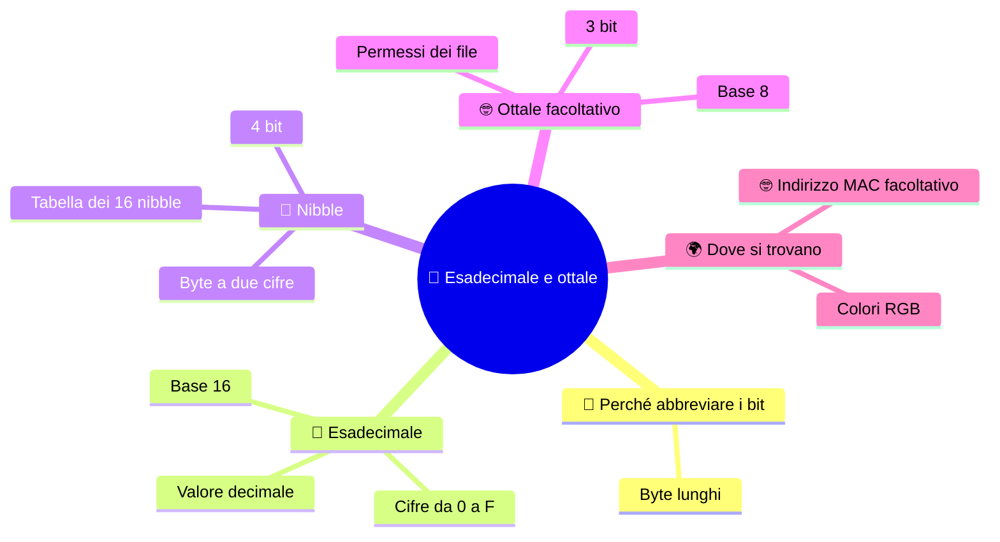

⬅️ [S4 - Binario e decimale](%28STU%29%201CI%20sett-ott%20S4%20-%20Binario%20e%20decimale.md) · 🏠 [Indice](%28STU%29%201CI%20-%20SETT-OTT.md) · [S6 - Convertire a gruppi](%28STU%29%201CI%20sett-ott%20S6%20-%20Convertire%20a%20gruppi.md) ➡️

# 🔣 Esadecimale e ottale

**1CI · Settembre-Ottobre · S5 · Teoria**
⏱️ **Tempo di studio: circa 20 minuti per i soli ✅** · 🔍 altri 5 · 🤓 facoltativo · nessun compito a casa obbligatorio.

> **Legenda:** ✅ da sapere · 🔍 per capire fino in fondo · 🤓 facoltativo, per curiosi · 📜 storia · ⚙️ tecnica · 🧪 esempio · 🧠 da ricordare · ✏️ da fare · ⚠️ errore comune · 🎮 gioco · 🃏 flashcard: rispondi a voce, poi apri per controllare



## 📜 Un byte è lungo

Leggi questo byte: `11111010`. Ora leggilo a voce senza sbagliare. Difficile? Ora immagina di leggerne **cento**, per cercare un errore in un programma.

I tecnici dei primi grandi calcolatori ci hanno pensato: i bit vanno bene per la macchina, ma **noi** abbiamo bisogno di una scrittura più corta. Non una scrittura diversa: **la stessa, ma compatta**. Hanno scelto la base **16**. Il byte `11111010` diventa `FA`.

## 🔣 Esadecimale

### ✅ Base 16

Il sistema **esadecimale** usa **sedici cifre**. Dopo il 9 servono altri sei simboli: le prime lettere.

```text
decimale:     0  1  2  3  4  5  6  7  8  9  10 11 12 13 14 15
esadecimale:  0  1  2  3  4  5  6  7  8  9  A  B  C  D  E  F
```

📌 *Didascalia:* A vale dieci, F vale quindici.

🧠 <u>In esadecimale A, B, C, D, E, F sono cifre e valgono da 10 a 15.</u>

⚠️ **A non è una parola e non è una variabile.** In base 16 è un numero: dieci.

Si scrive con il pedice 16, oppure con un prefisso: $(2F)_{16}$ oppure `0x2F`.

<details>
<summary>🃏 <b>Quante cifre ha il sistema esadecimale e quali sono?</b></summary>
Sedici: da 0 a 9 e poi A, B, C, D, E, F.
</details>
<details>
<summary>🃏 <b>Quanto valgono A e F?</b></summary>
A vale 10, F vale 15.
</details>
<details>
<summary>🃏 <b>In esadecimale, A è una lettera?</b></summary>
No: è una cifra e vale dieci.
</details>

### 🔍 Da esadecimale a decimale

Si usano i **pesi di 16**: 1, 16, 256… Per $(2F)_{16}$:

$$2 \cdot 16 + 15 \cdot 1 = 32 + 15 = 47$$

Quindi $(2F)_{16} = (47)_{10}$. È lo stesso metodo dei pesi, con la base 16.

<details>
<summary>🃏 <b>Quali sono i pesi in esadecimale?</b></summary>
Le potenze di 16, da destra: 1, 16, 256…
</details>

## 🧩 Nibble

### ✅ 1 cifra esadecimale = 4 bit

Quattro bit hanno $2^4 = 16$ combinazioni: **tante quante le cifre esadecimali**. Un gruppo di 4 bit si chiama **nibble** (in inglese «piccolo morso», come *byte* si legge «bite»). 🍽️

Ogni cifra esadecimale corrisponde **esattamente** a un nibble:

| Nibble | Hex | Decimale | | Nibble | Hex | Decimale |
|---|:-:|---:|---|---|:-:|---:|
| `0000` | 0 | 0 | | `1000` | 8 | 8 |
| `0001` | 1 | 1 | | `1001` | 9 | 9 |
| `0010` | 2 | 2 | | `1010` | A | 10 |
| `0011` | 3 | 3 | | `1011` | B | 11 |
| `0100` | 4 | 4 | | `1100` | C | 12 |
| `0101` | 5 | 5 | | `1101` | D | 13 |
| `0110` | 6 | 6 | | `1110` | E | 14 |
| `0111` | 7 | 7 | | `1111` | F | 15 |

Un **byte** sono **due nibble**, quindi **due cifre esadecimali**.

```text
byte:    1111 1010
nibble:  1111 | 1010
hex:       F  |   A       ->  FA
```

📌 *Didascalia:* otto bit diventano due cifre, senza fare conti.

🧠 ==1 cifra esadecimale = 4 bit. 2 cifre esadecimali = 1 byte.==

⚠️ **Non è un codice segreto.** È una scrittura abbreviata dei bit: nessun calcolo, solo sostituzione.

<details>
<summary>🃏 <b>Che cos'è un nibble?</b></summary>
Un gruppo di 4 bit.
</details>
<details>
<summary>🃏 <b>Quanti bit rappresenta una cifra esadecimale?</b></summary>
Esattamente 4 bit, un nibble.
</details>
<details>
<summary>🃏 <b>Quante cifre esadecimali servono per un byte?</b></summary>
Due, perché un byte sono due nibble.
</details>
<details>
<summary>🃏 <b>Perché proprio la base 16, e non la 10, per abbreviare i bit?</b></summary>
Perché 16 = 2⁴: una cifra corrisponde esattamente a 4 bit. La base 10 non coincide con gruppi di bit.
</details>

### 🤓 Perché i programmatori amano l'esadecimale

> Un byte in decimale va da 0 a 255: tre cifre, ma **non vedi** i bit. In esadecimale va da `00` a `FF`: sempre due cifre, e ogni cifra è un nibble. Riduce la lunghezza del testo di **quattro volte** rispetto al binario e riduce molti errori di lettura. Per questo si trova negli indirizzi di memoria, nei colori e negli identificatori.

## 🤓 Ottale facoltativo

### 🤓 Base 8 e usi facoltativi

> Il sistema **ottale** usa **otto cifre**: da 0 a 7. Poiché $2^3 = 8$, **una cifra ottale = 3 bit**.
>
> ```text
> bit:    000  001  010  011  100  101  110  111
> ottale:  0    1    2    3    4    5    6    7
> ```
>
> 🧪 Il 13 in ottale si scrive `15`: $1\cdot 8 + 5 = 13$. Non confondere `15` ottale con quindici decimale!
>
> Oggi l'ottale si usa meno dell'esadecimale perché 3 bit si adattano meno bene al byte (8 bit). Ma serve per capire che **la base è una scelta di scrittura**.
>
> 😄 *Perché i programmatori confondono Halloween e Natale? Perché **OCT 31 = DEC 25**.* (31 in ottale vale $3\cdot 8 + 1 = 25$.)
>
> <details>
> <summary>🃏 <b>Quante cifre ha il sistema ottale?</b></summary>
> Otto, da 0 a 7.
> </details>
> <details>
> <summary>🃏 <b>Quanti bit corrispondono a una cifra ottale?</b></summary>
> Tre, perché 8 = 2³.
> </details>
> <details>
> <summary>🃏 <b>Perché OCT 31 = DEC 25?</b></summary>
> Perché 31 in ottale vale 3·8 + 1 = 25.
> </details>
>
> **Permessi dei file.** Nei sistemi Linux e macOS i permessi di un file si possono scrivere con **tre cifre ottali**, per esempio `755`. Ogni cifra descrive in 3 bit chi può leggere, scrivere o eseguire: tre interruttori riassunti da una cifra.
>
> <details>
> <summary>🃏 <b>Dove si usa ancora l'ottale?</b></summary>
> Per esempio nei permessi dei file su Linux e macOS, scritti con tre cifre ottali come 755.
> </details>

## 🌍 Dove si trova l'esadecimale

### ✅ I colori

Il colore sul web si scrive `#RRGGBB`: tre byte, ciascuno scritto con **due cifre esadecimali**. Rosso, verde, blu: **R**ed, **G**reen, **B**lue.

| Codice | Rosso | Verde | Blu | Colore |
|---|:-:|:-:|:-:|---|
| `#FF0000` | FF | 00 | 00 | 🟥 rosso puro |
| `#00FF00` | 00 | FF | 00 | 🟩 verde puro |
| `#0000FF` | 00 | 00 | FF | 🟦 blu puro |
| `#000000` | 00 | 00 | 00 | ⬛ nero |
| `#FFFFFF` | FF | FF | FF | ⬜ bianco |

`FF` vale 255, il massimo di un byte. Più è alto il valore, più c'è quella luce. Mescolando le tre luci si ottengono tutti gli altri colori.

🧠 <u>`#RRGGBB` sono tre byte: quanto rosso, quanto verde, quanto blu.</u>

<details>
<summary>🃏 <b>Che cosa significa #RRGGBB?</b></summary>
Tre byte in esadecimale: la quantità di rosso, di verde e di blu.
</details>
<details>
<summary>🃏 <b>Perché FF è il massimo?</b></summary>
Perché è il byte con tutti gli 8 bit a 1, cioè 255.
</details>

### 🤓 Indirizzo MAC facoltativo

> Un **indirizzo MAC** identifica una **scheda di rete**. È composto da 6 byte, scritti in sei coppie esadecimali:
>
> ```text
> A4:5E:60:1B:2C:90
> ```
>
> Sei coppie, un byte per coppia: **6 byte = 48 bit**. Non serve ricordarlo a memoria: basta riconoscere le coppie e le cifre A-F.
>
> <details>
> <summary>🃏 <b>Quanti byte ha un indirizzo MAC?</b></summary>
> Sei, scritti come sei coppie esadecimali.
> </details>

### 🤓 Un indirizzo che ti segue

> Se il MAC del tuo telefono fosse sempre lo stesso, un negozio potrebbe riconoscerti ogni volta che passi. Per questo i telefoni moderni **usano indirizzi casuali** quando cercano le reti Wi-Fi. Un'idea tecnica che nasce da un problema di **privacy**.

## ✏️ Metti alla prova

1. **Prevedi.** Il colore `#FFFF00` ha rosso e verde al massimo e blu a zero. Che colore ti aspetti? Poi controllalo con un selettore di colori.
2. **Scrivi.** Quanti byte servono per un colore `#RRGGBB`? E quanti bit?
3. **Decimale.** Converti $(3C)_{16}$ in decimale con i pesi di 16.
4. **Trova l'errore.** Un compagno dice: «`1A` in esadecimale vale 1 più A, cioè 11». Che cosa ha sbagliato?
5. **Disegna.** Scrivi `D6` come due nibble, disegnando le due fila di quattro interruttori.

🚪 **Uscita:** spiega in una frase perché una cifra esadecimale corrisponde a 4 bit.

🏠 *Facoltativo:* guarda i colori del tuo sfondo preferito e prova a indovinare se prevale rosso, verde o blu.

> 🤓 **Facoltativo — ottale:** quanto vale $(17)_8$ in decimale? Perché con solo cifre da 0 a 7 non può esistere `18` in ottale?

## 📚 Fonti e risorse

- **Sistema numerico esadecimale**: [it.wikipedia.org](https://it.wikipedia.org/wiki/Sistema_numerico_esadecimale). Cifre e conversioni.
- **Sistema numerico ottale (facoltativo)**: [it.wikipedia.org](https://it.wikipedia.org/wiki/Sistema_numerico_ottale). Breve, per riconoscere le cifre.
- **Selettore di colori HTML** (in inglese): [w3schools.com](https://www.w3schools.com/colors/colors_picker.asp). Muovi il selettore e guarda come cambia il codice `#RRGGBB`.
- **Valori di colore in CSS** (in inglese): [developer.mozilla.org](https://developer.mozilla.org/en-US/docs/Web/CSS/color_value). Per chi vuole vedere come il web usa davvero questi codici.
- **Indirizzo MAC**: [it.wikipedia.org](https://it.wikipedia.org/wiki/Indirizzo_MAC). Struttura a sei byte e uso.

---

⬅️ [S4 - Binario e decimale](%28STU%29%201CI%20sett-ott%20S4%20-%20Binario%20e%20decimale.md) · 🏠 [Indice](%28STU%29%201CI%20-%20SETT-OTT.md) · [S6 - Convertire a gruppi](%28STU%29%201CI%20sett-ott%20S6%20-%20Convertire%20a%20gruppi.md) ➡️
