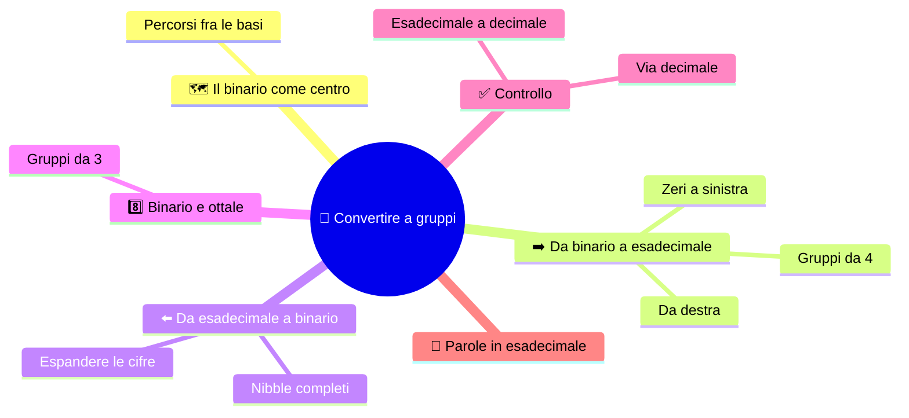
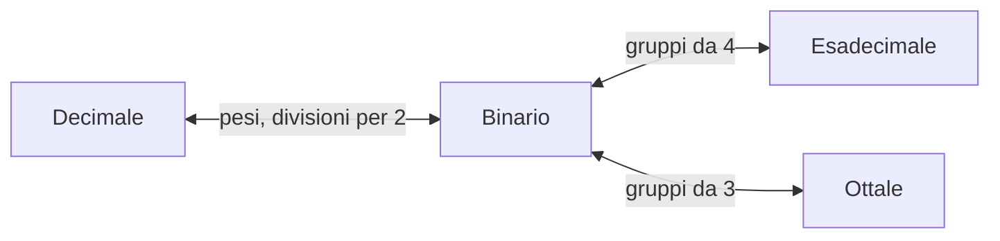

# 🔁 Convertire a gruppi

**1CI · Settembre-Ottobre · S6 · Teoria**
⏱️ **Tempo di studio: circa 20 minuti per i soli ✅** · 🔍 altri 5 · 🤓 facoltativo · nessun compito a casa obbligatorio.

> **Legenda:** ✅ da sapere · 🔍 per capire fino in fondo · 🤓 facoltativo, per curiosi · 📜 storia · ⚙️ tecnica · 🧪 esempio · 🧠 da ricordare · ✏️ da fare · ⚠️ errore comune · 🎮 gioco · 🃏 flashcard: rispondi a voce, poi apri per controllare



## 🗺️ Il binario è il centro

Nelle ultime tre settimane abbiamo incontrato quattro modi di scrivere un numero. Il 13 è `1101` in binario, `D` in esadecimale, `15` in ottale.



📌 *Didascalia:* il binario è il «centro stazione»: per andare da esadecimale a ottale si passa da lì.

🧠 ==Per passare fra binario, esadecimale e ottale non servono conti: servono **gruppi**.==

## ➡️ Da binario a esadecimale

### ✅ Raggruppa a quattro, da destra

1. Dividi i bit in **gruppi di 4, partendo da destra**.
2. Se il primo gruppo a sinistra è incompleto, aggiungi **zeri a sinistra**.
3. Traduci ogni gruppo con la tabella dei nibble (S5).

🧪 Esempio svolto: `11010110`.

```text
1101 | 0110
  D  |   6      ->  D6
```

🧪 Con un gruppo incompleto: `101101`.

```text
10 1101   ->   0010 | 1101
                 2  |   D       ->  2D
```

Gli zeri aggiunti **non sono barare**: `00101101` e `101101` sono lo stesso numero, come `025` e `25`.

⚠️ **Parti da destra**, non da sinistra: a destra c'è il bit di peso 1. Se parti da sinistra i gruppi cambiano e il risultato è sbagliato.

<details>
<summary>🃏 <b>Come si converte un numero da binario a esadecimale?</b></summary>
Si raggruppano i bit a quattro da destra, si completa con zeri a sinistra e si traduce ogni gruppo in una cifra.
</details>
<details>
<summary>🃏 <b>Da che parte si comincia a raggruppare?</b></summary>
Da destra, dove c'è il bit meno significativo.
</details>
<details>
<summary>🃏 <b>Perché si possono aggiungere zeri a sinistra?</b></summary>
Perché non cambiano il valore, proprio come 025 e 25.
</details>

## ⬅️ Da esadecimale a binario

### ✅ Espandi ogni cifra in 4 bit

Il percorso inverso è **meccanico**: sostituisci ogni cifra con il suo nibble, **senza saltare gli zeri**.

```text
3A  ->  3 = 0011    A = 1010   ->  00111010
F0  ->  F = 1111    0 = 0000   ->  11110000
```

⚠️ **Non saltare gli zeri del nibble.** Scrivere `3A -> 111010` fa perdere la corrispondenza uno-a-uno: manca uno zero davanti al 3. Il valore può restare uguale, ma l'ordine dei nibble no.

🧠 ==Ogni cifra esadecimale diventa **sempre** quattro bit.==

<details>
<summary>🃏 <b>Come si converte un numero da esadecimale a binario?</b></summary>
Si sostituisce ogni cifra con il suo nibble di quattro bit, senza saltare gli zeri.
</details>
<details>
<summary>🃏 <b>Perché si scrive 0011 e non 11 per la cifra 3?</b></summary>
Perché ogni cifra esadecimale corrisponde sempre a quattro bit: gli zeri tengono ogni nibble al suo posto.
</details>

### 🔍 Controllo incrociato

Per controllare, passa dal **decimale**. $(D6)_{16} = 13\cdot 16 + 6 = 214$. E `11010110`: $128 + 64 + 16 + 4 + 2 = 214$. **Due strade diverse, lo stesso risultato**: è un ottimo segnale.

<details>
<summary>🃏 <b>Come puoi controllare una conversione tra binario ed esadecimale?</b></summary>
Calcolando il valore decimale di entrambe le scritture: se coincide, la conversione è coerente.
</details>

## 8️⃣ Binario e ottale

### ✅ Gruppi da tre

Stesso metodo, ma con gruppi da **3 bit** (perché 8 = 2³).

- **Binario → ottale**: gruppi da 3 da destra, completando con zeri a sinistra.
- **Ottale → binario**: ogni cifra diventa 3 bit.

```text
101101        ->  101 | 101   ->  5 | 5   ->  (55) ottale
(64) ottale   ->  6 = 110, 4 = 100        ->  110100
```

📌 *Didascalia:* stesso gioco, gruppi più piccoli.

<details>
<summary>🃏 <b>Quanti bit si raggruppano per passare da binario a ottale?</b></summary>
Tre, da destra.
</details>
<details>
<summary>🃏 <b>Quanti bit diventa ogni cifra ottale quando si converte in binario?</b></summary>
Tre bit.
</details>

### 🔍 Da esadecimale a decimale passando dai pesi

Se serve il decimale, puoi usare i **pesi di 16** (S5) oppure **passare dal binario**: `2D → 0010 1101 → 32 + 8 + 4 + 1 = 45`. Due percorsi, stesso numero.

<details>
<summary>🃏 <b>Come si può passare da esadecimale a decimale?</b></summary>
Con i pesi di 16, oppure passando dal binario e sommando i pesi di 2.
</details>

### 🤓 Parole in esadecimale

> Le cifre A-F sembrano lettere, e i programmatori ci giocano. `0xDEADBEEF` («manzo morto») è usato come valore riconoscibile quando si cerca un errore in memoria. I file `.class` di Java iniziano con `CAFEBABE`: li incontrerai in quarta, quando studierai la programmazione a oggetti. ☕

## ✏️ Metti alla prova

1. **Prevedi.** Quante cifre esadecimali servono per scrivere un numero binario di 16 bit? Poi controlla con un esempio a tua scelta.
2. **Binario → esadecimale.** Converti `10111100`.
3. **Esadecimale → binario.** Converti `7E`, scrivendo i due nibble completi.
4. **Zeri.** Converti `11101` in esadecimale. Quanti zeri hai aggiunto e dove?
5. **Trova l'errore.** Un compagno converte `1010110` raggruppando da sinistra: `1010 | 110 = A6`. Che cosa ha sbagliato? Qual è il risultato giusto?
6. **Ottale.** Converti `110101` in ottale e poi in esadecimale passando dal binario.
7. **Controllo.** Verifica una delle tue conversioni passando dal decimale.

🚪 **Uscita:** scrivi i passi per convertire da binario a esadecimale, in ordine, in tre frasi.

🏠 *Facoltativo:* scrivi il tuo nome in esadecimale usando solo lettere A-F e numeri, come un gioco (per esempio «BAD», «FACE»).

## 📚 Fonti e risorse

- **Convertitore binario-decimale-esadecimale** (in inglese): [mathsisfun.com](https://www.mathsisfun.com/binary-decimal-hexadecimal-converter.html). **Dopo** aver fatto a mano, controlla se il risultato coincide.
- **Sistema numerico esadecimale**: [it.wikipedia.org](https://it.wikipedia.org/wiki/Sistema_numerico_esadecimale). Esempi e usi.
- **Valori di colore in CSS** (in inglese): [developer.mozilla.org](https://developer.mozilla.org/en-US/docs/Web/CSS/color_value). Guarda dove compaiono coppie esadecimali nei colori.

---

[⬅️ S5 - Esadecimale e ottale](%28STU%29%201CI%20sett-ott%20S5%20-%20Esadecimale%20e%20ottale.md) · [🗺️ Indice](%28STU%29%201CI%20-%20SETT-OTT.md) · [S7 - Ripasso attivo ➡️](%28STU%29%201CI%20sett-ott%20S7%20-%20Ripasso%20attivo.md)
