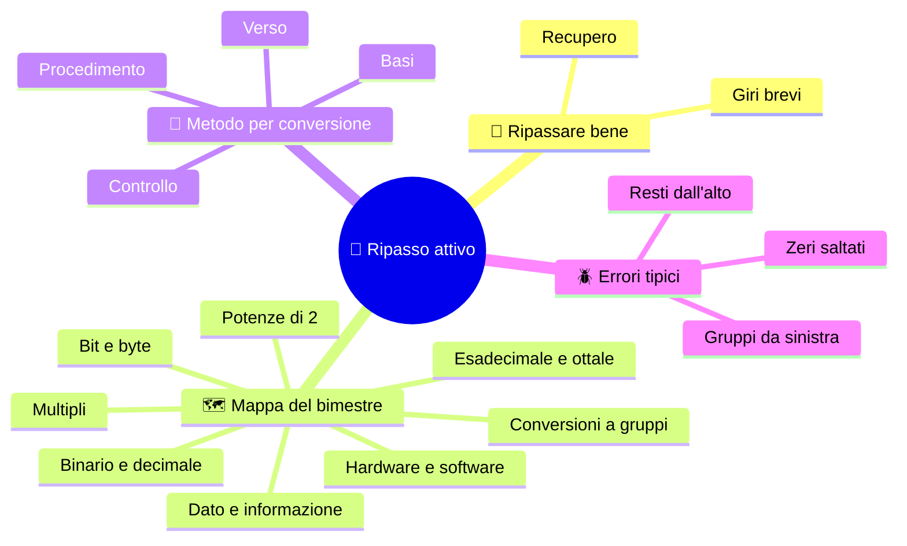
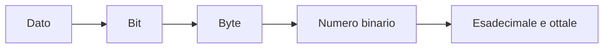

# 🧠 Ripasso attivo

**1CI · Settembre-Ottobre · S7 · Teoria**
⏱️ **Tempo di studio: circa 20 minuti in classe** · a casa solo se vuoi: **3 giri da 10 minuti** in giorni diversi · nessun compito a casa obbligatorio.

> **Legenda:** ✅ da sapere · 🔍 per capire fino in fondo · 🤓 facoltativo, per curiosi · 🧪 esempio · 🧠 da ricordare · ✏️ da fare · ⚠️ errore comune · 🎮 gioco · 🃏 flashcard: rispondi a voce, poi apri per controllare

Questa dispensa **non ha argomenti nuovi**. Serve a ricordare, in ordine, quello che hai già visto.



## 🧠 Ripassare bene

### ✅ Chiudi il quaderno, poi prova

Rileggere dà una sensazione di familiarità: «questo lo so». Ma una verifica chiede di **tirare fuori** una procedura **senza guardare**. Il ripasso attivo funziona così:

```text
1. Chiudi.   2. Prova a scrivere / dire.   3. Apri e controlla.   4. Correggi.
```

📌 *Didascalia:* provare a ricordare allena la memoria più di rileggere.

🧠 ==Per ricordare, prova a ricordare: non rileggere soltanto.==

Gli studi sull'apprendimento mostrano che **ricordare a intervalli** (poco, in più giorni) funziona meglio di studiare tanto tutto insieme. Per questo: tre giri brevi da 10 minuti sono meglio di un'ora di notte.

⚠️ **Se sbagli, va bene.** Un errore è un'informazione: ti dice dove guardare.

<details>
<summary>🃏 <b>Perché provare a ricordare è meglio di rileggere?</b></summary>
Perché ti allena a tirare fuori l'informazione, come in una verifica; rileggere dà solo una falsa sensazione di sapere.
</details>

<details>
<summary>🃏 <b>Quali sono i quattro passi del ripasso attivo?</b></summary>
Chiudere, provare, controllare, correggere.
</details>

<details>
<summary>🃏 <b>Meglio un'ora la notte prima o tre giri da 10 minuti in giorni diversi?</b></summary>
Tre giri brevi in giorni diversi: il ricordo si consolida meglio.
</details>

## 🗺️ Mappa del bimestre

### ✅ Che cosa devi saper dire a voce

Rispondi **senza guardare**. Se una domanda ti blocca, torna alla dispensa indicata.

| Domanda | Dove |
|---|---|
| Che differenza c'è fra algoritmo e programma? | S1 |
| Che differenza c'è fra dato e informazione? | S2 |
| Quali sono i livelli del software e dove sta l'hardware? | S2 |
| Quali sono le quattro funzioni di un computer? | S2 |
| Che cos'è un bit? E un byte? | S3 |
| Quante combinazioni si hanno con N bit? | S3 |
| Quanto vale 2⁸? E 2¹⁰? | S3 |
| Che differenza c'è fra kB e KiB? | S3 |
| Come si legge un numero binario (pesi)? | S4 |
| Come si converte un decimale in binario? | S4 |
| Quali cifre ha l'esadecimale e a quanti bit corrisponde una cifra? | S5 |
| Che cos'è un nibble? Quanti ne ha un byte? | S5 |
| Come si passa da binario a esadecimale e viceversa? | S6 |
| Come si passa da binario a ottale? | S6 |

La catena logica dell'intero bimestre:



📌 *Didascalia:* tutto parte da una scelta fra due, e arriva a scritture comode per noi.

<details>
<summary>🃏 <b>Qual è il filo che lega le sei dispense?</b></summary>
Il computer tratta dati fatti di bit; i bit si raggruppano in byte; i numeri si scrivono in binario, e per leggerli meglio si raggruppano in esadecimale o ottale.
</details>

## 🔧 Metodo per ogni conversione

### ✅ Quattro mosse, sempre

1. **Scrivi** la base di partenza e quella di arrivo.
2. **Scegli il metodo**: pesi, divisioni, gruppi.
3. **Rileggi** il verso e gli zeri.
4. **Controlla** con un secondo metodo.

| Se devi… | Usa… | Attenzione a… |
|---|---|---|
| binario → decimale | pesi 1, 2, 4, 8… da destra | sommare solo sotto gli 1 |
| decimale → binario | divisioni per 2 | resti dal **basso** |
| binario → esadecimale | gruppi da 4 **da destra** | zeri a sinistra |
| esadecimale → binario | ogni cifra → 4 bit | non saltare gli zeri |
| binario ↔ ottale | gruppi da 3 | stesso metodo, gruppi più piccoli |

🧠 ==Quando sbagli, chiediti: «quale regola ho violato?», non: «quanto fa?».==

<details>
<summary>🃏 <b>Quali sono le quattro mosse di ogni conversione?</b></summary>
Scrivere le basi, scegliere il metodo, rileggere verso e zeri, controllare con un secondo metodo.
</details>

<details>
<summary>🃏 <b>Con quale metodo si controlla una conversione?</b></summary>
Con un secondo metodo, per esempio tornando al decimale con i pesi.
</details>

### 🔍 Errori tipici

| Errore | Regola violata | Correzione |
|---|---|---|
| `25 : 2` → resti letti dall'alto: `10011` | i resti vanno letti dal basso | `11001` |
| pesi assegnati da sinistra | il peso 1 sta a destra | ricominciare dalla destra |
| `3A → 111010` | un nibble ha sempre 4 bit | `00111010` |
| gruppi da sinistra | i gruppi partono da destra | rifare i gruppi da destra |
| «1 kB = 1024 B sempre» | kB sono 1000, KiB sono 1024 | controllare l'unità |
| 2^N = 2·N | ogni bit **raddoppia** | 2·2·…·2, N volte |

🧠 Un errore scritto è un dato: serve a trovare **dove** si è rotto il procedimento.

<details>
<summary>🃏 <b>Perché i resti si leggono dal basso verso l'alto?</b></summary>
Perché il primo resto è il bit di peso 1 (a destra) e l'ultimo è il bit di sinistra.
</details>

<details>
<summary>🃏 <b>Qual è l'errore più comune nei gruppi per l'esadecimale?</b></summary>
Raggruppare da sinistra invece che da destra.
</details>

## 🎮 Allenamento a coppie

### ✅ Chiudi gli appunti

**Come funziona:** una persona chiede, l'altra risponde **senza guardare**. Poi si scambiano. Chi sbaglia **non perde punti**: segna dove ha sbagliato e riprova. Al termine, riguardate solo i punti segnati.

✏️ **Giro 1: domande veloci (2 minuti)**
1. Con 7 bit, quanti stati puoi rappresentare?
2. Quanto fa 2⁴? E 2⁶?
3. Quale unità è più grande: GB o GiB?
4. Quanti bit ha un nibble? E un byte?

✏️ **Giro 2: conversioni (5 minuti, sul quaderno)**
1. Converti $37_{10}$ in binario con le divisioni.
2. Converti $(110011)_2$ in decimale con i pesi.
3. Converti $(11001110)_2$ in esadecimale a nibble.
4. Converti $(5B)_{16}$ in binario.

✏️ **Giro 3: trova l'errore (3 minuti)**
1. «$(1100)_2 = 8 + 4 + 2 + 0 = 14$»
2. «$20_{10}$ → resti 0, 0, 1, 0, 1 letti dall'alto: 00101»
3. «`B7 → 1011 111`»

✏️ **Giro 4: spiega in due frasi**
- Perché un byte ha 256 combinazioni?
- Perché l'esadecimale è più comodo del binario?

🚪 **Uscita:** scrivi una domanda su cui ti senti **meno sicuro** e portala alla verifica con un esempio tuo.

### 🔍 Costruisci tu l'esercizio

Inventa **un esercizio di conversione** (binario, esadecimale o ottale) e scrivi la soluzione su un foglietto. Passalo a un compagno: se riesce a risolverlo e ottiene il tuo risultato, l'esercizio funziona. 🎯

### 🤓 Dopo la verifica

> Alla fine di un bimestre la domanda utile non è «che voto ho preso?», ma «quale tipo di errore faccio più spesso?». Se riconosci il tuo errore tipico, puoi evitarlo anche in futuro.

<details>
<summary>🃏 <b>Che cosa fai se ti accorgi di aver sbagliato durante l'allenamento?</b></summary>
Segni dove, e riprovi: l'errore ti dice quale regola riguardare.
</details>

## 📚 Fonti e risorse

- **Convertitore binario-decimale-esadecimale** (in inglese): [mathsisfun.com](https://www.mathsisfun.com/binary-decimal-hexadecimal-converter.html). Per **controllare** dopo aver fatto i conti a mano, mai prima.
- **CS Unplugged, numeri binari** (in inglese): [csunplugged.org](https://www.csunplugged.org/en/topics/binary-numbers/). Per ripassare i pesi con le carte.
- **Come ripassare bene** (articolo per ricercatori, in inglese): Dunlosky et al., *Improving Students' Learning With Effective Learning Techniques*, Psychological Science in the Public Interest, 2013. Dimostra che richiamare e distanziare il ripasso funziona.

---

[⬅️ S6 - Convertire a gruppi](%28STU%29%201CI%20sett-ott%20S6%20-%20Convertire%20a%20gruppi.md) · [🗺️ Indice](%28STU%29%201CI%20-%20SETT-OTT.md) · [S8 - Verifica e recupero ➡️](%28STU%29%201CI%20sett-ott%20S8%20-%20Verifica%20e%20recupero.md)
