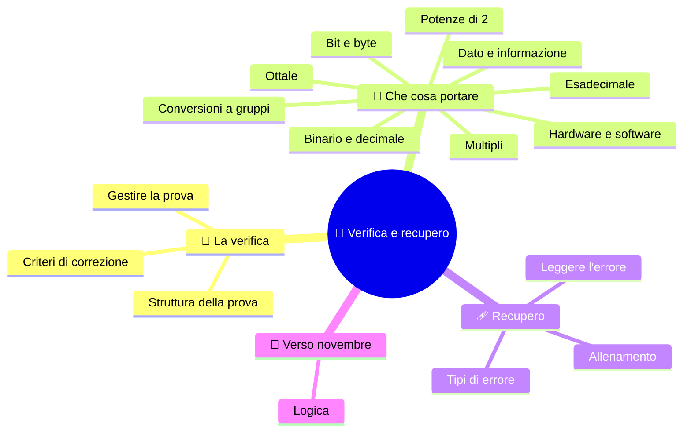

# 🎯 Verifica e recupero

**1CI · Settembre-Ottobre · S8 · Verifica**
⏱️ **Tempo di studio: circa 15 minuti** · nessun compito a casa obbligatorio.

> **Legenda:** ✅ da sapere · 🔍 per capire fino in fondo · 🤓 facoltativo, per curiosi · 🧠 da ricordare · ✏️ da fare · ⚠️ errore comune · 🩹 recupero · 🃏 flashcard: rispondi a voce, poi apri per controllare

## 🧭 La verifica

Sapere una definizione è un inizio. **Capire** vuol dire usarla: convertire un numero, scegliere un metodo, spiegare perché funziona. La verifica ti chiede questo.

Il voto non è l'unico risultato. Serve anche a capire **che tipo di errore fai** e come correggerlo.

### ✅ Come è fatta la prova

La struttura è **trasparente**: la conosci prima. In totale 10 punti.

| Parte | Che cosa devi fare | Punti |
|---|---|---:|
| 1 | quattro domande brevi su dato/informazione, hardware/software, bit/byte e capacità | 2 |
| 2 | due conversioni decimale → binario, con le divisioni visibili | 2,5 |
| 3 | due conversioni binario → decimale, con i pesi | 2,5 |
| 4 | due conversioni tra binario ed esadecimale | 2 |
| 5 | una risposta aperta: perché i computer usano due stati? | 1 |

📌 *Didascalia:* tutte le parti si preparano con le dispense S1-S6.

**Come si corregge una conversione.** Contano soprattutto **il risultato e i passaggi**; poi **l'ordine** del procedimento e **base e pedice** scritti bene. Se sbagli un solo conto ma il metodo è giusto, ottieni **credito parziale**: il procedimento vale.

Gli strumenti consentiti (per esempio la calcolatrice) li dice il docente **prima** della prova. Il telefono resta chiuso.

🃏 <b>Quali parti ha la verifica?</b>

Domande brevi, decimale → binario, binario → decimale, binario ↔ esadecimale e una risposta aperta.

🃏 <b>Se sbagli un conto ma il metodo è giusto, perdi tutto?</b>

No: il procedimento coerente dà credito parziale.

### ✅ Come gestire la prova

1. **Leggi tutto** prima di cominciare.
2. **Comincia dagli esercizi che sai fare**: ti danno sicurezza.
3. Per ogni conversione scrivi **base di partenza e di arrivo**.
4. **Controlla il verso** dei resti, i pesi da destra, i gruppi da destra.
5. Negli **ultimi 5 minuti** rileggi: non iniziare un esercizio nuovo.

🧠 ==Mostra sempre i passaggi: un risultato giusto senza metodo non dice come hai ragionato.==

🃏 <b>Che cosa fai negli ultimi 5 minuti di una prova?</b>

Rileggi e controlli i passaggi, senza iniziare un esercizio nuovo.

## 🧱 Che cosa portare

### ✅ Punti essenziali

- **Dato** e **informazione**: informazione = dato + contesto.
- **Hardware**, **software di base**, **software applicativo**; le quattro funzioni: ingresso, elaborazione, uscita, memorizzazione.
- **Bit**: una scelta fra due. **Byte**: 8 bit, 256 combinazioni (da 0 a 255).
- Con N bit: **2^N** combinazioni. Potenze di 2 da 2⁰ a 2¹⁰.
- **kB, MB, GB** (decimali) e **KiB, MiB, GiB** (binari).
- **Binario ↔ decimale**: pesi e divisioni per 2, resti dal basso.
- **Esadecimale**: 16 cifre (0-9, A-F); 1 cifra = 4 bit; 1 byte = 2 cifre.
- **Ottale**: 8 cifre; 1 cifra = 3 bit.
- **Binario ↔ esadecimale / ottale**: gruppi da 4 / da 3, da destra.

🃏 <b>Quanto vale un byte in combinazioni e come si scrive l'intervallo?</b>

256 combinazioni: i numeri da 0 a 255.

🃏 <b>Qual è la regola dei gruppi?</b>

Da destra: gruppi da 4 bit per l'esadecimale, da 3 per l'ottale.

### 🔍 Per puntare al massimo

- Sai **spiegare perché** un metodo funziona: i pesi sono potenze di 2; 16 = 2⁴ e 8 = 2³.
- Sai **controllare** una conversione con un secondo metodo.
- Sai **trovare l'errore** in una conversione sbagliata e dire quale regola viola.
- Sai calcolare **quanti bit servono** per distinguere un certo numero di oggetti.

🃏 <b>Perché l'esadecimale si abbina ai gruppi da 4 bit?</b>

Perché 16 = 2⁴: una cifra esadecimale corrisponde esattamente a 4 bit.

📌 Gli approfondimenti 🤓 delle dispense **non sono richiesti** nella verifica.

## 🩹 Recupero

### ✅ Leggi l'errore, non solo il voto

Dopo la prova, per ogni esercizio sbagliato chiediti: **«che cosa è andato storto?»**. Quasi sempre è uno di questi sei tipi.

| Tipo di errore | Dove tornare | Esercizio di recupero |
|---|---|---|
| Resti letti dall'alto | S4, divisioni | Converti un numero e riscrivi i resti **in verticale**, con una freccia verso l'alto |
| Pesi da sinistra | S4, pesi | Scrivi la riga 32 16 8 4 2 1 **prima** del numero |
| Gruppi da sinistra | S6, gruppi | Metti una barretta **da destra** ogni 4 bit |
| Nibble incompleto | S5 e S6, tabella | Riscrivi la tabella dei 16 nibble a memoria |
| Unità confuse (kB / KiB) | S3, multipli | Scrivi quanti byte sono 2 TB (scala decimale) e spiega perché il sistema può mostrare un numero minore |
| 2^N = 2·N | S3, raddoppio | Scrivi le combinazioni di 3 bit a mano e contale |

🧠 Ogni tipo di errore ha un **rimedio piccolo**: non rifare tutto.

🃏 <b>Che cosa chiedersi davanti a un errore?</b>

«Quale regola ho violato?», non soltanto «quanto fa?».

### 🔍 Allenamento di recupero

Scegli **solo gli esercizi che corrispondono al tuo tipo di errore**:

1. Converti $41_{10}$ in binario con le divisioni e **controlla** con i pesi.
2. Converti $(100111)_2$ in decimale.
3. Converti $(10101101)_2$ in esadecimale.
4. Converti $(C4)_{16}$ in binario, scrivendo i due nibble completi.
5. Con 5 bit, quante combinazioni? E con 9?
6. Spiega in due frasi perché un nibble ha 16 combinazioni.

🏠 *Facoltativo:* scrivi in un foglietto il **tuo** errore più comune e come lo eviterai la prossima volta.

## 🔭 Verso novembre

Fin qui abbiamo visto **come il computer rappresenta** le cose: con scelte fra due. A novembre vediamo **come decide**: la **logica**, con le operazioni AND, OR, NOT. Anche lì si ragiona con due soli valori: vero e falso, che sono proprio **1 e 0**. 🧩

### 🤓 Un ponte nella storia

> George Boole nel 1854 scrisse le leggi della logica con due valori. Quasi un secolo dopo Claude Shannon capì che quelle leggi si possono costruire con interruttori. Da lì nascono i circuiti del computer.

## 📚 Fonti e risorse

- **Sistema numerico binario**: [it.wikipedia.org](https://it.wikipedia.org/wiki/Sistema_numerico_binario). Per ripassare.
- **Sistema numerico esadecimale**: [it.wikipedia.org](https://it.wikipedia.org/wiki/Sistema_numerico_esadecimale). Per ripassare.
- **Convertitore binario-decimale-esadecimale** (in inglese): [mathsisfun.com](https://www.mathsisfun.com/binary-decimal-hexadecimal-converter.html). Per **controllare** gli esercizi di recupero **dopo** averli fatti a mano.
- **Claude Shannon**: [it.wikipedia.org](https://it.wikipedia.org/wiki/Claude_Shannon). Per il ponte con la logica di novembre.

---

[⬅️ S7 - Ripasso attivo](%28STU%29%201CI%20sett-ott%20S7%20-%20Ripasso%20attivo.md) · [🗺️ Indice](%28STU%29%201CI%20-%20SETT-OTT.md)
