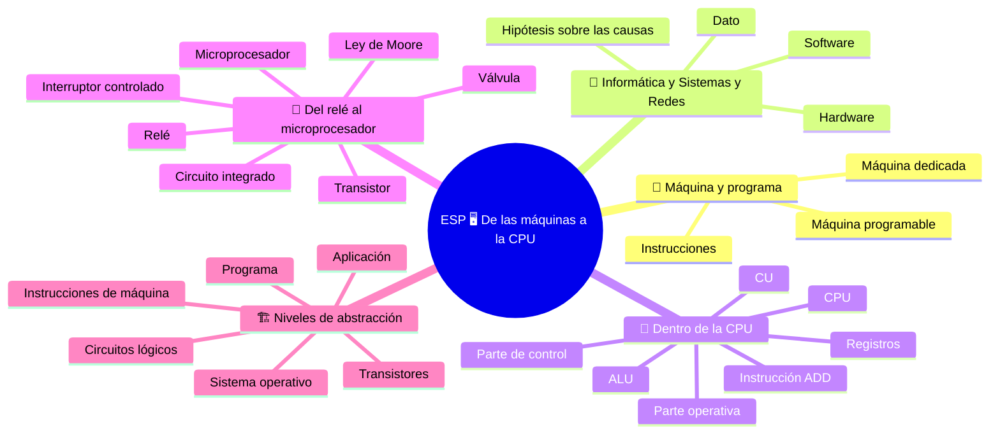

🏠 [Indice](%28STU%29%20ESP%203EI%20-%20SETT-OTT.md) · [S2 - La máquina de Von Neumann](%28STU%29%20ESP%203EI%20sett-ott%20S2%20-%20La%20m%C3%A1quina%20de%20Von%20Neumann.md) ➡️

# ESP 🖥️ De las máquinas a la CPU

**3EI · Septiembre-Octubre · S1 · Teoría**

> **Leyenda:** ✅ hay que saber · 🔍 para entender a fondo · 🤓 opcional, para curiosos · 🃏 tarjeta: responde en voz alta y luego despliega la respuesta



## 🧭 Máquina y programa

Una persona escribe un programa. Pero ¿quién ejecuta realmente sus instrucciones? Decir «el computador» es un comienzo, no una explicación. Dentro de la máquina hay componentes que guardan valores, otros que los transforman y otros que coordinan el trabajo. Ninguno entiende el propósito del programa como lo entiende una persona: el resultado nace de transformaciones físicas organizadas.

Durante siglos, construir una máquina significaba asignarle **un trabajo**: medir el tiempo, tejer o calcular. La programabilidad lo cambia todo: una misma máquina puede realizar tareas distintas cuando cambian las instrucciones. Entender esta separación es el primer paso para comprender tanto un computador como las redes que lo conectan con otros.

## 🔭 Informática y Sistemas y Redes

### ✅ Hardware, software y datos

En Informática estudiamos, entre otras cosas, cómo describir un procedimiento y escribirlo en un lenguaje de programación. En Sistemas y Redes también observamos **la máquina que lo ejecuta y la infraestructura que permite comunicar las máquinas**. No es una división entre quienes piensan y quienes montan piezas: ambas perspectivas requieren razonamiento y se encuentran continuamente.

- **Hardware:** los componentes físicos.
- **Software:** los programas y sus instrucciones.
- **Dato:** información representada de una forma que el sistema puede procesar.

El programa determina cómo tratar los datos, pero sin hardware no se realiza ningún trabajo.

<details><summary>🃏 <b>¿Qué estudia Sistemas y Redes además del programa?</b></summary>
La máquina que ejecuta el programa y la infraestructura que comunica las máquinas. Son dos perspectivas que se complementan.
</details>
<details><summary>🃏 <b>¿Qué es el hardware?</b></summary>
El conjunto de componentes físicos del sistema.
</details>
<details><summary>🃏 <b>¿Qué es el software?</b></summary>
El conjunto de programas y sus instrucciones.
</details>
<details><summary>🃏 <b>¿Qué es un dato?</b></summary>
Información representada de una forma que el sistema puede procesar.
</details>
<details><summary>🃏 <b>¿Puede trabajar un programa sin hardware?</b></summary>
No. El programa determina cómo tratar los datos, pero el trabajo lo ejecuta el hardware.
</details>

### ✅ Síntoma y causa

Un sitio web lento puede tener varias causas: poca memoria disponible en el servidor, una conexión congestionada o un programa ineficiente. Algunas causas son de software y otras de hardware. Una persona experta aprende a plantear _hipótesis_ sobre dónde puede estar el problema y luego las verifica. No siempre es fácil.

El síntoma por sí solo no indica la causa. Antes de proponer una solución, pregúntate: **¿dónde se pierde tiempo?** ¿Qué observación permitiría distinguir una hipótesis de otra?

<details><summary>🃏 <b>Un sitio va lento: ¿cuáles podrían ser las causas?</b></summary>
Por ejemplo, un algoritmo ineficiente, poca memoria disponible o una conexión congestionada: son partes distintas del sistema.
</details>

## 👥 Dentro de la CPU

### ✅ Registros, ALU y CU

Consideremos la tarea «suma 7 y 5 y guarda el resultado». Una persona la resuelve con papel y lápiz sin darse cuenta de todos los pasos. Una máquina, en cambio, debe realizar **tres trabajos distintos**:

1. **Guardar** los números en algún lugar, listos para usarlos.
2. **Calcular:** transformar 7 y 5 en 12.
3. **Coordinar:** decidir qué ocurre y en qué orden: primero tomar 7 y 5, luego sumarlos y finalmente guardar el 12.

En el procesador, cada trabajo tiene un componente dedicado.

| Trabajo | Componente | En palabras sencillas |
|---|---|---|
| Guardar valores | **Registros** | Memorias pequeñísimas dentro del procesador. Cada una tiene un nombre (R1, R2, R3...) y guarda un número a la vez. |
| Calcular | **ALU**, unidad aritmético-lógica | Circuito que recibe dos números y la operación indicada (suma, resta, comparación...) y devuelve el resultado. |
| Coordinar | **CU**, unidad de control | Circuito que recibe la instrucción y envía señales eléctricas que indican qué hacer. |

Para imaginarlos, piensa en una cocina: la **mesa de trabajo** con los ingredientes listos (registros), el **robot de cocina** que transforma lo que recibe (ALU) y la **receta** que indica qué hacer y en qué orden (CU). La comparación sirve hasta cierto punto: más adelante veremos dónde deja de funcionar.

- Los **registros** son pequeños, pero están muy cerca de quien calcula y por eso se usan muy rápido. No guardan archivos: mantienen unos pocos valores *en uso ahora*.
- La **ALU** no decide qué calcular. Solo realiza la operación indicada con los dos números que recibe.
- La **CU** no calcula. Lee la instrucción y envía señales como: «estos registros envíen su contenido a la ALU», «la ALU sume» y «ese registro copie el resultado».

La **CPU**, o procesador, es todo esto junto con las conexiones que permiten que sus componentes colaboren. **La CPU no es solo la ALU**: sin registros no hay dónde guardar los números y sin CU nadie coordina el orden de las acciones.

<details><summary>🃏 <b>¿Para qué sirven los registros?</b></summary>
Para mantener listos los valores: son pequeñas memorias internas del procesador.
</details>
<details><summary>🃏 <b>¿Qué hace la ALU?</b></summary>
Transforma valores mediante operaciones aritméticas y lógicas.
</details>
<details><summary>🃏 <b>¿Qué hace la CU?</b></summary>
Interpreta las instrucciones y genera señales que activan las operaciones en el orden correcto.
</details>
<details><summary>🃏 <b>¿La CPU es solo la ALU?</b></summary>
No. Incluye registros, ALU, CU y las conexiones entre ellos.
</details>
<details><summary>🃏 <b>¿Qué tres trabajos requiere sumar 7 y 5?</b></summary>
Guardar los números (registros), calcular (ALU) y coordinar el orden (CU).
</details>

### ✅ Parte operativa y parte de control

Los circuitos de la CPU se pueden dividir en dos grupos según esta pregunta: **¿este circuito toca los datos o da órdenes a quienes los tocan?**

```text
                   UNIDAD DE CONTROL
                  interpreta la instrucción
                           |
                    señales de control
                           v
             REGISTROS --> ALU --> REGISTRO RESULTADO
               7, 5       +              12
```

- **Parte operativa:** todo lo que atraviesan los datos: los registros que los guardan, la ALU que los transforma y las conexiones que los llevan de un lugar a otro.
- **Parte de control:** la CU. No contiene los datos del usuario ni calcula; envía señales que indican qué conexiones y operaciones activar.

| Pregunta | Respuesta |
|---|---|
| ¿Dónde está el 7 antes de la suma? | En un registro: parte operativa. |
| ¿Quién transforma 7 y 5 en 12? | La ALU: parte operativa. |
| ¿Quién lleva 7 y 5 a la ALU? | Las conexiones, habilitadas por señales: parte operativa dirigida por el control. |
| ¿Quién decide que se debe sumar y no restar? | La CU: parte de control. |

Mover un dato de un registro a otro, sin calcular nada, también es trabajo de la parte operativa. De todas formas hace falta el control para indicar *qué* registro copia *a cuál*.

<details><summary>🃏 <b>¿Qué pregunta separa los circuitos de la CPU en dos grupos?</b></summary>
¿Este circuito toca los datos o da órdenes a quienes los tocan? En el primer caso es parte operativa; en el segundo, de control.
</details>
<details><summary>🃏 <b>¿Qué es la parte operativa?</b></summary>
Los circuitos que guardan, transfieren y transforman datos: ALU, registros y recorridos de datos.
</details>
<details><summary>🃏 <b>¿Qué es la parte de control?</b></summary>
Los circuitos que coordinan las transferencias y operaciones.
</details>

### ✅ Ejemplo resuelto: `ADD R3, R1, R2`

`ADD R3, R1, R2` es una notación didáctica, no un comando para escribir en la computadora. Representa **una instrucción**, es decir, una orden que la CPU puede ejecutar:

- `ADD` es la acción: sumar.
- `R3` aparece **primero** porque es el destino, donde quedará el resultado. En esta notación el destino va primero; otras notaciones pueden usar el orden opuesto.
- `R1` y `R2` son los registros que contienen los números que se suman.

La instrucción completa se lee así: «suma el contenido de R1 y el contenido de R2, y escribe el resultado en R3».

**Situación inicial:** R1 contiene 7 y R2 contiene 5.

| Paso | Qué ocurre | Quién trabaja |
|---|---|---|
| 1 | La CU recibe y reconoce la instrucción: es una suma, con R1 y R2 como fuentes y R3 como destino. | Control |
| 2 | La CU envía señales a R1 y R2 para que pongan sus valores en las conexiones hacia la ALU, y le indica a la ALU que sume. | Control |
| 3 | La ALU recibe 7 y 5 y presenta 12 en su salida. | Operativa |
| 4 | La CU indica a R3 que copie lo que llega de la ALU. | Control |
| 5 | R3 contiene 12. R1 y R2 no han cambiado: solo «prestaron» sus valores. | Operativa |

**¿Por qué R1 y R2 no cambian?** Leer un registro no lo vacía: los números se copian en las conexiones. Solo cambia el registro donde se escribe, R3. Si R3 ya contenía un número, se reemplaza.

**¿Y si quisiéramos restar?** No cambiaríamos la ALU, sino la instrucción: con `SUB R3, R1, R2`, la CU pediría otra operación. Esta idea reaparecerá en la próxima lección: **la máquina es la misma; cambia la instrucción**.

La CU no «entendió el problema»: sus circuitos reaccionan a una instrucción codificada. La ALU tampoco elige por su cuenta; ejecuta la operación indicada.

> ⏸️ **Detente y reconstruye:** tapa la tabla y cuenta qué información entra, quién la transforma y dónde queda el resultado.

<details><summary>🃏 <b>¿Por qué el destino aparece primero en `ADD R3, R1, R2`?</b></summary>
Es una convención de esta notación. Otras notaciones pueden usar el orden opuesto.
</details>
<details><summary>🃏 <b>¿Cómo se lee `ADD R3, R1, R2`?</b></summary>
Suma el contenido de R1 y R2, y escribe el resultado en R3.
</details>
<details><summary>🃏 <b>Después de la suma, ¿cambian R1 y R2?</b></summary>
No. Conservan sus valores; solo cambia el registro destino R3.
</details>

### 🔍 Límites de la comparación

Para entender la CPU usamos la imagen de un equipo o de una cocina con mesa, robot y receta. Ayuda, pero deja de funcionar en tres aspectos:

1. **Las personas entienden pedidos imprecisos; los circuitos no.** A un ayudante se le puede decir «pásame ese frasco». A la CPU no: cada señal debe indicar exactamente qué registros, operación y destino se usan.
2. **El cocinero puede improvisar; la CU no.** La CU no es una personita dentro del procesador. Es un circuito: con la misma instrucción y el mismo estado, produce las mismas señales.
3. **Una persona puede notar un error; la máquina no.** Si una instrucción pide sumar números equivocados, la CPU los suma igual. El resultado será incorrecto aunque la ALU funcione perfectamente.

Ante un resultado incorrecto, la pregunta útil no es «¿se equivocó la computadora?», sino **¿en qué paso está el error: en los datos, el programa o los circuitos?**

> 🔧 **Conexión con el laboratorio:** al observar una computadora, la CPU, el módulo RAM y el disipador son objetos distintos. La ALU y los registros no son componentes separados visibles en la placa: están dentro del procesador. El esquema funcional no es una fotografía del montaje.

<details><summary>🃏 <b>¿En qué tres aspectos falla la comparación con un equipo de personas?</b></summary>
Las personas entienden pedidos vagos y los circuitos no; una persona puede improvisar y la CU no; una persona puede notar un error y la máquina no.
</details>
<details><summary>🃏 <b>¿Es la CU una personita dentro del procesador?</b></summary>
No. Es un circuito que produce señales determinadas por la instrucción y el estado.
</details>

## 📜 Del relé al microprocesador

### ✅ Un interruptor controlado por una señal

Para que una máquina calcule hay que representar ceros y unos y cambiarlos de forma **segura y rápida**. Desde el siglo XIX hasta hoy se repite una técnica: un **interruptor controlado por una señal eléctrica**.

Un interruptor normal se acciona con un dedo. Este lo activa otro circuito: una señal pequeña abre o cierra el camino de otra señal más grande. Así se pueden encadenar circuitos y construir operaciones lógicas:

- Dos interruptores **en serie** dejan pasar corriente solo si ambos están cerrados: **AND**.
- Dos interruptores **en paralelo** la dejan pasar si al menos uno está cerrado: **OR**.
- Un interruptor que se abre cuando recibe corriente y se cierra cuando no la recibe representa **NOT**.

En 1937 Claude Shannon, entonces estudiante en el MIT, mostró en su tesis que los circuitos de relés podían ejecutar el álgebra de Boole. Fue una conexión fundamental entre interruptores y lógica.

<details><summary>🃏 <b>¿Qué componente representa AND en el ejemplo de interruptores?</b></summary>
Dos interruptores en serie: la corriente pasa solo cuando ambos están cerrados.
</details>
<details><summary>🃏 <b>¿Qué componente representa OR?</b></summary>
Dos interruptores en paralelo: la corriente pasa cuando al menos uno está cerrado.
</details>
<details><summary>🃏 <b>¿Qué mostró Claude Shannon en 1937?</b></summary>
Que los circuitos de relés podían ejecutar el álgebra de Boole.
</details>

### 🔍 Relés, válvulas y transistores

- **Relé:** un electroimán mueve un contacto metálico que abre o cierra otro circuito. Puede controlar una corriente grande mediante una pequeña, pero las piezas se mueven, se desgastan y son relativamente lentas. Los primeros computadores electrónicos usaron miles de ellos.
- **Válvula electrónica:** controla el flujo de electrones dentro de un tubo de vacío, sin contactos mecánicos. Es mucho más rápida que un relé, pero grande, frágil y consume mucha energía. El ENIAC de 1946 utilizaba 17.468 válvulas.
- **Transistor:** un pequeño componente semiconductor controla la corriente sin partes móviles. Es pequeño, rápido, consume menos y se puede fabricar en grandes cantidades.

No se trata de una sustitución instantánea: durante años convivieron tecnologías diferentes. Cada cambio resolvía algunos problemas y creaba otros.

<details><summary>🃏 <b>¿Cómo funciona un relé?</b></summary>
Un electroimán mueve un contacto que abre o cierra un circuito.
</details>
<details><summary>🃏 <b>¿Qué límites tenían las válvulas?</b></summary>
Eran grandes, frágiles y consumían mucha energía, aunque eran más rápidas que los relés.
</details>
<details><summary>🃏 <b>¿Qué ventaja aportó el transistor?</b></summary>
Controla la corriente sin piezas móviles y es pequeño, rápido y de bajo consumo.
</details>

### 🔍 Del transistor al chip

Conectar a mano miles de transistores con cables se vuelve imposible. A finales de los años cincuenta, Jack Kilby (Texas Instruments, 1958) y Robert Noyce (Fairchild, 1959) llegaron independientemente a una solución: fabricar varios componentes y sus conexiones **juntos, sobre una misma lámina de silicio**, mediante procesos fotográficos. Así nació el **circuito integrado**, o chip.

En 1971, el **Intel 4004** puso una CPU completa en un solo chip: fue el primer microprocesador vendido como componente. Tenía unos 2.300 transistores y procesaba 4 bits a la vez. Se creó para las calculadoras de la empresa japonesa Busicom. Lo diseñaron Federico Faggin, Ted Hoff, Stanley Mazor y Masatoshi Shima; Faggin firmó el chip con sus iniciales, F.F.

La integración hizo los sistemas mucho más compactos. Un chip actual contiene miles de millones de transistores. ⚠️ **Más pequeño no significa que no consuma energía o que no tenga límites.**

<details><summary>🃏 <b>¿Qué es un circuito integrado?</b></summary>
Un chip en el que muchos componentes y sus conexiones se fabrican juntos sobre silicio. Kilby y Noyce lo desarrollaron independientemente.
</details>
<details><summary>🃏 <b>¿Qué fue el Intel 4004?</b></summary>
El primer microprocesador vendido como componente: una CPU completa en un chip, presentada en 1971.
</details>

### 🤓 El primer «bug»

> Según la historia tradicional, el 9 de septiembre de 1947 los operadores del **Harvard Mark II**, un computador de relés, encontraron un error causado por una **polilla** atrapada en un relé. La pegaron en el registro junto a la nota «First actual case of bug being found» («primer caso real de un insecto encontrado»). Grace Hopper hizo famosa la historia. 🐛
>
> El juego de palabras funcionaba porque *bug* («insecto») ya era desde hacía décadas una palabra usada por ingenieros para defectos pequeños: Edison la usó en una carta de 1878. Hoy los errores de los programas ya no tienen alas, pero el nombre perdura.

<details><summary>🃏 <b>¿De dónde viene la palabra «bug»?</b></summary>
Ya se usaba para defectos pequeños en ingeniería; la historia de la polilla en un relé del Harvard Mark II la hizo famosa.
</details>

### 🤓 La ley de Moore

> En 1965 Gordon Moore describió una tendencia: aumentaba de forma regular el número de componentes que se podían integrar en un chip. La predicción se reformuló posteriormente. No es una ley natural ni garantiza que cada programa termine en la mitad de tiempo cada dos años. Más transistores pueden convertirse en más caché, más núcleos o nuevas funciones: la ventaja depende de cómo los usen el sistema y el programa.
>
> La pregunta interesante es: **¿qué recurso limita este trabajo?** Un computador rapidísimo puede quedarse esperando los datos. Volveremos a esta idea al estudiar las memorias.

<details><summary>🃏 <b>¿Qué describió Gordon Moore?</b></summary>
Una tendencia de crecimiento del número de componentes que se podían integrar en un chip.
</details>
<details><summary>🃏 <b>¿La ley de Moore garantiza que los programas serán el doble de rápidos cada dos años?</b></summary>
No. No es una ley natural; la ventaja depende de cómo se usen los transistores adicionales.
</details>

## 🏗️ Niveles de abstracción

### ✅ Niveles y abstracción

Cuando escribes un mensaje no piensas en los transistores, y no hace falta. Un computador se puede observar en **niveles**. Cada nivel usa el de abajo sin conocer sus detalles y ofrece servicios al de arriba. Esto se llama **abstracción**: ocultar los detalles que no hacen falta en ese nivel.

| Nivel | Qué vemos | Ejemplo |
|---|---|---|
| **Aplicación** | Funciones que utiliza una persona | Aplicación de mensajería |
| **Programa** | Instrucciones escritas por un programador | `suma = a + b;` |
| **Sistema operativo** | Recursos que distribuye entre programas: memoria, archivos, pantalla | Windows, Linux, Android |
| **Instrucciones de máquina** | Órdenes que la CPU puede ejecutar | `ADD R3, R1, R2` |
| **Circuitos lógicos** | Puertas AND, OR, NOT, registros y ALU | Circuito que suma |
| **Transistores** | Interruptores controlados | Miles de millones en un chip |

La línea `suma = a + b;` se convierte, más abajo, en una instrucción como `ADD R3, R1, R2`; esta activa registros y ALU, hechos de puertas lógicas que, a su vez, están hechas de transistores. **Es la misma suma observada desde distintas alturas.**

La abstracción importa porque nadie puede tener todos los niveles presentes al mismo tiempo. En Sistemas y Redes subiremos y bajaremos entre ellos; también encontraremos niveles en las redes.

<details><summary>🃏 <b>¿Qué es la abstracción?</b></summary>
Ocultar los detalles que no hacen falta en un nivel. Cada nivel utiliza el inferior y ofrece servicios al superior.
</details>
<details><summary>🃏 <b>¿Cuáles son los niveles, de arriba abajo?</b></summary>
Aplicación, programa, sistema operativo, instrucciones de máquina, circuitos lógicos y transistores.
</details>
<details><summary>🃏 <b>¿Cómo se relacionan `a + b` y `ADD R3, R1, R2`?</b></summary>
Son la misma suma vista en niveles distintos: el programa se traduce en una instrucción que ejecutan los registros y la ALU.
</details>

### 🔍 Problemas y niveles

Una falla o un resultado extraño puede originarse **en un nivel distinto de aquel donde lo observamos**. Un sitio lento puede depender del programa, del sistema operativo, del hardware o de la red. Por eso hay que preguntarse *en qué nivel* buscar.

También puede ocurrir que un nivel alto «olvide» un límite del nivel bajo. En un programa pensamos en números ilimitados, pero cada número ocupa una cantidad limitada de bits en los registros. Si el resultado es demasiado grande, puede aparecer un número incorrecto, incluso negativo. El programador no necesariamente calculó mal: pudo pasar por alto un límite de nivel inferior.

<details><summary>🃏 <b>¿Un problema siempre se origina en el nivel donde se observa?</b></summary>
No. Un síntoma visible en un nivel puede originarse en otro nivel.
</details>
<details><summary>🃏 <b>¿Por qué puede salir mal un número aunque la suma del programa sea correcta?</b></summary>
Porque los registros usan una cantidad limitada de bits y el programa puede pasar por alto ese límite.
</details>

## 🧩 Pon a prueba el modelo

1. **Base.** ¿Qué diferencia hay entre hardware y software? ¿Qué funciones tienen los registros, la ALU y la CU?
2. **Aplicación.** R1 contiene 9 y R2 contiene 4. Ejecuta `ADD R3, R1, R2`: indica el resultado y qué registros no cambian.
3. **Conexión.** ¿Por qué no se puede describir una CPU solamente como una ALU?
4. **Conexión.** En una frase, explica qué hace la parte operativa y qué hace la parte de control. Da un ejemplo de cada una.
5. **Historia.** Elige dos elementos entre relé, válvula y transistor; compara cómo controlan la corriente y qué límite tiene cada uno.
6. **Niveles.** Para la frase «guardo un documento», escribe un ejemplo de nivel de aplicación, de programa e instrucciones de máquina.

**🚪 Salida:** completa: «La misma máquina puede realizar tareas distintas cuando…».

## 📚 Fuentes y recursos

- [Computer History Museum - 1965](https://www.computerhistory.org/timeline/1965/) (en inglés): contexto histórico de la ley de Moore.
- [Computer History Museum - 1971](https://www.computerhistory.org/siliconengine/microprocessor-integrates-cpu-function-onto-a-single-chip/) (en inglés): el primer microprocesador.
- [Nand2Tetris](https://www.nand2tetris.org/) (en inglés, para curiosos): construye un computador didáctico desde las puertas lógicas.

---

[[(STU) ESP 3EI - SETT-OTT|🗺️ Índice]] · [[(STU) ESP 3EI sett-ott S2 - La máquina de Von Neumann|S2 - La máquina de Von Neumann ➡️]]

🏠 [Indice](%28STU%29%20ESP%203EI%20-%20SETT-OTT.md) · [S2 - La máquina de Von Neumann](%28STU%29%20ESP%203EI%20sett-ott%20S2%20-%20La%20m%C3%A1quina%20de%20Von%20Neumann.md) ➡️
