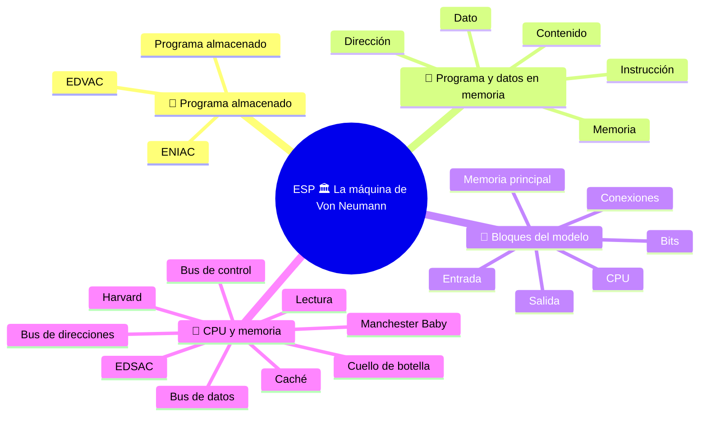

# ESP 🏛️ La máquina de Von Neumann

**3EI · Septiembre-Octubre · S2 · Teoría**

> **Leyenda:** ✅ hay que saber · 🔍 para entender a fondo · 🤓 opcional, para curiosos · 🃏 tarjeta: responde en voz alta y luego despliega la respuesta



## 🧭 Programa almacenado

Una hoja de cálculo, un videojuego y una aplicación de música funcionan en el mismo computador. No cambiamos los circuitos cada vez: cambiamos los programas. Pero ¿dónde están las instrucciones cuando el procesador debe ejecutarlas?

En los primeros computadores, cambiar de tarea podía significar reconfigurar la máquina con interruptores, cables o paneles de control. El **ENIAC**, de 1946, se «programaba» así: había que volver a conectar cables y mover interruptores; preparar un cálculo nuevo podía tomar días. El trabajo lo realizaba un grupo de mujeres matemáticas, entre ellas Kay McNulty, Jean Jennings y Betty Snyder: fueron las primeras programadoras de un computador electrónico, y durante mucho tiempo su historia quedó olvidada. La idea de **guardar también el programa en la memoria** cambió la relación entre máquina y tarea: las instrucciones se convirtieron en información que podía cargarse y sustituirse. ==La máquina seguía siendo la misma; el programa le asignaba un trabajo diferente.== De días de cableado se pasó a minutos de carga. ⚡

Este modelo está relacionado con el nombre de John von Neumann, pero no nació del trabajo aislado de una sola persona. En los años cuarenta, matemáticos, ingenieros y técnicos buscaban juntos una forma de construir computadores electrónicos programables. La guerra había vuelto urgentes algunos cálculos complejos, como las tablas de tiro y las simulaciones; las ideas desarrolladas entonces también serían útiles mucho después. El modelo nos ayuda a comprender el principio, pero no describe cada cable o componente de un computador moderno.

Retomemos los papeles de la [CPU](<(STU) ESP 3EI sett-ott S1 - De las máquinas a la CPU.md>) y coloquémoslos dentro de la máquina completa.

## 💾 Programa y datos en memoria

### ✅ Instrucciones y datos en la misma memoria

En el modelo de Von Neumann, **las instrucciones y los datos están en la misma memoria**. Un programa es una secuencia de instrucciones guardadas allí, igual que los valores con los que estas instrucciones trabajan. La CPU accede a la memoria, obtiene la instrucción que debe ejecutar, la interpreta y realiza la operación solicitada. Después pasa a la siguiente, salvo que el programa indique otra ruta.

La diferencia con una máquina diseñada para una sola tarea es concreta: ==para cambiar el cálculo no hace falta reconstruir el procesador==. Se prepara otra secuencia de instrucciones y se carga en la memoria. Más adelante veremos cómo la CPU sigue la instrucción actual y la ejecuta; aquí nos interesa el principio que permite cambiar de programa.

<details><summary>🃏 ¿Qué significa «programa almacenado»?</summary>
Que las instrucciones están guardadas en memoria, junto con los datos. La CPU las obtiene, interpreta y ejecuta una tras otra.
</details>
<details><summary>🃏 ¿Por qué fue un cambio importante?</summary>
Porque basta cambiar las instrucciones en memoria para cambiar de tarea; ya no hay que rehacer a mano las conexiones y configuraciones.
</details>
<details><summary>🃏 ¿Von Neumann inventó todo por sí solo?</summary>
No. Su nombre está asociado a un modelo fundamental que surgió de investigaciones colectivas en los años cuarenta.
</details>

### ✅ Dirección y contenido

Imagina la memoria como una fila de cajones numerados. La **dirección** es el número del cajón; el **contenido** es lo que hay dentro. ==El número del cajón no es el objeto que está en él.== Aunque ambos sean números, cumplen funciones diferentes.

<details><summary>🃏 ¿Qué diferencia hay entre dirección y contenido?</summary>
La dirección identifica una posición de memoria; el contenido es lo que se encuentra allí.
</details>
<details><summary>🃏 Si ambos son números, ¿dirección y contenido son lo mismo?</summary>
No. Uno indica dónde y el otro qué hay.
</details>

## 🧱 Bloques del modelo

### ✅ Los cinco bloques

| Bloque | Función | Ejemplo |
|---|---|---|
| **CPU** | Coordina y ejecuta las instrucciones | CU, ALU y registros colaboran |
| **Memoria principal** | Mantiene disponibles instrucciones y datos en uso | Programa cargado y valores que se procesan |
| **Entrada** | Introduce información en el sistema | Teclado, sensor |
| **Salida** | Envía información al exterior | Pantalla, actuador |
| **Conexiones** | Transfieren información y señales entre los bloques | Solicitudes a memoria y valores devueltos |

```text
                        +-----------------------+
                        | CPU                   |
                        | CU + ALU + REGISTROS   |
                        +-----------+-----------+
                                    |
                        conexiones / buses
                        /           |           \
              +---------+    +-------------+    +---------+
              | ENTRADA |    | MEMORIA     |    | SALIDA  |
              +---------+    | instrucciones|   +---------+
                             | y datos      |
                             +-------------+
```

Las líneas muestran relaciones funcionales, no todos los cables de una computadora. ⚠️ La CU **está dentro de la CPU**: no es un segundo procesador externo que dirige una CPU formada solo por la ALU. Algunos dispositivos, como una tarjeta de red, sirven tanto para entrada como para salida.

<details><summary>🃏 ¿Cuáles son los bloques del modelo de Von Neumann?</summary>
CPU, memoria principal, entrada, salida y las conexiones que transfieren información y señales entre ellos.
</details>
<details><summary>🃏 ¿Qué hace la memoria principal?</summary>
Mantiene disponibles las instrucciones y los datos en uso.
</details>
<details><summary>🃏 ¿Qué diferencia hay entre entrada y salida?</summary>
La entrada introduce información en el sistema y la salida la envía al exterior. Algunos dispositivos, como una tarjeta de red, hacen ambas cosas.
</details>
<details><summary>🃏 ¿Dónde está la CU en el esquema?</summary>
Dentro de la CPU, junto con la ALU y los registros.
</details>

### ✅ Ejemplo resuelto: `LOAD` y `ADD`

Usamos una memoria didáctica: cada celda contiene un valor entero o una instrucción completa. (No decimos que una instrucción real ocupe siempre un byte.)

| Dirección | Contenido legible |
|---|---|
| 10 | `LOAD R1, [20]` |
| 11 | `ADD R3, R1, R2` |
| 20 | 7 |
| 21 | 99 |

La CPU encuentra la primera instrucción en la dirección 10: `LOAD R1, [20]`. La interpreta como una orden y usa la dirección 20 para solicitar el dato. La celda 20 contiene 7, así que copia **7** en R1. ==El número 20 servía para encontrar la celda: no es el dato que se copia.==

R2 ya contiene 5. La CPU pasa a la instrucción de la dirección 11: `ADD R3, R1, R2`. La ALU suma el contenido de R1 y R2, es decir, 7 y 5, y escribe el resultado 12 en R3. La celda 21 contiene 99, pero ninguna instrucción la señala; por eso el programa no la utiliza. ==Estar en la memoria no basta para participar en el cálculo.==

El ejemplo separa tres preguntas que se suelen confundir: **¿qué instrucción ejecutar?** (dirección 10 u 11); **¿qué dato leer?** (dirección 20); **¿qué resultado obtener?** (12 en R3). En computadores reales la representación usa bits y las instrucciones tienen formatos precisos; aquí elegimos 10, 11 y 20 solo para hacer visibles las funciones.

Si en vez de sumar el programa pidiera restar, cambiaría la operación, pero ==no modificaríamos físicamente la ALU: elegiríamos con otra instrucción una función que la máquina ya puede realizar==.

> ⏸️ **Fijación:** encuentra en la tabla una dirección, un dato y una instrucción. Explica cómo los distinguiste sin fijarte solo en su aspecto.

<details><summary>🃏 ¿Qué hace `LOAD R1, [20]`?</summary>
Copia en R1 el contenido de la celda 20. Si contiene 7, R1 recibe 7, no 20.
</details>
<details><summary>🃏 ¿Se usa un valor solo porque esté en memoria?</summary>
No. Una instrucción debe solicitarlo; el 99 de la celda 21 queda sin usar.
</details>
<details><summary>🃏 Para restar en vez de sumar, ¿hay que modificar la ALU?</summary>
No. Basta otra instrucción que seleccione una función que la máquina ya sabe realizar.
</details>

### 🔍 Instrucciones y datos como bits

`LOAD` y `ADD` son formas legibles de escribir instrucciones. La memoria real conserva secuencias de bits. El **formato de la instrucción** y el momento de su ejecución permiten que el procesador las trate como órdenes. Otras secuencias representan números, caracteres o direcciones.

No existe una etiqueta universal que diga a cualquier CPU «estos bits son una instrucción». En nuestro modelo, simplemente seguimos el programa en las posiciones indicadas.

<details><summary>🃏 ¿La memoria contiene literalmente las palabras «LOAD» y «ADD»?</summary>
No. Son formas legibles de escribir instrucciones; la memoria guarda secuencias de bits.
</details>
<details><summary>🃏 ¿Cómo trata el procesador ciertos bits como una instrucción?</summary>
Según el formato de la instrucción y el momento de ejecución. Otras secuencias representan números, caracteres o direcciones.
</details>

## 💬 CPU y memoria

### 🔍 Anatomía de una lectura

Para leer la memoria no basta con decir «envíame algo». La CPU y la memoria deben coordinarse: hay que indicar qué posición interesa y qué operación se desea. En una lectura, la memoria devuelve el contenido de esa posición. En el modelo didáctico distinguimos tres datos:

- **¿Dónde?** Una dirección, por ejemplo 20.
- **¿Qué operación?** Una lectura, que es diferente de una escritura.
- **¿Qué valor?** El contenido devuelto, por ejemplo 7.

Cuando la CPU lee la celda 20, comunica la dirección **20**, señala mediante el control que quiere **leer** y la memoria devuelve el contenido **7** por el recorrido de datos. Son funciones diferentes, aunque los elementos viajen por el mismo sistema de conexiones. Estas funciones anticipan los buses de direcciones, control y datos. Una instrucción obtenida de memoria también viaja como contenido por el recorrido de datos: «bus de datos» no significa que las instrucciones tengan prohibido usarlo.

<details><summary>🃏 ¿Qué tres datos hacen falta para leer la memoria?</summary>
Dónde (dirección), qué operación (lectura o escritura) y qué valor (el contenido devuelto).
</details>
<details><summary>🃏 ¿A qué buses corresponden las tres preguntas?</summary>
Dirección: bus de direcciones; operación: bus de control; valor: bus de datos.
</details>
<details><summary>🃏 ¿Puede una instrucción viajar por el bus de datos?</summary>
Sí. Cuando se obtiene de la memoria, es un contenido como cualquier otro.
</details>

### 🔍 El cuello de botella de Von Neumann

El **cuello de botella de Von Neumann** es una limitación que puede aparecer cuando la CPU y la memoria intercambian instrucciones y datos a través de una conexión con capacidad limitada. La CPU puede calcular muy rápido, pero necesita que le lleguen las instrucciones y los datos. Si la conexión no los transfiere lo bastante rápido, la CPU debe esperar o el trabajo avanza más lento de lo que permitiría su capacidad de cálculo.

Volvamos a `LOAD R1, [20]`: primero la máquina obtiene la instrucción de la memoria y luego lee el dato de la dirección 20. Después aún debe obtener la instrucción `ADD`. En el modelo más sencillo, las transferencias usan un recurso compartido y no ocurren todas al mismo tiempo. Mientras la memoria o la conexión atiende una solicitud, la CPU puede no tener el siguiente elemento para trabajar. Si se acumulan solicitudes, se forma una cola: ==la limitación se debe a estos intercambios, no a una CPU «poco inteligente»==.

Una cocina con una sola ventanilla sirve como comparación: hasta cocineros rapidísimos deben esperar si los ingredientes llegan de uno en uno por una ventanilla lenta. Pero una computadora no tiene realmente una ventanilla y las arquitecturas reales emplean soluciones distintas. Importa la capacidad efectiva de transferir información entre memoria y procesador; no basta comparar «GHz de CPU» con «GB/s de memoria», porque son magnitudes distintas. La caché mantiene cerca de la CPU algunos datos e instrucciones de uso frecuente y reduce ciertas esperas, pero no las elimina todas ni vuelve la memoria infinita o instantánea.

> 🔧 **Conexión con el laboratorio:** la RAM y el SSD pertenecen al sistema de memoria, pero no hacen el mismo trabajo. El modelo de hoy describe la memoria utilizada directamente durante la ejecución. Un archivo guardado en disco no está ya listo en los registros de la CPU.

<details><summary>🃏 ¿Qué es el cuello de botella de Von Neumann?</summary>
La CPU puede terminar un cálculo y tener que esperar el siguiente dato: instrucciones y datos compiten por el acceso a la memoria.
</details>
<details><summary>🃏 ¿Se pueden comparar directamente GHz de CPU y GB/s de memoria?</summary>
No. Miden magnitudes diferentes.
</details>
<details><summary>🃏 ¿La caché vuelve instantánea la memoria?</summary>
No. Reduce algunas esperas, pero la memoria no se vuelve infinita ni instantánea.
</details>

### 🤓 Von Neumann, Harvard y los primeros computadores

> En la arquitectura **Harvard**, las instrucciones y los datos tienen memorias o recorridos separados. Si ambos recorridos pueden funcionar a la vez, el procesador puede obtener una instrucción mientras accede a un dato, reduciendo la competencia descrita antes. La separación implica otras decisiones de diseño; no significa «memoria dentro de la CPU» frente a «memoria fuera». Von Neumann y Harvard son modelos útiles para comparar organizaciones, no etiquetas que expliquen por sí solas cada detalle de un computador.
>
> Muchos sistemas modernos combinan las ideas: por ejemplo, tienen memoria principal compartida y cachés separadas para instrucciones y datos cerca del procesador. Por eso conviene preguntar **¿a qué nivel** nos referimos? en vez de buscar una única etiqueta para todo el computador.
>
> El **Manchester Baby** ejecutó un programa almacenado en 1948. No era un computador moderno en miniatura, sino una máquina experimental construida para comprobar una idea: las instrucciones podían guardarse electrónicamente y luego ser ejecutadas. En 1949 empezó a funcionar en Cambridge el **EDSAC**, dirigido por Maurice Wilkes; fue uno de los primeros computadores de programa almacenado utilizados durante años para trabajo científico. Quién fue «el primero» depende de cómo se defina un computador; por eso los historiadores todavía lo debaten.

<details><summary>🃏 ¿Cómo se programaba el ENIAC y quién lo hacía?</summary>
Se reconectaban cables y se movían interruptores; preparar un cálculo nuevo podía tardar días. Lo hacía un grupo de mujeres matemáticas, entre ellas Kay McNulty, Jean Jennings y Betty Snyder.
</details>
<details><summary>🃏 ¿Qué fue el EDSAC?</summary>
Un computador de programa almacenado que empezó a funcionar en Cambridge en 1949, dirigido por Maurice Wilkes y utilizado para trabajo científico.
</details>
<details><summary>🃏 ¿Qué separa la arquitectura Harvard?</summary>
Las memorias o recorridos de instrucciones y datos. Puede permitir accesos simultáneos, con otras decisiones y limitaciones.
</details>
<details><summary>🃏 ¿Los computadores modernos son puramente Von Neumann o Harvard?</summary>
A menudo combinan ideas: memoria principal compartida y cachés separadas para instrucciones y datos.
</details>
<details><summary>🃏 ¿Qué demostró el Manchester Baby en 1948?</summary>
Que una máquina electrónica podía ejecutar un programa almacenado.
</details>

## 🧩 Pon a prueba el modelo

1. **Base.** ¿Qué significa «programa almacenado»? ¿Qué bloques colaboran en la ejecución?
2. **Aplicación.** La celda 30 contiene 8 y la celda 8 contiene 90. ¿Qué valor devuelve una lectura de la dirección 30? Explica por qué.
3. **Conexión.** ¿Por qué se dibuja la CU dentro de la CPU?
4. **Intuición.** Si duplicamos la capacidad de la RAM, ¿se reduce a la mitad el tiempo de cada lectura?
5. **Debate.** ¿Cambiar el programa es lo mismo que cambiar el hardware? Da un ejemplo en que baste lo primero y otro en que podría hacer falta lo segundo.

**🚪 Salida:** escribe una frase con «misma memoria» y otra con «funciones diferentes». No uses «el computador sabe» como explicación.

## 📚 Fuentes y recursos

- [Computer History Museum - 1945](https://www.computerhistory.org/timeline/1945/) (en inglés): el informe sobre EDVAC y el trabajo colectivo en los primeros computadores.
- [Computer History Museum - 1948](https://www.computerhistory.org/timeline/1948/) (en inglés): la entrada sobre Manchester Baby; distingue una demostración de un principio de un computador vendido en el mercado.
- [Nand2Tetris - Project 5](https://www.nand2tetris.org/project05) (en inglés, para curiosos): un computador didáctico construido desde cero.

---

[[(STU) ESP 3EI sett-ott S1 - De las máquinas a la CPU|⬅️ S1 - De las máquinas a la CPU]] · [[(STU) ESP 3EI - SETT-OTT|🗺️ Índice]] · [[(STU) ESP 3EI sett-ott S3 - Registros y recorridos de datos|S3 - Registros y recorridos de datos ➡️]]
