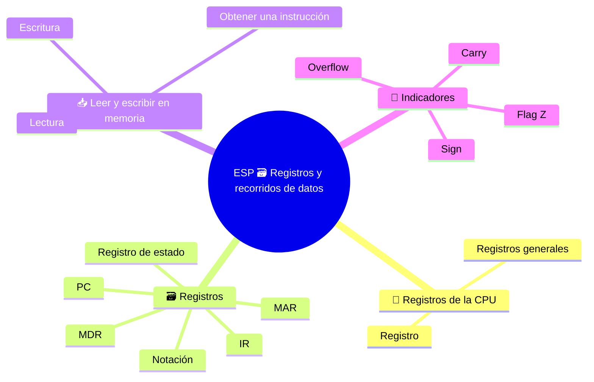

# ESP 🗃️ Registros y recorridos de datos

**3EI · Septiembre-Octubre · S3 · Teoría**

> **Leyenda:** ✅ hay que saber · 🔍 para entender a fondo · 🤓 opcional, para curiosos · 🃏 tarjeta: responde en voz alta y luego despliega la respuesta



## 🧭 Registros de la CPU

En el [modelo de Von Neumann](<(STU) ESP 3EI sett-ott S2 - La máquina de Von Neumann.md>), la CPU ejecuta instrucciones guardadas en memoria. Pero mientras espera una lectura, ¿dónde guarda la dirección? Y cuando llega la instrucción, ¿dónde la mantiene mientras prepara los datos?

Necesita pequeños puestos de trabajo internos. Es como seguir una receta: hacen falta un separador de páginas, la línea que se está leyendo y los ingredientes que se están usando. En la CPU, estas funciones corresponden a los **registros**.

## 🗃️ Registros

### ✅ Registros y funciones

Un **registro** es una memoria pequeña dentro del procesador, de capacidad limitada. Guarda bits, pero cada registro tiene una **función** que da significado a esos bits. Los **registros generales**, aquí R1, R2 y R3, guardan operandos y resultados temporales. En nuestro modelo, otros registros tienen tareas específicas.

| Nombre | Pregunta que responde | Contenido en el modelo |
|---|---|---|
| **PC**, Program Counter | ¿Dónde buscaré la siguiente instrucción? | Dirección de una instrucción |
| **IR**, Instruction Register | ¿Qué instrucción estoy ejecutando? | La instrucción obtenida |
| **MAR**, Memory Address Register | ¿Qué celda interviene en el acceso actual? | Una dirección de memoria |
| **MDR**, Memory Data Register | ¿Qué contenido estoy recibiendo o enviando? | El valor leído o que se escribirá |
| **Indicadores**, en el registro de estado | ¿Qué propiedad tuvo un resultado? | Información resumida, no el resultado completo |

En un momento dado, PC y MAR pueden contener el mismo número, pero **no tienen la misma función**. El PC sigue la secuencia de instrucciones; el MAR se usa en cada acceso, también para los datos. El MDR puede contener una instrucción: para la memoria no es más que un contenido transferido.

Estos nombres describen nuestra máquina didáctica. No todas las CPU comerciales tienen un registro físico con cada uno de estos nombres.

⚠️ **PC no significa computador personal aquí.** En esta lección es *Program Counter*, el contador de programa. En el lenguaje cotidiano PC también significa *Personal Computer*. La sigla es la misma, pero no la cosa: en informática conviene preguntarse «¿PC de qué tipo?». 😄

<details><summary>🃏 ¿Qué es un registro?</summary>
Una memoria pequeña y de capacidad limitada dentro del procesador.
</details>
<details><summary>🃏 ¿Para qué sirven registros generales como R1, R2 y R3?</summary>
Para guardar operandos y resultados temporales.
</details>
<details><summary>🃏 ¿Qué contiene el PC, Program Counter?</summary>
La dirección de la siguiente instrucción que se debe obtener.
</details>
<details><summary>🃏 ¿Qué contiene el IR, Instruction Register?</summary>
La instrucción que está ejecutando la CPU.
</details>
<details><summary>🃏 ¿Qué contiene el MAR?</summary>
La dirección de la celda del acceso actual, tanto para instrucciones como para datos.
</details>
<details><summary>🃏 ¿Qué contiene el MDR?</summary>
El contenido que la CPU recibe de la memoria o envía a ella.
</details>
<details><summary>🃏 ¿Qué son los indicadores o *flags*?</summary>
Información resumida sobre algunas propiedades de un resultado; no contienen el resultado completo.
</details>
<details><summary>🃏 Si PC y MAR tienen el mismo número, ¿cumplen la misma función?</summary>
No. PC sigue la secuencia de instrucciones; MAR se usa en cada acceso a memoria, también para datos.
</details>
<details><summary>🃏 ¿Todas las CPU tienen registros llamados PC, IR, MAR y MDR?</summary>
No. Son los nombres de nuestra máquina didáctica, no necesariamente los de una CPU comercial.
</details>

### ✅ Notación

- `R1 <- 7` significa «copia 7 en R1». La flecha no es una igualdad y no vacía la fuente.
- `MEM[40]` indica **el contenido** de la celda con dirección 40.
- `MAR <- 40` y `MDR <- MEM[40]` representan tareas diferentes.

En los ejemplos usamos celdas abstractas: cada celda contiene un dato entero o una instrucción completa. Más adelante estudiaremos bytes y capacidad, indicando las hipótesis necesarias.

<details><summary>🃏 ¿Qué significa `R1 <- 7`?</summary>
Copia 7 en R1. No es una igualdad y no vacía la fuente.
</details>
<details><summary>🃏 ¿Qué indica `MEM[40]`?</summary>
El contenido de la celda cuya dirección es 40, no el número 40.
</details>
<details><summary>🃏 ¿Qué puede contener una celda abstracta en nuestros ejemplos?</summary>
Un dato entero o una instrucción completa.
</details>

## 📥 Leer y escribir en memoria

### ✅ Ejemplo resuelto: leer el valor 23

La celda 40 contiene 23 y queremos copiarlo en R1. Por ahora ignoramos la obtención de la instrucción que ordena esta operación.

| Paso | Acción | Para qué sirve |
|---|---|---|
| 1 | `MAR <- 40` | Indica qué celda se debe leer. |
| 2 | La CU solicita `READ`. | Distingue una lectura de una escritura. |
| 3 | Espera. | La memoria no responde instantáneamente. ⏳ |
| 4 | `MDR <- MEM[MAR]`, así que MDR = 23. | Recibe el contenido. |
| 5 | `R1 <- MDR`, así que R1 = 23. | Guarda el valor en el registro destino. |

```text
MAR = 40 -- dirección --> MEMORIA
CU       -- READ -------> MEMORIA
                          MEM[40] = 23
                               |
                               v
                          MDR = 23 --> R1 = 23
```

Una lectura normal **no borra** el valor de la memoria: al terminar, MEM[40] sigue valiendo 23. R1 no recibe 40, porque 40 indica *dónde* buscar, no *qué* hay allí.

> ⏸️ **Fijación:** repite la secuencia con MEM[60] = 14 y el registro destino R2. En cada paso di en voz alta «dirección» o «contenido».

<details><summary>🃏 ¿Cuáles son los pasos de una lectura de memoria?</summary>
MAR recibe la dirección; la CU solicita READ; se espera; MDR recibe el contenido; el valor se copia al registro destino.
</details>
<details><summary>🃏 ¿Por qué hay que esperar durante una lectura?</summary>
Porque la memoria no responde instantáneamente.
</details>
<details><summary>🃏 Después de leer, ¿el valor sigue en la memoria?</summary>
Sí. Una lectura normal no borra el contenido de la celda.
</details>
<details><summary>🃏 Al leer la celda 40, ¿el registro destino recibe 40?</summary>
No. Recibe el contenido de la celda; 40 indica dónde buscar.
</details>

### 🔍 Obtener una instrucción

Supongamos PC = 10 y MEM[10] = `LOAD R1, [40]`. Para obtenerla, copiamos el PC en el MAR, solicitamos una lectura y recibimos la instrucción en el MDR. Después la copiamos al IR. Ahora la CU puede interpretarla.

```text
PC = 10 --> MAR = 10 --> MEM[10]
                              |
IR = LOAD R1,[40] <-- MDR <----+
```

Cuando se ejecuta `LOAD`, el MAR recibe 40 y el MDR recibe 23. Mientras tanto, el IR conserva la instrucción. Así la CPU no pierde la orden mientras obtiene el dato. En la próxima lección completaremos la secuencia mostrando cómo avanza el PC.

<details><summary>🃏 ¿Cómo llega una instrucción al IR?</summary>
Se copia PC en MAR, se solicita una lectura, la instrucción llega a MDR y luego se copia en IR.
</details>
<details><summary>🃏 Durante un `LOAD`, ¿por qué IR y MDR contienen cosas distintas?</summary>
IR conserva la instrucción y MDR recibe el dato solicitado. Así la CPU no pierde la orden.
</details>

### 🔍 Escribir en memoria

Queremos copiar el valor R3 = 12 a la celda 50. Preparamos `MAR <- 50` y `MDR <- R3`; luego la CU activa `WRITE`. Al terminar, MEM[50] contiene 12: el contenido anterior de esa celda se **reemplaza**. R3 sigue valiendo 12.

Hay que preparar la dirección y el valor antes de escribir. Una dirección equivocada modifica otra celda, aunque el valor sea correcto.

<details><summary>🃏 ¿Cuáles son los pasos de una escritura en memoria?</summary>
MAR recibe la dirección destino, MDR recibe el valor y luego la CU activa WRITE.
</details>
<details><summary>🃏 ¿Qué ocurre con el contenido anterior de la celda escrita?</summary>
Se reemplaza por el valor nuevo. El registro fuente conserva su valor.
</details>
<details><summary>🃏 ¿Por qué se preparan la dirección y el valor antes de WRITE?</summary>
Porque una dirección incorrecta modifica otra celda aunque el valor sea correcto.
</details>

## 🚩 Indicadores (*flags*)

### 🔍 Indicadores y resultados

Después de la resta $7-7$, el resultado es 0 y el indicador **Z** (*zero*, cero) puede valer 1 para señalarlo. Una instrucción posterior puede utilizar esa información para elegir una ruta.

Otros indicadores comunes: **carry** (acarreo en operaciones sin signo), **sign/negative** (relacionado con el bit de signo) y **overflow** (resultado fuera del intervalo en operaciones con signo). No son intercambiables. Qué instrucciones actualizan qué indicadores depende de la arquitectura.

> 🔧 **Conexión con el laboratorio:** añadir un módulo RAM aumenta la memoria principal, no el número de registros de la CPU. La capacidad indicada en un módulo no describe la memoria interna del procesador.

<details><summary>🃏 ¿Para qué sirve el indicador Z?</summary>
Señala que el resultado es cero, por ejemplo después de 7 - 7.
</details>
<details><summary>🃏 ¿Qué indican carry, sign y overflow?</summary>
Carry: acarreo en operaciones sin signo. Sign o negative: bit de signo. Overflow: resultado fuera del intervalo con signo.
</details>
<details><summary>🃏 ¿Todas las CPU actualizan los indicadores del mismo modo?</summary>
No. Depende de la arquitectura y de la instrucción.
</details>
<details><summary>🃏 ¿Añadir RAM aumenta el número de registros de la CPU?</summary>
No. Aumenta la memoria principal, no la memoria interna del procesador.
</details>

### 🤓 Desbordamiento y acarreo

> Un registro de 4 bits tiene 16 configuraciones. Como enteros sin signo representa de 0 a 15. La suma $15+1$ requiere cinco bits: `1111 + 0001 = 10000`. Si conservamos solo cuatro, queda `0000` y se produce un acarreo.
>
> La máquina no se ha equivocado: se ha alcanzado el límite de la representación elegida. Si interpretamos los mismos bits como números con signo, cambian el intervalo y el significado de los indicadores. Por eso «carry» y «overflow» no son dos nombres para lo mismo. 🎮 Algunos fallos gráficos de videojuegos antiguos nacían de contadores que «volvían a empezar desde cero».

<details><summary>🃏 ¿Qué valores sin signo representa un registro de 4 bits?</summary>
De 0 a 15: 16 configuraciones.
</details>
<details><summary>🃏 ¿Qué ocurre al calcular 15 + 1 con 4 bits?</summary>
Se necesitarían cinco bits, `10000`. Si se guardan solo cuatro, queda `0000` y hay acarreo.
</details>
<details><summary>🃏 ¿Carry y overflow son lo mismo?</summary>
No. Carry se refiere a operaciones sin signo; overflow, a operaciones con signo.
</details>

## 🧩 Pon a prueba el modelo

1. **Base.** Relaciona PC, IR, MAR y MDR con: dirección de la siguiente instrucción, instrucción actual, dirección del acceso y contenido transferido.
2. **Aplicación.** MEM[18] = 6. Escribe los pasos para copiar ese valor a R2.
3. **Procedimiento.** R3 = 15. Describe cómo escribirlo en MEM[24]: ¿qué valores cambian y cuáles permanecen?
4. **Conexión.** Durante la lectura de un dato, ¿por qué IR y MDR pueden contener cosas diferentes?
5. **Intuición.** PC y MAR valen 10. ¿Significa que uno es inútil? Justifica tu respuesta pensando en la lectura de un dato.
6. **Base.** Si el indicador Z vale 1, ¿significa que el registro de estado contiene el resultado de la operación?

**🚪 Salida:** dibuja MAR y MDR con un valor cada uno y explica por qué no los intercambiaste.

**🏠 Opcional en casa:** cuenta la misma lectura en cuatro líneas sin siglas y luego vuelve a incorporarlas.

## 📚 Fuentes y recursos

- [Nand2Tetris - Project 5](https://www.nand2tetris.org/project05) (en inglés, para curiosos): compara la CPU y la memoria de un computador didáctico real con nuestro modelo; no todos los nombres de registros coinciden.
- [Especificaciones oficiales de RISC-V](https://riscv.org/specifications/) (en inglés, muy técnico): para ver cómo una arquitectura real define sus registros.

---

[[(STU) ESP 3EI sett-ott S2 - La máquina de Von Neumann|⬅️ S2 - La máquina de Von Neumann]] · [[(STU) ESP 3EI - SETT-OTT|🗺️ Índice]] · [[(STU) ESP 3EI sett-ott S4 - El ciclo de máquina|S4 - El ciclo de máquina ➡️]]
