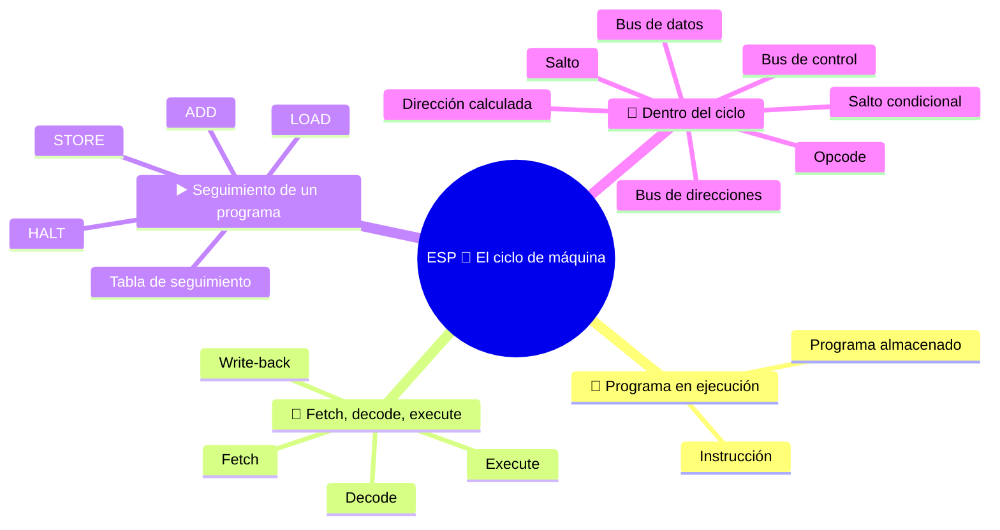

⬅️ [S3 - Registros y recorridos de datos](%28STU%29%20ESP%203EI%20sett-ott%20S3%20-%20Registros%20y%20recorridos%20de%20datos.md) · 🏠 [Indice](%28STU%29%20ESP%203EI%20-%20SETT-OTT.md) · [S5 - Direcciones y jerarquía de memoria](%28STU%29%20ESP%203EI%20sett-ott%20S5%20-%20Direcciones%20y%20jerarqu%C3%ADa%20de%20memoria.md) ➡️

# ESP 🔄 El ciclo de máquina

**3EI · Septiembre-Octubre · S4 · Teoría**

> **Leyenda:** ✅ hay que saber · 🔍 para entender a fondo · 🤓 opcional, para curiosos · 🃏 tarjeta: responde en voz alta y luego despliega la respuesta



## 🧭 Programa en ejecución

Un programa en memoria, por sí solo, no hace nada. Después de distinguir [[(STU) ESP 3EI sett-ott S3 - Registros y recorridos de datos|registros y recorridos de datos]], debemos entender quién hace avanzar el trabajo. La fuerza del programa almacenado también está aquí: al repetir el mismo procedimiento general, la misma máquina produce comportamientos muy distintos.

Una receta no es el plato. Para pasar de una a otro hay que saber qué instrucción leer, cómo interpretarla y qué modificar. La CPU hace todo esto sin «entender» las instrucciones como lo haría una persona.

Este procedimiento no es un descubrimiento reciente: ya estaba descrito en el informe sobre EDVAC de 1945. Hoy los procesadores lo ocultan tras muchos trucos para ir más rápido; los veremos en noviembre. El modelo sigue siendo útil para entender lo que ocurre.

## 🔄 El ciclo en tres fases

### ✅ Fetch, decode, execute

```text
FETCH                 DECODE                  EXECUTE
obtiene la orden  --> interpreta la orden --> realiza la operación
       ^                                            |
       +------------ siguiente instrucción --------+
```

- **Fetch:** la CPU obtiene la instrucción de la memoria.
- **Decode:** la CU reconoce la operación y sus operandos.
- **Execute:** la CPU realiza el trabajo: un cálculo, un acceso a memoria o un cambio de ruta en el programa.

A menudo separamos la ejecución en acceso a los datos y escritura del resultado (**write-back**). Es una forma de describir el proceso: no todas las instrucciones leen datos de la RAM ni todas escriben un registro. Por ejemplo, `STORE` escribe en la memoria.

<details><summary>🃏 <b>¿Qué ocurre durante el fetch?</b></summary>
La CPU obtiene de la memoria la instrucción que debe ejecutar.
</details>
<details><summary>🃏 <b>¿Qué ocurre durante el decode?</b></summary>
La CU reconoce la operación solicitada y sus operandos.
</details>
<details><summary>🃏 <b>¿Qué ocurre durante el execute?</b></summary>
La CPU realiza el trabajo: cálculo, acceso a memoria o cambio de ruta en el programa.
</details>
<details><summary>🃏 <b>¿Qué es el write-back?</b></summary>
La escritura del resultado, que a menudo se describe como un paso separado de la ejecución.
</details>

## ▶️ Seguimiento de un programa

### ✅ Reglas de nuestra máquina

Para todo el seguimiento se aplican estas reglas:

- Cada celda abstracta contiene una instrucción completa o un valor.
- Las instrucciones están en celdas consecutivas. Después de obtener una instrucción hacemos `PC <- PC + 1` (**solo en este modelo**).
- `LOAD R1, [40]` copia MEM[40] en R1, sin modificar MEM[40].
- `ADD R3, R1, R2` escribe en R3 la suma de R1 y R2, sin modificar las fuentes.
- `STORE [41], R3` copia R3 en MEM[41]; `HALT` termina la simulación.

<details><summary>🃏 <b>¿Cuánto aumenta el PC después de obtener una instrucción en nuestro modelo?</b></summary>
En uno, porque cada instrucción ocupa una celda abstracta y las instrucciones son consecutivas. Solo vale para este modelo.
</details>
<details><summary>🃏 <b>¿Qué hacen LOAD y STORE?</b></summary>
LOAD copia un valor de la memoria a un registro; STORE copia un registro en la memoria. Ninguna borra la fuente.
</details>
<details><summary>🃏 <b>¿Qué modifica `ADD R3, R1, R2`?</b></summary>
Solo R3, donde escribe la suma de R1 y R2.
</details>
<details><summary>🃏 <b>¿Qué hace HALT?</b></summary>
Termina la simulación.
</details>

### ✅ Ejemplo resuelto: LOAD, ADD, STORE

**Situación inicial:** PC = 10, R1 = 0, R2 = 5 y R3 = 0.

| Dirección | Contenido |
|---|---|
| 10 | `LOAD R1, [40]` |
| 11 | `ADD R3, R1, R2` |
| 12 | `STORE [41], R3` |
| 13 | `HALT` |
| 40 | 7 |
| 41 | 0 |

**1️⃣ LOAD.** El PC indica 10: el *fetch* lleva la instrucción de MEM[10] al IR y el PC avanza a 11. La CU reconoce que debe leer la celda 40: recibe 7 y lo guarda en R1.

**2️⃣ ADD.** El nuevo *fetch* usa 11, no 40: 40 era la dirección de un dato, no la siguiente instrucción. El PC avanza a 12. La ALU recibe 7 y 5, produce 12 y el resultado va a R3.

**3️⃣ STORE.** El *fetch* usa 12 y el PC avanza a 13. A la memoria llegan la dirección 41, el valor 12 y la orden WRITE. MEM[41] pasa a valer 12. R3 sigue valiendo 12.

**🛑 HALT.** Se obtiene la instrucción de la celda 13 y el PC avanza a 14 según la regla; la instrucción detiene la simulación. La celda 14 no se ejecuta.

| Después de ejecutar | PC | R1 | R2 | R3 | MEM[40] | MEM[41] |
|---|---:|---:|---:|---:|---:|---:|
| LOAD | 11 | 7 | 5 | 0 | 7 | 0 |
| ADD | 12 | 7 | 5 | 12 | 7 | 0 |
| STORE | 13 | 7 | 5 | 12 | 7 | 12 |
| HALT | 14 | 7 | 5 | 12 | 7 | 12 |

> ⏸️ **Fijación:** explica por qué el PC nunca pasa a 40 y por qué MEM[40] no queda en cero después de LOAD.

<details><summary>🃏 <b>Después de un LOAD desde 40, ¿el PC salta a 40?</b></summary>
No. 40 es la dirección de un dato; el PC indica la siguiente instrucción del programa.
</details>
<details><summary>🃏 <b>¿Qué cambia después de STORE en el ejemplo?</b></summary>
La celda 41 recibe 12; R3 sigue valiendo 12 y el PC pasa a 13.
</details>
<details><summary>🃏 <b>¿Se ejecuta la instrucción posterior a HALT?</b></summary>
No. El PC avanza según la regla, pero la simulación se detiene.
</details>
<details><summary>🃏 <b>¿Cómo seguimos un programa en papel sin perdernos?</b></summary>
Anotamos el estado inicial y actualizamos una tabla de PC, registros y memoria después de cada instrucción.
</details>

## 🔬 Dentro del ciclo

### 🔍 El fetch en detalle

| Paso | Transferencia u orden | Estado |
|---|---|---|
| 1 | `MAR <- PC` | MAR = 10 |
| 2 | Solicitud READ y espera | La memoria utiliza la dirección 10 |
| 3 | `MDR <- MEM[MAR]` | MDR contiene `LOAD R1, [40]` |
| 4 | `IR <- MDR` | IR conserva la instrucción |
| 5 | `PC <- PC + 1` | PC = 11 en el modelo |

El *decode* reconoce el **opcode** `LOAD`, el registro destino R1 y la dirección 40. Para completar la instrucción hace falta un segundo acceso: `MAR <- 40`, READ, espera, `MDR <- MEM[40]`, `R1 <- MDR`.

En la misma instrucción hemos leído la memoria **dos veces**, con fines diferentes: primero la orden y luego el dato. Mientras tanto, el IR conserva la orden aunque se vuelva a utilizar el MDR.

<details><summary>🃏 <b>¿Cuáles son los pasos del fetch?</b></summary>
MAR recibe el PC; se solicita READ y se espera; MDR recibe la instrucción; IR recibe MDR; el PC avanza.
</details>
<details><summary>🃏 <b>¿Qué es el opcode?</b></summary>
La parte de la instrucción que indica la operación, por ejemplo LOAD.
</details>
<details><summary>🃏 <b>¿Cuántas veces accede a la memoria una instrucción LOAD?</b></summary>
Dos: primero para obtener la instrucción y luego para leer el dato solicitado.
</details>
<details><summary>🃏 <b>¿Por qué el dato de LOAD no reemplaza la instrucción en IR?</b></summary>
Porque el dato llega a MDR; IR conserva la orden hasta que termina la instrucción.
</details>

### 🔍 Los tres buses en acción

| Conexión | Durante el fetch | Al escribir un dato |
|---|---|---|
| **Direcciones: ¿dónde?** | CPU → memoria: posición de la instrucción | CPU → memoria: posición destino |
| **Datos: ¿qué contenido?** | Memoria → CPU: instrucción | CPU → memoria: valor que se guarda |
| **Control: ¿qué acción?** | Lectura y señal de finalización | Escritura y señal de finalización |

La CU genera señales que seleccionan recorridos y habilitan operaciones. No transporta los números «a mano» ni calcula en lugar de la ALU. Una transferencia entre registros usa conexiones internas y no accede a la RAM.

<details><summary>🃏 <b>¿En qué dirección va el bus de direcciones?</b></summary>
De la CPU a la memoria, durante el fetch y al escribir un dato.
</details>
<details><summary>🃏 <b>¿En qué dirección va el bus de datos?</b></summary>
Depende: de memoria a CPU durante el fetch; de CPU a memoria al escribir.
</details>
<details><summary>🃏 <b>¿Qué circula por el bus de control?</b></summary>
La orden de lectura o escritura y las señales de finalización.
</details>
<details><summary>🃏 <b>¿La CU transporta los números o realiza los cálculos?</b></summary>
No. Genera señales que seleccionan recorridos y activan operaciones; la ALU calcula.
</details>

### 🔍 Dirección calculada

`LOAD R1, [R2+4]` primero requiere calcular la dirección. Si R2 = 36, la ALU calcula $36+4=40$. Si MEM[40] = 7, R1 recibe **7**, no 40 ni 36.

El trabajo es: obtener la instrucción, interpretarla, calcular la dirección, leer el dato y escribirlo en el registro. Aquí la suma de la ALU no produce el resultado final: sirve para **encontrar** el dato.

> 🔧 **Conexión con el laboratorio:** cuando ves que se inicia un programa en una computadora, no observas una sola instrucción. Detrás de un clic hay muchísimas instrucciones y transferencias. Para estudiarlas, usamos un seguimiento en papel.

<details><summary>🃏 <b>¿Qué significa `LOAD R1, [R2+4]`?</b></summary>
Primero suma 4 al contenido de R2 para calcular una dirección y luego copia a R1 el contenido de la celda encontrada.
</details>
<details><summary>🃏 <b>En una dirección calculada, ¿para qué sirve la ALU?</b></summary>
Para encontrar el dato: la suma obtiene la dirección, no el valor final.
</details>
<details><summary>🃏 <b>¿Un clic en un icono corresponde a una sola instrucción?</b></summary>
No. Detrás de un gesto hay muchísimas instrucciones y transferencias.
</details>

### 🤓 Saltos y ciclos

> Un **salto** cambia el PC a una dirección distinta de la celda siguiente. Un **salto condicional** lo hace solo si se cumple una condición, por ejemplo, si un indicador tiene cierto valor. Así un programa puede elegir entre rutas o repetir operaciones: de aquí surgen las instrucciones `if` y los ciclos.
>
> En las CPU reales una instrucción puede ocupar varios bytes, de longitud fija o variable: el PC no siempre aumenta en uno. Además, «un paso» de nuestro modelo no equivale necesariamente a «un ciclo de reloj». Las optimizaciones y las tuberías (*pipeline*) se verán en noviembre-diciembre.

<details><summary>🃏 <b>¿Qué hace un salto?</b></summary>
Cambia el PC a una dirección diferente de la celda siguiente.
</details>
<details><summary>🃏 <b>¿Qué hace un salto condicional?</b></summary>
Cambia el PC solo si se cumple una condición. Así se pueden crear decisiones y ciclos.
</details>
<details><summary>🃏 <b>¿En las CPU reales el PC siempre aumenta en uno?</b></summary>
No. Las instrucciones pueden ocupar varios bytes, de longitud fija o variable.
</details>
<details><summary>🃏 <b>¿Un paso del ciclo equivale a un ciclo de reloj?</b></summary>
No necesariamente: nuestro listado es un modelo, no una medida del tiempo.
</details>

## 🧩 Pon a prueba el modelo

1. **Base.** ¿Qué diferencia hay entre fetch, decode y execute?
2. **Procedimiento.** En el fetch, ordena: `IR <- MDR`, `MAR <- PC`, lectura de memoria y recepción en MDR. ¿Quién solicita READ?
3. **Aplicación.** En el programa resuelto, cambia el valor inicial de R2 a 4 y MEM[40] a 9. Completa la tabla hasta STORE.
4. **Conexión.** ¿Qué diferencia hay entre obtener la instrucción `LOAD R1,[40]` y leer el dato que esta solicita?
5. **Detalle.** Para `LOAD R1,[R2+4]`, con R2 = 60 y MEM[64] = 17, ¿cuál es la dirección efectiva y el valor final de R1?
6. **Intuición.** Si el resultado de la ALU no se escribe en ningún sitio, ¿basta con que se haya calculado para poder usarlo más tarde?

**🚪 Salida:** completa: «LOAD obtiene ..., mientras que su fetch obtiene ...».

**🏠 Opcional:** cuenta el programa a alguien sin decir «magia» ni «el computador entiende».

## 📚 Fuentes y recursos

- [Nand2Tetris - Project 5](https://www.nand2tetris.org/project05) (en inglés, para curiosos): un computador didáctico funcional; compara sus decisiones con nuestra simulación.
- [Especificaciones oficiales de RISC-V](https://riscv.org/specifications/) (en inglés, muy técnico): para ver cómo cambian las instrucciones, registros y modos de direccionamiento entre arquitecturas.

---

[[(STU) ESP 3EI sett-ott S3 - Registros y recorridos de datos|⬅️ S3 - Registros y recorridos de datos]] · [[(STU) ESP 3EI - SETT-OTT|🗺️ Índice]] · [[(STU) ESP 3EI sett-ott S5 - Direcciones y jerarquía de memoria|S5 - Direcciones y jerarquía de memoria ➡️]]

⬅️ [S3 - Registros y recorridos de datos](%28STU%29%20ESP%203EI%20sett-ott%20S3%20-%20Registros%20y%20recorridos%20de%20datos.md) · 🏠 [Indice](%28STU%29%20ESP%203EI%20-%20SETT-OTT.md) · [S5 - Direcciones y jerarquía de memoria](%28STU%29%20ESP%203EI%20sett-ott%20S5%20-%20Direcciones%20y%20jerarqu%C3%ADa%20de%20memoria.md) ➡️
