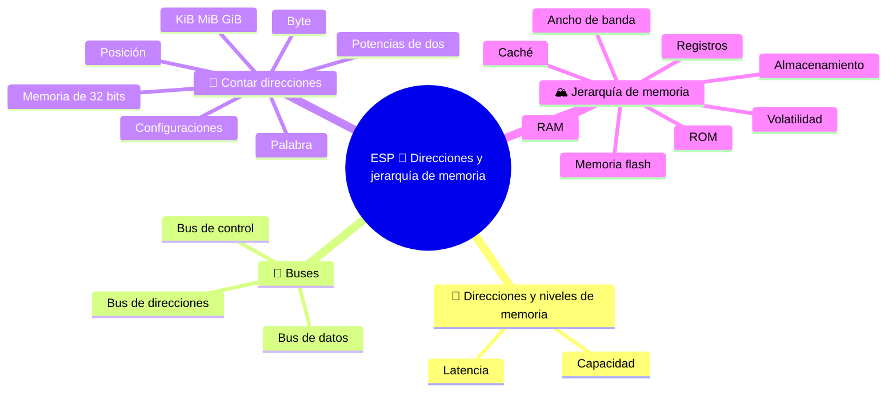

⬅️ [S4 - El ciclo de máquina](%28STU%29%20ESP%203EI%20sett-ott%20S4%20-%20El%20ciclo%20de%20m%C3%A1quina.md) · 🏠 [Indice](%28STU%29%20ESP%203EI%20-%20SETT-OTT.md) · [S6 - Caché, localidad y reloj](%28STU%29%20ESP%203EI%20sett-ott%20S6%20-%20Cach%C3%A9%2C%20localidad%20y%20reloj.md) ➡️

# ESP 🧮 Direcciones y jerarquía de memoria

**3EI · Septiembre-Octubre · S5 · Teoría**

> **Leyenda:** ✅ hay que saber · 🔍 para entender a fondo · 🤓 opcional, para curiosos · 🃏 tarjeta: responde en voz alta y luego despliega la respuesta



## 🧭 Direcciones y niveles de memoria

En el [[(STU) ESP 3EI sett-ott S4 - El ciclo de máquina|ciclo de máquina]] bastaba con escribir «celda 40». Una máquina real, en cambio, debe representar esa dirección con una cantidad limitada de bits y transportar el contenido por conexiones físicas. ¿Cuántas posiciones puede distinguir? ¿Cuánto cabe en ellas? ¿Cuánto hay que esperar?

El crecimiento de los computadores no ha eliminado estas preguntas. Una memoria más grande permite programas y datos mayores, pero **la capacidad y la velocidad no necesariamente crecen juntas**. Construir un sistema significa decidir cómo usar recursos limitados, no buscar un único componente perfecto.

Un ejemplo histórico lo muestra claramente. En los primeros computadores, como el EDSAC (1949), muchos bits se guardaban en tubos llenos de mercurio, donde un pulso viajaba como una onda sonora: para leer un bit había que **esperar a que la onda pasara por el punto adecuado**. Había capacidad, pero la espera era larga. Después llegaron los núcleos de ferrita y, por último, las memorias de semiconductores. El compromiso entre espacio, espera y costo nunca ha desaparecido.

## 🚌 Buses

### ✅ Datos, direcciones y control

Un **bus** es un conjunto de conexiones que se utiliza para comunicar siguiendo reglas precisas. En nuestro modelo distinguimos tres funciones:

| Función | Pregunta | Ejemplo de lectura |
|---|---|---|
| **Direcciones** | ¿Dónde? | La CPU indica 40 |
| **Datos** | ¿Qué contenido? | La memoria devuelve 7 |
| **Control** | ¿Qué operación y cuándo? | READ y señal «dato listo» |

Al escribir, el contenido viaja de la CPU a la memoria. Las señales de control no van todas en la misma dirección: la confirmación «terminado» vuelve a quien solicitó la operación.

Es una separación por funciones. Un computador moderno puede utilizar conexiones punto a punto, seriales o compartidas en el tiempo: no busques necesariamente tres grupos de cables iguales al dibujo en la placa madre.

<details><summary>🃏 <b>¿Qué es un bus?</b></summary>
Un conjunto de conexiones que se utiliza para comunicar siguiendo reglas precisas.
</details>
<details><summary>🃏 <b>¿Cuáles son las tres funciones y qué pregunta responde cada una?</b></summary>
Direcciones: ¿dónde? Datos: ¿qué contenido? Control: ¿qué operación y cuándo?
</details>
<details><summary>🃏 <b>Al escribir, ¿en qué dirección viaja el contenido?</b></summary>
De la CPU a la memoria. La confirmación de que terminó vuelve a quien solicitó la operación.
</details>

## 🔢 Contar direcciones

### ✅ Bits y direcciones

Un bit tiene dos configuraciones: 0 y 1. Dos bits tienen cuatro; tres bits, ocho. Cada bit adicional **duplica** las posibilidades, porque antes de cada secuencia se puede colocar un 0 o un 1.

| Bits de dirección | Configuraciones | Direcciones, empezando en cero |
|---:|---:|---|
| 1 | 2 | 0-1 |
| 2 | 4 | 0-3 |
| 3 | 8 | 0-7 |
| 4 | 16 | 0-15 |

Con $n$ bits de dirección se distinguen:

$$N = 2^n\ \text{posiciones}$$

⚠️ El número de posiciones no es la última dirección: con 16 posiciones, la última es 15. Tampoco es todavía una capacidad en bytes: debemos saber cuánto contiene cada posición.

<details><summary>🃏 <b>¿Por qué cada bit adicional duplica las configuraciones?</b></summary>
Porque delante de cada secuencia anterior se puede poner 0 o 1.
</details>
<details><summary>🃏 <b>Con n bits de dirección, ¿cuántas posiciones se distinguen?</b></summary>
2 elevado a n.
</details>
<details><summary>🃏 <b>Con 2 elevado a n posiciones, ¿cuál es la última dirección?</b></summary>
2 elevado a n menos 1, porque se empieza en cero.
</details>
<details><summary>🃏 <b>¿El número de posiciones ya es una capacidad en bytes?</b></summary>
No. Hay que saber cuántos bytes contiene cada posición.
</details>

### ✅ Ejemplo resuelto: memoria direccionada por bytes

Aquí cada dirección identifica **un byte** (8 bits). Con 12 bits de dirección:

$$N = 2^{12} = 4096\ \text{posiciones}$$

$$C = 4096\ \text{posiciones} \times 1\ \frac{\text{byte}}{\text{posición}} = 4096\ \text{bytes} = 4\ \text{KiB}$$

Las direcciones van de 0 a 4095. Atención: este es el espacio **representable**, no la memoria realmente instalada en el computador.

> ⏸️ **Fijación:** si añades un bit a la dirección, ¿cuántas posiciones adicionales se pueden distinguir? Explícalo primero con combinaciones y después con la fórmula.

<details><summary>🃏 <b>¿Cómo se calcula la capacidad de una memoria?</b></summary>
Número de posiciones multiplicado por los bytes que contiene cada posición.
</details>
<details><summary>🃏 <b>¿Qué significa «memoria direccionada por bytes»?</b></summary>
Que cada dirección identifica un byte, es decir, 8 bits.
</details>
<details><summary>🃏 <b>Con 12 bits de dirección por byte, ¿cuánta memoria se puede representar?</b></summary>
4096 posiciones de un byte: 4096 bytes, o 4 KiB, con direcciones de 0 a 4095.
</details>

### 🔍 Bytes, palabras y unidades

Un byte contiene 8 bits. Usamos **KiB = 1024 bytes**, **MiB = $2^{20}$ bytes** y **GiB = $2^{30}$ bytes**. Los prefijos decimales kB, MB y GB indican potencias de 1000. No son errores: son convenciones diferentes y hay que indicarlas.

Si cada posición contiene una **palabra de 2 bytes** y las direcciones tienen 12 bits, siguen existiendo 4096 posiciones, pero la capacidad pasa a ser $4096\times2=8192$ bytes, es decir, 8 KiB. Igual número de direcciones, distinta cantidad por posición.

El ancho del bus de datos indica cuánto se transfiere de una vez; el ancho de direcciones indica cuántas posiciones se distinguen. Un bus de datos de 16 bits **no** demuestra que existan solo $2^{16}$ bytes de memoria. Y «CPU de 64 bits» no nos dice por sí sola cuántas líneas de dirección física existen.

<details><summary>🃏 <b>¿Cuántos bytes son 1 KiB, 1 MiB y 1 GiB?</b></summary>
1 KiB = 1024 bytes; 1 MiB = 2 elevado a 20 bytes; 1 GiB = 2 elevado a 30 bytes.
</details>
<details><summary>🃏 <b>¿Qué diferencia hay entre KiB y kB?</b></summary>
KiB es una potencia de 2 (1024 bytes); kB es una potencia de 10 (1000 bytes).
</details>
<details><summary>🃏 <b>Si cada posición contiene una palabra de 2 bytes, ¿qué cambia?</b></summary>
El número de direcciones permanece igual y la capacidad se duplica.
</details>
<details><summary>🃏 <b>¿Qué indica el ancho del bus de datos y el de direcciones?</b></summary>
El de datos indica cuánto se transfiere de una vez; el de direcciones, cuántas posiciones se distinguen.
</details>

### 🤓 Memoria de 32 bits

> En un modelo direccionado por bytes, $2^{32}$ direcciones corresponden a 4 GiB. En una máquina real también intervienen direcciones físicas y virtuales, zonas reservadas para dispositivos y límites del procesador y del sistema operativo. No todas las direcciones corresponden a RAM instalada. 💾 Por eso, hace años muchos computadores con sistemas de 32 bits «veían» menos RAM de la que tenían instalada.
>
> La lección sigue siendo útil sin conocer esos mecanismos: **una fórmula es fiable cuando sus hipótesis están escritas con claridad**.

<details><summary>🃏 <b>En un modelo direccionado por bytes, ¿cuánta memoria direccionan 32 bits?</b></summary>
4 GiB.
</details>
<details><summary>🃏 <b>¿Por qué algunos computadores de 32 bits veían menos RAM de la instalada?</b></summary>
Porque no todas las direcciones corresponden a RAM; también hay zonas reservadas para dispositivos y límites del procesador y del sistema operativo.
</details>

## 🏔️ Jerarquía de memoria

### ✅ Niveles y compromisos

La memoria ideal sería enorme, rapidísima, barata y conservaría los datos sin electricidad. Las tecnologías reales obligan a elegir compromisos. Por eso un computador tiene varios niveles.

```text
REGISTROS     pocos valores que la CPU usa de inmediato
   |
CACHÉ         copias de partes útiles de la memoria principal
   |
RAM           programas y datos activos
   |
SSD / HDD     archivos y datos que deben persistir al apagar
```

En general, al subir hacia los registros disminuyen la capacidad y el tiempo de acceso, mientras aumenta el costo por bit. Es un modelo orientativo, no una escala con valores iguales para todos los dispositivos.

**Volátil** significa que la memoria necesita electricidad para conservar el contenido: los registros, la caché y la RAM son volátiles. SSD y HDD no lo son. ⚠️ La persistencia **no aumenta gradualmente** al bajar de nivel: es una propiedad separada que se debe indicar aparte.

<details><summary>🃏 <b>¿Por qué un computador usa varios tipos de memoria?</b></summary>
Porque ninguna tecnología es a la vez enorme, rapidísima, barata y capaz de conservar datos sin electricidad.
</details>
<details><summary>🃏 <b>¿Cuáles son los niveles de memoria, desde el más cercano a la CPU?</b></summary>
Registros, caché, RAM y almacenamiento como SSD o HDD.
</details>
<details><summary>🃏 <b>Al acercarnos a los registros, ¿cómo cambian capacidad, tiempo de acceso y costo?</b></summary>
Disminuyen la capacidad y el tiempo de acceso; aumenta el costo por bit. Es un modelo orientativo.
</details>
<details><summary>🃏 <b>¿Qué significa «volátil»?</b></summary>
Que la memoria necesita electricidad para conservar su contenido.
</details>
<details><summary>🃏 <b>¿Qué memorias son volátiles?</b></summary>
Los registros, la caché y la RAM. SSD y HDD no son volátiles.
</details>

### 🔍 Capacidad, latencia y ancho de banda

- **Capacidad:** cuánta información se puede guardar (bytes, GiB).
- **Latencia:** cuánto se espera para obtener la respuesta a un acceso (nanosegundos).
- **Ancho de banda:** cuánta información se transfiere por segundo (GB/s).
- **Costo por bit y consumo:** cuántos recursos hacen falta para construir y usar la memoria.

Un archivo grande puede contener muchos documentos y aun así tomar tiempo encontrar el primero. Un canal puede transferir muchos bytes por segundo sin eliminar la espera inicial. Decir solamente «esta memoria es mejor» oculta la verdadera pregunta: **¿mejor para qué trabajo?**

Por la misma razón, **más RAM no hace que el procesador sea más rápido**. Una RAM mayor permite mantener más programas y datos preparados, pero no cambia la velocidad de cálculo de la CPU.

<details><summary>🃏 <b>¿Qué es la capacidad de una memoria?</b></summary>
Cuánta información puede guardar, medida por ejemplo en bytes o GiB.
</details>
<details><summary>🃏 <b>¿Qué es la latencia?</b></summary>
Cuánto hay que esperar para obtener la respuesta a un acceso.
</details>
<details><summary>🃏 <b>¿Qué es el ancho de banda?</b></summary>
Cuánta información se puede transferir por segundo.
</details>
<details><summary>🃏 <b>¿Un ancho de banda alto elimina la espera inicial?</b></summary>
No. Un canal puede transferir muchos bytes por segundo y aun así hacer esperar antes del primer dato.
</details>
<details><summary>🃏 <b>¿Qué pregunta falta en «esta memoria es mejor»?</b></summary>
¿Mejor para qué trabajo?
</details>
<details><summary>🃏 <b>¿Más RAM hace más rápido el procesador?</b></summary>
No. Permite mantener más datos preparados, pero no cambia la velocidad de cálculo de la CPU.
</details>

### 🔍 RAM, ROM y almacenamiento

La **RAM** principal permite acceder directamente a cada posición para leer y escribir durante el trabajo. El **almacenamiento** conserva archivos y programas aunque el computador esté apagado; para ejecutarlos, el sistema lleva a la RAM las partes necesarias.

**ROM** significa memoria de solo lectura: en sus formas tradicionales, el contenido no cambia durante el uso normal. Hoy, gran parte del firmware se guarda en memoria **flash**, que no es volátil pero puede reescribirse mediante procedimientos especiales. ROM y flash no son «un nivel entre RAM y disco»: hay que describir su tecnología y su función. El firmware y el arranque del computador se verán en el siguiente bimestre.

> 🔧 **Conexión con el laboratorio:** «16 GB de RAM» y «512 GB de SSD» describen recursos distintos. Sumarlos y llamarlos «RAM disponible» sería incorrecto.

<details><summary>🃏 <b>¿Qué caracteriza a la RAM principal?</b></summary>
Permite leer y escribir directamente cada posición durante el trabajo.
</details>
<details><summary>🃏 <b>Para ejecutar un programa guardado en un SSD, ¿qué hace el sistema?</b></summary>
Lleva a la RAM las partes necesarias.
</details>
<details><summary>🃏 <b>¿Qué significa ROM?</b></summary>
Memoria de solo lectura: en sus formas tradicionales el contenido no cambia durante el uso normal.
</details>
<details><summary>🃏 <b>¿Dónde se guarda hoy gran parte del firmware?</b></summary>
En memoria flash: no volátil, pero reescribible mediante procedimientos especiales.
</details>

## 🧩 Pon a prueba el modelo

1. **Base.** Distingue capacidad, latencia y volatilidad con una frase para cada una.
2. **Aplicación.** Un modelo tiene 10 bits de dirección y posiciones de un byte. Calcula las posiciones, la capacidad y la última dirección.
3. **Detalle.** Repite el cálculo con los mismos 10 bits, pero con posiciones de 2 bytes. ¿Qué cambia?
4. **Aplicación.** Con 16 bits de dirección por byte, ¿cuántos KiB se pueden representar? ¿El resultado demuestra cuánta RAM está instalada?
5. **Conexión.** ¿Por qué una caché mayor no se convierte automáticamente en memoria no volátil?
6. **Intuición.** Para leer MEM[40] = 7, ¿qué información viaja como dirección, cuál como control y cuál como contenido?

**🚪 Salida:** completa: «$2^n$ cuenta ..., para obtener los bytes debo saber ...».

**🏠 Opcional:** lee dos capacidades de una ficha técnica y explica qué recursos describen; no compares productos solo por el número más grande.

## 📚 Fuentes y recursos

- [NIST - Prefijos para múltiplos binarios](https://physics.nist.gov/cuu/Units/binary.html) (en inglés): tabla para distinguir KiB/MiB/GiB de kB/MB/GB.
- [Nand2Tetris - Project 3](https://www.nand2tetris.org/project03) (en inglés, para curiosos): cómo construir una memoria didáctica con direcciones y celdas.

---

[[(STU) ESP 3EI sett-ott S4 - El ciclo de máquina|⬅️ S4 - El ciclo de máquina]] · [[(STU) ESP 3EI - SETT-OTT|🗺️ Índice]] · [[(STU) ESP 3EI sett-ott S6 - Caché, localidad y reloj|S6 - Caché, localidad y reloj ➡️]]

⬅️ [S4 - El ciclo de máquina](%28STU%29%20ESP%203EI%20sett-ott%20S4%20-%20El%20ciclo%20de%20m%C3%A1quina.md) · 🏠 [Indice](%28STU%29%20ESP%203EI%20-%20SETT-OTT.md) · [S6 - Caché, localidad y reloj](%28STU%29%20ESP%203EI%20sett-ott%20S6%20-%20Cach%C3%A9%2C%20localidad%20y%20reloj.md) ➡️
