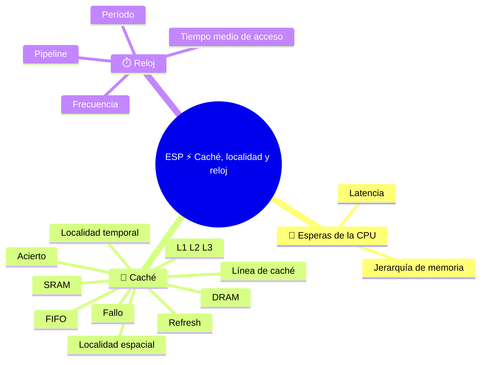

⬅️ [S5 - Direcciones y jerarquía de memoria](%28STU%29%20ESP%203EI%20sett-ott%20S5%20-%20Direcciones%20y%20jerarqu%C3%ADa%20de%20memoria.md) · 🏠 [Indice](%28STU%29%20ESP%203EI%20-%20SETT-OTT.md) · [S7 - Reconstruir la máquina](%28STU%29%20ESP%203EI%20sett-ott%20S7%20-%20Reconstruir%20la%20m%C3%A1quina.md) ➡️

# ESP ⚡ Caché, localidad y reloj

**3EI · Septiembre-Octubre · S6 · Teoría**

> **Leyenda:** ✅ hay que saber · 🔍 para entender a fondo · 🤓 opcional, para curiosos · 🃏 tarjeta: responde en voz alta y luego despliega la respuesta



## 🧭 Esperas de la CPU

Durante el siglo XX no solo aumentó la velocidad de cálculo: también creció la cantidad de información que pedimos procesar a las máquinas. Un procesador rápido no elimina el tiempo necesario para llegar a esa información. A partir de la [[(STU) ESP 3EI sett-ott S5 - Direcciones y jerarquía de memoria|jerarquía de memoria]] surge una pregunta: ¿podemos evitar recorrer cada vez el camino más lento?

Cuando estudias, dejas algunas páginas sobre la mesa: no acercas toda la biblioteca al lápiz. 📚 Esto funciona porque no todos los libros tienen la misma probabilidad de ser utilizados. Muchos programas también presentan regularidades: esta es la razón de la caché, no una capacidad mágica de la CPU para predecir el futuro.

La idea no es reciente. En 1965, Maurice Wilkes, el mismo del EDSAC, describió una memoria pequeña y rápida que actuaba como asistente de una memoria grande y lenta; la llamó *slave memory*. Pocos años después apareció en computadores comerciales. Uno de los primeros con caché fue el IBM System/360 Model 85, a finales de los años sesenta.

## 🎯 Caché

### ✅ Aciertos y fallos

La **caché** guarda copias de partes de la memoria principal cerca del procesador. Si el contenido solicitado ya está en el nivel consultado, hay un **acierto** (*hit*); si no está, hay un **fallo** (*miss*). Entonces el sistema debe buscarlo en el siguiente nivel, lo que añade una espera.

```text
solicitud de la CPU
       |
       v
¿está en la caché? -- SÍ --> acierto: usa la copia disponible
       |
       NO
       v
fallo: recupera del siguiente nivel y actualiza la caché
```

Un fallo **no es un error del programa**: es un evento previsto. La caché es pequeña, no puede contenerlo todo y a veces debe expulsar contenidos antiguos. En los procesadores comunes, el hardware gestiona todo esto; no elegimos cada transferencia.

La caché **no es parte de la RAM** ni es otra memoria donde el programador elige qué guardar: es una **copia** de ciertos contenidos, mantenida más cerca de la CPU.

<details><summary>🃏 <b>¿Qué es la caché?</b></summary>
Una memoria que guarda copias de partes de la memoria principal cerca del procesador.
</details>
<details><summary>🃏 <b>¿Qué diferencia hay entre acierto y fallo?</b></summary>
En un acierto, el contenido ya está en la caché consultada. En un fallo, falta y hay que buscarlo en el siguiente nivel, con una espera adicional.
</details>
<details><summary>🃏 <b>¿Un fallo es un error del programa?</b></summary>
No. Es un evento previsto: la caché es pequeña y no puede contenerlo todo.
</details>
<details><summary>🃏 <b>¿Quién decide qué entra en la caché?</b></summary>
En los procesadores comunes, el hardware. No se elige a mano cada transferencia.
</details>
<details><summary>🃏 <b>¿La caché es parte de la RAM?</b></summary>
No. Es una copia de algunos contenidos, guardada más cerca de la CPU.
</details>

### ✅ Localidad temporal y espacial

**Localidad temporal:** un contenido utilizado hace poco podría volver a necesitarse pronto. Por ejemplo, un programa repite las instrucciones de un ciclo o vuelve a usar el mismo valor.

**Localidad espacial:** después de una dirección podrían necesitarse las direcciones cercanas. Si los elementos de una secuencia están en celdas consecutivas y los recorremos en orden, leer un bloque que contiene varios evita esperas posteriores.

Los programas no siempre presentan estas regularidades. Los accesos dispersos a direcciones lejanas aprovechan poco la caché. Además, repetir un acceso no garantiza un acierto: el contenido podría haber sido reemplazado mientras tanto.

<details><summary>🃏 <b>¿Qué es la localidad temporal?</b></summary>
Un contenido utilizado hace poco podría volver a necesitarse pronto, como las instrucciones de un ciclo.
</details>
<details><summary>🃏 <b>¿Qué es la localidad espacial?</b></summary>
Después de una dirección podrían necesitarse otras cercanas, como los elementos consecutivos de una secuencia recorridos en orden.
</details>
<details><summary>🃏 <b>¿Todos los programas aprovechan bien la caché?</b></summary>
No. Los accesos dispersos a muchas direcciones lejanas la aprovechan poco.
</details>
<details><summary>🃏 <b>¿Volver a leer un dato garantiza un acierto?</b></summary>
No. El contenido podría haber sido reemplazado mientras tanto.
</details>

### ✅ Bloques y líneas de caché

La caché se organiza en **líneas**, que contienen bloques de posiciones consecutivas. Traer a la caché, junto con el valor solicitado, también sus vecinos aprovecha la localidad espacial. No hay que confundir el tamaño de una línea con la capacidad total de la caché.

En una simulación con bloques de cuatro direcciones, una solicitud a la dirección 8 puede traer a la caché el bloque 8-11. Una solicitud posterior a 9 podría encontrar el dato aunque nunca se hubiera solicitado antes.

<details><summary>🃏 <b>¿Qué es una línea de caché?</b></summary>
Un espacio de la caché que contiene un bloque de posiciones consecutivas.
</details>
<details><summary>🃏 <b>¿Por qué se transfiere un bloque entero y no solo el valor solicitado?</b></summary>
Para aprovechar la localidad espacial: los valores cercanos podrían necesitarse enseguida.
</details>
<details><summary>🃏 <b>¿El tamaño de una línea y la capacidad de caché son lo mismo?</b></summary>
No. Una línea es un espacio individual; la capacidad es el espacio total.
</details>

### 🔍 Simulación de una caché

Nuestra caché de papel:

- empieza **vacía**;
- tiene **dos líneas**;
- cada línea contiene un bloque de **cuatro posiciones**: 0-3, 4-7, 8-11, etc.;
- cualquier bloque puede ocupar una línea libre;
- si ambas líneas están ocupadas, se expulsa el bloque **cargado hace más tiempo** (regla FIFO, *first in, first out*);
- un acierto **no** cambia este orden;
- consideramos solo lecturas; todos los datos están disponibles en RAM.

Secuencia de lecturas: **8, 9, 8, 12, 13, 16, 8**.

| Acceso | Resultado | Bloques en caché después del acceso, del más antiguo | Motivo |
|---:|---|---|---|
| 8 | Fallo | 8-11 | La caché está vacía |
| 9 | Acierto | 8-11 | Ya está en el bloque |
| 8 | Acierto | 8-11 | Sigue presente |
| 12 | Fallo | 8-11; 12-15 | Se ocupa la segunda línea |
| 13 | Acierto | 8-11; 12-15 | Está en el mismo bloque que 12 |
| 16 | Fallo | 12-15; 16-19 | Sale el bloque 8-11, el más antiguo |
| 8 | Fallo | 16-19; 8-11 | El bloque solicitado ya no está |

Resultado: **3 aciertos y 4 fallos**. El último acceso demuestra que «ya se leyó» y «sigue presente» no significan lo mismo. Esta es una caché didáctica con reglas elegidas por nosotros; las cachés reales tienen otras organizaciones y políticas.

<details><summary>🃏 <b>¿Por qué hay que declarar las reglas de una simulación de caché?</b></summary>
Porque los aciertos y fallos dependen de la capacidad, el tamaño de los bloques, el estado inicial y la regla de reemplazo.
</details>
<details><summary>🃏 <b>¿Qué dice la regla FIFO?</b></summary>
*First in, first out*: cuando la caché está llena, sale el bloque que lleva más tiempo cargado.
</details>
<details><summary>🃏 <b>Con FIFO, ¿un acierto cambia el orden de los bloques?</b></summary>
No. Solo importa el orden en que se cargaron.
</details>
<details><summary>🃏 <b>¿«Ya se leyó una vez» significa «sigue en caché»?</b></summary>
No. El bloque pudo ser reemplazado, como en el último acceso del ejemplo.
</details>

### 🔍 SRAM y DRAM

La **SRAM** conserva cada bit mediante un circuito estable mientras tenga alimentación. No necesita «refrescar» las celdas como la DRAM, pero ocupa más espacio por bit; por eso se usa en las cachés. ⚠️ «Estática» no significa que no sea volátil.

La **DRAM** almacena el bit como carga eléctrica en un condensador diminuto. La carga se pierde poco a poco, por lo que hace falta un **refresco** periódico. Las celdas son muy pequeñas y densas; por eso la DRAM se usa como memoria principal. El refresco mantiene la información física y no tiene que ver con actualizar un programa.

Las cachés suelen dividirse en niveles **L1, L2 y L3**: L1 suele ser la más pequeña y rápida; los niveles siguientes tienen más capacidad. El número de niveles y cómo se comparten entre núcleos depende del procesador. No hay valores universales de tamaño o latencia que memorizar.

<details><summary>🃏 <b>¿Cómo conserva los bits la SRAM y dónde se usa?</b></summary>
Con un circuito estable mientras tenga alimentación, sin refresco. Ocupa más espacio por bit y se usa en las cachés.
</details>
<details><summary>🃏 <b>¿La SRAM es no volátil?</b></summary>
No. «Estática» no significa no volátil: sin corriente pierde los datos.
</details>
<details><summary>🃏 <b>¿Cómo conserva los bits la DRAM y dónde se usa?</b></summary>
Como carga eléctrica en condensadores diminutos; sus celdas pequeñas y densas sirven para la memoria principal.
</details>
<details><summary>🃏 <b>¿Qué es el refresco de la DRAM?</b></summary>
Una actualización periódica de las celdas porque la carga se pierde. Mantiene la información física; no tiene que ver con actualizar programas.
</details>
<details><summary>🃏 <b>¿Qué son L1, L2 y L3?</b></summary>
Niveles de caché. L1 suele ser la más pequeña y rápida; los siguientes suelen tener más capacidad. El número y la organización dependen del procesador.
</details>

## ⏱️ Reloj

### ✅ Reloj y frecuencia

El **reloj** es una señal periódica que marca el tiempo para los circuitos síncronos. La frecuencia cuenta los ciclos por segundo: 2 GHz significa dos mil millones de ciclos por segundo, **no necesariamente dos mil millones de instrucciones completadas**.

Una operación puede requerir varios pasos y una espera de memoria puede consumir tiempo sin producir nuevos resultados. Para comparar dos sistemas, hay que observar el trabajo realizado y el tiempo empleado, no solo los GHz indicados en la caja.

> ⏸️ **Fijación:** relaciona «instrucciones que se repiten» y «posiciones cercanas recorridas en orden» con los dos tipos de localidad. Después explica por qué un reloj más rápido no vuelve infinita la caché.

<details><summary>🃏 <b>¿Qué es el reloj?</b></summary>
Una señal periódica que marca el tiempo para los circuitos síncronos.
</details>
<details><summary>🃏 <b>¿Qué mide la frecuencia del reloj?</b></summary>
Ciclos por segundo, en hercios: 2 GHz son dos mil millones de ciclos por segundo.
</details>
<details><summary>🃏 <b>¿2 GHz significa dos mil millones de instrucciones por segundo?</b></summary>
No. Una operación puede requerir varios pasos y las esperas de memoria consumen tiempo.
</details>
<details><summary>🃏 <b>¿Cómo se comparan realmente dos sistemas?</b></summary>
Observando el trabajo realizado y el tiempo empleado, no solo los GHz.
</details>

### 🔍 Frecuencia y período

Si la frecuencia es $f$, la duración de un ciclo (período) es:

$$T = \frac{1}{f}$$

Para $f=2\,\text{GHz}=2\times10^9\,\text{Hz}$:

$$T = 0{,}5\times10^{-9}\,\text{s}=0{,}5\,\text{ns}$$

Este valor describe un ciclo de reloj. Para calcular cuánto tarda un programa entero hacen falta otros datos, que veremos en noviembre-diciembre. Dos CPU con la misma frecuencia no necesariamente ejecutan un programa en el mismo tiempo.

> 🔧 **Conexión con el laboratorio:** «caché de 12 MB» en la ficha de una CPU y «RAM de 16 GB» en la ficha de un computador no describen el mismo espacio de trabajo. La caché reduce algunas esperas; más RAM permite mantener más datos activos. Resuelven problemas diferentes.

<details><summary>🃏 <b>¿Qué relación hay entre frecuencia y período?</b></summary>
El período es el inverso de la frecuencia: T = 1 / f.
</details>
<details><summary>🃏 <b>¿Cuánto dura un ciclo a 2 GHz?</b></summary>
0,5 nanosegundos.
</details>
<details><summary>🃏 <b>¿Se puede calcular el tiempo de un programa a partir del período?</b></summary>
No, hacen falta otros datos. Dos CPU con la misma frecuencia no tienen por qué tardar lo mismo.
</details>
<details><summary>🃏 <b>¿Una caché de 12 MB y una RAM de 16 GB son el mismo recurso?</b></summary>
No. La caché reduce algunas esperas; más RAM permite mantener más datos activos.
</details>

### 🤓 Tiempo medio de acceso

> En un modelo de dos niveles, si cada acceso paga el tiempo de consulta de la caché y solo los fallos pagan una penalización **adicional**, el tiempo medio de acceso es:
>
> $$AMAT = t_{hit} + p_{miss}\times t_{penalidad}$$
>
> Con una consulta de 2 ns, una probabilidad de fallo del 5 % y una penalización adicional de 50 ns:
>
> $$AMAT=2+0{,}05\times50=4{,}5\,\text{ns}$$
>
> No significa que cada acceso tarde 4,5 ns: es un promedio. Un acierto cuesta 2 ns y un fallo, 52 ns. ¡Basta un 5 % de fallos para más que duplicar el promedio!
>
> Otra forma de aprovechar mejor el tiempo es superponer las fases de distintas instrucciones, como en una cadena de montaje 🏭: se llama **pipeline** y se estudiará en el próximo bimestre.

<details><summary>🃏 <b>¿Qué mide el AMAT?</b></summary>
El tiempo medio de acceso: tiempo de consulta de la caché más probabilidad de fallo por penalización adicional.
</details>
<details><summary>🃏 <b>¿Un AMAT de 4,5 ns significa que cada acceso tarda 4,5 ns?</b></summary>
No. Es un promedio entre aciertos rápidos y fallos mucho más lentos.
</details>
<details><summary>🃏 <b>¿Qué es, en términos generales, un pipeline?</b></summary>
Superponer las fases de distintas instrucciones, como en una cadena de montaje.
</details>

## 🧩 Pon a prueba el modelo

1. **Base.** ¿Qué diferencia hay entre acierto y fallo? ¿Un fallo significa que la RAM perdió el dato?
2. **Aplicación.** Volver a la misma posición poco después y visitar posiciones consecutivas: ¿qué tipo de localidad muestra cada conducta?
3. **Procedimiento.** Empieza con la caché didáctica vacía y aplica todas las reglas a la secuencia **0, 1, 4, 0, 8, 0**. Anota acierto/fallo y los bloques presentes después de cada acceso.
4. **Detalle.** ¿Por qué la SRAM no necesita refresco? ¿Para qué sirve el refresco de la DRAM?
5. **Detalle.** ¿Qué período tiene un reloj de 4 GHz? ¿Basta con ese dato para saber cuántas instrucciones ejecuta por segundo?
6. **Intuición.** Si un programa lee una sola vez muchas direcciones lejanas, ¿podemos garantizar una gran ventaja de la caché?

**🚪 Salida:** explica cómo se puede acertar en una dirección que nunca se había solicitado.

**🏠 Opcional:** inventa una secuencia que aproveche la localidad temporal y otra que aproveche la espacial. Declara las reglas de la caché.

## 📚 Fuentes y recursos

- [Cornell CS3410 - Caches](https://www.cs.cornell.edu/courses/cs3410/2024fa/notes/caches.html) (en inglés, nivel universitario): localidad, bloques y organización de cachés. Las primeras secciones son las más accesibles.
- [NIST - prefijos del SI](https://physics.nist.gov/cuu/Units/prefixes.html) (en inglés): tabla de prefijos giga, nano y otros, útil para conversiones entre Hz y segundos.

---

[[(STU) ESP 3EI sett-ott S5 - Direcciones y jerarquía de memoria|⬅️ S5 - Direcciones y jerarquía de memoria]] · [[(STU) ESP 3EI - SETT-OTT|🗺️ Índice]] · [[(STU) ESP 3EI sett-ott S7 - Reconstruir la máquina|S7 - Reconstruir la máquina ➡️]]

⬅️ [S5 - Direcciones y jerarquía de memoria](%28STU%29%20ESP%203EI%20sett-ott%20S5%20-%20Direcciones%20y%20jerarqu%C3%ADa%20de%20memoria.md) · 🏠 [Indice](%28STU%29%20ESP%203EI%20-%20SETT-OTT.md) · [S7 - Reconstruir la máquina](%28STU%29%20ESP%203EI%20sett-ott%20S7%20-%20Reconstruir%20la%20m%C3%A1quina.md) ➡️
