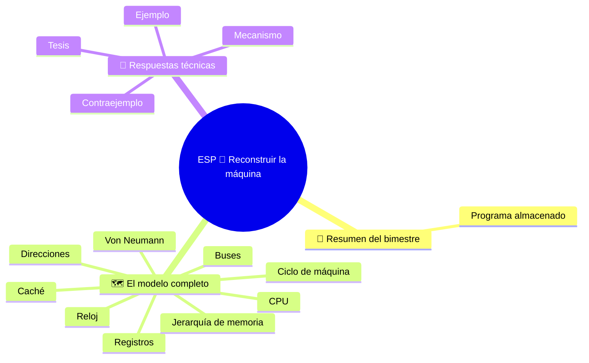

⬅️ [S6 - Caché, localidad y reloj](%28STU%29%20ESP%203EI%20sett-ott%20S6%20-%20Cach%C3%A9%2C%20localidad%20y%20reloj.md) · 🏠 [Indice](%28STU%29%20ESP%203EI%20-%20SETT-OTT.md)

# ESP 🧠 Reconstruir la máquina

**3EI · Septiembre-Octubre · S7 · Repaso**

> **Leyenda:** ✅ hay que saber · 🔍 para entender a fondo · 🤓 opcional, para curiosos · 🃏 tarjeta: responde en voz alta y luego despliega la respuesta



## 🧭 Resumen del bimestre

Al principio nos preguntamos: ¿cómo puede una máquina realizar tareas distintas sin reconstruirla cada vez? Ahora sabemos que no basta con responder «con un programa». Hay que guardar las instrucciones, encontrarlas, interpretarlas, mover los datos y conservar los resultados.

La historia del computador se puede volver a leer como una cadena de problemas conectados: hacer circuitos fiables y pequeños, guardar programas, coordinar operaciones y reducir las esperas. Este repaso reconstruye esas conexiones. **No añade temas nuevos.**

## 🗺️ El modelo completo

### ✅ Mapa del modelo

```text
PROGRAMA: instrucciones codificadas, guardadas en memoria
    |
    v
CPU: CU coordina; ALU calcula; los registros guardan valores
    |
    +---- FETCH -> DECODE -> EXECUTE -> siguiente instrucción
    |        |
    |        +-- PC, IR, MAR y MDR tienen funciones diferentes
    |
    +---- direcciones, datos y control conectan CPU y memoria
    |
    +---- registros / caché / RAM / almacenamiento
              esperas, capacidad, costo y persistencia

ENTRADA introduce información en el sistema; SALIDA la devuelve
```

- En el modelo de **Von Neumann**, instrucciones y datos comparten la misma memoria.
- La **CPU** no es solo la ALU: hace falta quien coordine (CU) y hacen falta lugares donde conservar el estado del trabajo (registros).
- El **PC** indica dónde buscar la siguiente instrucción; el **IR** guarda la instrucción actual. El **MAR** contiene la dirección del acceso actual; el **MDR**, el contenido transferido.
- Una **copia** deja intacto el valor original.
- Con $n$ bits se distinguen $2^n$ direcciones. Para obtener la capacidad, se multiplica por los bytes de cada posición.
- La **caché** guarda copias y aprovecha la localidad temporal y espacial. Un fallo requiere acceder al siguiente nivel: no es una avería ni significa «ir al disco».

<details><summary>🃏 ¿Qué guarda la memoria en el modelo de Von Neumann?</summary>
Instrucciones y datos en la misma memoria.
</details>
<details><summary>🃏 ¿Qué partes tiene la CPU y qué hace cada una?</summary>
La CU coordina, la ALU calcula y los registros guardan los valores del trabajo en curso.
</details>
<details><summary>🃏 ¿Cuáles son las fases del ciclo de máquina?</summary>
Fetch, decode y execute; luego se pasa a la siguiente instrucción.
</details>
<details><summary>🃏 PC, IR, MAR y MDR: indica la función de cada uno.</summary>
PC: dónde buscar la siguiente instrucción. IR: instrucción actual. MAR: dirección del acceso actual. MDR: contenido transferido.
</details>
<details><summary>🃏 ¿Cuáles son las tres funciones de las conexiones entre CPU y memoria?</summary>
Direcciones, datos y control.
</details>
<details><summary>🃏 ¿Qué ocurre con la fuente después de copiar un valor?</summary>
Permanece intacta, salvo que otra operación la modifique.
</details>
<details><summary>🃏 ¿Cómo se calcula la capacidad de una memoria con n bits de dirección?</summary>
2 elevado a n posiciones, multiplicado por los bytes que contiene cada posición.
</details>
<details><summary>🃏 ¿Cuáles son los niveles de la jerarquía de memoria?</summary>
Registros, caché, RAM y almacenamiento. Se diferencian por espera, capacidad y costo; la persistencia es otra propiedad.
</details>
<details><summary>🃏 ¿En qué regularidades se basa la caché?</summary>
En la localidad temporal y espacial.
</details>
<details><summary>🃏 ¿Un fallo significa «ir al disco»?</summary>
No. Significa acceder al siguiente nivel y no es una avería.
</details>

### ✅ Tres preguntas de control

Al seguir una instrucción, pregúntate: **¿dónde estamos?**, **¿qué hemos leído?**, **¿qué cambia realmente?** No basta con decir el nombre de un registro sin su función. Decir que una memoria es «grande» no indica su velocidad ni si conserva los datos sin electricidad.

<details><summary>🃏 ¿Qué tres preguntas ayudan a seguir una instrucción?</summary>
¿Dónde estamos? ¿Qué hemos leído? ¿Qué cambia realmente?
</details>
<details><summary>🃏 ¿Basta con decir el nombre de un registro?</summary>
No. También hay que indicar qué función cumple en ese momento.
</details>
<details><summary>🃏 ¿Decir «esta memoria es grande» indica que es rápida?</summary>
No. Capacidad, velocidad y persistencia son propiedades diferentes.
</details>

## 🔧 Respuestas técnicas

### 🔍 Tesis, mecanismo y ejemplo

Una buena respuesta técnica tiene una **tesis**, un **mecanismo** y un **ejemplo**. «La caché es rápida» es una propiedad general. «Si un bloque ya está en la caché, el acceso puede evitar la espera del siguiente nivel» describe un mecanismo con una condición comprobable.

También hay que explicar una fórmula. Con 9 bits de dirección por byte se distinguen $2^9=512$ posiciones: la memoria contiene 512 bytes, no 512 bits, y la última dirección es 511. Si cada posición contuviera dos bytes, cambiaría la capacidad, no el número de direcciones.

<details><summary>🃏 ¿Cuáles son las tres partes de una buena respuesta técnica?</summary>
Una tesis, un mecanismo y un ejemplo.
</details>
<details><summary>🃏 ¿Por qué «la caché es rápida» es una respuesta débil?</summary>
Es una afirmación general. Hay que explicar el mecanismo y una condición que se pueda comprobar.
</details>
<details><summary>🃏 ¿También hay que «contar» una fórmula?</summary>
Sí: hay que explicar qué representan los símbolos, sus unidades y las hipótesis utilizadas.
</details>

### 🔍 Cuatro ejercicios de conexión

Responde en pocas líneas y utiliza un esquema cuando haga falta.

| Ejercicio | Consigna |
|---|---|
| **A. Sistema** 🏛️ | Dibuja CPU, memoria y entrada/salida; coloca la CU, la ALU y los registros donde corresponden. Etiqueta las tres funciones de las conexiones. |
| **B. Recorrido** 🔄 | PC = 5, MEM[5] = `LOAD R1, [70]`, MEM[70] = 6. ¿Qué dos direcciones utiliza el MAR, en qué orden? ¿Qué contiene R1 al final? |
| **C. Tamaños** 🧮 | 8 bits de dirección y 2 bytes por posición: ¿cuántas posiciones, cuántos bytes y cuál es la última dirección? |
| **D. Compromisos** ⚖️ | Compara caché, RAM y SSD por función, volatilidad y capacidad típica. Explica por qué no son intercambiables. |

En el ejercicio B aplicamos las reglas de S4: una celda por instrucción y el PC aumenta en uno después del *fetch*.

> 🔧 **Conexión con el laboratorio:** reconocer una RAM o leer una ficha técnica resulta útil cuando sabes explicar qué problema resuelve ese componente. El esquema funcional no es una foto de la placa madre: la CU no es una tarjeta que debas buscar junto al procesador.

<details><summary>🃏 ¿El esquema funcional es una fotografía de la placa madre?</summary>
No. Muestra funciones; por ejemplo, la CU no es una tarjeta que debamos buscar junto al procesador.
</details>

### 🤓 Contraejemplos

> En ciencia, una regla se vuelve más precisa cuando buscamos dónde deja de funcionar. Elige una frase: «más GHz siempre significa menos tiempo» o «un dato usado antes estará en la caché». Construye una situación que muestre qué condición falta.
>
> No hace falta conocer un procesador concreto: bastan las ideas de espera y espacio limitado.

<details><summary>🃏 ¿Para qué sirve buscar un contraejemplo?</summary>
Para entender dónde deja de funcionar una regla y así formularla con más precisión.
</details>
<details><summary>🃏 ¿Qué dos ideas bastan para encontrar contraejemplos sobre GHz y caché?</summary>
La espera y el espacio limitado.
</details>

## 🧩 Pon a prueba el modelo

### 📝 Ejercicio de práctica

Tiempo aproximado: 30 minutos, primero a solas. No se requiere AMAT, *pipeline*, CISC/RISC ni procedimientos de arranque. Los ejercicios mezclan deliberadamente temas distintos: para practicar mejor, no respondas en el mismo orden en que los estudiaste; empieza por el que te resulte menos seguro y vuelve después a los primeros.

1. **Sistema.** Dibuja el modelo de Von Neumann. Explica por qué guardar instrucciones permite cambiar de tarea sin reconstruir el hardware.
2. **Registros.** Distingue PC, IR, MAR y MDR. ¿Por qué puede cambiar el MDR durante un `LOAD` sin reemplazar la instrucción del IR?
3. **Seguimiento.** Ejecuta el programa y anota PC, R1, R3, MEM[60] y MEM[61] justo después de `STORE`, antes de ejecutar `HALT`. Reglas: PC aumenta en uno después de cada *fetch*; cada celda contiene una instrucción completa o un entero; PC empieza en 20, R2 vale 3 y los demás registros generales empiezan en 0.

| Dirección | Contenido inicial |
|---|---|
| 20 | `LOAD R1, [60]` |
| 21 | `ADD R3, R1, R2` |
| 22 | `STORE [61], R3` |
| 23 | `HALT` |
| 60 | 8 |
| 61 | 0 |

`LOAD` copia de la memoria al registro; `ADD` escribe la suma solo en el registro destino; `STORE` copia del registro a la memoria; `HALT` termina la simulación.

4. **Direcciones.** Calcula el número de posiciones, bytes, KiB y la última dirección de una memoria direccionada por bytes con 11 bits. Escribe el procedimiento.
5. **Caché.** Caché inicialmente vacía con **una sola línea**; bloques de cuatro posiciones (0-3, 4-7, 8-11, ...). Cada fallo reemplaza la línea con el bloque solicitado, obtenido de la RAM. Para la secuencia **4, 5, 8, 4**, indica acierto/fallo y el bloque presente después de cada acceso.
6. **Explicación.** Corrige y justifica: «la SRAM no necesita refresco, así que conserva los datos sin electricidad»; «3 GHz significa tres mil millones de instrucciones completadas por segundo».

### ✍️ Corregir un error sin borrarlo

Después de comparar en clase, elige algo para mejorar. No cambies solo un número: escribe qué paso del razonamiento debe cambiar.

| Mi respuesta | El paso que debo revisar | La regla correcta | Un nuevo ejemplo |
|---|---|---|---|
| … | … | … | … |

**🚪 Salida:** escribe una relación que sabes explicar bien y otra que todavía quieres aclarar.

**🏠 Opcional:** prepara una página de repaso con un dibujo de la máquina, un cálculo de capacidad y un ejemplo de localidad.

## 📚 Fuentes y recursos

Para repasar, vuelve a los apuntes del bimestre:

- [[(STU) ESP 3EI sett-ott S4 - El ciclo de máquina|El ciclo de máquina]]: cómo cambia el estado durante un seguimiento.
- [[(STU) ESP 3EI sett-ott S5 - Direcciones y jerarquía de memoria|Direcciones y jerarquía de memoria]]: unidades y propiedades de la memoria.
- [[(STU) ESP 3EI sett-ott S6 - Caché, localidad y reloj|Caché, localidad y reloj]]: reglas de la simulación de caché.

---

[[(STU) ESP 3EI sett-ott S6 - Caché, localidad y reloj|⬅️ S6 - Caché, localidad y reloj]] · [[(STU) ESP 3EI - SETT-OTT|🗺️ Índice]]

⬅️ [S6 - Caché, localidad y reloj](%28STU%29%20ESP%203EI%20sett-ott%20S6%20-%20Cach%C3%A9%2C%20localidad%20y%20reloj.md) · 🏠 [Indice](%28STU%29%20ESP%203EI%20-%20SETT-OTT.md)
