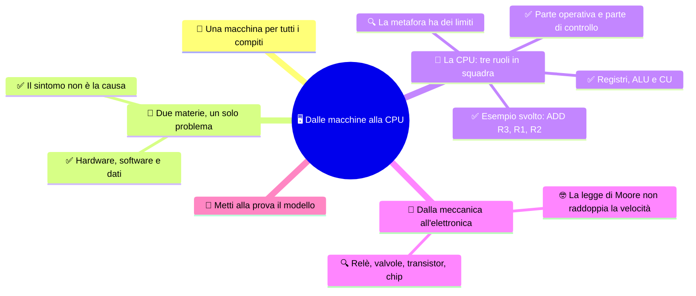

# 🖥️ Dalle macchine alla CPU

**3EI · Settembre-Ottobre · S1 · Teoria**

> **Legenda:** ✅ da sapere · 🔍 per capire fino in fondo · 🤓 facoltativo, per curiosi · 🃏 flashcard: rispondi a voce, poi apri per controllare



## 🧭 Una macchina per tutti i compiti

Una persona scrive un programma. Ma chi esegue davvero le sue istruzioni? Dire «il computer» è un inizio, non una spiegazione. Dentro la macchina ci sono componenti che conservano valori, altri che li trasformano, altri che coordinano il lavoro. Nessuno di loro capisce lo scopo del programma come lo capisce una persona: il risultato nasce da trasformazioni fisiche ben organizzate.

Per secoli costruire una macchina ha significato darle **un lavoro**: misurare il tempo, tessere, calcolare. La programmabilità cambia tutto: la stessa macchina può fare lavori diversi quando cambiano le istruzioni. Capire questa separazione è il primo passo per capire sia un computer sia le reti che lo collegano agli altri.

## 🔭 Due materie, un solo problema

### ✅ Hardware, software e dati

In Informatica studiamo, fra le altre cose, come descrivere un procedimento e scriverlo in un linguaggio di programmazione. In Sistemi e Reti guardiamo anche **la macchina che lo esegue e l'infrastruttura che fa comunicare le macchine**. Non è una divisione fra chi pensa e chi monta pezzi: entrambe le prospettive richiedono ragionamento e si incontrano di continuo.

- **Hardware:** i componenti fisici.
- **Software:** i programmi e le loro istruzioni.
- **Dato:** un'informazione rappresentata in una forma che il sistema può elaborare.

Il programma stabilisce come trattare i dati, ma senza hardware non esegue nessun lavoro.

<details>
<summary>🃏 Che cosa guarda Sistemi e Reti, oltre al programma?</summary>
La macchina che esegue il programma e l'infrastruttura che fa comunicare le macchine. Informatica e Sistemi e Reti sono due prospettive che si incontrano, non una divisione fra chi pensa e chi monta pezzi.
</details>

<details>
<summary>🃏 Che cos'è l'hardware?</summary>
L'insieme dei componenti fisici del sistema.
</details>

<details>
<summary>🃏 Che cos'è il software?</summary>
L'insieme dei programmi e delle loro istruzioni.
</details>

<details>
<summary>🃏 Che cos'è un dato?</summary>
Un'informazione rappresentata in una forma che il sistema può elaborare.
</details>

<details>
<summary>🃏 Un programma può lavorare senza hardware?</summary>
No. Il programma stabilisce come trattare i dati, ma il lavoro lo esegue l'hardware.
</details>

### ✅ Il sintomo non è la causa

Un sito lento può avere diverse cause. Alcuni esempi:
- Poca memoria disponibile al server
- Un collegamento congestionato
- Un software che lo gestisce inefficiente

Alcune di queste cause sono software, alcune hardware. Un esperto di informatica impara a fare _ipotesi_ su dove il problema può essere, per poi verificarle. E non sempre è facile.

Il sintomo, da solo, non dice la causa. Prima di proporre una soluzione chiediti: **dove si perde tempo?** Quale osservazione distinguerebbe un'ipotesi dall'altra?

<details>
<summary>🃏 Un sito è lento: quali possono essere le cause?</summary>
Per esempio un algoritmo inefficiente, poca memoria disponibile o un collegamento congestionato: parti diverse del sistema.
</details>
## 👥 La CPU: tre ruoli in squadra

### ✅ Registri, ALU e CU

Prendiamo il compito «somma 7 e 5 e conserva il risultato». Servono almeno tre funzioni:

| Necessità                                 | Componente nella CPU             | Ruolo                                                  |
| ----------------------------------------- | -------------------------------- | ------------------------------------------------------ |
| Tenere pronti i valori                    | **Registri**                     | Piccole memorie interne al processore                  |
| Trasformare i valori                      | **ALU**, unità aritmetico-logica | Operazioni aritmetiche e logiche                       |
| Attivare le operazioni nell'ordine giusto | **CU**, unità di controllo       | Interpreta le istruzioni e genera segnali di controllo |

La **CPU**, o processore, comprende questi ruoli e i collegamenti che li fanno collaborare. **La CPU non è solo l'ALU**: conservare e coordinare sono indispensabili quanto calcolare.

- [ ] #integrazione spiegare meglio! parlarne in maniera più estesa e comprensibile

<details>
<summary>🃏 A che cosa servono i registri?</summary>
A tenere pronti i valori: sono piccole memorie interne al processore.
</details>

<details>
<summary>🃏 Che cosa fa l'ALU?</summary>
È l'unità aritmetico-logica: trasforma i valori con operazioni aritmetiche e logiche.
</details>

<details>
<summary>🃏 Che cosa fa la CU?</summary>
È l'unità di controllo: interpreta le istruzioni e genera i segnali che attivano le operazioni nell'ordine giusto.
</details>

<details>
<summary>🃏 La CPU è solo l'ALU?</summary>
No. La CPU comprende registri, ALU, CU e i collegamenti fra loro: conservare e coordinare sono indispensabili quanto calcolare.
</details>

### ✅ Parte operativa e parte di controllo

```text
                   UNITA' DI CONTROLLO
                  interpreta l'istruzione
                           |
                    segnali di controllo
                           v
             REGISTRI --> ALU --> REGISTRO RISULTATO
               7, 5       +              12
```

- **Parte operativa:** i circuiti che conservano, trasferiscono e trasformano dati (ALU, registri, percorsi dei dati).
- **Parte di controllo:** i circuiti che coordinano trasferimenti e operazioni.

Anche spostare un dato è lavoro della parte operativa, pure quando non c'è nessuna somma.

- [ ] #integrazione non si capisce. Idem.

<details>
<summary>🃏 Che cos'è la parte operativa?</summary>
L'insieme dei circuiti che conservano, trasferiscono e trasformano i dati: ALU, registri e percorsi dei dati.
</details>

<details>
<summary>🃏 Che cos'è la parte di controllo?</summary>
L'insieme dei circuiti che coordinano trasferimenti e operazioni.
</details>

<details>
<summary>🃏 Spostare un dato senza fare calcoli è lavoro della parte operativa?</summary>
Sì. Anche un trasferimento è lavoro della parte operativa.
</details>

### ✅ Esempio svolto: `ADD R3, R1, R2`

È una notazione didattica, non un comando da digitare sul PC. Si legge: «somma il contenuto di R1 e quello di R2, e scrivi il risultato in R3».

| Momento | Che cosa accade |
|---|---|
| Prima | R1 contiene 7; R2 contiene 5 |
| Preparazione | La CU seleziona i due registri e l'operazione somma |
| Calcolo | L'ALU riceve 7 e 5 e produce 12 |
| Conservazione | La CU abilita la scrittura di 12 in R3 |
| Dopo | R3 contiene 12; R1 e R2 conservano i loro valori |

La CU non ha «capito il problema»: i circuiti reagiscono a un'istruzione codificata. L'ALU non sceglie da sola la somma: esegue l'operazione selezionata. Nelle prossime settimane vedremo anche come l'istruzione arriva dalla memoria.

- [ ] #integrazione non si capisce! Parlane per esteso.

> ⏸️ **Fermati e ricostruisci:** copri la tabella e racconta quali informazioni entrano, chi le trasforma e dove resta il risultato.

<details>
<summary>🃏 Come si legge ADD R3, R1, R2?</summary>
Somma il contenuto di R1 e quello di R2 e scrivi il risultato in R3.
</details>

<details>
<summary>🃏 Chi fa che cosa durante ADD R3, R1, R2?</summary>
La CU seleziona i registri e l'operazione somma; l'ALU calcola; la CU abilita la scrittura del risultato in R3.
</details>

<details>
<summary>🃏 Dopo la somma, R1 e R2 cambiano?</summary>
No. Conservano i loro valori: cambia solo il registro destinazione R3.
</details>

<details>
<summary>🃏 La CU «capisce» il problema?</summary>
No. I circuiti reagiscono a un'istruzione codificata; anche l'ALU non sceglie da sola l'operazione, esegue quella selezionata.
</details>

### 🔍 La metafora ha dei limiti

Una persona può interpretare una consegna ambigua; un circuito no. «Prendi quel numero» non basta a identificare un dato: servono selezioni e percorsi precisi. La CU non è un omino dentro il processore: risponde a ingressi e stati secondo il progetto dei circuiti.

- [ ] #integrazione mamma mia, non si capisce niente, come possiamo pretendere che i ragazzi capiscano?

Un risultato sbagliato può dipendere da dati sbagliati o da un programma sbagliato, non per forza da un'ALU guasta. Distinguere controllo, dati e operazioni aiuta a cercare una spiegazione senza dare intenzioni alla macchina.

> 🔧 **Collegamento con il laboratorio:** osservando un PC, CPU, modulo RAM e dissipatore sono oggetti diversi. ALU e registri, invece, non sono componenti separati visibili sulla scheda madre: sono parti interne del processore. Lo schema funzionale non è una fotografia del montaggio.

<details>
<summary>🃏 Dove la metafora della squadra non funziona?</summary>
Una persona può interpretare una consegna ambigua, un circuito no: servono selezioni e percorsi precisi. La CU non è un omino, risponde a ingressi e stati secondo il progetto.
</details>

<details>
<summary>🃏 Un risultato sbagliato significa che l'ALU è guasta?</summary>
Non per forza: possono essere sbagliati i dati o il programma.
</details>

<details>
<summary>🃏 Si vedono ALU e registri sulla scheda madre?</summary>
No. Sono parti interne del processore; sulla scheda si vedono oggetti come CPU, moduli RAM e dissipatore.
</details>

## 📜 Dalla meccanica all'elettronica

### 🔍 Relè, valvole, transistor, chip

I primi strumenti aiutavano una persona a contare; i calcolatori meccanici automatizzarono le operazioni con ingranaggi. Poi diventò importante rappresentare stati e cambiarli in modo affidabile e veloce. Per questo la storia degli interruttori e dei circuiti è anche la storia del calcolo.

| Tecnologia | Che cosa cambia | Quale limite rimane |
|---|---|---|
| **Relè** | Un segnale elettrico muove un contatto meccanico | Parti mobili, lentezza, usura |
| **Valvola elettronica** | Il controllo avviene senza contatti che si muovono | Ingombro, consumo, calore, guasti frequenti |
| **Transistor** | Il controllo elettronico usa un semiconduttore | Restano vincoli fisici, termici e di fabbricazione |
| **Circuito integrato** | Molti componenti e collegamenti realizzati insieme su un chip | Progettare e produrre diventa più complesso |
| **Microprocessore** | Un'intera CPU in un chip | Il computer ha ancora bisogno di memoria e altri componenti |

**ENIAC**, presentato nel 1946, usava migliaia di valvole: non era un calcolatore a relè. Il transistor fu dimostrato ai Bell Labs nel 1947. I primi circuiti integrati arrivano alla fine degli anni Cinquanta. L'**Intel 4004**, messo in commercio nel 1971, è una tappa importante nella storia del microprocessore.

- [ ] #integrazione basta frasette, si deve capire!
- [ ] #integrazione c'era una bellissima parte di storia da relay a transistor, dov'é? Dettagliamo un po' e spieghiamo come funziona ognuno!

Il senso non è «ogni novità cancella subito quella di prima»: le tecnologie convivono. Ma l'integrazione ha permesso sistemi molto più compatti. ⚠️ **Più piccolo non significa senza consumo o senza limiti.**

<details>
<summary>🃏 Perché la storia degli interruttori è anche storia del calcolo?</summary>
Perché per calcolare bisogna rappresentare stati e cambiarli in modo affidabile e veloce.
</details>

<details>
<summary>🃏 Relè: che cosa cambia e quale limite resta?</summary>
Un segnale elettrico muove un contatto meccanico. Restano parti mobili, lentezza e usura.
</details>

<details>
<summary>🃏 Valvola elettronica: che cosa cambia e quale limite resta?</summary>
Il controllo avviene senza contatti che si muovono. Restano ingombro, consumo, calore e guasti frequenti.
</details>

<details>
<summary>🃏 Transistor: che cosa cambia e quando fu dimostrato?</summary>
Il controllo elettronico usa un semiconduttore. Fu dimostrato ai Bell Labs nel 1947.
</details>

<details>
<summary>🃏 Circuito integrato e microprocessore: che differenza c'è?</summary>
Nel circuito integrato molti componenti e collegamenti sono realizzati insieme su un chip, dalla fine degli anni Cinquanta. Il microprocessore mette un'intera CPU in un chip: l'Intel 4004 è del 1971.
</details>

<details>
<summary>🃏 ENIAC era un calcolatore a relè?</summary>
No. ENIAC, presentato nel 1946, usava migliaia di valvole elettroniche.
</details>

<details>
<summary>🃏 Ogni nuova tecnologia ha cancellato subito quella precedente?</summary>
No, le tecnologie convivono. L'integrazione ha reso i sistemi molto più compatti, ma più piccolo non significa senza consumo o senza limiti.
</details>

### 🤓 La legge di Moore non raddoppia la velocità

> Nel 1965 Gordon Moore descrisse una tendenza: il numero di componenti che si potevano integrare in un chip cresceva a ritmo regolare. La previsione fu poi riformulata. Non è una legge della natura, e non garantisce che ogni programma finisca il lavoro in metà tempo ogni due anni. Più transistor possono diventare più cache, più core o nuove funzioni: il vantaggio dipende da come sistema e programma li usano.
>
> La domanda interessante diventa: **quale risorsa limita questo lavoro?** Un calcolatore velocissimo può restare fermo ad aspettare i dati. Ritroveremo questa idea parlando di memorie.

<details>
<summary>🃏 Che cosa descrisse Gordon Moore nel 1965?</summary>
Una tendenza: il numero di componenti integrabili in un chip cresceva a ritmo regolare. La previsione fu poi riformulata.
</details>

<details>
<summary>🃏 La legge di Moore garantisce programmi due volte più veloci ogni due anni?</summary>
No. Non è una legge della natura: più transistor possono diventare più cache, più core o nuove funzioni, e il vantaggio dipende da come vengono usati.
</details>

<details>
<summary>🃏 Quale domanda conviene porsi al posto di «quanti transistor?»?</summary>
Quale risorsa limita questo lavoro. Un calcolatore velocissimo può restare fermo ad aspettare i dati.
</details>

## 🧩 Metti alla prova il modello

1. **Base.** Che cosa distinguono hardware e software? Quali sono i ruoli di registri, ALU e CU?
2. **Applicazione.** R1 contiene 9 e R2 contiene 4. Esegui `ADD R3, R1, R2`: indica il risultato e quali registri non cambiano.
3. **Collegamento.** Perché una CPU non si può descrivere soltanto come un'ALU?
4. **Intuizione.** L'ALU è libera, ma i dati richiesti non sono ancora disponibili. Basta rendere più veloce l'ALU per risolvere il problema?
5. **Discussione.** Un sito risponde lentamente. Proponi due cause in parti diverse del sistema e un'osservazione che aiuti a distinguerle.

**🚪 Uscita dalla lezione:** completa «La parte operativa ..., mentre la parte di controllo ...».

**🏠 Facoltativo a casa:** inventa una metafora diversa dalla squadra e indica anche dove non funziona.

## 📚 Fonti e risorse

- [Computer History Museum - Timeline](https://www.computerhistory.org/timeline/) (in inglese): confronta le voci 1946, 1947, 1958 e 1971. Usa date e immagini per capire quale problema veniva risolto, non per imparare un elenco.
- [Intel - Moore's Law](https://www.intel.com/content/www/us/en/newsroom/resources/moores-law.html) (in inglese): per scoprire che cosa diceva davvero la previsione di Moore.
- [Wikimedia Commons - ENIAC](https://commons.wikimedia.org/wiki/ENIAC): fotografie della macchina. Se vuoi riusarne una, controlla licenza e attribuzione nella pagina del singolo file.
- [NandGame](https://nandgame.com/): gioco online facoltativo; costruisci funzioni complesse partendo da porte logiche semplici.

---

[🗺️ Indice del bimestre](%28STU%29%203EI%20-%20SETT-OTT.md) · [S2 - La macchina di Von Neumann ➡️](%28STU%29%203EI%20sett-ott%20S2%20-%20La%20macchina%20di%20Von%20Neumann.md)
