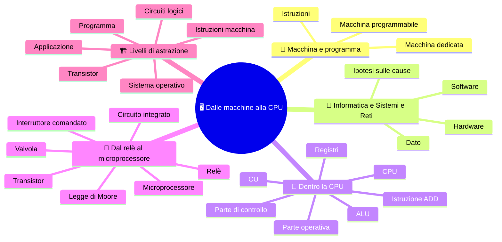

🏠 [Indice](%28STU%29%203EI%20-%20SETT-OTT.md) · [S2 - La macchina di Von Neumann](%28STU%29%203EI%20sett-ott%20S2%20-%20La%20macchina%20di%20Von%20Neumann.md) ➡️

# 🖥️ Dalle macchine alla CPU

**3EI · Settembre-Ottobre · S1 · Teoria**

> **Legenda:** ✅ da sapere · 🔍 per capire fino in fondo · 🤓 facoltativo, per curiosi · 🃏 flashcard: rispondi a voce, poi apri per controllare



## 🧭 Macchina e programma

Una persona scrive un programma. Ma chi esegue davvero le sue istruzioni? Dire «il computer» è un inizio, non una spiegazione. Dentro la macchina ci sono componenti che conservano valori, altri che li trasformano, altri che coordinano il lavoro. Nessuno di loro capisce lo scopo del programma come lo capisce una persona: il risultato nasce da trasformazioni fisiche ben organizzate.

Per secoli costruire una macchina ha significato darle **un lavoro**: misurare il tempo, tessere, calcolare. La programmabilità cambia tutto: la stessa macchina può fare lavori diversi quando cambiano le istruzioni. Capire questa separazione è il primo passo per capire sia un computer sia le reti che lo collegano agli altri.

## 🔭 Informatica e Sistemi e Reti

### ✅ Hardware, software e dati

In Informatica studiamo, fra le altre cose, come descrivere un procedimento e scriverlo in un linguaggio di programmazione. In Sistemi e Reti guardiamo anche **la macchina che lo esegue e l'infrastruttura che fa comunicare le macchine**. Non è una divisione fra chi pensa e chi monta pezzi: entrambe le prospettive richiedono ragionamento e si incontrano di continuo.

- **Hardware:** i componenti fisici.
- **Software:** i programmi e le loro istruzioni.
- **Dato:** un'informazione rappresentata in una forma che il sistema può elaborare.

Il programma stabilisce come trattare i dati, ma senza hardware non esegue nessun lavoro.

<details>
<summary>🃏 <b>Che cosa guarda Sistemi e Reti, oltre al programma?</b></summary>
La macchina che esegue il programma e l'infrastruttura che fa comunicare le macchine. Informatica e Sistemi e Reti sono due prospettive che si incontrano, non una divisione fra chi pensa e chi monta pezzi.
</details>
<details>
<summary>🃏 <b>Che cos'è l'hardware?</b></summary>
L'insieme dei componenti fisici del sistema.
</details>
<details>
<summary>🃏 <b>Che cos'è il software?</b></summary>
L'insieme dei programmi e delle loro istruzioni.
</details>
<details>
<summary>🃏 <b>Che cos'è un dato?</b></summary>
Un'informazione rappresentata in una forma che il sistema può elaborare.
</details>
<details>
<summary>🃏 <b>Un programma può lavorare senza hardware?</b></summary>
No. Il programma stabilisce come trattare i dati, ma il lavoro lo esegue l'hardware.
</details>

### ✅ Sintomo e causa

Un sito lento può avere diverse cause. Alcuni esempi:
- Poca memoria disponibile al server
- Un collegamento congestionato
- Un software che lo gestisce inefficiente

Alcune di queste cause sono software, alcune hardware. Un esperto di informatica impara a fare _ipotesi_ su dove il problema può essere, per poi verificarle. E non sempre è facile.

Il sintomo, da solo, non dice la causa. Prima di proporre una soluzione chiediti: **dove si perde tempo?** Quale osservazione distinguerebbe un'ipotesi dall'altra?

<details>
<summary>🃏 <b>Un sito è lento: quali possono essere le cause?</b></summary>
Per esempio un algoritmo inefficiente, poca memoria disponibile o un collegamento congestionato: parti diverse del sistema.
</details>
## 👥 Dentro la CPU

### ✅ Registri, ALU e CU

Prendiamo il compito «somma 7 e 5 e conserva il risultato». Una persona lo risolve con carta e penna e non si accorge nemmeno dei passaggi. Una macchina invece deve fare **tre lavori distinti**:

1. **Tenere** i numeri da qualche parte, pronti all'uso.
2. **Calcolare**: trasformare 7 e 5 in 12.
3. **Coordinare**: decidere che cosa succede e in quale ordine. Prima prendi 7 e 5, poi somma, poi metti da parte il 12.

Nel processore ognuno di questi lavori ha un componente dedicato.

| Lavoro | Componente | Che cos'è, in parole semplici |
|---|---|---|
| Tenere i valori | **Registri** | Piccolissime memorie dentro il processore. Ognuno ha un nome (R1, R2, R3...) e conserva un numero alla volta. |
| Calcolare | **ALU**, unità aritmetico-logica | Un circuito che riceve due numeri e l'indicazione dell'operazione (somma, sottrazione, confronto...) e restituisce il risultato. |
| Coordinare | **CU**, unità di controllo | Un circuito che riceve l'istruzione e manda ai componenti i segnali elettrici che dicono che cosa fare. |

Per immaginarli puoi pensare a una cucina: il **piano di lavoro** con gli ingredienti pronti (registri), il **robot da cucina** che trasforma ciò che gli metti dentro (ALU) e la **ricetta** che dice che cosa fare e in quale ordine (CU). Funziona fino a un certo punto: più avanti vediamo dove si rompe.

- I **registri** sono piccoli, ma stanno vicinissimi a chi calcola, quindi sono velocissimi da usare. Non servono a conservare i file: servono a tenere pochi valori *adesso*.
- L'**ALU** non decide che cosa calcolare. Fa soltanto l'operazione che le viene indicata sui due numeri che riceve.
- La **CU** non calcola. Legge l'istruzione e manda segnali del tipo: «questi due registri mettano il loro contenuto verso l'ALU», «l'ALU faccia la somma», «quel registro copi il risultato».

La **CPU**, o processore, è l'insieme di tutto questo più i collegamenti che li fanno collaborare. **La CPU non è solo l'ALU**: senza registri non c'è dove tenere i numeri, senza CU nessuno decide l'ordine delle azioni.

<details>
<summary>🃏 <b>A che cosa servono i registri?</b></summary>
A tenere pronti i valori: sono piccole memorie interne al processore.
</details>
<details>
<summary>🃏 <b>Che cosa fa l'ALU?</b></summary>
È l'unità aritmetico-logica: trasforma i valori con operazioni aritmetiche e logiche.
</details>
<details>
<summary>🃏 <b>Che cosa fa la CU?</b></summary>
È l'unità di controllo: interpreta le istruzioni e genera i segnali che attivano le operazioni nell'ordine giusto.
</details>
<details>
<summary>🃏 <b>La CPU è solo l'ALU?</b></summary>
No. La CPU comprende registri, ALU, CU e i collegamenti fra loro: conservare e coordinare sono indispensabili quanto calcolare.
</details>
<details>
<summary>🃏 <b>Quali tre lavori deve fare una macchina per sommare 7 e 5?</b></summary>
Tenere i numeri (registri), calcolare (ALU), coordinare l'ordine delle azioni (CU).
</details>
<details>
<summary>🃏 <b>I registri servono a conservare i file?</b></summary>
No. Tengono pochi valori in uso adesso, vicinissimi a chi calcola, e sono velocissimi da usare.
</details>
<details>
<summary>🃏 <b>L'ALU decide che cosa calcolare?</b></summary>
No. Esegue l'operazione che le viene indicata sui due numeri che riceve.
</details>

### ✅ Parte operativa e parte di controllo

Gli ingegneri dividono i circuiti della CPU in due gruppi, secondo una domanda semplice: **questo circuito *tocca* i dati oppure *comanda* chi li tocca?**

```text
                   UNITA' DI CONTROLLO
                  interpreta l'istruzione
                           |
                    segnali di controllo
                           v
             REGISTRI --> ALU --> REGISTRO RISULTATO
               7, 5       +              12
```

- **Parte operativa:** tutto ciò che i dati attraversano. Sono i registri che li conservano, l'ALU che li trasforma e i collegamenti che li portano da un punto all'altro.
- **Parte di controllo:** la CU. Non contiene i dati dell'utente e non calcola: manda soltanto segnali che dicono quali collegamenti aprire e quale operazione eseguire.

Nello schema le frecce in basso (da 7 e 5 verso l'ALU, dall'ALU verso il risultato) sono **dati che si spostano**: è la parte operativa. La freccia in alto è fatta di **ordini**: è la parte di controllo.

| Domanda | Dove sta la risposta |
|---|---|
| Dove si trova il 7 prima della somma? | In un registro: parte operativa |
| Chi trasforma 7 e 5 in 12? | L'ALU: parte operativa |
| Chi fa arrivare 7 e 5 all'ALU? | I collegamenti, aperti dai segnali: operativa, comandata dal controllo |
| Chi stabilisce che si deve fare una somma e non una sottrazione? | La CU: parte di controllo |

Anche spostare un dato da un registro all'altro, senza nessun calcolo, è lavoro della parte operativa. Il controllo serve comunque: qualcuno deve dire *quale* registro copia *quale*.

<details>
<summary>🃏 <b>Con quale domanda si dividono i circuiti della CPU in due gruppi?</b></summary>
Questo circuito tocca i dati oppure comanda chi li tocca? Nel primo caso è parte operativa, nel secondo parte di controllo.
</details>
<details>
<summary>🃏 <b>Che cos'è la parte operativa?</b></summary>
L'insieme dei circuiti che conservano, trasferiscono e trasformano i dati: ALU, registri e percorsi dei dati.
</details>
<details>
<summary>🃏 <b>Che cos'è la parte di controllo?</b></summary>
L'insieme dei circuiti che coordinano trasferimenti e operazioni.
</details>
<details>
<summary>🃏 <b>Spostare un dato senza fare calcoli è lavoro della parte operativa?</b></summary>
Sì. Anche un trasferimento è lavoro della parte operativa.
</details>

### ✅ Esempio svolto: `ADD R3, R1, R2`

`ADD R3, R1, R2` è una notazione didattica: non è un comando da digitare sul PC. È il modo in cui scriviamo **un'istruzione**, cioè un ordine che la CPU sa eseguire. Si legge così:

- `ADD` è l'azione: sommare.
- `R3` viene **per primo** perché è la destinazione, cioè dove finirà il risultato. In questa notazione la destinazione si scrive prima; altre notazioni usano l'ordine opposto, quindi leggi sempre la regola.
- `R1` e `R2` sono i due registri che contengono i numeri da sommare.

Frase completa: «somma il contenuto di R1 e il contenuto di R2, e scrivi il risultato in R3».

**Situazione iniziale:** R1 contiene 7, R2 contiene 5. Vediamo che cosa succede dentro la CPU, un passo alla volta.

| Passo | Che cosa accade | Chi lavora |
|---|---|---|
| 1 | La CU riceve l'istruzione e la riconosce: è una somma, con R1 e R2 come sorgenti e R3 come destinazione | Controllo |
| 2 | La CU manda segnali a R1 e R2: «mettete il vostro contenuto sui collegamenti verso l'ALU». Manda un segnale all'ALU: «operazione: somma» | Controllo |
| 3 | L'ALU riceve 7 e 5 e, dopo un brevissimo istante, presenta 12 alla sua uscita | Operativa |
| 4 | La CU manda un segnale a R3: «copia ciò che arriva dall'ALU» | Controllo |
| 5 | R3 contiene 12. R1 e R2 non sono cambiati: hanno solo *prestato* il loro valore | Operativa |

**Perché R1 e R2 non cambiano?** Perché leggere un registro non lo svuota: i numeri vengono copiati sui collegamenti. L'unico registro che cambia è quello in cui scrivi, R3. Se R3 conteneva già un numero, quel numero viene sostituito.

**E se volessi sottrarre?** Non cambieresti l'ALU: cambieresti l'istruzione. Con `SUB R3, R1, R2` la CU chiederebbe all'ALU un'operazione diversa. Questa è l'idea che ritroveremo nella prossima lezione: **la macchina è sempre la stessa, cambia l'istruzione**.

La CU non ha «capito il problema»: i suoi circuiti reagiscono a un'istruzione codificata. Anche l'ALU non sceglie da sola: esegue l'operazione che le viene indicata. Nelle prossime settimane vedremo come l'istruzione arriva dalla memoria.

> ⏸️ **Fermati e ricostruisci:** copri la tabella e racconta quali informazioni entrano, chi le trasforma e dove resta il risultato.

<details>
<summary>🃏 <b>Perché in ADD R3, R1, R2 la destinazione si scrive per prima?</b></summary>
È la convenzione di questa notazione. Altre notazioni usano l'ordine opposto, quindi bisogna sempre controllare la regola.
</details>
<details>
<summary>🃏 <b>Come si legge ADD R3, R1, R2?</b></summary>
Somma il contenuto di R1 e quello di R2 e scrivi il risultato in R3.
</details>
<details>
<summary>🃏 <b>Chi fa che cosa durante ADD R3, R1, R2?</b></summary>
La CU seleziona i registri e l'operazione somma; l'ALU calcola; la CU abilita la scrittura del risultato in R3.
</details>
<details>
<summary>🃏 <b>Dopo la somma, R1 e R2 cambiano?</b></summary>
No. Conservano i loro valori: cambia solo il registro destinazione R3.
</details>
<details>
<summary>🃏 <b>Per sottrarre invece che sommare bisogna cambiare l'ALU?</b></summary>
No. Si cambia l'istruzione: la CU chiede all'ALU un'altra operazione. La macchina è la stessa, cambia l'istruzione.
</details>
<details>
<summary>🃏 <b>La CU «capisce» il problema?</b></summary>
No. I circuiti reagiscono a un'istruzione codificata; anche l'ALU non sceglie da sola l'operazione, esegue quella selezionata.
</details>

### 🔍 Limiti della metafora

Per capire la CPU abbiamo usato l'immagine di una squadra, o di una cucina con piano di lavoro, robot e ricetta. Aiuta, ma smette di funzionare in tre punti. Conoscerli evita di farsi un'idea sbagliata del processore.

1. **Le persone capiscono richieste vaghe, i circuiti no.** A un aiuto-cuoco puoi dire «passami quel barattolo». Alla CPU no: ogni segnale deve indicare esattamente *quali* registri, *quale* operazione, *quale* destinazione. Non esiste un «più o meno».
2. **Il cuoco può improvvisare, la CU no.** La CU non è un piccolo omino dentro il processore. È un circuito: se riceve la stessa istruzione e si trova nello stesso stato, produce sempre gli stessi segnali.
3. **Una persona si accorge di un errore, la macchina no.** Se un'istruzione chiede di sommare i numeri sbagliati, la CPU li somma lo stesso. Il risultato sarà sbagliato anche con un'ALU perfetta.

Quindi, davanti a un risultato sbagliato, la domanda utile non è «il computer ha sbagliato?». È: **dov'è il passaggio sbagliato? Nei dati, nel programma o nei circuiti?** Distinguere controllo, dati e operazioni aiuta a cercare una spiegazione senza attribuire intenzioni alla macchina.

> 🔧 **Collegamento con il laboratorio:** osservando un PC, CPU, modulo RAM e dissipatore sono oggetti diversi. ALU e registri, invece, non sono componenti separati visibili sulla scheda madre: sono parti interne del processore. Lo schema funzionale non è una fotografia del montaggio.

<details>
<summary>🃏 <b>In quali tre punti la metafora della squadra non funziona?</b></summary>
Le persone capiscono richieste vaghe e i circuiti no; il cuoco può improvvisare e la CU no; una persona si accorge di un errore e la macchina no.
</details>
<details>
<summary>🃏 <b>La CU è un piccolo omino dentro il processore?</b></summary>
No. È un circuito: con la stessa istruzione e lo stesso stato produce sempre gli stessi segnali.
</details>
<details>
<summary>🃏 <b>Un risultato sbagliato significa che l'ALU è guasta?</b></summary>
Non per forza: possono essere sbagliati i dati o il programma. La domanda utile è dove si trova il passaggio sbagliato.
</details>
<details>
<summary>🃏 <b>Si vedono ALU e registri sulla scheda madre?</b></summary>
No. Sono parti interne del processore; sulla scheda si vedono oggetti come CPU, moduli RAM e dissipatore.
</details>

## 📜 Dal relè al microprocessore

### ✅ Un interruttore comandato da un segnale

Per far calcolare una macchina serve rappresentare gli 0 e gli 1 e cambiarli in modo **sicuro e veloce**. La tecnica è sempre la stessa, dall'Ottocento a oggi: un **interruttore comandato da un segnale elettrico**.

Un interruttore normale lo azioni con un dito. Questo lo aziona un altro circuito: un segnale piccolo apre o chiude un percorso per un segnale più grande. Se un circuito può comandarne un altro, i circuiti si possono **concatenare** e costruire con interruttori anche operazioni logiche:

- due interruttori **in serie** lasciano passare la corrente solo se *entrambi* sono chiusi: è un **AND**;
- due interruttori **in parallelo** la lasciano passare se *almeno uno* è chiuso: è un **OR**;
- un interruttore che apre quando riceve corrente e chiude quando non la riceve dà un **NOT**.

L'intuizione che unisce interruttori e logica è del 1937. Il giovane Claude Shannon, al MIT, mostrò nella sua tesi che i circuiti a relè potevano eseguire l'algebra di Boole. Da lì nasce la progettazione dei circuiti digitali.

Le tecnologie che seguono sono **modi diversi di costruire lo stesso interruttore**, sempre più piccolo, veloce e affidabile.

<details>
<summary>🃏 <b>Qual è l'idea comune a relè, valvole e transistor?</b></summary>
Sono tutti interruttori comandati da un segnale elettrico: un segnale piccolo apre o chiude un percorso.
</details>
<details>
<summary>🃏 <b>Come si ottiene un AND e un OR con degli interruttori?</b></summary>
AND: due interruttori in serie, passa corrente solo se entrambi sono chiusi. OR: due in parallelo, passa se almeno uno è chiuso.
</details>
<details>
<summary>🃏 <b>Che cosa mostrò Claude Shannon nel 1937?</b></summary>
Che i circuiti a relè potevano eseguire l'algebra di Boole: è l'inizio della progettazione dei circuiti digitali.
</details>

### 🔍 Relè, valvole e transistor

| Tecnologia | Come comanda la corrente | Limite principale |
|---|---|---|
| **Relè** | Una bobina diventa elettromagnete e muove una lamella che chiude un contatto | Parti mobili: lento, rumoroso, si consuma |
| **Valvola termoionica** | Una tensione su una griglia lascia passare o ferma un flusso di elettroni nel vuoto | Filamento caldo: consumo, calore, si brucia |
| **Transistor** | Una tensione su un terminale controlla la corrente fra gli altri due, dentro un cristallo di semiconduttore | Limiti fisici e di fabbricazione |

**Relè.** Dentro c'è una bobina di filo. Quando ci passa corrente diventa un elettromagnete e attira una lamella di metallo, che chiude (o apre) un contatto elettrico. Un segnale debole comanda quindi un circuito separato. Funziona, ma ha **parti che si muovono**: ogni commutazione richiede un tempo misurabile, fa un «clac» e col tempo i contatti si consumano. Macchine a relè sono lo Z3 di Konrad Zuse (1941) e l'Harvard Mark I (1944), che impiegavano alcuni secondi per una moltiplicazione.

**Valvola termoionica.** È un bulbo di vetro dal quale è stata tolta l'aria. Dentro, un filamento riscaldato emette elettroni (come in una lampadina); una placca con tensione positiva li attira. Tra i due c'è una **griglia**: se riceve una piccola tensione negativa, respinge gli elettroni e la corrente si ferma; se no, passa. Così un segnale piccolo accende o spegne una corrente più grande, **senza nessuna parte meccanica**. È molto più veloce del relè. Il nome «valvola» viene dalla valvola dell'acqua, che lascia passare il flusso in un solo senso. Il prezzo: il filamento scalda, consuma e prima o poi si brucia, come una lampadina.

> 🏭 **L'ENIAC** (1946) aveva 17.468 valvole e consumava circa 150 kW. In media una si guastava ogni due giorni e trovare quella rotta in mezzo a tutte le altre richiedeva circa un quarto d'ora. Il progettista di Colossus, Tommy Flowers, aveva capito che le valvole si rompono soprattutto quando le accendi e le spegni: lasciate sempre accese durano molto di più.

**Transistor.** È costruito con un **semiconduttore** (silicio o germanio), un materiale che conduce la corrente solo in certe condizioni. Ha tre terminali: applicando una piccola tensione a uno, si controlla la corrente che passa fra gli altri due. Fa lo stesso lavoro della valvola, ma **allo stato solido**: niente vuoto, niente filamento, niente parti mobili. È più piccolo, scalda meno, dura di più ed è più veloce. Fu dimostrato nel 1947 ai Bell Labs da John Bardeen e Walter Brattain, con William Shockley; i tre ricevettero il Nobel per la fisica nel 1956.

<details>
<summary>🃏 <b>Come funziona un relè, e quale limite ha?</b></summary>
Una bobina percorsa da corrente diventa elettromagnete e muove una lamella che chiude un contatto. Ha parti mobili: è lento e si consuma.
</details>
<details>
<summary>🃏 <b>Come funziona una valvola termoionica, e quale limite ha?</b></summary>
Un filamento caldo emette elettroni nel vuoto; una griglia con una piccola tensione li lascia passare o li ferma. Il filamento scalda, consuma e si brucia.
</details>
<details>
<summary>🃏 <b>Come funziona un transistor, e quando fu dimostrato?</b></summary>
Una piccola tensione su un terminale controlla la corrente fra gli altri due, dentro un semiconduttore, senza parti mobili. Fu dimostrato nel 1947 ai Bell Labs.
</details>
<details>
<summary>🃏 <b>ENIAC era un calcolatore a relè?</b></summary>
No. ENIAC, del 1946, usava migliaia di valvole: 17.468.
</details>

### 🔍 Dal transistor al chip

Collegare a mano i transistor uno per uno, con i fili, diventa impossibile quando sono migliaia. Alla fine degli anni Cinquanta Jack Kilby (Texas Instruments, 1958) e Robert Noyce (Fairchild, 1959) arrivarono, indipendentemente, a una soluzione: costruire più componenti e i loro collegamenti **insieme, sulla stessa fetta di silicio**, con procedimenti fotografici. Nasce il **circuito integrato**, o chip.

Nel 1971 l'**Intel 4004** mise un'intera CPU in un solo chip: è il primo microprocessore venduto come componente. Aveva circa 2.300 transistor, elaborava 4 bit alla volta e nacque per le calcolatrici di una ditta giapponese, la Busicom. Lo progettarono Federico Faggin (italiano, di Vicenza), Ted Hoff, Stanley Mazor e Masatoshi Shima; Faggin firmò il chip con le sue iniziali, F.F.

Il senso non è «ogni novità cancella subito quella di prima»: le tecnologie convivono. Ma l'integrazione ha reso i sistemi molto più compatti. Un chip di oggi contiene miliardi di transistor. ⚠️ **Più piccolo non significa senza consumo o senza limiti.**

<details>
<summary>🃏 <b>Che cos'è un circuito integrato, e chi lo inventò?</b></summary>
Un chip in cui molti componenti e i loro collegamenti sono costruiti insieme su una fetta di silicio. Lo svilupparono indipendentemente Jack Kilby (1958) e Robert Noyce (1959).
</details>
<details>
<summary>🃏 <b>Che cos'è un microprocessore, e quale fu il primo?</b></summary>
Un'intera CPU in un chip. Il primo venduto come componente fu l'Intel 4004, del 1971, con circa 2.300 transistor.
</details>
<details>
<summary>🃏 <b>Ogni nuova tecnologia ha cancellato subito quella precedente?</b></summary>
No, le tecnologie convivono. L'integrazione ha reso i sistemi molto più compatti, ma più piccolo non significa senza consumo o senza limiti.
</details>

### 🤓 Il primo «bug»

> Il 9 settembre 1947 (secondo la tradizione) gli operatori dell'**Harvard Mark II**, un calcolatore a relè, trovarono un errore causato da una **falena** rimasta intrappolata in un relè. La incollarono nel registro con la scritta «First actual case of bug being found» (primo vero caso di insetto trovato). Grace Hopper rese famosa la storia. 🐛
>
> Il gioco di parole funzionava perché *bug* («insetto») era già da decenni un termine da ingegneri per i piccoli difetti: Edison lo usava in una lettera del 1878. Oggi i bug nei programmi non hanno più le ali, ma il nome è rimasto.

<details>
<summary>🃏 <b>Da dove viene il termine «bug»?</b></summary>
Era già un termine da ingegneri per i piccoli difetti (Edison, 1878). La storia della falena trovata in un relè dell'Harvard Mark II, intorno al 1947, la rese famosa.
</details>

### 🤓 La legge di Moore

> Nel 1965 Gordon Moore descrisse una tendenza: il numero di componenti che si potevano integrare in un chip cresceva a ritmo regolare. La previsione fu poi riformulata. Non è una legge della natura, e non garantisce che ogni programma finisca il lavoro in metà tempo ogni due anni. Più transistor possono diventare più cache, più core o nuove funzioni: il vantaggio dipende da come sistema e programma li usano.
>
> La domanda interessante diventa: **quale risorsa limita questo lavoro?** Un calcolatore velocissimo può restare fermo ad aspettare i dati. Ritroveremo questa idea parlando di memorie.

<details>
<summary>🃏 <b>Che cosa descrisse Gordon Moore nel 1965?</b></summary>
Una tendenza: il numero di componenti integrabili in un chip cresceva a ritmo regolare. La previsione fu poi riformulata.
</details>
<details>
<summary>🃏 <b>La legge di Moore garantisce programmi due volte più veloci ogni due anni?</b></summary>
No. Non è una legge della natura: più transistor possono diventare più cache, più core o nuove funzioni, e il vantaggio dipende da come vengono usati.
</details>
<details>
<summary>🃏 <b>Quale domanda conviene porsi al posto di «quanti transistor?»?</b></summary>
Quale risorsa limita questo lavoro. Un calcolatore velocissimo può restare fermo ad aspettare i dati.
</details>

## 🏗️ Livelli di astrazione

### ✅ Livelli e astrazione

Quando scrivi un messaggio non pensi ai transistor, e non serve. Un computer si può guardare a **livelli**. Ogni livello usa quello sotto di sé senza conoscerne i dettagli, e offre servizi a quello sopra. Questo si chiama **astrazione**: nascondere i dettagli che, a quel livello, non servono.

| Livello | Che cosa vede | Esempio |
|---|---|---|
| **Applicazione** | Le funzioni che usa una persona | Un'app di messaggi |
| **Programma** | Istruzioni scritte da un programmatore in un linguaggio | `somma = a + b;` |
| **Sistema operativo** | Risorse da distribuire ai programmi: memoria, file, schermo | Windows, Linux, Android |
| **Istruzioni macchina** | Gli ordini che la CPU sa eseguire | `ADD R3, R1, R2` |
| **Circuiti logici** | Porte AND, OR, NOT, registri, ALU | Il circuito che somma |
| **Transistor** | Interruttori comandati | Miliardi in un chip |

La riga `somma = a + b;` che scrive un programmatore diventa, più in basso, un'istruzione come `ADD R3, R1, R2`; questa fa lavorare i registri e l'ALU, fatti di porte logiche, a loro volta fatte di transistor. **È sempre la stessa somma vista da altezze diverse.**

Perché serve? Perché nessuno può tenere a mente tutti i livelli insieme. Un programmatore lavora in alto, un progettista di chip lavora in basso. In Sistemi e Reti saliamo e scendiamo spesso, e li incontreremo anche nelle reti, organizzate anch'esse a livelli.

<details>
<summary>🃏 <b>Che cos'è l'astrazione?</b></summary>
Nascondere i dettagli che, a un certo livello, non servono. Ogni livello usa quello sotto senza conoscerne i dettagli e offre servizi a quello sopra.
</details>
<details>
<summary>🃏 <b>Quali sono i livelli, dall'alto al basso?</b></summary>
Applicazione, programma, sistema operativo, istruzioni macchina, circuiti logici, transistor.
</details>
<details>
<summary>🃏 <b>Come si collegano `a + b` e `ADD R3, R1, R2`?</b></summary>
Sono la stessa somma vista a livelli diversi: la riga del programma diventa un'istruzione macchina che la CPU esegue con registri e ALU.
</details>

### 🔍 Problemi e livelli

Un guasto, o un risultato strano, può avere origine **a un livello diverso da quello in cui lo vedi**. Un sito lento può dipendere dal programma, dal sistema operativo, dall'hardware o dalla rete. Per questo, nel sintomo, bisogna chiedersi *a quale livello* cercare.

Succede anche che un livello alto «dimentichi» un limite del livello basso. Quando scrivi un numero in un programma pensi a numeri senza fine; ma nei registri ogni numero occupa un numero limitato di bit. Se il risultato è troppo grande può comparire un numero sbagliato, a volte persino negativo. Il programmatore non ha sbagliato la somma: ha ignorato un limite che stava più sotto. Lo vedremo da vicino nelle prossime settimane.

<details>
<summary>🃏 <b>Un problema si vede sempre al livello in cui ha origine?</b></summary>
No. Un sintomo visibile in alto può nascere in un livello più basso, o in un altro livello: per questo bisogna chiedersi a quale livello cercare.
</details>
<details>
<summary>🃏 <b>Perché un numero può risultare sbagliato anche se la somma del programma è corretta?</b></summary>
Perché nei registri i numeri occupano un numero limitato di bit: un livello alto può ignorare un limite del livello basso.
</details>

## 🧩 Metti alla prova il modello

1. **Base.** Che cosa distinguono hardware e software? Quali sono i ruoli di registri, ALU e CU?
2. **Applicazione.** R1 contiene 9 e R2 contiene 4. Esegui `ADD R3, R1, R2`: indica il risultato e quali registri non cambiano.
3. **Collegamento.** Perché una CPU non si può descrivere soltanto come un'ALU?
4. **Collegamento.** In una frase, che cosa fa la parte operativa e che cosa la parte di controllo? Fai un esempio per ciascuna.
5. **Storia.** Scegli due fra relè, valvola e transistor e confronta come comandano la corrente e quale limite ha ciascuno.
6. **Livelli.** Scrivi, per la frase «salvo un documento», un livello alto e un livello basso in cui potrebbe nascere un problema.
7. **Intuizione.** L'ALU è libera, ma i dati richiesti non sono ancora disponibili. Basta rendere più veloce l'ALU per risolvere il problema?
8. **Ragionamento.** Un sito risponde lentamente. Proponi due cause in parti diverse del sistema e un'osservazione che aiuti a distinguerle.

**🚪 Uscita dalla lezione:** completa «La parte operativa ..., mentre la parte di controllo ...».

**🏠 Facoltativo a casa:** inventa una metafora diversa dalla squadra e indica anche dove non funziona.

## 📚 Fonti e risorse

- [Computer History Museum - Timeline](https://www.computerhistory.org/timeline/) (in inglese): confronta le voci 1946, 1947, 1958 e 1971. Usa date e immagini per capire quale problema veniva risolto, non per imparare un elenco.
- [Wikipedia - Vacuum tube](https://en.wikipedia.org/wiki/Vacuum_tube) (in inglese): come funziona una valvola, l'uso nei primi calcolatori e le cifre su ENIAC. Leggi le parti su «Description» e «Use in electronic computers».
- [Wikipedia - Intel 4004](https://en.wikipedia.org/wiki/Intel_4004) (in inglese): la storia del primo microprocessore commerciale e delle persone che lo progettarono.
- [Wikipedia - Software bug](https://en.wikipedia.org/wiki/Software_bug) (in inglese): la sezione «History» racconta la falena del Mark II e l'origine della parola.
- [Storia dei bit](../Integrazioni%20e%20curiosit%C3%A0/Storia%20dei%20bit.md): dalla logica di Boole ai circuiti digitali, con Shannon e i relè. Lettura breve per curiosi.
- [Intel - Moore's Law](https://www.intel.com/content/www/us/en/newsroom/resources/moores-law.html) (in inglese): per scoprire che cosa diceva davvero la previsione di Moore.
- [Wikimedia Commons - ENIAC](https://commons.wikimedia.org/wiki/ENIAC): fotografie della macchina. Se vuoi riusarne una, controlla licenza e attribuzione nella pagina del singolo file.
- [NandGame](https://nandgame.com/): gioco online facoltativo; costruisci funzioni complesse partendo da porte logiche semplici.

---

[🗺️ Indice del bimestre](%28STU%29%203EI%20-%20SETT-OTT.md) · [S2 - La macchina di Von Neumann ➡️](%28STU%29%203EI%20sett-ott%20S2%20-%20La%20macchina%20di%20Von%20Neumann.md)

🏠 [Indice](%28STU%29%203EI%20-%20SETT-OTT.md) · [S2 - La macchina di Von Neumann](%28STU%29%203EI%20sett-ott%20S2%20-%20La%20macchina%20di%20Von%20Neumann.md) ➡️
