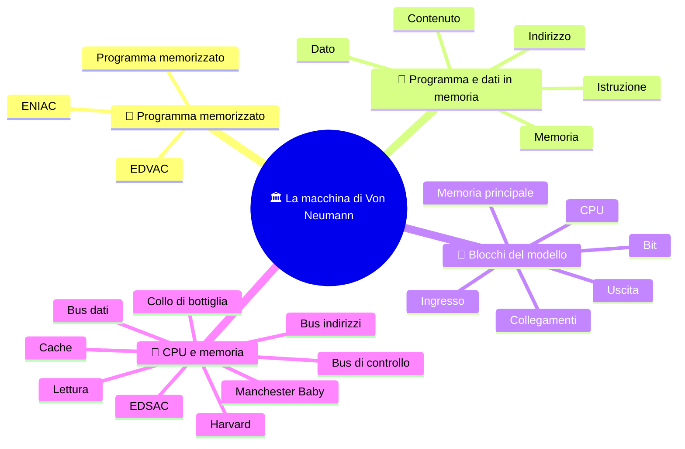

# 🏛️ La macchina di Von Neumann

**3EI · Settembre-Ottobre · S2 · Teoria**

> **Legenda:** ✅ da sapere · 🔍 per capire fino in fondo · 🤓 facoltativo, per curiosi · 🃏 flashcard: rispondi a voce, poi apri per controllare



## 🧭 Programma memorizzato

Un foglio di calcolo, un videogioco e un'app per la musica funzionano sullo stesso computer. Non cambiamo i circuiti ogni volta: cambiamo i programmi. Ma dove stanno le istruzioni quando il processore deve eseguirle?

Nei primi calcolatori cambiare compito poteva voler dire riconfigurare la macchina, con interruttori, cavi o pannelli di controllo. L'**ENIAC**, del 1946, si "programmava" così: bisognava ricollegare cavi e girare interruttori, e preparare un nuovo calcolo poteva richiedere giorni. Il lavoro era svolto da un gruppo di donne matematiche, fra cui Kay McNulty, Jean Jennings e Betty Snyder: furono le prime programmatrici di un calcolatore elettronico, e per molto tempo la loro storia è stata dimenticata. L'idea di **conservare anche il programma in memoria** cambiò il rapporto fra macchina e compito: le istruzioni diventarono informazioni che si potevano caricare e sostituire. ==La macchina restava la stessa; era il programma a darle un lavoro diverso.== Dai giorni di cavi si passava ai minuti di caricamento. ⚡

Questo modello è legato al nome di John von Neumann, ma non nacque dal lavoro isolato di una sola persona. Negli anni Quaranta matematici, ingegneri e tecnici cercavano insieme un modo per costruire calcolatori elettronici programmabili. La guerra aveva reso urgenti calcoli complessi, per esempio tabelle di tiro e simulazioni; allo stesso tempo, le idee sviluppate allora sarebbero diventate utili anche molto dopo la guerra. Il modello ci aiuta a capire il principio, non descrive ogni filo o componente di un computer moderno.

Riprendiamo i ruoli della [CPU](%28STU%29%203EI%20sett-ott%20S1%20-%20Dalle%20macchine%20alla%20CPU.md) e mettiamoli dentro la macchina completa.

## 💾 Programma e dati in memoria

### ✅ Istruzioni e dati nella stessa memoria

Nel modello di Von Neumann **istruzioni e dati stanno nella stessa memoria**. Un programma è una sequenza di istruzioni conservate lì, proprio come i valori su cui quelle istruzioni lavorano. La CPU raggiunge la memoria, preleva l'istruzione da eseguire, la interpreta e compie l'operazione richiesta. Poi passa all'istruzione successiva, salvo che il programma le chieda di seguire un percorso diverso.

La differenza rispetto a una macchina progettata per un solo compito è concreta: ==per cambiare calcolo non è necessario ricostruire il processore==. Si prepara un'altra sequenza di istruzioni e la si carica in memoria. In seguito vedremo più da vicino come la CPU tiene traccia dell'istruzione corrente e come la esegue; qui ci interessa il principio che rende possibile il cambiamento di programma.

<details>
<summary>🃏 <b>Che cosa significa «programma memorizzato»?</b></summary>
Che le istruzioni del programma sono conservate in memoria, nella stessa memoria dei dati. La CPU le preleva, le interpreta e le esegue una dopo l'altra.
</details>
<details>
<summary>🃏 <b>Perché il programma memorizzato fu una svolta?</b></summary>
Perché per cambiare compito basta cambiare le istruzioni in memoria, senza rifare collegamenti e impostazioni a mano.
</details>
<details>
<summary>🃏 <b>Von Neumann inventò tutto da solo?</b></summary>
No. Il suo nome è legato a un modello fondamentale, nato da ricerche collettive degli anni Quaranta.
</details>

### ✅ Indirizzo e contenuto

Immagina la memoria come una fila di cassetti numerati. L'**indirizzo** è il numero del cassetto; il **contenuto** è ciò che c'è dentro. ==Il numero del cassetto non è l'oggetto nel cassetto.== Anche se entrambi sono numeri, hanno ruoli diversi.

<details>
<summary>🃏 <b>Che differenza c'è fra indirizzo e contenuto?</b></summary>
L'indirizzo identifica una posizione della memoria, come il numero di un cassetto; il contenuto è ciò che si trova in quella posizione.
</details>
<details>
<summary>🃏 <b>Se sia l'indirizzo sia il contenuto sono numeri, sono la stessa cosa?</b></summary>
No. Possono essere entrambi numeri, ma hanno ruoli diversi: uno dice dove, l'altro che cosa.
</details>

## 🧱 Blocchi del modello

### ✅ I cinque blocchi

| Blocco                 | Funzione                                           | Esempio                                    |
| ---------------------- | -------------------------------------------------- | ------------------------------------------ |
| **CPU**                | Coordina ed esegue le istruzioni                   | CU, ALU e registri collaborano             |
| **Memoria principale** | Tiene disponibili istruzioni e dati in uso         | Programma caricato e valori da elaborare   |
| **Ingresso**           | Porta informazioni nel sistema                     | Tastiera, sensore                          |
| **Uscita**             | Porta informazioni verso l'esterno                 | Schermo, attuatore                         |
| **Collegamenti**       | Trasferiscono informazioni e segnali fra i blocchi | Richieste alla memoria e valori restituiti |

```text
                        +-----------------------+
                        | CPU                   |
                        | CU + ALU + REGISTRI   |
                        +-----------+-----------+
                                    |
                        collegamenti / bus
                        /           |           \
              +---------+    +-------------+    +---------+
              | INGRESSO|    | MEMORIA     |    | USCITA  |
              +---------+    | istruzioni  |    +---------+
                             | e dati      |
                             +-------------+
```

Le linee mostrano relazioni funzionali, non tutti i cavi di un PC. ⚠️ La CU **sta dentro la CPU**: non è un secondo processore esterno che comanda una CPU fatta solo di ALU. Alcuni dispositivi, come la scheda di rete, sono sia di ingresso sia di uscita.

<details>
<summary>🃏 <b>Quali sono i blocchi del modello di Von Neumann?</b></summary>
CPU, memoria principale, ingresso, uscita e i collegamenti che trasferiscono informazioni e segnali fra loro (BUS)
</details>
<details>
<summary>🃏 <b>Che cosa fa la memoria principale?</b></summary>
Tiene disponibili le istruzioni e i dati in uso: il programma caricato e i valori da elaborare.
</details>
<details>
<summary>🃏 <b>Che differenza c'è fra ingresso e uscita?</b></summary>
L'ingresso porta informazioni nel sistema, come tastiera o sensore; l'uscita le porta verso l'esterno, come schermo o attuatore. Alcuni dispositivi, come la scheda di rete, fanno entrambe le cose.
</details>
<details>
<summary>🃏 <b>Dove sta la CU nello schema?</b></summary>
Dentro la CPU, insieme ad ALU e registri. Non è un secondo processore esterno.
</details>
<details>
<summary>🃏 <b>Le linee dello schema sono i cavi del PC?</b></summary>
No. Mostrano relazioni funzionali fra i blocchi, non tutti i cavi reali.
</details>

### ✅ Esempio svolto: LOAD e ADD

Usiamo una memoria didattica: ogni cella contiene un intero valore oppure un'intera istruzione. (Non stiamo dicendo che un'istruzione vera occupi sempre una cella da un byte.)

| Indirizzo | Contenuto leggibile |
| --------- | ------------------- |
| 10        | `LOAD R1, [20]`     |
| 11        | `ADD R3, R1, R2`    |
| 20        | 7                   |
| 21        | 99                  |

Seguiamo la macchina senza saltare i passaggi. La CPU trova la prima istruzione all'indirizzo 10: `LOAD R1, [20]`. La legge come un comando, poi usa l'indirizzo 20 indicato dal comando per richiedere il dato. La cella 20 contiene 7, quindi copia **7** in R1. ==Il numero 20 serviva a trovare la cella: non è il dato copiato.==

R2 contiene già 5. La CPU passa all'istruzione all'indirizzo 11: `ADD R3, R1, R2`. L'ALU somma i contenuti di R1 e R2, cioè 7 e 5, e il risultato 12 viene scritto in R3. La cella 21 contiene 99, ma nessuna istruzione la indica: per questo il programma non la usa. ==Essere presenti nella memoria non basta per essere coinvolti nel calcolo.==

L'esempio separa tre domande che è facile confondere: **quale istruzione eseguire?** (indirizzo 10 o 11); **quale dato leggere?** (indirizzo 20); **quale risultato ottenere?** (12 in R3). Nei computer reali la rappresentazione è fatta di bit e le istruzioni hanno formati precisi; gli indirizzi 10, 11 e 20 sono scelti qui solo per rendere visibili i ruoli.

Se al posto della somma mettessimo una sottrazione, cambierebbe il lavoro svolto. ==Non modifichiamo fisicamente l'ALU: scegliamo, con un'altra istruzione, una funzione che la macchina sa già fare.==

> ⏸️ **Fissaggio:** nella tabella trova un indirizzo, un dato e un'istruzione. Spiega come li hai distinti senza guardare solo il loro aspetto.

<details>
<summary>🃏 <b>Che cosa fa LOAD R1, [20]?</b></summary>
Copia in R1 il contenuto della cella 20. Se la cella 20 contiene 7, in R1 arriva 7, non 20.
</details>
<details>
<summary>🃏 <b>Un valore viene usato solo perché è in memoria?</b></summary>
No. Viene usato solo se un'istruzione lo richiede: nell'esempio il 99 della cella 21 resta inutilizzato.
</details>
<details>
<summary>🃏 <b>Per far sottrarre invece che sommare bisogna modificare l'ALU?</b></summary>
No. Basta un'altra istruzione che scelga una funzione che la macchina sa già fare.
</details>

### 🔍 Istruzioni e dati come bit

`LOAD` e `ADD` sono modi leggibili di scrivere istruzioni. La memoria reale conserva sequenze di bit. Il **formato dell'istruzione** e il momento dell'esecuzione permettono al processore di trattarle come comandi. Altre sequenze diventano numeri, caratteri o indirizzi.

Non esiste un'etichetta universale che dica a ogni CPU «questi bit sono un'istruzione». Nel nostro modello seguiamo semplicemente il programma dalle posizioni indicate.

<details>
<summary>🃏 <b>In memoria c'è scritto davvero «LOAD»?</b></summary>
No. LOAD e ADD sono modi leggibili di scrivere istruzioni; la memoria conserva sequenze di bit.
</details>
<details>
<summary>🃏 <b>Come fa il processore a trattare dei bit come un'istruzione?</b></summary>
Grazie al formato dell'istruzione e al momento dell'esecuzione. Altre sequenze di bit diventano numeri, caratteri o indirizzi.
</details>

## 💬 CPU e memoria

### 🔍 Anatomia di una lettura

Per leggere la memoria non basta dire «mandami qualcosa». La CPU e la memoria devono coordinarsi, un po' come due persone che preparano uno scambio: bisogna indicare quale posizione interessa e quale azione si vuole compiere. In una lettura, la memoria restituisce il contenuto di quella posizione. Nel modello didattico distinguiamo tre informazioni:

- **Dove?** Un indirizzo, per esempio 20.
- **Che operazione?** Una lettura, diversa da una scrittura.
- **Quale valore?** Il contenuto restituito, per esempio 7.

Immagina la CPU che deve leggere la cella 20. Sull'indirizzo comunica **20**; con il controllo segnala **lettura**; la memoria risponde restituendo, sul percorso dei dati, il contenuto **7**. Sono ruoli distinti anche quando gli elementi viaggiano nello stesso sistema di collegamenti. Questi ruoli anticipano bus degli indirizzi, di controllo e dei dati. Anche un'istruzione prelevata dalla memoria viaggia come contenuto sul percorso dei dati: «bus dati» non vuol dire «vietato alle istruzioni».

<details>
<summary>🃏 <b>Quali tre informazioni servono per leggere la memoria?</b></summary>
Dove (un indirizzo), che operazione (lettura o scrittura) e quale valore (il contenuto restituito).
</details>
<details>
<summary>🃏 <b>A quali bus corrispondono le tre domande?</b></summary>
Dove al bus degli indirizzi, che operazione al bus di controllo, quale valore al bus dei dati.
</details>
<details>
<summary>🃏 <b>Un'istruzione può viaggiare sul bus dati?</b></summary>
Sì. Quando viene prelevata dalla memoria è un contenuto come un altro.
</details>

### 🔍 Il collo di bottiglia di Von Neumann

Il **collo di bottiglia di Von Neumann** è il limite che può nascere quando la CPU e la memoria scambiano istruzioni e dati attraverso un collegamento con capacità limitata. La CPU può eseguire operazioni molto rapidamente, ma per lavorare ha bisogno che le istruzioni e i dati arrivino. Se il collegamento non riesce a trasferirli abbastanza in fretta, la CPU deve aspettare oppure il lavoro avanza più lentamente di quanto permetterebbe la sua velocità di calcolo.

Riprendiamo l'esempio precedente. Per completare `LOAD R1, [20]`, la macchina deve prima prelevare l'istruzione dalla memoria e poi leggere il dato all'indirizzo 20. Dopo, deve ancora prelevare l'istruzione `ADD`. Nel modello più semplice, questi trasferimenti passano per una risorsa condivisa e non avvengono tutti nello stesso istante. Mentre la memoria o il collegamento serve una richiesta, la CPU può non avere ancora il prossimo elemento su cui lavorare. Se richieste simili si accumulano, si forma una coda: ==è questo rallentamento degli scambi, non una CPU «poco intelligente», a spiegare il collo di bottiglia==.

La cucina con un solo sportello rende l'idea: anche cuochi rapidissimi devono aspettare se gli ingredienti arrivano uno alla volta attraverso uno sportello lento. La metafora ha un limite: un computer non ha davvero uno sportello, e le architetture reali usano soluzioni diverse. Conta la capacità effettiva di trasferire informazioni fra memoria e processore; non basta confrontare «GHz della CPU» e «GB/s della memoria», perché misurano grandezze diverse. La cache, che vedremo più avanti, conserva vicino alla CPU alcuni dati e istruzioni usati spesso e riduce certe attese. Non elimina ogni attesa e non rende la memoria infinita o istantanea.

> 🔧 **Collegamento con il laboratorio:** modulo RAM e SSD fanno entrambi parte del sistema di memoria, ma non fanno lo stesso lavoro. Il modello di oggi descrive la memoria usata direttamente durante l'esecuzione. Un file salvato sul disco non è già pronto nei registri della CPU.

<details>
<summary>🃏 <b>Che cos'è il collo di bottiglia di Von Neumann?</b></summary>
La CPU può finire un calcolo in fretta e poi aspettare il dato successivo: dati e istruzioni si contendono lo stesso accesso alla memoria.
</details>
<details>
<summary>🃏 <b>Si possono confrontare direttamente i GHz della CPU e i GB/s della memoria?</b></summary>
No. Misurano grandezze diverse.
</details>
<details>
<summary>🃏 <b>La cache rende la memoria istantanea?</b></summary>
No. Riduce alcune attese, ma non rende la memoria infinita o istantanea.
</details>
<details>
<summary>🃏 <b>RAM e SSD fanno lo stesso lavoro?</b></summary>
No. Il modello descrive la memoria usata durante l'esecuzione; un file salvato sul disco non è già pronto nei registri della CPU.
</details>

### 🤓 Von Neumann, Harvard e le prime macchine

> Nell'architettura **Harvard**, istruzioni e dati hanno memorie o percorsi separati. Se i percorsi possono funzionare nello stesso momento, il processore può per esempio prelevare un'istruzione mentre accede a un dato: è un modo per ridurre la contesa descritta sopra. La separazione, però, richiede di progettare e gestire due percorsi; non significa «memoria dentro la CPU» contro «memoria fuori». Von Neumann e Harvard sono modelli utili per confrontare scelte di organizzazione, non etichette che raccontano da sole ogni dettaglio di un computer.
>
> Molti sistemi moderni mescolano le idee: per esempio, usano una memoria principale condivisa e cache separate per istruzioni e dati vicino al processore. Una cache separata può offrire percorsi distinti a quel livello, anche se più in basso le informazioni condividono altre risorse. Perciò, quando descriviamo una macchina, è utile domandarsi **a quale livello** ci riferiamo, invece di cercare una sola etichetta valida per tutto il computer.
>
> 🕰️ Il **Manchester Baby** eseguì un programma memorizzato nel 1948. Non era un computer moderno in miniatura: era una macchina sperimentale, costruita per verificare un'idea. Il suo successo mostrò che le istruzioni potevano essere conservate elettronicamente e poi eseguite dalla macchina. Da quel principio, sviluppato dal lavoro di più gruppi, discende una parte importante dell'informatica che usiamo oggi. Nel 1949, a Cambridge, entrò in funzione l'**EDSAC**, guidato da Maurice Wilkes: fu uno dei primi calcolatori a programma memorizzato usati davvero, per anni, per il lavoro scientifico. Chi fu «primo» dipende da come si definisce un computer: per questo gli storici discutono ancora.

<details>
<summary>🃏 <b>Come si programmava l'ENIAC, e chi lo faceva?</b></summary>
Ricollegando cavi e girando interruttori; un nuovo calcolo poteva richiedere giorni. Lo faceva un gruppo di donne matematiche, fra cui Kay McNulty, Jean Jennings e Betty Snyder.
</details>
<details>
<summary>🃏 <b>Che cosa fu l'EDSAC?</b></summary>
Un calcolatore a programma memorizzato entrato in funzione a Cambridge nel 1949, guidato da Maurice Wilkes e usato per il lavoro scientifico.
</details>
<details>
<summary>🃏 <b>Che cosa separa l'architettura Harvard?</b></summary>
Memoria e percorsi per le istruzioni e per i dati. Può permettere accessi contemporanei, con altre scelte e altri vincoli.
</details>
<details>
<summary>🃏 <b>I computer moderni sono puro Von Neumann o puro Harvard?</b></summary>
Spesso mescolano le idee: memoria principale unica e cache separate per istruzioni e dati.
</details>
<details>
<summary>🃏 <b>Che cosa dimostrò il Manchester Baby nel 1948?</b></summary>
Che un programma memorizzato poteva davvero essere eseguito da una macchina elettronica.
</details>

## 🧩 Metti alla prova il modello

1. **Base.** Che cosa significa «programma memorizzato»? Quali blocchi collaborano nell'esecuzione?
2. **Applicazione.** La cella 30 contiene 8 e la cella 8 contiene 90. Quale valore restituisce una lettura all'indirizzo 30? Motiva.
3. **Collegamento.** Perché nello schema la CU va disegnata dentro la CPU?
4. **Intuizione.** Raddoppiare la capacità della RAM garantisce di dimezzare il tempo di ogni lettura?
5. **Discussione.** Cambiare programma e cambiare hardware sono la stessa cosa? Fai un esempio in cui basta il primo e uno in cui potrebbe servire il secondo.

**🚪 Uscita:** scrivi una frase con «stessa memoria» e una con «ruoli diversi». Vietato usare «il computer sa» come spiegazione.

## 📚 Fonti e risorse

- [Computer History Museum - 1945](https://www.computerhistory.org/timeline/1945/) (in inglese): il rapporto sull'EDVAC dentro il lavoro sui primi calcolatori. Nota quante persone erano coinvolte.
- [Computer History Museum - 1948](https://www.computerhistory.org/timeline/1948/) (in inglese): la voce sul Manchester Baby; distingui la dimostrazione di un principio da un computer venduto sul mercato.
- [Nand2Tetris - Project 5](https://www.nand2tetris.org/project05) (in inglese, per curiosi): un computer didattico costruito da zero. Non coincide in ogni dettaglio con il nostro modello.

---

[⬅️ S1 - Dalle macchine alla CPU](%28STU%29%203EI%20sett-ott%20S1%20-%20Dalle%20macchine%20alla%20CPU.md) · [🗺️ Indice](%28STU%29%203EI%20-%20SETT-OTT.md) · [S3 - Registri e percorsi dei dati ➡️](%28STU%29%203EI%20sett-ott%20S3%20-%20Registri%20e%20percorsi%20dei%20dati.md)
