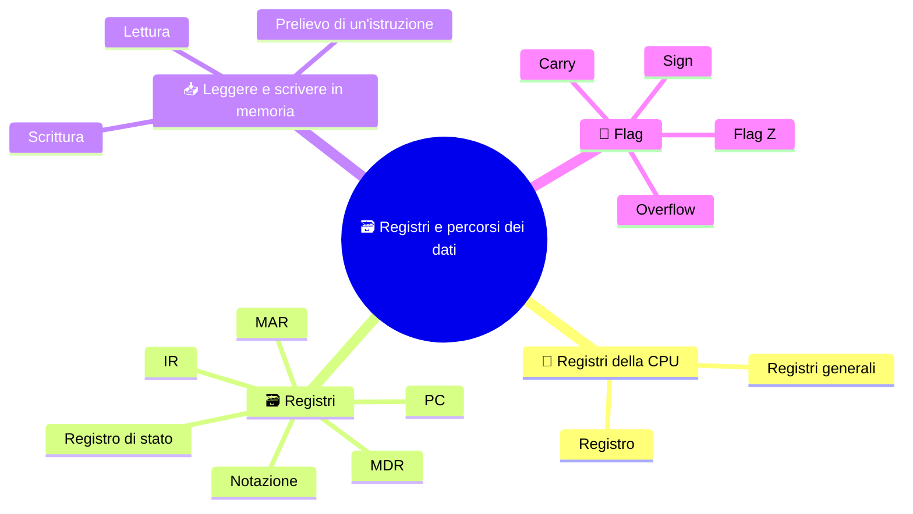

⬅️ [S2 - La macchina di Von Neumann](%28STU%29%203EI%20sett-ott%20S2%20-%20La%20macchina%20di%20Von%20Neumann.md) · 🏠 [Indice](%28STU%29%203EI%20-%20SETT-OTT.md) · [S4 - Il ciclo macchina](%28STU%29%203EI%20sett-ott%20S4%20-%20Il%20ciclo%20macchina.md) ➡️

# 🗃️ Registri e percorsi dei dati

**3EI · Settembre-Ottobre · S3 · Teoria**

> **Legenda:** ✅ da sapere · 🔍 per capire fino in fondo · 🤓 facoltativo, per curiosi · 🃏 flashcard: rispondi a voce, poi apri per controllare



## 🧭 Registri della CPU

Nel [modello di Von Neumann](%28STU%29%203EI%20sett-ott%20S2%20-%20La%20macchina%20di%20Von%20Neumann.md) la CPU esegue istruzioni conservate in memoria. Ma mentre aspetta una lettura, dove tiene l'indirizzo? E quando l'istruzione arriva, dove la tiene mentre prepara i dati?

Servono piccoli posti di lavoro interni. È lo stesso problema di quando segui una ricetta: ti servono un segnalibro, la riga che stai leggendo e gli ingredienti su cui lavori. Nella CPU questi ruoli sono affidati ai **registri**.

## 🗃️ Registri

### ✅ Registri e ruoli

Un **registro** è una piccola memoria dentro il processore, con capacità limitata. Conserva bit: ciascun registro, però, ha un **ruolo**, ed è il ruolo a dare significato a quei bit. I **registri generali**, qui R1, R2 e R3, conservano operandi e risultati temporanei. Nel nostro modello altri registri hanno compiti specifici.

| Nome | Domanda a cui risponde | Contenuto nel modello |
|---|---|---|
| **PC**, Program Counter | Dove prenderò la prossima istruzione? | Un indirizzo di istruzione |
| **IR**, Instruction Register | Quale istruzione sto eseguendo? | L'istruzione prelevata |
| **MAR**, Memory Address Register | Quale cella interessa l'accesso in corso? | Un indirizzo di memoria |
| **MDR**, Memory Data Register | Quale contenuto sto ricevendo o inviando? | Il valore letto o da scrivere |
| **Flag**, nel registro di stato | Che proprietà ha avuto un risultato? | Informazioni sintetiche, non l'intero risultato |

PC e MAR possono contenere lo stesso numero in un certo momento, ma **non hanno lo stesso ruolo**. Il PC segue la sequenza delle istruzioni; il MAR serve per ogni accesso, anche ai dati. L'MDR può contenere un'istruzione: per la memoria è solo un contenuto trasferito.

Questi nomi descrivono la nostra macchina didattica. Non tutte le CPU in commercio hanno un registro fisico con ciascuno di questi nomi.

⚠️ **PC non è il computer!** Qui PC significa *Program Counter*, il contatore del programma. Nel linguaggio comune PC è anche il *Personal Computer*. La sigla è la stessa, la cosa no: in informatica capita spesso, e conviene chiedersi sempre «PC di quale tipo?». 😄

<details>
<summary>🃏 <b>Che cos'è un registro?</b></summary>
Una piccola memoria dentro il processore, con capacità limitata.
</details>
<details>
<summary>🃏 <b>A che cosa servono i registri generali come R1, R2, R3?</b></summary>
A conservare operandi e risultati temporanei.
</details>
<details>
<summary>🃏 <b>Che cosa contiene il PC, Program Counter?</b></summary>
L'indirizzo della prossima istruzione da prelevare.
</details>
<details>
<summary>🃏 <b>Che cosa contiene l'IR, Instruction Register?</b></summary>
L'istruzione che la CPU sta eseguendo.
</details>
<details>
<summary>🃏 <b>Che cosa contiene il MAR, Memory Address Register?</b></summary>
L'indirizzo della cella interessata dall'accesso in corso, sia a istruzioni sia a dati.
</details>
<details>
<summary>🃏 <b>Che cosa contiene l'MDR, Memory Data Register?</b></summary>
Il contenuto che la CPU sta ricevendo dalla memoria o inviando alla memoria.
</details>
<details>
<summary>🃏 <b>Che cosa sono i flag?</b></summary>
Informazioni sintetiche, nel registro di stato, su alcune proprietà di un risultato. Non contengono il risultato intero.
</details>
<details>
<summary>🃏 <b>PC e MAR contengono lo stesso numero: hanno lo stesso ruolo?</b></summary>
No. Il PC segue la sequenza delle istruzioni; il MAR serve per ogni accesso alla memoria, anche ai dati.
</details>
<details>
<summary>🃏 <b>Tutte le CPU hanno registri chiamati PC, IR, MAR e MDR?</b></summary>
No. Sono i nomi della nostra macchina didattica, non di ogni CPU in commercio.
</details>
<details>
<summary>🃏 <b>Che cosa significa PC in questa dispensa, e che cosa significa nel linguaggio comune?</b></summary>
In questa dispensa Program Counter, il registro con l'indirizzo della prossima istruzione. Nel linguaggio comune è il Personal Computer: stessa sigla, cose diverse.
</details>

### ✅ Notazione

- `R1 <- 7` significa «copia 7 in R1». La freccia non è un'uguaglianza e non svuota la sorgente.
- `MEM[40]` indica **il contenuto** della cella di indirizzo 40.
- `MAR <- 40` e `MDR <- MEM[40]` fanno lavori diversi.

Negli esempi usiamo celle astratte: una cella contiene un intero dato oppure un'intera istruzione. Byte e capacità arriveranno più avanti, con ipotesi dichiarate.

Per consultare la tabella delle istruzioni usate negli esempi, vedi l'integrazione sul [linguaggio assembly di base](%28STU%29%203EI%20-%20Linguaggio%20assembly%20base.md).

<details>
<summary>🃏 <b>Che cosa significa R1 &lt;- 7?</b></summary>
Copia 7 in R1. Non è un'uguaglianza e non svuota la sorgente.
</details>
<details>
<summary>🃏 <b>Che cosa indica MEM[40]?</b></summary>
Il contenuto della cella di indirizzo 40, non il numero 40.
</details>
<details>
<summary>🃏 <b>Che cosa contiene una cella astratta nei nostri esempi?</b></summary>
Un intero dato oppure un'intera istruzione.
</details>

## 📥 Leggere e scrivere in memoria

### ✅ Esempio svolto: leggere il valore 23
La cella 40 contiene 23 e vogliamo copiarlo in R1. Per ora ignoriamo il prelievo dell'istruzione che ordina questa operazione.

| Passo | Azione | Perché serve |
|---|---|---|
| 1 | `MAR <- 40` | Indica la cella da leggere |
| 2 | La CU richiede `READ` | Distingue la lettura dalla scrittura |
| 3 | Attesa | La memoria non è istantanea ⏳ |
| 4 | `MDR <- MEM[MAR]`, quindi MDR = 23 | Riceve il contenuto |
| 5 | `R1 <- MDR`, quindi R1 = 23 | Conserva il valore nel registro destinazione |

```text
MAR = 40 -- indirizzo --> MEMORIA
CU       -- READ ------> MEMORIA
                         MEM[40] = 23
                              |
                              v
                         MDR = 23 --> R1 = 23
```

Una lettura normale **non cancella** il valore dalla memoria: dopo la sequenza MEM[40] vale ancora 23. R1 non riceve 40, perché 40 dice *dove* cercare, non *che cosa* c'è.

> ⏸️ **Fissaggio:** rifai la sequenza con MEM[60] = 14 e destinazione R2. A ogni passo di' ad alta voce «indirizzo» o «contenuto».

<details>
<summary>🃏 <b>Quali sono i passi di una lettura dalla memoria?</b></summary>
Il MAR riceve l'indirizzo; la CU richiede READ; si attende; l'MDR riceve il contenuto; il valore viene copiato nel registro destinazione.
</details>
<details>
<summary>🃏 <b>Perché nella lettura c'è un passo di attesa?</b></summary>
Perché la memoria non è istantanea.
</details>
<details>
<summary>🃏 <b>Dopo una lettura, il valore resta in memoria?</b></summary>
Sì. Una lettura normale non cancella il contenuto della cella.
</details>
<details>
<summary>🃏 <b>Leggendo la cella 40, il registro destinazione riceve 40?</b></summary>
No. Riceve il contenuto della cella: 40 dice dove cercare, non che cosa c'è.
</details>

### 🔍 Prelievo di un'istruzione

Supponiamo PC = 10 e MEM[10] = `LOAD R1, [40]`. Per prelevarla copiamo il PC nel MAR, chiediamo una lettura e riceviamo l'istruzione nel MDR. Poi la copiamo nell'IR. Ora la CU può interpretarla.

```text
PC = 10 --> MAR = 10 --> MEM[10]
                              |
IR = LOAD R1,[40] <-- MDR <----+
```

Quando la `LOAD` viene eseguita, il MAR riceve 40 e l'MDR riceve 23. Intanto l'IR continua a tenere l'istruzione. Ecco perché conviene separare i ruoli: la CPU non perde il comando mentre va a prendere il dato. La prossima dispensa completerà la sequenza con l'avanzamento del PC.

<details>
<summary>🃏 <b>Come arriva un'istruzione nell'IR?</b></summary>
Il PC viene copiato nel MAR, si chiede una lettura, l'istruzione arriva nell'MDR e poi viene copiata nell'IR.
</details>
<details>
<summary>🃏 <b>Durante una LOAD, perché IR e MDR contengono cose diverse?</b></summary>
L'IR conserva l'istruzione, mentre l'MDR riceve il dato richiesto: così la CPU non perde il comando mentre va a prendere il dato.
</details>

### 🔍 Scrittura in memoria

Vogliamo copiare in memoria il valore di R3 = 12, nella cella 50. Si prepara `MAR <- 50` e `MDR <- R3`, poi la CU attiva `WRITE`. Alla fine MEM[50] contiene 12: il vecchio contenuto di quella cella è **sostituito**. R3 resta 12.

Indirizzo e valore vanno preparati prima della scrittura. Un indirizzo sbagliato modifica un'altra cella, anche se il valore è giusto.

<details>
<summary>🃏 <b>Quali sono i passi di una scrittura in memoria?</b></summary>
Il MAR riceve l'indirizzo di destinazione, l'MDR riceve il valore, poi la CU attiva WRITE.
</details>
<details>
<summary>🃏 <b>Che cosa succede al vecchio contenuto della cella scritta?</b></summary>
Viene sostituito dal nuovo valore. Il registro sorgente invece conserva il suo valore.
</details>
<details>
<summary>🃏 <b>Perché indirizzo e valore vanno preparati prima di WRITE?</b></summary>
Perché con un indirizzo sbagliato si modifica un'altra cella, anche se il valore è giusto.
</details>

## 🚩 Flag

### 🔍 Flag e risultati

Dopo la sottrazione $7-7$ il risultato è 0 e il flag **Z** (zero) può valere 1 per segnalarlo. Un'istruzione successiva può usare questa informazione per scegliere che strada prendere.

Altri flag tipici: **carry** (riporto nelle operazioni senza segno), **sign/negative** (legato al bit di segno), **overflow** (risultato fuori intervallo nelle operazioni con segno). Non sono intercambiabili. Quali istruzioni aggiornano quali flag dipende dall'architettura.

> 🔧 **Collegamento con il laboratorio:** aggiungere un modulo RAM aumenta la memoria principale, non il numero di registri della CPU. La capacità scritta su un modulo non descrive la memoria interna del processore.

<details>
<summary>🃏 <b>A che cosa serve il flag Z?</b></summary>
Segnala che il risultato è zero, per esempio dopo 7 - 7. Un'istruzione successiva può usarlo per scegliere che strada prendere.
</details>
<details>
<summary>🃏 <b>Che cosa segnalano carry, sign e overflow?</b></summary>
Carry: un riporto nelle operazioni senza segno. Sign o negative: il bit di segno. Overflow: un risultato fuori intervallo nelle operazioni con segno.
</details>
<details>
<summary>🃏 <b>Tutte le CPU aggiornano i flag allo stesso modo?</b></summary>
No. Quali istruzioni aggiornano quali flag dipende dall'architettura.
</details>
<details>
<summary>🃏 <b>Aggiungere RAM aumenta i registri della CPU?</b></summary>
No. Aumenta la memoria principale, non la memoria interna del processore.
</details>

### 🤓 Overflow e riporto

> Un registro da 4 bit ha 16 configurazioni. Come interi senza segno rappresentano i numeri da 0 a 15. La somma $15+1$ richiederebbe cinque bit: `1111 + 0001 = 10000`. Se ne teniamo solo quattro resta `0000`, con un riporto.
>
> Non è un errore della macchina: è il limite della rappresentazione scelta. Se interpretiamo gli stessi bit come numeri con segno, cambiano intervallo e significato dei controlli. Per questo «carry» e «overflow» non sono due nomi della stessa cosa. 🎮 Curiosità: diversi glitch dei vecchi videogiochi nascono proprio da contatori che «ricominciano da zero».

<details>
<summary>🃏 <b>Quali numeri senza segno rappresenta un registro da 4 bit?</b></summary>
Da 0 a 15: 16 configurazioni.
</details>
<details>
<summary>🃏 <b>Che cosa succede se in 4 bit calcoli 15 + 1?</b></summary>
Servirebbero cinque bit, 10000. Tenendone quattro resta 0000, con un riporto.
</details>
<details>
<summary>🃏 <b>Carry e overflow sono la stessa cosa?</b></summary>
No. Il carry riguarda le operazioni senza segno, l'overflow quelle con segno.
</details>

## 🧩 Metti alla prova il modello

1. **Base.** Abbina PC, IR, MAR e MDR a: indirizzo della prossima istruzione, istruzione corrente, indirizzo dell'accesso, contenuto trasferito.
2. **Applicazione.** MEM[18] = 6. Scrivi i passi per copiare quel valore in R2.
3. **Procedimento.** R3 = 15. Descrivi la scrittura in MEM[24]: quali valori cambiano e quali restano?
4. **Collegamento.** Durante la lettura di un dato, perché IR e MDR possono contenere cose diverse?
5. **Intuizione.** PC e MAR valgono entrambi 10. Vuol dire che uno dei due è inutile? Motiva pensando alla lettura di un dato.
6. **Base.** Il flag Z vale 1: significa che il registro di stato contiene il risultato dell'operazione?

**🚪 Uscita:** disegna MAR e MDR con un valore ciascuno e spiega perché non li hai scambiati.

**🏠 Facoltativo a casa:** racconta la stessa lettura in quattro righe senza sigle, poi rimettile.

## 📚 Fonti e risorse

- [Nand2Tetris - Project 5](https://www.nand2tetris.org/project05) (in inglese, per curiosi): confronta CPU e memoria di un computer didattico vero con il nostro modello; i nomi dei registri non coincidono tutti.
- [RISC-V - specifiche ufficiali](https://riscv.org/specifications/) (in inglese, molto tecnico): solo per chi vuole vedere come un'architettura reale definisce i propri registri.

---

⬅️ [S2 - La macchina di Von Neumann](%28STU%29%203EI%20sett-ott%20S2%20-%20La%20macchina%20di%20Von%20Neumann.md) · 🏠 [Indice](%28STU%29%203EI%20-%20SETT-OTT.md) · [S4 - Il ciclo macchina](%28STU%29%203EI%20sett-ott%20S4%20-%20Il%20ciclo%20macchina.md) ➡️
