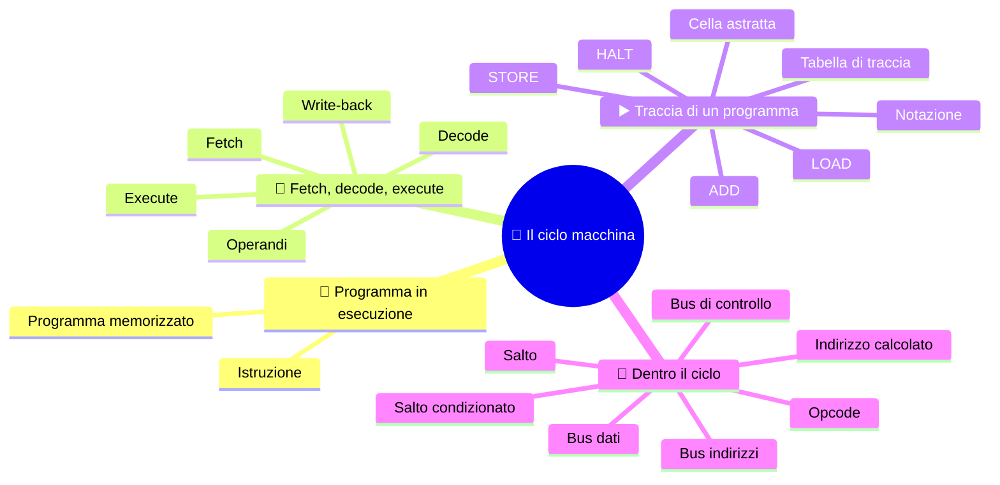
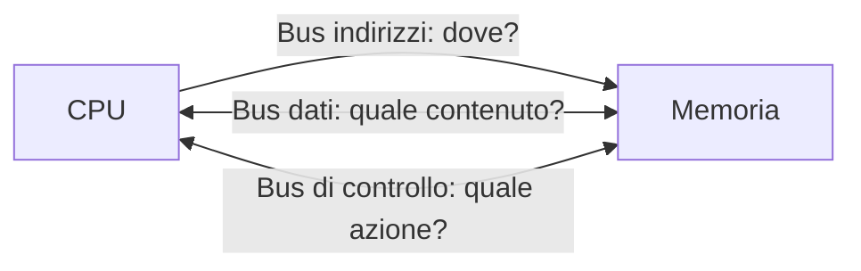

⬅️ [S3 - Registri e percorsi dei dati](%28STU%29%203EI%20sett-ott%20S3%20-%20Registri%20e%20percorsi%20dei%20dati.md) · 🏠 [Indice](%28STU%29%203EI%20-%20SETT-OTT.md) · [S5 - Indirizzi e gerarchia delle memorie](%28STU%29%203EI%20sett-ott%20S5%20-%20Indirizzi%20e%20gerarchia%20delle%20memorie.md) ➡️

# 🔄 Il ciclo macchina

**3EI · Settembre-Ottobre · S4 · Teoria**

> **Legenda:** ✅ da sapere · 🔍 per capire fino in fondo · 🤓 facoltativo, per curiosi · ✏️ da fare con carta e penna · 🃏 flashcard: rispondi a voce, poi apri per controllare



## 🧭 Programma in esecuzione

Un programma in memoria, da solo, non fa nulla: è una ricetta chiusa in un cassetto. Qualcuno deve leggerla riga per riga e fare ciò che dice. Questo qualcuno è la CPU, con i registri e i percorsi dei dati visti in [S3](%28STU%29%203EI%20sett-ott%20S3%20-%20Registri%20e%20percorsi%20dei%20dati.md).

**Il problema.** La CPU non «capisce» le istruzioni come una persona. Sa fare una sola cosa, ripetuta all'infinito: <u>prendere un'istruzione, interpretarla, eseguirla, passare alla successiva</u>. Questo giro si chiama **ciclo macchina** (o ciclo fetch-decode-execute).

Qui sta la forza del **programma memorizzato** ([S2](%28STU%29%203EI%20sett-ott%20S2%20-%20La%20macchina%20di%20Von%20Neumann.md)): il giro è sempre lo stesso, cambiano solo le istruzioni in memoria. Così la stessa macchina può fare cose diversissime.

⚙️ **Nella pratica.** Questo giro c'è in ogni processore, anche quello del telefono. I processori moderni però aggiungono tecniche per andare più veloci, per esempio cominciare l'istruzione successiva prima di aver finito la precedente: le vedremo a novembre-dicembre. Per ora studiamo la versione base: basta per capire che cosa succede.

## 🔄 Il ciclo in tre fasi

### ✅ Fetch, decode, execute

**Il problema.** Un programma è una lista di istruzioni, ma la CPU ne tratta una alla volta. Come fa a non perdersi? Ripete sempre lo stesso giro in tre fasi, come un cuoco che segue la ricetta riga per riga: legge la riga, capisce che cosa chiede, la fa; poi passa alla riga dopo.

```text
FETCH                 DECODE                  EXECUTE
preleva il comando -> interpreta il comando -> svolge l'operazione
       ^                                           |
       +---------- prossima istruzione ------------+
```

| Fase | Che cosa succede | Esempio con `ADD R3, R1, R2` |
|---|---|---|
| **Fetch** (prelievo) | La CPU prende dalla memoria l'istruzione indicata dal PC | Arriva nella CPU il comando `ADD R3, R1, R2` |
| **Decode** (interpretazione) | La CU capisce quale **operazione** è richiesta e su quali **operandi**, cioè i dati su cui lavora | Operazione: somma. Operandi: R1 e R2. Il risultato andrà in R3 |
| **Execute** (esecuzione) | La CPU fa il lavoro: un calcolo, un accesso alla memoria o un cambio di punto nel programma | L'ALU somma R1 e R2 |

**E il risultato?** Dopo l'execute il risultato va messo da qualche parte. Questa scrittura finale si chiama **write-back** («riscrittura»): si può considerare l'ultimo pezzo dell'execute oppure una fase a sé. Dove finisce dipende dall'istruzione:

| Istruzione | Legge un dato dalla RAM? | Dove finisce il risultato |
|---|---|---|
| `LOAD R1, [40]` | sì, dalla cella 40 | nel registro R1 |
| `ADD R3, R1, R2` | no, usa solo registri | nel registro R3 |
| `STORE [41], R3` | no | nella RAM, cella 41 |

<u>Non tutte le istruzioni leggono dalla RAM e non tutte scrivono in un registro</u>: «write-back» è un'etichetta comoda, non un passo identico per tutte.

<details>
<summary>🃏 <b>Che cosa succede nel fetch?</b></summary>
La CPU prende dalla memoria l'istruzione da eseguire.
</details>
<details>
<summary>🃏 <b>Che cosa succede nella decode?</b></summary>
La CU riconosce l'operazione richiesta e i suoi operandi.
</details>
<details>
<summary>🃏 <b>Che cosa succede nell'execute?</b></summary>
La CPU svolge il lavoro: un calcolo, un accesso alla memoria o un cambio di percorso nel programma.
</details>
<details>
<summary>🃏 <b>Che cosa sono gli operandi?</b></summary>
I dati su cui lavora l'istruzione. <i>In ADD R3, R1, R2 sono R1 e R2.</i>
</details>
<details>
<summary>🃏 <b>Che cos'è il write-back?</b></summary>
La scrittura del risultato, spesso descritta come passo a sé dell'esecuzione.
</details>
<details>
<summary>🃏 <b>Tutte le istruzioni leggono dati dalla RAM e scrivono un registro?</b></summary>
No. Per esempio una STORE scrive in memoria, non in un registro.
</details>

## ▶️ Traccia di un programma

### ✅ Le regole della nostra macchina

Per seguire un programma passo per passo ci serve una macchina piccola, con regole chiare. La nostra è un **modello**: una versione semplificata, pensata per studiare. Nei computer veri alcuni dettagli cambiano, e lo diremo ogni volta.

**Che cos'è una cella.** Ricordi i cassetti numerati della memoria ([S2](%28STU%29%203EI%20sett-ott%20S2%20-%20La%20macchina%20di%20Von%20Neumann.md))? Una **cella** è un cassetto: ha un **indirizzo** (il numero sul cassetto) e un **contenuto** (ciò che c'è dentro). Nei computer veri una cella contiene un byte e un'istruzione può occuparne più d'una. Nel nostro modello usiamo una **cella astratta**: un cassetto «comodo», <u>abbastanza grande da contenere un'istruzione intera oppure un valore intero</u>. «Astratta» vuol dire solo semplificata, non una misura reale.

```text
indirizzo:  10                 11                12                 13      ...   40    41
contenuto:  LOAD R1, [40]      ADD R3, R1, R2    STORE [41], R3     HALT          7     0
```

**Come si leggono le scritture.**

| Scrittura | Si legge | Esempio |
|---|---|---|
| `MEM[40]` | il contenuto della cella di indirizzo 40 | se nella cella 40 c'è 7, allora MEM[40] = 7 |
| `[40]` dentro un'istruzione | «la cella di indirizzo 40» | `LOAD R1, [40]` |
| `A <- B` | copia B in A; B non cambia (vedi [S3](%28STU%29%203EI%20sett-ott%20S3%20-%20Registri%20e%20percorsi%20dei%20dati.md)) | `PC <- PC + 1` |

**Le regole.**

- Ogni cella contiene un'istruzione intera oppure un valore.
- Le istruzioni stanno in celle consecutive (10, 11, 12...). Dopo ogni fetch il PC passa alla cella successiva: `PC <- PC + 1`. Vale **solo in questo modello**: nei computer veri un'istruzione può occupare più celle.
- `LOAD R1, [40]` copia MEM[40] in R1, senza modificare MEM[40].
- `ADD R3, R1, R2` scrive in R3 la somma di R1 e R2, senza modificare R1 e R2.
- `STORE [41], R3` copia R3 in MEM[41].
- `HALT` termina la simulazione.

<details>
<summary>🃏 <b>Che cos'è una cella astratta?</b></summary>
Un cassetto della memoria semplificato, abbastanza grande da contenere un'istruzione intera o un valore intero. <i>Nella cella 10 c'è LOAD R1, [40]; nella cella 40 c'è 7.</i>
</details>
<details>
<summary>🃏 <b>Che cosa significa MEM[40]?</b></summary>
Il contenuto della cella di indirizzo 40.
</details>
<details>
<summary>🃏 <b>Di quanto aumenta il PC dopo il prelievo, nel nostro modello?</b></summary>
Di uno, perché ogni istruzione occupa una cella astratta e le istruzioni sono in celle consecutive. Vale solo per questo modello.
</details>
<details>
<summary>🃏 <b>Che cosa fanno LOAD e STORE?</b></summary>
LOAD copia un valore dalla memoria a un registro; STORE copia un registro in memoria. Nessuna delle due cancella la sorgente.
</details>
<details>
<summary>🃏 <b>Che cosa modifica ADD R3, R1, R2?</b></summary>
Solo R3, dove scrive la somma di R1 e R2.
</details>
<details>
<summary>🃏 <b>Che cosa fa HALT?</b></summary>
Termina la simulazione.
</details>

### ✅ Esempio svolto: LOAD, ADD, STORE

> ✏️ **Carta e penna!** Questo esempio non si segue «a mente». Prima di leggere i passi, disegna la tabella di traccia (PC, R1, R2, R3, MEM[40], MEM[41]) e compilala riga per riga insieme al testo. Senza una traccia scritta ci si perde quasi sempre.

**Situazione iniziale:** 
PC = 10, 
R1 = 0, 
R2 = 5, 
R3 = 0.

| Indirizzo | Contenuto        |
| --------- | ---------------- |
| 10        | `LOAD R1, [40]`  |
| 11        | `ADD R3, R1, R2` |
| 12        | `STORE [41], R3` |
| 13        | `HALT`           |
| 40        | 7                |
| 41        | 0                |

**1️⃣ LOAD.** Il PC indica 10: il fetch porta l'istruzione da MEM[10] all'IR e il PC passa a 11. La CU riconosce una lettura dalla cella 40: arriva 7, che finisce in R1.

**2️⃣ ADD.** Il nuovo fetch usa 11, non 40: 40 era l'indirizzo di un dato, non il seguito del programma. Il PC passa a 12. L'ALU riceve 7 e 5, produce 12 e il risultato va in R3.

**3️⃣ STORE.** Il fetch usa 12 e il PC passa a 13. Alla memoria arrivano indirizzo 41, valore 12 e richiesta WRITE. MEM[41] diventa 12. R3 resta 12.

**🛑 HALT.** Si preleva la cella 13 e il PC passa a 14, come da regola; l'istruzione ferma la simulazione. La cella 14 non viene eseguita.

**Tabella di traccia.** Ogni riga è la fotografia della macchina dopo un'istruzione; la prima è la partenza, così puoi confrontare. In **grassetto** i valori cambiati rispetto alla riga sopra.

| Dopo l'esecuzione di | PC | R1 | R2 | R3 | MEM[40] | MEM[41] |
|---|---|---|---|---|---|---|
| Partenza (nulla eseguito) | 10 | 0 | 5 | 0 | 7 | 0 |
| LOAD | **11** | **7** | 5 | 0 | 7 | 0 |
| ADD | **12** | 7 | 5 | **12** | 7 | 0 |
| STORE | **13** | 7 | 5 | 12 | 7 | **12** |
| HALT | **14** | 7 | 5 | 12 | 7 | 12 |

> ⏸️ **Fissaggio:** spiega perché il PC non diventa mai 40 e perché MEM[40] non si azzera dopo la LOAD.

<details>
<summary>🃏 <b>Dopo una LOAD da 40, il PC salta a 40?</b></summary>
No. 40 è l'indirizzo di un dato; il PC indica la prossima istruzione del programma, cioè la cella successiva.
</details>
<details>
<summary>🃏 <b>Nell'esempio svolto, che cosa cambia dopo la STORE?</b></summary>
La cella 41 riceve 12; R3 resta 12 e il PC passa a 13.
</details>
<details>
<summary>🃏 <b>Dopo HALT si esegue la cella successiva?</b></summary>
No. Il PC risulta avanzato come da regola, ma la simulazione si ferma.
</details>
<details>
<summary>🃏 <b>Come si segue un programma su carta senza perdersi?</b></summary>
Si scrive lo stato iniziale e si aggiorna una tabella di PC, registri e memoria dopo ogni istruzione.
</details>

## 🔬 Dentro il ciclo

### 🔍 Il fetch in dettaglio

| Passo | Trasferimento o comando | Stato |
|---|---|---|
| 1 | `MAR <- PC` | MAR = 10 |
| 2 | Richiesta READ e attesa | La memoria usa l'indirizzo 10 |
| 3 | `MDR <- MEM[MAR]` | MDR contiene `LOAD R1, [40]` |
| 4 | `IR <- MDR` | L'IR conserva il comando |
| 5 | `PC <- PC + 1` | PC = 11 nel modello |

La decode riconosce l'**opcode** `LOAD`, il registro destinazione R1 e l'indirizzo 40. Per completare l'istruzione serve un secondo accesso: `MAR <- 40`, READ, attesa, `MDR <- MEM[40]`, `R1 <- MDR`.

Nella stessa istruzione abbiamo quindi letto la memoria **due volte**, con scopi diversi: prima il comando, poi il dato. Intanto l'IR conserva il comando, anche se l'MDR viene riutilizzato.

<details>
<summary>🃏 <b>Quali sono i passi del fetch?</b></summary>
MAR riceve il PC; richiesta READ e attesa; MDR riceve l'istruzione; IR riceve l'MDR; il PC avanza.
</details>
<details>
<summary>🃏 <b>Che cos'è l'opcode?</b></summary>
La parte dell'istruzione che indica l'operazione, per esempio LOAD.
</details>
<details>
<summary>🃏 <b>Quante volte una LOAD accede alla memoria?</b></summary>
Due: prima per prelevare l'istruzione, poi per leggere il dato richiesto.
</details>
<details>
<summary>🃏 <b>Perché l'IR non viene sovrascritto dal dato della LOAD?</b></summary>
Perché il dato arriva nell'MDR: l'IR conserva il comando finché l'istruzione non è finita.
</details>

### 🔍 I tre bus in azione

**Il problema.** CPU e memoria sono due componenti separati: per scambiarsi informazioni servono dei fili. Un **bus** è un gruppo di fili che collega più componenti e che tutti condividono. Ne servono tre, perché per ogni accesso alla memoria bisogna dire tre cose diverse. Pensa a chiedere un libro in biblioteca: **dove** si trova (lo scaffale), **che cosa** passa di mano (il libro) e **che azione** si vuole (prendere o riporre).



| Bus | Che cosa trasporta | Direzione |
|---|---|---|
| **Indirizzi** | Il numero della cella interessata | Sempre CPU → memoria: è la CPU a chiedere, la memoria non sceglie da sola |
| **Dati** | Il contenuto letto o da scrivere | Dipende: in lettura memoria → CPU, in scrittura CPU → memoria |
| **Controllo** | L'azione (READ o WRITE) e i segnali di «fatto» | CPU → memoria per la richiesta, memoria → CPU per il completamento |

**Gli stessi bus, sul nostro esempio svolto:**

| Che cosa succede | Bus indirizzi (dove?) | Bus di controllo (azione?) | Bus dati (contenuto?) |
|---|---|---|---|
| Fetch di `LOAD R1, [40]` dalla cella 10 | 10 | READ | `LOAD R1, [40]`, dalla memoria alla CPU |
| Lettura del dato richiesto dalla LOAD | 40 | READ | 7, dalla memoria alla CPU |
| Scrittura della `STORE [41], R3` | 41 | WRITE | 12, dalla CPU alla memoria |

<u>Senza il bus di controllo la memoria vedrebbe un indirizzo e un numero senza sapere che cosa farne</u>: «41 e 12» vuol dire «scrivi 12 nella cella 41» o «leggi la cella 41»? È la riga di controllo (WRITE o READ) a dirlo.

**E la CU?** Non porta i numeri «a mano» e non calcola al posto dell'ALU: genera i segnali che scelgono i percorsi e abilitano le operazioni (per esempio READ o WRITE). Un trasferimento fra due registri usa collegamenti interni al processore, senza passare dai bus verso la RAM.

<details>
<summary>🃏 <b>In quale direzione va il bus indirizzi?</b></summary>
Dalla CPU alla memoria, sia nel fetch sia nella scrittura di un dato.
</details>
<details>
<summary>🃏 <b>In quale direzione va il bus dati?</b></summary>
Dipende: nel fetch dalla memoria alla CPU, nella scrittura dalla CPU alla memoria.
</details>
<details>
<summary>🃏 <b>Che cosa passa sul bus di controllo?</b></summary>
Il comando di lettura o scrittura e i segnali di completamento.
</details>
<details>
<summary>🃏 <b>La CU trasporta i numeri o fa i calcoli?</b></summary>
No. Genera segnali che scelgono percorsi e abilitano operazioni; i calcoli li fa l'ALU.
</details>
<details>
<summary>🃏 <b>Copiare un valore fra due registri richiede la RAM?</b></summary>
No. Usa collegamenti interni al processore.
</details>
<details>
<summary>🃏 <b>Perché serve il bus di controllo?</b></summary>
Per dire alla memoria che azione fare. <i>Indirizzo 41 e valore 12 non bastano: servono WRITE (scrivi) o READ (leggi).</i>
</details>
<details>
<summary>🃏 <b>Che cosa passa sui tre bus quando la STORE scrive 12 nella cella 41?</b></summary>
Indirizzi: 41. Dati: 12. Controllo: WRITE.
</details>

### 🔍 Indirizzo calcolato

**Il problema.** Finora l'indirizzo era scritto dentro l'istruzione (`[40]`). A volte però il programma deve scegliere la cella in base a un calcolo: per esempio scorrere un elenco di valori in celle consecutive, cambiando solo un registro e rieseguendo la stessa istruzione.

`LOAD R1, [R2+4]` significa: «<u>vai alla cella il cui indirizzo è R2 più 4 e copia il suo contenuto in R1</u>». Prima bisogna quindi **ricavare** l'indirizzo.

🧪 **Esempio numerico.** Se R2 = 36, l'ALU calcola $36+4=40$. Se MEM[40] = 7, in R1 arriva **7**: non 40 (che è l'indirizzo) e non 36 (che è il contenuto di R2).

Il lavoro, in ordine: prelievo dell'istruzione, interpretazione, calcolo dell'indirizzo, lettura del dato, scrittura nel registro. Qui l'ALU non produce il risultato finale: la somma serve a **trovare** il dato.

> 🔧 **Collegamento con il laboratorio:** quando vedi un programma avviarsi su un PC non stai osservando una sola istruzione. Dietro un clic ci sono moltissime istruzioni e trasferimenti. Per studiarli usiamo una traccia su carta.

<details>
<summary>🃏 <b>Che cosa significa LOAD R1, [R2+4]?</b></summary>
Prima si calcola l'indirizzo sommando 4 al contenuto di R2, poi si copia in R1 il contenuto della cella trovata.
</details>
<details>
<summary>🃏 <b>In un indirizzo calcolato, a che cosa serve l'ALU?</b></summary>
A trovare il dato: la somma produce l'indirizzo, non il valore finale.
</details>
<details>
<summary>🃏 <b>Un clic su un'icona corrisponde a una sola istruzione?</b></summary>
No. Dietro un gesto ci sono moltissime istruzioni e trasferimenti.
</details>

### 🤓 Salti e cicli

> Un **salto** cambia il PC con una destinazione diversa dalla cella successiva. Un **salto condizionato** lo fa solo se una condizione è vera, per esempio se un flag ha un certo valore. Così un programma può scegliere fra strade diverse o ripetere operazioni: è da qui che nascono `if` e cicli.
>
> Nelle CPU reali un'istruzione può occupare più byte, con lunghezza fissa o variabile: il PC non aumenta sempre di uno. E il nostro elenco di passi non significa «un passo = un ciclo di clock». Ottimizzazioni e pipeline le vedremo a novembre-dicembre.

<details>
<summary>🃏 <b>Che cosa fa un salto?</b></summary>
Cambia il PC con una destinazione diversa dalla cella successiva.
</details>
<details>
<summary>🃏 <b>Che cosa fa un salto condizionato?</b></summary>
Cambia il PC solo se una condizione è vera, per esempio se un flag ha un certo valore. Da qui nascono if e cicli.
</details>
<details>
<summary>🃏 <b>Nelle CPU reali il PC aumenta sempre di uno?</b></summary>
No. Le istruzioni possono occupare più byte, con lunghezza fissa o variabile.
</details>
<details>
<summary>🃏 <b>Un passo del ciclo corrisponde a un ciclo di clock?</b></summary>
Non necessariamente: il nostro elenco di passi è un modello, non una misura dei tempi.
</details>

## 🧩 Metti alla prova il modello

1. **Base.** Che cosa distingue fetch, decode ed execute?
2. **Procedimento.** Nel fetch, metti in ordine: `IR <- MDR`, `MAR <- PC`, lettura della memoria, ricezione in MDR. Chi richiede READ?
3. **Applicazione.** Nel programma svolto cambia R2 iniziale in 4 e MEM[40] in 9. Ricompila la tabella fino a STORE.
4. **Collegamento.** Che differenza c'è fra prelevare `LOAD R1,[40]` e leggere il dato che richiede?
5. **Dettaglio.** Per `LOAD R1,[R2+4]`, con R2 = 60 e MEM[64] = 17, quali sono l'indirizzo effettivo e il valore finale di R1?
6. **Intuizione.** Se il risultato dell'ALU non viene scritto da nessuna parte, basta che il calcolo sia avvenuto per usarlo più tardi?

**🚪 Uscita:** completa «La LOAD fa arrivare ..., mentre il suo fetch fa arrivare ...».

**🏠 Facoltativo:** racconta il programma a qualcuno senza usare le parole «magia» o «il computer capisce».

## 📚 Fonti e risorse

- [Nand2Tetris - Project 5](https://www.nand2tetris.org/project05) (in inglese, per curiosi): un computer didattico funzionante; confronta le sue scelte con quelle della nostra simulazione.
- [RISC-V - specifiche ufficiali](https://riscv.org/specifications/) (in inglese, molto tecnico): per vedere che istruzioni, registri e indirizzamento cambiano da un'architettura all'altra.

---

⬅️ [S3 - Registri e percorsi dei dati](%28STU%29%203EI%20sett-ott%20S3%20-%20Registri%20e%20percorsi%20dei%20dati.md) · 🏠 [Indice](%28STU%29%203EI%20-%20SETT-OTT.md) · [S5 - Indirizzi e gerarchia delle memorie](%28STU%29%203EI%20sett-ott%20S5%20-%20Indirizzi%20e%20gerarchia%20delle%20memorie.md) ➡️
