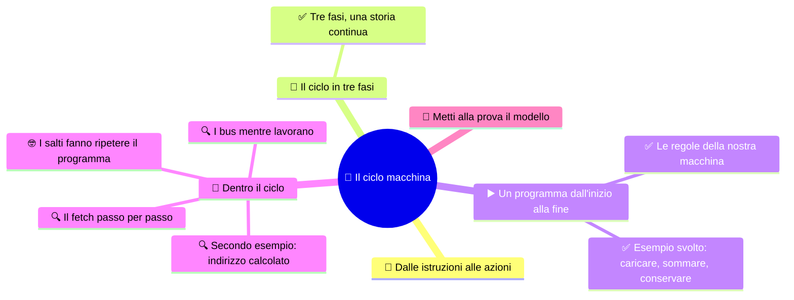

# 🔄 Il ciclo macchina

**3EI · Settembre-Ottobre · S4 · Teoria**

> **Legenda:** ✅ da sapere · 🔍 per capire fino in fondo · 🤓 facoltativo, per curiosi · 🃏 flashcard: rispondi a voce, poi apri per controllare



## 🧭 Dalle istruzioni alle azioni

Un programma in memoria, da solo, non fa nulla. Dopo aver distinto [registri e percorsi](%28STU%29%203EI%20sett-ott%20S3%20-%20Registri%20e%20percorsi%20dei%20dati.md), dobbiamo capire chi fa avanzare il lavoro. La forza del programma memorizzato sta anche qui: ripetendo sempre lo stesso procedimento generale, la stessa macchina realizza comportamenti diversissimi.

Una ricetta non è il piatto. Per passare dall'una all'altro bisogna sapere quale istruzione leggere, come interpretarla e che cosa modificare. La CPU fa tutto questo senza «capire» le istruzioni come le capirebbe una persona.

## 🔄 Il ciclo in tre fasi

### ✅ Tre fasi, una storia continua

```text
FETCH                 DECODE                  EXECUTE
preleva il comando -> interpreta il comando -> svolge l'operazione
       ^                                           |
       +---------- prossima istruzione ------------+
```

- **Fetch:** la CPU prende l'istruzione dalla memoria.
- **Decode:** la CU riconosce l'operazione e gli operandi.
- **Execute:** la CPU svolge il lavoro: un calcolo, un accesso alla memoria o un cambio di percorso nel programma.

Spesso dividiamo ancora l'esecuzione in accesso ai dati e scrittura del risultato (**write-back**). È solo un modo di descrivere: non tutte le istruzioni leggono dati dalla RAM e non tutte scrivono un registro. Una `STORE`, per esempio, scrive in memoria.

<details>
<summary>🃏 Che cosa succede nel fetch?</summary>
La CPU prende dalla memoria l'istruzione da eseguire.
</details>

<details>
<summary>🃏 Che cosa succede nella decode?</summary>
La CU riconosce l'operazione richiesta e i suoi operandi.
</details>

<details>
<summary>🃏 Che cosa succede nell'execute?</summary>
La CPU svolge il lavoro: un calcolo, un accesso alla memoria o un cambio di percorso nel programma.
</details>

<details>
<summary>🃏 Che cos'è il write-back?</summary>
La scrittura del risultato, spesso descritta come passo a sé dell'esecuzione.
</details>

<details>
<summary>🃏 Tutte le istruzioni leggono dati dalla RAM e scrivono un registro?</summary>
No. Per esempio una STORE scrive in memoria, non in un registro.
</details>

## ▶️ Un programma dall'inizio alla fine

### ✅ Le regole della nostra macchina

Per tutta la traccia valgono queste regole:

- Ogni cella astratta contiene un'intera istruzione oppure un valore.
- Le istruzioni sono in celle consecutive. Dopo il prelievo facciamo `PC <- PC + 1` (vale **solo in questo modello**).
- `LOAD R1, [40]` copia MEM[40] in R1, senza modificare MEM[40].
- `ADD R3, R1, R2` scrive in R3 la somma di R1 e R2, senza modificare le sorgenti.
- `STORE [41], R3` copia R3 in MEM[41]; `HALT` termina la simulazione.

<details>
<summary>🃏 Di quanto aumenta il PC dopo il prelievo, nel nostro modello?</summary>
Di uno, perché ogni istruzione occupa una cella astratta e le istruzioni sono in celle consecutive. Vale solo per questo modello.
</details>

<details>
<summary>🃏 Che cosa fanno LOAD e STORE?</summary>
LOAD copia un valore dalla memoria a un registro; STORE copia un registro in memoria. Nessuna delle due cancella la sorgente.
</details>

<details>
<summary>🃏 Che cosa modifica ADD R3, R1, R2?</summary>
Solo R3, dove scrive la somma di R1 e R2.
</details>

<details>
<summary>🃏 Che cosa fa HALT?</summary>
Termina la simulazione.
</details>

### ✅ Esempio svolto: caricare, sommare, conservare

**Situazione iniziale:** PC = 10, R1 = 0, R2 = 5, R3 = 0.

| Indirizzo | Contenuto |
|---|---|
| 10 | `LOAD R1, [40]` |
| 11 | `ADD R3, R1, R2` |
| 12 | `STORE [41], R3` |
| 13 | `HALT` |
| 40 | 7 |
| 41 | 0 |

**1️⃣ LOAD.** Il PC indica 10: il fetch porta l'istruzione da MEM[10] all'IR e il PC passa a 11. La CU riconosce una lettura dalla cella 40: arriva 7, che finisce in R1.

**2️⃣ ADD.** Il nuovo fetch usa 11, non 40: 40 era l'indirizzo di un dato, non il seguito del programma. Il PC passa a 12. L'ALU riceve 7 e 5, produce 12 e il risultato va in R3.

**3️⃣ STORE.** Il fetch usa 12 e il PC passa a 13. Alla memoria arrivano indirizzo 41, valore 12 e richiesta WRITE. MEM[41] diventa 12. R3 resta 12.

**🛑 HALT.** Si preleva la cella 13 e il PC passa a 14, come da regola; l'istruzione ferma la simulazione. La cella 14 non viene eseguita.

| Dopo l'esecuzione di | PC | R1 | R2 | R3 | MEM[40] | MEM[41] |
|---|---|---|---|---|---|---|
| LOAD | 11 | 7 | 5 | 0 | 7 | 0 |
| ADD | 12 | 7 | 5 | 12 | 7 | 0 |
| STORE | 13 | 7 | 5 | 12 | 7 | 12 |
| HALT | 14 | 7 | 5 | 12 | 7 | 12 |

> ⏸️ **Fissaggio:** spiega perché il PC non diventa mai 40 e perché MEM[40] non si azzera dopo la LOAD.

<details>
<summary>🃏 Dopo una LOAD da 40, il PC salta a 40?</summary>
No. 40 è l'indirizzo di un dato; il PC indica la prossima istruzione del programma, cioè la cella successiva.
</details>

<details>
<summary>🃏 Nell'esempio svolto, che cosa cambia dopo la STORE?</summary>
La cella 41 riceve 12; R3 resta 12 e il PC passa a 13.
</details>

<details>
<summary>🃏 Dopo HALT si esegue la cella successiva?</summary>
No. Il PC risulta avanzato come da regola, ma la simulazione si ferma.
</details>

<details>
<summary>🃏 Come si segue un programma su carta senza perdersi?</summary>
Si scrive lo stato iniziale e si aggiorna una tabella di PC, registri e memoria dopo ogni istruzione.
</details>

## 🔬 Dentro il ciclo

### 🔍 Il fetch passo per passo

| Passo | Trasferimento o comando | Stato |
|---|---|---|
| 1 | `MAR <- PC` | MAR = 10 |
| 2 | Richiesta READ e attesa | La memoria usa l'indirizzo 10 |
| 3 | `MDR <- MEM[MAR]` | MDR contiene `LOAD R1, [40]` |
| 4 | `IR <- MDR` | L'IR conserva il comando |
| 5 | `PC <- PC + 1` | PC = 11 nel modello |

La decode riconosce l'**opcode** `LOAD`, il registro destinazione R1 e l'indirizzo 40. Per completare l'istruzione serve un secondo accesso: `MAR <- 40`, READ, attesa, `MDR <- MEM[40]`, `R1 <- MDR`.

Nella stessa istruzione abbiamo quindi letto la memoria **due volte**, con scopi diversi: prima il comando, poi il dato. Intanto l'IR conserva il comando, anche se l'MDR viene riutilizzato.

<details>
<summary>🃏 Quali sono i passi del fetch?</summary>
MAR riceve il PC; richiesta READ e attesa; MDR riceve l'istruzione; IR riceve l'MDR; il PC avanza.
</details>

<details>
<summary>🃏 Che cos'è l'opcode?</summary>
La parte dell'istruzione che indica l'operazione, per esempio LOAD.
</details>

<details>
<summary>🃏 Quante volte una LOAD accede alla memoria?</summary>
Due: prima per prelevare l'istruzione, poi per leggere il dato richiesto.
</details>

<details>
<summary>🃏 Perché l'IR non viene sovrascritto dal dato della LOAD?</summary>
Perché il dato arriva nell'MDR: l'IR conserva il comando finché l'istruzione non è finita.
</details>

### 🔍 I bus mentre lavorano

| Collegamento | Nel fetch | Nella scrittura di un dato |
|---|---|---|
| **Indirizzi: dove?** | CPU → memoria: posizione dell'istruzione | CPU → memoria: posizione di destinazione |
| **Dati: quale contenuto?** | Memoria → CPU: istruzione | CPU → memoria: valore da conservare |
| **Controllo: quale azione?** | Lettura e segnali di completamento | Scrittura e segnali di completamento |

La CU genera segnali che scelgono percorsi e abilitano operazioni. Non porta i numeri «a mano» e non calcola al posto dell'ALU. Un trasferimento fra registri usa collegamenti interni, senza accedere alla RAM.

<details>
<summary>🃏 In quale direzione va il bus indirizzi?</summary>
Dalla CPU alla memoria, sia nel fetch sia nella scrittura di un dato.
</details>

<details>
<summary>🃏 In quale direzione va il bus dati?</summary>
Dipende: nel fetch dalla memoria alla CPU, nella scrittura dalla CPU alla memoria.
</details>

<details>
<summary>🃏 Che cosa passa sul bus di controllo?</summary>
Il comando di lettura o scrittura e i segnali di completamento.
</details>

<details>
<summary>🃏 La CU trasporta i numeri o fa i calcoli?</summary>
No. Genera segnali che scelgono percorsi e abilitano operazioni; i calcoli li fa l'ALU.
</details>

<details>
<summary>🃏 Copiare un valore fra due registri richiede la RAM?</summary>
No. Usa collegamenti interni al processore.
</details>

### 🔍 Secondo esempio: indirizzo calcolato

`LOAD R1, [R2+4]` richiede prima di ricavare l'indirizzo. Se R2 = 36, l'ALU calcola $36+4=40$. Se MEM[40] = 7, in R1 arriva **7**: non 40 e non 36.

Il lavoro è: prelievo, interpretazione, calcolo dell'indirizzo, lettura del dato, scrittura nel registro. Qui l'ALU non produce il risultato finale: la somma serve a **trovare** il dato.

> 🔧 **Collegamento con il laboratorio:** quando vedi un programma avviarsi su un PC non stai osservando una sola istruzione. Dietro un clic ci sono moltissime istruzioni e trasferimenti. Per studiarli usiamo una traccia su carta.

<details>
<summary>🃏 Che cosa significa LOAD R1, [R2+4]?</summary>
Prima si calcola l'indirizzo sommando 4 al contenuto di R2, poi si copia in R1 il contenuto della cella trovata.
</details>

<details>
<summary>🃏 In un indirizzo calcolato, a che cosa serve l'ALU?</summary>
A trovare il dato: la somma produce l'indirizzo, non il valore finale.
</details>

<details>
<summary>🃏 Un clic su un'icona corrisponde a una sola istruzione?</summary>
No. Dietro un gesto ci sono moltissime istruzioni e trasferimenti.
</details>

### 🤓 I salti fanno ripetere il programma

> Un **salto** cambia il PC con una destinazione diversa dalla cella successiva. Un **salto condizionato** lo fa solo se una condizione è vera, per esempio se un flag ha un certo valore. Così un programma può scegliere fra strade diverse o ripetere operazioni: è da qui che nascono `if` e cicli.
>
> Nelle CPU reali un'istruzione può occupare più byte, con lunghezza fissa o variabile: il PC non aumenta sempre di uno. E il nostro elenco di passi non significa «un passo = un ciclo di clock». Ottimizzazioni e pipeline le vedremo a novembre-dicembre.

<details>
<summary>🃏 Che cosa fa un salto?</summary>
Cambia il PC con una destinazione diversa dalla cella successiva.
</details>

<details>
<summary>🃏 Che cosa fa un salto condizionato?</summary>
Cambia il PC solo se una condizione è vera, per esempio se un flag ha un certo valore. Da qui nascono if e cicli.
</details>

<details>
<summary>🃏 Nelle CPU reali il PC aumenta sempre di uno?</summary>
No. Le istruzioni possono occupare più byte, con lunghezza fissa o variabile.
</details>

<details>
<summary>🃏 Un passo del ciclo corrisponde a un ciclo di clock?</summary>
Non necessariamente: il nostro elenco di passi è un modello, non una misura dei tempi.
</details>

## 🧩 Metti alla prova il modello

1. **Base.** Che cosa distingue fetch, decode ed execute?
2. **Procedimento.** Nel fetch, metti in ordine: `IR <- MDR`, `MAR <- PC`, lettura della memoria, ricezione in MDR. Chi richiede READ?
3. **Applicazione.** Nel programma svolto cambia R2 iniziale in 4 e MEM[40] in 9. Ricompila la tabella fino a STORE.
4. **Collegamento.** Che differenza c'è fra prelevare `LOAD R1,[40]` e leggere il dato che richiede?
5. **Dettaglio.** Per `LOAD R1,[R2+4]`, con R2 = 60 e MEM[64] = 17, quali sono l'indirizzo effettivo e il valore finale di R1?
6. **Intuizione.** Se il risultato dell'ALU non viene scritto da nessuna parte, basta che il calcolo sia avvenuto per usarlo più tardi?

**🚪 Uscita:** completa «La LOAD fa arrivare ..., mentre il suo fetch fa arrivare ...».

**🏠 Facoltativo:** racconta il programma a qualcuno senza usare le parole «magia» o «il computer capisce».

## 📚 Fonti e risorse

- [Nand2Tetris - Project 5](https://www.nand2tetris.org/project05) (in inglese, per curiosi): un computer didattico funzionante; confronta le sue scelte con quelle della nostra simulazione.
- [RISC-V - specifiche ufficiali](https://riscv.org/specifications/) (in inglese, molto tecnico): per vedere che istruzioni, registri e indirizzamento cambiano da un'architettura all'altra.

---

[⬅️ S3 - Registri e percorsi dei dati](%28STU%29%203EI%20sett-ott%20S3%20-%20Registri%20e%20percorsi%20dei%20dati.md) · [🗺️ Indice](%28STU%29%203EI%20-%20SETT-OTT.md) · [S5 - Indirizzi e gerarchia delle memorie ➡️](%28STU%29%203EI%20sett-ott%20S5%20-%20Indirizzi%20e%20gerarchia%20delle%20memorie.md)
