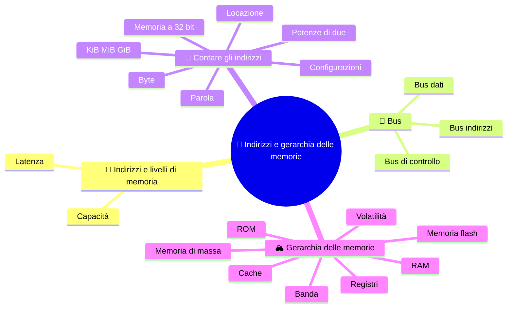

⬅️ [S4 - Il ciclo macchina](%28STU%29%203EI%20sett-ott%20S4%20-%20Il%20ciclo%20macchina.md) · 🏠 [Indice](%28STU%29%203EI%20-%20SETT-OTT.md) · [S6 - Cache localita e clock](%28STU%29%203EI%20sett-ott%20S6%20-%20Cache%20localita%20e%20clock.md) ➡️

# 🧮 Indirizzi e gerarchia delle memorie

**3EI · Settembre-Ottobre · S5 · Teoria**

> **Legenda:** ✅ da sapere · 🔍 per capire fino in fondo · 🤓 facoltativo, per curiosi · 🃏 flashcard: rispondi a voce, poi apri per controllare



## 🧭 Indirizzi e livelli di memoria

Nel [ciclo macchina](%28STU%29%203EI%20sett-ott%20S4%20-%20Il%20ciclo%20macchina.md) bastava scrivere «cella 40». Una macchina vera, però, deve scrivere quell'indirizzo con un numero limitato di bit e spostare il contenuto lungo collegamenti reali. Quanti posti riesce a distinguere? Quanto contengono? Quanto bisogna aspettare?

La crescita dei computer non ha cancellato queste domande. Memorie più grandi permettono programmi e dati più grandi, ma **capacità e velocità non crescono per forza insieme**. Costruire un sistema significa decidere come usare risorse limitate, non cercare un unico componente perfetto.

Un esempio storico lo rende evidente. Nei primi calcolatori, come l'EDSAC (1949), molti bit erano conservati in tubi pieni di mercurio, dove un impulso viaggiava come un'onda sonora: per leggere un bit bisognava **aspettare che l'onda passasse davanti** al punto giusto. La capacità c'era, ma l'attesa era lunga. Poi vennero i nuclei di ferrite e, infine, le memorie a semiconduttore. Il compromesso fra spazio, attesa e costo non è mai sparito.

## 🚌 Bus

### ✅ Dati, indirizzi e controllo

Un **bus** è un insieme di collegamenti usati per comunicare secondo regole precise. Nel nostro modello separiamo tre funzioni:

| Funzione | Domanda | Esempio di lettura |
|---|---|---|
| **Indirizzi** | Dove? | La CPU indica 40 |
| **Dati** | Quale contenuto? | La memoria restituisce 7 |
| **Controllo** | Quale operazione, e quando? | READ e segnale «dato pronto» |

In una scrittura il contenuto va dalla CPU alla memoria. I segnali di controllo non vanno tutti nella stessa direzione: la conferma «fatto» torna verso chi ha chiesto l'operazione.

È una separazione per funzioni. Un PC moderno può usare collegamenti punto-punto, seriali o condivisi nel tempo: non cercare sulla scheda madre tre fasci di fili identici al disegno.

<details>
<summary>🃏 <b>Che cos'è un bus?</b></summary>
Un insieme di collegamenti usati per comunicare secondo regole precise.
</details>
<details>
<summary>🃏 <b>Quali sono le tre funzioni del bus, e a quale domanda risponde ciascuna?</b></summary>
Indirizzi: dove? Dati: quale contenuto? Controllo: quale operazione, e quando?
</details>
<details>
<summary>🃏 <b>In una scrittura, in che direzione va il contenuto?</b></summary>
Dalla CPU alla memoria. La conferma di operazione completata torna invece verso chi l'ha richiesta.
</details>
<details>
<summary>🃏 <b>Sulla scheda madre ci sono tre fasci di fili, uno per funzione?</b></summary>
Non per forza. È una separazione per funzioni: un PC moderno può usare collegamenti punto-punto, seriali o condivisi nel tempo.
</details>

## 🔢 Contare gli indirizzi

### ✅ Bit e indirizzi

Un bit ha due configurazioni: 0 e 1. Due bit ne hanno quattro, tre bit otto. Ogni bit in più **raddoppia** le possibilità, perché davanti a ogni sequenza precedente possiamo mettere 0 oppure 1.

| Bit dell'indirizzo | Configurazioni | Indirizzi, partendo da zero |
|---|---|---|
| 1 | 2 | 0-1 |
| 2 | 4 | 0-3 |
| 3 | 8 | 0-7 |
| 4 | 16 | 0-15 |

Con $n$ bit di indirizzo distinguiamo:

$$N = 2^n\ \text{locazioni}$$

⚠️ Il numero di locazioni non è l'ultimo indirizzo: con 16 locazioni l'ultimo è 15. E non è ancora una capacità in byte: bisogna sapere quanto contiene ogni locazione.

<details>
<summary>🃏 <b>Perché ogni bit in più raddoppia le configurazioni?</b></summary>
Perché davanti a ogni sequenza precedente si può mettere 0 oppure 1.
</details>
<details>
<summary>🃏 <b>Con n bit di indirizzo, quante locazioni si distinguono?</b></summary>
2 elevato alla n.
</details>
<details>
<summary>🃏 <b>Con 2 elevato alla n locazioni, qual è l'ultimo indirizzo?</b></summary>
2 elevato alla n, meno 1, perché si parte da zero.
</details>
<details>
<summary>🃏 <b>Il numero di locazioni è già una capacità in byte?</b></summary>
No. Bisogna sapere quanto contiene ogni locazione.
</details>

### ✅ Esempio svolto: memoria indirizzata a byte

Qui ogni indirizzo identifica **un byte** (8 bit). Con 12 bit di indirizzo:

$$N = 2^{12} = 4096\ \text{locazioni}$$

$$C = 4096\ \text{locazioni} \times 1\ \frac{\text{byte}}{\text{locazione}} = 4096\ \text{byte} = 4\ \text{KiB}$$

Gli indirizzi vanno da 0 a 4095. Attenzione: questo è lo spazio **rappresentabile**, non la memoria effettivamente montata nel computer.

> ⏸️ **Fissaggio:** se aggiungi un bit all'indirizzo, quante locazioni diventano distinguibili? Spiegalo prima con le combinazioni, poi con la formula.

<details>
<summary>🃏 <b>Come si calcola la capacità di una memoria?</b></summary>
Numero di locazioni per byte contenuti in ogni locazione.
</details>
<details>
<summary>🃏 <b>Che cosa significa «memoria indirizzata a byte»?</b></summary>
Che ogni indirizzo identifica un byte, cioè 8 bit.
</details>
<details>
<summary>🃏 <b>Con 12 bit di indirizzo a byte, quanta memoria è rappresentabile?</b></summary>
4096 locazioni da un byte: 4096 byte, cioè 4 KiB, con indirizzi da 0 a 4095.
</details>
<details>
<summary>🃏 <b>Lo spazio rappresentabile è la RAM montata nel computer?</b></summary>
No. È quanto si può indirizzare nel modello, non quanta memoria è installata.
</details>

### 🔍 Byte, parole e unità

Un byte contiene 8 bit. Usiamo **KiB = 1024 byte**, **MiB = $2^{20}$ byte**, **GiB = $2^{30}$ byte**. I prefissi decimali kB, MB e GB indicano invece potenze di 1000. Non sono errori: sono convenzioni diverse, e vanno dichiarate.

Se ogni locazione contiene una **parola da 2 byte** e gli indirizzi sono di 12 bit, le locazioni restano 4096, ma la capacità diventa $4096\times2=8192$ byte, cioè 8 KiB. Stesso numero di indirizzi, diversa quantità per posizione.

La larghezza del bus dati dice quanto si trasferisce in un colpo; quella degli indirizzi dice quante posizioni si distinguono. Un bus dati da 16 bit **non** dimostra che ci siano solo $2^{16}$ byte di memoria. E «CPU a 64 bit» non ci dice, da solo, quante linee di indirizzo fisiche esistono.

<details>
<summary>🃏 <b>Quanti byte sono 1 KiB, 1 MiB e 1 GiB?</b></summary>
1 KiB = 1024 byte; 1 MiB = 2 elevato alla 20 byte; 1 GiB = 2 elevato alla 30 byte.
</details>
<details>
<summary>🃏 <b>Che differenza c'è fra KiB e kB?</b></summary>
KiB è una potenza di 2, 1024 byte; kB è una potenza di 10, 1000 byte. Sono convenzioni diverse da dichiarare.
</details>
<details>
<summary>🃏 <b>Se ogni locazione contiene una parola da 2 byte, che cosa cambia?</b></summary>
Il numero di indirizzi resta uguale, la capacità raddoppia.
</details>
<details>
<summary>🃏 <b>Bus dati e bus indirizzi: che cosa dice la larghezza di ciascuno?</b></summary>
Il bus dati dice quanto si trasferisce in un colpo; il bus indirizzi quante posizioni si distinguono.
</details>

### 🤓 Memoria a 32 bit

> In un modello a byte, $2^{32}$ indirizzi corrispondono a 4 GiB. Ma in una macchina reale entrano in gioco indirizzi fisici e virtuali, zone riservate ai dispositivi, limiti del processore e del sistema operativo. Non tutti gli indirizzi corrispondono a RAM installata. 💾 È per questo che, anni fa, molti PC con sistemi a 32 bit «vedevano» meno RAM di quella montata.
>
> La lezione di metodo vale anche senza conoscere questi meccanismi: **una formula è affidabile quando le sue ipotesi sono scritte chiaramente**.

<details>
<summary>🃏 <b>Quanta memoria indirizzano 32 bit in un modello a byte?</b></summary>
4 GiB.
</details>
<details>
<summary>🃏 <b>Perché molti PC a 32 bit vedevano meno RAM di quella montata?</b></summary>
Perché non tutti gli indirizzi corrispondono a RAM: entrano in gioco zone riservate ai dispositivi, indirizzi fisici e virtuali, limiti di processore e sistema operativo.
</details>
<details>
<summary>🃏 <b>Quando una formula è affidabile?</b></summary>
Quando le sue ipotesi sono scritte chiaramente.
</details>

## 🏔️ Gerarchia delle memorie

### ✅ Livelli e compromessi

La memoria ideale sarebbe enorme, velocissima, economica e capace di tenere i dati anche senza corrente. Le tecnologie reali obbligano a compromessi. Per questo un computer usa più livelli.

```text
REGISTRI     pochi valori usati subito dalla CPU
   |
CACHE        copie di pezzi utili della memoria principale
   |
RAM          programmi e dati attivi
   |
SSD / HDD    file e dati da conservare anche a macchina spenta
```

In generale, salendo verso i registri diminuiscono capacità e tempo di accesso, mentre aumenta il costo per bit. È un modello orientativo, non una scala con valori uguali per ogni dispositivo.

**Volatile** significa che la memoria ha bisogno di corrente per mantenere il contenuto: registri, cache e RAM sono volatili. SSD e HDD sono non volatili. ⚠️ La persistenza **non aumenta un po' alla volta** scendendo lungo i livelli: è una proprietà separata, da indicare a parte.

<details>
<summary>🃏 <b>Perché un computer usa più tipi di memoria?</b></summary>
Perché nessuna tecnologia è insieme enorme, velocissima, economica e capace di tenere i dati senza corrente: servono compromessi.
</details>
<details>
<summary>🃏 <b>Quali sono i livelli della gerarchia, dal più vicino alla CPU?</b></summary>
Registri, cache, RAM, memoria di massa come SSD e HDD.
</details>
<details>
<summary>🃏 <b>Salendo verso i registri, come cambiano capacità, tempo di accesso e costo?</b></summary>
Diminuiscono capacità e tempo di accesso, aumenta il costo per bit. È un modello orientativo.
</details>
<details>
<summary>🃏 <b>Che cosa significa «volatile»?</b></summary>
Che la memoria ha bisogno di corrente per mantenere il contenuto.
</details>
<details>
<summary>🃏 <b>Quali memorie sono volatili e quali no?</b></summary>
Registri, cache e RAM sono volatili; SSD e HDD non lo sono.
</details>
<details>
<summary>🃏 <b>La persistenza aumenta un po' alla volta scendendo nella gerarchia?</b></summary>
No. È una proprietà separata, da indicare a parte.
</details>

### 🔍 Capacità, latenza, banda

- **Capacità:** quanta informazione posso conservare (byte, GiB).
- **Latenza:** quanto aspetto per avere la risposta a un accesso (nanosecondi).
- **Banda:** quanta informazione posso trasferire ogni secondo (GB/s).
- **Costo per bit e consumo:** quante risorse servono per costruire e usare la memoria.

Un grande archivio può contenere moltissimi documenti ma richiedere tempo per trovare il primo. Un canale può trasferire tanti byte al secondo senza eliminare l'attesa iniziale. Dire solo «questa memoria è migliore» nasconde la vera domanda: **migliore per quale lavoro?**

Per lo stesso motivo, **più RAM non rende più veloce il processore**. Una RAM più grande permette di tenere pronti più programmi e dati, ma non cambia la velocità con cui la CPU calcola.

<details>
<summary>🃏 <b>Che cos'è la capacità di una memoria?</b></summary>
Quanta informazione può conservare, in byte o GiB.
</details>
<details>
<summary>🃏 <b>Che cos'è la latenza?</b></summary>
Quanto si aspetta per avere la risposta a un accesso, per esempio in nanosecondi.
</details>
<details>
<summary>🃏 <b>Che cos'è la banda?</b></summary>
Quanta informazione si può trasferire ogni secondo, per esempio in GB/s.
</details>
<details>
<summary>🃏 <b>Una banda alta elimina l'attesa iniziale?</b></summary>
No. Un canale può trasferire tanti byte al secondo e far comunque aspettare prima del primo.
</details>
<details>
<summary>🃏 <b>Che domanda nasconde «questa memoria è migliore»?</b></summary>
Migliore per quale lavoro?
</details>
<details>
<summary>🃏 <b>Più RAM rende più veloce il processore?</b></summary>
No. Più RAM permette di tenere pronti più programmi e dati, ma non cambia la velocità con cui la CPU calcola.
</details>

### 🔍 RAM, ROM e memoria di massa

La **RAM** principale permette di accedere direttamente a ogni posizione, leggendo e scrivendo durante il lavoro. La **memoria di massa** conserva file e programmi anche a computer spento; per eseguirli, il sistema porta in RAM le parti necessarie.

**ROM** significa memoria di sola lettura: nelle forme tradizionali il contenuto non si modifica durante l'uso normale. Oggi molto firmware sta in memoria **flash**, non volatile ma riscrivibile con procedure apposite. ROM e flash non sono «un gradino fra RAM e disco»: vanno descritte per tecnologia e ruolo. Firmware e avvio del computer li vedremo nel prossimo bimestre.

> 🔧 **Collegamento con il laboratorio:** nelle schede tecniche «16 GB di RAM» e «512 GB di SSD» descrivono risorse diverse. Sommarle e chiamarle «RAM disponibile» sarebbe sbagliato.

<details>
<summary>🃏 <b>Che cosa caratterizza la RAM principale?</b></summary>
Permette di accedere direttamente a ogni posizione, leggendo e scrivendo durante il lavoro.
</details>
<details>
<summary>🃏 <b>Per eseguire un programma salvato su SSD, che cosa fa il sistema?</b></summary>
Porta in RAM le parti necessarie.
</details>
<details>
<summary>🃏 <b>Che cosa significa ROM?</b></summary>
Memoria di sola lettura: nelle forme tradizionali il contenuto non si modifica durante l'uso normale.
</details>
<details>
<summary>🃏 <b>Dove sta oggi molto firmware?</b></summary>
In memoria flash: non volatile, ma riscrivibile con procedure apposite.
</details>
<details>
<summary>🃏 <b>16 GB di RAM e 512 GB di SSD fanno 528 GB di RAM?</b></summary>
No. Descrivono risorse diverse e non vanno sommate.
</details>

## 🧩 Metti alla prova il modello

1. **Base.** Distingui capacità, latenza e volatilità con una frase ciascuna.
2. **Applicazione.** Un modello ha 10 bit di indirizzo e locazioni da un byte. Calcola locazioni, capacità e ultimo indirizzo.
3. **Dettaglio.** Ripeti il calcolo con gli stessi 10 bit ma locazioni da 2 byte. Che cosa cambia?
4. **Applicazione.** Con 16 bit di indirizzo a byte, quanti KiB sono rappresentabili? Il risultato dimostra quanta RAM è installata?
5. **Collegamento.** Perché una cache più grande non diventa automaticamente una memoria non volatile?
6. **Intuizione.** Per leggere MEM[40] = 7, quale informazione viaggia come indirizzo, quale come controllo e quale come contenuto?

**🚪 Uscita:** completa «$2^n$ conta ..., per ottenere i byte devo sapere ...».

**🏠 Facoltativo:** leggi due capacità su una scheda tecnica e spiega quali risorse descrivono, senza confrontare prodotti solo in base al numero più grande.

## 📚 Fonti e risorse

- [NIST - Prefixes for binary multiples](https://physics.nist.gov/cuu/Units/binary.html) (in inglese): la tabella ufficiale per distinguere KiB/MiB/GiB da kB/MB/GB, con la storia della confusione fra i due sistemi.
- [Nand2Tetris - Project 3](https://www.nand2tetris.org/project03) (in inglese, per curiosi): come si costruisce una memoria didattica fatta di indirizzi e celle.

---

⬅️ [S4 - Il ciclo macchina](%28STU%29%203EI%20sett-ott%20S4%20-%20Il%20ciclo%20macchina.md) · 🏠 [Indice](%28STU%29%203EI%20-%20SETT-OTT.md) · [S6 - Cache localita e clock](%28STU%29%203EI%20sett-ott%20S6%20-%20Cache%20localita%20e%20clock.md) ➡️
