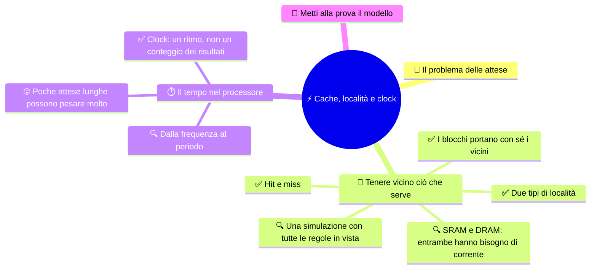

# ⚡ Cache, località e clock

**3EI · Settembre-Ottobre · S6 · Teoria**

> **Legenda:** ✅ da sapere · 🔍 per capire fino in fondo · 🤓 facoltativo, per curiosi · 🃏 flashcard: rispondi a voce, poi apri per controllare



## 🧭 Il problema delle attese

Nel Novecento non è cresciuta solo la velocità di calcolo: è cresciuta anche la quantità di informazioni che chiediamo alle macchine di trattare. Un processore veloce non elimina il tempo che serve per raggiungere quelle informazioni. Dalla [gerarchia delle memorie](%28STU%29%203EI%20sett-ott%20S5%20-%20Indirizzi%20e%20gerarchia%20delle%20memorie.md) nasce una domanda: possiamo evitare di fare ogni volta la strada più lenta?

Quando studi tieni sul tavolo alcune pagine: non porti tutta la biblioteca vicino alla penna. 📚 Funziona perché non usi tutti i libri con la stessa probabilità. Anche molti programmi hanno regolarità: è questo il motivo della cache, non una capacità magica della CPU di prevedere il futuro.

## 🎯 Tenere vicino ciò che serve

### ✅ Hit e miss

La **cache** conserva copie di pezzi della memoria principale vicino al processore. Se il contenuto richiesto è già nel livello consultato si ha un **hit**; se manca, un **miss**. Allora il sistema deve cercarlo al livello successivo, con un'attesa in più.

```text
richiesta della CPU
       |
       v
contenuto in cache? -- SI --> hit: usa la copia disponibile
       |
       NO
       v
miss: recupera dal livello successivo e aggiorna la cache
```

Un miss **non è un errore del programma**: è un evento previsto. La cache è piccola, quindi non può contenere tutto e a volte deve buttare fuori contenuti vecchi. Nei processori comuni tutto questo è gestito dall'hardware: non scegliamo noi ogni trasferimento.

<details>
<summary>🃏 Che cos'è la cache?</summary>
Una memoria che conserva copie di pezzi della memoria principale vicino al processore.
</details>

<details>
<summary>🃏 Che differenza c'è fra hit e miss?</summary>
Hit: il contenuto richiesto è già nel livello consultato. Miss: manca, e bisogna cercarlo al livello successivo, con un'attesa in più.
</details>

<details>
<summary>🃏 Un miss è un errore del programma?</summary>
No. È un evento previsto: la cache è piccola e non può contenere tutto.
</details>

<details>
<summary>🃏 Chi decide che cosa entra in cache?</summary>
Nei processori comuni l'hardware: non si sceglie a mano ogni trasferimento.
</details>

### ✅ Due tipi di località

**Località temporale:** un contenuto usato da poco può servire di nuovo presto. Per esempio, un programma ripete le istruzioni di un ciclo, o torna più volte sullo stesso valore.

**Località spaziale:** dopo un indirizzo possono servire quelli vicini. Se gli elementi di una sequenza sono in celle consecutive e li visitiamo in ordine, leggere un blocco che ne contiene diversi evita attese successive.

I programmi non rispettano sempre queste regolarità. Accessi sparsi su tanti indirizzi lontani sfruttano poco la cache. E ripetere un accesso non garantisce un hit: il contenuto potrebbe essere stato sostituito nel frattempo.

<details>
<summary>🃏 Che cos'è la località temporale?</summary>
Un contenuto usato da poco può servire di nuovo presto, come le istruzioni di un ciclo.
</details>

<details>
<summary>🃏 Che cos'è la località spaziale?</summary>
Dopo un indirizzo possono servire quelli vicini, come gli elementi consecutivi di una sequenza visitati in ordine.
</details>

<details>
<summary>🃏 Tutti i programmi sfruttano bene la cache?</summary>
No. Accessi sparsi su tanti indirizzi lontani la sfruttano poco.
</details>

<details>
<summary>🃏 Rileggere un dato garantisce un hit?</summary>
No. Il contenuto potrebbe essere stato sostituito nel frattempo.
</details>

### ✅ I blocchi portano con sé i vicini

La cache è organizzata in **linee**, che contengono blocchi di posizioni consecutive. Portare nella cache, insieme al valore richiesto, anche i suoi vicini sfrutta la località spaziale. Attenzione a non confondere la dimensione di una linea con la capacità totale della cache.

In una simulazione con blocchi da quattro indirizzi, una richiesta all'indirizzo 8 può portare in cache tutto il blocco 8-11. Una richiesta successiva a 9 può trovare già il dato, anche se 9 non era mai stato chiesto.

<details>
<summary>🃏 Che cos'è una linea di cache?</summary>
Uno spazio della cache che contiene un blocco di posizioni consecutive.
</details>

<details>
<summary>🃏 Perché si trasferisce un blocco intero e non solo il valore richiesto?</summary>
Per sfruttare la località spaziale: i vicini del valore richiesto potrebbero servire subito dopo.
</details>

<details>
<summary>🃏 Dimensione della linea e capacità della cache sono la stessa cosa?</summary>
No. La linea è un singolo spazio; la capacità è lo spazio totale della cache.
</details>

<details>
<summary>🃏 Come si può avere un hit su un indirizzo mai richiesto?</summary>
Se un accesso precedente ha portato in cache il blocco che lo contiene.
</details>

### 🔍 Una simulazione con tutte le regole in vista

La nostra cache di carta:

- all'inizio è **vuota**;
- ha **due linee**;
- ogni linea contiene un blocco di **quattro posizioni**: 0-3, 4-7, 8-11, ...;
- qualsiasi blocco può andare in una linea libera;
- se entrambe le linee sono occupate, si butta fuori il blocco **caricato da più tempo** (regola FIFO, *first in, first out*);
- un hit **non** cambia quest'ordine;
- consideriamo solo letture; tutti i dati sono disponibili in RAM.

Sequenza di letture: **8, 9, 8, 12, 13, 16, 8**.

| Accesso | Esito | Blocchi in cache dopo l'accesso, dal più vecchio | Motivo |
|---|---|---|---|
| 8 | Miss | 8-11 | Cache vuota |
| 9 | Hit | 8-11 | Già nel blocco |
| 8 | Hit | 8-11 | Ancora presente |
| 12 | Miss | 8-11; 12-15 | Si riempie la seconda linea |
| 13 | Hit | 8-11; 12-15 | Stesso blocco di 12 |
| 16 | Miss | 12-15; 16-19 | Esce il blocco 8-11, il più vecchio |
| 8 | Miss | 16-19; 8-11 | Il blocco richiesto non c'è più |

Risultato: **3 hit e 4 miss**. L'ultimo accesso mostra che «già letto una volta» e «ancora presente» non sono la stessa cosa. È una cache didattica con regole scelte da noi; le cache reali usano organizzazioni e politiche diverse.

<details>
<summary>🃏 Perché una simulazione della cache deve dichiarare le regole?</summary>
Perché hit e miss dipendono da capacità, dimensione dei blocchi, stato iniziale e regola di sostituzione.
</details>

<details>
<summary>🃏 Che cosa dice la regola FIFO?</summary>
First in, first out: quando la cache è piena si butta fuori il blocco caricato da più tempo.
</details>

<details>
<summary>🃏 Con la regola FIFO, un hit cambia l'ordine dei blocchi?</summary>
No. Conta solo l'ordine in cui i blocchi sono stati caricati.
</details>

<details>
<summary>🃏 «Già letto una volta» significa «ancora in cache»?</summary>
No. Il blocco può essere stato sostituito, come succede all'ultimo accesso dell'esempio.
</details>

### 🔍 SRAM e DRAM: entrambe hanno bisogno di corrente

La **SRAM** conserva ogni bit con un circuito stabile finché è alimentata. Non ha bisogno di «rinfrescare» le celle come la DRAM, ma occupa più spazio per bit: per questo si usa nelle cache. ⚠️ «Static» non significa non volatile.

La **DRAM** memorizza il bit come carica elettrica in un minuscolo condensatore. La carica si disperde, quindi serve un **refresh** periodico. Le celle sono molto piccole e fitte: per questo la DRAM si usa per la memoria principale. Il refresh mantiene l'informazione fisica: non ha niente a che vedere con l'aggiornamento di un programma.

Le cache sono spesso divise in livelli **L1, L2 e L3**: L1 è di solito la più piccola e veloce, i livelli successivi sono più capienti. Quanti livelli ci sono e come si dividono fra i core dipende dal processore. Non esistono valori universali di dimensione o latenza da imparare a memoria.

<details>
<summary>🃏 Come conserva i bit la SRAM, e dove si usa?</summary>
Con un circuito stabile finché è alimentata, senza refresh; occupa più spazio per bit e si usa nelle cache.
</details>

<details>
<summary>🃏 La SRAM è non volatile?</summary>
No. Static non significa non volatile: senza corrente perde i dati.
</details>

<details>
<summary>🃏 Come conserva i bit la DRAM, e dove si usa?</summary>
Come carica elettrica in minuscoli condensatori; le celle sono piccole e fitte, per questo si usa nella memoria principale.
</details>

<details>
<summary>🃏 Che cos'è il refresh della DRAM?</summary>
Un rinfresco periodico delle celle, perché la carica si disperde. Mantiene l'informazione fisica; non c'entra con l'aggiornamento dei programmi.
</details>

<details>
<summary>🃏 Che cosa sono L1, L2 e L3?</summary>
Livelli di cache: L1 di solito è la più piccola e veloce, i livelli successivi sono più capienti. Numero e condivisione dipendono dal processore.
</details>

## ⏱️ Il tempo nel processore

### ✅ Clock: un ritmo, non un conteggio dei risultati

Il **clock** è un segnale periodico che dà il tempo ai circuiti sincroni. La frequenza conta i cicli al secondo: 2 GHz significa due miliardi di cicli al secondo, **non per forza due miliardi di istruzioni completate**.

Un'operazione può richiedere più passi, e un'attesa della memoria può consumare tempo senza produrre nuovi risultati. Per confrontare due sistemi bisogna guardare il lavoro svolto e il tempo impiegato, non solo i GHz scritti sulla scatola.

> ⏸️ **Fissaggio:** abbina «istruzioni ripetute» e «posizioni vicine visitate in ordine» ai due tipi di località. Poi spiega perché un clock più veloce non rende la cache infinita.

<details>
<summary>🃏 Che cos'è il clock?</summary>
Un segnale periodico che dà il tempo ai circuiti sincroni.
</details>

<details>
<summary>🃏 Che cosa misura la frequenza del clock?</summary>
I cicli al secondo, in hertz: 2 GHz sono due miliardi di cicli al secondo.
</details>

<details>
<summary>🃏 2 GHz significa due miliardi di istruzioni completate al secondo?</summary>
No. Un'operazione può richiedere più passi e le attese della memoria consumano tempo senza produrre risultati.
</details>

<details>
<summary>🃏 Come si confrontano davvero due sistemi?</summary>
Guardando il lavoro svolto e il tempo impiegato, non solo i GHz.
</details>

### 🔍 Dalla frequenza al periodo

Se la frequenza è $f$, la durata di un ciclo (periodo) è:

$$T = \frac{1}{f}$$

Per $f=2\,\text{GHz}=2\times10^9\,\text{Hz}$:

$$T = 0{,}5\times10^{-9}\,\text{s}=0{,}5\,\text{ns}$$

Questo valore descrive un ciclo di clock. Per ricavare il tempo di un intero programma mancano altre informazioni, che vedremo a novembre-dicembre. Due CPU con la stessa frequenza non eseguono per forza un programma nello stesso tempo.

> 🔧 **Collegamento con il laboratorio:** «cache 12 MB» nella scheda di una CPU e «RAM 16 GB» nella scheda del PC non sono due quantità dello stesso spazio di lavoro. La cache riduce alcune attese; più RAM permette di tenere attivi più dati. Risolvono problemi diversi.

<details>
<summary>🃏 Che relazione c'è fra frequenza e periodo?</summary>
Il periodo è l'inverso della frequenza: T = 1 / f.
</details>

<details>
<summary>🃏 Quanto dura un ciclo a 2 GHz?</summary>
0,5 nanosecondi.
</details>

<details>
<summary>🃏 Dal periodo si ricava il tempo di un programma?</summary>
No, mancano altre informazioni. Due CPU con la stessa frequenza non eseguono per forza un programma nello stesso tempo.
</details>

<details>
<summary>🃏 Cache da 12 MB e RAM da 16 GB sono lo stesso tipo di risorsa?</summary>
No. La cache riduce alcune attese, più RAM permette di tenere attivi più dati.
</details>

### 🤓 Poche attese lunghe possono pesare molto

> In un modello a due livelli, se ogni accesso paga il tempo di consultazione della cache e solo i miss pagano una penalità **aggiuntiva**, il tempo medio di accesso è:
>
> $$AMAT = t_{hit} + p_{miss}\times t_{penalità}$$
>
> Con consultazione da 2 ns, probabilità di miss del 5% e penalità aggiuntiva di 50 ns:
>
> $$AMAT=2+0{,}05\times50=4{,}5\,\text{ns}$$
>
> Non vuol dire che ogni accesso duri 4,5 ns: è una media. Un hit costa 2 ns, un miss 52 ns. Basta un 5% di miss per più che raddoppiare il tempo medio!
>
> Un'altra idea per usare meglio il tempo è sovrapporre le fasi di istruzioni diverse, come in una catena di montaggio 🏭: si chiama **pipeline** e la studieremo nel prossimo bimestre.

<details>
<summary>🃏 Che cosa misura l'AMAT?</summary>
Il tempo medio di accesso alla memoria: tempo di consultazione della cache più probabilità di miss per penalità aggiuntiva.
</details>

<details>
<summary>🃏 Un AMAT di 4,5 ns significa che ogni accesso dura 4,5 ns?</summary>
No. È una media fra hit veloci e miss molto più lenti.
</details>

<details>
<summary>🃏 Che cos'è, a grandi linee, una pipeline?</summary>
Sovrapporre le fasi di istruzioni diverse, come in una catena di montaggio. La studieremo nel prossimo bimestre.
</details>

## 🧩 Metti alla prova il modello

1. **Base.** Che cosa distinguono hit e miss? Un miss significa che la RAM ha perso il dato?
2. **Applicazione.** Tornare sulla stessa posizione dopo poco tempo e visitare posizioni consecutive: quale località mostra ciascun comportamento?
3. **Procedimento.** Riparti con la cache didattica vuota e applica tutte le regole alla sequenza **0, 1, 4, 0, 8, 0**. Annota hit/miss e blocchi presenti dopo ogni accesso.
4. **Dettaglio.** Perché la SRAM non è una memoria non volatile? A che cosa serve il refresh della DRAM?
5. **Dettaglio.** Un clock da 4 GHz ha quale periodo? Basta questo per sapere quante istruzioni esegue in un secondo?
6. **Intuizione.** Se un programma usa una sola volta tanti indirizzi lontani fra loro, possiamo garantire un grande vantaggio dalla cache?

**🚪 Uscita:** spiega come si può avere un hit su un indirizzo mai richiesto prima.

**🏠 Facoltativo:** inventa una sequenza che sfrutti la località temporale e una che sfrutti quella spaziale, dichiarando le regole della cache.

## 📚 Fonti e risorse

- [Cornell CS3410 - Caches](https://www.cs.cornell.edu/courses/cs3410/2024fa/notes/caches.html) (in inglese, livello universitario): per chi vuole approfondire località, blocchi e organizzazione delle cache. Le prime sezioni (*Memory Bottleneck*, *SRAM vs DRAM*, *Locality*) sono le più accessibili.
- [NIST - SI prefixes](https://physics.nist.gov/cuu/Units/prefixes.html) (in inglese): tabella dei prefissi giga, nano e simili, utile per le conversioni fra Hz e secondi.

---

[⬅️ S5 - Indirizzi e gerarchia delle memorie](%28STU%29%203EI%20sett-ott%20S5%20-%20Indirizzi%20e%20gerarchia%20delle%20memorie.md) · [🗺️ Indice](%28STU%29%203EI%20-%20SETT-OTT.md) · [S7 - Ricostruire la macchina ➡️](%28STU%29%203EI%20sett-ott%20S7%20-%20Ricostruire%20la%20macchina.md)
