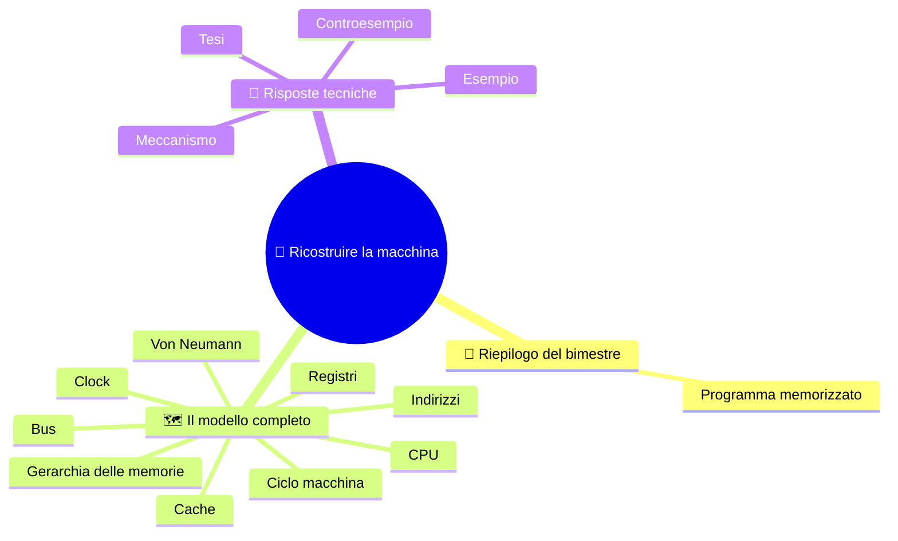

# 🧠 Ricostruire la macchina

**3EI · Settembre-Ottobre · S7 · Ripasso**

> **Legenda:** ✅ da sapere · 🔍 per capire fino in fondo · 🤓 facoltativo, per curiosi · 🃏 flashcard: rispondi a voce, poi apri per controllare



## 🧭 Riepilogo del bimestre

All'inizio ci siamo chiesti: come fa una macchina a svolgere compiti diversi senza essere ricostruita ogni volta? Ora sappiamo che non basta rispondere «con un programma». Bisogna conservare le istruzioni, raggiungerle, interpretarle, spostare i dati e tenere i risultati.

La storia del computer si può rileggere come una catena di problemi collegati: rendere i circuiti affidabili e piccoli, memorizzare i programmi, coordinare le operazioni, ridurre le attese. Questo ripasso ricostruisce quei collegamenti. **Non aggiunge argomenti nuovi.**

## 🗺️ Il modello completo

### ✅ Mappa del modello

```text
PROGRAMMA: istruzioni codificate, conservate in memoria
    |
    v
CPU: CU coordina; ALU calcola; registri conservano valori
    |
    +---- FETCH -> DECODE -> EXECUTE -> istruzione successiva
    |        |
    |        +-- PC, IR, MAR, MDR hanno compiti distinti
    |
    +---- indirizzi, dati, controllo collegano CPU e memoria
    |
    +---- registri / cache / RAM / memoria di massa
              attese, capacita', costo e persistenza

INPUT porta informazioni nel sistema; OUTPUT le restituisce
```

- Nel modello di **Von Neumann** istruzioni e dati stanno nella stessa memoria.
- La **CPU** non è solo l'ALU: serve chi coordina (CU) e servono posti dove tenere lo stato del lavoro (registri).
- Il **PC** indica dove prendere la prossima istruzione; l'**IR** tiene l'istruzione corrente. Il **MAR** contiene l'indirizzo dell'accesso in corso; l'**MDR** il contenuto trasferito.
- Una **copia** lascia intatto il valore originale.
- Con $n$ bit si distinguono $2^n$ indirizzi. Per la capacità si moltiplica per i byte di ogni locazione.
- La **cache** conserva copie e sfrutta la località temporale e spaziale. Un miss richiede un accesso al livello successivo: non è un guasto e non significa «vado sul disco».

<details>
<summary>🃏 Che cosa conserva la memoria nel modello di Von Neumann?</summary>
Istruzioni e dati, nella stessa memoria.
</details>

<details>
<summary>🃏 Da quali parti è fatta la CPU, e che cosa fa ciascuna?</summary>
CU coordina, ALU calcola, registri conservano i valori del lavoro in corso.
</details>

<details>
<summary>🃏 Quali sono le fasi del ciclo macchina?</summary>
Fetch, decode, execute, poi si passa all'istruzione successiva.
</details>

<details>
<summary>🃏 PC, IR, MAR, MDR: un ruolo per ciascuno.</summary>
PC: dove prendere la prossima istruzione. IR: istruzione corrente. MAR: indirizzo dell'accesso in corso. MDR: contenuto trasferito.
</details>

<details>
<summary>🃏 Quali sono le tre funzioni dei collegamenti fra CPU e memoria?</summary>
Indirizzi, dati e controllo.
</details>

<details>
<summary>🃏 Che cosa succede alla sorgente dopo una copia?</summary>
Resta intatta, salvo un'altra operazione che la modifichi.
</details>

<details>
<summary>🃏 Come si calcola la capacità di una memoria con n bit di indirizzo?</summary>
2 elevato alla n locazioni, per i byte contenuti in ogni locazione.
</details>

<details>
<summary>🃏 Quali sono i livelli della gerarchia delle memorie?</summary>
Registri, cache, RAM, memoria di massa. Differiscono per attese, capacità e costo; la persistenza è una proprietà a parte.
</details>

<details>
<summary>🃏 Su quali regolarità si basa la cache?</summary>
Sulla località temporale e sulla località spaziale.
</details>

<details>
<summary>🃏 Un miss significa «vado sul disco»?</summary>
No. Significa accedere al livello successivo, e non è un guasto.
</details>

### ✅ Tre domande di controllo

Quando segui un'istruzione chiediti: **dove siamo?**, **che cosa abbiamo letto?**, **che cosa cambia davvero?** Dire il nome di un registro senza il suo ruolo non basta. Dire che una memoria è «grande» non dice quanto è veloce o se tiene i dati senza corrente.

<details>
<summary>🃏 Quali tre domande aiutano a seguire un'istruzione?</summary>
Dove siamo? Che cosa abbiamo letto? Che cosa cambia davvero?
</details>

<details>
<summary>🃏 Basta dire il nome di un registro?</summary>
No. Bisogna dire anche il suo ruolo in quel momento.
</details>

<details>
<summary>🃏 «Questa memoria è grande» dice anche che è veloce?</summary>
No. Capacità, velocità e persistenza sono proprietà diverse.
</details>

## 🔧 Risposte tecniche

### 🔍 Tesi, meccanismo, esempio

Una buona risposta tecnica ha una **tesi**, un **meccanismo** e un **esempio**. «La cache è veloce» è una proprietà generica. «Se un blocco è già in cache, l'accesso può evitare l'attesa del livello successivo» descrive un meccanismo, con una condizione che si può controllare.

Anche una formula va raccontata. Con 9 bit di indirizzo a byte si distinguono $2^9=512$ locazioni: la memoria contiene 512 byte, non 512 bit, e l'ultimo indirizzo è 511. Se ogni locazione contenesse due byte, cambierebbe la capacità, non il numero di indirizzi.

<details>
<summary>🃏 Da quali tre parti è fatta una buona risposta tecnica?</summary>
Una tesi, un meccanismo e un esempio.
</details>

<details>
<summary>🃏 Perché «la cache è veloce» è una risposta debole?</summary>
È una proprietà generica. Va detto il meccanismo, con una condizione controllabile: se il blocco è già in cache, si evita l'attesa del livello successivo.
</details>

<details>
<summary>🃏 Anche una formula va «raccontata»?</summary>
Sì: bisogna dire che cosa contano i simboli, con quali unità e sotto quali ipotesi.
</details>

### 🔍 Quattro esercizi di collegamento

Rispondi in poche righe, con uno schema quando serve.

| Esercizio | Consegna |
|---|---|
| **A. Sistema** 🏛️ | Disegnate CPU, memoria e I/O; mettete CU, ALU e registri al posto giusto. Etichettate le tre funzioni dei collegamenti. |
| **B. Percorso** 🔄 | PC = 5, MEM[5] = `LOAD R1, [70]`, MEM[70] = 6. Quali due indirizzi usa il MAR, in ordine? Che cosa contiene R1 alla fine? |
| **C. Dimensioni** 🧮 | 8 bit di indirizzo, 2 byte per locazione: quante posizioni, quanti byte, quale ultimo indirizzo? |
| **D. Compromessi** ⚖️ | Confrontate cache, RAM e SSD per ruolo, volatilità e capacità tipica. Spiegate perché non sono intercambiabili. |

Nell'esercizio B usiamo le regole di S4: una cella per ogni istruzione e PC che aumenta di uno dopo il fetch.

> 🔧 **Collegamento con il laboratorio:** riconoscere una RAM o leggere una scheda tecnica diventa utile quando sai spiegare quale problema risolve quel componente. Ma lo schema funzionale non è una foto della scheda madre: la CU non è una scheda da cercare vicino al processore.

<details>
<summary>🃏 Lo schema funzionale è una fotografia della scheda madre?</summary>
No. Mostra i ruoli: per esempio la CU non è una scheda da cercare vicino al processore.
</details>

### 🤓 Controesempi

> Nella scienza una regola diventa più precisa quando cerchiamo dove smette di funzionare. Scegli una frase: «più GHz significa sempre meno tempo» oppure «un dato usato prima sarà in cache». Costruisci una situazione che mostri quale condizione manca.
>
> Non serve conoscere una CPU particolare: bastano le idee di attesa e di spazio limitato.

<details>
<summary>🃏 A che cosa serve cercare un controesempio?</summary>
A capire dove una regola smette di funzionare, e quindi a renderla più precisa.
</details>

<details>
<summary>🃏 Quali due idee bastano per trovare controesempi su GHz e cache?</summary>
L'attesa e lo spazio limitato.
</details>

## 🧩 Metti alla prova il modello

### 📝 Prova di allenamento

Tempo indicativo: 30 minuti, prima da solo. Non sono richiesti AMAT, pipeline, CISC/RISC o procedure di avvio. Gli esercizi mescolano di proposito argomenti diversi: per esercitarti meglio, non rispondere nell'ordine in cui li hai studiati, ma parti da quello in cui ti senti meno sicuro e torna poi ai primi.

1. **Sistema.** Disegna il modello di Von Neumann. Spiega perché memorizzare le istruzioni permette di cambiare compito senza ricostruire l'hardware.
2. **Registri.** Distingui PC, IR, MAR e MDR. Perché l'MDR può cambiare durante una `LOAD` senza sostituire l'istruzione nell'IR?
3. **Traccia.** Esegui il programma qui sotto e indica PC, R1, R3, MEM[60] e MEM[61] subito dopo la `STORE`, prima di eseguire `HALT`. Regole: il PC aumenta di uno dopo ogni fetch; ogni cella contiene un'intera istruzione o un intero; PC parte da 20, R2 da 3, gli altri registri generali da 0.

| Indirizzo | Contenuto iniziale |
|---|---|
| 20 | `LOAD R1, [60]` |
| 21 | `ADD R3, R1, R2` |
| 22 | `STORE [61], R3` |
| 23 | `HALT` |
| 60 | 8 |
| 61 | 0 |

`LOAD` copia dalla memoria al registro; `ADD` scrive la somma solo nel registro destinazione; `STORE` copia il registro in memoria; `HALT` termina la simulazione.

4. **Indirizzi.** Calcola numero di locazioni, byte, KiB e ultimo indirizzo di una memoria indirizzata a byte con 11 bit di indirizzo. Scrivi il procedimento.
5. **Cache.** Cache inizialmente vuota con **una sola linea**; blocchi da quattro posizioni (0-3, 4-7, 8-11, ...). Ogni miss sostituisce la linea con il blocco richiesto, preso dalla RAM. Per la sequenza **4, 5, 8, 4** indica hit/miss e blocco presente dopo ogni accesso.
6. **Spiegazione.** Correggi motivando: «la SRAM non ha bisogno di refresh, quindi mantiene i dati senza corrente»; «3 GHz significa tre miliardi di istruzioni completate al secondo».

### ✍️ Correggere un errore senza cancellarlo

Dopo il confronto in classe, scegli un punto da migliorare. Non cambiare solo un numero: scrivi quale passaggio del ragionamento deve cambiare.

| La mia risposta | Il passaggio da rivedere | La regola corretta | Un nuovo esempio |
|---|---|---|---|
| … | … | … | … |

**🚪 Uscita:** scrivi una relazione che sai spiegare bene e una che vuoi ancora chiarire.

**🏠 Facoltativo:** prepara una pagina di ripasso con un disegno della macchina, un calcolo di capacità e un esempio di località.

## 📚 Fonti e risorse

Per ripassare, torna alle dispense del bimestre:

- [Il ciclo macchina](%28STU%29%203EI%20sett-ott%20S4%20-%20Il%20ciclo%20macchina.md): come cambia lo stato durante una traccia.
- [Indirizzi e gerarchia delle memorie](%28STU%29%203EI%20sett-ott%20S5%20-%20Indirizzi%20e%20gerarchia%20delle%20memorie.md): unità di misura e proprietà delle memorie.
- [Cache, località e clock](%28STU%29%203EI%20sett-ott%20S6%20-%20Cache%20localita%20e%20clock.md): regole della simulazione della cache.

---

[⬅️ S6 - Cache, località e clock](%28STU%29%203EI%20sett-ott%20S6%20-%20Cache%20localita%20e%20clock.md) · [🗺️ Indice](%28STU%29%203EI%20-%20SETT-OTT.md)
