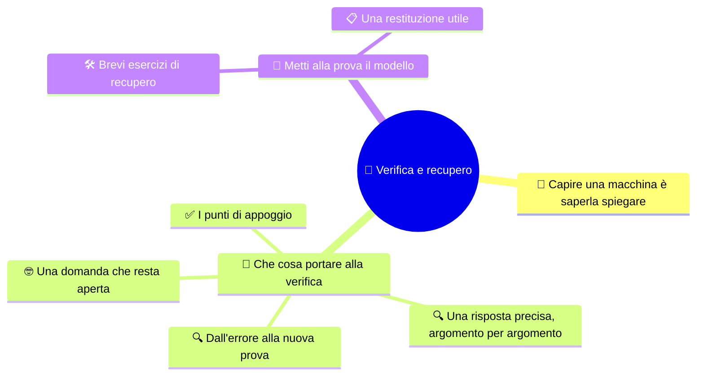

# 🎯 Verifica e recupero

**3EI · Settembre-Ottobre · S8 · Verifica**

> **Legenda:** ✅ da sapere · 🔍 per capire fino in fondo · 🤓 facoltativo, per curiosi · 🃏 flashcard: rispondi a voce, poi apri per controllare

## 🧭 Capire una macchina è saperla spiegare

Sapere un nome è un inizio. Aver capito significa usarlo per spiegare: dove si trova un'istruzione, perché cambia un registro, che cosa rappresenta un numero, perché il processore a volte aspetta. La verifica chiude questo primo percorso e prepara una domanda per il prossimo: **come si può usare meglio il tempo di esecuzione?**

Il risultato utile non è solo un voto. È anche capire se un errore nasce da un concetto mancante o da un calcolo sbagliato, e avere un modo concreto per correggerlo.

## 🧱 Che cosa portare alla verifica

### ✅ I punti di appoggio

- Il modello di **Von Neumann** collega CPU, memoria e input/output e tiene istruzioni e dati nella stessa memoria.
- La **CPU** comprende unità di controllo, ALU e registri: coordinare, calcolare e conservare sono compiti diversi.
- Nel **ciclo macchina** si preleva un'istruzione, la si interpreta e la si esegue.
- **Indirizzo** e **contenuto** non sono la stessa cosa. In ogni trasferimento devono essere chiari la posizione, il dato e il comando di lettura o scrittura.
- I bit dell'indirizzo dicono **quante posizioni** si distinguono; la dimensione di ogni posizione dice **quanta informazione** contiene la memoria.
- Registri, cache, RAM e memoria di massa hanno ruoli, capacità e tempi diversi. La persistenza è una proprietà a parte.
- La **cache** riduce alcune attese grazie alla località. Il **clock** dà il ritmo, ma la frequenza da sola non misura il lavoro utile.

Queste sono le basi del bimestre. Gli esercizi di recupero in fondo ti aiutano a controllare se sai **usarle**, non solo riconoscerle in una frase.

📌 Gli approfondimenti facoltativi delle dispense, compresa la formula AMAT, **non sono richiesti nella verifica di ottobre**. Nemmeno pipeline, hazard, CISC/RISC o procedure di avvio.

🃏 Che cosa collega il modello di Von Neumann?

CPU, memoria e input/output; istruzioni e dati stanno nella stessa memoria.

🃏 Perché CU, ALU e registri sono tre parti diverse?

Perché coordinare, calcolare e conservare sono compiti diversi.

🃏 Che cosa serve per ogni trasferimento con la memoria?

La posizione, cioè l'indirizzo; il dato; il comando di lettura o scrittura.

🃏 Che cosa dicono i bit dell'indirizzo, e che cosa la dimensione della locazione?

I bit dell'indirizzo dicono quante posizioni si distinguono; la dimensione della locazione quanta informazione contiene ciascuna.

🃏 Registri, cache, RAM e memoria di massa sono nomi diversi della stessa cosa?

No. Hanno ruoli, capacità e tempi diversi; la persistenza è una proprietà a parte.

🃏 Il clock misura il lavoro utile?

No. Dà il ritmo ai circuiti; la frequenza da sola non misura il lavoro completato.

🃏 Che cosa non è richiesto nella verifica di ottobre?

Gli approfondimenti facoltativi, compresa la formula AMAT, e poi pipeline, hazard, CISC/RISC e procedure di avvio.

### 🔍 Una risposta precisa, argomento per argomento

| Argomento | Segno di una comprensione completa |
|---|---|
| Modello | Blocchi al posto giusto, funzioni e collegamenti spiegati |
| Registri | PC/IR e MAR/MDR distinti anche durante una sequenza |
| Ciclo | Stato iniziale scritto e modifiche solo dove previste |
| Indirizzi | Potenza di due, dimensione della locazione, unità e ultimo indirizzo |
| Memorie | Capacità, latenza e volatilità non confuse |
| Cache | Esiti motivati usando blocchi, capacità e regole dichiarate |
| Clock | Frequenza e periodo distinti; nessuna equivalenza automatica con istruzioni al secondo |

Nelle simulazioni leggi **prima** le regole. Un PC che aumenta di uno ha senso se ogni istruzione occupa una cella. Una traccia della cache ha una sola soluzione solo se sappiamo come è organizzata. Usare bene un modello non significa pensare che ogni computer reale segua esattamente le stesse regole.

> 🔧 **Collegamento con il laboratorio:** le osservazioni sui componenti e sulle schede tecniche possono darti buoni esempi. La verifica però riguarda la teoria: non chiede montaggi, configurazioni o relazioni di laboratorio.

🃏 In una traccia, che cosa va scritto prima di tutto?

Lo stato iniziale; poi le modifiche solo dove un'istruzione le prevede.

🃏 In un calcolo di capacità, che cosa non deve mancare?

La potenza di due, la dimensione della locazione, le unità e l'ultimo indirizzo.

🃏 Che cosa rende completa una risposta sulla cache?

Esiti motivati usando blocchi, capacità e regole dichiarate.

🃏 Perché bisogna leggere le regole prima di una simulazione?

Perché il risultato dipende dal modello: per esempio il PC che aumenta di uno vale solo se ogni istruzione occupa una cella.

### 🔍 Dall'errore alla nuova prova

- Conversione sbagliata? Riscrivi il passaggio con le unità.
- Due registri confusi? Usa due carte diverse e segui un accesso alla memoria.
- Risposta del tipo «è più veloce»? Aggiungi rispetto a che cosa e in quale situazione.

Il recupero deve produrre una spiegazione o un esercizio **nuovo**, non la copia della correzione.

🃏 Come si recupera un errore di conversione?

Riscrivendo il passaggio con le unità.

🃏 Come si recupera la confusione fra due registri?

Usando due carte diverse e seguendo un accesso alla memoria.

🃏 Che cosa deve produrre un buon recupero?

Una spiegazione o un esercizio nuovo, non la copia della correzione.

### 🤓 Una domanda che resta aperta

> Una macchina può lavorare su più istruzioni nello stesso momento? Dopo aver diviso il ciclo in fasi, la domanda viene spontanea. Nel prossimo bimestre studieremo pipeline e prestazioni, con i loro limiti. Intanto prova a immaginare: che cosa si potrebbe sovrapporre? Che cosa potrebbe ostacolarlo? Non serve conoscere la risposta tecnica.

🃏 Quale domanda apre il prossimo bimestre?

Se una macchina può lavorare su più istruzioni nello stesso momento: studieremo pipeline e prestazioni, con i loro limiti.

## 🧩 Metti alla prova il modello

### 🛠️ Brevi esercizi di recupero

1. **Indirizzi.** Una memoria ha 6 bit di indirizzo e locazioni da un byte. Indica numero di posizioni, capacità e ultimo indirizzo.
2. **Registri.** Correggi: «Per leggere MEM[12] = 7, il MAR riceve 7 e l'MDR riceve 12». Spiega il ruolo di entrambi.
3. **Memorie.** Correggi: «Se un dato non è nella cache, la CPU deve sempre leggerlo dall'SSD».
4. **Ciclo.** R1 = 3, R2 = 8, R3 = 0. Dopo `ADD R3, R1, R2`, quali registri cambiano e quali restano uguali?

### 📋 Una restituzione utile

Dopo la correzione della verifica, compila una riga per un errore importante.

| Obiettivo | Errore o incertezza | Concetto da correggere | Nuova prova da mostrare |
|---|---|---|---|
| … | … | … | … |

** Uscita:** «Ora so spiegare ... usando come esempio ...».

**🏠 Facoltativo:** completa la correzione scelta e porta una domanda alla lezione successiva.

## 📚 Fonti e risorse

- [Ricostruire la macchina](%28STU%29%203EI%20sett-ott%20S7%20-%20Ricostruire%20la%20macchina.md): mappa dei collegamenti e prova di allenamento.
- [Registri e percorsi dei dati](%28STU%29%203EI%20sett-ott%20S3%20-%20Registri%20e%20percorsi%20dei%20dati.md): indirizzi, contenuti e copie.
- [Indirizzi e gerarchia delle memorie](%28STU%29%203EI%20sett-ott%20S5%20-%20Indirizzi%20e%20gerarchia%20delle%20memorie.md): calcoli e unità prima di rifare un esercizio.

---

[⬅️ S7 - Ricostruire la macchina](%28STU%29%203EI%20sett-ott%20S7%20-%20Ricostruire%20la%20macchina.md) · [🗺️ Indice](%28STU%29%203EI%20-%20SETT-OTT.md)
