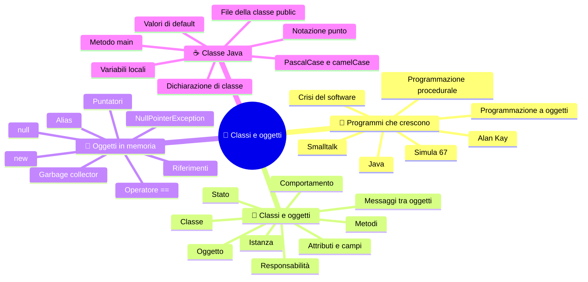

# 🧱 Classi e oggetti

**4CI · Settembre-Ottobre · S1 · Teoria**

> **Legenda:** ✅ da sapere · 🔍 per capire fino in fondo · 🤓 facoltativo, per curiosi · 🃏 flashcard: rispondi a voce, poi apri per controllare



## 🧭 Programmi che crescono

Immagina di dover scrivere il software di una stalla. All'inizio ci sono tre animali. Scrivi tre variabili per i nomi, tre per i pesi, tre per i versi. Funziona.

Poi gli animali diventano cento. Poi servono i recinti, il cibo, le visite del veterinario. Ogni funzione può modificare qualunque variabile. Un giorno il peso di una mucca diventa negativo e nessuno sa quale riga l'ha cambiato. Il programma è diventato un groviglio: in inglese si dice **spaghetti code**.

Questo non è un problema inventato. È successo davvero a tutta l'informatica, negli anni Sessanta. La risposta più fortunata è stata la **programmazione orientata agli oggetti**, in inglese *Object-Oriented Programming*, **OOP**.

### ✅ Il paradigma a oggetti

Un **paradigma** di programmazione è un modo di organizzare il pensiero quando scrivi un programma.

Nella programmazione che hai usato finora, detta **procedurale** o **imperativa**, i dati stanno da una parte e le funzioni dall'altra. Le funzioni ricevono i dati e li modificano.

Nella **programmazione a oggetti** i dati e le operazioni su quei dati stanno **insieme**, dentro un **oggetto**. Il programma diventa una squadra di oggetti che collaborano: ognuno sa fare alcune cose e le altre le chiede agli altri.

```text
PROCEDURALE                           A OGGETTI
nomi[], pesi[], versi[]               pollo  → nome, peso, verso, faiVerso()
faiVerso(nomi[i], versi[i])           mucca  → nome, peso, verso, faiVerso()
                                      pollo.faiVerso()
```

Nella colonna di destra non chiediamo a una funzione di «far fare il verso al pollo». Chiediamo **al pollo** di fare il suo verso.

La OOP si regge su **quattro principi**, che vedremo uno per settimana:

| Principio          | In una frase                                                                   |
| ------------------ | ------------------------------------------------------------------------------ |
| **Incapsulamento** | ogni oggetto protegge i suoi dati (dalle manacce di altri oggetti e dai programmatori sbadati) |
| **Ereditarietà**   | una classe può riusare codice della classe "padre" e specializzarla            |
| **Polimorfismo**   | cose diverse rispondono in modo diverso allo stesso comando                    |
| **Astrazione**     | si mostra ciò che serve e si nascondono i dettagli                             |

La OOP non è l'unico modo di programmare, e non sempre è il migliore. È però il più diffuso nei grandi software: Java, C#, C++, Python, Kotlin, Swift e JavaScript la usano tutti.

<details>
<summary>🃏 Che cos'è un paradigma di programmazione?</summary>
Un modo di organizzare il pensiero e il codice quando si scrive un programma.
</details>
<details>
<summary>🃏 Nella programmazione procedurale, dove stanno i dati e le funzioni?</summary>
Separati: i dati da una parte, le funzioni dall'altra. Le funzioni ricevono i dati e li modificano.
</details>
<details>
<summary>🃏 Qual è l'idea centrale della programmazione a oggetti?</summary>
Mettere insieme, dentro un oggetto, i dati e le operazioni su quei dati. Il programma diventa una squadra di oggetti che collaborano.
</details>
<details>
<summary>🃏 Che cosa significa la sigla OOP?</summary>
Object-Oriented Programming, programmazione orientata agli oggetti.
</details>
<details>
<summary>🃏 Quali sono i quattro principi della OOP?</summary>
Incapsulamento, ereditarietà, polimorfismo e astrazione.
</details>
<details>
<summary>🃏 Qual è la differenza tra faiVerso(pollo) e pollo.faiVerso()?</summary>
Nel primo caso una funzione esterna lavora sui dati del pollo. Nel secondo chiediamo al pollo stesso di eseguire il suo comportamento.
</details>
<details>
<summary>🃏 Che cos'è lo spaghetti code?</summary>
Codice aggrovigliato, in cui tutto può modificare tutto e diventa difficile capire dove nasce un errore.
</details>

### 🤓 Dalla crisi del software a Java

> Nel 1968, in Germania, la NATO organizza a Garmisch un convegno con i migliori informatici del mondo. Il tema è allarmante: i progetti software costano troppo, arrivano in ritardo e sono pieni di errori. Lo chiamano **crisi del software**. Da lì nasce l'espressione *software engineering*, ingegneria del software.
>
> Nello stesso periodo, a Oslo, **Ole-Johan Dahl** e **Kristen Nygaard** lavorano a programmi che simulano navi, porti e code di clienti. Inventano **Simula 67**: per la prima volta un linguaggio ha classi, oggetti e sottoclassi. Nel mondo c'è la corsa alla Luna; in Norvegia nasce, quasi in silenzio, un'idea che cambierà il software.
>
> Negli anni Settanta, in California, **Alan Kay** lavora allo Xerox PARC, lo stesso laboratorio in cui nasce l'interfaccia grafica con finestre e icone. Kay ha studiato biologia: immagina i programmi come **cellule** che si scambiano **messaggi**. Crea **Smalltalk** e inventa il nome *object-oriented*.
>
> Nel 1995 **James Gosling** e il suo gruppo alla Sun Microsystems pubblicano **Java**. All'inizio si chiamava *Oak*, come la quercia fuori dal suo ufficio, ed era pensato per gli elettrodomestici. Arriva proprio mentre esplode il Web. Oggi Java gira nei server delle banche, in moltissime app aziendali e in Minecraft: Java Edition.

<details>
<summary>🃏 Che cosa fu la crisi del software?</summary>
Il riconoscimento, alla fine degli anni Sessanta, che i progetti software costavano troppo, arrivavano in ritardo ed erano pieni di errori. Se ne parlò al convegno NATO del 1968.
</details>
<details>
<summary>🃏 Chi inventò Simula 67 e a che cosa serviva?</summary>
Ole-Johan Dahl e Kristen Nygaard, a Oslo. Serviva a simulare sistemi reali come navi e code. Fu il primo linguaggio con classi, oggetti e sottoclassi.
</details>
<details>
<summary>🃏 Come immaginava i programmi Alan Kay?</summary>
Come cellule che si scambiano messaggi. Creò Smalltalk e inventò il nome object-oriented.
</details>
<details>
<summary>🃏 Quando nasce Java e come si chiamava prima?</summary>
Nel 1995, alla Sun Microsystems, con James Gosling. Prima si chiamava Oak.
</details>

## 🧱 Classe e oggetto

### ✅ La classe descrive, l'oggetto esiste

Una **classe** è una descrizione generale: dice quali dati e quali comportamenti avrà un certo tipo di cosa. È come il **progetto** di una casa, o lo **stampo** dei biscotti.

Un **oggetto** è una cosa concreta costruita seguendo quella descrizione. Si chiama anche **istanza** della classe. È la casa costruita, il biscotto uscito dallo stampo.

```text
                  CLASSE Animale  (il progetto)
           +-------------------------------+
           | nome, verso, numeroZampe, peso |
           | faiVerso()                      |
           +---------------+-----------------+
                           |
          +----------------+----------------+
          v                                 v
   OGGETTO (istanza)                 OGGETTO (istanza)
   nome = "Pio"                      nome = "Carolina"
   verso = "Coccodè!"                verso = "Muuu!"
   numeroZampe = 2                   numeroZampe = 4
   peso = 1.8                        peso = 540.0
```

Da una classe si possono creare tanti oggetti. Ognuno ha i **suoi** valori: se cambi il nome di Pio, il nome di Carolina non cambia.

Attenzione a una trappola di linguaggio. In italiano diciamo «la classe 4CI contiene gli studenti». In Java una classe **non contiene** gli oggetti: li descrive. Gli oggetti vivono in memoria, ognuno per conto suo.

**Esempi dal mondo reale:**

| Classe | Oggetti possibili |
| --- | --- |
| `Studente` nel registro elettronico | Giulia Rossi, Marco Bianchi, ... |
| `Personaggio` in un videogioco | il mago del giocatore 1, l'arciere del giocatore 2 |
| `ContoCorrente` in una banca | il conto di tua madre, il conto della scuola |

<details>
<summary>🃏 Che cos'è una classe?</summary>
Una descrizione generale di un tipo di cosa: dice quali dati e quali comportamenti avranno i suoi oggetti. È come un progetto o uno stampo.
</details>
<details>
<summary>🃏 Che cos'è un oggetto?</summary>
Una cosa concreta creata a partire da una classe, con i propri valori. Si chiama anche istanza.
</details>
<details>
<summary>🃏 Che cosa significa istanza?</summary>
È sinonimo di oggetto: un esemplare concreto di una classe.
</details>
<details>
<summary>🃏 Quanti oggetti si possono creare da una classe?</summary>
Quanti se ne vogliono, ognuno con i propri valori.
</details>
<details>
<summary>🃏 Se cambio il nome di un oggetto Animale, cambia anche il nome degli altri oggetti Animale?</summary>
No. Ogni oggetto ha i propri valori, indipendenti dagli altri.
</details>
<details>
<summary>🃏 Una classe Java contiene i suoi oggetti?</summary>
No. La classe descrive gli oggetti. Gli oggetti vivono in memoria, ognuno per conto suo.
</details>
<details>
<summary>🃏 Fai un esempio di classe e di due suoi oggetti presi dal mondo reale.</summary>
Per esempio la classe Studente del registro elettronico e due oggetti: lo studente Giulia Rossi e lo studente Marco Bianchi.
</details>

### ✅ Stato e comportamento

Ogni oggetto ha due aspetti.

- Lo **stato**: i valori che lo descrivono in un certo momento. Sono conservati negli **attributi**, chiamati anche **campi**.
- Il **comportamento**: ciò che l'oggetto sa fare. È scritto nei **metodi**.

Due domande aiutano a progettare una classe:

| Domanda | Porta a | Esempio per `Animale` |
| --- | --- | --- |
| Che cosa **ha**? | attributi | `nome`, `verso`, `numeroZampe`, `peso` |
| Che cosa **sa fare**? | metodi | `faiVerso()`, `mangia()` |

Lo stato può cambiare nel tempo: se il pollo mangia, il suo peso aumenta. Il comportamento invece è scritto una volta sola nella classe e vale per tutti gli oggetti.

Un metodo usa lo stato dell'oggetto su cui viene chiamato. Lo stesso `faiVerso()` stampa «Pio fa: Coccodè!» se lo chiami sul pollo e «Carolina fa: Muuu!» se lo chiami sulla mucca, perché legge valori diversi.

<details>
<summary>🃏 Che cos'è lo stato di un oggetto?</summary>
L'insieme dei valori dei suoi attributi in un certo momento.
</details>
<details>
<summary>🃏 Che cos'è il comportamento di un oggetto?</summary>
Ciò che l'oggetto sa fare, scritto nei suoi metodi.
</details>
<details>
<summary>🃏 Come si chiamano anche gli attributi?</summary>
Campi.
</details>
<details>
<summary>🃏 Quale domanda porta a scoprire gli attributi? E quale i metodi?</summary>
«Che cosa ha?» porta agli attributi. «Che cosa sa fare?» porta ai metodi.
</details>
<details>
<summary>🃏 Lo stato di un oggetto può cambiare nel tempo?</summary>
Sì. Per esempio il peso di un animale aumenta quando mangia.
</details>
<details>
<summary>🃏 Perché lo stesso metodo faiVerso() stampa cose diverse su due oggetti diversi?</summary>
Perché il codice è lo stesso, ma legge lo stato dell'oggetto su cui è chiamato, che è diverso.
</details>

### 🔍 Ogni oggetto ha una responsabilità

Progettare a oggetti non significa solo elencare attributi. Significa decidere **chi fa che cosa**.

Pensa al registro elettronico. Chi deve calcolare la media di uno studente? Potremmo scrivere il calcolo nel `main`, leggendo tutti i voti. Ma i voti appartengono allo studente: è più sensato che sia lo **studente stesso** a saper calcolare la sua media.

```java
double media = giulia.calcolaMedia();
```

Questa idea si chiama **responsabilità**: ogni oggetto si occupa dei propri dati. Quando un oggetto chiede qualcosa a un altro chiamando un suo metodo, diciamo che gli **invia un messaggio**. È il linguaggio di Alan Kay.

Una buona regola: se un'operazione usa soprattutto i dati di un oggetto, probabilmente deve essere un metodo di quell'oggetto.

> 🔧 **In laboratorio:** nel progetto `LaStalla` la classe `Animale` ha il metodo `faiVerso()`. Il verso è un dato dell'animale, quindi è l'animale che sa farlo.

<details>
<summary>🃏 Che cosa significa assegnare una responsabilità a un oggetto?</summary>
Decidere che quell'oggetto si occupa di una certa operazione, di solito quella che usa i suoi dati.
</details>
<details>
<summary>🃏 Nel registro elettronico, chi dovrebbe calcolare la media di uno studente? Perché?</summary>
Lo studente stesso, con un metodo come calcolaMedia(), perché i voti sono dati suoi.
</details>
<details>
<summary>🃏 Che cosa significa inviare un messaggio a un oggetto?</summary>
Chiamare un suo metodo, chiedendogli di fare qualcosa.
</details>
<details>
<summary>🃏 Quale regola aiuta a decidere in quale classe mettere un metodo?</summary>
Se un'operazione usa soprattutto i dati di un oggetto, probabilmente deve essere un metodo di quell'oggetto.
</details>

## 🧠 Oggetti in memoria

Per capire davvero gli oggetti bisogna sapere che cosa succede in memoria. Useremo un disegno semplice, che ci accompagnerà per tutto il bimestre: **scatole e frecce**.

### ✅ new crea un oggetto

La parola chiave **`new`** crea un nuovo oggetto in memoria.

```java
Animale pollo = new Animale();
```

Questa riga fa tre cose:

1. `Animale pollo` dichiara una variabile di tipo `Animale`;
2. `new Animale()` crea un nuovo oggetto `Animale` in memoria;
3. `=` mette nella variabile un **riferimento** all'oggetto, cioè l'informazione per ritrovarlo.

Senza `new` non nasce nessun oggetto:

```java
Animale a;   // esiste solo la variabile: nessun animale
```

<details>
<summary>🃏 Che cosa fa la parola chiave new?</summary>
Crea un nuovo oggetto in memoria e restituisce un riferimento per ritrovarlo.
</details>
<details>
<summary>🃏 Quali tre cose fa la riga Animale pollo = new Animale()?</summary>
Dichiara la variabile pollo, crea un nuovo oggetto Animale e mette nella variabile il riferimento all'oggetto.
</details>
<details>
<summary>🃏 Dopo la riga Animale a; quanti oggetti esistono?</summary>
Nessuno. Esiste solo la variabile a.
</details>
<details>
<summary>🃏 Quante volte devo scrivere new per creare tre oggetti?</summary>
Tre: ogni new crea un solo oggetto.
</details>

### ✅ Una variabile contiene un riferimento

Con i tipi primitivi, come `int` e `double`, la variabile **contiene** il valore:

```java
int eta = 16;   // nella scatola c'è proprio 16
```

Con gli oggetti è diverso. La variabile non contiene l'oggetto: contiene un **riferimento**, una specie di freccia che punta all'oggetto.

```text
VARIABILI                         OGGETTI IN MEMORIA
eta    [ 16 ]
pollo  [ ●───────────────────▶ ]  Animale { nome="Pio", peso=1.8 }
mucca  [ ●───────────────────▶ ]  Animale { nome="Carolina", peso=540.0 }
```

Nota che la variabile si chiama `pollo`, ma l'animale si chiama `"Pio"`. Sono due cose diverse: il **nome della variabile** è un'etichetta per il programmatore; l'attributo **`nome`** è un dato dell'oggetto.

<details>
<summary>🃏 Che cosa contiene una variabile di tipo int?</summary>
Il valore stesso, per esempio 16.
</details>
<details>
<summary>🃏 Che cosa contiene una variabile di tipo Animale?</summary>
Un riferimento all'oggetto, cioè l'informazione per ritrovarlo in memoria. Non contiene l'oggetto.
</details>
<details>
<summary>🃏 Come si disegna un riferimento nel modello a scatole e frecce?</summary>
Come una freccia che parte dalla scatola della variabile e arriva all'oggetto in memoria.
</details>
<details>
<summary>🃏 In Animale pollo = new Animale() con nome "Pio", qual è il nome della variabile e quale il nome dell'animale?</summary>
La variabile si chiama pollo. L'animale ha l'attributo nome che vale "Pio". Sono due cose diverse.
</details>

### 🔍 Due riferimenti, un solo oggetto

Che cosa succede se assegniamo una variabile oggetto a un'altra?

**Codice 1**

```java
Animale pollo = new Animale();
pollo.nome = "Pio";

Animale altro = pollo;
altro.nome = "Cip";

System.out.println(pollo.nome);
```

La riga `Animale altro = pollo;` **non crea** un secondo animale: non c'è `new`. Copia la freccia. Adesso due variabili puntano allo **stesso** oggetto.

```text
pollo  [ ●──────┐
                ├──▶  Animale { nome="Cip" }
altro  [ ●──────┘
```

Questa situazione si chiama **aliasing**: lo stesso oggetto ha due «alias», due nomi. È utile, ma può sorprendere.

Una variabile oggetto può anche non puntare a niente. In quel caso vale **`null`**:

```java
Animale nessuno = null;
nessuno.faiVerso();   // errore durante l'esecuzione: NullPointerException
```

Infine, l'operatore ` == ` tra due oggetti confronta i **riferimenti**: dice se due frecce puntano allo stesso oggetto, non se due oggetti si somigliano.

<details>
<summary>🃏 Quanti oggetti Animale vengono creati nel codice 1?</summary>
Uno solo: c'è un solo new.
</details>
<details>
<summary>🃏 Che cosa fa la riga Animale altro = pollo?</summary>
Copia il riferimento: altro punta allo stesso oggetto di pollo. Non crea un nuovo animale.
</details>
<details>
<summary>🃏 Che cos'è l'aliasing?</summary>
La situazione in cui due o più variabili puntano allo stesso oggetto.
</details>
<details>
<summary>🃏 Che cosa vale una variabile oggetto che non punta a nessun oggetto?</summary>
null.
</details>
<details>
<summary>🃏 Che cosa succede se chiami un metodo su una variabile che vale null?</summary>
Il programma si ferma con una NullPointerException.
</details>
<details>
<summary>🃏 Che cosa confronta l'operatore == tra due variabili oggetto?</summary>
Se i due riferimenti puntano allo stesso oggetto. Non confronta il contenuto.
</details>

### 🤓 Il null e l'errore da un miliardo di dollari

> Nel 1965 l'informatico britannico **Tony Hoare** sta progettando il linguaggio ALGOL W. Aggiunge il **riferimento nullo**, `null`, «semplicemente perché era così facile da implementare». Nel 2009, a una conferenza a Londra, chiede scusa pubblicamente: lo chiama il suo **errore da un miliardo di dollari**, per tutti i crash e i bug che ha causato in decenni di software.
>
> Per questo molti linguaggi recenti, come Kotlin e Swift, distinguono tra variabili che possono valere `null` e variabili che non possono. Il compilatore ti obbliga a controllare prima di usarle.
>
> E i **puntatori**? In C una variabile può contenere un indirizzo di memoria vero e proprio, su cui puoi fare calcoli. In Java i riferimenti sono più protetti: non puoi sommarli o inventarli. Inoltre Java ha il **garbage collector**: quando nessuna freccia punta più a un oggetto, la JVM lo elimina da sola e libera la memoria.

<details>
<summary>🃏 Chi ha inventato il riferimento null e come l'ha definito anni dopo?</summary>
Tony Hoare, nel 1965. Nel 2009 l'ha chiamato il suo errore da un miliardo di dollari.
</details>
<details>
<summary>🃏 Che differenza c'è tra un puntatore del C e un riferimento Java?</summary>
Un puntatore C è un indirizzo su cui si possono fare calcoli. Un riferimento Java è protetto: non si può modificare né inventare.
</details>
<details>
<summary>🃏 Che cosa fa il garbage collector?</summary>
Elimina gli oggetti a cui non punta più nessun riferimento e libera la memoria.
</details>

## ☕ Una classe Java completa

### ✅ Attributi, metodi e notazione punto

Ecco una prima classe completa.

**Codice 2** — file `Animale.java`

```java
public class Animale {
    String nome;
    String verso;
    int numeroZampe;
    double peso;

    void faiVerso() {
        System.out.println(nome + " fa: " + verso);
    }

    void mangia(double quantita) {
        peso = peso + quantita;
    }
}
```

**Codice 3** — file `TestStalla.java`

```java
public class TestStalla {
    public static void main(String[] args) {
        Animale pollo = new Animale();
        pollo.nome = "Pio";
        pollo.verso = "Coccodè!";
        pollo.numeroZampe = 2;
        pollo.peso = 1.8;

        pollo.faiVerso();
        pollo.mangia(0.2);
        System.out.println(pollo.peso);
    }
}
```

Regole da ricordare:

- una classe `public` sta in un file con **lo stesso nome**: `Animale` in `Animale.java`;
- gli attributi si dichiarano dentro la classe, fuori dai metodi;
- per usare un attributo o un metodo di un oggetto si usa la **notazione punto**: `pollo.nome`, `pollo.faiVerso()`;
- dentro un metodo, `nome` e `peso` sono gli attributi dell'oggetto su cui il metodo è stato chiamato;
- il `main` serve a **collaudare** le classi: la logica vera sta negli oggetti.

Per convenzione i nomi delle classi iniziano con la maiuscola (`ContoCorrente`, stile **PascalCase**), quelli di attributi e metodi con la minuscola (`numeroZampe`, stile **camelCase**).

Per ora gli attributi si possono modificare direttamente dal `main`. Questo permette anche di scrivere `pollo.peso = -40;`. Il codice compila, ma descrive un animale impossibile. Risolveremo il problema in S3 con l'incapsulamento.

<details>
<summary>🃏 In quale file deve stare la classe public Animale?</summary>
In un file chiamato Animale.java.
</details>
<details>
<summary>🃏 Dove si dichiarano gli attributi di una classe?</summary>
Dentro la classe, fuori dai metodi.
</details>
<details>
<summary>🃏 Che cos'è la notazione punto?</summary>
Il modo per usare un attributo o un metodo di un oggetto: variabile, punto, nome. Per esempio pollo.nome o pollo.faiVerso().
</details>
<details>
<summary>🃏 Dentro il metodo mangia, a quale peso si riferisce la parola peso?</summary>
Al peso dell'oggetto su cui il metodo è stato chiamato.
</details>
<details>
<summary>🃏 A che cosa serve il main in un programma a oggetti?</summary>
A far partire il programma e collaudare le classi. La logica vera sta negli oggetti.
</details>
<details>
<summary>🃏 Quali convenzioni si usano per i nomi di classi, attributi e metodi?</summary>
Classi in PascalCase, con l'iniziale maiuscola. Attributi e metodi in camelCase, con l'iniziale minuscola.
</details>
<details>
<summary>🃏 Perché pollo.peso = -40 è un problema anche se compila?</summary>
Perché descrive un animale impossibile. Il compilatore controlla i tipi, non le regole del mondo reale.
</details>

### 🔍 Valori iniziali degli attributi

Che cosa vale un attributo se non gli assegni niente? Java gli dà un **valore di default**:

| Tipo dell'attributo | Valore iniziale |
| --- | --- |
| `int`, `long`, `short`, `byte` | `0` |
| `double`, `float` | `0.0` |
| `boolean` | `false` |
| `char` | il carattere con codice 0 |
| qualunque oggetto, anche `String` | `null` |

Quindi, dopo `Animale a = new Animale();`, `a.nome` vale `null` e `a.peso` vale `0.0`.

Attenzione: questa regola vale per gli **attributi**. Le **variabili locali**, dichiarate dentro un metodo, non ricevono nessun valore iniziale. Se provi a usarle prima di assegnarle, il programma **non compila**.

Un oggetto appena creato con tutti i valori di default è spesso un oggetto «vuoto» e poco sensato: un animale senza nome e senza peso. Nella prossima settimana vedremo come farlo nascere già completo.

<details>
<summary>🃏 Che valore iniziale ha un attributo int non assegnato?</summary>
0.
</details>
<details>
<summary>🃏 Che valore iniziale ha un attributo String non assegnato?</summary>
null, come tutti gli attributi di tipo oggetto.
</details>
<details>
<summary>🃏 Che valore iniziale ha un attributo boolean non assegnato?</summary>
false.
</details>
<details>
<summary>🃏 Le variabili locali di un metodo ricevono un valore di default?</summary>
No. Se le usi prima di assegnarle, il programma non compila.
</details>
<details>
<summary>🃏 Perché un oggetto con tutti i valori di default è spesso un problema?</summary>
Perché è un oggetto incompleto e poco sensato, per esempio un animale senza nome e con peso zero.
</details>

## 🧩 Esercizi su classi e oggetti

1. Scrivi una classe `Libro` con titolo, autore, numero di pagine e un metodo `descrivi()` che stampa una frase con questi dati.
2. Per una classe `Personaggio` di un videogioco, elenca almeno tre attributi e tre metodi. Per ogni metodo spiega quali attributi usa.
3. Disegna con scatole e frecce la memoria dopo queste righe:
   ```java
   Animale a = new Animale();
   Animale b = new Animale();
   Animale c = a;
   ```
   Quanti oggetti esistono? Quante variabili?
4. Prevedi l'output e spiegalo con un disegno:
   ```java
   Animale x = new Animale();
   x.nome = "Bianca";
   Animale y = x;
   y.nome = "Nera";
   System.out.println(x.nome + " " + y.nome);
   ```
5. Nel registro elettronico, il metodo `calcolaMedia()` dovrebbe stare nella classe `Studente` o nella classe `Registro`? Motiva.
6. Spiega con parole tue la differenza tra il nome di una variabile e un attributo `nome`.

## 📚 Fonti e risorse

- [Oracle — Object-Oriented Programming Concepts](https://docs.oracle.com/javase/tutorial/java/concepts/): la presentazione ufficiale di oggetti e classi. Utile a casa per ripassare.
- [Python Tutor in modalità Java](https://pythontutor.com/java.html): incolla un piccolo programma ed esegui riga per riga. Mostra variabili e oggetti come scatole e frecce: perfetto per l'esercizio 3.
- [BlueJ](https://www.bluej.org/): ambiente gratuito pensato per imparare la OOP. Permette di creare oggetti con un clic e ispezionarne lo stato.
- Libro di testo: P. Camagni, R. Nikolassy, *Corso di informatica Java*, volume B, Hoepli: capitolo su classi e oggetti.
- Alan Kay, *The Early History of Smalltalk*, 1993: il racconto in prima persona della nascita della OOP. Per chi legge l'inglese.

---

[🗺️ Indice](%28STU%29%204CI%20-%20SETT-OTT.md) · [➡️ S2 - Costruttori e overloading](%28STU%29%204CI%20sett-ott%20S2%20-%20Costruttori%20e%20overloading.md)
