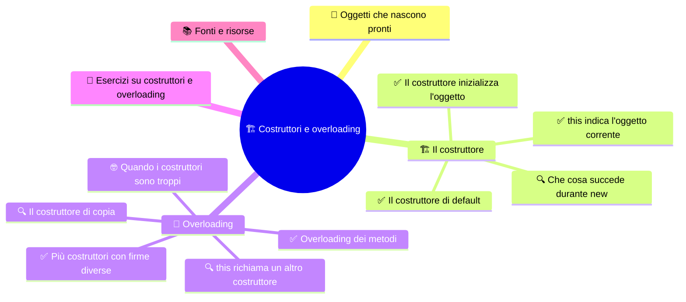

# 🏗️ Costruttori e overloading

**4CI · Settembre-Ottobre · S2 · Teoria**

> **Legenda:** ✅ da sapere · 🔍 per capire fino in fondo · 🤓 facoltativo, per curiosi · 🃏 flashcard: rispondi a voce, poi apri per controllare



## 🧭 Oggetti che nascono pronti

Pensa a quando inizi un nuovo videogioco di ruolo. Prima di entrare nel mondo, il gioco ti mostra la schermata di **creazione del personaggio**: scegli il nome, la classe, l'aspetto. Non puoi iniziare a giocare con un personaggio senza nome e senza punti vita. Il gioco te lo impedisce.

Nella settimana scorsa i nostri oggetti nascevano «nudi»:

```java
Animale pollo = new Animale();
pollo.nome = "Pio";
pollo.verso = "Coccodè!";
// numeroZampe e peso dimenticati...
```

Il programma non ci obbliga a completare l'oggetto. Se dimentichiamo una riga, l'animale resta con `peso` uguale a `0.0` e nessuno se ne accorge. In un programma grande, con oggetti creati in cento punti diversi, è un invito agli errori.

Serve qualcosa che faccia la parte della schermata di creazione: un passaggio **obbligato** in cui l'oggetto riceve i suoi dati iniziali. In Java si chiama **costruttore**.

## 🏗️ Il costruttore

### ✅ Il costruttore inizializza l'oggetto

Un **costruttore** è un blocco di codice speciale che viene eseguito **automaticamente** quando si crea un oggetto con `new`. Serve a dare all'oggetto i suoi valori iniziali.

**Codice 1**

```java
public class Animale {
    String nome;
    String verso;
    int numeroZampe;
    double peso;

    public Animale(String nome, String verso, int numeroZampe, double peso) {
        this.nome = nome;
        this.verso = verso;
        this.numeroZampe = numeroZampe;
        this.peso = peso;
    }
}
```

Adesso un animale nasce completo in una sola riga:

```java
Animale pollo = new Animale("Pio", "Coccodè!", 2, 1.8);
```

Le regole di un costruttore:

- ha **lo stesso nome della classe**;
- **non ha tipo di ritorno**, nemmeno `void`;
- può ricevere **parametri**, come un metodo;
- viene chiamato solo con `new`, non a mano come un metodo normale.

I valori tra parentesi dopo `new Animale` si chiamano **argomenti**: vengono copiati nei parametri del costruttore, nell'ordine in cui sono scritti.

**Un esempio reale.** Una banca non apre un conto senza intestatario. Il costruttore lo rende obbligatorio:

```java
public class ContoCorrente {
    String intestatario;
    String iban;
    double saldo;

    public ContoCorrente(String intestatario, String iban) {
        this.intestatario = intestatario;
        this.iban = iban;
        this.saldo = 0.0;
    }
}
```

Nota che il saldo non è un parametro: ogni conto nuovo parte da zero. Il costruttore decide anche i valori che **non** vengono dall'esterno.

<details>
<summary>🃏 Che cos'è un costruttore?</summary>
Un blocco di codice speciale, eseguito automaticamente quando si crea un oggetto con new, che dà all'oggetto i valori iniziali.
</details>
<details>
<summary>🃏 Che nome ha un costruttore?</summary>
Lo stesso nome della classe.
</details>
<details>
<summary>🃏 Che tipo di ritorno ha un costruttore?</summary>
Nessuno, nemmeno void.
</details>
<details>
<summary>🃏 Quando viene eseguito un costruttore?</summary>
Automaticamente, ogni volta che si crea un oggetto con new.
</details>
<details>
<summary>🃏 Che cosa sono gli argomenti in new Animale("Pio", "Coccodè!", 2, 1.8)?</summary>
I valori passati al costruttore. Vengono copiati nei parametri nell'ordine in cui sono scritti.
</details>
<details>
<summary>🃏 Perché il costruttore di ContoCorrente non riceve il saldo come parametro?</summary>
Perché ogni conto nuovo parte da zero: è il costruttore a decidere quel valore.
</details>
<details>
<summary>🃏 Quale problema risolve il costruttore rispetto all'assegnare gli attributi riga per riga?</summary>
Rende obbligatorio fornire i dati iniziali: l'oggetto non può nascere incompleto per una riga dimenticata.
</details>

### ✅ this indica l'oggetto corrente

Nel costruttore del codice 1 il parametro si chiama `nome` e l'attributo si chiama anche lui `nome`. Come fa Java a distinguerli?

Dentro un costruttore o un metodo, la parola chiave **`this`** indica **l'oggetto corrente**: quello che si sta costruendo, o quello su cui il metodo è stato chiamato.

```java
this.nome = nome;
```

- `this.nome` è l'**attributo** dell'oggetto;
- `nome` da solo è il **parametro**, perché il nome più vicino «copre» l'attributo.

Che cosa succede se dimentichi `this`?

**Codice 2**

```java
public Animale(String nome) {
    nome = nome;
}
```

Questa riga copia il parametro in sé stesso. L'attributo `nome` non viene toccato e resta `null`. Il programma compila, ma l'animale nasce senza nome. È un errore classico.

<details>
<summary>🃏 Che cosa indica la parola chiave this?</summary>
L'oggetto corrente: quello che si sta costruendo, o quello su cui è stato chiamato il metodo.
</details>
<details>
<summary>🃏 In this.nome = nome, che cosa sono this.nome e nome?</summary>
this.nome è l'attributo dell'oggetto. nome è il parametro del costruttore.
</details>
<details>
<summary>🃏 Che cosa succede nel codice 2, dove manca this?</summary>
Il parametro viene copiato in sé stesso. L'attributo nome resta null. Il codice compila ma l'animale nasce senza nome.
</details>
<details>
<summary>🃏 Perché nome da solo indica il parametro e non l'attributo?</summary>
Perché in Java vince il nome dichiarato più vicino, cioè il parametro, che copre l'attributo con lo stesso nome.
</details>

### ✅ Il costruttore di default

Nella settimana 1 scrivevamo `new Animale()` senza avere scritto nessun costruttore. Come mai funzionava?

Se in una classe **non scrivi nessun costruttore**, Java ne aggiunge uno invisibile, **senza parametri** e **vuoto**. Si chiama **costruttore di default**:

```java
public Animale() {
}
```

Attenzione alla regola più importante: **appena scrivi un costruttore qualsiasi, il costruttore di default sparisce.** Con la classe del codice 1:

```java
Animale a = new Animale();   // NON compila: non esiste un costruttore senza parametri
```

Se vuoi anche un costruttore senza parametri, devi scriverlo tu. Ma chiediti prima se ha senso: un animale senza nome è un oggetto valido nel tuo programma?

<details>
<summary>🃏 Che cos'è il costruttore di default?</summary>
Un costruttore senza parametri e vuoto che Java aggiunge da solo se nella classe non hai scritto nessun costruttore.
</details>
<details>
<summary>🃏 Quando Java non aggiunge il costruttore di default?</summary>
Quando nella classe hai già scritto almeno un costruttore.
</details>
<details>
<summary>🃏 Se Animale ha solo il costruttore con quattro parametri, new Animale() compila?</summary>
No, perché il costruttore di default non esiste più.
</details>
<details>
<summary>🃏 Che cosa devi fare se vuoi sia un costruttore con parametri sia uno senza?</summary>
Scriverli entrambi esplicitamente.
</details>

### 🔍 Che cosa succede durante new

Un errore comune è pensare che il costruttore **crei** l'oggetto e lo **restituisca**. Non è così. Il lavoro è diviso:

```text
new Animale("Pio", "Coccodè!", 2, 1.8)

1. new riserva la memoria per un nuovo oggetto Animale
2. gli attributi ricevono i valori di default: null, null, 0, 0.0
3. vengono eseguiti gli inizializzatori scritti accanto agli attributi, se ci sono
4. viene eseguito il corpo del costruttore: nome = "Pio", ...
5. new restituisce il riferimento all'oggetto
```

Quindi è **`new`** che crea l'oggetto e restituisce il riferimento. Il costruttore lo **inizializza**: riceve un oggetto che esiste già e lo riempie. Per questo non ha `return` con un valore.

Il punto 3 riguarda attributi come questo:

```java
double saldo = 0.0;   // inizializzatore accanto all'attributo
```

È un'alternativa al mettere `this.saldo = 0.0` nel costruttore.

<details>
<summary>🃏 È il costruttore a creare l'oggetto?</summary>
No. È new che crea l'oggetto in memoria e restituisce il riferimento. Il costruttore lo inizializza.
</details>
<details>
<summary>🃏 In che ordine avvengono le operazioni durante new?</summary>
Memoria riservata, attributi ai valori di default, inizializzatori degli attributi, corpo del costruttore, restituzione del riferimento.
</details>
<details>
<summary>🃏 Perché un costruttore non ha un return con un valore?</summary>
Perché non restituisce l'oggetto: il riferimento lo restituisce new. Il costruttore si limita a inizializzare.
</details>
<details>
<summary>🃏 Che cos'è un inizializzatore di attributo?</summary>
Un valore scritto direttamente accanto alla dichiarazione dell'attributo, come double saldo = 0.0. Viene assegnato prima del corpo del costruttore.
</details>

## 🔀 Overloading

### ✅ Più costruttori con firme diverse

Una classe può offrire **più modi di nascere**. Per esempio, a volte conosciamo tutto dell'animale, a volte solo nome e verso.

**Codice 3**

```java
public class Animale {
    String nome;
    String verso;
    int numeroZampe;
    double peso;

    public Animale(String nome, String verso, int numeroZampe, double peso) {
        this.nome = nome;
        this.verso = verso;
        this.numeroZampe = numeroZampe;
        this.peso = peso;
    }

    public Animale(String nome, String verso) {
        this.nome = nome;
        this.verso = verso;
        this.numeroZampe = 4;
        this.peso = 1.0;
    }
}
```

Avere più costruttori nella stessa classe si chiama **overloading dei costruttori**, in italiano **sovraccarico**.

Java sceglie quale costruttore usare guardando gli **argomenti** della chiamata:

```java
Animale a = new Animale("Pio", "Coccodè!", 2, 1.8);   // primo costruttore
Animale b = new Animale("Fido", "Bau!");               // secondo costruttore
```

Perché Java possa scegliere, i costruttori devono avere **firme diverse**. La **firma** è formata da:

- il **nome**;
- il **numero** dei parametri;
- il **tipo** dei parametri;
- l'**ordine** dei tipi.

I **nomi** dei parametri **non** fanno parte della firma:

```java
public Animale(String nome, String verso) { ... }
public Animale(String verso, String nome) { ... }   // stessa firma: NON compila
```

Per Java entrambi sono «Animale con due String»: non saprebbe quale scegliere.

<details>
<summary>🃏 Che cos'è l'overloading dei costruttori?</summary>
Avere più costruttori nella stessa classe, con firme diverse, per offrire più modi di creare un oggetto.
</details>
<details>
<summary>🃏 Come si dice overloading in italiano?</summary>
Sovraccarico.
</details>
<details>
<summary>🃏 Da quali elementi è formata la firma di un costruttore o di un metodo?</summary>
Nome, numero dei parametri, tipo dei parametri e ordine dei tipi.
</details>
<details>
<summary>🃏 I nomi dei parametri fanno parte della firma?</summary>
No. Due costruttori che differiscono solo per i nomi dei parametri hanno la stessa firma e non compilano.
</details>
<details>
<summary>🃏 Come sceglie Java quale costruttore sovraccaricato chiamare?</summary>
Guardando numero, tipo e ordine degli argomenti scritti nella chiamata con new.
</details>
<details>
<summary>🃏 Nel codice 3, quale costruttore chiama new Animale("Fido", "Bau!") e quante zampe avrà Fido?</summary>
Il secondo, con due String. Fido avrà 4 zampe, il valore scelto dal costruttore.
</details>

### ✅ Overloading dei metodi

L'overloading non vale solo per i costruttori. Anche i **metodi** possono avere lo stesso nome e parametri diversi.

Lo usi da anni senza saperlo:

```java
System.out.println(42);        // println con un int
System.out.println(3.14);      // println con un double
System.out.println("Ciao");    // println con una String
```

`println` non è un solo metodo: sono **tanti metodi** con lo stesso nome e parametri diversi. Il compilatore sceglie quello giusto guardando l'argomento.

Un esempio nella stalla:

```java
public void mangia(double chili) {
    peso = peso + chili;
}

public void mangia(String cibo) {
    System.out.println(nome + " mangia " + cibo);
}
```

Una regola importante: **il tipo di ritorno non basta** a distinguere due metodi.

```java
public int calcola() { ... }
public double calcola() { ... }   // NON compila
```

Se scrivo `calcola();` senza usare il risultato, Java non saprebbe quale scegliere.

La scelta tra metodi sovraccaricati avviene **durante la compilazione**, prima che il programma parta. In S5 vedremo che per questo l'overloading si chiama anche **polimorfismo statico**.

<details>
<summary>🃏 Che cos'è l'overloading dei metodi?</summary>
Avere nella stessa classe più metodi con lo stesso nome e firme diverse.
</details>
<details>
<summary>🃏 Fai un esempio di overloading nella libreria standard di Java.</summary>
System.out.println: esistono versioni per int, double, String e altri tipi, tutte con lo stesso nome.
</details>
<details>
<summary>🃏 Due metodi possono differire solo per il tipo di ritorno?</summary>
No. Il tipo di ritorno non fa parte della firma e Java non saprebbe quale scegliere.
</details>
<details>
<summary>🃏 Quando viene scelto quale metodo sovraccaricato eseguire?</summary>
Durante la compilazione, in base agli argomenti della chiamata.
</details>
<details>
<summary>🃏 Con i due metodi mangia della stalla, quale viene chiamato da pollo.mangia("mais")?</summary>
Quello con il parametro String, che stampa il cibo mangiato.
</details>

### 🔍 this richiama un altro costruttore

Nel codice 3 i due costruttori ripetono le stesse assegnazioni. Se domani aggiungiamo un controllo sul nome, dovremo ricordarci di scriverlo due volte.

Un costruttore può **chiamarne un altro della stessa classe** con `this(...)`:

**Codice 4**

```java
public Animale(String nome, String verso, int numeroZampe, double peso) {
    this.nome = nome;
    this.verso = verso;
    this.numeroZampe = numeroZampe;
    this.peso = peso;
}

public Animale(String nome, String verso) {
    this(nome, verso, 4, 1.0);
}
```

Il secondo costruttore passa il lavoro al primo, aggiungendo i valori mancanti. Così la logica di inizializzazione sta in **un solo punto**.

> 🔧 **In laboratorio:** nel progetto `LaStalla` `Animale` riceve un costruttore completo e uno parziale che usa `this(...)`; lo stesso schema serve per la classe `Recinto`.

Attenzione a non confondere:

- `this.nome` → l'attributo dell'oggetto corrente;
- `this(...)` → la chiamata a un altro costruttore.

`this(...)` deve essere la **prima istruzione** del costruttore. Due costruttori non possono chiamarsi a vicenda all'infinito: il compilatore se ne accorge e dà errore.

<details>
<summary>🃏 Che cosa fa this(...) dentro un costruttore?</summary>
Chiama un altro costruttore della stessa classe.
</details>
<details>
<summary>🃏 Perché è utile far chiamare un costruttore da un altro?</summary>
Per scrivere la logica di inizializzazione in un solo punto, senza ripeterla.
</details>
<details>
<summary>🃏 Qual è la differenza tra this.nome e this(...)?</summary>
this.nome indica un attributo dell'oggetto corrente. this(...) chiama un altro costruttore della stessa classe.
</details>
<details>
<summary>🃏 In quale posizione deve stare this(...) dentro un costruttore?</summary>
Deve essere la prima istruzione.
</details>
<details>
<summary>🃏 Due costruttori possono chiamarsi a vicenda con this(...)?</summary>
No. Sarebbe una ricorsione infinita e il compilatore dà errore.
</details>

### 🔍 Il costruttore di copia

Nella settimana 1 abbiamo visto che `Animale b = a;` **non** crea un nuovo animale: copia solo la freccia. E se volessimo davvero un secondo oggetto, uguale al primo ma indipendente?

Si usa un **costruttore di copia**: un costruttore che riceve un oggetto della stessa classe e ne copia i valori.

**Codice 5**

```java
public Animale(Animale altro) {
    this(altro.nome, altro.verso, altro.numeroZampe, altro.peso);
}
```

```java
Animale originale = new Animale("Pio", "Coccodè!", 2, 1.8);
Animale copia = new Animale(originale);
Animale alias = originale;
```

```text
originale [ ●──────┐
                   ├──▶ Animale { nome="Pio", peso=1.8 }
alias     [ ●──────┘

copia     [ ●──────────▶ Animale { nome="Pio", peso=1.8 }   (oggetto distinto)
```

Se ora modifichi il peso di `copia`, l'oggetto `originale` non cambia. Se modifichi il peso di `alias`, invece, cambia anche `originale`: è lo stesso oggetto.

<details>
<summary>🃏 Che cos'è un costruttore di copia?</summary>
Un costruttore che riceve un oggetto della stessa classe e crea un nuovo oggetto con gli stessi valori.
</details>
<details>
<summary>🃏 Qual è la differenza tra Animale copia = new Animale(originale) e Animale alias = originale?</summary>
Il primo crea un nuovo oggetto indipendente con gli stessi valori. Il secondo copia solo il riferimento: alias e originale puntano allo stesso oggetto.
</details>
<details>
<summary>🃏 Se modifico il peso della copia creata con il costruttore di copia, cambia l'originale?</summary>
No, perché sono due oggetti distinti.
</details>
<details>
<summary>🃏 Quanti oggetti Animale esistono dopo le tre righe del codice 5 con originale, copia e alias?</summary>
Due: ci sono due new.
</details>

### 🤓 Quando i costruttori sono troppi

> Immagina una classe `Pizza` con dieci ingredienti facoltativi. Servirebbe un costruttore per ogni combinazione: impossibile. Una soluzione ingenua è la catena di costruttori sempre più lunghi, che il libro *Effective Java* di Joshua Bloch chiama **telescoping constructors**, costruttori a cannocchiale. Leggere `new Pizza(30, true, false, true, false, false, true)` è un incubo: che cosa voleva dire quel terzo `false`?
>
> Le librerie moderne usano due trucchi.
>
> Il primo è il **metodo di fabbrica statico**: un metodo con un nome chiaro che crea l'oggetto al posto del costruttore. Lo trovi nella libreria standard: `LocalDate.of(2026, 10, 1)` crea una data, `List.of("a", "b")` crea una lista. Il nome spiega che cosa stai facendo.
>
> Il secondo è il **Builder**: un oggetto aiutante a cui dai i pezzi uno per volta, con metodi dai nomi parlanti, e che alla fine costruisce l'oggetto vero. In molti linguaggi, come Python e Kotlin, esistono invece i **parametri con nome**, che risolvono il problema alla radice.

<details>
<summary>🃏 Che cosa sono i telescoping constructors?</summary>
Una catena di costruttori con sempre più parametri, difficile da leggere e da usare. Il nome viene dal libro Effective Java.
</details>
<details>
<summary>🃏 Che cos'è un metodo di fabbrica statico? Fai un esempio.</summary>
Un metodo con un nome chiaro che crea e restituisce un oggetto al posto del costruttore. Per esempio LocalDate.of(2026, 10, 1).
</details>
<details>
<summary>🃏 Che cos'è un Builder?</summary>
Un oggetto aiutante che riceve i pezzi uno alla volta, con metodi dai nomi chiari, e alla fine costruisce l'oggetto vero.
</details>

## 🧩 Esercizi su costruttori e overloading

1. Scrivi una classe `Libro` con titolo, autore e numero di pagine. Aggiungi un costruttore completo e un costruttore che riceve solo il titolo e mette autore «Anonimo» e 100 pagine, usando `this(...)`.
2. Per ogni coppia, scrivi se le firme sono diverse o uguali:
   - `Studente(String nome, int eta)` e `Studente(int eta, String nome)`
   - `Studente(String nome)` e `Studente(String cognome)`
   - `Studente()` e `Studente(String nome)`
3. Trova e spiega l'errore:
   ```java
   public class Prodotto {
       String nome;
       double prezzo;
       public Prodotto(String nome, double prezzo) {
           nome = nome;
           prezzo = prezzo;
       }
   }
   ```
4. Una classe `Prenotazione` ha cliente, data e numero di persone. Progetta due costruttori sensati e spiega quando useresti ciascuno.
5. Prevedi l'output e disegna la memoria:
   ```java
   Animale a = new Animale("Bianca", "Muuu!", 4, 500);
   Animale b = new Animale(a);
   Animale c = a;
   b.peso = 520;
   c.peso = 510;
   System.out.println(a.peso + " " + b.peso + " " + c.peso);
   ```
6. Scrivi due metodi sovraccaricati `saluta()` e `saluta(String nome)` per una classe `Assistente`.

## 📚 Fonti e risorse

- [Oracle — Providing Constructors for Your Classes](https://docs.oracle.com/javase/tutorial/java/javaOO/constructors.html): la spiegazione ufficiale dei costruttori.
- [Oracle — Using the this Keyword](https://docs.oracle.com/javase/tutorial/java/javaOO/thiskey.html): `this` e `this(...)` con esempi.
- [Oracle — Defining Methods](https://docs.oracle.com/javase/tutorial/java/javaOO/methods.html): firme e overloading dei metodi.
- [Python Tutor in modalità Java](https://pythontutor.com/java.html): esegui l'esercizio 5 riga per riga e confronta il disegno con il tuo.
- Joshua Bloch, *Effective Java*, 3ª edizione, Addison-Wesley, 2018: il primo capitolo parla di come creare oggetti. Per chi vuole guardare avanti.

---

[⬅️ S1 - Classi e oggetti](%28STU%29%204CI%20sett-ott%20S1%20-%20Classi%20e%20oggetti.md) · [🗺️ Indice](%28STU%29%204CI%20-%20SETT-OTT.md) · [➡️ S3 - Incapsulamento](%28STU%29%204CI%20sett-ott%20S3%20-%20Incapsulamento.md)
