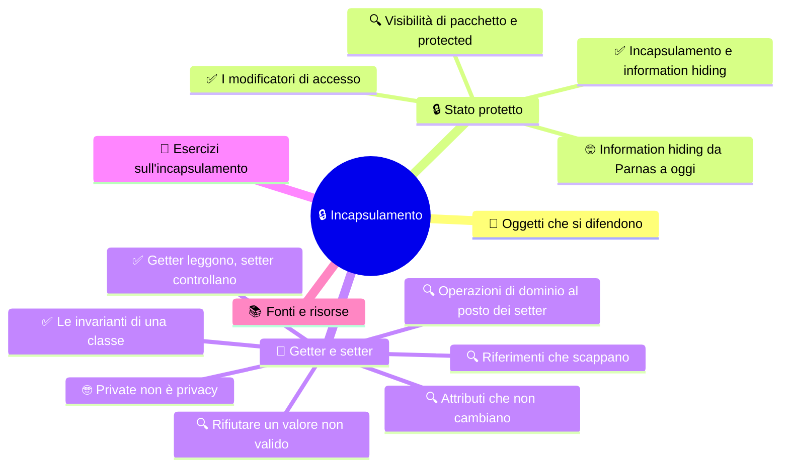

# 🔒 Incapsulamento

**4CI · Settembre-Ottobre · S3 · Teoria**

> **Legenda:** ✅ da sapere · 🔍 per capire fino in fondo · 🤓 facoltativo, per curiosi · 🃏 flashcard: rispondi a voce, poi apri per controllare



## 🧭 Oggetti che si difendono

Quando prelevi al bancomat, non entri nel caveau della banca. Non tocchi le banconote, non apri i registri. Usi uno sportello con poche operazioni: *saldo*, *preleva*, *deposita*. Ogni operazione ha le sue regole: serve il PIN, non puoi prelevare più di quanto hai, c'è un limite giornaliero.

Dietro lo sportello la banca può cambiare tutto: il software, il caveau, il modo di contare i soldi. Tu non te ne accorgi, perché lo sportello resta uguale.

Il nostro `Animale`, invece, è una banca con il caveau spalancato:

```java
pollo.peso = -40;
pollo.numeroZampe = -12;
pollo.nome = "";
```

Il compilatore accetta tutto: `-40` è un `double` valido. Ma nessun pollo pesa meno quaranta chili. Il programma **compila** e descrive una situazione **impossibile**. È un errore di modello, non di sintassi, e il compilatore da solo non può vederlo.

Questa settimana chiudiamo il caveau e costruiamo lo sportello. Si chiama **incapsulamento**, ed è il primo dei quattro principi della OOP.

## 🔒 Stato protetto

### ✅ Incapsulamento e information hiding

L'**incapsulamento** significa due cose insieme:

1. **raccogliere** in una classe i dati e le operazioni che li riguardano;
2. **controllare** come il resto del programma può accedere a quei dati.

L'**information hiding**, in italiano *occultamento dell'informazione*, è l'idea che sta dietro: nascondere i dettagli interni che non servono a chi usa l'oggetto. Chi usa un `Animale` deve sapere **che cosa** può chiedergli, non **come** l'animale conserva i suoi dati.

```text
     CODICE ESTERNO (main, altre classi)
              │
              │ usa solo i metodi pubblici
              ▼
   +----------------------------------+
   |             Animale              |
   |  🔓 interfaccia pubblica:        |
   |     getNome(), getPeso(),        |
   |     setPeso(), mangia(),         |
   |     faiVerso()                   |
   |----------------------------------|
   |  🔒 stato privato:               |
   |     nome, verso, numeroZampe,    |
   |     peso                         |
   +----------------------------------+
```

L'insieme dei metodi pubblici si chiama **interfaccia pubblica** della classe: è lo «sportello». Lo stato privato è il «caveau».

I vantaggi:

- **nessuno può rompere lo stato** scrivendo valori assurdi;
- se cambia la rappresentazione interna, per esempio il peso salvato in grammi invece che in chili, **il codice esterno non cambia**;
- gli errori si cercano in **un solo posto**: la classe stessa.

<details>
<summary>🃏 Che cos'è l'incapsulamento?</summary>
Raccogliere in una classe i dati e le operazioni che li riguardano, e controllare come il resto del programma può accedere a quei dati.
</details>
<details>
<summary>🃏 Che cos'è l'information hiding?</summary>
Nascondere i dettagli interni di un oggetto che non servono a chi lo usa.
</details>
<details>
<summary>🃏 Che cos'è l'interfaccia pubblica di una classe?</summary>
L'insieme dei suoi metodi pubblici: ciò che il resto del programma può chiedere all'oggetto.
</details>
<details>
<summary>🃏 Perché pollo.peso = -40 compila anche se è sbagliato?</summary>
Perché il compilatore controlla solo il tipo: -40 è un double valido. Non conosce le regole del mondo reale.
</details>
<details>
<summary>🃏 Quali sono i tre vantaggi principali dell'incapsulamento?</summary>
Nessuno può rompere lo stato, la rappresentazione interna si può cambiare senza toccare il codice esterno, gli errori si cercano in un solo posto.
</details>
<details>
<summary>🃏 Nella metafora della banca, che cosa corrisponde allo sportello e che cosa al caveau?</summary>
Lo sportello è l'interfaccia pubblica, cioè i metodi. Il caveau è lo stato privato, cioè gli attributi.
</details>

### ✅ I modificatori di accesso

Java controlla l'accesso con i **modificatori di accesso**, parole chiave scritte prima di attributi, metodi e costruttori.

| Modificatore | Chi può accedere | Uso tipico |
| --- | --- | --- |
| `private` | solo il codice **dentro la stessa classe** | attributi, metodi di aiuto interni |
| *(nessuno)* | le classi dello **stesso pacchetto** | classi che lavorano insieme |
| `protected` | stesso pacchetto **e sottoclassi** | casi legati all'ereditarietà (S4) |
| `public` | **tutti** | metodi dell'interfaccia pubblica, costruttori |

La regola pratica per iniziare:

```text
attributi          → private
metodi per l'esterno → public
```

**Codice 1**

```java
public class Animale {
    private String nome;
    private double peso;

    public Animale(String nome, double peso) {
        this.nome = nome;
        this.peso = peso;
    }
}
```

```java
// in un'altra classe
pollo.peso = -40;   // NON compila: peso has private access in Animale
```

Quel messaggio di errore non è un fastidio: è il compilatore che **difende** il tuo progetto.

<details>
<summary>🃏 Che cosa sono i modificatori di accesso?</summary>
Parole chiave che stabiliscono chi può accedere ad attributi, metodi e costruttori.
</details>
<details>
<summary>🃏 Quali sono i modificatori di accesso in Java?</summary>
private, nessun modificatore (accesso di pacchetto), protected, public.
</details>
<details>
<summary>🃏 Chi può accedere a un membro private?</summary>
Solo il codice scritto dentro la stessa classe.
</details>
<details>
<summary>🃏 Chi può accedere a un membro public?</summary>
Tutto il codice, da qualunque classe.
</details>
<details>
<summary>🃏 Qual è la regola pratica per attributi e metodi?</summary>
Attributi private, metodi pensati per l'esterno public.
</details>
<details>
<summary>🃏 Che cosa succede se scrivi pollo.peso = -40 da un'altra classe quando peso è private?</summary>
Il codice non compila: il compilatore segnala che peso ha accesso privato.
</details>

### 🔍 Visibilità di pacchetto e protected

Un **pacchetto**, in inglese *package*, è un gruppo di classi che stanno nella stessa cartella e lavorano insieme. Si dichiara in cima al file:

```java
package stalla;
```

Se un membro **non ha modificatore**, è visibile a tutte le classi dello **stesso pacchetto**, ma non fuori. Si chiama accesso di pacchetto, o *package-private*. È utile per classi che collaborano strettamente, ma è facile dimenticarlo: spesso è una svista.

**`protected`** allarga l'accesso di pacchetto alle **sottoclassi**, anche se stanno in altri pacchetti. Lo useremo con l'ereditarietà. Attenzione: in Java `protected` include anche **tutto il pacchetto**. In altri linguaggi, come C++, non è così.

| Modificatore | Stessa classe | Stesso pacchetto | Sottoclasse in altro pacchetto | Ovunque |
| --- | --- | --- | --- | --- |
| `private` | ✅ | ❌ | ❌ | ❌ |
| *(nessuno)* | ✅ | ✅ | ❌ | ❌ |
| `protected` | ✅ | ✅ | ✅ | ❌ |
| `public` | ✅ | ✅ | ✅ | ✅ |

Un'ultima sorpresa: `private` vale per la **classe**, non per il singolo oggetto. Dentro `Animale` puoi leggere gli attributi privati di **un altro** `Animale`:

```java
public boolean piuPesanteDi(Animale altro) {
    return this.peso > altro.peso;   // compila: siamo dentro Animale
}
```

<details>
<summary>🃏 Che cos'è un pacchetto in Java?</summary>
Un gruppo di classi nella stessa cartella che lavorano insieme. Si dichiara con package in cima al file.
</details>
<details>
<summary>🃏 Chi vede un membro senza modificatore di accesso?</summary>
Tutte le classi dello stesso pacchetto, ma nessuna classe fuori dal pacchetto.
</details>
<details>
<summary>🃏 Chi vede un membro protected?</summary>
Le classi dello stesso pacchetto e le sottoclassi, anche in altri pacchetti.
</details>
<details>
<summary>🃏 Qual è la particolarità di protected in Java rispetto al C++?</summary>
In Java protected include anche l'accesso da tutto il pacchetto.
</details>
<details>
<summary>🃏 Dentro la classe Animale posso leggere l'attributo private di un altro oggetto Animale?</summary>
Sì. In Java private vale per la classe, non per il singolo oggetto.
</details>

### 🤓 Information hiding da Parnas a oggi

> Nel 1972 **David Parnas**, informatico canadese, pubblica un articolo che diventerà un classico: *On the Criteria To Be Used in Decomposing Systems into Modules*. La sua tesi è semplice e rivoluzionaria: un programma va diviso in moduli non seguendo i passi del calcolo, ma **nascondendo in ogni modulo una decisione che potrebbe cambiare**. Se cambi quella decisione, cambi un solo modulo. È la nascita dell'**information hiding**.
>
> Cinquant'anni dopo, gli ingegneri di Google hanno dato un nome al lato oscuro di questa idea: la **legge di Hyrum**, da Hyrum Wright. Dice più o meno così: *con abbastanza utenti, qualunque comportamento osservabile del tuo sistema sarà usato da qualcuno, qualunque cosa tu abbia promesso*. Se il tuo metodo restituisce i nomi in ordine alfabetico «per caso», qualcuno ci conterà, e il giorno che cambi l'ordine il suo programma si rompe.
>
> Morale: più nascondi, meno promesse involontarie fai.

<details>
<summary>🃏 Chi ha introdotto l'idea di information hiding e quando?</summary>
David Parnas, in un articolo del 1972.
</details>
<details>
<summary>🃏 Secondo Parnas, che cosa deve nascondere ogni modulo?</summary>
Una decisione di progetto che potrebbe cambiare, così che cambiandola si modifichi un solo modulo.
</details>
<details>
<summary>🃏 Che cosa dice la legge di Hyrum?</summary>
Con abbastanza utenti, qualunque comportamento osservabile di un sistema verrà usato da qualcuno, anche se non era promesso.
</details>

## 🚪 Getter e setter

### ✅ Getter leggono, setter controllano

Se gli attributi sono `private`, come fa il resto del programma a leggerli o modificarli? Attraverso metodi pubblici.

Un **getter** è un metodo che **restituisce** il valore di un attributo. Per convenzione si chiama `get` seguito dal nome dell'attributo con la maiuscola. Per i `boolean` si usa spesso `is`.

```java
public double getPeso() {
    return peso;
}

public boolean isVaccinato() {
    return vaccinato;
}
```

Un **setter** è un metodo che **modifica** un attributo. Si chiama `set` seguito dal nome. Il suo vero valore è che può **controllare** il nuovo valore prima di accettarlo:

**Codice 2**

```java
public void setPeso(double peso) {
    if (peso > 0) {
        this.peso = peso;
    }
}
```

```java
pollo.setPeso(2.1);    // accettato
pollo.setPeso(-40);    // rifiutato: il peso resta quello di prima
```

Due regole importanti:

- **non serve un setter per ogni attributo.** Se un dato non deve cambiare dopo la creazione, per esempio il codice fiscale, non scrivere il setter;
- **un setter senza controlli** è quasi come un attributo `public`. Scriverlo per abitudine non è incapsulamento.

Gli IDE possono generare getter e setter automaticamente. È comodo, ma è proprio il modo più rapido per aprire di nuovo il caveau senza accorgersene.

<details>
<summary>🃏 Che cos'è un getter?</summary>
Un metodo pubblico che restituisce il valore di un attributo, per esempio getPeso().
</details>
<details>
<summary>🃏 Che cos'è un setter?</summary>
Un metodo pubblico che modifica un attributo e può controllare il nuovo valore prima di accettarlo, per esempio setPeso().
</details>
<details>
<summary>🃏 Come si chiama per convenzione il getter di un attributo boolean vaccinato?</summary>
isVaccinato().
</details>
<details>
<summary>🃏 Nel codice 2, che cosa succede con pollo.setPeso(-40)?</summary>
Il valore viene rifiutato e il peso resta quello di prima.
</details>
<details>
<summary>🃏 Ogni attributo deve avere un setter?</summary>
No. Se un dato non deve cambiare dopo la creazione, non si scrive il setter.
</details>
<details>
<summary>🃏 Perché un setter senza controlli non è vero incapsulamento?</summary>
Perché permette di scrivere qualunque valore, quasi come se l'attributo fosse public.
</details>
<details>
<summary>🃏 Qual è il rischio di generare getter e setter in automatico con l'IDE?</summary>
Aprire di nuovo l'accesso a tutti gli attributi senza pensare a quali regole servono.
</details>

### ✅ Le invarianti di una classe

Un'**invariante** è una regola che deve essere **sempre vera** per ogni oggetto della classe, dalla nascita alla fine.

Per `Animale` possiamo decidere:

- il nome non è vuoto;
- il numero di zampe è maggiore o uguale a zero;
- il peso è maggiore di zero.

Per un `ContoCorrente`:

- l'IBAN non cambia mai;
- il saldo non è mai negativo.

La classe è **responsabile** delle sue invarianti. Deve proteggerle in **tutti** i punti in cui lo stato cambia: nel costruttore e in ogni metodo che modifica gli attributi. Un buon trucco è far usare i setter anche al costruttore:

**Codice 3**

```java
public Animale(String nome, double peso) {
    setNome(nome);
    setPeso(peso);
}
```

Così la regola sul peso è scritta in un solo punto e vale anche alla nascita.

> 🔧 **In laboratorio:** nel progetto `LaStalla` gli attributi di `Animale` diventano `private` e provi a passare valori sbagliati per verificare che vengano rifiutati.

<details>
<summary>🃏 Che cos'è un'invariante di una classe?</summary>
Una regola che deve essere sempre vera per ogni oggetto della classe, dalla creazione in poi.
</details>
<details>
<summary>🃏 Fai un esempio di invariante per un ContoCorrente.</summary>
Il saldo non è mai negativo, oppure l'IBAN non cambia mai.
</details>
<details>
<summary>🃏 In quali punti una classe deve proteggere le sue invarianti?</summary>
In tutti i punti in cui lo stato cambia: nel costruttore e in ogni metodo che modifica gli attributi.
</details>
<details>
<summary>🃏 Perché è utile che il costruttore usi i setter?</summary>
Perché così la regola di controllo è scritta in un solo punto e vale anche quando l'oggetto nasce.
</details>

### 🔍 Operazioni di dominio al posto dei setter

Confronta queste due istruzioni:

```java
conto.setSaldo(conto.getSaldo() - 50);
conto.preleva(50);
```

Fanno la stessa cosa, ma la seconda è molto meglio. Descrive un'**azione del mondo reale**, un'**operazione di dominio**, e può contenere tutte le sue regole:

**Codice 4**

```java
public class ContoCorrente {
    private final String iban;
    private String intestatario;
    private double saldo;

    public ContoCorrente(String intestatario, String iban) {
        this.intestatario = intestatario;
        this.iban = iban;
        this.saldo = 0.0;
    }

    public double getSaldo() {
        return saldo;
    }

    public boolean versa(double importo) {
        if (importo <= 0) {
            return false;
        }
        saldo = saldo + importo;
        return true;
    }

    public boolean preleva(double importo) {
        if (importo <= 0 || importo > saldo) {
            return false;
        }
        saldo = saldo - importo;
        return true;
    }
}
```

`ContoCorrente` non ha `setSaldo`. Il saldo cambia **solo** con `versa` e `preleva`, che rispettano l'invariante «saldo mai negativo».

Questa idea ha un motto: **Tell, don't ask**, cioè *ordina, non chiedere*. Invece di chiedere i dati all'oggetto e decidere fuori, gli dici che cosa fare e lasci a lui le regole.

<details>
<summary>🃏 Che cos'è un'operazione di dominio?</summary>
Un metodo che descrive un'azione del mondo reale, come preleva o versa, e contiene le sue regole.
</details>
<details>
<summary>🃏 Perché conto.preleva(50) è meglio di conto.setSaldo(conto.getSaldo() - 50)?</summary>
Perché descrive l'azione reale e può controllare le regole, come non andare sotto zero. Con il setter le regole restano fuori dalla classe.
</details>
<details>
<summary>🃏 Nel codice 4, come cambia il saldo se ContoCorrente non ha setSaldo?</summary>
Solo con i metodi versa e preleva, che controllano l'importo.
</details>
<details>
<summary>🃏 Nel codice 4, che cosa restituisce preleva se l'importo supera il saldo?</summary>
false, e il saldo non cambia.
</details>
<details>
<summary>🃏 Che cosa significa il motto Tell, don't ask?</summary>
Invece di chiedere i dati a un oggetto e decidere fuori, gli si dice che cosa fare e si lasciano a lui le regole.
</details>

### 🔍 Rifiutare un valore non valido

Quando un setter riceve un valore sbagliato, che cosa deve fare? Ci sono tre strade.

| Strategia | Esempio | Pro e contro |
| --- | --- | --- |
| **Ignorare** in silenzio | `if (peso > 0) this.peso = peso;` | semplice, ma chi chiama non sa che è fallito |
| **Restituire un esito** | `boolean preleva(...)` restituisce `false` | chi chiama può controllare, ma può anche dimenticarsene |
| **Lanciare un'eccezione** | `throw new IllegalArgumentException("Peso non valido");` | l'errore non passa inosservato: il programma si ferma se nessuno lo gestisce |

La terza è la più usata nelle librerie professionali. Le **eccezioni** le studieremo meglio più avanti; per ora basta sapere che `throw` interrompe il metodo e segnala l'errore.

```java
public void setPeso(double peso) {
    if (peso <= 0) {
        throw new IllegalArgumentException("Il peso deve essere positivo");
    }
    this.peso = peso;
}
```

In ogni caso conta una cosa: un valore rifiutato **non deve lasciare l'oggetto a metà**, con alcuni attributi cambiati e altri no.

<details>
<summary>🃏 Quali sono tre modi con cui un setter può rifiutare un valore non valido?</summary>
Ignorarlo in silenzio, restituire un esito come false, oppure lanciare un'eccezione.
</details>
<details>
<summary>🃏 Qual è il difetto di ignorare in silenzio un valore sbagliato?</summary>
Chi chiama il metodo non sa che la modifica non è avvenuta.
</details>
<details>
<summary>🃏 Che cosa fa throw new IllegalArgumentException("...")?</summary>
Interrompe il metodo e segnala un errore con un messaggio. Se nessuno lo gestisce, il programma si ferma.
</details>
<details>
<summary>🃏 Quale regola vale qualunque strategia si usi per rifiutare un valore?</summary>
L'oggetto non deve restare a metà, con alcuni attributi cambiati e altri no.
</details>

### 🔍 Attributi che non cambiano

Alcuni dati non devono cambiare mai dopo la creazione: l'IBAN di un conto, il numero di matricola di uno studente, la data di nascita.

Per questi si usa la parola chiave **`final`**:

```java
private final String iban;
```

Un attributo `final`:

- deve ricevere il valore **una sola volta**, di solito nel costruttore;
- dopo **non può più cambiare**: il compilatore blocca ogni tentativo;
- naturalmente **non ha setter**.

Se **tutti** gli attributi di un oggetto sono `private` e `final`, l'oggetto è **immutabile**: una volta creato, non cambia più. `String` è immutabile: metodi come `toUpperCase()` non modificano la stringa, ne creano una nuova.

Gli oggetti immutabili sono più semplici da ragionare: nessuno può cambiarli alle tue spalle.

<details>
<summary>🃏 Che cosa significa dichiarare un attributo final?</summary>
Che riceve il valore una sola volta, di solito nel costruttore, e poi non può più cambiare.
</details>
<details>
<summary>🃏 Un attributo final può avere un setter?</summary>
No, perché il suo valore non può cambiare dopo la prima assegnazione.
</details>
<details>
<summary>🃏 Che cos'è un oggetto immutabile?</summary>
Un oggetto il cui stato non cambia dopo la creazione, di solito perché tutti i suoi attributi sono private e final.
</details>
<details>
<summary>🃏 Fai un esempio di classe immutabile nella libreria Java.</summary>
String: i suoi metodi non modificano la stringa ma ne creano una nuova.
</details>
<details>
<summary>🃏 Fai due esempi di dati che dovrebbero essere final.</summary>
L'IBAN di un conto corrente e il numero di matricola di uno studente.
</details>

### 🔍 Riferimenti che scappano

Un attributo `private` può essere modificato dall'esterno anche senza setter. Come? Se il getter restituisce un **riferimento** a un oggetto modificabile.

**Codice 5**

```java
public class Studente {
    private int[] voti = {7, 8, 6};

    public int[] getVoti() {
        return voti;
    }
}
```

```java
int[] v = giulia.getVoti();
v[0] = 10;   // modifica l'array DENTRO lo studente!
```

Ricorda le scatole e frecce: un array è un oggetto. Il getter non restituisce una copia dei voti, ma **la freccia** verso l'array interno. Ora chi ha `v` può cambiare i voti di Giulia senza nessun controllo.

```text
giulia ──▶ Studente { voti ●──┐ }
                              ├──▶ [7, 8, 6]
v      [ ●────────────────────┘ ]
```

La soluzione è restituire una **copia**:

```java
public int[] getVoti() {
    return Arrays.copyOf(voti, voti.length);   // serve import java.util.Arrays;
}
```

Con `String`, `int` e `double` il problema non esiste: i primitivi vengono copiati e `String` è immutabile.

<details>
<summary>🃏 Come si può modificare un attributo private anche senza setter?</summary>
Se il getter restituisce il riferimento a un oggetto modificabile, come un array, chi lo riceve può modificarlo direttamente.
</details>
<details>
<summary>🃏 Nel codice 5, perché v[0] = 10 modifica i voti dello studente?</summary>
Perché getVoti restituisce il riferimento all'array interno, non una copia: v e l'attributo voti puntano allo stesso array.
</details>
<details>
<summary>🃏 Come si corregge un getter che restituisce un array interno?</summary>
Restituendo una copia dell'array, per esempio con Arrays.copyOf.
</details>
<details>
<summary>🃏 Perché un getter che restituisce un int o una String non ha questo problema?</summary>
Perché i primitivi vengono copiati e le String sono immutabili.
</details>

### 🤓 Private non è privacy

> Attenzione a una confusione molto diffusa: `private` **non protegge i dati personali**. È una regola per i programmatori, controllata dal compilatore. Chi ha accesso alla memoria del computer, al database o ai file di salvataggio vede tutto, `private` compreso. Con una tecnica chiamata *reflection* si può perfino leggere un attributo privato da un altro programma Java.
>
> La vera protezione dei dati è una scelta di **progetto**, non una parola chiave. Il Regolamento europeo sulla protezione dei dati, il **GDPR**, all'articolo 25 chiede la *privacy by design*: pensare alla privacy fin dall'inizio. Una regola chiave è la **minimizzazione**: raccogliere solo i dati che servono davvero.
>
> Prova a pensarci: un registro elettronico ha davvero bisogno di sapere la religione o la salute di uno studente? Se il dato non c'è, nessun attacco può rubarlo. Il miglior attributo privato è quello che non hai mai creato.

<details>
<summary>🃏 Il modificatore private protegge i dati personali da chi accede al computer?</summary>
No. È una regola per i programmatori controllata dal compilatore. Chi accede alla memoria, al database o usa la reflection può vedere i dati.
</details>
<details>
<summary>🃏 Che cosa chiede l'articolo 25 del GDPR?</summary>
La privacy by design: progettare i sistemi pensando alla protezione dei dati fin dall'inizio.
</details>
<details>
<summary>🃏 Che cos'è la minimizzazione dei dati?</summary>
Raccogliere e conservare solo i dati davvero necessari.
</details>

## 🧩 Esercizi sull'incapsulamento

1. Riscrivi la classe `Animale` della settimana 1 con attributi `private`, un costruttore e i getter. Decidi quali setter servono davvero e motiva.
2. Scrivi le invarianti di una classe `Termostato` con temperatura desiderata e temperatura attuale.
3. Per la classe `Termostato`, scrivi `alzaTemperatura(double gradi)` in modo che la temperatura desiderata non superi mai 30 gradi.
4. Quali di questi attributi di una classe `Studente` dovrebbero avere un setter? `matricola`, `nome`, `cognome`, `email`, `dataDiNascita`, `classe`. Motiva ogni scelta.
5. Trova e spiega tutti i problemi di incapsulamento:
   ```java
   public class Carrello {
       public double totale;
       private String[] prodotti = new String[10];
       public void setTotale(double totale) { this.totale = totale; }
       public String[] getProdotti() { return prodotti; }
   }
   ```
6. Spiega con parole tue perché `conto.preleva(50)` è più sicuro di `conto.setSaldo(...)`.

## 📚 Fonti e risorse

- [Oracle — Controlling Access to Members of a Class](https://docs.oracle.com/javase/tutorial/java/javaOO/accesscontrol.html): la tabella ufficiale dei modificatori di accesso.
- David L. Parnas, *On the Criteria To Be Used in Decomposing Systems into Modules*, Communications of the ACM, 1972: l'articolo che ha introdotto l'information hiding. Breve e ancora leggibile.
- [Hyrum's Law](https://www.hyrumslaw.com/): la legge di Hyrum in una pagina.
- [GDPR, articolo 25 — Protezione dei dati fin dalla progettazione](https://eur-lex.europa.eu/legal-content/IT/TXT/?uri=CELEX:32016R0679): il testo ufficiale in italiano. Cerca «Articolo 25».
- Libro di testo: P. Camagni, R. Nikolassy, *Corso di informatica Java*, volume B, Hoepli: capitolo su incapsulamento e information hiding.

---

[⬅️ S2 - Costruttori e overloading](%28STU%29%204CI%20sett-ott%20S2%20-%20Costruttori%20e%20overloading.md) · [🗺️ Indice](%28STU%29%204CI%20-%20SETT-OTT.md) · [➡️ S4 - Ereditarietà](%28STU%29%204CI%20sett-ott%20S4%20-%20Ereditariet%C3%A0.md)
