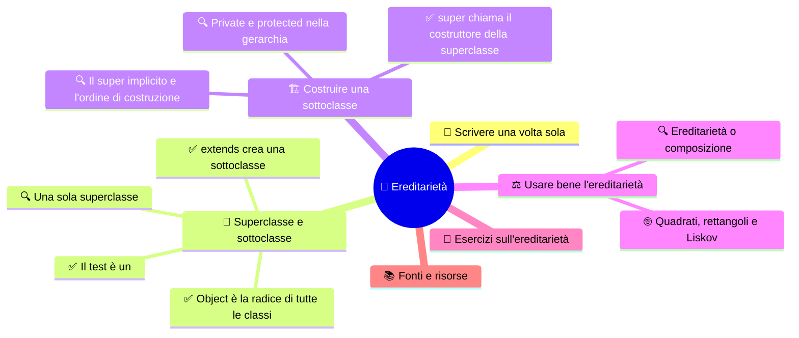

# 🌳 Ereditarietà

**4CI · Settembre-Ottobre · S4 · Teoria**

> **Legenda:** ✅ da sapere · 🔍 per capire fino in fondo · 🤓 facoltativo, per curiosi · 🃏 flashcard: rispondi a voce, poi apri per controllare



## 🧭 Scrivere una volta sola

Nel 1735 il naturalista svedese **Carl Linnaeus**, in italiano Linneo, pubblica il *Systema Naturae*. Per la prima volta mette ordine tra piante e animali con un albero di categorie: regno, classe, ordine, genere, specie. Un'idea potente: ciò che vale per tutti i mammiferi lo dici una volta sola, al livello «mammiferi», e vale automaticamente per cani, mucche e balene.

Ora salta a un gruppo di ragazzi che programma un videogioco. Ci sono il `Guerriero`, il `Mago` e l'`Arciere`. Ognuno ha nome, punti vita e un metodo `subisciDanno`. Il codice viene scritto per il guerriero, poi **copiato e incollato** due volte.

Un mese dopo si scopre un bug: i punti vita possono scendere sotto zero. Qualcuno lo corregge nel `Guerriero`. Ma si dimentica il `Mago`. I maghi diventano immortali con vita negativa e i giocatori se ne accorgono subito.

Il problema non è la lunghezza del codice. È che **la stessa regola vive in tre posti** e prima o poi le tre copie divergono. Nel 1999 il libro *The Pragmatic Programmer* ha dato un nome a questo principio: **DRY**, *Don't Repeat Yourself*, non ripeterti.

L'**ereditarietà** è uno degli strumenti della OOP per scrivere una regola **una volta sola** e farla valere per tutta una famiglia di classi. È il secondo dei quattro principi.

## 🌳 Superclasse e sottoclasse

### ✅ extends crea una sottoclasse

L'**ereditarietà** permette di creare una nuova classe a partire da una esistente. La nuova classe **riceve** attributi e metodi dell'altra e può **aggiungerne** di propri.

- La classe di partenza si chiama **superclasse**, o classe *base*, o *padre*.
- La nuova classe si chiama **sottoclasse**, o classe *derivata*, o *figlia*.

In Java si usa la parola chiave **`extends`**:

**Codice 1**

```java
public class Animale {
    private String nome;
    private String verso;
    private int numeroZampe;
    private double peso;

    public Animale(String nome, String verso, int numeroZampe, double peso) {
        this.nome = nome;
        this.verso = verso;
        this.numeroZampe = numeroZampe;
        this.peso = peso;
    }

    public String getNome() { return nome; }
    public double getPeso() { return peso; }

    public void mangia(double chili) {
        if (chili > 0) {
            peso = peso + chili;
        }
    }

    public void faiVerso() {
        System.out.println(nome + " fa: " + verso);
    }
}
```

```java
public class Pollo extends Animale {
    private String colorePiume;

    public Pollo(String nome, double peso, String colorePiume) {
        super(nome, "Coccodè!", 2, peso);
        this.colorePiume = colorePiume;
    }

    public void razzola() {
        System.out.println(getNome() + " razzola nel terreno.");
    }
}
```

Un `Pollo` sa fare **tutto** ciò che sa fare un `Animale` più ciò che aggiunge:

```java
Pollo pio = new Pollo("Pio", 1.8, "bianco");
pio.mangia(0.1);     // ereditato da Animale
pio.faiVerso();      // ereditato da Animale
pio.razzola();       // aggiunto da Pollo
```

La gerarchia si disegna come un albero con la superclasse in alto:

```text
               Animale
             /         \
         Pollo         Mucca
     colorePiume       razza
     razzola()         produciLatte()
```

Ciò che è comune sta in alto, ciò che è specifico sta in basso. Se correggiamo `mangia` in `Animale`, la correzione vale per tutti.

<details>
<summary>🃏 Che cos'è l'ereditarietà?</summary>
Il meccanismo con cui una nuova classe riceve attributi e metodi di una classe esistente e può aggiungerne di propri.
</details>
<details>
<summary>🃏 Come si chiamano la classe di partenza e la nuova classe?</summary>
Superclasse, o classe base o padre, e sottoclasse, o classe derivata o figlia.
</details>
<details>
<summary>🃏 Quale parola chiave si usa in Java per l'ereditarietà?</summary>
extends, per esempio class Pollo extends Animale.
</details>
<details>
<summary>🃏 Che cosa sa fare un oggetto Pollo se Pollo estende Animale?</summary>
Tutto ciò che sa fare un Animale più i metodi aggiunti da Pollo, come razzola().
</details>
<details>
<summary>🃏 Dove si mettono attributi e metodi comuni in una gerarchia?</summary>
Nella superclasse, in alto. Le cose specifiche stanno nelle sottoclassi.
</details>
<details>
<summary>🃏 Quale principio di programmazione dice di non ripetere la stessa regola in più punti?</summary>
DRY, Don't Repeat Yourself.
</details>
<details>
<summary>🃏 Perché copiare e incollare codice tra classi è pericoloso?</summary>
Perché la stessa regola vive in più punti: quando la correggi in uno, rischi di dimenticare gli altri e le copie divergono.
</details>

### ✅ Il test è un

Come capire se l'ereditarietà è la scelta giusta? Prova a dire la frase **«è un»**:

| Frase | Vera? | Relazione |
| --- | --- | --- |
| Un `Pollo` **è un** `Animale` | ✅ | ereditarietà: `Pollo extends Animale` |
| Uno `Studente` **è una** `Persona` | ✅ | ereditarietà: `Studente extends Persona` |
| Un `Recinto` **è un** `Animale` | ❌ | niente ereditarietà |
| Un `Recinto` **ha degli** `Animale` | ✅ | attributo: il recinto contiene animali |
| Un'`Auto` **ha un** `Motore` | ✅ | attributo: l'auto contiene un motore |

Se la frase giusta è **«ha un»**, la relazione non è ereditarietà ma **composizione**: un oggetto contiene un altro oggetto come attributo.

**Un esempio reale: il registro elettronico.**

```text
                 Persona
           nome, cognome, codiceFiscale
              /               \
        Studente             Docente
      matricola, voti      materie, orario
```

Studente e docente condividono i dati anagrafici, ma ognuno ha i suoi dati specifici.

<details>
<summary>🃏 Qual è il test per decidere se usare l'ereditarietà?</summary>
La frase «è un» deve essere vera: un Pollo è un Animale.
</details>
<details>
<summary>🃏 Se la frase giusta è «ha un», quale relazione serve?</summary>
La composizione: un oggetto contiene l'altro come attributo.
</details>
<details>
<summary>🃏 Recinto dovrebbe estendere Animale? Perché?</summary>
No. Un recinto non è un animale: un recinto ha degli animali, quindi serve un attributo.
</details>
<details>
<summary>🃏 Nel registro elettronico, quale superclasse possono avere Studente e Docente?</summary>
Persona, con i dati comuni come nome, cognome e codice fiscale.
</details>
<details>
<summary>🃏 Che cos'è la composizione?</summary>
Una relazione in cui un oggetto contiene un altro oggetto come attributo, per esempio un'auto che ha un motore.
</details>

### ✅ Object è la radice di tutte le classi

Se una classe non scrive `extends`, da chi eredita? Da **`Object`**.

`Object` è la classe in cima a **tutte** le gerarchie Java. Ogni classe, anche quelle che scrivi tu, ne è sottoclasse, direttamente o indirettamente.

```text
                  Object
           /        |        \
      Animale     String    Studente   ...
      /     \
  Pollo    Mucca
```

Per questo ogni oggetto Java sa già fare alcune cose, ereditate da `Object`. La più famosa è **`toString()`**, che restituisce una descrizione testuale dell'oggetto. È lei che `System.out.println` chiama quando gli passi un oggetto. Senza interventi stampa qualcosa come `Pollo@1b6d3586`: il nome della classe e un codice. Nella prossima settimana impareremo a cambiarla.

<details>
<summary>🃏 Da quale classe eredita una classe che non scrive extends?</summary>
Da Object.
</details>
<details>
<summary>🃏 Che cos'è la classe Object?</summary>
La radice di tutte le gerarchie Java: ogni classe ne è sottoclasse, direttamente o indirettamente.
</details>
<details>
<summary>🃏 Che cosa fa il metodo toString() ereditato da Object?</summary>
Restituisce una descrizione testuale dell'oggetto. Senza modifiche contiene il nome della classe e un codice, per esempio Pollo@1b6d3586.
</details>
<details>
<summary>🃏 Quale metodo chiama System.out.println quando riceve un oggetto?</summary>
toString().
</details>

### 🔍 Una sola superclasse

In Java una classe può estendere **una sola** superclasse. Questa si chiama **ereditarietà singola**.

```java
public class Anatra extends Uccello, Nuotatore { }   // NON compila
```

Perché questo limite? Immagina che `Uccello` e `Nuotatore` abbiano entrambi un metodo `muoviti()` diverso. Quale deve ereditare l'anatra? E se entrambi estendessero `Animale`, l'anatra avrebbe due copie degli attributi di `Animale`? Questo groviglio si chiama **problema del diamante**, per la forma del disegno:

```text
          Animale
         /       \
    Uccello    Nuotatore
         \       /
          Anatra       ← quale muoviti()? quante copie di nome?
```

Il C++ permette l'ereditarietà multipla e offre regole complicate per gestirla. Java ha scelto la strada semplice: **una sola superclasse**. Per descrivere capacità multiple, come «sa volare» e «sa nuotare», userà le **interfacce**, che vedremo in S6.

Una gerarchia può comunque avere **molti livelli**: `Animale → Uccello → Gallina`. La gallina eredita da uccello, che eredita da animale, che eredita da `Object`.

<details>
<summary>🃏 Quante superclassi può estendere una classe Java?</summary>
Una sola. Si chiama ereditarietà singola.
</details>
<details>
<summary>🃏 Che cos'è il problema del diamante?</summary>
Quando una classe eredita da due classi che hanno un antenato o un metodo in comune, non è chiaro quale versione usare né quante copie degli attributi tenere.
</details>
<details>
<summary>🃏 Quale linguaggio permette l'ereditarietà multipla tra classi?</summary>
Il C++.
</details>
<details>
<summary>🃏 Che cosa usa Java per descrivere più capacità di una classe, visto che non ha l'ereditarietà multipla?</summary>
Le interfacce.
</details>
<details>
<summary>🃏 Una gerarchia Java può avere più di due livelli?</summary>
Sì, per esempio Animale, Uccello, Gallina. Ogni classe ha una sola superclasse diretta.
</details>

## 🏗️ Costruire una sottoclasse

### ✅ super chiama il costruttore della superclasse

Un oggetto `Pollo` contiene **due parti**: quella ereditata da `Animale` e quella aggiunta da `Pollo`.

```text
oggetto Pollo
├── parte Animale:  nome, verso, numeroZampe, peso
└── parte Pollo:    colorePiume
```

Ogni parte deve essere inizializzata da chi la conosce. La parte `Animale` la inizializza il costruttore di `Animale`. Per chiamarlo, il costruttore di `Pollo` usa **`super(...)`**:

```java
public Pollo(String nome, double peso, String colorePiume) {
    super(nome, "Coccodè!", 2, peso);   // inizializza la parte Animale
    this.colorePiume = colorePiume;     // inizializza la parte Pollo
}
```

Regole:

- i **costruttori non si ereditano**: ogni classe ha i suoi;
- `super(...)` chiama un costruttore della **superclasse diretta**;
- `super(...)` deve essere la **prima istruzione** del costruttore;
- gli argomenti di `super(...)` devono corrispondere a un costruttore che esiste davvero nella superclasse.

Nota il trucco: un `Pollo` ha sempre 2 zampe e fa sempre «Coccodè!». Il costruttore di `Pollo` non chiede questi valori: li passa lui stesso alla superclasse.

> 🔧 **In laboratorio:** nel progetto `LaStalla`, `Pollo` e `Mucca` estendono `Animale` e chiamano `super(...)` con i loro valori fissi.

<details>
<summary>🃏 Quali parti contiene un oggetto Pollo se Pollo estende Animale?</summary>
La parte ereditata da Animale e la parte aggiunta da Pollo.
</details>
<details>
<summary>🃏 Che cosa fa super(...) dentro un costruttore?</summary>
Chiama un costruttore della superclasse diretta, che inizializza la parte ereditata dell'oggetto.
</details>
<details>
<summary>🃏 I costruttori si ereditano?</summary>
No. Ogni classe ha i suoi costruttori. La sottoclasse può chiamare quelli della superclasse con super(...).
</details>
<details>
<summary>🃏 In quale posizione deve stare super(...) in un costruttore?</summary>
Deve essere la prima istruzione.
</details>
<details>
<summary>🃏 Perché il costruttore di Pollo non chiede il numero di zampe?</summary>
Perché un pollo ha sempre 2 zampe: il costruttore passa da solo quel valore a super(...).
</details>

### 🔍 Il super implicito e l'ordine di costruzione

Che cosa succede se il costruttore di una sottoclasse **non** scrive `super(...)`? Il compilatore inserisce da solo **`super()`**, senza argomenti.

Questo può causare un errore inatteso:

**Codice 2**

```java
public class Animale {
    private String nome;
    public Animale(String nome) {
        this.nome = nome;
    }
}

public class Gatto extends Animale {
    public Gatto() {
        // il compilatore inserisce super(); qui
    }
}
```

Il codice 2 **non compila**: `Animale` non ha un costruttore senza parametri, quindi `super()` non trova niente da chiamare. Ricorda la regola di S2: appena scrivi un costruttore, quello di default sparisce.

E in che ordine vengono eseguiti i costruttori? Ogni costruttore, come prima cosa, chiama quello della superclasse. Quindi i **corpi** vengono eseguiti **dall'alto verso il basso**:

**Codice 3**

```java
class A { A() { System.out.println("A"); } }
class B extends A { B() { System.out.println("B"); } }
class C extends B { C() { System.out.println("C"); } }
```

`new C()` stampa `A`, poi `B`, poi `C`. Prima si costruiscono le fondamenta, poi i piani superiori. Anzi, ancora prima di `A` viene eseguito il costruttore di `Object`.

<details>
<summary>🃏 Che cosa fa il compilatore se un costruttore di sottoclasse non scrive super(...)?</summary>
Inserisce da solo super(), cioè la chiamata al costruttore senza parametri della superclasse.
</details>
<details>
<summary>🃏 Perché il codice 2 non compila?</summary>
Perché il compilatore inserisce super() nel costruttore di Gatto, ma Animale non ha un costruttore senza parametri.
</details>
<details>
<summary>🃏 Che cosa stampa new C() nel codice 3?</summary>
A, poi B, poi C.
</details>
<details>
<summary>🃏 In che ordine vengono eseguiti i corpi dei costruttori in una gerarchia?</summary>
Dall'alto verso il basso: prima la superclasse più in alto, poi giù fino alla classe dell'oggetto.
</details>
<details>
<summary>🃏 Perché la superclasse viene costruita per prima?</summary>
Perché la sottoclasse si appoggia sulla parte ereditata e deve trovarla già pronta.
</details>

### 🔍 Private e protected nella gerarchia

Un errore comune è pensare che gli attributi `private` della superclasse **non vengano ereditati**. In realtà ci sono: un oggetto `Pollo` ha davvero un `nome` e un `peso`. Però la classe `Pollo` **non può accedervi direttamente**:

```java
public void razzola() {
    System.out.println(nome + " razzola");       // NON compila: nome è private in Animale
    System.out.println(getNome() + " razzola");  // corretto: usa il getter pubblico
}
```

L'ereditarietà **non annulla** l'incapsulamento. Anche la sottoclasse deve passare dallo «sportello» della superclasse.

Se la superclasse vuole concedere un accesso diretto alle sole sottoclassi, può usare **`protected`**:

```java
public class Animale {
    protected double peso;   // visibile alle sottoclassi e al pacchetto
}
```

`protected` è comodo, ma indebolisce le invarianti: ogni sottoclasse, anche scritta da altri, potrebbe mettere un peso negativo. Per questo molti programmatori preferiscono attributi `private` e metodi `protected` o `public` con i controlli.

<details>
<summary>🃏 Gli attributi private della superclasse esistono negli oggetti della sottoclasse?</summary>
Sì, esistono, ma la sottoclasse non può accedervi direttamente.
</details>
<details>
<summary>🃏 Come accede una sottoclasse a un attributo private della superclasse?</summary>
Attraverso i metodi pubblici o protected della superclasse, come i getter.
</details>
<details>
<summary>🃏 L'ereditarietà annulla l'incapsulamento?</summary>
No. Anche la sottoclasse deve rispettare la parte privata della superclasse.
</details>
<details>
<summary>🃏 Che effetto ha dichiarare protected un attributo della superclasse?</summary>
Le sottoclassi e le classi del pacchetto possono accedervi direttamente.
</details>
<details>
<summary>🃏 Perché un attributo protected può essere rischioso?</summary>
Perché qualunque sottoclasse può modificarlo senza controlli e rompere le invarianti della superclasse.
</details>

## ⚖️ Usare bene l'ereditarietà

### 🔍 Ereditarietà o composizione

L'ereditarietà è potente, ma **lega** molto le classi. La sottoclasse dipende dai dettagli della superclasse: se la superclasse cambia, la sottoclasse può rompersi.

Per questo un consiglio famoso, reso celebre dal libro *Design Patterns* della «Gang of Four» nel 1994, dice: **preferisci la composizione all'ereditarietà**. Usa `extends` solo quando la relazione è davvero «è un». Se vuoi solo **riusare** del codice, spesso è meglio che un oggetto **contenga** un altro oggetto e gli chieda di fare il lavoro.

```java
public class Recinto {
    private String nome;
    private Animale[] ospiti = new Animale[10];   // composizione: il recinto HA animali
}
```

Anche i progettisti di Java hanno sbagliato. Nella libreria standard, la classe `Stack`, una pila, **estende** `Vector`, una lista. Il risultato è che su una pila puoi inserire elementi **in mezzo**, cosa che una pila non dovrebbe permettere. Una pila non «è una» lista: «usa» una lista. L'errore è rimasto per compatibilità e la documentazione oggi consiglia altre classi.

| Usa l'ereditarietà quando... | Usa la composizione quando... |
| --- | --- |
| la frase «è un» è vera sempre | la frase giusta è «ha un» o «usa un» |
| la sottoclasse può sostituire la superclasse ovunque | vuoi solo riusare un pezzo di codice |
| la gerarchia è stabile | le parti possono cambiare o essere sostituite |

<details>
<summary>🃏 Perché l'ereditarietà lega molto le classi?</summary>
Perché la sottoclasse dipende dai dettagli della superclasse: se la superclasse cambia, la sottoclasse può rompersi.
</details>
<details>
<summary>🃏 Che cosa dice il consiglio della Gang of Four su ereditarietà e composizione?</summary>
Preferisci la composizione all'ereditarietà: usa extends solo per vere relazioni «è un».
</details>
<details>
<summary>🃏 Qual è l'errore di progetto della classe Stack di Java?</summary>
Stack estende Vector, quindi su una pila si possono inserire elementi in mezzo. Una pila non è una lista, ma usa una lista.
</details>
<details>
<summary>🃏 Quando conviene la composizione invece dell'ereditarietà?</summary>
Quando la relazione è «ha un» o «usa un», quando si vuole solo riusare codice o quando le parti possono cambiare.
</details>

### 🤓 Quadrati, rettangoli e Liskov

> In matematica un quadrato **è un** rettangolo. Allora `Quadrato extends Rettangolo` è perfetto, no?
>
> Immagina che `Rettangolo` abbia `setBase(double)` e `setAltezza(double)`, indipendenti. Un `Quadrato` deve tenere base e altezza uguali, quindi quando cambi la base cambia anche l'altezza. Ora prendi un pezzo di codice scritto per i rettangoli:
>
> ```java
> r.setBase(5);
> r.setAltezza(2);
> System.out.println(r.area());   // il programmatore si aspetta 10
> ```
>
> Se `r` è un `Quadrato`, l'area stampata è 4. Il codice che funzionava con tutti i rettangoli si rompe con un quadrato.
>
> Nel 1987 l'informatica statunitense **Barbara Liskov** ha formulato il principio che spiega il problema: un oggetto della sottoclasse deve poter **sostituire** un oggetto della superclasse **senza rompere** il programma. Si chiama **principio di sostituzione di Liskov**. Nel 2008 Liskov ha ricevuto il **premio Turing**, il «Nobel dell'informatica», ed è stata una delle prime donne negli Stati Uniti a ottenere un dottorato in informatica.
>
> Morale: nel codice la frase «è un» riguarda il **comportamento**, non la definizione del vocabolario. Il codice non è biologia, e nemmeno geometria.

<details>
<summary>🃏 Perché Quadrato extends Rettangolo può creare problemi?</summary>
Se Rettangolo permette di cambiare base e altezza in modo indipendente, un Quadrato non può farlo. Il codice scritto per i rettangoli dà risultati sbagliati con un quadrato.
</details>
<details>
<summary>🃏 Che cosa dice il principio di sostituzione di Liskov?</summary>
Un oggetto della sottoclasse deve poter sostituire un oggetto della superclasse senza rompere il programma.
</details>
<details>
<summary>🃏 Chi è Barbara Liskov?</summary>
Un'informatica statunitense che nel 1987 ha formulato il principio di sostituzione e nel 2008 ha ricevuto il premio Turing.
</details>
<details>
<summary>🃏 Nel codice, la relazione «è un» riguarda la definizione o il comportamento?</summary>
Il comportamento: la sottoclasse deve comportarsi come ci si aspetta dalla superclasse.
</details>

## 🧩 Esercizi sull'ereditarietà

1. Scrivi la classe `Mucca extends Animale` con l'attributo `razza`, un costruttore che usa `super(...)` e il metodo `produciLatte()`.
2. Per ogni coppia, scrivi se la relazione è «è un» o «ha un» e come la tradurresti in Java: `Biblioteca`–`Libro`, `Smartphone`–`Dispositivo`, `Squadra`–`Giocatore`, `Bicicletta`–`Veicolo`, `Ordine`–`Prodotto`.
3. Disegna una gerarchia per un videogioco con `Personaggio`, `Guerriero`, `Mago` e `Arciere`. Scrivi per ogni classe almeno un attributo e un metodo.
4. Trova l'errore e correggilo in due modi diversi:
   ```java
   public class Veicolo {
       private String targa;
       public Veicolo(String targa) { this.targa = targa; }
   }
   public class Moto extends Veicolo {
       private int cilindrata;
       public Moto(int cilindrata) { this.cilindrata = cilindrata; }
   }
   ```
5. Prevedi l'output di `new Gallina()`:
   ```java
   class Animale { Animale() { System.out.println("Nasce un animale"); } }
   class Uccello extends Animale { Uccello() { System.out.println("Spuntano le ali"); } }
   class Gallina extends Uccello { Gallina() { System.out.println("Coccodè!"); } }
   ```
6. Un compagno vuole scrivere `class Recinto extends Animale` «per riusare il nome». Spiegagli perché è un errore e che cosa fare invece.

## 📚 Fonti e risorse

- [Oracle — Inheritance](https://docs.oracle.com/javase/tutorial/java/IandI/subclasses.html): la spiegazione ufficiale di `extends` e delle sottoclassi.
- [Oracle — Using the Keyword super](https://docs.oracle.com/javase/tutorial/java/IandI/super.html): `super(...)` e l'ordine dei costruttori.
- [Oracle — Object as a Superclass](https://docs.oracle.com/javase/tutorial/java/IandI/objectclass.html): i metodi che ogni classe eredita da `Object`.
- [Documentazione di java.util.Stack](https://docs.oracle.com/en/java/javase/21/docs/api/java.base/java/util/Stack.html): leggi la nota iniziale, che consiglia un'altra classe.
- Andrew Hunt e David Thomas, *The Pragmatic Programmer*, 1999: il libro che ha reso famoso il principio DRY.
- Barbara Liskov, *Data Abstraction and Hierarchy*, 1987: l'intervento in cui nasce il principio di sostituzione. Per chi legge l'inglese.

---

[⬅️ S3 - Incapsulamento](%28STU%29%204CI%20sett-ott%20S3%20-%20Incapsulamento.md) · [🗺️ Indice](%28STU%29%204CI%20-%20SETT-OTT.md) · [➡️ S5 - Polimorfismo e casting](%28STU%29%204CI%20sett-ott%20S5%20-%20Polimorfismo%20e%20casting.md)
