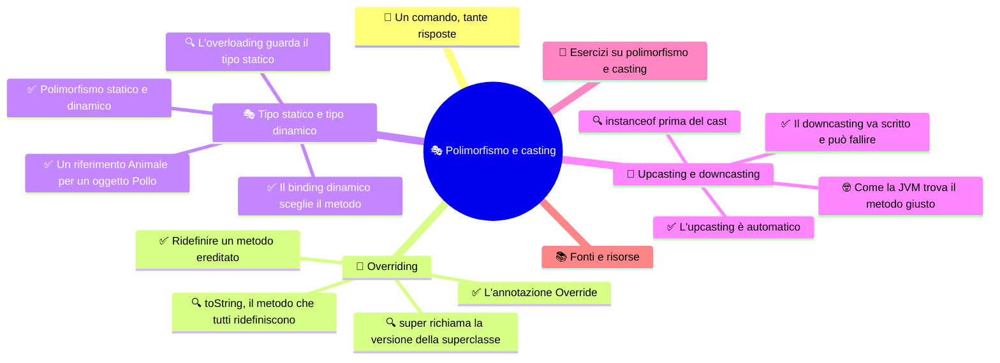

# 🎭 Polimorfismo e casting

**4CI · Settembre-Ottobre · S5 · Teoria**

> **Legenda:** ✅ da sapere · 🔍 per capire fino in fondo · 🤓 facoltativo, per curiosi · 🃏 flashcard: rispondi a voce, poi apri per controllare



## 🧭 Un comando, tante risposte

Quando una persona ti scrive su un'app di messaggi, il tuo telefono ti avvisa. Ma come? Dipende: può vibrare, mostrare un banner, mandarti una email, accendere lo smartwatch. Il server dell'app non sa niente di tutto questo. Dice soltanto: **«notifica!»**. Ogni dispositivo risponde a modo suo.

Senza OOP, il codice del server sarebbe una lunga catena di `if`:

```java
if (tipo.equals("email")) {
    // manda una email
} else if (tipo.equals("sms")) {
    // manda un SMS
} else if (tipo.equals("push")) {
    // manda una notifica push
}
```

Ogni volta che arriva un nuovo canale, per esempio lo smartwatch, bisogna trovare **tutti** gli `if` sparsi nel programma e aggiungere un caso. Se ne dimentichi uno, qualcuno non riceve la notifica.

Con la OOP il server dice solo `canale.invia(messaggio)`. Ogni tipo di canale sa come farlo. Aggiungere lo smartwatch significa scrivere **una nuova classe**, senza toccare il codice che già funziona.

Questa capacità si chiama **polimorfismo**, dal greco *polýs*, «molti», e *morphḗ*, «forma»: molte forme. Nel 1967 l'informatico britannico **Christopher Strachey**, durante una scuola estiva a Copenaghen, la usò per primo in informatica e ne distinse due tipi. È il terzo dei quattro principi della OOP, e per molti programmatori è il più potente.

## 🔁 Overriding

### ✅ Ridefinire un metodo ereditato

In S4 tutti gli animali facevano il verso con lo stesso metodo, leggendo un attributo `verso`. Funziona finché il comportamento è solo una stringa diversa. Ma un pollo che fa il verso potrebbe anche sbattere le ali; una mucca potrebbe muovere la coda. Comportamenti **diversi**, non solo testi diversi.

Una sottoclasse può **ridefinire** un metodo ereditato, scrivendone una nuova versione con **la stessa firma**. Questo si chiama **overriding**, in italiano *sovrascrittura*.

**Codice 1**

```java
public class Animale {
    private String nome;

    public Animale(String nome) {
        this.nome = nome;
    }

    public String getNome() {
        return nome;
    }

    public void faiVerso() {
        System.out.println(nome + " fa un verso.");
    }
}
```

```java
public class Pollo extends Animale {
    public Pollo(String nome) {
        super(nome);
    }

    @Override
    public void faiVerso() {
        System.out.println(getNome() + " fa: Coccodè! e sbatte le ali.");
    }
}

public class Mucca extends Animale {
    public Mucca(String nome) {
        super(nome);
    }

    @Override
    public void faiVerso() {
        System.out.println(getNome() + " fa: Muuu! e muove la coda.");
    }
}
```

Quando chiami `faiVerso()` su un `Pollo`, viene eseguita la versione di `Pollo`. La versione di `Animale` resta valida per le sottoclassi che **non** la ridefiniscono.

Le regole dell'overriding:

- **stesso nome** e **stessi parametri** del metodo ereditato;
- **stesso tipo di ritorno** (o un suo sottotipo);
- la visibilità **non può diminuire**: un metodo `public` resta `public`.

**Un esempio reale.** Le notifiche dell'introduzione:

```java
public class Canale {
    public void invia(String testo) {
        System.out.println("Messaggio: " + testo);
    }
}

public class Email extends Canale {
    @Override
    public void invia(String testo) {
        System.out.println("📧 Email inviata: " + testo);
    }
}

public class Sms extends Canale {
    @Override
    public void invia(String testo) {
        System.out.println("📱 SMS inviato: " + testo);
    }
}
```

<details>
<summary>🃏 Che cos'è l'overriding?</summary>
Ridefinire in una sottoclasse un metodo ereditato, con la stessa firma, per cambiarne il comportamento.
</details>
<details>
<summary>🃏 Come si dice overriding in italiano?</summary>
Sovrascrittura, o ridefinizione.
</details>
<details>
<summary>🃏 Quali regole deve rispettare un metodo che fa overriding?</summary>
Stesso nome e stessi parametri, stesso tipo di ritorno o un suo sottotipo, visibilità non ridotta.
</details>
<details>
<summary>🃏 Se Mucca non ridefinisce faiVerso(), quale versione viene eseguita su un oggetto Mucca?</summary>
Quella ereditata da Animale.
</details>
<details>
<summary>🃏 Un metodo public della superclasse può diventare private nella sottoclasse?</summary>
No, la visibilità non può diminuire.
</details>
<details>
<summary>🃏 Perché ridefinire un metodo è più potente che cambiare un attributo come verso?</summary>
Perché ogni sottoclasse può avere un comportamento davvero diverso, non solo un testo diverso.
</details>

### ✅ L'annotazione Override

Sopra ogni metodo ridefinito abbiamo scritto **`@Override`**. È un'**annotazione**: un'indicazione per il compilatore. Gli dice: «questo metodo deve ridefinire un metodo ereditato; controlla che sia vero».

Perché serve? Guarda questo errore di battitura:

**Codice 2**

```java
public class Pollo extends Animale {
    public void faiVersi() {   // una s di troppo
        System.out.println("Coccodè!");
    }
}
```

Senza `@Override`, il codice compila. Java pensa che `faiVersi()` sia un **nuovo** metodo. Quando chiami `faiVerso()` su un pollo, parte la versione generica di `Animale`. Il bug è silenzioso e può restare nascosto per settimane.

Con `@Override` sopra `faiVersi()`, il compilatore dà subito errore: *method does not override or implement a method from a supertype*. L'errore diventa visibile in un secondo.

Regola pratica: **metti sempre `@Override`** quando ridefinisci un metodo.

<details>
<summary>🃏 Che cosa fa l'annotazione @Override?</summary>
Chiede al compilatore di controllare che il metodo ridefinisca davvero un metodo ereditato.
</details>
<details>
<summary>🃏 Nel codice 2, che cosa succede senza @Override?</summary>
Il codice compila, ma faiVersi() è un metodo nuovo. Chiamando faiVerso() su un pollo parte la versione di Animale: il bug è silenzioso.
</details>
<details>
<summary>🃏 Che cosa succede nel codice 2 se metti @Override sopra faiVersi()?</summary>
Il compilatore dà errore, perché faiVersi() non ridefinisce nessun metodo ereditato.
</details>
<details>
<summary>🃏 Che cos'è un'annotazione in Java?</summary>
Un'indicazione scritta con @ che dà informazioni al compilatore o ad altri strumenti, come @Override.
</details>

### 🔍 super richiama la versione della superclasse

A volte non vogliamo **sostituire** del tutto il comportamento ereditato, ma **aggiungere** qualcosa. Dentro un metodo ridefinito possiamo chiamare la versione della superclasse con **`super.nomeMetodo()`**:

```java
@Override
public void faiVerso() {
    super.faiVerso();   // "Pio fa un verso."
    System.out.println("...e sbatte le ali.");
}
```

Non c'è ciclo infinito: `super.faiVerso()` chiama proprio la versione di `Animale`, non quella di `Pollo`.

Ricapitoliamo i tre usi di `super` e `this`:

| Scrittura | Significato |
| --- | --- |
| `this.nome` | attributo dell'oggetto corrente |
| `this(...)` | altro costruttore della stessa classe |
| `super(...)` | costruttore della superclasse |
| `super.metodo()` | versione del metodo scritta nella superclasse |

<details>
<summary>🃏 Che cosa fa super.faiVerso() dentro un metodo ridefinito?</summary>
Chiama la versione di faiVerso scritta nella superclasse.
</details>
<details>
<summary>🃏 Quando si usa super.metodo() invece di riscrivere tutto?</summary>
Quando si vuole aggiungere comportamento a quello ereditato invece di sostituirlo del tutto.
</details>
<details>
<summary>🃏 super.faiVerso() dentro Pollo.faiVerso() crea un ciclo infinito?</summary>
No, perché chiama la versione di Animale, non quella di Pollo.
</details>
<details>
<summary>🃏 Qual è la differenza tra super(...) e super.metodo()?</summary>
super(...) chiama un costruttore della superclasse. super.metodo() chiama la versione di un metodo scritta nella superclasse.
</details>

### 🔍 toString, il metodo che tutti ridefiniscono

In S4 abbiamo visto che ogni classe eredita `toString()` da `Object`, e che `System.out.println(oggetto)` stampa qualcosa come `Pollo@1b6d3586`.

Ora possiamo ridefinirlo:

```java
@Override
public String toString() {
    return "Pollo " + getNome();
}
```

```java
Pollo pio = new Pollo("Pio");
System.out.println(pio);            // Pollo Pio
String s = "Ho visto " + pio;       // "Ho visto Pollo Pio"
```

`println` e la concatenazione con `+` chiamano `toString()` **da sole**. È il primo esempio di un fatto importante: una libreria scritta anni fa, che non conosce la tua classe `Pollo`, chiama il **tuo** metodo. Questo è il polimorfismo al lavoro.

<details>
<summary>🃏 Perché si ridefinisce spesso toString()?</summary>
Per ottenere una descrizione leggibile dell'oggetto invece di nome della classe e codice.
</details>
<details>
<summary>🃏 Quando viene chiamato toString() automaticamente?</summary>
Quando si passa un oggetto a System.out.println o lo si concatena a una stringa con +.
</details>
<details>
<summary>🃏 Che tipo di ritorno deve avere toString()?</summary>
String, ed è public, come in Object.
</details>
<details>
<summary>🃏 Perché println che chiama il tuo toString è un esempio di polimorfismo?</summary>
Perché un codice scritto prima della tua classe, che non la conosce, esegue la versione del metodo ridefinita da te.
</details>

## 🎭 Tipo statico e tipo dinamico

### ✅ Un riferimento Animale per un oggetto Pollo

Un pollo **è un** animale. Per questo Java permette di scrivere:

```java
Animale a = new Pollo("Pio");
```

La variabile è di tipo `Animale`, ma l'oggetto creato è un `Pollo`. Ci sono due tipi diversi in gioco:

- il **tipo statico** è quello **dichiarato** per la variabile: `Animale`. Lo conosce il compilatore;
- il **tipo dinamico** è la **classe reale** dell'oggetto creato con `new`: `Pollo`. Si scopre durante l'esecuzione.

```text
  tipo statico: Animale              tipo dinamico: Pollo
        │                                   │
a  [ ●──┼───────────────────────────▶ ]  Pollo { nome="Pio" }
```

Il **compilatore** guarda solo il tipo statico per decidere che cosa **puoi chiamare**:

```java
a.faiVerso();   // compila: Animale ha faiVerso()
a.getNome();    // compila: Animale ha getNome()
a.razzola();    // NON compila: Animale non ha razzola()
```

Anche se l'oggetto è davvero un `Pollo`, il compilatore vede solo un `Animale`. È prudente: in quella variabile potrebbe esserci anche una mucca.

<details>
<summary>🃏 Che cos'è il tipo statico di una variabile?</summary>
Il tipo con cui la variabile è dichiarata. Lo usa il compilatore.
</details>
<details>
<summary>🃏 Che cos'è il tipo dinamico?</summary>
La classe reale dell'oggetto a cui punta la variabile, scelta con new. Conta durante l'esecuzione.
</details>
<details>
<summary>🃏 In Animale a = new Pollo("Pio"), qual è il tipo statico e quale il dinamico?</summary>
Il tipo statico è Animale, il tipo dinamico è Pollo.
</details>
<details>
<summary>🃏 Perché Java permette Animale a = new Pollo("Pio")?</summary>
Perché un Pollo è un Animale: può stare ovunque serva un Animale.
</details>
<details>
<summary>🃏 Con Animale a = new Pollo("Pio"), la riga a.razzola() compila?</summary>
No. Il compilatore guarda il tipo statico Animale, che non ha razzola().
</details>
<details>
<summary>🃏 Quale tipo usa il compilatore per decidere quali metodi si possono chiamare?</summary>
Il tipo statico.
</details>

### ✅ Il binding dinamico sceglie il metodo

Il compilatore ha detto che `a.faiVerso()` si può chiamare. Ma **quale** versione verrà eseguita, quella di `Animale` o quella di `Pollo`?

Quella di **`Pollo`**. Durante l'esecuzione la JVM guarda l'oggetto **reale** e sceglie la sua versione del metodo. Questa scelta all'ultimo momento si chiama **binding dinamico**, o *late binding*.

```text
a.faiVerso()
   │
   ├─ COMPILATORE: Animale ha faiVerso()?   sì → compila      (tipo statico)
   │
   └─ JVM: che oggetto c'è davvero?          Pollo → Pollo.faiVerso()   (tipo dinamico)
```

Ecco perché il polimorfismo è così utile:

**Codice 3**

```java
Animale[] stalla = {
    new Pollo("Pio"),
    new Mucca("Carolina"),
    new Pollo("Cip")
};

for (Animale x : stalla) {
    x.faiVerso();
}
```

Il ciclo parla solo di `Animale`. Ma ogni animale risponde a modo suo. Domani aggiungi la classe `Capra` con il suo `faiVerso()`: il ciclo **non cambia**.

Lo stesso vale per le notifiche:

```java
Canale[] canali = { new Email(), new Sms(), new Email() };
for (Canale c : canali) {
    c.invia("Domani verifica di informatica!");
}
```

> 🔧 **In laboratorio:** nel progetto `LaStalla` costruisci un array `Animale[]` con polli e mucche e osservi quale `faiVerso()` parte a ogni giro.

<details>
<summary>🃏 Che cos'è il binding dinamico?</summary>
La scelta, durante l'esecuzione, di quale versione di un metodo ridefinito eseguire, in base al tipo reale dell'oggetto.
</details>
<details>
<summary>🃏 Con Animale a = new Pollo("Pio"), quale faiVerso() viene eseguito da a.faiVerso()?</summary>
Quello di Pollo, perché conta il tipo dinamico.
</details>
<details>
<summary>🃏 Quale tipo usa la JVM per scegliere quale versione di un metodo ridefinito eseguire?</summary>
Il tipo dinamico, cioè la classe reale dell'oggetto.
</details>
<details>
<summary>🃏 Nel codice 3, perché il ciclo funziona anche con polli e mucche insieme?</summary>
Perché l'array è di tipo Animale e ogni oggetto, grazie al binding dinamico, esegue la propria versione di faiVerso().
</details>
<details>
<summary>🃏 Che cosa bisogna cambiare nel ciclo del codice 3 se si aggiunge la classe Capra?</summary>
Niente. Basta scrivere Capra con il suo faiVerso().
</details>
<details>
<summary>🃏 Come si chiama in inglese il binding dinamico?</summary>
Late binding, o dynamic binding.
</details>

### ✅ Polimorfismo statico e dinamico

Abbiamo incontrato due modi in cui lo **stesso nome** produce comportamenti diversi. Si chiamano **polimorfismo statico** e **polimorfismo dinamico**.

| | Polimorfismo statico | Polimorfismo dinamico |
| --- | --- | --- |
| Meccanismo | **overloading** (S2) | **overriding** |
| Dove | nella **stessa classe** | tra **superclasse e sottoclasse** |
| Firma | **diversa** (parametri diversi) | **identica** |
| Chi sceglie | il **compilatore** | la **JVM** |
| Quando | in **compilazione** | durante l'**esecuzione** |
| In base a | tipi degli **argomenti** | tipo **dinamico** dell'oggetto |
| Esempio | `println(int)`, `println(String)` | `Pollo.faiVerso()`, `Mucca.faiVerso()` |

Un trucco per ricordarle: over**loading** = «caricare» più versioni nella stessa classe; over**riding** = «passare sopra» alla versione del padre.

<details>
<summary>🃏 Che cos'è il polimorfismo statico?</summary>
L'overloading: più metodi con lo stesso nome e parametri diversi nella stessa classe. La scelta avviene in compilazione.
</details>
<details>
<summary>🃏 Che cos'è il polimorfismo dinamico?</summary>
L'overriding con binding dinamico: le sottoclassi ridefiniscono un metodo e la versione viene scelta durante l'esecuzione.
</details>
<details>
<summary>🃏 Nell'overloading la firma dei metodi è uguale o diversa? E nell'overriding?</summary>
Nell'overloading è diversa. Nell'overriding è identica.
</details>
<details>
<summary>🃏 Chi sceglie il metodo nel polimorfismo statico e chi nel dinamico?</summary>
Nel statico il compilatore, nel dinamico la JVM durante l'esecuzione.
</details>
<details>
<summary>🃏 Overloading o overriding: println(int) e println(String)?</summary>
Overloading, polimorfismo statico.
</details>
<details>
<summary>🃏 Overloading o overriding: faiVerso() in Animale e faiVerso() in Pollo?</summary>
Overriding, polimorfismo dinamico.
</details>

### 🔍 L'overloading guarda il tipo statico

Che cosa succede quando overloading e polimorfismo si incontrano?

**Codice 4**

```java
public static void presenta(Animale a) {
    System.out.println("Ecco un animale");
}

public static void presenta(Pollo p) {
    System.out.println("Ecco un pollo");
}
```

```java
Animale a = new Pollo("Pio");
presenta(a);
```

Stampa **«Ecco un animale»**. L'overloading viene scelto dal **compilatore**, che conosce solo il tipo statico dell'argomento: `Animale`. Il fatto che l'oggetto sia un pollo, durante l'esecuzione, non conta.

In Java, solo l'oggetto **su cui** chiami il metodo, quello prima del punto, viene guardato durante l'esecuzione. Gli **argomenti** contano solo con il loro tipo statico.

<details>
<summary>🃏 Nel codice 4, che cosa stampa presenta(a) se a è dichiarata Animale ma punta a un Pollo?</summary>
Ecco un animale, perché l'overloading è scelto dal compilatore con il tipo statico dell'argomento.
</details>
<details>
<summary>🃏 Per scegliere tra metodi sovraccaricati, Java guarda il tipo statico o dinamico degli argomenti?</summary>
Il tipo statico.
</details>
<details>
<summary>🃏 Quale oggetto viene guardato durante l'esecuzione per il binding dinamico?</summary>
Solo quello su cui si chiama il metodo, cioè quello prima del punto.
</details>

## 🔄 Upcasting e downcasting

Un **cast**, in italiano *conversione di tipo*, cambia il tipo con cui guardiamo un valore. Con gli oggetti ci si muove **su e giù** lungo la gerarchia.

```text
        Animale      ▲ upcasting: automatico, sempre sicuro
           │         │
         Pollo       ▼ downcasting: esplicito, può fallire
```

### ✅ L'upcasting è automatico

L'**upcasting** è il passaggio da un tipo **più specifico** a uno **più generale**: da `Pollo` ad `Animale`, salendo nella gerarchia.

```java
Pollo pio = new Pollo("Pio");
Animale a = pio;   // upcasting automatico
```

È **automatico** e **sempre sicuro**: un pollo è sempre un animale, quindi non può andare storto. Si può scrivere `(Animale) pio`, ma non serve.

L'upcasting è ciò che rende possibili il codice 3 e i metodi che accettano «qualunque animale»:

```java
public static void visitaVeterinaria(Animale paziente) {
    System.out.println("Visito " + paziente.getNome());
}

visitaVeterinaria(new Pollo("Pio"));       // upcasting automatico
visitaVeterinaria(new Mucca("Carolina"));  // upcasting automatico
```

Il prezzo da pagare: dopo l'upcasting puoi chiamare solo i metodi di `Animale`.

<details>
<summary>🃏 Che cos'è l'upcasting?</summary>
Il passaggio da un tipo più specifico a uno più generale, salendo nella gerarchia, per esempio da Pollo ad Animale.
</details>
<details>
<summary>🃏 L'upcasting va scritto esplicitamente?</summary>
No, è automatico.
</details>
<details>
<summary>🃏 Perché l'upcasting è sempre sicuro?</summary>
Perché un oggetto della sottoclasse è sempre anche un oggetto della superclasse.
</details>
<details>
<summary>🃏 Che limite c'è dopo un upcasting da Pollo ad Animale?</summary>
Si possono chiamare solo i metodi dichiarati in Animale.
</details>
<details>
<summary>🃏 Perché un metodo con parametro Animale accetta anche un Pollo?</summary>
Per l'upcasting automatico: un Pollo è un Animale.
</details>

### ✅ Il downcasting va scritto e può fallire

Il **downcasting** è il passaggio inverso: da un tipo **generale** a uno **più specifico**, scendendo nella gerarchia. Serve quando vogliamo usare un metodo che solo la sottoclasse possiede.

```java
Animale a = new Pollo("Pio");
Pollo p = (Pollo) a;   // downcasting esplicito
p.razzola();           // ora si può
```

Il downcasting va **scritto esplicitamente**, con il tipo tra parentesi. Con quel cast stai dicendo al compilatore: «fidati, so che qui c'è un pollo».

E se ti sbagli?

**Codice 5**

```java
Animale a = new Mucca("Carolina");
Pollo p = (Pollo) a;
```

Il codice 5 **compila**: un `Animale` potrebbe essere un `Pollo`. Ma durante l'esecuzione la JVM controlla l'oggetto reale, vede una mucca e ferma il programma con una **`ClassCastException`**.

Un punto da non dimenticare: **il cast non trasforma l'oggetto**. Una mucca non diventa un pollo. Il cast cambia solo il **tipo del riferimento**, cioè quali metodi il compilatore ti lascia chiamare. È diverso dal cast tra primitivi, dove `(int) 3.7` produce davvero un valore nuovo, `3`.

<details>
<summary>🃏 Che cos'è il downcasting?</summary>
Il passaggio da un tipo più generale a uno più specifico, scendendo nella gerarchia, per esempio da Animale a Pollo.
</details>
<details>
<summary>🃏 Come si scrive un downcasting da Animale a Pollo?</summary>
Con il tipo tra parentesi: Pollo p = (Pollo) a.
</details>
<details>
<summary>🃏 A che cosa serve il downcasting?</summary>
A usare metodi che solo la sottoclasse possiede, come razzola() per un Pollo.
</details>
<details>
<summary>🃏 Nel codice 5, il cast compila? Che cosa succede quando viene eseguito?</summary>
Compila, ma durante l'esecuzione l'oggetto è una Mucca: il programma si ferma con una ClassCastException.
</details>
<details>
<summary>🃏 Il cast trasforma un oggetto Mucca in un oggetto Pollo?</summary>
No. Il cast non cambia l'oggetto, cambia solo il tipo del riferimento con cui lo guardiamo.
</details>
<details>
<summary>🃏 Che differenza c'è tra (int) 3.7 e (Pollo) a?</summary>
(int) 3.7 crea un valore nuovo, 3. (Pollo) a non crea niente: cambia solo il tipo con cui il compilatore guarda lo stesso oggetto.
</details>

### 🔍 instanceof prima del cast

Per fare un downcasting **sicuro**, prima si controlla il tipo reale con l'operatore **`instanceof`**:

```java
if (a instanceof Pollo) {
    Pollo p = (Pollo) a;
    p.razzola();
}
```

`a instanceof Pollo` vale `true` se l'oggetto a cui punta `a` è un `Pollo`, o una sottoclasse di `Pollo`. Se `a` vale `null`, il risultato è `false`.

Da Java 16 si può scrivere in forma più corta, con il **pattern matching**:

```java
if (a instanceof Pollo p) {
    p.razzola();   // p è già un Pollo
}
```

E se i due tipi non possono **mai** essere compatibili? Il compilatore se ne accorge da solo:

```java
Mucca m = new Mucca("Carolina");
Pollo p = (Pollo) m;   // NON compila: Mucca e Pollo sono classi sorelle
```

Un consiglio di progetto: se il tuo codice è pieno di `instanceof` e di cast, probabilmente **manca un metodo ridefinito**. Invece di chiedere «sei un pollo? sei una mucca?», chiedi a ogni animale di fare la sua parte. È lo stesso problema della catena di `if` dell'introduzione.

<details>
<summary>🃏 Che cosa fa l'operatore instanceof?</summary>
Controlla se l'oggetto a cui punta una variabile appartiene a una certa classe o a una sua sottoclasse.
</details>
<details>
<summary>🃏 Come si fa un downcasting sicuro?</summary>
Prima si controlla il tipo con instanceof, poi si fa il cast solo se il controllo è vero.
</details>
<details>
<summary>🃏 Quanto vale un'espressione instanceof se la variabile è null?</summary>
false.
</details>
<details>
<summary>🃏 Che cosa fa if (a instanceof Pollo p)?</summary>
Controlla il tipo e, se è giusto, crea già la variabile p di tipo Pollo. È il pattern matching di Java 16.
</details>
<details>
<summary>🃏 Un cast da Mucca a Pollo compila?</summary>
No. Sono classi sorelle: una Mucca non può mai essere un Pollo e il compilatore lo sa.
</details>
<details>
<summary>🃏 Perché tanti instanceof nel codice sono un campanello d'allarme?</summary>
Perché spesso indicano che manca polimorfismo: il comportamento dovrebbe stare in un metodo ridefinito dalle sottoclassi.
</details>

### 🤓 Come la JVM trova il metodo giusto

> Il binding dinamico avviene milioni di volte al secondo. Come fa la JVM a essere così veloce?
>
> Per ogni classe la JVM prepara una **tabella dei metodi virtuali**, chiamata **vtable**. È un elenco: alla riga di `faiVerso` c'è l'indirizzo del codice da eseguire. Nella vtable di `Pollo` quella riga punta a `Pollo.faiVerso`; nella vtable di `Mucca` punta a `Mucca.faiVerso`. Ogni oggetto sa a quale classe appartiene. Una chiamata virtuale diventa: guarda la classe dell'oggetto, prendi la riga giusta, salta lì. Pochi passaggi, nessuna ricerca.
>
> Puoi spiare questo meccanismo con il comando `javap -c NomeClasse`, incluso nel JDK. Mostra il **bytecode**, il linguaggio della JVM. La chiamata `a.faiVerso()` diventa un'istruzione chiamata `invokevirtual`. La chiamata `super.faiVerso()` diventa invece `invokespecial`: lì il programmatore ha già scelto la versione, quindi la vtable non serve.
>
> E il downcasting? Diventa un'istruzione `checkcast`, che controlla il tipo reale e lancia `ClassCastException` se non va bene. L'upcasting invece non genera nessuna istruzione: è solo un controllo del compilatore, a costo zero.

<details>
<summary>🃏 Che cos'è una vtable?</summary>
Una tabella per ogni classe che associa a ogni metodo ridefinibile l'indirizzo del codice da eseguire. Rende veloce il binding dinamico.
</details>
<details>
<summary>🃏 In quale istruzione del bytecode diventa una normale chiamata di metodo come a.faiVerso()?</summary>
invokevirtual.
</details>
<details>
<summary>🃏 Con quale comando si può vedere il bytecode di una classe?</summary>
javap -c NomeClasse.
</details>
<details>
<summary>🃏 Upcasting e downcasting costano qualcosa durante l'esecuzione?</summary>
L'upcasting no. Il downcasting genera l'istruzione checkcast, che controlla il tipo reale.
</details>

## 🧩 Esercizi su polimorfismo e casting

1. Aggiungi alla stalla la classe `Capra` che ridefinisce `faiVerso()`. Usa `@Override` e `super.faiVerso()`.
2. Per ogni coppia, scrivi se si tratta di overloading o di overriding e spiega perché:
   - `area(double raggio)` e `area(double base, double altezza)` nella stessa classe;
   - `toString()` in `Object` e `toString()` in `Studente`;
   - `invia(String testo)` in `Canale` e `invia(String testo)` in `Sms`.
3. Supponi che `Mucca` abbia anche il metodo `produciLatte()` e `Pollo` il metodo `razzola()`. Con `Animale a = new Mucca("Carolina");`, per ogni riga scrivi se compila e, se compila, che cosa succede durante l'esecuzione:
   - `a.faiVerso();`
   - `a.produciLatte();`
   - `((Mucca) a).produciLatte();`
   - `((Pollo) a).razzola();`
4. Scrivi un metodo `static void mungi(Animale x)` che, se `x` è una mucca, chiama `produciLatte()`, e altrimenti stampa «Non si può mungere». Usa un controllo sicuro.
5. Progetta una piccola gerarchia per un videogioco: `Nemico` con il metodo `attacca()` e tre sottoclassi. Scrivi un ciclo su un array `Nemico[]` che fa attaccare tutti.
6. Spiega con parole tue perché il polimorfismo permette di aggiungere un nuovo canale di notifica senza modificare il codice che invia i messaggi.

## 📚 Fonti e risorse

- [Oracle — Overriding and Hiding Methods](https://docs.oracle.com/javase/tutorial/java/IandI/override.html): le regole ufficiali dell'overriding.
- [Oracle — Polymorphism](https://docs.oracle.com/javase/tutorial/java/IandI/polymorphism.html): un esempio completo di binding dinamico.
- [Oracle — Equality, Relational, and Conditional Operators](https://docs.oracle.com/javase/tutorial/java/nutsandbolts/op2.html): in fondo alla pagina, l'operatore `instanceof`.
- [Python Tutor in modalità Java](https://pythontutor.com/java.html): esegui il codice 3 e osserva come ogni elemento dell'array punta a un oggetto di classe diversa.
- Christopher Strachey, *Fundamental Concepts in Programming Languages*, 1967: le lezioni in cui compare la distinzione tra tipi di polimorfismo. Per chi ama la storia.

---

[⬅️ S4 - Ereditarietà](%28STU%29%204CI%20sett-ott%20S4%20-%20Ereditariet%C3%A0.md) · [🗺️ Indice](%28STU%29%204CI%20-%20SETT-OTT.md) · [➡️ S6 - Classi astratte e interfacce](%28STU%29%204CI%20sett-ott%20S6%20-%20Classi%20astratte%20e%20interfacce.md)
