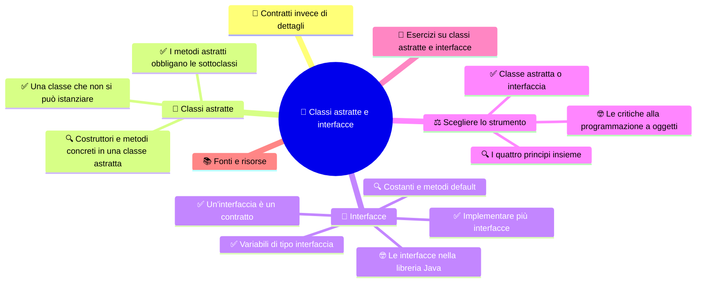
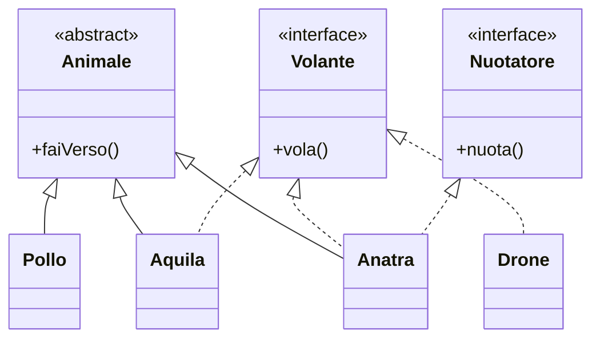

⬅️ [S5 - Polimorfismo e casting](%28STU%29%204CI%20sett-ott%20S5%20-%20Polimorfismo%20e%20casting.md) · 🏠 [Indice](%28STU%29%204CI%20-%20SETT-OTT.md) · [S7 - Ripasso in flashcard](%28STU%29%204CI%20sett-ott%20S7%20-%20Ripasso%20in%20flashcard.md) ➡️

# 🤝 Classi astratte e interfacce

**4CI · Settembre-Ottobre · S6 · Teoria**

> **Legenda:** ✅ da sapere · 🔍 per capire fino in fondo · 🤓 facoltativo, per curiosi · 🃏 flashcard: rispondi a voce, poi apri per controllare



## 🧭 Contratti invece di dettagli

Nel 1956 un camionista americano diventato imprenditore, **Malcom McLean**, fa salpare da Newark una nave carica di 58 grandi scatole di metallo tutte uguali. Prima di allora le merci si caricavano pezzo per pezzo: sacchi, casse, barili. Servivano giorni e centinaia di portuali.

Il **container** cambia tutto. La gru, la nave, il treno e il camion non devono sapere che cosa c'è dentro: banane, scarpe o computer. Devono solo sapere che la scatola ha **dimensioni standard** e **agganci standard**. Chi produce le gru e chi riempie i container non si conoscono nemmeno: rispettano lo stesso **contratto**. In pochi decenni il costo del trasporto crolla e nasce il commercio globale di oggi, con i suoi vantaggi e i suoi problemi.

Nel software succede la stessa cosa. Il codice di un negozio online deve incassare un pagamento. Non gli interessa se è una carta di credito, PayPal o un buono: gli basta sapere che quell'oggetto **sa pagare**. Il contratto è «hai un metodo `paga`»; i dettagli sono affari di chi lo implementa.

Questa settimana diamo una forma precisa a questa idea con due strumenti: le **classi astratte** e le **interfacce**. Insieme realizzano il quarto principio della OOP: l'**astrazione**, cioè mostrare ciò che serve e nascondere il resto.

## 🧩 Classi astratte

### ✅ Una classe che non si può istanziare

Nella nostra stalla abbiamo polli e mucche. Ma ha senso scrivere questo?

```java
Animale x = new Animale("???");
x.faiVerso();   // che verso fa un «animale» generico?
```

Nessun animale reale è «solo un animale»: è sempre un pollo, una mucca, una capra. `Animale` è un concetto utile per **organizzare** il codice, ma non descrive niente di concreto.

Una **classe astratta** è una classe che **non si può istanziare** con `new`. Serve solo come base per le sottoclassi. Si dichiara con la parola chiave **`abstract`**:

```java
public abstract class Animale {
    // ...
}
```

```java
Animale x = new Animale("???");   // NON compila: Animale is abstract
Animale y = new Pollo("Pio");     // compila: Pollo è concreto
```

Le classi che invece si possono istanziare si chiamano **classi concrete**.

Nota la seconda riga: anche se `Animale` è astratta, si possono dichiarare **variabili** di tipo `Animale`. Il polimorfismo funziona esattamente come in S5.

<details>
<summary>🃏 Che cos'è una classe astratta?</summary>
Una classe dichiarata abstract che non si può istanziare con new. Serve come base per le sottoclassi.
</details>
<details>
<summary>🃏 Perché ha senso rendere astratta la classe Animale?</summary>
Perché nessun animale reale è solo un animale generico: è sempre di una specie precisa. Animale serve a organizzare il codice.
</details>
<details>
<summary>🃏 Quale parola chiave rende astratta una classe?</summary>
abstract.
</details>
<details>
<summary>🃏 Se Animale è astratta, new Animale("???") compila?</summary>
No, una classe astratta non si può istanziare.
</details>
<details>
<summary>🃏 Se Animale è astratta, si può scrivere Animale y = new Pollo("Pio")?</summary>
Sì. Si possono dichiarare variabili del tipo astratto e farle puntare a oggetti di sottoclassi concrete.
</details>
<details>
<summary>🃏 Che cos'è una classe concreta?</summary>
Una classe che si può istanziare con new.
</details>

### ✅ I metodi astratti obbligano le sottoclassi

Una classe astratta può dichiarare **metodi astratti**: metodi con la firma ma **senza corpo**. Al posto delle graffe c'è un punto e virgola.

**Codice 1**

```java
public abstract class Animale {
    private String nome;

    public Animale(String nome) {
        this.nome = nome;
    }

    public String getNome() {
        return nome;
    }

    public abstract void faiVerso();
}
```

Il messaggio è: «ogni animale **deve** saper fare il verso, ma `Animale` non sa come. Lo decideranno le sottoclassi».

Ogni sottoclasse **concreta** è **obbligata** a implementare tutti i metodi astratti ereditati:

```java
public class Pollo extends Animale {
    public Pollo(String nome) {
        super(nome);
    }

    @Override
    public void faiVerso() {
        System.out.println(getNome() + " fa: Coccodè!");
    }
}
```

Se `Pollo` dimenticasse `faiVerso()`, il codice **non compilerebbe**. In S5 l'overriding era una **scelta**; qui diventa un **obbligo** controllato dal compilatore. Nessuno potrà mai creare un animale che non sa fare il verso.

Regole:

- se una classe ha **almeno un** metodo astratto, deve essere dichiarata `abstract`;
- una sottoclasse che non implementa tutti i metodi astratti deve essere a sua volta `abstract`;
- un metodo astratto non può essere `private`: le sottoclassi non potrebbero vederlo per implementarlo.

<details>
<summary>🃏 Che cos'è un metodo astratto?</summary>
Un metodo con la firma ma senza corpo, dichiarato abstract e chiuso da un punto e virgola.
</details>
<details>
<summary>🃏 Come si scrive il metodo astratto faiVerso in Animale?</summary>
public abstract void faiVerso();
</details>
<details>
<summary>🃏 Che cosa deve fare una sottoclasse concreta di una classe astratta?</summary>
Implementare tutti i metodi astratti ereditati.
</details>
<details>
<summary>🃏 Che cosa succede se una sottoclasse concreta non implementa un metodo astratto?</summary>
Il codice non compila.
</details>
<details>
<summary>🃏 Che differenza c'è tra l'overriding visto in S5 e l'implementazione di un metodo astratto?</summary>
In S5 ridefinire il metodo era una scelta. Con un metodo astratto è un obbligo controllato dal compilatore.
</details>
<details>
<summary>🃏 Se una classe ha un metodo astratto, che cosa deve essere la classe?</summary>
Deve essere dichiarata abstract.
</details>
<details>
<summary>🃏 Perché un metodo astratto non può essere private?</summary>
Perché le sottoclassi non lo vedrebbero e non potrebbero implementarlo.
</details>

### 🔍 Costruttori e metodi concreti in una classe astratta

Una classe astratta non è una classe «vuota». Nel codice 1, `Animale` ha:

- un **attributo** privato, `nome`;
- un **costruttore**;
- un **metodo concreto**, `getNome()`, già scritto e ereditato da tutti;
- un **metodo astratto**, `faiVerso()`, da completare.

Ma se non si può fare `new Animale(...)`, a che cosa serve il costruttore? Viene chiamato dalle sottoclassi con **`super(nome)`**, per inizializzare la parte `Animale` dell'oggetto. Ricorda S4: ogni oggetto `Pollo` contiene una parte `Animale`, e qualcuno deve inizializzarla.

Una classe astratta può anche **non avere** metodi astratti. È una scelta legittima quando vuoi solo impedire che qualcuno crei oggetti di quella classe generica.

Infine: una classe **non può** essere insieme `abstract` e `final`. `abstract` dice «estendimi», `final` dice «non estendermi». Il compilatore rifiuta la contraddizione.

**Un esempio reale.** In un videogioco tutti i nemici hanno punti vita e subiscono danni allo stesso modo, ma ognuno attacca a modo suo:

```java
public abstract class Nemico {
    private int vita;

    public Nemico(int vita) {
        this.vita = vita;
    }

    public void subisciDanno(int danno) {
        vita = Math.max(0, vita - danno);
    }

    public boolean isSconfitto() {
        return vita == 0;
    }

    public abstract void attacca();
}
```

<details>
<summary>🃏 Una classe astratta può avere attributi e metodi già scritti?</summary>
Sì. Può avere attributi, costruttori, metodi concreti e metodi astratti.
</details>
<details>
<summary>🃏 A che cosa serve il costruttore di una classe astratta, se non si può usare new?</summary>
Viene chiamato dalle sottoclassi con super(...) per inizializzare la parte ereditata dell'oggetto.
</details>
<details>
<summary>🃏 Una classe astratta deve per forza avere metodi astratti?</summary>
No. Può non averne, se si vuole solo impedire di creare oggetti di quella classe.
</details>
<details>
<summary>🃏 Una classe può essere sia abstract sia final?</summary>
No. abstract chiede di essere estesa, final lo vieta: il compilatore dà errore.
</details>
<details>
<summary>🃏 Nella classe Nemico, quali parti sono comuni a tutti i nemici e quale parte cambia?</summary>
Vita, subisciDanno e isSconfitto sono comuni e già scritti. attacca è astratto e ogni nemico lo implementa a modo suo.
</details>

## 🤝 Interfacce

### ✅ Un'interfaccia è un contratto

Un'**interfaccia** è un elenco di metodi che una classe **promette** di saper eseguire. Descrive **che cosa** una classe sa fare, non **come** lo fa né **che cosa è**.

```java
public interface Volante {
    void vola();
}
```

Una classe dichiara di rispettare il contratto con la parola chiave **`implements`**, e deve scrivere tutti i metodi dell'interfaccia:

**Codice 2**

```java
public class Aquila extends Animale implements Volante {
    public Aquila(String nome) {
        super(nome);
    }

    @Override
    public void faiVerso() {
        System.out.println(getNome() + " lancia un grido acuto.");
    }

    @Override
    public void vola() {
        System.out.println(getNome() + " vola sopra le montagne.");
    }
}
```

La forza delle interfacce è che **classi senza niente in comune** possono rispettare lo stesso contratto:

```java
public class Drone implements Volante {
    @Override
    public void vola() {
        System.out.println("Il drone si alza ronzando.");
    }
}
```

Un'aquila e un drone non sono parenti: uno è un animale, l'altro una macchina. Ma entrambi **sanno volare**.

I metodi di un'interfaccia senza corpo sono automaticamente **`public`** e **`abstract`**: non serve scriverlo. Per questo, nella classe che li implementa, devono essere `public`.

<details>
<summary>🃏 Che cos'è un'interfaccia?</summary>
Un contratto: un elenco di metodi che una classe promette di saper eseguire.
</details>
<details>
<summary>🃏 Un'interfaccia descrive che cosa una classe sa fare o come lo fa?</summary>
Che cosa sa fare. Il come lo decide la classe che la implementa.
</details>
<details>
<summary>🃏 Quale parola chiave usa una classe per rispettare un'interfaccia?</summary>
implements.
</details>
<details>
<summary>🃏 Che cosa deve fare una classe che implementa un'interfaccia?</summary>
Scrivere tutti i metodi dichiarati nell'interfaccia, oppure essere dichiarata abstract.
</details>
<details>
<summary>🃏 Perché Aquila e Drone possono implementare la stessa interfaccia Volante?</summary>
Perché un'interfaccia descrive una capacità, non una famiglia: classi senza niente in comune possono avere la stessa capacità.
</details>
<details>
<summary>🃏 Che modificatori hanno automaticamente i metodi senza corpo di un'interfaccia?</summary>
public e abstract.
</details>
<details>
<summary>🃏 Perché i metodi che implementano un'interfaccia devono essere public?</summary>
Perché nell'interfaccia sono public, e la visibilità non può diminuire.
</details>

### ✅ Implementare più interfacce

In S4 abbiamo visto che una classe può estendere **una sola** superclasse. Con le interfacce il limite non c'è: una classe può **implementarne quante vuole**, separate da virgola.

```java
public interface Nuotatore {
    void nuota();
}

public class Anatra extends Animale implements Volante, Nuotatore {
    public Anatra(String nome) {
        super(nome);
    }

    @Override
    public void faiVerso() { System.out.println(getNome() + " fa: Qua qua!"); }

    @Override
    public void vola() { System.out.println(getNome() + " vola sul lago."); }

    @Override
    public void nuota() { System.out.println(getNome() + " nuota tranquilla."); }
}
```

L'anatra **è un** animale, **sa** volare e **sa** nuotare. Così Java ottiene la flessibilità dell'ereditarietà multipla senza il problema del diamante: le interfacce classiche non hanno attributi né codice da ereditare in conflitto.



Le frecce continue indicano `extends`, quelle tratteggiate `implements`.

> 🔧 **In laboratorio:** nel progetto `LaStalla` rendi astratta la classe `Animale`, crei l'interfaccia `Volante` e la fai implementare da `Aquila`.

<details>
<summary>🃏 Quante interfacce può implementare una classe Java?</summary>
Quante ne vuole, separate da virgola.
</details>
<details>
<summary>🃏 Una classe può estendere una classe e implementare interfacce insieme?</summary>
Sì, per esempio class Anatra extends Animale implements Volante, Nuotatore.
</details>
<details>
<summary>🃏 Come ottiene Java la flessibilità dell'ereditarietà multipla senza il problema del diamante?</summary>
Permettendo una sola superclasse ma molte interfacce, che non hanno attributi da ereditare in conflitto.
</details>
<details>
<summary>🃏 Descrivi l'Anatra con le parole «è un» e «sa».</summary>
L'anatra è un animale, sa volare e sa nuotare.
</details>

### ✅ Variabili di tipo interfaccia

Un'interfaccia non si può istanziare: `new Volante()` non compila. Ma si possono dichiarare **variabili** e **parametri** di tipo interfaccia. Il polimorfismo funziona come con le superclassi:

**Codice 3**

```java
Volante[] cielo = { new Aquila("Aquilo"), new Drone(), new Anatra("Anas") };

for (Volante v : cielo) {
    v.vola();   // ognuno vola a modo suo
}
```

Il ciclo non sa niente di aquile, droni e anatre. Sa solo che sono tutti `Volante`. Il tipo statico è l'interfaccia, il tipo dinamico è la classe reale.

**Un esempio reale: i pagamenti di un negozio online.**

**Codice 4**

```java
public interface MetodoPagamento {
    boolean paga(double importo);
}

public class Cassa {
    public void checkout(double totale, MetodoPagamento metodo) {
        if (metodo.paga(totale)) {
            System.out.println("Ordine confermato!");
        } else {
            System.out.println("Pagamento rifiutato.");
        }
    }
}
```

`Cassa` conosce solo il contratto. Le classi `CartaDiCredito`, `PayPal` o `BuoniRegalo` implementano `MetodoPagamento` ognuna a modo suo. Domani il negozio accetta un nuovo metodo? Si scrive **una nuova classe**: `Cassa` non cambia di una virgola.

Questa idea ha un motto famoso, dal libro *Design Patterns* del 1994: **«programma verso un'interfaccia, non verso un'implementazione»**.

<details>
<summary>🃏 Si può scrivere new Volante()?</summary>
No, un'interfaccia non si può istanziare.
</details>
<details>
<summary>🃏 Si può dichiarare una variabile di tipo Volante?</summary>
Sì, e può puntare a qualunque oggetto di una classe che implementa Volante.
</details>
<details>
<summary>🃏 Nel codice 3, perché il ciclo funziona con aquile, droni e anatre?</summary>
Perché sono tutti Volante e, grazie al binding dinamico, ognuno esegue la propria versione di vola().
</details>
<details>
<summary>🃏 Nel codice 4, che cosa cambia in Cassa se il negozio accetta un nuovo metodo di pagamento?</summary>
Niente. Si scrive una nuova classe che implementa MetodoPagamento.
</details>
<details>
<summary>🃏 Che cosa significa «programma verso un'interfaccia, non verso un'implementazione»?</summary>
Il codice che usa un oggetto deve dipendere solo dal contratto che rispetta, non dalla classe concreta. Così si possono cambiare le implementazioni senza toccarlo.
</details>

### 🔍 Costanti e metodi default

Un'interfaccia non ha attributi «normali». Può però contenere **costanti**: ogni attributo dichiarato in un'interfaccia è automaticamente **`public static final`**.

```java
public interface Volante {
    int ALTEZZA_MASSIMA = 10000;   // costante: public static final
    void vola();
}
```

Da **Java 8** un'interfaccia può contenere anche **metodi `default`**: metodi **con corpo**, già pronti, che le classi ereditano e possono ridefinire.

```java
public interface Volante {
    void vola();

    default void atterra() {
        System.out.println("Atterraggio dolce.");
    }
}
```

Perché sono stati introdotti? Per **far crescere** le interfacce senza rompere il codice esistente. Se aggiungi un metodo astratto a un'interfaccia usata da mille classi, mille classi smettono di compilare. Con un metodo `default`, continuano a funzionare. È così che nel 2014 Java ha aggiunto nuovi metodi alle sue interfacce più usate.

Un'interfaccia continua però a **non avere**:

- attributi d'istanza, cioè uno stato proprio;
- costruttori.

<details>
<summary>🃏 Che cosa sono gli attributi dichiarati in un'interfaccia?</summary>
Costanti: sono automaticamente public, static e final.
</details>
<details>
<summary>🃏 Che cos'è un metodo default in un'interfaccia?</summary>
Un metodo con corpo dentro l'interfaccia, introdotto con Java 8. Le classi lo ereditano già pronto e possono ridefinirlo.
</details>
<details>
<summary>🃏 Perché Java 8 ha introdotto i metodi default?</summary>
Per aggiungere metodi a interfacce già usate senza costringere tutte le classi che le implementano a cambiare.
</details>
<details>
<summary>🃏 Che cosa non può avere un'interfaccia, a differenza di una classe astratta?</summary>
Attributi d'istanza, cioè uno stato proprio, e costruttori.
</details>

### 🤓 Le interfacce nella libreria Java

> Le interfacce sono ovunque nel Java che usano i professionisti.
>
> - **`Comparable`** dice «i miei oggetti si possono confrontare». Se la classe `Studente` implementa `Comparable<Studente>` con il metodo `compareTo`, puoi ordinare un array di studenti con `Arrays.sort(classe)`. Il metodo `sort` è stato scritto anni prima della tua classe, ma si fida del contratto.
> - **`Runnable`** dice «sono un compito che si può eseguire». È il modo con cui Java fa lavorare più cose in parallelo.
> - **JDBC**, il sistema con cui Java parla con i database, è fatto quasi solo di interfacce, come `Connection`. Chi produce MySQL o PostgreSQL scrive le classi che le implementano, i **driver**. Il tuo programma usa solo le interfacce: per cambiare database cambi il driver, non il codice.
> - In **Android** un pulsante accetta un oggetto `OnClickListener`. Quando l'utente tocca lo schermo, il sistema chiama il suo metodo `onClick`. Si chiama **callback**, e segue il «principio di Hollywood»: *non chiamarci, ti chiameremo noi*.

<details>
<summary>🃏 Che cosa promette una classe che implementa Comparable?</summary>
Che i suoi oggetti si possono confrontare con compareTo, e quindi ordinare, per esempio con Arrays.sort.
</details>
<details>
<summary>🃏 Perché JDBC usa le interfacce per collegarsi ai database?</summary>
Perché così ogni produttore di database scrive il proprio driver, e il programma usa solo le interfacce: cambiando driver si cambia database senza riscrivere il codice.
</details>
<details>
<summary>🃏 Che cos'è una callback?</summary>
Un oggetto che passi a un sistema, che poi chiama un suo metodo quando succede qualcosa, come onClick quando si tocca un pulsante.
</details>

## ⚖️ Scegliere lo strumento

### ✅ Classe astratta o interfaccia

| | Classe astratta | Interfaccia |
| --- | --- | --- |
| Risponde alla domanda | «**che cos'è**?» | «**che cosa sa fare**?» |
| Rappresenta | una **famiglia** di classi | una **capacità** o un **contratto** |
| Attributi | sì, anche privati | solo costanti |
| Costruttori | sì | no |
| Metodi già scritti | sì | solo `default` (e `static`) |
| Parola chiave nella sottoclasse | `extends` | `implements` |
| Quante per classe | **una sola** | **quante vuoi** |
| Si può istanziare | no | no |

Una regola semplice:

- se più classi **sono** la stessa cosa e **condividono** dati e codice → **classe astratta**, per esempio `Animale`, `Nemico`;
- se classi diverse **sanno fare** la stessa cosa → **interfaccia**, per esempio `Volante`, `MetodoPagamento`, `Accendibile`.

Spesso si usano **entrambe**: `Aquila extends Animale implements Volante`.

<details>
<summary>🃏 A quale domanda risponde una classe astratta? E un'interfaccia?</summary>
La classe astratta risponde a «che cos'è?». L'interfaccia risponde a «che cosa sa fare?».
</details>
<details>
<summary>🃏 Quando conviene una classe astratta?</summary>
Quando più classi sono la stessa cosa e condividono attributi e codice.
</details>
<details>
<summary>🃏 Quando conviene un'interfaccia?</summary>
Quando classi anche molto diverse devono saper fare la stessa cosa.
</details>
<details>
<summary>🃏 Quante classi astratte può estendere una classe? Quante interfacce può implementare?</summary>
Una sola classe, astratta o no. Interfacce quante ne vuole.
</details>
<details>
<summary>🃏 Classi astratte e interfacce si possono istanziare?</summary>
No, nessuna delle due.
</details>
<details>
<summary>🃏 Nella domotica, lampadina, presa e caldaia devono poter essere spente da un unico pulsante. Classe astratta o interfaccia?</summary>
Interfaccia, per esempio Accendibile: sono oggetti molto diversi che condividono solo una capacità.
</details>

### 🔍 I quattro principi insieme

Rileggiamo il negozio online alla luce di tutto il bimestre.

```java
public interface MetodoPagamento {                     // ASTRAZIONE: il contratto
    boolean paga(double importo);
}

public abstract class Carta implements MetodoPagamento { // ASTRAZIONE: famiglia incompleta
    private final String numero;                        // INCAPSULAMENTO: stato privato
    private double disponibile;

    public Carta(String numero, double disponibile) {
        this.numero = numero;
        this.disponibile = disponibile;
    }

    protected boolean scala(double importo) {           // INCAPSULAMENTO: regola protetta
        if (importo <= 0 || importo > disponibile) {
            return false;
        }
        disponibile = disponibile - importo;
        return true;
    }
}

public class CartaDiCredito extends Carta {             // EREDITARIETÀ
    public CartaDiCredito(String numero, double fido) {
        super(numero, fido);
    }

    @Override
    public boolean paga(double importo) {               // POLIMORFISMO: versione specifica
        return scala(importo);
    }
}

public class Bancomat extends Carta {                   // EREDITARIETÀ
    public Bancomat(String numero, double saldo) {
        super(numero, saldo);
    }

    @Override
    public boolean paga(double importo) {               // POLIMORFISMO: versione specifica
        return importo <= 1500 && scala(importo);       // limite per singola spesa
    }
}
```

| Principio | Dove si vede |
| --- | --- |
| **Incapsulamento** | `numero` e `disponibile` sono `private`; si scala solo con `scala`, che controlla l'importo |
| **Ereditarietà** | `CartaDiCredito` e `Bancomat` riusano attributi e `scala` da `Carta` |
| **Polimorfismo** | `Cassa.checkout` chiama `metodo.paga(...)` e la JVM sceglie la versione giusta |
| **Astrazione** | `Cassa` conosce solo `MetodoPagamento`; `Carta` è astratta perché non esiste una «carta generica» |

Nota un dettaglio: `Carta` implementa `MetodoPagamento` ma **non** scrive `paga`. Può farlo perché è astratta: lascia l'obbligo alle sottoclassi concrete.

<details>
<summary>🃏 Nell'esempio del negozio, dove si vede l'incapsulamento?</summary>
Negli attributi private di Carta e nel metodo scala, unico modo per diminuire il disponibile, che controlla l'importo.
</details>
<details>
<summary>🃏 Nell'esempio del negozio, dove si vede l'ereditarietà?</summary>
CartaDiCredito e Bancomat estendono Carta e ne riusano attributi e il metodo scala.
</details>
<details>
<summary>🃏 Nell'esempio del negozio, dove si vede il polimorfismo?</summary>
Cassa chiama metodo.paga(...) e la JVM esegue la versione della classe reale, CartaDiCredito o Bancomat.
</details>
<details>
<summary>🃏 Nell'esempio del negozio, dove si vede l'astrazione?</summary>
Cassa conosce solo l'interfaccia MetodoPagamento, e Carta è una classe astratta.
</details>
<details>
<summary>🃏 Perché Carta può implementare MetodoPagamento senza scrivere paga?</summary>
Perché è astratta: lascia l'obbligo di implementare paga alle sottoclassi concrete.
</details>

### 🤓 Le critiche alla programmazione a oggetti

> La OOP domina il software da quarant'anni. Ma non tutti la amano, e conoscere le critiche ti renderà un programmatore migliore.
>
> Nel 2006 il programmatore **Steve Yegge** scrive un post diventato famoso, *Execution in the Kingdom of Nouns*, «L'esecuzione nel regno dei sostantivi». Lo racconta come una favola: nel regno di Java i **sostantivi**, cioè gli oggetti, comandano, mentre i **verbi**, cioè le azioni, non possono andare in giro da soli. Ogni azione deve essere «accompagnata» da un oggetto. Così nascono classi con nomi buffi come `GestoreDelSalvataggioDelFile` solo per contenere un'azione.
>
> **Joe Armstrong**, inventore del linguaggio Erlang usato nelle centrali telefoniche, ha detto nel libro *Coders at Work* (2009): *volevi una banana, ma hai ottenuto un gorilla che tiene in mano la banana, e tutta la giungla*. Il riferimento è all'ereditarietà: per riusare un piccolo pezzo ti porti dietro tutta la gerarchia.
>
> Esistono altri paradigmi. La **programmazione funzionale** costruisce i programmi con funzioni e dati che non cambiano; Java stesso, dal 2014, ha aggiunto le *lambda*, prese da quel mondo. Nei videogiochi ad alte prestazioni si usa spesso il **data-oriented design**, che separa dati e logica per sfruttare meglio la memoria.
>
> La lezione non è «la OOP è sbagliata». È che ogni strumento ha un prezzo. Un buon programmatore sa usare gli oggetti, e sa anche quando un semplice `if` o una funzione bastano. Da novembre, in Python, vedrai che le stesse idee si possono esprimere in modo più leggero.

<details>
<summary>🃏 Che cosa critica Steve Yegge in Execution in the Kingdom of Nouns?</summary>
Che in Java gli oggetti, i sostantivi, dominano e le azioni, i verbi, non possono esistere da sole: ogni azione deve stare dentro una classe.
</details>
<details>
<summary>🃏 Che cosa intende Joe Armstrong con la banana e il gorilla?</summary>
Che con l'ereditarietà, per riusare un piccolo pezzo di codice, ci si porta dietro tutta la gerarchia e le sue dipendenze.
</details>
<details>
<summary>🃏 Quali altri paradigmi esistono oltre alla OOP?</summary>
Per esempio la programmazione funzionale e, nei videogiochi, il data-oriented design.
</details>

## 🧩 Esercizi su classi astratte e interfacce

1. Rendi astratta la classe `Veicolo` con il metodo astratto `muoviti()` e un attributo privato `targa`. Scrivi due sottoclassi concrete, `Auto` e `Bicicletta`.
2. Per ogni caso scegli tra classe astratta e interfaccia, e motiva:
   - `Stampabile`, per tutto ciò che si può stampare su carta;
   - `Dipendente`, con nome, stipendio e `calcolaStipendio()` diverso per impiegati e dirigenti;
   - `Ricaricabile`, per telefono, auto elettrica e monopattino;
   - `Forma`, con colore e `area()` diversa per cerchio e rettangolo.
3. Trova tutti gli errori:
   ```java
   public interface Suonabile {
       void suona();
   }
   public abstract class Strumento {
       public abstract void accorda() { }
   }
   public class Chitarra extends Strumento implements Suonabile {
       void suona() { System.out.println("Dlen!"); }
   }
   Strumento s = new Strumento();
   ```
4. Scrivi l'interfaccia `Accendibile` con `accendi()` e `spegni()`, e due classi molto diverse che la implementano. Poi scrivi un metodo che riceve un array `Accendibile[]` e spegne tutto.
5. Aggiungi al negozio online un nuovo metodo di pagamento, `BuonoRegalo`, che ha un credito e non può pagare più del credito. Quali classi esistenti devi modificare?
6. Disegna lo schema di un videogioco con la classe astratta `Personaggio`, le sottoclassi `Guerriero`, `Mago` e `Drago`, e le interfacce `Volante` e `LanciaIncantesimi`. Decidi chi implementa che cosa. Usa linee continue per `extends` e tratteggiate per `implements`.

## 📚 Fonti e risorse

- [Oracle — Abstract Methods and Classes](https://docs.oracle.com/javase/tutorial/java/IandI/abstract.html): la spiegazione ufficiale, con un confronto con le interfacce.
- [Oracle — Interfaces](https://docs.oracle.com/javase/tutorial/java/IandI/createinterface.html): come si definisce e si implementa un'interfaccia.
- [Oracle — Default Methods](https://docs.oracle.com/javase/tutorial/java/IandI/defaultmethods.html): perché esistono i metodi `default`.
- [Steve Yegge — Execution in the Kingdom of Nouns](https://steve-yegge.blogspot.com/2006/03/execution-in-kingdom-of-nouns.html): la favola sui sostantivi e i verbi. In inglese, divertente da leggere.
- Marc Levinson, *The Box*, Princeton University Press, 2006: la storia del container e di come ha cambiato il mondo. Edizione italiana: *The Box. La scatola che ha cambiato il mondo*, Egea.
- Gamma, Helm, Johnson, Vlissides, *Design Patterns*, 1994: il libro della «Gang of Four» che ha reso famoso «programma verso un'interfaccia».

---

⬅️ [S5 - Polimorfismo e casting](%28STU%29%204CI%20sett-ott%20S5%20-%20Polimorfismo%20e%20casting.md) · 🏠 [Indice](%28STU%29%204CI%20-%20SETT-OTT.md) · [S7 - Ripasso in flashcard](%28STU%29%204CI%20sett-ott%20S7%20-%20Ripasso%20in%20flashcard.md) ➡️
