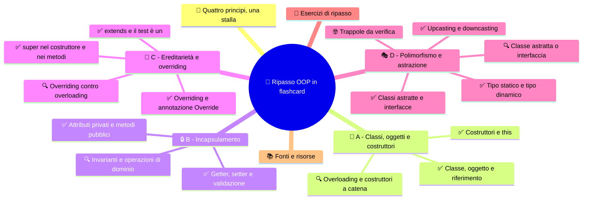

# 🧠 Ripasso OOP in flashcard

**4CI · Settembre-Ottobre · S7 · Ripasso**

> **Legenda:** ✅ da sapere · 🔍 per capire fino in fondo · 🤓 facoltativo, per curiosi · 🃏 flashcard: rispondi a voce, poi apri per controllare



## 🧭 Quattro principi, una stalla

In sei settimane abbiamo costruito la stalla un pezzo alla volta. Prima un singolo `Animale`. Poi un animale che nasce già completo. Poi un animale che si difende dai valori impossibili. Poi polli e mucche che ereditano da `Animale`, ognuno con il suo verso. Infine animali che non si possono creare "in generale" e capacità come `Volante`.

| Principio | In una frase | Dove l'abbiamo visto |
|---|---|---|
| **Incapsulamento** | l'oggetto protegge i propri dati e si lascia usare solo tramite metodi | [S3](%28STU%29%204CI%20sett-ott%20S3%20-%20Incapsulamento.md) |
| **Ereditarietà** | una classe riusa e specializza un'altra classe | [S4](%28STU%29%204CI%20sett-ott%20S4%20-%20Ereditariet%C3%A0.md) |
| **Polimorfismo** | lo stesso comando produce risposte diverse a seconda dell'oggetto | [S5](%28STU%29%204CI%20sett-ott%20S5%20-%20Polimorfismo%20e%20casting.md) |
| **Astrazione** | si mostra che cosa un oggetto sa fare, non come lo fa | [S6](%28STU%29%204CI%20sett-ott%20S6%20-%20Classi%20astratte%20e%20interfacce.md) |

Classi, oggetti e costruttori ([S1](%28STU%29%204CI%20sett-ott%20S1%20-%20Classi%20e%20oggetti.md), [S2](%28STU%29%204CI%20sett-ott%20S2%20-%20Costruttori%20e%20overloading.md)) sono gli attrezzi su cui poggiano tutti e quattro.

Questa scheda non sostituisce le dispense: è una palestra. Le sezioni A, B, C e D seguono l'ordine del programma. Per ogni domanda prova a rispondere **prima** di aprire la tendina. Se sbagli, torna alla dispensa indicata e rileggi solo quel paragrafo.

## 🧱 A - Classi, oggetti e costruttori

### ✅ Classe, oggetto e riferimento

Una **classe** è il progetto: descrive attributi e metodi. Un **oggetto** è un esemplare concreto, creato con `new`. Una variabile di tipo classe non contiene l'oggetto: contiene un **riferimento**, cioè l'indicazione di dove si trova l'oggetto in memoria.

```java
Animale a = new Animale("Pio");
Animale b = a;          // nessun nuovo oggetto: due riferimenti, un oggetto
b.setNome("Pia");
System.out.println(a.getNome()); // Pia
```

📖 Ripassa in [S1](%28STU%29%204CI%20sett-ott%20S1%20-%20Classi%20e%20oggetti.md).

<details>
<summary>🃏 Che differenza c'è fra classe e oggetto?</summary>
La classe è il progetto che descrive attributi e metodi; l'oggetto è un esemplare concreto creato con new a partire dalla classe.
</details>
<details>
<summary>🃏 Che cosa sono lo stato e il comportamento di un oggetto?</summary>
Lo stato sono i valori dei suoi attributi in un certo momento; il comportamento sono i suoi metodi.
</details>
<details>
<summary>🃏 Che cosa contiene una variabile di tipo Animale?</summary>
Un riferimento a un oggetto Animale, non l'oggetto stesso.
</details>
<details>
<summary>🃏 Dopo Animale b = a; quanti oggetti esistono?</summary>
Uno solo: a e b sono due riferimenti allo stesso oggetto.
</details>
<details>
<summary>🃏 Che cosa succede se chiami un metodo su un riferimento che vale null?</summary>
Il programma si interrompe con una NullPointerException.
</details>
<details>
<summary>🃏 Dopo Animale x; esiste già un oggetto?</summary>
No. Esiste solo la variabile: l'oggetto nasce quando si usa new.
</details>

### ✅ Costruttori e this

Il **costruttore** inizializza un oggetto appena creato da `new`. Ha lo stesso nome della classe e **non ha tipo di ritorno**, nemmeno `void`. Se non scrivi nessun costruttore, Java ne aggiunge uno vuoto; se ne scrivi uno, quello vuoto sparisce.

`this` indica l'oggetto corrente. Serve a distinguere l'attributo dal parametro con lo stesso nome:

```java
public Animale(String nome, double peso) {
    this.nome = nome;   // attributo = parametro
    this.peso = peso;
}
```

📖 Ripassa in [S2](%28STU%29%204CI%20sett-ott%20S2%20-%20Costruttori%20e%20overloading.md).

<details>
<summary>🃏 A che cosa serve un costruttore?</summary>
A inizializzare lo stato di un oggetto nel momento in cui viene creato con new.
</details>
<details>
<summary>🃏 Quali sono le due regole di forma di un costruttore?</summary>
Ha lo stesso nome della classe e non ha tipo di ritorno, nemmeno void.
</details>
<details>
<summary>🃏 Quando Java aggiunge da solo il costruttore vuoto?</summary>
Solo se la classe non dichiara nessun costruttore.
</details>
<details>
<summary>🃏 Che differenza c'è fra nome e this.nome in un costruttore con parametro nome?</summary>
nome è il parametro ricevuto; this.nome è l'attributo dell'oggetto.
</details>
<details>
<summary>🃏 Che cosa succede se nel costruttore scrivi nome = nome; senza this?</summary>
Il parametro viene assegnato a se stesso e l'attributo resta al valore iniziale, per esempio null.
</details>

### 🔍 Overloading e costruttori a catena

L'**overloading** permette di avere più metodi o costruttori con lo **stesso nome** ma **parametri diversi**. Java sceglie quale usare guardando numero, tipo e ordine degli argomenti.

Un costruttore può richiamarne un altro con `this(...)`, che deve essere la **prima istruzione**:

```java
public Animale(String nome) {
    this(nome, 1.0);   // usa l'altro costruttore con un peso predefinito
}
```

Il **costruttore di copia** riceve un oggetto dello stesso tipo e ne crea uno nuovo e indipendente.

<details>
<summary>🃏 Che cos'è l'overloading?</summary>
Avere nella stessa classe più metodi o costruttori con lo stesso nome ma parametri diversi.
</details>
<details>
<summary>🃏 Come sceglie Java fra metodi sovraccaricati?</summary>
In base a numero, tipo e ordine degli argomenti passati.
</details>
<details>
<summary>🃏 Due metodi che differiscono solo per il tipo di ritorno sono un overloading valido?</summary>
No: non compila, perché la firma è nome più parametri e il tipo di ritorno non conta.
</details>
<details>
<summary>🃏 Che cosa fa this(...) dentro un costruttore e dove va scritto?</summary>
Richiama un altro costruttore della stessa classe; deve essere la prima istruzione.
</details>
<details>
<summary>🃏 Che differenza c'è fra un costruttore di copia e Animale b = a?</summary>
Il costruttore di copia crea un nuovo oggetto con gli stessi valori; b = a copia solo il riferimento.
</details>

## 🔒 B - Incapsulamento

### ✅ Attributi privati e metodi pubblici

L'**incapsulamento** protegge lo stato di un oggetto: gli attributi sono `private` e il resto del programma li usa solo attraverso metodi `public`. L'**information hiding** nasconde i dettagli che all'esterno non servono.

| Modificatore | Chi può accedere |
|---|---|
| `public` | tutti |
| `private` | solo la classe stessa |
| `protected` | classe, sottoclassi e stesso pacchetto |
| nessuno | stesso pacchetto |

📖 Ripassa in [S3](%28STU%29%204CI%20sett-ott%20S3%20-%20Incapsulamento.md).

<details>
<summary>🃏 Che cos'è l'incapsulamento?</summary>
La protezione dello stato di un oggetto: gli attributi sono nascosti e si modificano solo attraverso metodi controllati.
</details>
<details>
<summary>🃏 Che cos'è l'information hiding?</summary>
Nascondere all'esterno i dettagli interni di una classe, mostrando solo ciò che serve per usarla.
</details>
<details>
<summary>🃏 Un attributo private si può leggere da un'altra classe con oggetto.attributo?</summary>
No, non compila: serve un metodo pubblico, come un getter.
</details>
<details>
<summary>🃏 Chi vede un membro protected?</summary>
La classe stessa, le sue sottoclassi e le classi dello stesso pacchetto.
</details>
<details>
<summary>🃏 Perché un programma che compila può comunque descrivere un animale impossibile?</summary>
Perché il compilatore controlla i tipi, non le regole del problema: un peso di -40 è un double valido.
</details>

### ✅ Getter, setter e validazione

Il **getter** legge un attributo. Il **setter** propone una modifica e può **rifiutarla** se il valore non è valido:

```java
public void setPeso(double peso) {
    if (peso <= 0) {
        throw new IllegalArgumentException("Il peso deve essere positivo");
    }
    this.peso = peso;
}
```

Non serve un setter per ogni attributo: un valore che non deve cambiare, come la data di nascita, può avere solo il getter.

<details>
<summary>🃏 A che cosa serve un getter?</summary>
A leggere il valore di un attributo privato dall'esterno della classe.
</details>
<details>
<summary>🃏 Perché un setter è meglio dell'accesso diretto all'attributo?</summary>
Perché può controllare il valore e rifiutare quelli non validi.
</details>
<details>
<summary>🃏 Come rifiuta un valore non valido il setPeso della stalla?</summary>
Lancia una IllegalArgumentException con un messaggio, senza modificare l'attributo.
</details>
<details>
<summary>🃏 Ogni attributo deve avere un setter?</summary>
No. Se un valore non deve cambiare dopo la creazione, si fornisce solo il getter.
</details>

### 🔍 Invarianti e operazioni di dominio

Un'**invariante** è una regola che deve restare vera per tutta la vita dell'oggetto: per esempio «il peso è sempre positivo». Costruttore e metodi devono rispettarla tutti, non solo il setter.

Spesso è meglio un'**operazione di dominio** che un setter generico: `aumentaPeso(0.2)` racconta che cosa succede nella stalla; `setPeso(...)` permette qualsiasi salto.

<details>
<summary>🃏 Che cos'è un'invariante di classe?</summary>
Una regola sullo stato che deve restare vera per tutta la vita dell'oggetto.
</details>
<details>
<summary>🃏 Perché anche il costruttore deve controllare le invarianti?</summary>
Perché altrimenti un oggetto potrebbe nascere già in uno stato impossibile.
</details>
<details>
<summary>🃏 Che cos'è un'operazione di dominio?</summary>
Un metodo che descrive un'azione reale del problema, come aumentaPeso, invece di un setter generico.
</details>

## 🌳 C - Ereditarietà e overriding

### ✅ extends e il test è un

Con `extends` una sottoclasse **eredita** attributi e metodi della superclasse e può aggiungerne di nuovi. Si usa solo se vale il test «**è un**»: un `Pollo` è un `Animale`; un `Recinto` non è un `Animale`.

In Java una classe estende **una sola** superclasse. Tutte le classi discendono da `Object`.

📖 Ripassa in [S4](%28STU%29%204CI%20sett-ott%20S4%20-%20Ereditariet%C3%A0.md).

<details>
<summary>🃏 Che cosa eredita una sottoclasse con extends?</summary>
Gli attributi e i metodi della superclasse, a cui può aggiungere i propri.
</details>
<details>
<summary>🃏 Che cos'è il test è un?</summary>
Una verifica per decidere se usare l'ereditarietà: la sottoclasse deve essere davvero un tipo della superclasse.
</details>
<details>
<summary>🃏 Quante superclassi può estendere una classe Java?</summary>
Una sola.
</details>
<details>
<summary>🃏 Qual è la radice di tutte le classi Java?</summary>
La classe Object.
</details>
<details>
<summary>🃏 Una sottoclasse può leggere direttamente un attributo private della superclasse?</summary>
No. Lo eredita ma non lo vede: deve usare getter o metodi della superclasse.
</details>

### ✅ super nel costruttore e nei metodi

`super(...)` chiama il costruttore della superclasse e deve essere la **prima istruzione** del costruttore della sottoclasse. Se manca, Java inserisce da solo `super()` senza argomenti: se la superclasse non ha un costruttore vuoto, il codice **non compila**.

`super.metodo()` chiama la versione della superclasse di un metodo ridefinito.

```java
public class Pollo extends Animale {
    public Pollo(String nome) {
        super(nome);        // prima si costruisce la parte Animale
    }
}
```

<details>
<summary>🃏 A che cosa serve super(...) in un costruttore?</summary>
A chiamare il costruttore della superclasse per inizializzare la parte ereditata.
</details>
<details>
<summary>🃏 Dove va scritto super(...)?</summary>
Come prima istruzione del costruttore della sottoclasse.
</details>
<details>
<summary>🃏 Che cosa succede se non scrivi super(...) e la superclasse ha solo un costruttore con parametri?</summary>
Java inserisce super() senza argomenti, che non esiste, e il codice non compila.
</details>
<details>
<summary>🃏 In che ordine vengono eseguiti i costruttori di Animale e Pollo?</summary>
Prima quello di Animale, poi il resto di quello di Pollo.
</details>
<details>
<summary>🃏 Che cosa fa super.faiVerso() dentro Pollo?</summary>
Esegue la versione di faiVerso() della superclasse Animale.
</details>

### ✅ Overriding e annotazione Override

L'**overriding** ridefinisce in una sottoclasse un metodo ereditato, con la **stessa firma**. L'annotazione `@Override` chiede al compilatore di controllare che il metodo esista davvero nella superclasse: trasforma un errore di battitura in un errore di compilazione.

📖 Ripassa in [S5](%28STU%29%204CI%20sett-ott%20S5%20-%20Polimorfismo%20e%20casting.md).

<details>
<summary>🃏 Che cos'è l'overriding?</summary>
Ridefinire in una sottoclasse un metodo ereditato, con la stessa firma, per cambiarne il comportamento.
</details>
<details>
<summary>🃏 A che cosa serve @Override?</summary>
Fa controllare al compilatore che il metodo ridefinisca davvero un metodo della superclasse.
</details>
<details>
<summary>🃏 Senza @Override, che cosa succede se scrivi faiVersi() invece di faiVerso()?</summary>
Compila, ma crei un metodo nuovo: la ridefinizione non avviene e il bug resta nascosto.
</details>
<details>
<summary>🃏 Un metodo public può diventare private quando lo ridefinisci?</summary>
No: nell'overriding la visibilità non può diminuire.
</details>

### 🔍 Overriding contro overloading

| | Overloading | Overriding |
|---|---|---|
| Dove | stessa classe | sottoclasse |
| Firma | stesso nome, **parametri diversi** | **stessa firma** |
| Chi decide | il compilatore, guardando il tipo statico | la JVM durante l'esecuzione, guardando il tipo dinamico |

<details>
<summary>🃏 Qual è la differenza principale fra overloading e overriding?</summary>
L'overloading usa lo stesso nome con parametri diversi; l'overriding ridefinisce in una sottoclasse un metodo con la stessa firma.
</details>
<details>
<summary>🃏 Quando viene scelto il metodo in caso di overloading?</summary>
In compilazione, in base al tipo statico degli argomenti.
</details>
<details>
<summary>🃏 Quando viene scelto il metodo in caso di overriding?</summary>
Durante l'esecuzione, in base al tipo dinamico dell'oggetto.
</details>

## 🎭 D - Polimorfismo e astrazione

### ✅ Tipo statico e tipo dinamico

```java
Animale x = new Pollo("Pio");
x.faiVerso();   // esegue Pollo.faiVerso()
x.razzola();    // NON compila: Animale non ha razzola()
```

Il **tipo statico** è quello dichiarato a sinistra (`Animale`): il compilatore lo usa per decidere **quali metodi si possono chiamare**. Il **tipo dinamico** è la classe reale dell'oggetto (`Pollo`): la JVM lo usa per decidere **quale versione eseguire**. Questa scelta durante l'esecuzione si chiama **binding dinamico**.

<details>
<summary>🃏 Che cos'è il polimorfismo?</summary>
La capacità di oggetti di classi diverse di rispondere allo stesso messaggio con comportamenti diversi.
</details>
<details>
<summary>🃏 In Animale x = new Pollo(), qual è il tipo statico e quale il tipo dinamico?</summary>
Il tipo statico è Animale, il tipo dinamico è Pollo.
</details>
<details>
<summary>🃏 Quale tipo usa il compilatore per decidere se una chiamata è permessa?</summary>
Il tipo statico.
</details>
<details>
<summary>🃏 Che cos'è il binding dinamico?</summary>
La scelta, durante l'esecuzione, della versione del metodo da eseguire in base al tipo dinamico dell'oggetto.
</details>
<details>
<summary>🃏 Perché il polimorfismo evita lunghe catene di if?</summary>
Perché ogni classe sa come rispondere: il codice chiama lo stesso metodo e non deve controllare il tipo.
</details>

### ✅ Upcasting e downcasting

L'**upcasting** (da sottoclasse a superclasse) è automatico e sempre sicuro: `Animale a = new Mucca("Muu");`.

Il **downcasting** (da superclasse a sottoclasse) va scritto ed è un atto di fiducia: se l'oggetto non è davvero di quel tipo, il programma si ferma con una `ClassCastException`. Per controllare prima si usa `instanceof`:

```java
if (a instanceof Pollo) {
    ((Pollo) a).razzola();
}
```

<details>
<summary>🃏 Che cos'è l'upcasting?</summary>
Usare un riferimento della superclasse per un oggetto della sottoclasse; è automatico e sicuro.
</details>
<details>
<summary>🃏 Che cos'è il downcasting?</summary>
Convertire un riferimento della superclasse in uno della sottoclasse, con un cast esplicito.
</details>
<details>
<summary>🃏 Che cosa succede se fai un downcasting sbagliato?</summary>
Il codice compila, ma durante l'esecuzione viene lanciata una ClassCastException.
</details>
<details>
<summary>🃏 A che cosa serve instanceof?</summary>
A controllare se un oggetto è di un certo tipo prima di fare un downcasting.
</details>

### ✅ Classi astratte e interfacce

Una **classe astratta** (`abstract class`) rappresenta una famiglia: **non si può istanziare** con `new`. Può avere attributi, costruttori, metodi concreti e **metodi astratti**, cioè senza corpo, che le sottoclassi concrete **devono** implementare.

Un'**interfaccia** (`interface`) è un **contratto**: elenca che cosa una classe sa fare. Una classe la rispetta con `implements` e può implementarne **più di una**.

```java
public abstract class Animale {
    public abstract void faiVerso();
}

public class Aquila extends Animale implements Volante {
    @Override public void faiVerso() { System.out.println("Kriii!"); }
    @Override public void vola() { System.out.println("Volo alto."); }
}
```

📖 Ripassa in [S6](%28STU%29%204CI%20sett-ott%20S6%20-%20Classi%20astratte%20e%20interfacce.md).

<details>
<summary>🃏 Che cos'è una classe astratta?</summary>
Una classe dichiarata abstract che non si può istanziare e che può contenere metodi astratti da completare nelle sottoclassi.
</details>
<details>
<summary>🃏 Che cos'è un metodo astratto?</summary>
Un metodo dichiarato abstract, con firma ma senza corpo, che le sottoclassi concrete devono implementare.
</details>
<details>
<summary>🃏 Una classe astratta può avere un costruttore?</summary>
Sì: viene chiamato dalle sottoclassi con super(...) per inizializzare la parte comune.
</details>
<details>
<summary>🃏 Che cos'è un'interfaccia?</summary>
Un contratto che elenca i metodi che una classe si impegna a fornire.
</details>
<details>
<summary>🃏 Quante interfacce può implementare una classe?</summary>
Quante vuole, separate da virgole dopo implements.
</details>
<details>
<summary>🃏 Che cosa succede se una classe concreta implementa un'interfaccia ma dimentica un metodo?</summary>
Non compila: deve implementare tutti i metodi astratti del contratto.
</details>
<details>
<summary>🃏 Si può dichiarare una variabile di tipo interfaccia?</summary>
Sì, per esempio Volante v = new Aquila(); ma non si può scrivere new Volante().
</details>

### 🔍 Classe astratta o interfaccia

| | Classe astratta | Interfaccia |
|---|---|---|
| Domanda | che cos'**è**? | che cosa **sa fare**? |
| Stato | può avere attributi e costruttori | niente stato proprio, solo costanti |
| Parola chiave | `extends`, una sola | `implements`, anche più di una |
| Esempio | `Animale` | `Volante`, `Nuotatore` |

Un `Robot` può implementare `Volante` senza essere un `Animale`: le interfacce uniscono classi che non sono parenti.

<details>
<summary>🃏 Quale domanda aiuta a scegliere una classe astratta?</summary>
Che cos'è? La classe astratta rappresenta una famiglia di oggetti.
</details>
<details>
<summary>🃏 Quale domanda aiuta a scegliere un'interfaccia?</summary>
Che cosa sa fare? L'interfaccia descrive una capacità.
</details>
<details>
<summary>🃏 Perché un Robot può implementare Volante senza essere un Animale?</summary>
Perché un'interfaccia descrive una capacità e può essere implementata da classi che non sono parenti.
</details>
<details>
<summary>🃏 Come collaborano i quattro principi in un ciclo che chiama faiVerso() su un array di Animale?</summary>
L'incapsulamento protegge gli oggetti, l'ereditarietà li mette nella stessa famiglia, l'astrazione impone faiVerso() e il polimorfismo sceglie la versione giusta per ciascuno.
</details>

### 🤓 Trappole da verifica

> Alcuni errori tornano ogni anno. Riconoscerli a colpo d'occhio vale punti:
>
> - `public void Animale(String nome)` **non è un costruttore**: ha un tipo di ritorno, quindi è un metodo che si chiama come la classe.
> - `public abstract void faiVerso() { }` **non compila**: un metodo astratto non ha corpo, nemmeno vuoto.
> - Un metodo `static` non si ridefinisce: si **nasconde**, e non c'è binding dinamico.
> - Dentro il costruttore di `Pollo`, `super(nome)` scritto **dopo** un'altra istruzione non compila.
> - `Animale a = new Animale("Pio");` non compila **se** `Animale` è astratta, anche se la classe ha un costruttore.

<details>
<summary>🃏 public void Animale(String nome) è un costruttore?</summary>
No: ha il tipo di ritorno void, quindi è un normale metodo con il nome della classe.
</details>
<details>
<summary>🃏 Perché public abstract void faiVerso() { } non compila?</summary>
Perché un metodo astratto non può avere corpo, nemmeno vuoto: va chiuso con il punto e virgola.
</details>
<details>
<summary>🃏 I metodi static partecipano al binding dinamico?</summary>
No: non si ridefiniscono ma si nascondono, e la versione è scelta in base al tipo statico.
</details>

## 🧩 Esercizi di ripasso

1. Che cosa stampa? Spiega perché.
   ```java
   Animale a = new Animale("Pio");
   Animale b = new Animale("Pio");
   Animale c = a;
   System.out.println(a == b);
   System.out.println(a == c);
   ```
2. Scrivi la classe `Recinto` con attributi privati `codice` e `capienza`, un costruttore che rifiuta una capienza minore di 1 e un secondo costruttore che riceve solo il codice e usa capienza 10.
3. Trova gli errori e correggili:
   ```java
   public class Mucca extends Animale {
       private double litriLatte;
       public Mucca(String nome, double litriLatte) {
           this.litriLatte = litriLatte;
           super(nome);
       }
       @Override
       public void faiVerSo() { System.out.println("Muuu"); }
   }
   ```
4. Dato `Animale x = new Mucca("Muu", 20);`, indica quali righe compilano e che cosa fanno: `x.faiVerso();`, `x.mungi();`, `((Mucca) x).mungi();`, `((Pollo) x).razzola();`.
5. Classe astratta o interfaccia? Motiva: `Veicolo`, `Ricaricabile`, `Dipendente`, `Stampabile`.
6. Scrivi un metodo `static void concerto(Animale[] stalla)` che fa fare il verso a tutti. Perché non serve nessun `if`?

## 📚 Fonti e risorse

- [Oracle - Object-Oriented Programming Concepts](https://docs.oracle.com/javase/tutorial/java/concepts/index.html): il riassunto ufficiale dei concetti OOP. In inglese, breve.
- [Oracle - Inheritance](https://docs.oracle.com/javase/tutorial/java/IandI/subclasses.html): ereditarietà, `super` e overriding, per chi vuole controllare un dettaglio.
- Le dispense [S1](%28STU%29%204CI%20sett-ott%20S1%20-%20Classi%20e%20oggetti.md)-[S6](%28STU%29%204CI%20sett-ott%20S6%20-%20Classi%20astratte%20e%20interfacce.md): ogni sezione di questa scheda rimanda alla dispensa da rileggere.

---

[⬅️ S6 - Classi astratte e interfacce](%28STU%29%204CI%20sett-ott%20S6%20-%20Classi%20astratte%20e%20interfacce.md) · [🗺️ Indice](%28STU%29%204CI%20-%20SETT-OTT.md)
