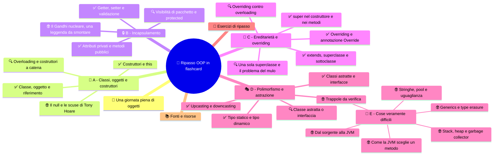

⬅️ [S6 - Classi astratte e interfacce](%28STU%29%204CI%20sett-ott%20S6%20-%20Classi%20astratte%20e%20interfacce.md) · 🏠 [Indice](%28STU%29%204CI%20-%20SETT-OTT.md)

# 🧠 Ripasso OOP in flashcard

**4CI · Settembre-Ottobre · S7 · Ripasso**

> **Legenda:** ✅ da sapere · 🔍 per capire fino in fondo · 🤓 facoltativo, per curiosi · 🃏 flashcard: rispondi a voce, poi apri per controllare



## 🧭 Una giornata piena di oggetti

Ore 7:00. La sveglia del telefono suona. L'app non conosce "la sveglia" in generale: conosce **la tua** sveglia, con il suo orario e la sua suoneria. Accanto ce n'è un'altra, quella del sabato, spenta. Due oggetti della stessa classe. 🧱

Ore 7:40. Paghi il biglietto del bus con l'app della banca. Non vedi il database, non tocchi il tuo saldo con le mani. Premi «paga» e l'app controlla che i soldi ci siano. Se provi a pagare 1000 euro con 3 euro sul conto, rifiuta. Incapsulamento. 🔒

Ore 14:00. Apri un gioco. Gli zombie, gli scheletri e i ragni sono tutti "mostri": camminano, hanno punti vita, ti inseguono. Ognuno però attacca a modo suo. Ereditarietà e overriding. 🌳

Ore 21:00. Premi `Ctrl+V`. Se avevi copiato un testo, incolli un testo. Se avevi copiato una foto, incolli una foto. Se era un file, incolli un file. Stesso tasto, risposte diverse. Polimorfismo. 🎭

Non te ne accorgi, ma passi la giornata in mezzo a oggetti. Tutte queste idee le abbiamo costruite in sei settimane, partendo da una stalla. Le sezioni **A, B, C, D** di questa scheda seguono quel percorso:

| Sezione | Principio | Dispensa |
|---|---|---|
| 🧱 A | gli attrezzi di base: classi, oggetti, costruttori | [S1](%28STU%29%204CI%20sett-ott%20S1%20-%20Classi%20e%20oggetti.md), [S2](%28STU%29%204CI%20sett-ott%20S2%20-%20Costruttori%20e%20overloading.md) |
| 🔒 B | **incapsulamento**: l'oggetto protegge i suoi dati | [S3](%28STU%29%204CI%20sett-ott%20S3%20-%20Incapsulamento.md) |
| 🌳 C | **ereditarietà**: una classe riusa e specializza un'altra | [S4](%28STU%29%204CI%20sett-ott%20S4%20-%20Ereditariet%C3%A0.md), [S5](%28STU%29%204CI%20sett-ott%20S5%20-%20Polimorfismo%20e%20casting.md) |
| 🎭 D | **polimorfismo** e **astrazione**: stesso comando, risposte diverse; contratti invece di dettagli | [S5](%28STU%29%204CI%20sett-ott%20S5%20-%20Polimorfismo%20e%20casting.md), [S6](%28STU%29%204CI%20sett-ott%20S6%20-%20Classi%20astratte%20e%20interfacce.md) |

Questa scheda è una palestra, non una nuova lezione. Rispondi **prima** di aprire la tendina. Se sbagli, torna alla dispensa indicata e rileggi solo quel paragrafo.

## 🧱 A - Classi, oggetti e costruttori

### ✅ Classe, oggetto e riferimento

Pensa alla stalla vista nelle lezioni. **Animale** descrive ciò che gli animali hanno in comune; Pio, il pollo della stalla, è un esemplare concreto. Pia, la mucca, è un altro oggetto, con un nome e un comportamento diversi.

- La **classe** è la specie: il progetto che descrive attributi e metodi.
- L'**oggetto** è il singolo esemplare, creato con `new`.
- Lo **stato** sono i valori degli attributi in quel momento; il **comportamento** sono i metodi.

Una variabile non contiene l'oggetto: contiene un **riferimento**, cioè l'indicazione di dove si trova in memoria. Funziona come un documento condiviso online. Se mandi il link a un compagno, c'è **un solo documento**: se lui scrive, tu vedi le modifiche.

```java
Animale a = new Animale("Pio");
Animale b = a;          // nessun nuovo oggetto: due link allo stesso documento
b.setNome("Pia");
System.out.println(a.getNome()); // Pia
```

📖 Ripassa in [S1](%28STU%29%204CI%20sett-ott%20S1%20-%20Classi%20e%20oggetti.md).

<details>
<summary>🃏 Che differenza c'è fra classe e oggetto?</summary>
La classe è il progetto che descrive attributi e metodi; l'oggetto è un esemplare concreto creato con new a partire dalla classe.
</details>
<details>
<summary>🃏 Nell'esempio della stalla, che cosa è la classe e che cosa è l'oggetto?</summary>
Animale è la classe; Pio, il pollo concreto creato a partire da essa, è un oggetto.
</details>
<details>
<summary>🃏 Che cosa sono lo stato e il comportamento di un oggetto?</summary>
Lo stato sono i valori dei suoi attributi in un certo momento; il comportamento sono i suoi metodi.
</details>
<details>
<summary>🃏 Che cosa contiene una variabile di tipo Animale?</summary>
Un riferimento a un oggetto Animale, non l'oggetto stesso.
</details>
<details>
<summary>🃏 Dopo Animale b = a; quanti oggetti esistono?</summary>
Uno solo: a e b sono due riferimenti allo stesso oggetto, come due persone con il link allo stesso documento.
</details>
<details>
<summary>🃏 Dopo Animale x; esiste già un oggetto?</summary>
No. Esiste solo la variabile: l'oggetto nasce quando si usa new.
</details>

### ✅ Costruttori e this

In molti giochi di ruolo non puoi entrare nel mondo finché non hai scelto nome, aspetto e classe del personaggio. Il gioco non vuole un eroe "a metà". Il **costruttore** fa la stessa cosa: inizializza l'oggetto nel momento in cui `new` lo crea, così nasce già completo.

Regole del costruttore:

- ha **lo stesso nome della classe**;
- **non ha tipo di ritorno**, nemmeno `void`;
- se non ne scrivi nessuno, Java aggiunge un costruttore vuoto; se ne scrivi uno, quello vuoto sparisce.

`this` indica **l'oggetto corrente**, "me stesso". Serve a distinguere l'attributo dal parametro con lo stesso nome:

```java
public Animale(String nome, double peso) {
    this.nome = nome;   // il MIO nome = il nome che mi hanno passato
    this.peso = peso;
}
```

📖 Ripassa in [S2](%28STU%29%204CI%20sett-ott%20S2%20-%20Costruttori%20e%20overloading.md).

<details>
<summary>🃏 A che cosa serve un costruttore?</summary>
A inizializzare lo stato di un oggetto nel momento in cui viene creato con new, così nasce già completo.
</details>
<details>
<summary>🃏 Quali sono le due regole di forma di un costruttore?</summary>
Ha lo stesso nome della classe e non ha tipo di ritorno, nemmeno void.
</details>
<details>
<summary>🃏 Quando Java aggiunge da solo il costruttore vuoto?</summary>
Solo se la classe non dichiara nessun costruttore.
</details>
<details>
<summary>🃏 Che differenza c'è fra nome e this.nome in un costruttore con parametro nome?</summary>
nome è il parametro ricevuto; this.nome è l'attributo dell'oggetto corrente.
</details>
<details>
<summary>🃏 Che cosa succede se nel costruttore scrivi nome = nome; senza this?</summary>
Il parametro viene assegnato a se stesso e l'attributo resta al valore iniziale, per esempio null.
</details>

### 🔍 Overloading e costruttori a catena

Hai usato l'overloading dal primo giorno di Java senza saperlo. `System.out.println` non è un metodo solo: nella libreria Java ne esistono **dieci versioni**, con lo stesso nome e parametri diversi. Una per `int`, una per `double`, una per `String`, una per `boolean`, una senza parametri che va solo a capo, e così via. Tu scrivi `println(42)` o `println("ciao")` e Java sceglie la versione giusta.

L'**overloading** è proprio questo: più metodi o costruttori con lo **stesso nome** ma **parametri diversi** per numero, tipo o ordine. Il tipo di ritorno non conta.

Un costruttore può richiamarne un altro della stessa classe con `this(...)`, come **prima istruzione**:

```java
public Animale(String nome) {
    this(nome, 1.0);   // usa l'altro costruttore con un peso predefinito
}
```

Il **costruttore di copia** riceve un oggetto dello stesso tipo e ne crea uno **nuovo** con gli stessi valori. Tornando al documento online: non mandi il link, fai "Crea una copia".

<details>
<summary>🃏 Che cos'è l'overloading?</summary>
Avere nella stessa classe più metodi o costruttori con lo stesso nome ma parametri diversi.
</details>
<details>
<summary>🃏 Quale metodo che usi ogni giorno è un esempio di overloading?</summary>
System.out.println: ne esistono dieci versioni con parametri diversi, per esempio per int, double, String e boolean.
</details>
<details>
<summary>🃏 Come sceglie Java fra metodi sovraccaricati?</summary>
In base a numero, tipo e ordine degli argomenti passati.
</details>
<details>
<summary>🃏 Due metodi che differiscono solo per il tipo di ritorno sono un overloading valido?</summary>
No: non compila, perché la firma è nome più parametri e il tipo di ritorno non conta.
</details>
<details>
<summary>🃏 Che cosa fa this(...) dentro un costruttore e dove va scritto?</summary>
Richiama un altro costruttore della stessa classe; deve essere la prima istruzione.
</details>
<details>
<summary>🃏 Che differenza c'è fra un costruttore di copia e Animale b = a?</summary>
Il costruttore di copia crea un nuovo oggetto con gli stessi valori, come Crea una copia; b = a copia solo il riferimento, come mandare il link.
</details>

### 🤓 Il null e le scuse di Tony Hoare

> Ricordi `null`, il riferimento che non punta a niente? Se chiami un metodo su `null`, il programma crolla con una `NullPointerException`. È probabilmente l'errore più comune nella storia di Java.
>
> Nel 2009, a una conferenza a Londra, Tony Hoare, l'informatico che nel 1965 aveva introdotto il riferimento nullo, ha chiesto scusa al mondo. Ha detto di averlo aggiunto «perché era così facile da implementare» e l'ha chiamato **il mio errore da un miliardo di dollari**. È raro che un inventore chieda scusa per una sua invenzione. Hoare, tra l'altro, è anche l'autore di Quicksort, uno degli algoritmi di ordinamento più usati al mondo: si può fare la storia e sbagliare, nella stessa carriera.
>
> I linguaggi più recenti, come Kotlin (usato per le app Android) e Swift (usato per le app iPhone), obbligano il programmatore a dichiarare quando una variabile può valere `null`. Hanno imparato dalla lezione.

<details>
<summary>🃏 Che cosa succede se chiami un metodo su un riferimento che vale null?</summary>
Il programma si interrompe con una NullPointerException.
</details>
<details>
<summary>🃏 Chi ha chiamato null il suo errore da un miliardo di dollari?</summary>
Tony Hoare, che aveva introdotto il riferimento nullo nel 1965 e ne ha chiesto scusa nel 2009.
</details>
<details>
<summary>🃏 Come affrontano il problema di null linguaggi recenti come Kotlin e Swift?</summary>
Obbligano a dichiarare esplicitamente quando una variabile può valere null.
</details>

## 🔒 B - Incapsulamento

### ✅ Attributi privati e metodi pubblici

Immagina il registro elettronico se l'attributo `voto` fosse pubblico. Un programmatore distratto, o uno studente furbo, potrebbe scrivere:

```java
verifica.voto = 11;
verifica.voto = -3;
```

Il compilatore non protesta: `11` e `-3` sono `int` validi. Ma sono voti impossibili. Il compilatore controlla i **tipi**, non le **regole del problema**.

L'**incapsulamento** risolve il problema: gli attributi sono `private` e il resto del programma li usa solo attraverso metodi `public`, che possono controllare. L'**information hiding** nasconde i dettagli che all'esterno non servono.

| Modificatore | Chi può accedere |
|---|---|
| `public` | tutti |
| `private` | solo la classe stessa |
| `protected` | classe, sottoclassi e stesso pacchetto |
| nessuno | stesso pacchetto |

Regola pratica della stalla: **attributi `private`, operazioni necessarie `public`**.

📖 Ripassa in [S3](%28STU%29%204CI%20sett-ott%20S3%20-%20Incapsulamento.md).

<details>
<summary>🃏 Che cos'è l'incapsulamento?</summary>
La protezione dello stato di un oggetto: gli attributi sono nascosti e si modificano solo attraverso metodi controllati.
</details>
<details>
<summary>🃏 Che cos'è l'information hiding?</summary>
Nascondere all'esterno i dettagli interni di una classe, mostrando solo ciò che serve per usarla.
</details>
<details>
<summary>🃏 Perché verifica.voto = 11 compila anche se il voto è impossibile?</summary>
Perché il compilatore controlla solo che 11 sia un int; non conosce le regole del registro.
</details>
<details>
<summary>🃏 Un attributo private si può leggere da un'altra classe con oggetto.attributo?</summary>
No, non compila: serve un metodo pubblico, come un getter.
</details>
<details>
<summary>🃏 Qual è la regola pratica per la visibilità nella stalla?</summary>
Attributi private, operazioni necessarie public.
</details>

### ✅ Getter, setter e validazione

Il **getter** legge un attributo. Il **setter** propone una modifica e può **rifiutarla**. È come il buttafuori di una discoteca: non decide chi sei, ma decide se entri.

```java
public void setPeso(double peso) {
    if (peso <= 0) {
        throw new IllegalArgumentException("Il peso deve essere positivo");
    }
    this.peso = peso;
}
```

Se il valore non va bene, il setter lancia un'eccezione e l'attributo **non cambia**.

Non serve un setter per ogni attributo. Il codice fiscale di una persona non cambia ogni settimana: può avere solo il getter.

<details>
<summary>🃏 A che cosa serve un getter?</summary>
A leggere il valore di un attributo privato dall'esterno della classe.
</details>
<details>
<summary>🃏 Perché un setter è meglio dell'accesso diretto all'attributo?</summary>
Perché può controllare il valore e rifiutare quelli non validi, come un buttafuori.
</details>
<details>
<summary>🃏 Come rifiuta un valore non valido il setPeso della stalla?</summary>
Lancia una IllegalArgumentException con un messaggio, senza modificare l'attributo.
</details>
<details>
<summary>🃏 Ogni attributo deve avere un setter?</summary>
No. Se un valore non deve cambiare dopo la creazione, come un codice fiscale, si fornisce solo il getter.
</details>

### 🔍 Visibilità di pacchetto e protected

Un **pacchetto** (*package*) è una cartella di classi che lavorano insieme. Se non scrivi nessun modificatore, l'attributo o il metodo è visibile **solo dentro il pacchetto**: come una chat di classe, che vedono i compagni ma non gli estranei.

`protected` apre un po' di più: vedono la classe, il suo pacchetto **e le sottoclassi**, anche se stanno altrove. Sembra comodo, ma ogni porta aperta è una porta da sorvegliare. Nella stalla preferiamo `private` con un getter.

<details>
<summary>🃏 Che cos'è un pacchetto in Java?</summary>
Un gruppo di classi che lavorano insieme, organizzate nella stessa cartella.
</details>
<details>
<summary>🃏 Chi vede un membro senza modificatore di accesso?</summary>
Solo le classi dello stesso pacchetto.
</details>
<details>
<summary>🃏 Chi vede un membro protected?</summary>
La classe stessa, le classi del suo pacchetto e le sue sottoclassi.
</details>
<details>
<summary>🃏 Perché nella stalla preferiamo private con un getter a protected?</summary>
Perché ogni accesso in più è una porta da controllare: con private la classe resta l'unica a decidere sui propri dati.
</details>

### 🤓 Il Gandhi nucleare, una leggenda da smontare

> Su Internet gira da anni una storia famosa. Nel primo *Civilization* (1991), ogni leader aveva un livello di aggressività da 1 a 10. Gandhi aveva 1, il minimo. Quando una civiltà adottava la democrazia, l'aggressività scendeva di 2. Per Gandhi: 1 − 2 = −1. Ma il numero era salvato senza segno, quindi −1 "girava" e diventava 255. Risultato: il pacifista più famoso della storia diventava un guerrafondaio con le bombe atomiche.
>
> Bella storia. Peccato che sia quasi certamente **falsa**. Nel 2020 Sid Meier, l'ideatore del gioco, ha scritto nella sua autobiografia che quel bug non è mai esistito. La leggenda è nata in rete molti anni dopo l'uscita del gioco. Gli sviluppatori dei capitoli successivi però si sono divertiti: in *Civilization V* hanno dato a Gandhi, per scherzo, una gran voglia di usare il nucleare.
>
> Due lezioni. La prima è informatica: un valore che può uscire dal suo intervallo è un pericolo vero, e un setter che controlla l'intervallo è una buona difesa. La seconda è per la vita: anche una storia "tecnica" e piena di dettagli va **verificata** prima di raccontarla.

<details>
<summary>🃏 Che cosa racconta la leggenda del Gandhi nucleare?</summary>
Che in Civilization l'aggressività di Gandhi, scesa sotto zero, sarebbe diventata 255 per un errore di rappresentazione, rendendolo aggressivo.
</details>
<details>
<summary>🃏 La leggenda del Gandhi nucleare è vera?</summary>
Quasi certamente no: nel 2020 Sid Meier ha scritto che quel bug non è mai esistito. In Civilization V però gli sviluppatori hanno reso Gandhi nucleare per scherzo.
</details>
<details>
<summary>🃏 Che cosa c'entra la leggenda con i setter?</summary>
Un valore fuori intervallo è un rischio reale; un setter che controlla l'intervallo lo impedisce.
</details>

## 🌳 C - Ereditarietà e overriding

### ✅ extends, superclasse e sottoclasse

Con `extends` una **sottoclasse** riceve attributi e metodi della **superclasse** e può aggiungerne di propri. Si usa quando la sottoclasse è un **caso particolare** della superclasse: ogni `Pollo` è anche un `Animale`. Un `Recinto` invece non è un caso particolare di `Animale`: non va in quella famiglia.

Un esempio vero: Minecraft Java Edition è scritto in Java. Semplificando, nel suo codice il Creeper discende dalla classe dei mostri, che discende da quella delle creature viventi, che discende dalla classe di tutte le entità del mondo. Così ogni creatura riceve una sola volta le regole su movimento, punti vita e caduta. Il Creeper aggiunge solo il suo talento speciale: esplodere vicino a te.

Ogni classe Java, se non estende niente, estende automaticamente **`Object`**, la radice di tutto. Per questo, se stampi un oggetto senza aver ridefinito `toString()`, compare una scritta misteriosa come `Animale@1b6d3586`: è la versione di `toString()` ereditata da `Object`.

📖 Ripassa in [S4](%28STU%29%204CI%20sett-ott%20S4%20-%20Ereditariet%C3%A0.md).

<details>
<summary>🃏 Che cosa riceve una sottoclasse con extends?</summary>
Gli attributi e i metodi della superclasse, a cui può aggiungere i propri.
</details>
<details>
<summary>🃏 Quando ha senso usare extends?</summary>
Quando la sottoclasse è un caso particolare della superclasse, come Pollo rispetto ad Animale.
</details>
<details>
<summary>🃏 Perché Recinto non dovrebbe estendere Animale?</summary>
Perché un recinto non è un caso particolare di animale: ha solo a che fare con gli animali.
</details>
<details>
<summary>🃏 Qual è la radice di tutte le classi Java?</summary>
La classe Object.
</details>
<details>
<summary>🃏 Perché stampando un oggetto può comparire qualcosa come Animale@1b6d3586?</summary>
Perché la classe non ha ridefinito toString() e viene usata la versione ereditata da Object.
</details>
<details>
<summary>🃏 Una sottoclasse può leggere direttamente un attributo private della superclasse?</summary>
No. Lo riceve ma non lo vede: deve usare getter o metodi della superclasse.
</details>

### ✅ super nel costruttore e nei metodi

Una casa si costruisce dalle fondamenta. Un `Pollo` si costruisce partendo dalla sua parte di `Animale`. Per questo `super(...)` chiama il costruttore della superclasse e deve essere la **prima istruzione** del costruttore della sottoclasse.

Se non lo scrivi, Java inserisce da solo `super()` **senza argomenti**. Se la superclasse ha solo costruttori con parametri, il codice **non compila**: è uno degli errori più frequenti in verifica.

```java
public class Pollo extends Animale {
    public Pollo(String nome) {
        super(nome);        // prima le fondamenta: la parte Animale
    }
}
```

Dentro un metodo, `super.metodo()` chiama la versione della superclasse. Utile per **aggiungere** comportamento invece di sostituirlo tutto.

<details>
<summary>🃏 A che cosa serve super(...) in un costruttore?</summary>
A chiamare il costruttore della superclasse per inizializzare la parte ereditata.
</details>
<details>
<summary>🃏 Dove va scritto super(...)?</summary>
Come prima istruzione del costruttore della sottoclasse.
</details>
<details>
<summary>🃏 Che cosa succede se non scrivi super(...) e la superclasse ha solo un costruttore con parametri?</summary>
Java inserisce super() senza argomenti, che non esiste, e il codice non compila.
</details>
<details>
<summary>🃏 In che ordine vengono eseguiti i costruttori di Animale e Pollo?</summary>
Prima quello di Animale, poi il resto di quello di Pollo: prima le fondamenta, poi il tetto.
</details>
<details>
<summary>🃏 Che cosa fa super.faiVerso() dentro Pollo?</summary>
Esegue la versione di faiVerso() della superclasse Animale.
</details>

### ✅ Overriding e annotazione Override

L'**overriding** ridefinisce in una sottoclasse un metodo ricevuto dalla superclasse, con la **stessa firma**. Tutti i mostri del gioco hanno `attacca()`; lo zombie morde, lo scheletro tira frecce, il Creeper esplode.

Il nemico numero uno dell'overriding è l'errore di battitura. Scrivi `faiVersi()` invece di `faiVerso()`: senza controlli, Java crede che tu abbia inventato un metodo nuovo. Il programma compila, ma il pollo continua a fare il verso generico e tu passi mezz'ora a cercare perché. L'annotazione `@Override`, arrivata con Java 5 nel 2004, chiede al compilatore: «controlla che questo metodo esista davvero sopra di me». Se non esiste, errore subito.

📖 Ripassa in [S5](%28STU%29%204CI%20sett-ott%20S5%20-%20Polimorfismo%20e%20casting.md).

<details>
<summary>🃏 Che cos'è l'overriding?</summary>
Ridefinire in una sottoclasse un metodo ricevuto dalla superclasse, con la stessa firma, per cambiarne il comportamento.
</details>
<details>
<summary>🃏 A che cosa serve @Override?</summary>
Fa controllare al compilatore che il metodo ridefinisca davvero un metodo della superclasse.
</details>
<details>
<summary>🃏 Senza @Override, che cosa succede se scrivi faiVersi() invece di faiVerso()?</summary>
Compila, ma crei un metodo nuovo: la ridefinizione non avviene e il bug resta nascosto.
</details>
<details>
<summary>🃏 Un metodo public può diventare private quando lo ridefinisci?</summary>
No: nell'overriding la visibilità non può diminuire.
</details>

### 🔍 Una sola superclasse e il problema del mulo

Il mulo è figlio di un asino e di una cavalla. In Java non potresti scriverlo:

```java
public class Mulo extends Cavallo, Asino { }   // NON compila
```

In Java una classe estende **una sola** superclasse. Il motivo è il **problema del diamante**: se `Cavallo` e `Asino` avessero entrambi un metodo `faiVerso()`, uno che nitrisce e uno che raglia, quale dovrebbe ricevere il mulo? Il C++ permette l'ereditarietà multipla e lascia al programmatore il compito di sbrogliare il groviglio. Gli autori di Java, nel 1995, hanno preferito evitarlo.

La soluzione Java la conosci: una superclasse più **interfacce**, che descrivono capacità senza portarsi dietro codice in conflitto. Da novembre scoprirai che Python, invece, l'ereditarietà multipla la permette.

<details>
<summary>🃏 Quante superclassi può estendere una classe Java?</summary>
Una sola.
</details>
<details>
<summary>🃏 Che cos'è il problema del diamante?</summary>
L'ambiguità che nasce quando una classe eredita da due classi che hanno lo stesso metodo con comportamenti diversi: quale versione deve ricevere?
</details>
<details>
<summary>🃏 Come ottiene Java una flessibilità simile all'ereditarietà multipla?</summary>
Con una sola superclasse più tutte le interfacce necessarie.
</details>
<details>
<summary>🃏 Quali linguaggi permettono l'ereditarietà multipla fra classi?</summary>
Per esempio C++ e Python.
</details>

### 🔍 Overriding contro overloading

I nomi si assomigliano e in verifica si confondono sempre.

| | Overloading | Overriding |
|---|---|---|
| Dove | stessa classe | sottoclasse |
| Firma | stesso nome, **parametri diversi** | **stessa firma** |
| Chi decide | il compilatore, guardando il tipo statico | la JVM durante l'esecuzione, guardando il tipo dinamico |
| Esempio | le dieci versioni di `println` | il `faiVerso()` di `Pollo` |

Un trucco per ricordarli: over**load**ing viene da *load*, «caricare»: carichi più versioni dello stesso nome. Over**rid**ing viene da *to override*, «scavalcare»: la nuova versione passa sopra a quella ricevuta.

Uno dei bug più classici di Java nasce proprio da qui: chi vuole ridefinire un metodo ma sbaglia il tipo di un parametro **non** lo ridefinisce. Crea un overloading, cioè un metodo in più. Il programma compila e si comporta in modo strano. Con `@Override` il compilatore se ne accorge subito.

<details>
<summary>🃏 Qual è la differenza principale fra overloading e overriding?</summary>
L'overloading usa lo stesso nome con parametri diversi; l'overriding ridefinisce in una sottoclasse un metodo con la stessa firma.
</details>
<details>
<summary>🃏 Quando viene scelto il metodo in caso di overloading?</summary>
In compilazione, in base al tipo statico degli argomenti.
</details>
<details>
<summary>🃏 Quando viene scelto il metodo in caso di overriding?</summary>
Durante l'esecuzione, in base al tipo dinamico dell'oggetto.
</details>
<details>
<summary>🃏 Che cosa succede se, volendo ridefinire un metodo, sbagli il tipo di un parametro?</summary>
Crei un overloading invece di un overriding: compila, ma il metodo originale non viene sostituito. @Override segnala l'errore.
</details>

## 🎭 D - Polimorfismo e astrazione

### ✅ Tipo statico e tipo dinamico

Torna al `Ctrl+V`. Il sistema operativo non sa in anticipo che cosa incollerai: sa solo che c'è "qualcosa negli appunti". Al momento di incollare guarda che cos'è davvero e si comporta di conseguenza.

In Java succede lo stesso:

```java
Animale x = new Pollo("Pio");
x.faiVerso();   // esegue Pollo.faiVerso()
x.razzola();    // NON compila: Animale non ha razzola()
```

- Il **tipo statico** è quello dichiarato a sinistra (`Animale`). Il compilatore lo usa per decidere **quali metodi si possono chiamare**.
- Il **tipo dinamico** è la classe reale dell'oggetto (`Pollo`). La JVM lo usa per decidere **quale versione eseguire**.

La scelta durante l'esecuzione si chiama **binding dinamico**. Grazie a lui un videogioco può scrivere `for (Nemico n : nemici) n.aggiorna();` e ogni nemico si muove a modo suo, senza un solo `if`.

<details>
<summary>🃏 Che cos'è il polimorfismo?</summary>
La capacità di oggetti di classi diverse di rispondere allo stesso messaggio con comportamenti diversi.
</details>
<details>
<summary>🃏 Perché Ctrl+V è un esempio di polimorfismo?</summary>
Perché lo stesso comando produce risultati diversi a seconda di che cosa c'è davvero negli appunti: testo, immagine o file.
</details>
<details>
<summary>🃏 In Animale x = new Pollo(), qual è il tipo statico e quale il tipo dinamico?</summary>
Il tipo statico è Animale, il tipo dinamico è Pollo.
</details>
<details>
<summary>🃏 Quale tipo usa il compilatore per decidere se una chiamata è permessa?</summary>
Il tipo statico.
</details>
<details>
<summary>🃏 Che cos'è il binding dinamico?</summary>
La scelta, durante l'esecuzione, della versione del metodo da eseguire in base al tipo dinamico dell'oggetto.
</details>
<details>
<summary>🃏 Perché il polimorfismo evita lunghe catene di if?</summary>
Perché ogni classe sa come rispondere: il codice chiama lo stesso metodo e non deve controllare il tipo.
</details>

### ✅ Upcasting e downcasting

Ti arriva un pacco con l'etichetta "Elettronica". Che dentro ci sia qualcosa di elettronico è garantito. Ma se lo apri convinto che sia un telefono e invece è un mouse, hai un problema.

- L'**upcasting** è guardare un `Pollo` come un `Animale`: sempre vero, quindi **automatico**. `Animale a = new Mucca("Muu");`
- Il **downcasting** è dire "questo `Animale` è sicuramente un `Pollo`": è una scommessa, quindi va **scritto**. Se perdi la scommessa, il programma si ferma con una `ClassCastException`.

Prima di aprire il pacco, guarda dentro con `instanceof`:

```java
if (a instanceof Pollo) {
    ((Pollo) a).razzola();
}
```

<details>
<summary>🃏 Che cos'è l'upcasting?</summary>
Usare un riferimento della superclasse per un oggetto della sottoclasse; è automatico e sempre sicuro.
</details>
<details>
<summary>🃏 Che cos'è il downcasting?</summary>
Convertire un riferimento della superclasse in uno della sottoclasse, con un cast esplicito.
</details>
<details>
<summary>🃏 Che cosa succede se fai un downcasting sbagliato?</summary>
Il codice compila, ma durante l'esecuzione viene lanciata una ClassCastException.
</details>
<details>
<summary>🃏 A che cosa serve instanceof?</summary>
A controllare se un oggetto è davvero di un certo tipo prima di fare un downcasting.
</details>

### ✅ Classi astratte e interfacce

Nessuno è mai andato dal veterinario con "un animale" e basta. Ci va con un gatto, un cane, un criceto. `Animale` è un'idea utile, ma un animale "generico" non esiste. Per questo lo rendiamo una **classe astratta**: non si può istanziare con `new`, ma può avere attributi, costruttori, metodi concreti e **metodi astratti**, senza corpo, che le sottoclassi concrete **devono** implementare. Anche la libreria Java lo fa: `Number` è astratta, mentre `Integer` e `Double` sono concrete.

Un'**interfaccia** è un **contratto**: dice che cosa una classe sa fare, non come. Prima del 1996 ogni computer aveva una porta diversa per tastiera, stampante, mouse e joystick. Poi un gruppo di aziende si mise d'accordo su un contratto unico: la **USB**. Da allora chi costruisce un dispositivo non deve sapere niente del computer, e viceversa: basta rispettare il contratto.

Una classe rispetta un'interfaccia con `implements` e può implementarne **più di una**:

```java
public abstract class Animale {
    public abstract void faiVerso();
}

public class Aquila extends Animale implements Volante {
    @Override public void faiVerso() { System.out.println("Kriii!"); }
    @Override public void vola() { System.out.println("Volo alto."); }
}
```

E quando il contratto non è chiaro? Nel 1999 la sonda **Mars Climate Orbiter** della NASA andò perduta su Marte. Il software a terra usava le unità di misura inglesi; quello a bordo usava il sistema metrico. I due programmi "si parlavano", ma nessuno aveva fissato nel contratto **in quale unità**. La sonda passò troppo vicino al pianeta e bruciò nell'atmosfera. Costo: circa 125 milioni di dollari.

📖 Ripassa in [S6](%28STU%29%204CI%20sett-ott%20S6%20-%20Classi%20astratte%20e%20interfacce.md).

<details>
<summary>🃏 Che cos'è una classe astratta?</summary>
Una classe dichiarata abstract che non si può istanziare e che può contenere metodi astratti da completare nelle sottoclassi.
</details>
<details>
<summary>🃏 Perché Animale è un buon candidato per diventare astratta?</summary>
Perché un animale generico non esiste: esistono sempre polli, mucche, gatti.
</details>
<details>
<summary>🃏 Che cos'è un metodo astratto?</summary>
Un metodo dichiarato abstract, con firma ma senza corpo, che le sottoclassi concrete devono implementare.
</details>
<details>
<summary>🃏 Una classe astratta può avere un costruttore?</summary>
Sì: viene chiamato dalle sottoclassi con super(...) per inizializzare la parte comune.
</details>
<details>
<summary>🃏 Che cos'è un'interfaccia?</summary>
Un contratto che elenca i metodi che una classe si impegna a fornire.
</details>
<details>
<summary>🃏 Perché la porta USB è un buon esempio di interfaccia?</summary>
Perché è un contratto comune: chi costruisce un dispositivo e chi costruisce il computer devono solo rispettarlo, senza conoscersi.
</details>
<details>
<summary>🃏 Quante interfacce può implementare una classe?</summary>
Quante vuole, separate da virgole dopo implements.
</details>
<details>
<summary>🃏 Che cosa succede se una classe concreta implementa un'interfaccia ma dimentica un metodo?</summary>
Non compila: deve implementare tutti i metodi del contratto.
</details>
<details>
<summary>🃏 Si può dichiarare una variabile di tipo interfaccia?</summary>
Sì, per esempio Volante v = new Aquila(); ma non si può scrivere new Volante().
</details>
<details>
<summary>🃏 Che cosa insegna la perdita della Mars Climate Orbiter sui contratti?</summary>
Che un contratto deve essere chiaro in tutto: due programmi si scambiavano numeri senza aver fissato l'unità di misura.
</details>

### 🔍 Classe astratta o interfaccia

| | Classe astratta | Interfaccia |
|---|---|---|
| Domanda | che cos'**è**? | che cosa **sa fare**? |
| Stato | può avere attributi e costruttori | niente stato proprio, solo costanti |
| Parola chiave | `extends`, una sola | `implements`, anche più di una |
| Esempio | `Animale` | `Volante`, `Nuotatore` |

Un drone, un'aquila e Superman volano. Non sono parenti: uno è una macchina, uno un animale, uno un alieno di Krypton. Una superclasse comune sarebbe ridicola. Un'interfaccia `Volante` invece va benissimo: unisce classi diverse per **quello che sanno fare**.

<details>
<summary>🃏 Quale domanda aiuta a scegliere una classe astratta?</summary>
Che cos'è? La classe astratta rappresenta una famiglia di oggetti.
</details>
<details>
<summary>🃏 Quale domanda aiuta a scegliere un'interfaccia?</summary>
Che cosa sa fare? L'interfaccia descrive una capacità.
</details>
<details>
<summary>🃏 Perché drone, aquila e Superman dovrebbero condividere un'interfaccia e non una superclasse?</summary>
Perché non appartengono alla stessa famiglia, ma hanno in comune una capacità: volare.
</details>
<details>
<summary>🃏 Come collaborano i quattro principi in un ciclo che chiama faiVerso() su un array di Animale?</summary>
L'incapsulamento protegge gli oggetti, l'ereditarietà li mette nella stessa famiglia, l'astrazione impone faiVerso() e il polimorfismo sceglie la versione giusta per ciascuno.
</details>

### 🤓 Trappole da verifica

> Il compilatore è il primo correttore delle tue verifiche, e non fa sconti. Ecco gli errori che tornano ogni anno, come i cattivi nei film d'azione:
>
> - `public void Animale(String nome)` **non è un costruttore**: ha un tipo di ritorno, quindi è un metodo che per caso si chiama come la classe. Compila, e poi `new Animale("Pio")` non funziona.
> - `public abstract void faiVerso() { }` **non compila**: un metodo astratto non ha corpo, nemmeno vuoto.
> - `super(nome)` scritto **dopo** un'altra istruzione nel costruttore non compila.
> - `Animale a = new Animale("Pio");` non compila **se** `Animale` è astratta, anche se ha un costruttore.
> - `x.razzola## 🧪 E - Cose extra e difficili per chi si annoia
e` non compila, anche se l'oggetto è davvero un `Pollo`.

<details>
<summary>🃏 public void Animale(String nome) è un costruttore?</summary>
No: ha il tipo di ritorno void, quindi è un normale metodo con il nome della classe.
</details>
<details>
<summary>🃏 Perché public abstract void faiVerso() { } non compila?</summary>
Perché un metodo astratto non può avere corpo, nemmeno vuoto: va chiuso con il punto e virgola.
</details>
<details>
<summary>🃏 Perché x.razzola() non compila se x è di tipo Animale ma contiene un Pollo?</summary>
Perché il compilatore guarda il tipo statico, Animale, che non ha il metodo razzola().
</details>

## 🧪 E - Cose veramente difficili

Questa parte è **facoltativa**: non serve per la verifica e non devi imparare tutte le sigle. È un viaggio dietro le quinte. Abbiamo scritto classi, creato oggetti e chiamato metodi; ora seguiamo il viaggio di una riga Java fino al processore e vediamo qualche trucco che il linguaggio usa per far funzionare programmi enormi.

### 🤓 Dal sorgente alla JVM

> Scrivi `Animale.java` e premi Run. Che cosa succede davvero? Non c'è un piccolo omino dentro al computer che legge il tuo codice riga per riga.
>
> **1. `javac` traduce.** Il compilatore Java trasforma il sorgente in **bytecode**, un formato intermedio salvato nel file `Animale.class`. Non è ancora codice macchina del processore: è un insieme di istruzioni per una macchina immaginaria, la **Java Virtual Machine** (JVM).
>
> ```text
> Animale.java --javac--> Animale.class (bytecode)
>                                |
>                                v
>                    JVM sul tuo computer
>                                |
>                         processore reale
> ```
>
> **2. Il class loader carica.** Quando serve una classe, la JVM la cerca e la carica. Prima di fidarsi, controlla il bytecode: per esempio, verifica che le istruzioni rispettino le regole della macchina virtuale.
>
> **3. L'engine esegue.** Una JVM può interpretare le istruzioni una alla volta. Le parti usate molto spesso possono essere compilate al volo in codice macchina da un **JIT compiler** (*Just-In-Time*). Così Java parte portabile e poi accelera le parti calde.
>
> Da qui viene lo slogan *write once, run anywhere*: lo stesso `.class` può funzionare su sistemi diversi **se** hanno una JVM compatibile. Non significa che ogni programma sia automaticamente portabile: può dipendere da file, sistema operativo, librerie native o versione Java.
>
> 🎮 In un videogioco, mentre carica il livello, la JVM può ancora interpretare alcune parti. Dopo che hai combattuto cento volte nella stessa arena, il JIT ha avuto tempo di compilare in codice macchina le istruzioni più ripetute. È come imparare a memoria il tragitto casa-scuola dopo averlo percorso tante volte.

<details>
<summary>🃏 In che cosa javac trasforma un file .java?</summary>
In bytecode, salvato in un file .class. Non lo trasforma direttamente nel codice macchina di un solo processore.
</details>
<details>
<summary>🃏 Che cos'è la JVM?</summary>
La Java Virtual Machine: l'ambiente che carica ed esegue il bytecode Java.
</details>
<details>
<summary>🃏 A che cosa serve il class loader?</summary>
A trovare e caricare le classi quando servono; durante il collegamento la JVM verifica anche il bytecode.
</details>
<details>
<summary>🃏 Che cosa fa un JIT compiler?</summary>
Compila durante l'esecuzione alcune parti di bytecode molto usate in codice macchina, per accelerarle.
</details>
<details>
<summary>🃏 Write once, run anywhere vuol dire che ogni programma Java funziona ovunque?</summary>
No. Funziona dove c'è una JVM compatibile, ma può dipendere da sistema operativo, librerie native, file o versione Java.
</details>

### 🤓 Stack, heap e garbage collector

> Quando fai `new Pollo("Pio")`, Java deve trovare un posto per il nuovo oggetto. La memoria del programma non è un'unica scatola: la JVM usa aree con ruoli diversi.
>
> - Ogni **thread** (filo di esecuzione) ha il proprio **stack**, una pila di chiamate ai metodi. Quando un metodo chiama un altro metodo, la JVM aggiunge un *frame* con i dati necessari a quella chiamata. Quando il metodo finisce, quel frame viene tolto. È come una pila di piatti: l'ultimo messo è il primo che si riprende.
> - Gli **oggetti e gli array** vivono nell'**heap**, una zona condivisa dai thread. Le variabili locali possono contenere riferimenti agli oggetti; l'oggetto non è il riferimento.
>
> ```java
> Animale pollo = new Pollo("Pio");
> ```
>
> In un modello utile per studiare: `pollo` è un riferimento in una chiamata, mentre l'oggetto `Pollo` è nell'heap. Le JVM possono ottimizzare l'allocazione, quindi non immaginare ogni dettaglio fisico come una legge immutabile.
>
> E chi libera l'oggetto? Il **garbage collector** (GC). Se un oggetto non è più raggiungibile da riferimenti ancora in uso, la JVM può recuperare la sua memoria. Non devi chiamare `free()` come in C. Ma non puoi neppure sapere con certezza *quando* il GC passerà: `System.gc()` è solo una richiesta, non un ordine.
>
> 🧹 Scenario: crei diecimila animali per simulare una migrazione, poi perdi tutti i riferimenti alla lista. Gli oggetti non servono più e possono essere raccolti. Se invece una lista globale li conserva, restano raggiungibili e la memoria occupata cresce: il GC non può indovinare che "tanto non li userai più".

<details>
<summary>🃏 Che cosa contiene lo stack di un thread?</summary>
Una pila di frame delle chiamate ai metodi, con i dati necessari a ciascuna chiamata.
</details>
<details>
<summary>🃏 Che cosa ospita l'heap?</summary>
Gli oggetti e gli array creati durante l'esecuzione; è condiviso fra i thread.
</details>
<details>
<summary>🃏 Che differenza c'è fra il riferimento pollo e l'oggetto Pollo?</summary>
Il riferimento permette di raggiungere l'oggetto; non è l'oggetto stesso. Nel modello didattico il riferimento è nella chiamata e l'oggetto nell'heap.
</details>
<details>
<summary>🃏 Quando può il garbage collector recuperare un oggetto?</summary>
Quando l'oggetto non è più raggiungibile dai riferimenti ancora in uso.
</details>
<details>
<summary>🃏 System.gc() obbliga la JVM a raccogliere subito la memoria?</summary>
No. È una richiesta alla JVM, che può decidere se e quando eseguire il garbage collector.
</details>

### 🤓 Come la JVM sceglie un metodo

> Nel codice `Animale x = new Pollo("Pio");`, il compilatore controlla che `Animale` dichiari `faiVerso()`. Ma quando il programma gira, quale versione viene eseguita? Qui entrano in gioco due momenti diversi.
>
> **Overloading: scelta prima di partire.** Se esistono `stampa(int)` e `stampa(String)`, il compilatore sceglie quale chiamare guardando gli argomenti e i loro tipi statici. Non aspetta di eseguire il programma.
>
> **Overriding: scelta mentre gira.** Se `Pollo` ridefinisce `faiVerso()`, la chiamata a `x.faiVerso()` usa il tipo dinamico `Pollo` e seleziona la versione corretta durante l'esecuzione. È il binding dinamico visto in S5.
>
> ```text
> Animale x = new Pollo("Pio");
> x.faiVerso();
>   |             |
>   |             +-- runtime: oggetto Pollo -> Pollo.faiVerso()
>   +-- compilazione: Animale dichiara faiVerso()? sì
> ```
>
> I dettagli interni variano fra JVM. Spesso la macchina virtuale usa tabelle di metodi e ottimizzazioni per non rifare ogni volta una ricerca lenta. Può anche **de-ottimizzare**: se un'ipotesi usata per accelerare il codice non è più vera, torna a un'esecuzione più generale. È un po' come una scorciatoia che funziona finché la strada non è chiusa.
>
> I metodi `static` sono diversi: appartengono alla classe, non al singolo oggetto. Se una sottoclasse dichiara un metodo statico con la stessa firma, lo **nasconde**; non è overriding e il tipo dinamico non sceglie la versione.

<details>
<summary>🃏 Quando decide Java quale overload chiamare?</summary>
In compilazione, guardando nome, argomenti e tipi statici.
</details>
<details>
<summary>🃏 Quando decide la JVM quale override eseguire?</summary>
Durante l'esecuzione, usando il tipo dinamico dell'oggetto.
</details>
<details>
<summary>🃏 Perché x.faiVerso() compila se x è dichiarato Animale e contiene un Pollo?</summary>
Perché il tipo statico Animale dichiara faiVerso(); poi a runtime il tipo dinamico Pollo sceglie la versione ridefinita.
</details>
<details>
<summary>🃏 I metodi static partecipano all'overriding dinamico?</summary>
No. Un metodo static appartiene alla classe; nella sottoclasse può essere nascosto, ma non viene scelto in base al tipo dinamico.
</details>

### 🤓 Stringhe, pool e uguaglianza

> In Java le stringhe sono **immutabili**: dopo aver creato `"Pio"`, non puoi cambiare quella sequenza di caratteri. Se scrivi `nome = nome + "!"`, Java crea una nuova stringa e aggiorna il riferimento. L'oggetto vecchio, se non serve più, potrà essere raccolto dal GC.
>
> Le stringhe scritte direttamente nel codice, come `"ciao"`, sono **internate**: Java le conserva nello **string pool**. Due letterali uguali fanno riferimento allo stesso oggetto:
>
> ```java
> String a = "ciao";
> String b = "ciao";
> System.out.println(a == b);      // true: entrambi i letterali sono internati
> System.out.println(a.equals(b)); // true: stesso testo
> ```
>
> Attenzione: `==` confronta se due riferimenti puntano allo **stesso oggetto**; `.equals()` confronta il **contenuto** secondo le regole della classe. Per confrontare il testo usa `.equals()`, non affidarti al pool.
>
> ```java
> String c = new String("ciao");
> System.out.println(a == c);      // false: oggetti distinti
> System.out.println(a.equals(c)); // true: testo uguale
> ```
>
> Scenario plausibile: un programmatore confronta le password con `passwordInserita == passwordSalvata`. Nel suo computer sembra funzionare perché entrambe arrivano dal pool; appena una viene letta da un file, il confronto fallisce. `.equals()` evita questa trappola. Per password reali servono anche tecniche di sicurezza specifiche: qui stiamo solo parlando di uguaglianza delle stringhe.

<details>
<summary>🃏 Che cosa significa che String è immutabile?</summary>
Che il testo di una stringa creata non si può modificare: un'operazione che sembra cambiarla produce una nuova stringa.
</details>
<details>
<summary>🃏 Che cosa confronta == quando le variabili sono riferimenti a oggetti?</summary>
Confronta se i due riferimenti indicano lo stesso oggetto, non se gli oggetti hanno contenuto uguale.
</details>
<details>
<summary>🃏 Che cosa confronta String.equals()?</summary>
Il contenuto testuale delle due stringhe.
</details>
<details>
<summary>🃏 Perché "ciao" == new String("ciao") può essere falso?</summary>
Perché new String crea un oggetto distinto; i due riferimenti non coincidono anche se il testo è uguale.
</details>
<details>
<summary>🃏 Perché è pericoloso confrontare stringhe con ==?</summary>
Perché può sembrare funzionare per letterali condivisi nel pool, ma fallire se una stringa arriva da input o da un file. Per il testo si usa equals().
</details>

### 🤓 Generics e type erasure

> I **generics** ti permettono di scrivere `ArrayList<Animale>`: il compilatore controlla che nella lista entrino animali. Senza generics, avresti una lista di oggetti qualsiasi e potresti scoprire l'errore solo più tardi, con un cast sbagliato.
>
> Ma c'è una sorpresa: per compatibilità con le vecchie versioni di Java, in genere le informazioni generiche vengono cancellate durante la compilazione. Questo meccanismo si chiama **type erasure**, cancellazione dei tipi. A runtime, una `ArrayList<String>` e una `ArrayList<Integer>` sono entrambe, in sostanza, `ArrayList`.
>
> ```java
> List<String> nomi = new ArrayList<>();
> // if (nomi instanceof List<String>) { ... } // non ammesso
> if (nomi instanceof List<?>) { ... }           // ammesso
> ```
>
> Per questo non puoi scrivere `new T()`, `new T[10]` o controllare direttamente `instanceof List<String>`: a runtime la JVM non conserva abbastanza informazioni per sapere quale `T` fosse. Il compilatore usa i generics per aiutarti mentre scrivi; il bytecode mantiene la compatibilità con il Java "di una volta".
>
> È una scelta storica con un compromesso. I generics arrivarono in Java 5 nel 2004, quando esisteva già tantissimo codice che usava collezioni senza parametri di tipo. Cancellare i tipi permise alle nuove liste generiche di collaborare con quelle vecchie. La compatibilità con il passato ha un prezzo: alcune verifiche non si possono fare a runtime.

<details>
<summary>🃏 A che cosa servono i generics come ArrayList&lt;Animale&gt;?</summary>
Permettono al compilatore di controllare quali tipi possono entrare nella collezione, riducendo errori e cast non sicuri.
</details>
<details>
<summary>🃏 Che cos'è la type erasure?</summary>
La cancellazione delle informazioni generiche durante la compilazione: a runtime List&lt;String&gt; e List&lt;Integer&gt; sono entrambe, in sostanza, List.
</details>
<details>
<summary>🃏 Perché non si può scrivere nomi instanceof List&lt;String&gt;?</summary>
Perché a runtime la JVM non conserva l'informazione String del parametro generico; List&lt;?&gt; è invece ammesso.
</details>
<details>
<summary>🃏 Perché Java ha scelto la type erasure?</summary>
Per mantenere compatibilità con il codice e le librerie scritti prima dei generics, introdotti in Java 5 nel 2004.
</details>
<details>
<summary>🃏 Perché non si può scrivere new T() dentro una classe generica?</summary>
Perché a runtime il tipo T è stato cancellato e la JVM non sa quale costruttore chiamare.
</details>

## 🧩 Esercizi di ripasso

1. **Gli animali della stalla.** Che cosa stampa? Spiega con l'esempio del documento online.
   ```java
    Animale a1 = new Animale("Pio");
    Animale a2 = new Animale("Pio");
    Animale a3 = a1;
    a3.setNome("Pia");
    System.out.println(a1.getNome());
    System.out.println(a1 == a2);
    System.out.println(a1 == a3);
   ```
2. **La sveglia precisa.** Scrivi la classe `Sveglia` con gli attributi privati `nome` e `ora`. L'ora va da 0 a 23: il costruttore e `setOra` rifiutano i valori fuori intervallo. Aggiungi un secondo costruttore che riceve solo il nome e imposta l'ora alle 7.
3. **La mucca che non nasce.** Trova gli errori e correggili.
   ```java
   public class Mucca extends Animale {
       private double litriLatte;
       public Mucca(String nome, double litriLatte) {
           this.litriLatte = litriLatte;
           super(nome);
       }
       @Override
       public void faiVerSo() { System.out.println("Muuu"); }
   }
   ```
4. **Il pacco misterioso.** Dato `Animale x = new Mucca("Muu", 20);`, indica quali righe compilano e che cosa succede: `x.faiVerso();`, `x.mungi();`, `((Mucca) x).mungi();`, `((Pollo) x).razzola();`.
5. **Monopattini in sharing.** Stai progettando l'app di un servizio di mobilità. Per ognuno scegli classe astratta o interfaccia e motiva: `Veicolo` (con targa e chilometri percorsi), `Ricaricabile` (monopattini, bici elettriche, auto elettriche), `Prenotabile` (veicoli, ma anche parcheggi).
6. **Il livello di Super Mario.** Scrivi una classe astratta `Nemico` con il metodo astratto `aggiorna()`, due sottoclassi `Goomba` e `Koopa`, e un metodo `static void aggiornaTutti(Nemico[] nemici)`. Perché non serve nessun `if`?

## 📚 Fonti e risorse

- [Oracle - Object-Oriented Programming Concepts](https://docs.oracle.com/javase/tutorial/java/concepts/index.html): il riassunto ufficiale dei concetti OOP. In inglese, breve.
- [Oracle - PrintStream](https://docs.oracle.com/en/java/javase/21/docs/api/java.base/java/io/PrintStream.html): la documentazione di `System.out`; cerca `println` e conta le versioni.
- [Oracle - JVM Specification](https://docs.oracle.com/javase/specs/jvms/se21/html/): la specifica ufficiale della macchina virtuale Java, molto tecnica; non serve leggerla tutta.
- [Dev.java - The Java Virtual Machine](https://dev.java/learn/jvm/): introduzione ai componenti della JVM e al bytecode.
- [Oracle - Type Erasure](https://docs.oracle.com/javase/tutorial/java/generics/erasure.html): la spiegazione ufficiale della cancellazione dei tipi.
- [NASA - Mars Climate Orbiter](https://science.nasa.gov/mission/mars-climate-orbiter/): la pagina ufficiale della missione. In inglese.
- Sid Meier, *Sid Meier's Memoir!*, 2020: l'autobiografia dell'autore di *Civilization*, con la sua versione sulla leggenda di Gandhi. In inglese.
- Le dispense [S1](%28STU%29%204CI%20sett-ott%20S1%20-%20Classi%20e%20oggetti.md)-[S6](%28STU%29%204CI%20sett-ott%20S6%20-%20Classi%20astratte%20e%20interfacce.md): ogni sezione di questa scheda rimanda alla dispensa da rileggere.

---

⬅️ [S6 - Classi astratte e interfacce](%28STU%29%204CI%20sett-ott%20S6%20-%20Classi%20astratte%20e%20interfacce.md) · 🏠 [Indice](%28STU%29%204CI%20-%20SETT-OTT.md)
