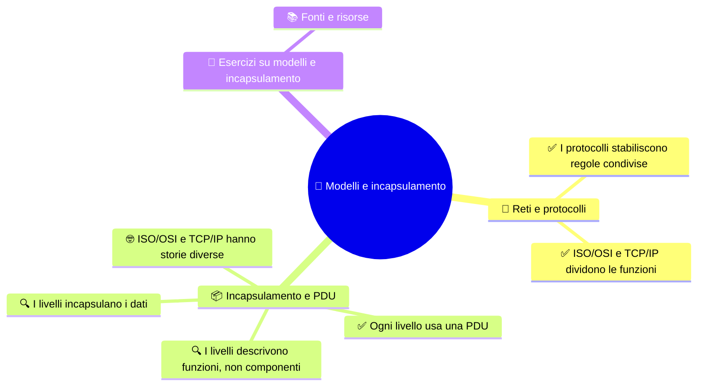

# 🧭 Modelli e incapsulamento
Markdown .MD

**4DI · Settembre-Ottobre · S1 · Teoria**

> **Legenda:** ✅ da sapere · 🔍 per capire fino in fondo · 🤓 facoltativo, per curiosi · 🃏 flashcard: rispondi a voce, poi apri per controllare



## 📨 Reti e protocolli

Quando scriviamo un messaggio, vogliamo che arrivi a un altro programma, magari su un dispositivo lontano. Tra invio e ricezione servono molte decisioni: come rappresentare i dati, a quale programma consegnarli, quale destinazione raggiungere e quali segnali usare. I modelli a livelli ci aiutano a dividere questo lavoro.

Immagina di inviare una richiesta a un sito. Il browser prepara i dati; il livello di trasporto li associa al programma giusto; IP li indirizza verso la rete di destinazione; il collegamento li prepara per il tratto successivo; infine il mezzo trasforma i bit in segnali. Nessun singolo passaggio deve fare tutto. Ogni funzione usa le informazioni lasciate dal passaggio precedente e aggiunge ciò che serve al proprio compito.

### ✅ I protocolli stabiliscono regole condivise

Una **rete informatica** collega dispositivi che scambiano informazioni. Per capirsi, usano **protocolli**: regole che stabiliscono come formare, interpretare o trasferire i messaggi.

La rete Wi-Fi di casa è una rete; Internet è una **rete di reti**, formata da molte reti che comunicano usando protocolli condivisi. Ogni dispositivo non deve conoscere tutti i dettagli del viaggio: riceve un compito preciso.

Un protocollo non è una promessa che tutto andrà sempre bene. È un accordo tecnico su come agire: se un dispositivo invia informazioni nel formato previsto e l'altro conosce le stesse regole, possono interpretarle nello stesso modo. Le regole possono specificare, per esempio, come riconoscere l'inizio di un messaggio o a quale programma consegnare i dati.

<details>
<summary>🃏 Che cosa collega una rete informatica?</summary>
Dispositivi che scambiano informazioni seguendo regole condivise.
</details>
<details>
<summary>🃏 Che cos'è un protocollo?</summary>
Un insieme di regole per formare, interpretare o trasferire informazioni.
</details>
<details>
<summary>🃏 Internet è una singola rete locale?</summary>
No. È una rete di reti, formata da molte reti collegate fra loro.
</details>

### ✅ ISO/OSI e TCP/IP dividono le funzioni

Il modello **ISO/OSI** divide la comunicazione in sette livelli. Il modello **TCP/IP** spesso ne usa quattro, raggruppando diversamente alcune funzioni. Non esiste una corrispondenza perfetta uno-a-uno.

|             ISO/OSI | Compito in parole semplici               | TCP/IP a quattro livelli |
| ------------------: | ---------------------------------------- | ------------------------ |
|      7 Applicazione | Servizi usati dai programmi              | Applicazione             |
|     6 Presentazione | Formato, codifica e protezione dei dati  | Applicazione             |
|          5 Sessione | Gestione concettuale della conversazione | Applicazione             |
|         4 Trasporto | Consegna ai programmi tramite porte      | Trasporto                |
|              3 Rete | Indirizzi e comunicazione fra reti       | Internet                 |
| 2 Collegamento dati | Consegna sul collegamento locale         | Accesso alla rete        |
|            1 Fisico | Segnali e mezzo di trasmissione          | Accesso alla rete        |

Sono mappe utili per spiegare funzioni. Non sono sette pezzi hardware impilati dentro ogni computer.

<details>
<summary>🃏 Quanti livelli ha il modello ISO/OSI?</summary>
Sette.
</details>
<details>
<summary>🃏 Quanti livelli ha spesso il modello TCP/IP didattico?</summary>
Quattro, con alcune funzioni raggruppate diversamente rispetto a ISO/OSI.
</details>
<details>
<summary>🃏 ISO/OSI e TCP/IP hanno una corrispondenza perfetta livello per livello?</summary>
No. Alcuni livelli ISO/OSI corrispondono a un solo livello TCP/IP, altri vengono raggruppati.
</details>

## 📦 Incapsulamento e PDU

### ✅ Ogni livello usa una PDU

Una **PDU** (*Protocol Data Unit*) è l'unità di informazione considerata da un livello. Nel modello usato in questa lezione, il viaggio si può riassumere così:

```text
dati → segmento TCP / datagramma UDP → pacchetto IP → frame → segnali
```

Il nome cambia perché cambia il compito. Il livello Internet tratta un **pacchetto**; il collegamento dati tratta un **frame**; il mezzo trasporta segnali che rappresentano bit.

Non sono messaggi indipendenti uno dopo l'altro. I dati dell'applicazione restano il contenuto da consegnare, mentre ogni livello li considera insieme alle informazioni che gli servono. Per esempio, un pacchetto IP può essere inserito in un frame per attraversare il collegamento locale: il frame è l'involucro esterno di quel tratto, non un sostituto del pacchetto.

<details>
<summary>🃏 Che cosa significa PDU?</summary>
Protocol Data Unit: l'unità di informazione considerata da un livello.
</details>
<details>
<summary>🃏 Qual è la PDU di IP?</summary>
Il pacchetto.
</details>
<details>
<summary>🃏 Qual è la PDU del collegamento dati?</summary>
Il frame.
</details>
<details>
<summary>🃏 In quale ordine troviamo dati, segmento, pacchetto e frame?</summary>
Dati, segmento TCP o datagramma UDP, pacchetto IP, frame; poi i segnali sul mezzo.
</details>

### 🔍 I livelli incapsulano i dati

Quando i dati scendono verso il mezzo, ogni livello può aggiungere informazioni utili al proprio compito. Il trasporto può indicare a quale programma consegnare; IP aggiunge indirizzi logici; il collegamento aggiunge informazioni per il tratto locale. Il mezzo trasmette segnali secondo regole condivise.

Il destinatario interpreta le informazioni nell'ordine inverso: è il **decapsulamento**. Un router può ricreare il frame per il collegamento successivo, mentre il pacchetto IP continua il suo viaggio verso la destinazione.

Seguiamo un singolo invio. Il programma consegna i propri dati al trasporto; il trasporto aggiunge le informazioni per raggiungere il programma destinatario; IP aggiunge gli indirizzi logici; Ethernet prepara un frame per il collegamento locale. Al router, il frame ricevuto serve a leggere il pacchetto e a consegnarlo al passo successivo. Quando il pacchetto esce su un'altra rete, il router lo racchiude in un nuovo frame adatto a quel collegamento. Il computer destinatario ripete il percorso al contrario finché i dati arrivano al programma corretto.

Ogni livello non aggiunge informazioni «per decorazione»: le aggiunge perché il suo compito richiede un destinatario, una destinazione o una modalità di trasmissione. Questo spiega anche perché un router può inoltrare un pacchetto senza sapere che cosa significhi il testo o l'immagine contenuti.

```text
Invio:       dati → segmento → pacchetto → frame → segnali
Ricezione:   dati ← segmento ← pacchetto ← frame ← segnali
```

<details>
<summary>🃏 Che cos'è l'incapsulamento?</summary>
Il processo in cui i livelli aggiungono informazioni ai dati per svolgere i rispettivi compiti.
</details>
<details>
<summary>🃏 Che cos'è il decapsulamento?</summary>
Il percorso inverso con cui il destinatario interpreta e rimuove le informazioni aggiunte dai livelli.
</details>
<details>
<summary>🃏 Perché i livelli aggiungono informazioni diverse?</summary>
Perché ognuno deve svolgere un compito diverso, come consegnare a un programma o raggiungere una rete.
</details>

### 🔍 I livelli descrivono funzioni, non componenti

Un livello descrive una **funzione**, non necessariamente un componente separato. Una scheda di rete può svolgere più funzioni; un protocollo può coinvolgere software e hardware. Cambiare il mezzo, per esempio, non obbliga a cambiare il significato del messaggio.

La mappa aiuta a fare domande precise: quale informazione manca? Quale responsabilità deve occuparsene? Ma non mostra tutti i dettagli di ogni dispositivo reale.

<details>
<summary>🃏 I sette livelli ISO/OSI sono sette componenti fisici?</summary>
No. Sono funzioni organizzate in una mappa concettuale.
</details>
<details>
<summary>🃏 Che cosa aiuta a capire una mappa a livelli?</summary>
Quale responsabilità svolge una parte della comunicazione e quale informazione le serve.
</details>

### 🤓 ISO/OSI e TCP/IP hanno storie diverse

> ISO/OSI è un modello di riferimento sviluppato per descrivere sistemi aperti. La famiglia TCP/IP è cresciuta attraverso l'uso di protocolli capaci di far comunicare reti diverse. Ancora oggi usiamo entrambe le mappe: una aiuta a ragionare per funzioni, l'altra a collocare i protocolli Internet.
>
> Le date della standardizzazione non sono richieste per la verifica. La domanda utile è: quale modello rende più chiaro il problema che sto studiando?

<details>
<summary>🃏 Perché si usano ancora sia ISO/OSI sia TCP/IP?</summary>
ISO/OSI è una mappa utile per ragionare sulle funzioni; TCP/IP aiuta a descrivere la famiglia di protocolli Internet.
</details>

## 🧩 Esercizi su modelli e incapsulamento

1. Metti in ordine dati, frame, pacchetto IP, segnali e segmento TCP.
2. Spiega con parole tue che cosa aggiunge l'incapsulamento.
3. Perché un modello a livelli non è una fotografia del computer?
4. Se cambia il mezzo di trasmissione, quali altre funzioni possono restare uguali?

**Uscita:** completa «Un modello a livelli mi aiuta a ..., ma non mi dice automaticamente ...».

## 📚 Fonti e risorse

- [RFC 1122 - Requirements for Internet Hosts](https://www.rfc-editor.org/rfc/rfc1122): riferimento sui protocolli Internet.
- [Cloudflare - OSI Model](https://www.cloudflare.com/learning/ddos/glossary/open-systems-interconnection-model-osi/): panoramica introduttiva dei livelli.

---

[➡️ S2 - Il livello fisico e Ethernet](%28STU%29%204DI%20sett-ott%20S2%20-%20Il%20livello%20fisico%20e%20Ethernet.md) · [🗺️ Indice](%28STU%29%204DI%20-%20SETT-OTT.md)