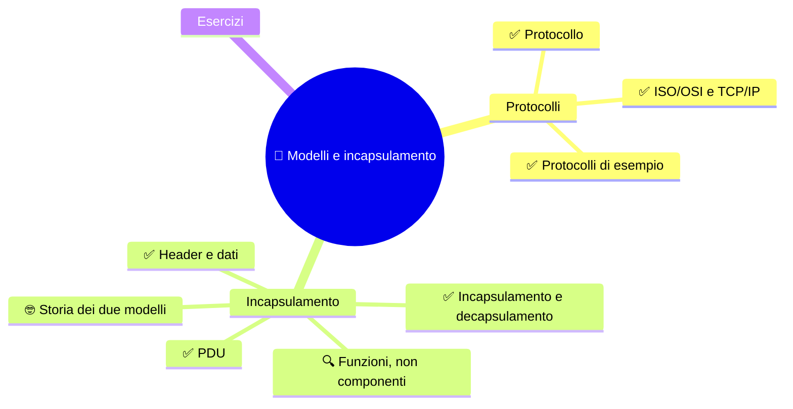
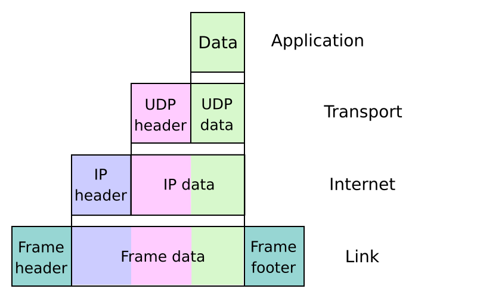

🏠 [Indice](%28STU%29%204DI%20-%20SETT-OTT.md) · [S2 - Il livello fisico e Ethernet](%28STU%29%204DI%20sett-ott%20S2%20-%20Il%20livello%20fisico%20e%20Ethernet.md) ➡️

# 🧭 Modelli e incapsulamento

**4DI · Settembre-Ottobre · S1 · Teoria**

⏱️ **Tempo di studio: circa 30 minuti.** ✅ essenziale: 20 min. 🔍 per il voto alto: 10 min. 🤓 si può saltare. Nessun compito obbligatorio a casa.

> **Legenda:** ✅ da sapere · 🔍 per capire fino in fondo · 🤓 facoltativo · 📜 storia · 🧪 esempio · ⚠️ errore comune · 🧠 da ricordare · ✏️ da fare · 🃏 flashcard (rispondi a voce, poi apri)

## 🗺️ Mappa



## 📜 Perché ci servono regole

Gli esseri umani cooperano in milioni perché condividono culture, storie, regole: lingue, leggi, denaro. Nessuno ha mai «visto» una lingua. Eppure funziona.

Le macchine hanno lo stesso problema. Per parlarsi devono mettersi d'accordo su tutto.

29 ottobre 1969, le 22:30. Un laboratorio dell'università UCLA, in California. Uno studente, Charley Kline, prova a collegarsi a un computer dello Stanford Research Institute. All'altro capo c'è Bill Duvall. Kline vuole scrivere `LOGIN`. Digita due lettere. Il computer di Stanford si blocca. Il primo messaggio della rete che diventerà Internet è `LO`: quasi un «Hello».

Circa un'ora dopo Duvall sistema la macchina, Kline riprova e questa volta entra. Quel giorno è nata una domanda che useremo tutto l'anno: <u>chi fa che cosa, quando un messaggio parte?</u>

> 😄 Nei laboratori di rete si scherza su un «livello 8»: l'utente. Non esiste negli standard. Ma ogni tecnico lo ha incontrato.

## 📨 Protocolli e modelli

### ✅ Un protocollo è una regola condivisa

Una **rete** collega dispositivi che scambiano informazioni. Per capirsi usano **protocolli**.

<u>Un protocollo è un accordo su come formare, inviare e interpretare un messaggio.</u>

Internet è una **rete di reti**: tante reti diverse che parlano gli stessi protocolli.

Un protocollo è un po' come il galateo di una cena: dice chi saluta per primo, chi risponde, che cosa si dice. Esempi veri (HTTP, TCP, IP...) li trovi poco più avanti, nella tabella dei livelli.

⚠️ Un protocollo non garantisce che tutto vada bene. Dice solo come comportarsi.

<details>
<summary>🃏 <b>Che cos'è un protocollo?</b></summary>
Un insieme di regole per formare, inviare e interpretare i messaggi.
</details>
<details>
<summary>🃏 <b>Che cos'è Internet?</b></summary>
Una rete di reti che comunicano con protocolli condivisi.
</details>

### ✅ Due mappe: ISO/OSI e TCP/IP

Dividere il lavoro rende tutto più semplice. Ogni livello ha un compito.

| ISO/OSI (7 livelli) | Compito | TCP/IP (4 livelli) |
|---:|---|---|
| 7 Applicazione | Servizi per i programmi | Applicazione |
| 6 Presentazione | Formato e codifica dei dati | Applicazione |
| 5 Sessione | Gestione della conversazione | Applicazione |
| 4 Trasporto | Consegna al programma giusto | Trasporto |
| 3 Rete | Indirizzi, tra reti diverse | Internet |
| 2 Collegamento dati | Consegna sul tratto locale | Accesso alla rete |
| 1 Fisico | Segnali sul mezzo | Accesso alla rete |

*Le due mappe non coincidono riga per riga: TCP/IP raggruppa alcune funzioni.*

⚠️ <u>I livelli sono funzioni, non pezzi di hardware.</u> Non esistono sette scatole impilate dentro il computer.

⚠️ <u>I protocolli veri di Internet sono quelli della famiglia TCP/IP.</u> ISO/OSI è soprattutto una mappa per ragionare: i protocolli progettati per OSI esistono sulla carta, ma non sono quelli che usiamo. Perché è andata così lo racconta la storia in fondo alla dispensa.

<details>
<summary>🃏 <b>Quanti livelli ha ISO/OSI?</b></summary>
Sette.
</details>
<details>
<summary>🃏 <b>Quanti livelli ha il TCP/IP didattico?</b></summary>
Quattro.
</details>
<details>
<summary>🃏 <b>I livelli corrispondono uno a uno nei due modelli?</b></summary>
No: TCP/IP raggruppa alcune funzioni di ISO/OSI.
</details>
<details>
<summary>🃏 <b>Quale livello consegna i dati al programma giusto?</b></summary>
Il livello di trasporto.
</details>

✏️ **Prevedi (2 min).** Copri la colonna dei livelli. Per ogni compito scrivi il numero del livello ISO/OSI: **A)** «Consegna al programma giusto»; **B)** «Segnali sul mezzo»; **C)** «Indirizzi, tra reti diverse». Poi controlla con la tabella.

### ✅ Protocolli di esempio

I protocolli reali hanno nomi che conosci già. Eccoli, ognuno al suo livello TCP/IP. Non serve studiarli ora: li incontreremo uno alla volta.

| Livello TCP/IP | Protocolli di esempio | A che cosa servono |
|---|---|---|
| Applicazione | **HTTP**, **HTTPS** | pagine web (HTTPS è HTTP protetto) |
| | **SMTP** | invio delle email |
| Trasporto | **TCP** | consegna al programma giusto, con controlli |
| | **UDP** | consegna al programma giusto, veloce e senza controlli |
| Internet | **IP** (IPv4, IPv6) | indirizzi e viaggio fra reti diverse |
| | **ICMP** | messaggi di servizio (lo useremo con `ping`, a novembre) |
| Accesso alla rete | **Ethernet** | tratto locale con il cavo |
| | **Wi-Fi** | tratto locale via radio |

*Una pagina web usa quattro protocolli insieme, uno per livello.*

🧪 **Un messaggio vero: HTTP.** Quando scrivi un indirizzo nel browser, il browser invia al sito un messaggio di testo come questo:

```text
GET /index.html HTTP/1.1
Host: www.example.com
```

*Riga 1: «dammi (**GET**) la pagina `/index.html`, parlando HTTP versione 1.1». Riga 2: «sul sito `www.example.com`».*

Il sito risponde con un'altra riga iniziale, per esempio `HTTP/1.1 200 OK` seguita dalla pagina. **200** vuol dire «tutto bene». **404** vuol dire «pagina non trovata»: l'avrai visto spesso.

Questo messaggio è il **dato** del livello Applicazione. Nelle prossime sezioni vedremo come scende lungo i livelli.

<details>
<summary>🃏 <b>Quali sono due protocolli del livello Applicazione?</b></summary>
Per esempio HTTP (e HTTPS) per il web e SMTP per le email.
</details>
<details>
<summary>🃏 <b>A quale livello TCP/IP appartengono TCP e UDP?</b></summary>
Al livello Trasporto.
</details>
<details>
<summary>🃏 <b>Che cosa significa GET in una richiesta HTTP?</b></summary>
«Dammi questa pagina»: il browser chiede una risorsa al sito.
</details>
<details>
<summary>🃏 <b>Che cosa significa il codice 404?</b></summary>
Pagina non trovata.
</details>

✏️ **Collega (2 min).** Scrivi il livello TCP/IP di ciascuno: HTTP, UDP, IP, Wi-Fi. Poi controlla con la tabella.

## 📦 Incapsulamento e PDU

### ✅ Header e dati

Ogni livello lavora con due parti:

- il **payload** (*carico*): quello che deve consegnare, cioè ciò che gli passa il livello sopra;
- l'**header** (*intestazione*): una piccola etichetta, scritta **davanti** al payload, con le informazioni che servono **a quel livello**.

<u>L'header è l'etichetta del livello. Il payload è il contenuto.</u>

Pensa a un pacco postale. Dentro c'è il regalo (payload). Fuori c'è l'etichetta con mittente e destinatario (header). Il corriere legge l'etichetta, non apre il regalo.

Ogni livello ha un header con informazioni diverse:

| Livello | Che cosa scrive nel suo header (esempio) |
|---|---|
| Trasporto | per quale programma sono i dati (la «porta») |
| Rete (IP) | indirizzo di chi invia e di chi riceve |
| Collegamento (Ethernet) | indirizzi del tratto locale |

*Ogni livello scrive solo ciò che gli serve. Non legge, e non cambia, l'header degli altri.*

Alcuni livelli aggiungono anche una **coda** (*trailer*) **dietro** i dati. Il frame Ethernet ne ha una, con un controllo per accorgersi di errori.

<details>
<summary>🃏 <b>Che cos'è un header?</b></summary>
Un'etichetta davanti ai dati, con le informazioni che servono a un livello per fare il suo lavoro.
</details>
<details>
<summary>🃏 <b>Che cos'è il payload?</b></summary>
Il contenuto che un livello deve consegnare: ciò che gli passa il livello sopra.
</details>
<details>
<summary>🃏 <b>Un livello legge l'header degli altri livelli?</b></summary>
No: ogni livello usa solo il proprio header.
</details>

✏️ **Spiega in una frase (2 min).** Che differenza c'è fra l'etichetta di un pacco e il suo contenuto? Dove lo ritrovi in una rete?

### ✅ Ogni livello ha la sua PDU

Un livello riceve il payload dal livello sopra, ci scrive davanti il proprio header e passa tutto al livello sotto. Questo blocco, **header + payload**, è la **PDU** del livello (*Protocol Data Unit*, «unità di dati del protocollo»).

<u>La PDU è il «pacco» di un livello: il suo header più ciò che trasporta.</u>

Poiché ogni livello ha un header diverso, ogni PDU ha **un nome diverso**:

```text
dati → segmento → pacchetto → frame → segnali
```

| Livello | PDU | Che cosa contiene |
|---|---|---|
| Applicazione | dati | il messaggio (per esempio la richiesta GET) |
| Trasporto | segmento (TCP) o datagramma (UDP) | header del trasporto + i dati |
| Rete / Internet | pacchetto | header IP + il segmento |
| Collegamento dati | frame | header Ethernet + il pacchetto (+ coda) |
| Fisico | segnali (che rappresentano bit) | il frame trasformato in segnali |

*Ogni PDU contiene quella del livello sopra, come scatole una dentro l'altra.*

🧪 **Un esempio.** Il browser invia `GET /index.html`. Quei dati diventano un **segmento** quando il trasporto aggiunge il suo header. Il segmento diventa un **pacchetto** quando IP aggiunge il suo. Il pacchetto diventa un **frame** quando Ethernet aggiunge il suo. Il contenuto è sempre la richiesta GET: cambia solo la busta che la contiene.

⚠️ <u>Pacchetto, segmento e frame non sono sinonimi.</u> Ognuno è il «pacco» di un livello preciso.

<details>
<summary>🃏 <b>Che cos'è una PDU?</b></summary>
Il «pacco» di un livello: il suo header più il payload che trasporta.
</details>
<details>
<summary>🃏 <b>Qual è la PDU del livello Rete?</b></summary>
Il pacchetto.
</details>
<details>
<summary>🃏 <b>Qual è la PDU del collegamento dati?</b></summary>
Il frame.
</details>
<details>
<summary>🃏 <b>In che ordine si formano le PDU quando i dati scendono?</b></summary>
Dati, segmento, pacchetto, frame, segnali.
</details>

### ✅ Ogni livello aggiunge la sua busta

Quando i dati scendono verso il mezzo, ogni livello li chiude in una busta con le informazioni che gli servono. È l'**incapsulamento**.

```text
dati
[TCP | dati]                        segmento
[IP | TCP | dati]                   pacchetto
[ETH | IP | TCP | dati | coda ETH]  frame
```

*Ogni riga contiene la precedente. Le sigle davanti sono gli **header** (TCP, IP, ETH). Solo il frame ha una coda.*



*Lo stesso viaggio in figura. Qui il trasporto è UDP. Autore: Cburnett (colori: Kbrose), licenza CC BY-SA 3.0, da [Wikimedia Commons](https://commons.wikimedia.org/wiki/File:UDP_encapsulation.svg).*

Chi riceve fa il percorso inverso: **decapsulamento**. Ogni livello apre la sua busta, cioè legge e toglie il **proprio** header, e passa il contenuto al livello sopra.

🧪 **Un esempio.** Il browser chiede una pagina a un sito.

| Passo | Chi | Che cosa fa |
|---|---|---|
| 1 | Applicazione | prepara la richiesta (`GET /index.html`) |
| 2 | Trasporto | aggiunge il suo header: per quale programma sono i dati |
| 3 | Rete | aggiunge il suo header: indirizzi di partenza e arrivo |
| 4 | Collegamento | aggiunge il suo header (e la coda) per il tratto locale |
| 5 | Fisico | trasmette i segnali |

**Che cosa succede lungo la strada.** Un viaggio in rete è fatto di **tratti**: ogni tratto è un collegamento fra due dispositivi vicini (PC → router, router → router, router → server). Il frame vale **solo su un tratto**: porta gli indirizzi locali di quel collegamento. Il pacchetto, invece, porta gli indirizzi di **partenza e arrivo** dell'intero viaggio.

```text
PC ──frame 1──► Router A ──frame 2──► Router B ──frame 3──► Server
     [ pacchetto ]          [ pacchetto ]          [ pacchetto ]
```

*Il pacchetto è sempre lo stesso. I frame sono tre, uno per tratto.*

A ogni router succede questo: 1) riceve il frame; 2) lo apre e legge il pacchetto; 3) lo richiude in un **nuovo frame**, adatto al tratto successivo. Come un pacco che passa fra corrieri diversi: ogni corriere mette la propria etichetta di trasporto, ma l'indirizzo finale scritto sul pacco non cambia.
> *Dove l'immagine della busta smette di funzionare:* nei dati reali le «buste» non sono scatole separate. Sono campi scritti uno dopo l'altro nello stesso flusso di bit.

<details>
<summary>🃏 <b>Che cos'è l'incapsulamento?</b></summary>
I livelli, scendendo, aggiungono ai dati le informazioni di cui hanno bisogno.
</details>
<details>
<summary>🃏 <b>Che cos'è il decapsulamento?</b></summary>
Il percorso inverso: chi riceve apre le buste, livello dopo livello.
</details>
<details>
<summary>🃏 <b>Un router cambia il pacchetto o il frame?</b></summary>
Crea un nuovo frame per il tratto successivo; il pacchetto prosegue.
</details>
<details>
<summary>🃏 <b>Quanto vale un frame?</b></summary>
Solo su un tratto, cioè fra due dispositivi vicini. Il pacchetto vale per tutto il viaggio.
</details>
<details>
<summary>🃏 <b>Perché ogni livello aggiunge informazioni diverse?</b></summary>
Perché ogni livello ha un compito diverso, come indicare il programma o la rete di destinazione.
</details>

✏️ **Disegna (3 min).** Su un foglio disegna tre buste una dentro l'altra e scrivi cosa contiene ciascuna. Poi confrontala con lo schema.

✏️ **Trova l'errore (2 min).** «Il router apre il messaggio e legge la mia email.» Che cosa non torna? *(Indizio: che cosa legge davvero un router?)*

### 🔍 I livelli sono funzioni, non componenti

Una scheda di rete può svolgere più funzioni. Un protocollo può coinvolgere software e hardware. Se cambi il mezzo, per esempio da cavo a Wi-Fi, cambiano le regole del collegamento, ma non il significato del messaggio.

Il modello ci aiuta a fare una domanda precisa: <u>quale funzione manca?</u>

🧪 **Un esempio: «la pagina non si apre».** Invece di «non funziona niente», chiediti dal basso, un livello alla volta, quale funzione manca:

| Che cosa osservi | Quale funzione manca | Livello |
|---|---|---|
| il cavo è staccato, nessun segnale | trasmettere i segnali | 1 Fisico |
| sei collegato, ma l'indirizzo della rete è sbagliato | raggiungere l'altra rete | 3 Rete |
| il sito risponde «404, pagina non trovata» | trovare quella pagina sul server | 7 Applicazione |

*Tre guasti diversi, tre funzioni diverse. Il modello non ripara niente: ti dice **dove cercare**.*

<details>
<summary>🃏 <b>Che domanda ci aiuta a fare il modello a livelli?</b></summary>
Quale funzione manca: così sappiamo a quale livello cercare.
</details>
<details>
<summary>🃏 <b>I livelli ISO/OSI sono sette componenti fisici?</b></summary>
No: sono funzioni in una mappa concettuale.
</details>
<details>
<summary>🃏 <b>Se cambia il mezzo di trasmissione, il significato del messaggio cambia?</b></summary>
No: cambiano le regole del tratto fisico e locale, non il messaggio.
</details>

### 🤓 Due modelli, due storie
Perché esistono due modelli (ISO/OSI e TCP/IP), se poi i protocolli "reali" di internet sono quelli di TCP/IP? Un po' di storia dell'internet: una storia di "burocrazia vs cose che funzionano".
Piccolo spoiler: abbiamo "rischiato" di avere dei protocolli ISO/OSI, ma ha vinto TCP/IP.

> 📜 **Il progetto perfetto contro il codice che funziona.**
>
> Fine anni Settanta. Il mondo dei computer è una torre di Babele. IBM ha la sua rete (SNA), DEC la sua (DECnet), Xerox la sua (XNS): le macchine di un'azienda non sanno parlare con quelle di un'altra. Nasce un sogno ordinato: scrivere *prima* le regole, tutte insieme, e costruire poi le macchine che le rispettano. Così, dal 1978, prende forma l'**OSI** (*Open Systems Interconnection*), sotto l'ombrello dell'ISO, l'organizzazione internazionale degli standard. Sette livelli, ordinati e completi. Ma attorno al tavolo siedono costruttori, compagnie telefoniche statali e IBM, e ognuno difende i propri interessi: riunioni, bozze, compromessi. Un cantiere da cattedrale. Il modello esce nel 1984.
>
> Intanto, dall'altra parte dell'oceano, un altro gruppo lavora in modo molto meno solenne. Sono ricercatori finanziati dal Dipartimento della Difesa americano, insieme a università di vari Paesi, e vogliono una cosa sola: far parlare reti diverse. Vint Cerf e Bob Kahn pubblicano l'idea nel 1974. Poi si prova, si corregge, si riprova. Il 1° gennaio 1983, il «flag day», ARPANET abbandona il vecchio protocollo e passa al TCP/IP. Sembra un salto nel buio. Funziona.
>
> Negli anni Ottanta i due mondi si sfidano. Governi europei (Francia, Germania Ovest, Regno Unito) e il Dipartimento del Commercio americano impongono l'OSI. Persino il Dipartimento della Difesa progetta di passare dal TCP/IP all'OSI. Eppure nelle università i computer continuano a parlare TCP/IP: funziona e c'è già. Nel 1989 l'università di Berkeley mette nel pubblico dominio il suo codice TCP/IP per Unix. Ogni mese qualche macchina in più si collega. Nello stesso anno Tim Berners-Lee, al CERN, scrive la proposta del Web: nasce sopra il TCP/IP. Il resto è storia.
>
> Nel 1992 la tensione esplode. Il consiglio tecnico di Internet propone di sostituire IP con un protocollo OSI. Alla riunione dell'IETF, la comunità che scrive gli standard di Internet, Vint Cerf si presenta in giacca e cravatta e si spoglia sul palco: sotto ha una maglietta con la scritta *«IP on Everything»*. Lo stesso giorno David Clark riassume lo spirito della comunità in una frase: *«Rifiutiamo re, presidenti e votazioni. Crediamo nel consenso approssimativo e nel codice che funziona»* (*rough consensus and running code*).
>
> Perché ha vinto il «brutto» e non il «bello»? Una risposta è lì: Internet cresceva provando, correggendo e usando; l'OSI era pensato per essere perfetto prima di partire.
>
> Ma l'OSI non è sparito. Ha perso la guerra dei protocolli, ma i suoi sette livelli sono ancora la lingua con cui i tecnici di tutto il mondo si spiegano i problemi. Per questo studiamo entrambi. Il TCP/IP per sapere **che cosa gira davvero**, l'OSI per sapere **come parlarne**.
>
> 🧠 Un'idea per la vita: gli standard scritti prima di provarli rischiano di arrivare tardi; quelli provati sul campo rischiano di essere confusi. Quasi sempre serve un po' di entrambi.
>
> *Le date servono come contesto: non si verificano.*

<details>
<summary>🃏 <b>Perché usiamo ancora due modelli?</b></summary>
OSI aiuta a ragionare per funzioni; TCP/IP descrive i protocolli di Internet.
</details>

## ✏️ Esercizi

1. **Riordina.** Metti in ordine: frame, dati, pacchetto, segnali, segmento.
2. **Spiega in una frase.** Che cosa aggiunge un livello quando incapsula?
3. **Prevedi.** Se passi dal cavo al Wi-Fi, quale livello cambia di più?
4. **Completa.** «Un modello a livelli mi aiuta a ..., ma non mi dice ...».
5. **Segui il messaggio.** La richiesta `GET /index.html` parte dal tuo browser: scrivi, livello per livello, quale header viene aggiunto e come si chiama la PDU.

## 📚 Fonti e risorse

- [RFC 1122 - Requirements for Internet Hosts](https://www.rfc-editor.org/rfc/rfc1122): il riferimento ufficiale sui protocolli Internet. Per consultazione, non per studio.
- [Wikipedia - Encapsulation (networking)](https://en.wikipedia.org/wiki/Encapsulation_(networking)): una pagina breve con schemi, per rivedere l'incapsulamento.
- [Wikipedia - ARPANET](https://en.wikipedia.org/wiki/ARPANET): la storia del 1969 («LO») e del passaggio a TCP/IP il 1° gennaio 1983. Da leggere per curiosità.
- [Wikipedia - Protocol Wars](https://en.wikipedia.org/wiki/Protocol_Wars): la sfida fra OSI e TCP/IP, con la scena della maglietta «IP on Everything». Da leggere per curiosità.
- [Cloudflare - Modello OSI](https://www.cloudflare.com/learning/ddos/glossary/open-systems-interconnection-model-osi/): panoramica dei sette livelli, in inglese.

---

🏠 [Indice](%28STU%29%204DI%20-%20SETT-OTT.md) · [S2 - Il livello fisico e Ethernet](%28STU%29%204DI%20sett-ott%20S2%20-%20Il%20livello%20fisico%20e%20Ethernet.md) ➡️
