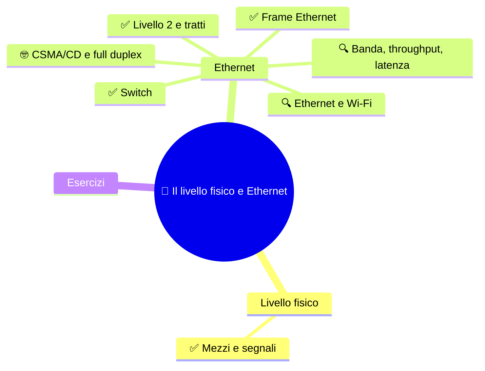
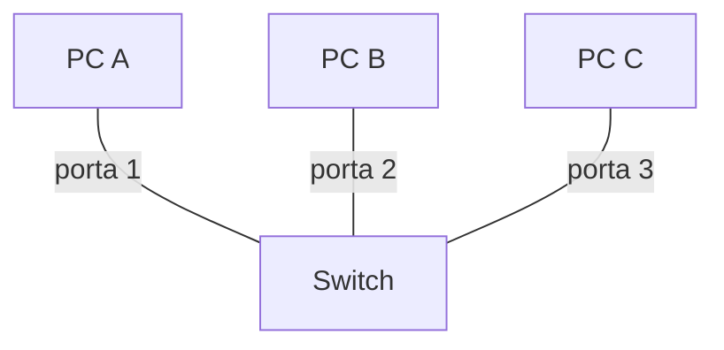
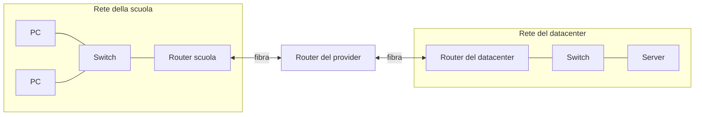

⬅️ [S1 - Modelli e incapsulamento](%28STU%29%204DI%20sett-ott%20S1%20-%20Modelli%20e%20incapsulamento.md) · 🏠 [Indice](%28STU%29%204DI%20-%20SETT-OTT.md) · [S3 - IPv4 e il pacchetto](%28STU%29%204DI%20sett-ott%20S3%20-%20IPv4%20e%20il%20pacchetto.md) ➡️

# 📡 Il livello fisico e Ethernet

**4DI · Settembre-Ottobre · S2 · Teoria**

⏱️ **Tempo di studio: circa 35 minuti.** ✅ essenziale: 21 min. 🔍 per il voto alto: 14 min. 🤓 si può saltare. Nessun compito obbligatorio a casa.

> **Legenda:** ✅ da sapere · 🔍 per capire fino in fondo · 🤓 facoltativo · 📜 storia · 🧪 esempio · ⚠️ errore comune · 🧠 da ricordare · ✏️ da fare · 🃏 flashcard (rispondi a voce, poi apri)

## 🗺️ Mappa




## 📜 Un'isola, una stanza, un cavo


Siamo nel 1968. Alle Hawaii l'università ha un problema da isola: gli utenti sono sparsi su isole diverse. Il professor Norman Abramson e il suo gruppo vogliono collegarli con apparecchi radio a basso costo. Nasce ALOHAnet: terminali collegati con **onde radio**. Ma c'è un guaio: tutti parlano sulla stessa frequenza. Se due trasmettono insieme, i messaggi si sovrappongono e vanno rifatti.

1972-73. Xerox PARC, California. Bob Metcalfe e David Boggs devono collegare i primi computer personali (gli Alto) a una stampante laser. Metcalfe conosce ALOHAnet. Si chiede: e se invece delle onde radio usassimo un **cavo coassiale** condiviso? Stesso problema, stessa soluzione: ascoltare prima di parlare, e se ci si pesta i piedi, aspettare un tempo casuale. L'11 novembre 1973 la rete funziona, a circa 3 Mbit/s.

Il nome lo sceglie Metcalfe. Pensa all'**etere** (*aether*), la sostanza che nell'Ottocento si credeva riempisse l'universo e portasse le onde. L'etere non esisteva. Ma il nome indica l'idea giusta: una rete che può correre su qualsiasi mezzo. Nasce **Ethernet**.

Metcalfe fa una scelta intelligente: invece di tenere la tecnologia per Xerox, convince DEC e Intel a farne uno standard. Nel 1980 esce la prima specifica a 10 Mbit/s, nel 1983 lo standard IEEE 802.3. Mezzo secolo dopo, Ethernet è ancora lo standard più diffuso per le reti locali cablate.

⚙️ **Chi è l'IEEE e che cos'è 802.3?** L'**IEEE** (*Institute of Electrical and Electronics Engineers*) è un'associazione internazionale di ingegneri. Una delle sue attività è scrivere **standard**: documenti pubblici che fissano le regole comuni, così gli apparecchi di produttori diversi funzionano insieme (come una spina o una presa USB: la forma è la stessa per tutti). Nel febbraio 1980 l'IEEE crea il comitato **802**, dedicato alle reti locali (*LAN*). Ogni gruppo di lavoro ha un numero dopo il punto: **802.3** è il gruppo di Ethernet, **802.11** quello del Wi-Fi.

> 😄 Regola dei tecnici di rete: quando qualcosa non funziona, controlla il **livello 1**. Il cavo è collegato? Sì, succede più spesso di quanto si ammetta.

## 🔌 Dal bit al segnale


### ✅ Il livello fisico trasmette segnali

Un computer lavora con **bit**. Un cavo trasporta **segnali**. Il livello fisico fa da traduttore.

<u>Il livello fisico trasforma i bit in segnali e i segnali in bit.</u>

| Mezzo           | Che cosa trasporta il segnale | Esempio                           |
| --------------- | ----------------------------- | --------------------------------- |
| Doppino in rame | variazioni elettriche         | cavo Ethernet da PC a switch      |
| Fibra ottica    | impulsi di luce               | collegamenti fra edifici, dorsali |
| Onde radio      | onde elettromagnetiche        | Wi-Fi                             |

*Il rame va bene per distanze brevi (nei cavi Ethernet in rame il limite standard è circa 100 metri). La fibra arriva molto più lontano. La radio non ha cavi, ma è più disturbabile.*

Il livello fisico **non sa** che cosa trasporta: una foto, una mail, una pagina. Vede solo segnali. Anche la regola «1 = tensione alta» è troppo semplice: le codifiche reali usano transizioni e sequenze di segnali, per aiutare chi riceve a restare sincronizzato.

⚠️ I livelli 1 e 2 in TCP/IP stanno nello stesso livello, **Accesso alla rete**. Cambiano le mappe, non il viaggio.

<details>
<summary>🃏 <b>Che cosa fa il livello fisico?</b></summary>
Trasforma i bit in segnali sul mezzo e i segnali in bit.
</details>
<details>
<summary>🃏 <b>Che cosa trasporta il segnale nella fibra ottica?</b></summary>
Impulsi di luce.
</details>
<details>
<summary>🃏 <b>Il livello fisico conosce il significato del messaggio?</b></summary>
No. Trasmette segnali, senza interpretare il contenuto.
</details>

✏️ **Abbina (2 min).** Copri la tabella. Per rame, fibra e Wi-Fi scrivi che cosa trasporta il segnale. Poi controlla.

## 🔌 Ethernet e il frame


### ✅ Il frame Ethernet è la busta del tratto locale

Nella S1 abbiamo visto che il livello 2 usa il **frame**. In Ethernet il frame ha questa forma:


*Il frame Ethernet II. Tre campi di intestazione (14 byte), poi i dati (46-1500 byte), poi il controllo finale. Dominio pubblico, da [Wikimedia Commons](https://commons.wikimedia.org/wiki/File:Ethernet_Type_II_Frame_format.svg).*

| Campo | A che cosa serve |
|---|---|
| **MAC di destinazione** | chi deve ricevere il frame sul collegamento locale |
| **MAC sorgente** | chi lo ha inviato |
| **EtherType** | che cosa c'è dentro: IPv4, IPv6, ARP... |
| **Dati** | il contenuto: spesso un pacchetto IP |
| **CRC (FCS)** | un controllo per scoprire alcuni errori |

⚙️ **Perché serve l'EtherType?** Il campo dati è solo una fila di bit, senza etichetta. Quando il frame arriva, la scheda di rete deve sapere a chi consegnarla: al software che gestisce IPv4? A quello di IPv6? Di ARP? L'**EtherType** è questa etichetta: un numero di 2 byte. Per esempio `0x0800` = IPv4, `0x86DD` = IPv6, `0x0806` = ARP. È come la scritta sulla busta di un corriere: «contiene una fattura», «contiene un pacco». Senza, il ricevente aprirebbe la busta senza sapere che cosa aspettarsi.

Un **indirizzo MAC** ha 48 bit ed è legato alla scheda di rete. Di solito si scrive in esadecimale, per esempio `00:1A:2B:3C:4D:5E`.

<details>
<summary>🧠 Mi raccomando: <u>il frame trasporta il pacchetto. Non lo sostituisce.</u> Il frame è la PDU del livello 2; il pacchetto IP è la PDU del livello 3, ed è dentro il campo dati.</summary>
⚙️ **In parole semplici.** Pensa a una **lettera dentro una busta**. La lettera è il pacchetto IP: porta l'indirizzo di destinazione finale. La busta è il frame: porta solo l'indirizzo del prossimo passaggio (il corriere di zona). Ad ogni passaggio si cambia busta, ma la lettera resta la stessa.
</details>

```text
frame = [ MAC dest | MAC sorg | EtherType | [ pacchetto IP ] | CRC ]
```

⚠️ Mi raccomando numero 2: **MAC e IP non sono due nomi della stessa cosa.**

|               | MAC                              | IP                                         |
| ------------- | -------------------------------- | ------------------------------------------ |
| Livello       | 2 (collegamento)                 | 3 (rete)                                   |
| Serve per     | consegnare **sul tratto locale** | raggiungere **un'altra rete**              |
| Quando cambia | a ogni tratto                    | resta lo stesso da sorgente a destinazione |

*Quest'ultima riga vale in un inoltro normale, senza traduzione di indirizzi (la rivedremo con il NAT).*

🧪 **Un esempio.** Un PC invia un pacchetto a un server in un'altra rete. Il primo frame ha come destinazione il **router vicino**. Il router apre il frame, legge il pacchetto, e lo richiude in un **nuovo frame** per il tratto successivo. Il pacchetto non cambia; il frame sì, a ogni tratto.

> 🤓 **Curiosità: un router può aprire anche gli altri livelli?** Sì. Nessuna legge fisica lo impedisce: la busta non è sigillata, e il router vede passare tutti i bit, anche quelli dei livelli superiori. Per mestiere guarda solo l'intestazione IP; ma un router *curioso* potrebbe leggere o modificare il resto. Che cosa ci protegge?
> - **Crittografia:** con HTTPS il contenuto viaggia cifrato. Il router vede *verso quale IP* vai, non *che cosa* scrivi.
> - **Fiducia:** ci fidiamo di chi gestisce i router (provider, scuola, azienda) e delle leggi che li regolano.
> - **Router falsi:** un Wi-Fi pubblico finto («bogus») può spiare chi non cifra. Per questo non basta fidarsi: serve cifrare.

<details>
<summary>🃏 <b>Qual è la PDU del collegamento dati?</b></summary>
Il frame.
</details>
<details>
<summary>🃏 <b>Quali campi formano l'intestazione di un frame Ethernet II?</b></summary>
MAC di destinazione, MAC sorgente ed EtherType.
</details>
<details>
<summary>🃏 <b>Che cosa indica EtherType?</b></summary>
Il tipo di contenuto trasportato (IPv4, IPv6, ARP...), così chi riceve sa a quale protocollo consegnare i dati.
</details>
<details>
<summary>🃏 <b>Quanti bit ha un indirizzo MAC?</b></summary>
48 bit.
</details>
<details>
<summary>🃏 <b>Che cosa cambia da un tratto all'altro del viaggio?</b></summary>
Il frame, con i suoi indirizzi MAC. Il pacchetto IP resta quello, se non c'è traduzione di indirizzi.
</details>
<details>
<summary>🃏 <b>Come si protegge il contenuto da un router curioso?</b></summary>
Con la crittografia (per esempio HTTPS): il router vede l'IP di destinazione, non il contenuto.
</details>

✏️ **Disegna (3 min).** Disegna il frame come una fila di caselle e scrivi i nomi dei campi. Poi confrontalo con la figura. Quale campo dice «che cosa c'è dentro»?

✏️ **Prevedi (2 min).** Un PC invia un pacchetto a un server lontano. Quale MAC di destinazione mette nel primo frame: quello del server o quello del router? Perché?

### ✅ Lo switch consegna i frame sul tratto locale

Uno **switch** collega i dispositivi di una rete locale. Il problema che risolve è semplice.

⚙️ **Il problema.** In un'aula ci sono tre PC. Ognuno ha un **cavo** che arriva a una scatola con tante prese: lo switch. Ogni presa Ethernet dello switch si chiama **porta** ed è numerata (1, 2, 3...). Di solito: un cavo per porta, un dispositivo per cavo. Il PC A manda un frame al PC C. Il frame entra nello switch dalla porta 1. Da quale porta deve uscire? Mandarlo a tutti sarebbe uno spreco (e tutti leggerebbero i fatti nostri). Lo switch deve **sapere chi è collegato a quale porta**.



*Tre PC, tre cavi, tre porte dello stesso switch.*

⚙️ **La soluzione: imparare guardando.** Lo switch tiene una **tabella**: «questo MAC si trova su questa porta». All'inizio è vuota. Poi, a ogni frame:

1. **Impara.** Guarda il **MAC sorgente** e la porta da cui il frame è entrato. Se A (porta 1) scrive a C, lo switch annota: «A è alla porta 1».
2. **Decide.** Guarda il **MAC di destinazione**. Se C è già in tabella, manda il frame **solo** sulla sua porta.
3. **Se non lo conosce,** manda il frame su **tutte le porte tranne quella di arrivo**. Solo C risponderà: e rispondendo si farà conoscere (passo 1).

Dopo poco scambio di frame, la tabella è completa:

| Porta | Dispositivo | MAC imparato |
|---:|---|---|
| 1 | PC A | `00:00:00:00:00:AA` |
| 2 | PC B | `00:00:00:00:00:BB` |
| 3 | PC C | `00:00:00:00:00:CC` |

*Una tabella di switch, semplificata: l'indirizzo e la porta dove lo ha visto passare. Un MAC ha 6 byte; per brevità nel testo li chiamiamo `AA`, `BB`, `CC`, come i loro ultimi byte.*

Lo switch **non apre il pacchetto IP**. Decide dove mandare le cose solo con i MAC. Un **router**, invece, collega reti diverse e decide guardando gli indirizzi IP. Nella rete reale le due cose spesso stanno nella stessa scatola: ma sono due decisioni diverse.

> *Dove l'immagine smette di funzionare:* la tabella reale ha tempi di scadenza e può contenere molti MAC per porta. Qui ci basta l'idea.

<details>
<summary>🃏 <b>Che cosa guarda lo switch per decidere dove inviare un frame?</b></summary>
Il MAC di destinazione, confrontato con la tabella delle porte.
</details>
<details>
<summary>🃏 <b>Come impara lo switch dove si trova un dispositivo?</b></summary>
Osserva il MAC sorgente dei frame e lo associa alla porta da cui arrivano.
</details>
<details>
<summary>🃏 <b>Qual è la differenza fra switch e router?</b></summary>
Lo switch consegna frame nella rete locale usando i MAC; il router collega reti diverse e inoltra pacchetti usando gli IP.
</details>

✏️ **Traccia (3 min).** Lo switch ha la tabella qui sopra. Arriva sulla porta 1 un frame da `AA` a `CC`. Su quale porta esce? E se la destinazione fosse `DD`, che non è in tabella?

### ✅ Il livello 2 lavora un tratto alla volta

Finora abbiamo visto un frame fra tre PC. Ma la rete vera è fatta di tante reti locali collegate da router. Questo è un esempio:



*Un PC in un'aula raggiunge un server in un datacenter. Ogni linea è un tratto, con il suo frame.*

⚙️ **Dove agisce.** Il livello 2 non vede il viaggio intero: vede **un tratto**. I tratti sono di due tipi:

| Tratto                     | Dove si trova                                           | Esempio                                                                       |
| -------------------------- | ------------------------------------------------------- | ----------------------------------------------------------------------------- |
| **Dentro una rete locale** | fra dispositivi collegati da switch (una **sottorete**) | PC, switch e router dell'aula informatica: da pochi metri a qualche centinaio |
| **Fra due router**         | un collegamento punto a punto                           | la fibra del provider tra due città, da pochi metri a molti chilometri        |

Un frame **nasce e muore dentro un tratto**: al router viene aperto, e per il tratto dopo ne nasce uno nuovo. Lo switch invece lo lascia intatto (non cambia il frame, lo sposta soltanto).

🧪 **Un esempio.** Il PC della scuola scrive al server del datacenter (nella figura). Geograficamente: la scuola è in una città, il router del provider in una città vicina, il datacenter magari a centinaia di chilometri. I frame sono **4**: PC → router della scuola (passando per lo switch), router scuola → router provider, router provider → router datacenter, router datacenter → server.

<details>
<summary>🃏 <b>Dove agisce il livello 2?</b></summary>
Su un solo tratto: dentro una rete locale, o fra due router collegati direttamente.
</details>
<details>
<summary>🃏 <b>Che cos'è una sottorete?</b></summary>
Un gruppo di dispositivi collegati da switch, che raggiungono il resto del mondo passando per un router.
</details>
<details>
<summary>🃏 <b>Lo switch cambia il frame?</b></summary>
No: lo sposta soltanto. Il frame cambia solo quando passa da un router.
</details>

✏️ **Conta (2 min).** Nella figura, un PC della scuola scrive a un secondo PC della stessa aula. Quanti router attraversa? Quanti frame servono?

### 🔍 Ethernet e Wi-Fi sono standard diversi

**Ethernet** è la famiglia **802.3** dell'IEEE (vedi sopra), soprattutto cablata. **Wi-Fi** è la famiglia IEEE **802.11**, via radio. Hanno regole diverse per il tratto locale, ma **un frame Ethernet e uno Wi-Fi possono trasportare lo stesso pacchetto IP**.

Un PC con il cavo e un telefono con il Wi-Fi possono raggiungere lo stesso sito: cambia il tratto locale, non il programma.

⚠️ Una presa o un simbolo Wi-Fi non garantiscono una velocità: contano lo standard, gli apparati, la distanza e il carico.

<details>
<summary>🃏 <b>Che cos'è l'IEEE?</b></summary>
Un'associazione internazionale di ingegneri che scrive standard tecnici, come 802.3 per Ethernet.
</details>
<details>
<summary>🃏 <b>Quali standard IEEE descrivono Ethernet e Wi-Fi?</b></summary>
Ethernet è 802.3; Wi-Fi è 802.11.
</details>
<details>
<summary>🃏 <b>Un PC con cavo e un telefono Wi-Fi possono raggiungere lo stesso server?</b></summary>
Sì: cambia il tratto locale, ma usano lo stesso protocollo IP.
</details>

### 🔍 Banda, throughput e latenza

Tre parole che spesso si scambiano. Non sono sinonimi.

| Grandezza            | Domanda a cui risponde                            | Immagine                                    |
| -------------------- | ------------------------------------------------- | ------------------------------------------- |
| **Banda** (nominale) | quanti bit al secondo può portare il collegamento | numero di corsie dell'autostrada            |
| **Throughput**       | quanti ne passano davvero                         | auto che passano davvero in un'ora          |
| **Latenza**          | quanto ci mette un dato ad arrivare               | lunghezza del tragitto, in termini di tempo |

*Dove l'immagine smette di funzionare:* sull'autostrada la lunghezza e le corsie sono indipendenti; in una rete reale anche l'attesa nelle code degli apparati fa parte della latenza.

🧪 **Un conto ideale.** Scarichiamo un file da 1 MB (decimale): sono circa **8 megabit**. Il collegamento ha una **banda** di 100 Mbit/s.

| Grandezza | Nel nostro esempio |
|---|---|
| **Banda** | 100 Mbit/s: la capacità dichiarata, la «larghezza dell'autostrada» |
| **Throughput** | circa 94 Mbit/s reali: una parte della banda se ne va in intestazioni e controlli |
| **Latenza** | per esempio 20 ms: il tempo che il primo dato impiega ad arrivare |

- **Minimo teorico:** 8 Mbit ÷ 100 Mbit/s = **0,08 s** (80 ms). A 1 Gbit/s: 8 ms.
- **Tempo più realistico:** 8 Mbit ÷ 94 Mbit/s ≈ 85 ms di trasferimento, più i 20 ms di latenza: circa **105 ms**.

*I valori di throughput e latenza sono inventati per l'esempio; in una rete vera si misurano.*

⚙️ **Che cosa significa «minimo teorico»?** È il tempo che si avrebbe in condizioni **perfette**: il collegamento pieno di soli dati, senza intestazioni, senza code, senza errori da rifare, senza altro traffico. La realtà può essere uguale o peggiore, mai migliore. È come il tempo del navigatore alla velocità massima, senza traffico né soste: arrivi in quel tempo, o dopo.

🧠 <u>Per scaricare un file grande conta il throughput. Per una chiamata o un gioco conta la latenza.</u>

<details>
<summary>🃏 <b>Che cos'è la banda nominale?</b></summary>
La capacità dichiarata del collegamento, in bit al secondo.
</details>
<details>
<summary>🃏 <b>Che cosa misura il throughput?</b></summary>
I dati che passano davvero in un intervallo di tempo.
</details>
<details>
<summary>🃏 <b>Che cos'è la latenza?</b></summary>
Il tempo che un dato impiega per arrivare (o per far tornare una risposta).
</details>
<details>
<summary>🃏 <b>Per un gioco online conta di più la banda o la latenza?</b></summary>
La latenza: ogni azione deve arrivare subito. *Esempio: hai 1 Gbit/s ma 300 ms di latenza. Premi «salta» e il personaggio salta dopo un terzo di secondo, perché il tuo comando è piccolissimo ma deve fare il viaggio. Con 10 Mbit/s e 15 ms il gioco è fluido.*
</details>

✏️ **Calcola (3 min).** Quanti megabit sono 5 MB? Quanto ci vuole, al minimo, a 100 Mbit/s? *(Ricorda: 1 byte = 8 bit.)*

✏️ **Spiega in una frase (2 min).** Perché una connessione con banda altissima può comunque dare un gioco lento?

### 🤓 CSMA/CD e full duplex

> Nei primi Ethernet, tutti i computer condividevano lo stesso cavo. Come in una stanza affollata, si può parlare solo se gli altri tacciono. Il protocollo **CSMA/CD** (*Carrier Sense Multiple Access with Collision Detection*) è questo galateo:
>
> 1. **Ascolta** se il cavo è libero (*Carrier Sense*).
> 2. Se è libero, **trasmetti**.
> 3. Mentre trasmetti, **controlla** se qualcun altro sta trasmettendo (*Collision Detection*). Se sì, c'è una **collisione**.
> 4. In caso di collisione, **fermati, aspetta un tempo casuale** e riprova.
>
> Il tempo è casuale perché, se tutti aspettassero lo stesso tempo, si scontrerebbero di nuovo. È la stessa idea di ALOHAnet, migliorata.
>
> **E oggi?** Una rete Ethernet moderna è fatta così: ogni dispositivo ha **il suo cavo** verso una porta dello switch. Nessun cavo è condiviso, quindi nessuno deve aspettare il proprio turno. Il collegamento è **full-duplex**: si può **inviare e ricevere nello stesso momento**, perché il cavo ha percorsi separati per le due direzioni (nella fibra, due fibre).
>
> - **Half-duplex** = il walkie-talkie: parli tu, poi parlo io (dire «passo»). Era il caso del cavo condiviso.
> - **Full-duplex** = il telefono: ci si parla e ci si ascolta insieme.
>
> Senza condivisione non ci sono collisioni, e CSMA/CD non serve più: spiega un problema storico, non descrive una rete moderna. Cambiano le velocità (oggi 1 o 10 Gbit/s e oltre), ma il frame resta quello. Per questo Ethernet ha 50 anni e funziona ancora.

<details>
<summary>🃏 <b>Perché CSMA/CD nasce?</b></summary>
Perché più computer condividevano lo stesso cavo e i loro segnali potevano sovrapporsi (collisione).
</details>
<details>
<summary>🃏 <b>Perché si aspetta un tempo casuale dopo una collisione?</b></summary>
Per non scontrarsi di nuovo con lo stesso dispositivo.
</details>
<details>
<summary>🃏 <b>Che cosa significa full-duplex?</b></summary>
Inviare e ricevere nello stesso momento, come in una telefonata. Il contrario è half-duplex, come un walkie-talkie.
</details>
<details>
<summary>🃏 <b>Una moderna porta switch full-duplex usa CSMA/CD?</b></summary>
No: ha un collegamento dedicato e può trasmettere e ricevere insieme.
</details>

## ✏️ Esercizi


1. **Riordina.** Metti in ordine: segnali, pacchetto IP, frame, dati.
2. **Trova l'errore.** «Lo switch legge l'indirizzo IP e decide dove mandare il frame.» Che cosa non torna?
3. **Spiega in una frase.** Perché il MAC cambia a ogni tratto e l'IP no?
4. **Collega (S1).** In quale PDU viaggia un segnale? In quale un indirizzo MAC?

**Uscita:** completa «Il mezzo trasporta ..., mentre il frame organizza ...».

## 📚 Fonti e risorse


- [Wikipedia - Ethernet](https://en.wikipedia.org/wiki/Ethernet): storia e versioni. Da leggere per curiosità la parte sulle origini a Xerox PARC.
- [Wikipedia - ALOHAnet](https://en.wikipedia.org/wiki/ALOHAnet): la rete radio delle Hawaii che ha ispirato Ethernet.
- [Wikipedia - Robert Metcalfe](https://en.wikipedia.org/wiki/Robert_Metcalfe): una persona, tre storie (ritorneranno in S5).
- [Wikimedia Commons - Ethernet Type II Frame format](https://commons.wikimedia.org/wiki/File:Ethernet_Type_II_Frame_format.svg): la figura del frame, dominio pubblico.

---

⬅️ [S1 - Modelli e incapsulamento](%28STU%29%204DI%20sett-ott%20S1%20-%20Modelli%20e%20incapsulamento.md) · 🏠 [Indice](%28STU%29%204DI%20-%20SETT-OTT.md) · [S3 - IPv4 e il pacchetto](%28STU%29%204DI%20sett-ott%20S3%20-%20IPv4%20e%20il%20pacchetto.md) ➡️
