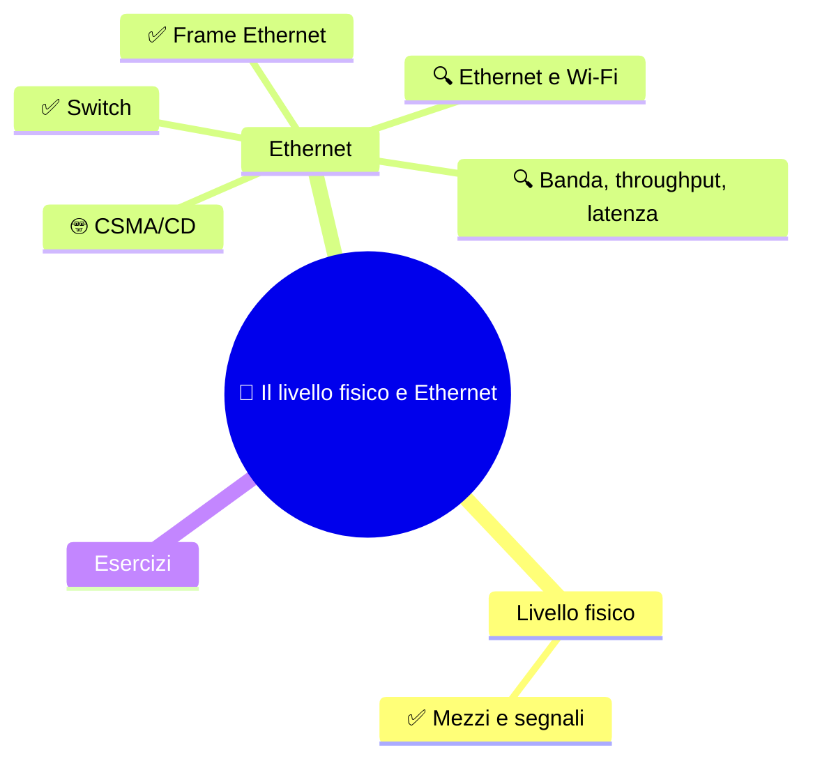
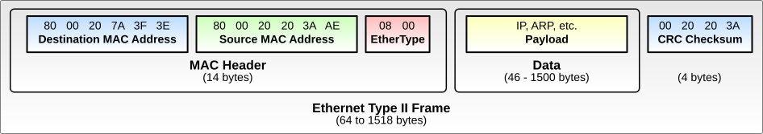

⬅️ [S1 - Modelli e incapsulamento](%28STU%29%204DI%20sett-ott%20S1%20-%20Modelli%20e%20incapsulamento.md) · 🏠 [Indice](%28STU%29%204DI%20-%20SETT-OTT.md) · [S3 - IPv4 e il pacchetto](%28STU%29%204DI%20sett-ott%20S3%20-%20IPv4%20e%20il%20pacchetto.md) ➡️

# 📡 Il livello fisico e Ethernet

**4DI · Settembre-Ottobre · S2 · Teoria**

⏱️ **Tempo di studio: circa 30 minuti.** ✅ essenziale: 18 min. 🔍 per il voto alto: 12 min. 🤓 si può saltare. Nessun compito obbligatorio a casa.

> **Legenda:** ✅ da sapere · 🔍 per capire fino in fondo · 🤓 facoltativo · 📜 storia · 🧪 esempio · ⚠️ errore comune · 🧠 da ricordare · ✏️ da fare · 🃏 flashcard (rispondi a voce, poi apri)

## 🗺️ Mappa

## 📜 Un'isola, una stanza, un cavo

Siamo nel 1968. Alle Hawaii l'università ha un problema da isola: gli utenti sono sparsi su isole diverse. Il professor Norman Abramson e il suo gruppo vogliono collegarli con apparecchi radio a basso costo. Nasce ALOHAnet: terminali collegati con **onde radio**. Ma c'è un guaio: tutti parlano sulla stessa frequenza. Se due trasmettono insieme, i messaggi si sovrappongono e vanno rifatti.

1972-73. Xerox PARC, California. Bob Metcalfe e David Boggs devono collegare i primi computer personali (gli Alto) a una stampante laser. Metcalfe conosce ALOHAnet. Si chiede: e se invece delle onde radio usassimo un **cavo coassiale** condiviso? Stesso problema, stessa soluzione: ascoltare prima di parlare, e se ci si pesta i piedi, aspettare un tempo casuale. L'11 novembre 1973 la rete funziona, a circa 3 Mbit/s.

Il nome lo sceglie Metcalfe. Pensa all'**etere** (*aether*), la sostanza che nell'Ottocento si credeva riempisse l'universo e portasse le onde. L'etere non esisteva. Ma il nome indica l'idea giusta: una rete che può correre su qualsiasi mezzo. Nasce **Ethernet**.

Metcalfe fa una scelta intelligente: invece di tenere la tecnologia per Xerox, convince DEC e Intel a farne uno standard. Nel 1980 esce la prima specifica a 10 Mbit/s, nel 1983 lo standard IEEE 802.3. Mezzo secolo dopo, Ethernet è ancora lo standard più diffuso per le reti locali cablate.

- [ ] #integrazione Cos'é IEEE 802.3?

> 😄 Regola dei tecnici di rete: quando qualcosa non funziona, controlla il **livello 1**. Il cavo è collegato? Sì, succede più spesso di quanto si ammetta.

## 🔌 Dal bit al segnale

### ✅ Il livello fisico trasmette segnali

Un computer lavora con **bit**. Un cavo trasporta **segnali**. Il livello fisico fa da traduttore.

==Il livello fisico trasforma i bit in segnali e i segnali in bit.==

| Mezzo | Che cosa trasporta il segnale | Esempio |
|---|---|---|
| Doppino in rame | variazioni elettriche | cavo Ethernet da PC a switch |
| Fibra ottica | impulsi di luce | collegamenti fra edifici, dorsali |
| Onde radio | onde elettromagnetiche | Wi-Fi |

*Il rame va bene per distanze brevi (nei cavi Ethernet in rame il limite standard è circa 100 metri). La fibra arriva molto più lontano. La radio non ha cavi, ma è più disturbabile.*

Il livello fisico **non sa** che cosa trasporta: una foto, una mail, una pagina. Vede solo segnali. Anche la regola «1 = tensione alta» è troppo semplice: le codifiche reali usano transizioni e sequenze di segnali, per aiutare chi riceve a restare sincronizzato.

⚠️ I livelli 1 e 2 in TCP/IP stanno nello stesso livello, **Accesso alla rete**. Cambiano le mappe, non il viaggio.

🃏 <b>Che cosa fa il livello fisico?</b>

Trasforma i bit in segnali sul mezzo e i segnali in bit.

🃏 <b>Che cosa trasporta il segnale nella fibra ottica?</b>

Impulsi di luce.

🃏 <b>Il livello fisico conosce il significato del messaggio?</b>

No. Trasmette segnali, senza interpretare il contenuto.

✏️ **Abbina (2 min).** Copri la tabella. Per rame, fibra e Wi-Fi scrivi che cosa trasporta il segnale. Poi controlla.

## 🔌 Ethernet e il frame

### ✅ Il frame Ethernet è la busta del tratto locale

Nella S1 abbiamo visto che il livello 2 usa il **frame**. In Ethernet il frame ha questa forma:

*Il frame Ethernet II. Tre campi di intestazione (14 byte), poi i dati (46-1500 byte), poi il controllo finale. Dominio pubblico, da [Wikimedia Commons](https://commons.wikimedia.org/wiki/File:Ethernet_Type_II_Frame_format.svg).*

| Campo | A che cosa serve |
|---|---|
| **MAC di destinazione** | chi deve ricevere il frame sul collegamento locale |
| **MAC sorgente** | chi lo ha inviato |
| **EtherType** | che cosa c'è dentro: IPv4, IPv6, ARP... |
| **Dati** | il contenuto: spesso un pacchetto IP |
| **CRC (FCS)** | un controllo per scoprire alcuni errori |

Un **indirizzo MAC** ha 48 bit ed è legato alla scheda di rete. Di solito si scrive in esadecimale, per esempio `00:1A:2B:3C:4D:5E`.

🧠 ==Il frame trasporta il pacchetto. Non lo sostituisce.== Il frame è la PDU del livello 2; il pacchetto IP è la PDU del livello 3, ed è dentro il campo dati.

⚠️ **MAC e IP non sono due nomi della stessa cosa.**

| | MAC | IP |
|---|---|---|
| Livello | 2 (collegamento) | 3 (rete) |
| Serve per | consegnare **sul tratto locale** | raggiungere **un'altra rete** |
| Quando cambia | a ogni tratto | resta lo stesso da sorgente a destinazione |

*Quest'ultima riga vale in un inoltro normale, senza traduzione di indirizzi (la rivedremo con il NAT).*

🧪 **Un esempio.** Un PC invia un pacchetto a un server in un'altra rete. Il primo frame ha come destinazione il **router vicino**. Il router apre il frame, legge il pacchetto, e lo richiude in un **nuovo frame** per il tratto successivo. Il pacchetto non cambia; il frame sì, a ogni tratto.

🃏 <b>Qual è la PDU del collegamento dati?</b>

Il frame.

🃏 <b>Quali campi formano l'intestazione di un frame Ethernet II?</b>

MAC di destinazione, MAC sorgente ed EtherType.

🃏 <b>Che cosa indica EtherType?</b>

Il tipo di contenuto trasportato, per esempio IPv4, IPv6 o ARP.

🃏 <b>Quanti bit ha un indirizzo MAC?</b>

48 bit.

🃏 <b>Che cosa cambia da un tratto all'altro del viaggio?</b>

Il frame, con i suoi indirizzi MAC. Il pacchetto IP resta quello, se non c'è traduzione di indirizzi.

✏️ **Disegna (3 min).** Disegna il frame come una fila di caselle e scrivi i nomi dei campi. Poi confrontalo con la figura. Quale campo dice «che cosa c'è dentro»?

✏️ **Prevedi (2 min).** Un PC invia un pacchetto a un server lontano. Quale MAC di destinazione mette nel primo frame: quello del server o quello del router? Perché?

### ✅ Lo switch consegna i frame sul tratto locale

Uno **switch** collega i dispositivi di una rete locale. Guarda il **MAC sorgente** dei frame in arrivo e impara su quale porta si trova ogni dispositivo. Poi, per ogni frame, guarda il **MAC di destinazione** e lo manda solo sulla porta giusta. Se non conosce ancora quella porta, lo manda su tutte le altre.

| Porta | MAC imparato |
|---:|---|
| 1 | `AA` |
| 2 | `BB` |
| 3 | `CC` |

*Una tabella di switch, semplificata: l'indirizzo e la porta dove lo ha visto passare.*

Lo switch **non apre il pacchetto IP**. Decide solo con i MAC. Un **router**, invece, collega reti diverse e decide guardando gli indirizzi IP. Nella rete reale le due cose spesso stanno nella stessa scatola: ma sono due decisioni diverse.

> *Dove l'immagine smette di funzionare:* la tabella reale ha tempi di scadenza e può contenere molti MAC per porta. Qui ci basta l'idea.

🃏 <b>Che cosa guarda lo switch per decidere dove inviare un frame?</b>

Il MAC di destinazione, confrontato con la tabella delle porte.

🃏 <b>Come impara lo switch dove si trova un dispositivo?</b>

Osserva il MAC sorgente dei frame e lo associa alla porta da cui arrivano.

🃏 <b>Qual è la differenza fra switch e router?</b>

Lo switch consegna frame nella rete locale usando i MAC; il router collega reti diverse e inoltra pacchetti usando gli IP.

✏️ **Traccia (3 min).** Lo switch ha la tabella qui sopra. Arriva sulla porta 1 un frame da `AA` a `CC`. Su quale porta esce? E se la destinazione fosse `DD`?

### 🔍 Ethernet e Wi-Fi sono standard diversi

**Ethernet** è la famiglia IEEE **802.3**, soprattutto cablata. **Wi-Fi** è la famiglia IEEE **802.11**, via radio. Hanno regole diverse per il tratto locale, ma **un frame Ethernet e uno Wi-Fi possono trasportare lo stesso pacchetto IP**.

Un PC con il cavo e un telefono con il Wi-Fi possono raggiungere lo stesso sito: cambia il tratto locale, non il programma.

⚠️ Una presa o un simbolo Wi-Fi non garantiscono una velocità: contano lo standard, gli apparati, la distanza e il carico.

🃏 <b>Quali standard IEEE descrivono Ethernet e Wi-Fi?</b>

Ethernet è 802.3; Wi-Fi è 802.11.

🃏 <b>Un PC con cavo e un telefono Wi-Fi possono raggiungere lo stesso server?</b>

Sì: cambia il tratto locale, ma usano lo stesso protocollo IP.

### 🔍 Banda, throughput e latenza

Tre parole che spesso si scambiano. Non sono sinonimi.

| Grandezza | Domanda a cui risponde | Immagine |
|---|---|---|
| **Banda** (nominale) | quanti bit al secondo può portare il collegamento | numero di corsie dell'autostrada |
| **Throughput** | quanti ne passano davvero | auto che passano davvero in un'ora |
| **Latenza** | quanto ci mette un dato ad arrivare | lunghezza del tragitto |

*Dove l'immagine smette di funzionare:* sull'autostrada la lunghezza e le corsie sono indipendenti; in una rete reale anche l'attesa nelle code degli apparati fa parte della latenza.

🧪 **Un conto ideale.** Un file da 1 MB (decimale) contiene circa 8 megabit. A 100 Mbit/s servono almeno 0,08 secondi (80 ms). A 1 Gbit/s almeno 8 ms. È un minimo teorico: intestazioni, controlli e attese aggiungono tempo.

🧠 ==Per scaricare un file grande conta il throughput. Per una chiamata o un gioco conta la latenza.==

🃏 <b>Che cos'è la banda nominale?</b>

La capacità dichiarata del collegamento, in bit al secondo.

🃏 <b>Che cosa misura il throughput?</b>

I dati che passano davvero in un intervallo di tempo.

🃏 <b>Che cos'è la latenza?</b>

Il tempo che un dato impiega per arrivare (o per far tornare una risposta).

🃏 <b>Per un gioco online conta di più la banda o la latenza?</b>

La latenza: ogni risposta deve arrivare in fretta.

✏️ **Calcola (3 min).** Quanti megabit sono 5 MB? Quanto ci vuole, al minimo, a 100 Mbit/s? *(Ricorda: 1 byte = 8 bit.)*

✏️ **Spiega in una frase (2 min).** Perché una connessione con banda altissima può comunque dare un gioco lento?

### 🤓 CSMA/CD sui cavi condivisi

> Nei primi Ethernet, tutti i computer condividevano lo stesso cavo. Come in una stanza affollata, si può parlare solo se gli altri tacciono. Il protocollo **CSMA/CD** (*Carrier Sense Multiple Access with Collision Detection*) è questo galateo:
>
> 1. **Ascolta** se il cavo è libero (*Carrier Sense*).
> 2. Se è libero, **trasmetti**.
> 3. Mentre trasmetti, **controlla** se qualcun altro sta trasmettendo (*Collision Detection*). Se sì, c'è una **collisione**.
> 4. In caso di collisione, **fermati, aspetta un tempo casuale** e riprova.
>
> Il tempo è casuale perché, se tutti aspettassero lo stesso tempo, si scontrerebbero di nuovo. È la stessa idea di ALOHAnet, migliorata.
>
> Con gli **switch**, ogni dispositivo ha una porta e un collegamento dedicati, e in **full-duplex** può inviare e ricevere insieme. Le collisioni non ci sono più. CSMA/CD spiega un problema storico, non descrive una rete Ethernet moderna.

🃏 <b>Perché CSMA/CD nasce?</b>

Perché più computer condividevano lo stesso cavo e i loro segnali potevano sovrapporsi (collisione).

🃏 <b>Perché si aspetta un tempo casuale dopo una collisione?</b>

Per non scontrarsi di nuovo con lo stesso dispositivo.

🃏 <b>Una moderna porta switch full-duplex usa CSMA/CD?</b>

No: ha un collegamento dedicato e può trasmettere e ricevere insieme.

## ✏️ Esercizi

1. **Riordina.** Metti in ordine: segnali, pacchetto IP, frame, dati.
2. **Trova l'errore.** «Lo switch legge l'indirizzo IP e decide dove mandare il frame.» Che cosa non torna?
3. **Spiega in una frase.** Perché il MAC cambia a ogni tratto e l'IP no?
4. **Collega (S1).** In quale PDU viaggia un segnale? In quale un indirizzo MAC?

**Uscita:** completa «Il mezzo trasporta ..., mentre il frame organizza ...».

## 📚 Fonti e risorse

- [Wikipedia - Ethernet](https://en.wikipedia.org/wiki/Ethernet): storia e versioni. Da leggere per curiosità la parte sulle origini a Xerox PARC.
- [Wikipedia - ALOHAnet](https://en.wikipedia.org/wiki/ALOHAnet): la rete radio delle Hawaii che ha ispirato Ethernet.
- [Wikipedia - Robert Metcalfe](https://en.wikipedia.org/wiki/Robert_Metcalfe): una persona, tre storie (ritorneranno in S5).
- [Wikimedia Commons - Ethernet Type II Frame format](https://commons.wikimedia.org/wiki/File:Ethernet_Type_II_Frame_format.svg): la figura del frame, dominio pubblico.

---

⬅️ [S1 - Modelli e incapsulamento](%28STU%29%204DI%20sett-ott%20S1%20-%20Modelli%20e%20incapsulamento.md) · 🏠 [Indice](%28STU%29%204DI%20-%20SETT-OTT.md) · [S3 - IPv4 e il pacchetto](%28STU%29%204DI%20sett-ott%20S3%20-%20IPv4%20e%20il%20pacchetto.md) ➡️
