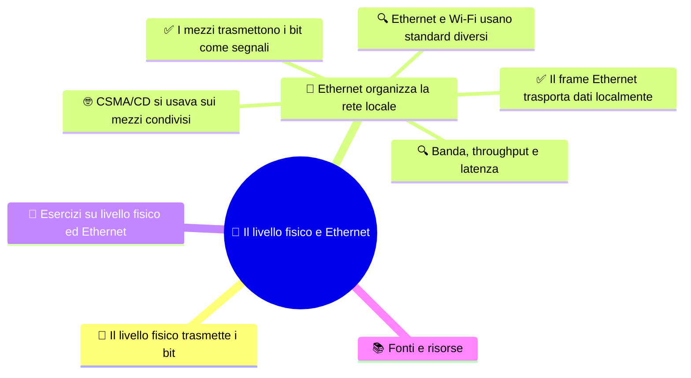

# 📡 Il livello fisico e Ethernet

**4DI · Settembre-Ottobre · S2 · Teoria**

> **Legenda:** ✅ da sapere · 🔍 per capire fino in fondo · 🤓 facoltativo, per curiosi · 🃏 flashcard: rispondi a voce, poi apri per controllare



## 🧭 Il livello fisico trasmette i bit

Un computer rappresenta informazioni con bit, ma una rete deve trasportarli attraverso un mezzo reale. Per farlo, i bit vengono rappresentati con segnali elettrici, luminosi o radio. Il ricevitore osserva il segnale e, seguendo le regole dello standard, ricostruisce i bit.

In questa dispensa usiamo i nomi dei livelli del modello **ISO/OSI**: il livello 1 è il livello fisico e il livello 2 è il collegamento dati. Nel modello didattico **TCP/IP a quattro livelli**, queste funzioni sono in genere raggruppate nell'accesso alla rete. Non esistono due viaggi separati: ISO/OSI e TCP/IP sono mappe differenti per descrivere le responsabilità dello stesso scambio.

Seguiamo un esempio. Un computer invia un documento a un server: i dati arrivano al livello di collegamento dentro un frame; il livello fisico trasmette quel frame come segnali sul mezzo. Il server riceve i segnali, ricostruisce i bit e interpreta le informazioni dei livelli superiori. Il mezzo non sa che sta trasportando un documento: trasporta segnali secondo regole concordate.

## 🔌 Ethernet organizza la rete locale

### ✅ I mezzi trasmettono i bit come segnali

Il **livello fisico** descrive le caratteristiche del mezzo e le regole con cui viaggiano i segnali: connettori, proprietà elettriche o ottiche, frequenze, tempi e velocità di trasmissione. Non assegna un significato umano ai bit. Lo standard e i dispositivi alle due estremità stabiliscono come riconoscere i simboli trasmessi.

| Mezzo | Fenomeno che trasporta il segnale |
|---|---|
| Doppino in rame | Variazioni elettriche |
| Fibra ottica | Impulsi luminosi |
| Wi-Fi | Onde radio |

Il livello fisico non sa se i bit rappresentano una foto o una pagina web. Per esempio, nel doppino di rame il segnale è elettrico, ma non possiamo concludere che ogni `1` corrisponda sempre a «tensione alta» e ogni `0` a «tensione bassa». Le codifiche possono usare transizioni e sequenze di simboli per aiutare il ricevitore a riconoscere i dati e il tempo. Nella fibra si usano impulsi di luce; nel Wi-Fi, onde radio. I dettagli cambiano, ma il compito generale resta rappresentare e trasmettere bit.

<details>
<summary>🃏 Che cosa studia il livello fisico?</summary>
Il mezzo e le regole con cui i segnali rappresentano e trasportano i bit.
</details>
<details>
<summary>🃏 Quale fenomeno trasporta i dati nella fibra ottica?</summary>
Impulsi luminosi.
</details>
<details>
<summary>🃏 Il livello fisico conosce il significato del messaggio?</summary>
No. Trasmette segnali secondo uno standard, senza interpretare il contenuto.
</details>

### ✅ Il frame Ethernet trasporta dati localmente

Il livello 2, il **collegamento dati**, organizza la consegna sul collegamento locale. In Ethernet la sua unità di informazione è il **frame**. Per capire che cosa contiene, distinguiamo l'intestazione, i dati trasportati e il controllo finale.

```text
Preambolo + SFD | MAC destinazione | MAC sorgente | EtherType | dati | FCS
                  \____________ intestazione _____________/         \finale/
```

In un frame Ethernet II, **MAC destinazione**, **MAC sorgente** ed **EtherType** formano l'intestazione. Il campo EtherType indica che cosa viene trasportato. Seguono i dati e, alla fine, l'**FCS** (*Frame Check Sequence*), che aiuta a rilevare alcuni errori. Il preambolo e il delimitatore SFD aiutano il ricevitore a sincronizzarsi e a riconoscere l'inizio: precedono il frame vero e proprio. Non serve memorizzare le dimensioni dei campi; conta saper riconoscere il loro ruolo.

Il contenuto può essere un pacchetto **IPv4**, un pacchetto **IPv6** oppure un messaggio **ARP**, per esempio. Il frame quindi non trasporta soltanto IP. Quando trasporta un pacchetto IP, si tratta comunque di due unità a livelli diversi: il frame è la PDU del livello 2, il pacchetto IP quella del livello 3. Il pacchetto è inserito nei dati del frame, come un contenitore dentro un altro.

Gli indirizzi **MAC** e **IP** non sono sullo stesso livello e non rispondono alla stessa domanda. IP indica la destinazione logica del pacchetto. Il MAC di destinazione consegna il frame sul collegamento locale successivo. Se il server si trova su un'altra rete, il primo frame è diretto al router vicino, mentre il pacchetto IP indica il server remoto. Il router rimuove il frame ricevuto, esamina il pacchetto e crea un nuovo frame per il collegamento successivo. In un inoltro normale senza traduzione di indirizzi, gli IP di sorgente e destinazione restano gli stessi; i MAC locali cambiano da un tratto al successivo.

Uno **switch** Ethernet osserva gli indirizzi MAC sorgente e può usarli per apprendere quali dispositivi si trovano sulle sue porte. Impara da quale porta arrivano i frame con un certo MAC e consulta la propria tabella quando deve inoltrarne uno. Se non conosce la porta di destinazione, può inviare il frame sulle altre porte pertinenti della rete locale.

Lo switch non deve leggere il testo, la foto o il documento trasportato. Un router, invece, collega reti diverse e inoltra pacchetti IP. Nella rete reale i due apparati collaborano, ma svolgono decisioni diverse.

<details>
<summary>🃏 Qual è la PDU del collegamento dati?</summary>
Il frame.
</details>
<details>
<summary>🃏 Quali informazioni compongono l'intestazione Ethernet II?</summary>
MAC di destinazione, MAC sorgente ed EtherType, che indica il tipo di contenuto trasportato.
</details>
<details>
<summary>🃏 Che cosa può trasportare il campo dati di un frame Ethernet?</summary>
Per esempio un pacchetto IPv4, un pacchetto IPv6 o un messaggio ARP.
</details>
<details>
<summary>🃏 Frame Ethernet e pacchetto IP appartengono allo stesso livello?</summary>
No. Il frame è la PDU del livello 2; il pacchetto IP è la PDU del livello 3 e può essere trasportato dentro il frame.
</details>
<details>
<summary>🃏 In un inoltro normale, che cosa cambia fra un collegamento e il successivo?</summary>
Il frame locale e i suoi indirizzi MAC; gli indirizzi IP restano quelli della sorgente e della destinazione, se non interviene una traduzione.
</details>
<details>
<summary>🃏 Che cosa usa uno switch Ethernet per inoltrare i frame?</summary>
Gli indirizzi MAC e le informazioni apprese sulle porte a cui sono collegati i dispositivi.
</details>

### 🔍 Ethernet e Wi-Fi usano standard diversi

**Ethernet** è una famiglia di standard per reti locali, definita soprattutto da IEEE 802.3. Il **Wi-Fi** segue IEEE 802.11 e usa onde radio per collegare i dispositivi. Non sono due nomi per lo stesso mezzo: Ethernet usa collegamenti cablati o, in alcune varianti, altri mezzi definiti dagli standard; Wi-Fi comunica via radio.

Eppure entrambi possono far parte del percorso verso lo stesso sito. Un computer collegato al router con Ethernet e un telefono collegato allo stesso router via Wi-Fi possono usare IP per raggiungere un server. Il mezzo del tratto locale è diverso, ma il programma può continuare a usare lo stesso servizio. Cambiare il modo in cui il dispositivo si collega non obbliga a riscrivere il programma che invia la richiesta.

Un indirizzo **MAC** identifica un'interfaccia per la consegna sul collegamento locale; un indirizzo **IP** indica una destinazione logica che può trovarsi su un'altra rete. Non possiamo sostituire l'uno con l'altro. Una presa o un simbolo Wi-Fi, inoltre, non garantiscono da soli una certa velocità: contano lo standard, gli apparati, la distanza, gli ostacoli e il carico.

<details>
<summary>🃏 Quali standard identificano Ethernet e Wi-Fi?</summary>
Ethernet appartiene alla famiglia IEEE 802.3; Wi-Fi alla famiglia IEEE 802.11.
</details>
<details>
<summary>🃏 Un computer Ethernet e un telefono Wi-Fi possono raggiungere lo stesso server?</summary>
Sì. Possono usare mezzi diversi sul collegamento locale e lo stesso protocollo IP per raggiungere il server.
</details>
<details>
<summary>🃏 Che differenza c'è fra MAC e IP?</summary>
Il MAC serve alla consegna sul collegamento locale; IP indica una destinazione logica fra reti.
</details>

### 🔍 Banda, throughput e latenza

Per descrivere una connessione servono misure diverse. La **banda nominale**, espressa in bit al secondo, indica la capacità dichiarata del collegamento. Il **throughput** è la quantità di dati che passa davvero in un intervallo di tempo. La quantità utile all'applicazione può essere minore ancora: intestazioni, controlli, ritrasmissioni e altri traffici usano una parte della capacità.

La **latenza** è il tempo che un dato impiega per raggiungere una destinazione o perché una risposta torni indietro. Non dice quanti dati passano ogni secondo. Un collegamento può avere una banda elevata ma una latenza notevole; può anche avere una banda più modesta ma rispondere rapidamente.

Facciamo un conto ideale. Un file da 1 MB decimale contiene circa 8 megabit. A 100 Mbit/s, trasferirlo richiederebbe almeno 0,08 secondi, cioè 80 millisecondi; a 1 Gbit/s, almeno 8 millisecondi. È un limite teorico, senza intestazioni né attese: nella rete reale serve più tempo. Inoltre quel conto riguarda il trasferimento di un file, non il tempo di risposta di una singola richiesta.

Per scaricare un file grande interessa soprattutto un throughput alto. Per una chiamata, un gioco interattivo o una conversazione, una latenza bassa può contare di più perché ogni risposta arriva prima. Perciò «qual è la connessione migliore?» non ha risposta senza sapere quale attività si vuole svolgere.

<details>
<summary>🃏 Che cosa indica la banda nominale?</summary>
La capacità dichiarata del collegamento, di solito in bit al secondo.
</details>
<details>
<summary>🃏 Che cosa misura il throughput?</summary>
La quantità di dati effettivamente trasferita in un intervallo di tempo.
</details>
<details>
<summary>🃏 Banda e latenza misurano la stessa cosa?</summary>
No. La banda riguarda la capacità di trasferimento; la latenza è il tempo necessario perché un dato o una risposta arrivi.
</details>
<details>
<summary>🃏 Quale misura è particolarmente importante per un'attività interattiva?</summary>
La latenza, perché influisce sul tempo di attesa fra una richiesta e la risposta.
</details>

### 🤓 CSMA/CD si usava sui mezzi condivisi

> Nei primi segmenti Ethernet, più computer potevano condividere lo stesso cavo. Se due dispositivi trasmettevano contemporaneamente, i segnali si sovrapponevano: si verificava una **collisione** e i dati andavano ritrasmessi.
>
> CSMA/CD significa *Carrier Sense Multiple Access with Collision Detection*. Ogni dispositivo ascoltava il mezzo (**Carrier Sense**), più dispositivi potevano usarlo (**Multiple Access**) e chi trasmetteva controllava se si verificava una collisione (**Collision Detection**). In caso di collisione, interrompeva l'invio, aspettava un intervallo casuale e provava di nuovo. L'attesa casuale riduceva la probabilità che gli stessi dispositivi si scontrassero ancora.
>
> Con gli switch, ogni dispositivo usa normalmente una porta e un collegamento dedicati. In modalità **full-duplex** può trasmettere e ricevere contemporaneamente; non c'è un unico mezzo condiviso su cui rilevare collisioni. CSMA/CD spiega un problema storico reale, ma non descrive il funzionamento ordinario di una moderna rete Ethernet commutata.


<details>
<summary>🃏 In quale contesto si usava CSMA/CD?</summary>
Nei segmenti Ethernet condivisi half-duplex, dove più dispositivi potevano contendere lo stesso mezzo.
</details>
<details>
<summary>🃏 CSMA/CD descrive il funzionamento ordinario di una moderna porta switch full-duplex?</summary>
No. Una porta full-duplex usa un collegamento dedicato e trasmette e riceve contemporaneamente.
</details>

## 🧩 Esercizi su livello fisico ed Ethernet

1. Abbina rame, fibra ottica e Wi-Fi al fenomeno che trasporta il segnale.
2. Spiega la differenza fra un frame Ethernet e un pacchetto IP.
3. Perché MAC e IP rispondono a domande diverse?
4. Perché velocità nominale e latenza non sono sinonimi?

**Uscita:** completa «Il mezzo trasporta ..., mentre il frame organizza ...».

## 📚 Fonti e risorse

- [IEEE 802.3 Ethernet](https://www.ieee802.org/3/): standard Ethernet.
- [IEEE 802.11 Wireless LAN](https://www.ieee802.org/11/): standard per reti locali wireless.

---

[⬅️ S1 - Modelli e incapsulamento](%28STU%29%204DI%20sett-ott%20S1%20-%20Modelli%20e%20incapsulamento.md) · [➡️ S3 - IPv4 e il pacchetto](%28STU%29%204DI%20sett-ott%20S3%20-%20IPv4%20e%20il%20pacchetto.md) · [🗺️ Indice](%28STU%29%204DI%20-%20SETT-OTT.md)