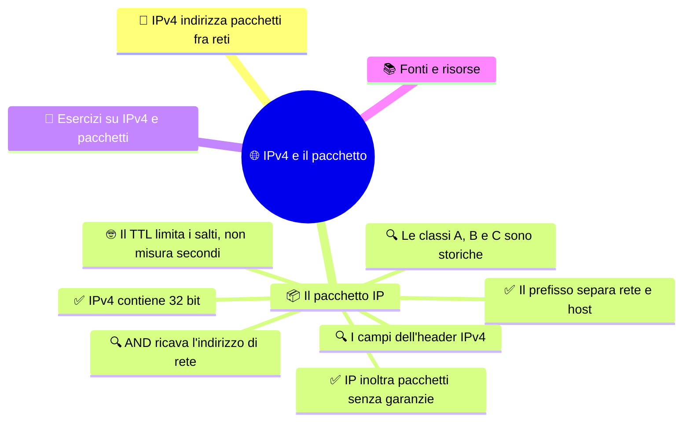

# 🌐 IPv4 e il pacchetto

**4DI · Settembre-Ottobre · S3 · Teoria**

> **Legenda:** ✅ da sapere · 🔍 per capire fino in fondo · 🤓 facoltativo, per curiosi · 🃏 flashcard: rispondi a voce, poi apri per controllare



## 🧭 IPv4 indirizza pacchetti fra reti

Come fa un pacchetto ad attraversare reti diverse senza che ogni dispositivo debba conoscere il messaggio? IP aggiunge indirizzi logici che aiutano i router a inoltrarlo: uno indica la sorgente e uno la destinazione. Il pacchetto può attraversare più reti senza che ogni dispositivo debba interpretare il testo, l'immagine o il file che contiene.

Un indirizzo IPv4 va letto insieme al **prefisso** o alla **maschera**. Questi dicono quali bit identificano la rete e quali distinguono l'interfaccia al suo interno. Senza la maschera possiamo leggere l'indirizzo, ma non sapere dove passa il confine fra rete e host.

## 📦 Il pacchetto IP

### ✅ IP inoltra pacchetti senza garanzie

Il **Protocollo Internet (IP)** fornisce indirizzi logici e trasporta pacchetti fra reti. È *connectionless*: ogni pacchetto viene trattato in modo indipendente. Il servizio è **best effort**: IP cerca di inoltrare il pacchetto, ma da solo non garantisce consegna, ordine, assenza di duplicati o ritrasmissione.

Questa semplicità lascia ai livelli superiori la scelta dei controlli necessari. Non significa che la rete non possa essere affidabile: significa che IP, da solo, non promette queste proprietà.

Immagina che un pacchetto si perda lungo il percorso. IP non è obbligato a ricostruirlo e ritrasmetterlo, né a rimettere in ordine pacchetti arrivati in successione diversa. Se un'applicazione ha bisogno di una comunicazione affidabile, un protocollo superiore può aggiungere numeri di sequenza, conferme e ritrasmissioni: studieremo TCP più avanti. IP si concentra su indirizzamento e inoltro; non gestisce da solo ogni dettaglio della conversazione.

<details>
<summary>🃏 Che cosa significa che IP offre un servizio best effort?</summary>
IP cerca di inoltrare i pacchetti, ma da solo non garantisce consegna, ordine o ritrasmissione.
</details>
<details>
<summary>🃏 Che cosa significa che IP è connectionless?</summary>
Ogni pacchetto è trattato in modo indipendente, senza stabilire da solo una conversazione completa.
</details>

### ✅ IPv4 contiene 32 bit

Un indirizzo **IPv4** contiene 32 bit, divisi in quattro gruppi da otto chiamati **ottetti**. Ogni ottetto può rappresentare un numero da 0 a 255.

```text
192.168.1.25
11000000.10101000.00000001.00011001
   192       168        1         25
```

La notazione decimale puntata rende più semplice leggere i bit, ma l'indirizzo resta una sequenza binaria.

Un ottetto contiene otto bit e può rappresentare $2^8=256$ combinazioni, da 0 a 255. Per esempio, `192` equivale a `128 + 64` e si scrive `11000000` in binario. I punti separano i quattro ottetti per rendere l'indirizzo più leggibile: non sono bit aggiuntivi.

<details>
<summary>🃏 Quanti bit contiene un indirizzo IPv4?</summary>
32 bit, divisi in quattro ottetti da 8 bit.
</details>
<details>
<summary>🃏 Quali valori può rappresentare un ottetto IPv4?</summary>
Da 0 a 255.
</details>
<details>
<summary>🃏 Che cosa rappresentano i punti in un IPv4?</summary>
Separano i quattro ottetti dell'indirizzo.
</details>

### ✅ Il prefisso separa rete e host

<details>
<summary>🃏 Come si scrive 192 in binario su un ottetto?</summary>
11000000, perché 192 è 128 più 64.
</details>
L'indirizzo `192.168.1.25/24` contiene un **prefisso** di 24 bit. I bit restanti, otto, identificano l'host nella rete descritta. Il prefisso `/24` equivale alla maschera `255.255.255.0`.

- **Network ID:** identifica la sottorete.
- **Host ID:** identifica l'interfaccia all'interno di quella sottorete.
- **Maschera o prefisso:** stabilisce il confine fra rete e host.

L'indirizzo da solo non dice dove passa il confine: serve conoscere il prefisso.

<details>
<summary>🃏 Che cosa indica /24 in un indirizzo IPv4?</summary>
Che i primi 24 bit formano il prefisso di rete; restano 8 bit host.
</details>
<details>
<summary>🃏 Qual è la maschera decimale di /24?</summary>
255.255.255.0.
</details>
<details>
<summary>🃏 Basta un indirizzo IPv4 senza maschera per conoscere la rete?</summary>
No. Il confine rete-host dipende dal prefisso o dalla maschera.
</details>

### 🔍 AND ricava l'indirizzo di rete

Per trovare l'indirizzo di rete, applichiamo AND bit a bit fra indirizzo e maschera. L'operazione AND restituisce 1 solo quando entrambi i bit sono 1. Con `/24`, i primi tre ottetti restano uguali e i bit host diventano zero:

```text
IP       192.168.1.25   11000000.10101000.00000001.00011001
Maschera 255.255.255.0  11111111.11111111.11111111.00000000
Rete     192.168.1.0    11000000.10101000.00000001.00000000
```

Le maschere IPv4 valide hanno i bit a 1 contigui a sinistra, seguiti da zeri.

Con `/24`, la maschera ha 24 bit a 1 e 8 bit a 0: `11111111.11111111.11111111.00000000`. Quando applichiamo AND, i primi 24 bit dell'indirizzo restano; gli ultimi 8 diventano zero. Perciò da `192.168.4.70/24` ricaviamo la rete `192.168.4.0/24`. L'indirizzo completo identifica un'interfaccia; il risultato dell'AND identifica la rete.

<details>
<summary>🃏 Quale operazione bit a bit ricava la rete da indirizzo e maschera?</summary>
AND.
</details>
<details>
<summary>🃏 Quando AND restituisce 1?</summary>
Quando entrambi i bit confrontati sono 1.
</details>
<details>
<summary>🃏 Che cosa succede ai bit host applicando AND con la maschera?</summary>
Diventano zero nell'indirizzo di rete.
</details>

### 🔍 I campi dell'header IPv4

<details>
<summary>🃏 Qual è la rete di 192.168.4.70/24?</summary>
192.168.4.0/24.
</details>
Un pacchetto IPv4 contiene un **header** e i dati del livello superiore. Alcuni campi importanti sono:

| Campo | Che cosa indica |
|---|---|
| Version | Il formato IP; vale 4 per IPv4 |
| Indirizzo sorgente | Da quale indirizzo parte il pacchetto |
| Indirizzo destinazione | Qual è la destinazione logica |
| TTL | Limita gli inoltri fra router |
| Protocol | Quale protocollo superiore riceve i dati, per esempio TCP o UDP |
| Total Length | La lunghezza complessiva del pacchetto |
| Header Checksum | Un controllo dell'header IPv4 |

Il **TTL** limita gli inoltri, così un pacchetto non può restare per sempre in un ciclo. Il checksum IPv4 controlla l'header, non garantisce che il contenuto applicativo sia integro.

Possiamo leggere i campi come una scheda di viaggio: **sorgente** e **destinazione** indicano gli estremi logici; **Protocol** dice quale protocollo riceverà i dati dentro il pacchetto; **Total Length** ne indica la dimensione complessiva. A ogni inoltro il router diminuisce il TTL. Poiché il TTL fa parte dell'header, il router aggiorna anche il checksum, che controlla solo l'intestazione IPv4.

```text
Pacchetto IPv4 = [ intestazione: IP sorgente, IP destinazione, TTL, Protocol, ... ] [ dati ]
```

<details>
<summary>🃏 Che cosa indica il campo Version nell'header IPv4?</summary>
Il formato IP usato; in un pacchetto IPv4 vale 4.
</details>
<details>
<summary>🃏 Che cosa limita il TTL?</summary>
Il numero di inoltri del pacchetto fra router, per impedire cicli infiniti.
</details>
<details>
<summary>🃏 Che cosa identifica il campo Protocol?</summary>
Il protocollo di livello superiore che deve ricevere i dati, per esempio TCP o UDP.
</details>
<details>
<summary>🃏 Il checksum IPv4 controlla tutto il messaggio applicativo?</summary>
No. Controlla l'header IPv4.
</details>

### 🔍 Le classi A, B e C sono storiche

<details>
<summary>🃏 Che cosa indica Total Length?</summary>
La lunghezza complessiva del pacchetto IPv4.
</details>
In passato gli indirizzi IPv4 venivano raggruppati in classi con prefissi predefiniti. La tabella mostra i valori tipici di A, B e C; oggi per ricavare il confine si legge il prefisso effettivo.

| Classe storica | Prefisso predefinito | Bit assegnati alla rete |
|---|---:|---:|
| A | `/8` | 8 |
| B | `/16` | 16 |
| C | `/24` | 24 |

Questa divisione assegnava dimensioni fisse e poco flessibili. Con CIDR il prefisso viene scritto esplicitamente, per esempio `/27`, e può avere lunghezze diverse dai valori predefiniti delle classi. Per ora basta distinguere le classi come contesto storico dal prefisso, che è l'informazione da usare per ricavare la rete.

<details>
<summary>🃏 Quali prefissi erano associati storicamente alle classi A, B e C?</summary>
A /8, B /16 e C /24.
</details>
<details>
<summary>🃏 Le classi A, B e C determinano oggi ogni confine di rete?</summary>
No. Oggi si usa il prefisso esplicito, come nella notazione CIDR.
</details>

### 🤓 Il TTL limita i salti, non misura secondi

> *Time To Live* sembra indicare un tempo in secondi. In IPv4 il router diminuisce il valore a ogni inoltro; se arriva a zero, il pacchetto viene scartato, così non può restare per sempre in un ciclo. Il nome è storico e non va interpretato come un cronometro.
>
> Il messaggio di diagnostica che può seguire quando il limite finisce si studia più avanti.

<details>
<summary>🃏 Il TTL IPv4 misura normalmente il tempo reale in secondi?</summary>
No. Viene usato per limitare i salti di inoltro del pacchetto.
</details>

## 🧩 Esercizi su IPv4 e pacchetti

1. Scrivi in binario gli ottetti di `192.168.1.25` usando la tabella vista in classe.
2. Quale maschera corrisponde a `/24`? Quanti bit host restano?
3. Spiega perché il checksum dell'header non garantisce che un testo applicativo sia integro.
4. Perché le classi A, B e C non sostituiscono il prefisso CIDR?

**Uscita:** completa «IPv4 identifica ..., ma per ricavare la rete mi serve anche ...».

## 📚 Fonti e risorse

- [RFC 791 - Internet Protocol](https://www.rfc-editor.org/rfc/rfc791): specifica IPv4 e campi dell'header.
- [IANA IPv4 Special-Purpose Address Registry](https://www.iana.org/assignments/iana-ipv4-special-registry/iana-ipv4-special-registry.xhtml): usi speciali degli intervalli.

---

[⬅️ S2 - Il livello fisico e Ethernet](%28STU%29%204DI%20sett-ott%20S2%20-%20Il%20livello%20fisico%20e%20Ethernet.md) · [➡️ S4 - Reti private e FLSM](%28STU%29%204DI%20sett-ott%20S4%20-%20Reti%20private%20e%20FLSM.md) · [🗺️ Indice](%28STU%29%204DI%20-%20SETT-OTT.md)