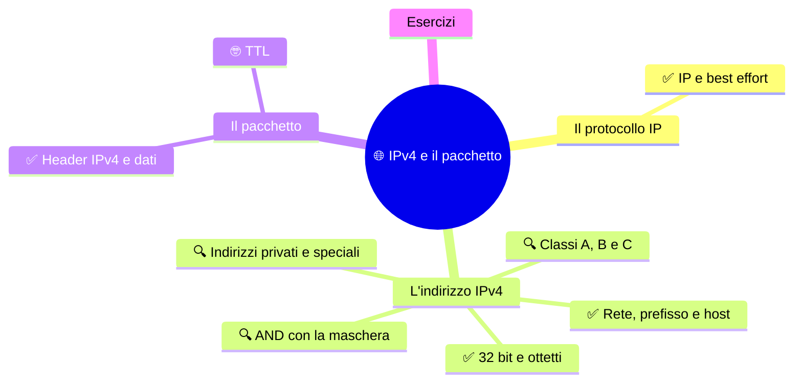
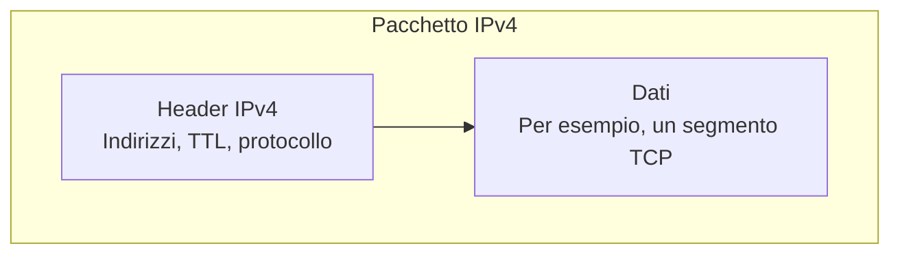

⬅️ [S2 - Il livello fisico e Ethernet](%28STU%29%204DI%20sett-ott%20S2%20-%20Il%20livello%20fisico%20e%20Ethernet.md) · 🏠 [Indice](%28STU%29%204DI%20-%20SETT-OTT.md) · [S4 - Reti private e FLSM](%28STU%29%204DI%20sett-ott%20S4%20-%20Reti%20private%20e%20FLSM.md) ➡️

# 🌐 IPv4 e il pacchetto

**4DI · Settembre-Ottobre · S3 · Teoria**

⏱️ **Tempo di studio: circa 40 minuti.** ✅ essenziale: 23 min. 🔍 per il voto alto: 17 min. 🤓 si può saltare. Nessun compito obbligatorio a casa.

> **Legenda:** ✅ da sapere · 🔍 per capire fino in fondo · 🤓 facoltativo · 📜 storia · 🧪 esempio · ⚠️ errore comune · 🧠 da ricordare · ✏️ da fare · 🃏 flashcard (rispondi a voce, poi apri)

## 🗺️ Mappa


## 📜 Un indirizzo per ogni cosa, anche per un piccione
Nel 1981 i progettisti di Internet scrivono la specifica del protocollo IP: è l'**RFC 791**. Nella specifica fissano la lunghezza degli indirizzi: **32 bit**, cioè circa quattro miliardi e trecento milioni di combinazioni. Nel 1981 è un'enormità. Quasi nessuno ha un computer, e di certo nessuno immagina un telefono in ogni tasca. Le reti sono ancora un esperimento.

Trent'anni dopo, nel 2011, la scorta mondiale di indirizzi liberi è finita. Ne parleremo in S4.

C'è un'altra regola, quella più importante: **IP non promette niente**. Prende il pacchetto, prova a consegnarlo, e se si perde, pazienza. Si chiama *best effort*, «faccio del mio meglio». Un po' come la posta ordinaria: la lettera parte, e speriamo.

Il 1° aprile 1990 David Waitzman prende questa idea alla lettera e pubblica l'**RFC 1149**, uno scherzo ufficiale: *IP su piccioni viaggiatori*. I pacchetti si scrivono su un rotolo di carta e si legano alla zampa di un piccione. Sembra una barzelletta. Il 28 aprile 2001, però, un gruppo di appassionati di Linux a Bergen, in Norvegia, ci prova davvero. Nove piccioni, nove pacchetti, circa 5 chilometri. Ogni pacchetto contiene un *ping*. Tornano **quattro risposte**.

Nove inviati, quattro tornati: è il *best effort* in versione piumata. Una rete non deve essere perfetta per funzionare: deve solo sapere che cosa promette e che cosa no.

![[Scuola/Public/4DI - Sistemi e Reti/1 SETT-OTT/Allegati/image.webp|361x290]]*La fauna mondiale di piccioni ringrazia per l'esistenza del TCP*

## 📦 Il protocollo IP
### ✅ IP inoltra pacchetti senza garanzie

**IP** (*Internet Protocol*) dà a ogni interfaccia un indirizzo e porta **pacchetti** da una rete all'altra.

<u>IP è best effort: prova a consegnare, ma non garantisce niente.</u>

Che cosa non garantisce:

- la **consegna** (un pacchetto può perdersi);
- l'**ordine** (possono arrivare mescolati);
- l'assenza di **duplicati**.

IP è anche **connectionless**: ogni pacchetto viaggia per conto suo, senza una «conversazione» già aperta.

*Perché così? La semplicità di IP lo rende adatto a ogni rete. I controlli si aggiungono nei livelli sopra, quando servono (il trasporto, nelle prossime settimane).*

⚠️ «Best effort» non vuol dire «inaffidabile». Vuol dire che **IP da solo** non promette. L'affidabilità si può costruire sopra.

L'affidabilità (controllo sequenza, richieste di ri-trasmissione, etc.) è garantita dai livelli sopra, come Transport (TCP)

<details>
<summary>🃏 <b>Che cosa significa best effort?</b></summary>
IP prova a consegnare i pacchetti, ma non garantisce consegna, ordine o assenza di duplicati.
</details>
<details>
<summary>🃏 <b>Che cosa significa connectionless?</b></summary>
Ogni pacchetto è trattato in modo indipendente, senza una conversazione già stabilita.
</details>
<details>
<summary>🃏 <b>Qual è la PDU di IP?</b></summary>
Il pacchetto.
</details>
<details>
<summary>🃏 <b>Un pacchetto IP viaggia dentro quale PDU del livello 2?</b></summary>
Dentro il campo dati di un frame (in S2 abbiamo visto il frame Ethernet).
</details>

✏️ **Prevedi (1 min).** Un pacchetto si perde per strada. Chi se ne accorge: IP o un livello superiore? Scrivi la tua idea, poi controlla.

## 🔢 L'indirizzo IPv4
### ✅ Un indirizzo IPv4 ha 32 bit

Un indirizzo IPv4 è una sequenza di **32 bit**, divisa in quattro **ottetti** da 8 bit. Per leggerla comodamente, ogni ottetto si scrive in decimale (da 0 a 255) e si separa con un punto: è la **notazione decimale puntata**.

```text
192      .168      .1        .25
11000000 .10101000 .00000001 .00011001
```

*Gli stessi 32 bit, scritti in due modi. I punti non sono bit: servono solo a leggere.*

Un ottetto ha 8 bit, quindi $2^8 = 256$ valori, da 0 a 255. Ogni bit pesa il doppio del successivo:

| Bit | 1° | 2° | 3° | 4° | 5° | 6° | 7° | 8° |
|---|---:|---:|---:|---:|---:|---:|---:|---:|
| Peso | 128 | 64 | 32 | 16 | 8 | 4 | 2 | 1 |

🧪 `25 = 16 + 8 + 1`, quindi `00011001`. E `192 = 128 + 64`, quindi `11000000`.

Con 32 bit ci sono $2^{32} = 4\,294\,967\,296$ indirizzi.

⚠️ Un indirizzo IP identifica una **interfaccia**, non un computer. Un portatile con Wi-Fi e cavo ha (almeno) due indirizzi.

> 😄 *«Esistono 10 tipi di persone: quelle che capiscono il binario e quelle che no.»* (`10` in binario fa 2: non è dieci).

<details>
<summary>🃏 <b>Quanti bit ha un indirizzo IPv4?</b></summary>
32 bit, in quattro ottetti da 8.
</details>
<details>
<summary>🃏 <b>Quali valori può avere un ottetto?</b></summary>
Da 0 a 255.
</details>
<details>
<summary>🃏 <b>Che cosa identifica un indirizzo IP?</b></summary>
Un'interfaccia di rete, non un computer intero.
</details>
<details>
<summary>🃏 <b>Come si scrive 192 in binario su un ottetto?</b></summary>
11000000, perché 192 = 128 + 64.
</details>

✏️ **Converti (3 min).** Scrivi in binario i quattro ottetti di `192.168.1.25`, usando la tabella dei pesi. Poi riconverti `00011001` e controlla di ottenere 25.

### ✅ Il prefisso separa rete e host
Una **rete IP**, o **sottorete**, è un gruppo di interfacce che condivide lo stesso prefisso. In una rete locale, lo **switch** inoltra i frame fra i dispositivi collegati; il **router** porta i pacchetti da una rete IP a un'altra. Qui «rete» indica un singolo gruppo locale, non Internet intera.

Un indirizzo ha due parti: la **rete** (**NetID**) e l'**host** (**HostID**). In parole semplici, un host è un dispositivo collegato alla rete; più precisamente, l'indirizzo IPv4 identifica una sua **interfaccia di rete**. L'HostID individua quell'interfaccia dentro la rete. Ma dove finisce una parte e inizia l'altra? Lo dice il **prefisso**.

<u>Un indirizzo da solo non dice dove passa il confine. Serve il prefisso.</u>

Nell'indirizzo `192.168.1.25/24`:

```text
11000000.10101000.00000001 | 00011001
         24 bit di rete    |  8 bit di host
```

*Il confine è dopo il 24° bit. A sinistra la rete, a destra l'host.*

- **NetID:** identifica la rete.
- **HostID:** identifica l'interfaccia dentro quella rete.
- **Prefisso** `/24`: i primi 24 bit sono di rete.
- **Maschera** `255.255.255.0`: lo stesso confine, scritto come un indirizzo (24 bit a 1, 8 bit a 0).

🧪 **Esempio di rete scolastica (inventato).** Supponiamo che il laboratorio usi `192.168.40.0/24`: il PC `192.168.40.23` e l'interfaccia del router `192.168.40.1` appartengono alla stessa rete. Lo switch li collega nella rete locale; il router inoltra il traffico verso altre reti. Questi indirizzi sono solo un esempio, non quelli reali della scuola.

*Un indirizzo è come «Via Roma 25»: «Via Roma» è la rete, «25» è l'interfaccia. Dove smette di funzionare: in un indirizzo IP il punto di taglio non è fisso, lo decide il prefisso.*

196.56.1.60 / 16
196.56.0.0

153.6.7.14/8
153.0.0.0

/10
11111111.11000000.00000000.00000000
255.192.0.0

<details>
<summary>🃏 <b>Che cosa indica /24?</b></summary>
Che i primi 24 bit sono di rete; restano 8 bit di host.
</details>
<details>
<summary>🃏 <b>Qual è la maschera di /24?</b></summary>
255.255.255.0.
</details>
<details>
<summary>🃏 <b>Basta l'indirizzo per sapere qual è la rete?</b></summary>
No: serve anche il prefisso (o la maschera).
</details>
<details>
<summary>🃏 <b>Che differenza c'è fra NetID e HostID?</b></summary>
Il NetID identifica la rete; l'HostID identifica l'interfaccia dentro la rete.
</details>
<details>
<summary>🃏 <b>In 192.168.40.23/24, qual è la parte host?</b></summary>
È `.23`, che identifica l'interfaccia dentro la rete `192.168.40.0/24`.
</details>

✏️ **Colora (2 min).** Scrivi in binario `192.168.1.25` e traccia una linea dopo il 24° bit. Quanti bit restano a destra?


### 🔍 L'AND con la maschera trova la rete

Per trovare la rete, si fa l'**AND** bit a bit fra indirizzo e maschera. L'AND dà 1 solo se **entrambi** i bit sono 1.

La **maschera** e l'**indirizzo di rete** non sono la stessa cosa: la maschera indica il confine; l'indirizzo di rete è il risultato dell'AND.

```text
IP        192.168.1.25   11000000.10101000.00000001.00011001
Maschera  255.255.255.0  11111111.11111111.11111111.00000000
Rete      192.168.1.0    11000000.10101000.00000001.00000000
```

*I bit di rete restano; i bit di host diventano zero.*

🧪 **Un secondo esempio.** `192.168.4.70/24`: la maschera ha 24 bit a 1, quindi i primi tre ottetti restano uguali e l'ultimo diventa 0. La rete è `192.168.4.0/24`.

⚠️ Le maschere valide hanno i bit a 1 **tutti a sinistra**, poi solo zeri. `255.0.255.0` non è una maschera.

<details>
<summary>🃏 <b>Quale operazione ricava la rete da indirizzo e maschera?</b></summary>
L'AND bit a bit.
</details>
<details>
<summary>🃏 <b>Quando l'AND dà 1?</b></summary>
Quando entrambi i bit sono 1.
</details>
<details>
<summary>🃏 <b>Che cosa succede ai bit host con l'AND?</b></summary>
Diventano zero.
</details>
<details>
<summary>🃏 <b>Qual è la rete di 192.168.4.70/24?</b></summary>
192.168.4.0/24.
</details>
<details>
<summary>🃏 <b>Maschera e indirizzo di rete sono la stessa cosa?</b></summary>
No: `255.255.255.0` è la maschera di `/24`; per `192.168.1.25/24`, `192.168.1.0/24` è l'indirizzo di rete.
</details>

✏️ **Prevedi, poi calcola (3 min).** Prima scrivi a mente la rete di `10.7.3.200/24`. Poi fai l'AND in binario sull'ultimo ottetto per controllare.

### 🔍 Indirizzi privati e indirizzi speciali
Alcuni indirizzi hanno un **uso riservato**; altri sono semplicemente comuni. <u>`192.168.1.1` è un indirizzo privato spesso scelto per il router, non un indirizzo speciale riservato proprio ai router.</u>

Gli indirizzi IPv4 privati si usano nelle reti locali e non vengono instradati direttamente su Internet. I tre intervalli sono:

| Intervallo privato | Esempio |
|---|---|
| `10.0.0.0/8` | `10.2.3.4` |
| `172.16.0.0/12` | `172.20.0.1` |
| `192.168.0.0/16` | `192.168.1.1` |
Se Dayron pinga 192.168.0.5 magari risponde Cruz
Se Leonardo pinga 192.168.0.5 magari risponde Samuele

⚠️ **Attenzione a `172.0.0.1`.** Non è privato: l'intervallo privato della famiglia `172` comincia da `172.16.0.0` e arriva a `172.31.255.255`. Un indirizzo che comincia per `172` non basta, quindi, per dire che è privato.

Altri indirizzi hanno funzioni particolari:

- **`127.0.0.1`** (*localhost*): indica il dispositivo stesso; serve per provare la rete locale del computer senza passare da un altro dispositivo.
- **`192.168.1.0/24`**: con il prefisso `/24`, `.0` è l'indirizzo della rete e `192.168.1.255` è il broadcast, usato per inviare un messaggio a tutti gli host di quella rete.
- **`255.255.255.255`**: broadcast limitato alla rete locale.

Gli indirizzi di rete e broadcast dipendono dal prefisso: `.0` e `.255` **non** hanno sempre quei ruoli. Per esempio, con `/26` la rete `192.168.1.0/26` ha broadcast `192.168.1.63`.

<details>
<summary>🃏 <b>192.168.1.1 è un indirizzo riservato al router?</b></summary>
No: è un indirizzo privato; spesso lo si configura sul router, ma potrebbe essere assegnato anche a un altro dispositivo.
</details>
<details>
<summary>🃏 <b>172.0.0.1 è un indirizzo privato?</b></summary>
No: l'intervallo privato è `172.16.0.0`–`172.31.255.255`.
</details>
<details>
<summary>🃏 <b>A che cosa serve 127.0.0.1?</b></summary>
Indica il computer stesso e permette di provarne la rete locale.
</details>

- Rarissima prova dell'esistenza di Bitch

✏️ **Trova l'eccezione (2 min).** Quale di questi indirizzi è privato: `172.0.0.1` o `172.20.0.1`? Spiega il criterio usando l'intervallo.

- [x] Siamo arrivati qua 8 Ottobre 2026

### 🔍 Le classi A, B e C sono storia

Prima del 1993 il prefisso non si scriveva: **lo decideva il primo ottetto**. Ogni indirizzo apparteneva a una *classe*.

| Classe | Primo ottetto | Prefisso | Indirizzi per rete |
|---|---|---:|---:|
| A | 0 - 127 | `/8` | oltre 16 milioni |
| B | 128 - 191 | `/16` | 65 536 |
| C | 192 - 223 | `/24` | 256 |

*Tre taglie: grande, media, piccola. Non esistevano le taglie intermedie.*

🧪 **Tre esempi nel vecchio sistema:** `10.20.30.40` era di classe A (`/8`); `172.16.4.5` di classe B (`/16`); `192.168.1.25` di classe C (`/24`). Era il primo ottetto a determinare la classe e quindi il prefisso.

Il difetto è chiaro: un'organizzazione con 300 computer non entra in una C (256) e riceve una B (65 536). Quasi tutto lo spazio resta inutilizzato. Con **CIDR** (S5) il prefisso si scrive esplicitamente e può avere qualsiasi lunghezza.

🧠 <u>Oggi il confine si legge dal prefisso, non dalla classe.</u>

Oggi le classi **non si usano per assegnare i prefissi o instradare le reti**: si scrive il prefisso, per esempio `/24` o `/27`. Le classi restano nella storia e nei vecchi materiali; a volte si dice ancora «classe C» per abitudine, ma non è il prefisso che decide la rete.

⚠️ `192.168.1.25/24` è una C... ma `192.168.1.25/27` no: dipende dal prefisso.

<details>
<summary>🃏 <b>Quali prefissi avevano le classi A, B e C?</b></summary>
A /8, B /16 e C /24.
</details>
<details>
<summary>🃏 <b>Perché le classi sprecavano indirizzi?</b></summary>
Perché esistevano solo tre taglie: un'organizzazione con 300 host riceveva una classe B da 65 536 indirizzi.
</details>
<details>
<summary>🃏 <b>Le classi decidono oggi il confine di rete?</b></summary>
No: oggi si usa il prefisso esplicito, per esempio `/24`.
</details>

## 📨 Il pacchetto

### ✅ Header e dati sono le due parti del pacchetto IPv4

Un pacchetto IPv4 ha due parti: l'**intestazione** (*header*), con le informazioni per consegnare il pacchetto, e i **dati** del livello superiore, per esempio un segmento TCP. <u>È essenziale saper distinguere header e dati; non serve memorizzare tutti i campi dell'header.</u>



*Schema semplificato: prima l'header IPv4, poi i dati del livello superiore.*

Non serve imparare tutti i campi. Questi sono i principali:

| Campo | Che cosa dice |
|---|---|
| **Version** | il formato IP: vale 4 |
| **Total Length** | la lunghezza di tutto il pacchetto |
| **TTL** | limite di inoltri fra router |
| **Protocol** | a quale protocollo superiore consegnare i dati (TCP, UDP...) |
| **Header Checksum** | un controllo dell'**header** |
| **Source / Destination Address** | indirizzo di partenza e di arrivo |

Il **Protocol** collega due livelli, come l'EtherType in S2: dice che cosa c'è nella busta successiva.

⚠️ Il checksum controlla l'**header**, non il contenuto. Che cosa c'è dentro i dati lo verificano i livelli superiori.

<details>
<summary>🃏 <b>Che cosa indica il campo Protocol?</b></summary>
Il protocollo superiore che deve ricevere i dati, per esempio TCP o UDP.
</details>
<details>
<summary>🃏 <b>Quali sono le due parti di un pacchetto IPv4?</b></summary>
Header, con le informazioni per la consegna, e dati, per esempio un segmento TCP.
</details>
<details>
<summary>🃏 <b>Che cosa controlla l'Header Checksum?</b></summary>
Solo l'header IPv4, non il contenuto trasportato.
</details>
<details>
<summary>🃏 <b>Quali indirizzi contiene l'header?</b></summary>
Quello di sorgente e quello di destinazione.
</details>
<details>
<summary>🃏 <b>Quale campo dell'Ethernet ricorda il campo Protocol di IP?</b></summary>
L'EtherType: entrambi dicono che cosa c'è nella busta successiva.
</details>

✏️ **Collega (3 min).** Disegna il viaggio di S1: dati, segmento, pacchetto, frame. In quale busta sta il campo `Destination Address` di IP? In quale il MAC di destinazione?

### 🤓 TTL: un limite di salti, non di secondi

> 	*Time To Live* sembra un tempo. Non lo è: a ogni router il valore scende di uno, e quando arriva a zero il pacchetto viene scartato. Così un pacchetto che gira in tondo non vive per sempre. Il nome è storico.
>
> Che cosa succede dopo lo scarto lo vedremo più avanti.

<details>
<summary>🃏 <b>Il TTL misura i secondi?</b></summary>
No: limita il numero di inoltri. A ogni router diminuisce di uno.
</details>

## ✏️ Esercizi

1. **Converti.** Scrivi in binario `192.168.1.25` e dimostra che i punti non sono bit.
2. **Trova l'errore.** «192.168.300.1 è un indirizzo IPv4 valido.» Perché no?
3. **Spiega in una frase.** Perché l'indirizzo da solo non dice dove finisce la rete?
4. **Collega (S1 e S2).** Un pacchetto IP viaggia dentro un frame Ethernet. Quale campo del frame dice che dentro c'è IPv4?

**Uscita:** completa «IPv4 identifica ..., ma per trovare la rete mi serve anche ...».

## 📚 Fonti e risorse
- [RFC 791 - Internet Protocol](https://www.rfc-editor.org/rfc/rfc791): la specifica del 1981. Per consultazione.
- [RFC 1149 - IP su piccioni viaggiatori](https://www.rfc-editor.org/rfc/rfc1149): lo scherzo del 1° aprile 1990, in inglese. Si legge in due minuti.
- [Wikipedia - IP over Avian Carriers](https://en.wikipedia.org/wiki/IP_over_Avian_Carriers): la prova di Bergen del 2001.
- [Wikipedia - Classful network](https://en.wikipedia.org/wiki/Classful_network): le classi, come storia.

---

⬅️ [S2 - Il livello fisico e Ethernet](%28STU%29%204DI%20sett-ott%20S2%20-%20Il%20livello%20fisico%20e%20Ethernet.md) · 🏠 [Indice](%28STU%29%204DI%20-%20SETT-OTT.md) · [S4 - Reti private e FLSM](%28STU%29%204DI%20sett-ott%20S4%20-%20Reti%20private%20e%20FLSM.md) ➡️
