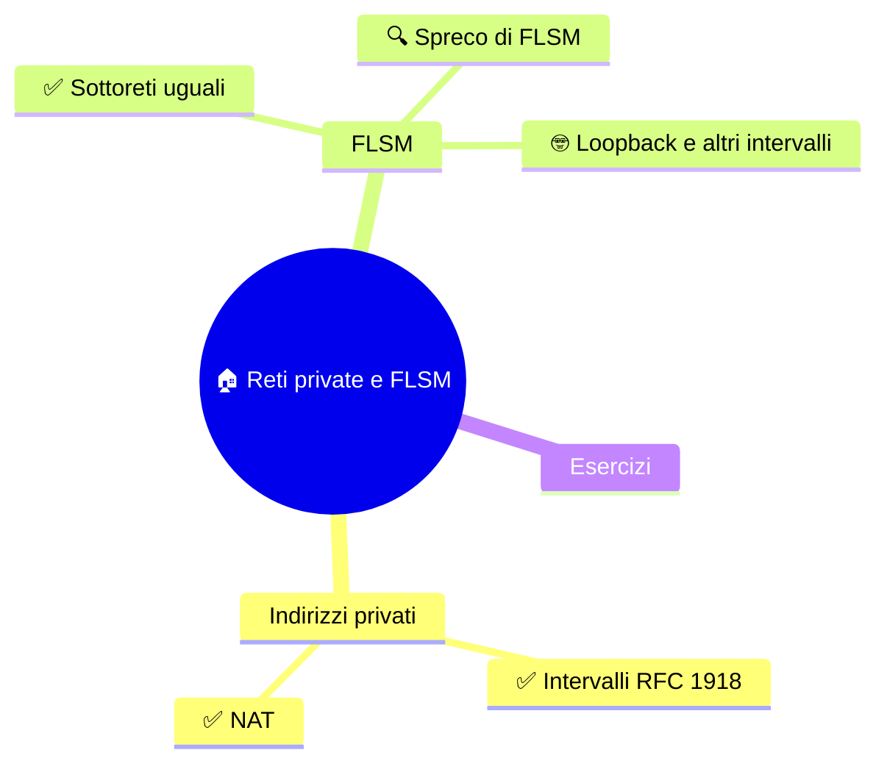

⬅️ [S3 - IPv4 e il pacchetto](%28STU%29%204DI%20sett-ott%20S3%20-%20IPv4%20e%20il%20pacchetto.md) · 🏠 [Indice](%28STU%29%204DI%20-%20SETT-OTT.md) · [S5 - CIDR e intervalli](%28STU%29%204DI%20sett-ott%20S5%20-%20CIDR%20e%20intervalli.md) ➡️

# 🏠 Reti private e FLSM

**4DI · Settembre-Ottobre · S4 · Teoria**

⏱️ **Tempo di studio: circa 35 minuti.** ✅ essenziale: 22 min. 🔍 per il voto alto: 13 min. 🤓 si può saltare. Nessun compito obbligatorio a casa.

> **Legenda:** ✅ da sapere · 🔍 per capire fino in fondo · 🤓 facoltativo · 📜 storia · 🧪 esempio · ⚠️ errore comune · 🧠 da ricordare · ✏️ da fare · 🃏 flashcard (rispondi a voce, poi apri)

## 🗺️ Mappa



## 📜 Quando i numeri sono finiti

3 febbraio 2011. In una sala per conferenze stampa, i responsabili dell'ente che distribuisce gli indirizzi IP nel mondo, lo **IANA**, annunciano un fatto storico. Distribuiscono gli **ultimi** grandi blocchi liberi: cinque, uno a ciascuna delle cinque organizzazioni regionali. Da quel giorno, lo IANA non ha più indirizzi IPv4 da dare.

Non è una sorpresa. Gli ingegneri lo avevano capito già nel 1992: con 32 bit e tutto lo spreco delle classi di S3, gli indirizzi non sarebbero bastati. Servivano **trucchi**. Ne arrivano due.

Il primo è **CIDR** (1993), che vedremo in S5: smettere di sprecare. Il secondo è il **NAT**: riutilizzare. Se non ci sono abbastanza numeri per tutti, ogni casa e ogni azienda usa **numeri privati**, gli stessi che usa il vicino, e passa dal mondo esterno con un solo indirizzo pubblico. Nel 1994 un documento ufficiale (RFC 1631) lo descrive con grande onestà: è una **«soluzione a breve termine»**. Nel 1996 viene definito lo spazio privato (RFC 1918).

Doveva durare pochi anni, in attesa di una soluzione definitiva. Oggi è dentro quasi ogni router di casa. Il provvisorio, in informatica, ha una strana abitudine: **resta**.

Anche in Europa arriva il momento. Il **RIPE NCC**, l'organizzazione che assegna gli indirizzi per l'Europa, esaurisce le sue scorte il 14 settembre 2012. È stata la seconda al mondo.

## 🏠 Indirizzi privati

### ✅ Gli indirizzi privati si riutilizzano

Lo standard **RFC 1918** riserva tre intervalli IPv4 all'uso **privato**:

| Intervallo | Prefisso | Esempio |
|---|---:|---|
| `10.0.0.0` - `10.255.255.255` | `/8` | `10.2.4.8` |
| `172.16.0.0` - `172.31.255.255` | `/12` | `172.20.5.10` |
| `192.168.0.0` - `192.168.255.255` | `/16` | `192.168.1.20` |

<u>Un indirizzo privato vale solo dentro la propria rete. I router di Internet non lo instradano.</u>

Per questo chiunque può usarli. La tua rete di casa e quella del vicino possono entrambe avere un PC con `192.168.1.20`. Non si confondono, finché le due reti non si collegano.

⚠️ Se due reti private con gli stessi numeri vengono unite, lo stesso indirizzo indica due dispositivi diversi. Bisogna rinumerare una rete o usare una traduzione.

<details>
<summary>🃏 <b>Quali sono i tre intervalli privati di RFC 1918?</b></summary>
10.0.0.0/8, 172.16.0.0/12 e 192.168.0.0/16.
</details>
<details>
<summary>🃏 <b>Due reti isolate possono usare lo stesso indirizzo privato?</b></summary>
Sì. Se vengono collegate, la sovrapposizione va gestita.
</details>
<details>
<summary>🃏 <b>Un indirizzo privato viaggia in Internet?</b></summary>
No: i router di Internet non lo instradano.
</details>

✏️ **Riconosci (2 min).** Quali di questi sono privati? `172.20.5.10` · `172.32.0.1` · `192.169.1.1` · `10.200.1.1`. *(Attenzione ai limiti di `172.16.0.0/12`.)*

### ✅ Il NAT traduce gli indirizzi

Un PC con indirizzo privato vuole aprire una pagina in Internet. Ma nessuno risponderebbe a un indirizzo privato. Entra in gioco il **NAT** (*Network Address Translation*), di solito nel router di casa.

```text
PC (192.168.1.20)  →  [router NAT]  →  Internet
 sorgente: 192.168.1.20      sorgente: 203.0.113.5 (indirizzo pubblico)
                                 ← la risposta torna a 203.0.113.5
 il router ricorda chi aveva chiesto → consegna al PC giusto
```

*Il router sostituisce l'indirizzo privato con il proprio pubblico e annota la richiesta. Quando arriva la risposta, la consulta e la consegna al PC giusto.*

Di solito il router annota anche le **porte**, così molti dispositivi possono condividere **un solo** indirizzo pubblico. Questa variante si chiama **PAT** (o NAPT). Non la configuriamo: ci basta seguire il percorso.

🧠 <u>Il NAT non crea indirizzi: li fa condividere. E non è un firewall.</u>

| | NAT | Firewall |
|---|---|---|
| Che cosa fa | **traduce** gli indirizzi | **decide** quali comunicazioni consentire |

*Un router può fare entrambe le cose, ma restano compiti diversi.*

🔍 **Il prezzo del NAT.** Una connessione che parte dall'interno funziona bene. Una che parte **dall'esterno** non trova il PC: il router non sa a chi consegnarla. Per questo ospitare un servizio da casa è più difficile di quanto sembri.

> 😄 «Non c'è posto come 127.0.0.1»: l'indirizzo di casa del computer, che vedremo più avanti. Anche i tecnici hanno la loro nostalgia.

<details>
<summary>🃏 <b>Che cosa fa il NAT?</b></summary>
Traduce gli indirizzi quando il traffico attraversa il confine fra rete privata e Internet.
</details>
<details>
<summary>🃏 <b>Come fa il router a consegnare la risposta al PC giusto?</b></summary>
Consulta la registrazione fatta quando il PC ha inviato la richiesta.
</details>
<details>
<summary>🃏 <b>Che cos'è il PAT?</b></summary>
Un NAT che traduce anche le porte, così molti dispositivi condividono un indirizzo pubblico.
</details>
<details>
<summary>🃏 <b>NAT e firewall sono la stessa cosa?</b></summary>
No: il NAT traduce indirizzi, il firewall applica regole di accesso.
</details>

✏️ **Trova l'errore (2 min).** «Ho il NAT, quindi sono protetto da ogni attacco.» Che cosa confonde questa frase? *(Indizio: tradurre non è decidere.)*

## ✂️ FLSM

### ✅ FLSM divide la rete in blocchi uguali

Abbiamo una rete e vogliamo dividerla in **sottoreti**. **FLSM** (*Fixed Length Subnet Masking*) la taglia in parti **uguali**, con lo stesso prefisso.

🧪 Dividiamo `192.168.10.0/24` in **quattro** sottoreti uguali. Quattro passaggi:

1. **Quanti bit?** 4 sottoreti servono 2 bit, perché $2^2 = 4$.
2. **Nuovo prefisso.** I 2 bit si prendono dalla parte host: `/24` + 2 = `/26`. La maschera è `255.255.255.192`.
3. **Bit host rimasti.** $32 - 26 = 6$ bit, quindi ogni blocco ha $2^6 = 64$ indirizzi.
4. **Host ordinari.** In una sottorete ordinaria l'indirizzo di rete e il broadcast non si assegnano agli host: $64 - 2 = 62$.

I blocchi partono ogni 64 indirizzi: `.0`, `.64`, `.128`, `.192`.

| Rete | Host ordinari | Broadcast |
|---|---|---|
| `192.168.10.0/26` | `.1` - `.62` | `.63` |
| `192.168.10.64/26` | `.65` - `.126` | `.127` |
| `192.168.10.128/26` | `.129` - `.190` | `.191` |
| `192.168.10.192/26` | `.193` - `.254` | `.255` |

*Il primo indirizzo del blocco è la rete, l'ultimo è il broadcast. Gli host stanno in mezzo.*

⚠️ **`.65/26` non è una rete.** È un host del blocco che inizia a `.64`. Le reti iniziano solo su multipli di 64.

Il **gateway** (se c'è) è un indirizzo host della sottorete: scegli una convenzione (per esempio il primo host) e dichiarala. Per ora non serve altro: il gateway sarà protagonista a novembre.

🧠 <u>Per avere il doppio delle sottoreti, si aggiunge un bit.</u>

<details>
<summary>🃏 <b>Che cosa significa FLSM?</b></summary>
Fixed Length Subnet Masking: sottoreti con lo stesso prefisso, quindi della stessa dimensione.
</details>
<details>
<summary>🃏 <b>Quanti bit servono per 4 sottoreti uguali?</b></summary>
Due, perché 2² fa 4.
</details>
<details>
<summary>🃏 <b>Quanti indirizzi ha un blocco /26?</b></summary>
64, perché restano 6 bit host e 2⁶ fa 64.
</details>
<details>
<summary>🃏 <b>Quanti host ordinari offre una /26?</b></summary>
62: si tolgono l'indirizzo di rete e il broadcast.
</details>
<details>
<summary>🃏 <b>Quale maschera corrisponde a /26?</b></summary>
255.255.255.192.
</details>
<details>
<summary>🃏 <b>In 192.168.10.64/26, .65 è un indirizzo di rete?</b></summary>
No: è un host del blocco che inizia a .64.
</details>

✏️ **Prevedi, poi calcola (3 min).** Quanti bit servono per **sei** sottoreti? Quante sottoreti ottieni davvero? Poi completa la tabella per `192.168.20.0/24` divisa in quattro parti.

### 🔍 FLSM è semplice ma può sprecare

FLSM dà a tutti **lo stesso spazio**. Va bene se i gruppi sono simili. Ma se quattro reparti hanno bisogno di 50, 25, 12 e 6 host, assegnare a ciascuno un blocco da 62 lascia **molti indirizzi inutilizzati** nei reparti piccoli.

| Reparto | Host necessari | Blocco FLSM (/26) | Indirizzi inutilizzati |
|---|---:|---:|---:|
| A | 50 | 62 | 12 |
| B | 25 | 62 | 37 |
| C | 12 | 62 | 50 |
| D | 6 | 62 | 56 |

*Per un reparto da 6 host, il blocco da 62 è un salone per una cena a due.*

La soluzione è dare **blocchi di dimensioni diverse**: **VLSM**, che vedremo in S6. Per ora basta capire il compromesso: FLSM è facile da calcolare, ma può essere uno spreco.

<details>
<summary>🃏 <b>Perché FLSM può sprecare indirizzi?</b></summary>
Perché dà blocchi uguali a gruppi con bisogni diversi.
</details>
<details>
<summary>🃏 <b>Quale tecnica permette sottoreti di dimensioni diverse?</b></summary>
VLSM, che vedremo in S6.
</details>

✏️ **Spiega in una frase (2 min).** Quando FLSM è una buona scelta e quando no?

### 🤓 Gli intervalli speciali di IPv4

> Oltre agli indirizzi privati, IPv4 ha altri intervalli con usi particolari. Per esempio `127.0.0.1` è il **loopback**: indica «questo stesso computer». I programmi lo usano per parlare con servizi sulla stessa macchina, senza mandare nulla in rete.
>
> Esistono anche intervalli per il **multicast** (un messaggio a un gruppo di destinatari). L'elenco ufficiale è il registro dello IANA. Non serve memorizzarlo: serve ricordare che **un numero da solo non basta**, conta anche l'intervallo.

<details>
<summary>🃏 <b>Che cosa indica 127.0.0.1?</b></summary>
Il computer stesso (loopback): il traffico non esce in rete.
</details>

## ✏️ Esercizi

1. **Ricopia.** Scrivi i tre intervalli privati senza guardare la tabella.
2. **Completa.** Dividi `192.168.20.0/24` in quattro sottoreti uguali. Per ognuna: rete, prefisso, host ordinari, broadcast.
3. **Trova l'errore.** «192.168.20.100/26 è l'indirizzo di rete della seconda sottorete.» Perché no?
4. **Spiega.** Perché il NAT non sostituisce un firewall?
5. **Collega (S3).** In `192.168.20.0/26`, quale parte è NetID e quale HostID?

**Uscita:** completa «FLSM crea ..., mentre il NAT ...».

## 📚 Fonti e risorse

- [RFC 1918 - Address Allocation for Private Internets](https://www.rfc-editor.org/rfc/rfc1918): gli intervalli privati (febbraio 1996). Per consultazione.
- [RFC 1631 - The IP Network Address Translator](https://www.rfc-editor.org/rfc/rfc1631): il NAT presentato nel 1994 come «soluzione a breve termine». Si legge l'inizio.
- [Wikipedia - IPv4 address exhaustion](https://en.wikipedia.org/wiki/IPv4_address_exhaustion): la cronologia dell'esaurimento, con le date dello IANA (2011) e del RIPE NCC (2012).
- [RIPE NCC - IPv4 Subnetting](https://www.ripe.net/manage-ips-and-asns/ipv4/ipv4-subnetting/): uno strumento per **controllare** i calcoli. Prima calcola a mano.

---

⬅️ [S3 - IPv4 e il pacchetto](%28STU%29%204DI%20sett-ott%20S3%20-%20IPv4%20e%20il%20pacchetto.md) · 🏠 [Indice](%28STU%29%204DI%20-%20SETT-OTT.md) · [S5 - CIDR e intervalli](%28STU%29%204DI%20sett-ott%20S5%20-%20CIDR%20e%20intervalli.md) ➡️
