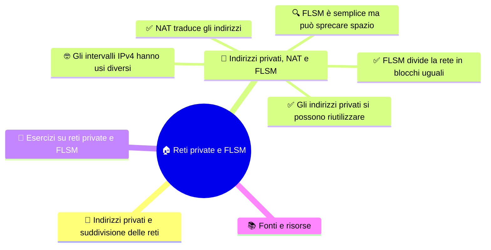

# 🏠 Reti private e FLSM

**4DI · Settembre-Ottobre · S4 · Teoria**

> **Legenda:** ✅ da sapere · 🔍 per capire fino in fondo · 🤓 facoltativo, per curiosi · 🃏 flashcard: rispondi a voce, poi apri per controllare

## 🧭 Indirizzi privati e suddivisione delle reti

Gli indirizzi IPv4 sono una risorsa finita. Una rete deve decidere quali indirizzi usare e come dividerli, evitando ambiguità. Gli indirizzi privati possono essere riutilizzati in reti separate; FLSM divide una rete in sottoreti uguali.

Queste due idee rispondono a problemi diversi. Gli indirizzi privati permettono di creare indirizzi per le reti interne senza consumare un indirizzo pubblico per ogni dispositivo. FLSM, invece, prende una rete già assegnata e la divide in blocchi di uguale dimensione. Una tecnica riguarda il riuso degli indirizzi; l'altra riguarda la progettazione delle sottoreti.

## 🧮 Indirizzi privati, NAT e FLSM

### ✅ Gli indirizzi privati si possono riutilizzare

Gli intervalli privati definiti da RFC 1918 possono essere usati nelle reti interne:

| Intervallo | Prefisso | Esempio |
|---|---:|---|
| `10.0.0.0` - `10.255.255.255` | `/8` | `10.2.4.8` |
| `172.16.0.0` - `172.31.255.255` | `/12` | `172.20.5.10` |
| `192.168.0.0` - `192.168.255.255` | `/16` | `192.168.1.20` |

Due reti separate possono usare lo stesso indirizzo privato. Se poi vengono collegate, la sovrapposizione deve essere gestita con attenzione.

Questi intervalli sono riservati all'uso privato: i router di Internet non li trattano come normali destinazioni globali. Ogni organizzazione può riutilizzarli al proprio interno. Per esempio, due scuole senza collegamenti fra loro possono entrambe assegnare `192.168.1.20` a un PC. Se le reti vengono unite, però, lo stesso numero potrebbe indicare due dispositivi diversi: occorre rinumerare una rete o introdurre una soluzione di traduzione.

🃏 Quali sono i tre intervalli privati RFC 1918?

10.0.0.0/8, 172.16.0.0/12 e 192.168.0.0/16.

🃏 Due reti isolate possono riutilizzare lo stesso indirizzo privato?

Sì. Se vengono collegate, la sovrapposizione richiede un piano.

🃏 Un indirizzo pubblico è automaticamente accessibile e sicuro?

No. Accessibilità e sicurezza dipendono anche da routing, regole e configurazioni.

### ✅ NAT traduce gli indirizzi

🃏 Perché due reti private separate possono usare lo stesso indirizzo?

Gli indirizzi privati si possono riutilizzare in reti separate; se le reti si uniscono, l'indirizzo sovrapposto deve essere gestito.

Il **NAT** (*Network Address Translation*) modifica gli indirizzi quando il traffico attraversa un confine. In una rete domestica, più dispositivi possono usare indirizzi privati e condividere un indirizzo pubblico. Il router tiene spesso traccia anche delle porte per associare correttamente le risposte.

Considera un computer di casa che apre una pagina web. Prima del router, il pacchetto ha come sorgente l'indirizzo privato del computer e come destinazione il server. Il router sostituisce la sorgente privata con il proprio indirizzo pubblico e registra l'associazione. Quando arriva la risposta, consulta quella registrazione e la consegna al computer che aveva iniziato lo scambio.

Spesso il router traduce anche le **porte** dei protocolli di trasporto, così più dispositivi possono condividere lo stesso indirizzo pubblico e le risposte possono essere associate alla comunicazione corretta. Questa forma è spesso chiamata PAT o NAPT. Non è necessario configurare nulla in questa lezione: basta seguire il cambio di indirizzo e il percorso di ritorno.

Il NAT non crea nuovi indirizzi pubblici: fa condividere quelli disponibili. Non è un sinonimo di firewall: il NAT traduce le informazioni di indirizzamento, mentre un firewall decide quali comunicazioni consentire o bloccare. Uno stesso router può svolgere entrambe le funzioni, ma i compiti restano distinti.

🃏 Che cosa fa il NAT?

Traduce informazioni di indirizzamento quando il traffico attraversa un confine.

🃏 NAT e firewall sono la stessa cosa?

No. NAT traduce indirizzi; un firewall applica regole per consentire o bloccare traffico.

### ✅ FLSM divide la rete in blocchi uguali

🃏 Come fa il router a consegnare la risposta dopo una traduzione NAT?

Consulta l'associazione registrata quando il dispositivo interno ha iniziato lo scambio e inoltra la risposta al dispositivo corretto.

🃏 Che cosa aggiunge PAT alla traduzione degli indirizzi?

Può tradurre anche le porte, così più dispositivi condividono un indirizzo pubblico e le risposte sono associate agli scambi corretti.

**FLSM** (*Fixed Length Subnet Masking*) crea sottoreti con lo stesso prefisso. Dividiamo `192.168.10.0/24` in quattro parti uguali:

1. Quattro sottoreti richiedono due bit, perché $2^2=4$.
2. Si prendono quei bit dalla parte host: il prefisso passa da `/24` a `/26`, cioè la maschera diventa `255.255.255.192`.
3. Restano 6 bit host: ogni blocco contiene $2^6=64$ indirizzi.
4. In una sottorete ordinaria, rete e broadcast non si assegnano agli host: ne restano 62.

Ogni blocco contiene 64 indirizzi, quindi i blocchi partono da `.0`, `.64`, `.128` e `.192`. Nel primo, `.0` identifica la rete, `.63` è il broadcast e gli host ordinari vanno da `.1` a `.62`. La stessa regola produce gli altri intervalli della tabella.

| Rete | Host ordinari | Broadcast |
|---|---|---|
| `192.168.10.0/26` | `.1` - `.62` | `.63` |
| `192.168.10.64/26` | `.65` - `.126` | `.127` |
| `192.168.10.128/26` | `.129` - `.190` | `.191` |
| `192.168.10.192/26` | `.193` - `.254` | `.255` |

Il gateway, se presente, usa uno degli indirizzi host della propria sottorete. La convenzione scelta va dichiarata.

Un controllo finale evita molti errori: gli indirizzi di rete devono essere allineati al passo del blocco; il broadcast è l'ultimo indirizzo di ogni blocco; l'intervallo degli host sta fra i due. In questa divisione, `192.168.10.64/26` è valido, mentre `.65/26` non è un nuovo indirizzo di rete: è un indirizzo host del blocco che inizia da `.64`.

🃏 Che cosa significa FLSM?

Fixed Length Subnet Masking: sottoreti create con la stessa lunghezza di prefisso.

🃏 Quanti bit servono per creare quattro sottoreti uguali?

Due bit, perché 2 elevato alla 2 fa 4.

🃏 Quanti indirizzi ha un blocco /26?

64 indirizzi: restano 6 bit host e 2 elevato alla 6 fa 64.

🃏 Quanti host ordinari offre un blocco /26?

62, perché nel caso ordinario si escludono l'indirizzo di rete e il broadcast.

### 🔍 FLSM è semplice ma può sprecare spazio

🃏 Quale maschera corrisponde a /26?

255.255.255.192.

🃏 Qual è il passo fra le reti /26 nell'ultimo ottetto?

64: per esempio, le reti iniziano da .0, .64, .128 e .192.

🃏 In 192.168.10.64/26, .65 è un indirizzo di rete?

No. È un indirizzo host del blocco che inizia da .64.

FLSM è facile da calcolare e mantenere, ma tutti i gruppi ricevono blocchi uguali. Se quattro reparti hanno bisogno rispettivamente di 50, 25, 12 e 6 host, assegnare a ciascuno un blocco da 62 lascia molti indirizzi inutilizzati nei reparti piccoli. Se i bisogni sono simili, invece, l'uniformità può essere pratica. In S6 vedremo VLSM, che permette sottoreti di dimensioni diverse; qui basta capire il compromesso.

🃏 Perché FLSM può sprecare indirizzi?

Perché assegna sottoreti uguali anche a gruppi con bisogni molto diversi.

🃏 Quale tecnica permette sottoreti di dimensioni diverse?

VLSM, studiato nella settimana 6.

### 🤓 Gli intervalli IPv4 hanno usi diversi

🃏 Perché quattro reparti con bisogni molto diversi possono sprecare spazio usando FLSM?

FLSM assegna blocchi uguali; i reparti piccoli ricevono molti indirizzi che non usano.

> Oltre agli indirizzi privati, IPv4 contiene intervalli con usi particolari, come loopback e multicast. Per esempio, `127.0.0.1` indica il dispositivo locale: i programmi possono usarlo per comunicare con servizi sullo stesso computer, senza spedire il traffico a un altro dispositivo della rete.
>
> Il registro IANA elenca gli intervalli e i loro usi. «Privato» non significa «unico tipo di indirizzo speciale»: per interpretare un indirizzo bisogna considerare il blocco e il contesto. Non occorre memorizzare tutti gli intervalli per questa verifica.

🃏 Perché un indirizzo IPv4 non si interpreta sempre guardando solo il numero?

Perché intervallo e contesto possono indicare un uso speciale.

## 🧩 Esercizi su reti private e FLSM

🃏 Che cosa indica 127.0.0.1?

Il dispositivo locale: il traffico è rivolto allo stesso computer e non a un altro dispositivo della rete.

1. Ricopia i tre intervalli RFC 1918 senza guardare la tabella.
2. Dividi `192.168.20.0/24` in quattro sottoreti uguali e trova gli indirizzi di rete.
3. Per ogni sottorete, indica quanti indirizzi sono nel blocco e quanti host ordinari sono disponibili.
4. Spiega perché NAT non sostituisce le regole di un firewall.

**Uscita:** completa «FLSM crea ..., mentre NAT ...».

## 📚 Fonti e risorse

- [RFC 1918 - Private Address Space](https://www.rfc-editor.org/rfc/rfc1918): intervalli privati IPv4.
- [RFC 3022 - Traditional IP Network Address Translator](https://www.rfc-editor.org/rfc/rfc3022): descrizione del NAT.

---

[⬅️ S3 - IPv4 e il pacchetto](%28STU%29%204DI%20sett-ott%20S3%20-%20IPv4%20e%20il%20pacchetto.md) · [➡️ S5 - CIDR e intervalli](%28STU%29%204DI%20sett-ott%20S5%20-%20CIDR%20e%20intervalli.md) · [🗺️ Indice](%28STU%29%204DI%20-%20SETT-OTT.md)