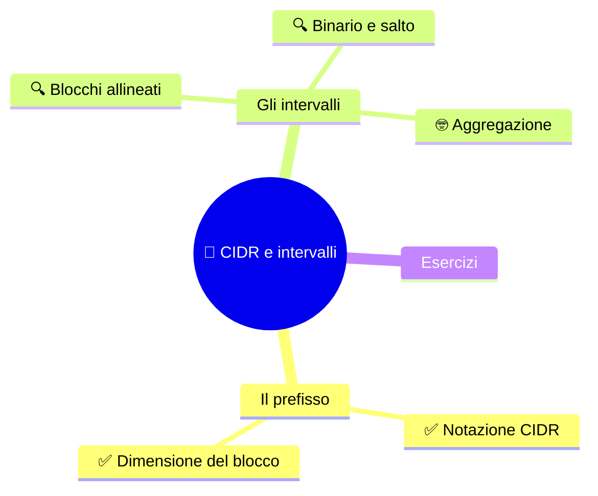

⬅️ [S4 - Reti private e FLSM](%28STU%29%204DI%20sett-ott%20S4%20-%20Reti%20private%20e%20FLSM.md) · 🏠 [Indice](%28STU%29%204DI%20-%20SETT-OTT.md) · [S6 - VLSM e progettazione](%28STU%29%204DI%20sett-ott%20S6%20-%20VLSM%20e%20progettazione.md) ➡️

# 🔢 CIDR e intervalli

**4DI · Settembre-Ottobre · S5 · Teoria**

⏱️ **Tempo di studio: circa 35 minuti.** ✅ essenziale: 20 min. 🔍 per il voto alto: 15 min. 🤓 si può saltare. Nessun compito obbligatorio a casa.

> **Legenda:** ✅ da sapere · 🔍 per capire fino in fondo · 🤓 facoltativo · 📜 storia · 🧪 esempio · ⚠️ errore comune · 🧠 da ricordare · ✏️ da fare · 🃏 flashcard (rispondi a voce, poi apri)

## 🗺️ Mappa



## 📜 Il collasso che non è arrivato

Primi anni Novanta. Internet cresce così in fretta che gli ingegneri sono preoccupati. I problemi sono due.

Il primo lo conosci: le **classi** sprecano. Chi ha bisogno di 300 indirizzi riceve una classe B da 65 536. Ma le classi B sono solo circa 16 000 in tutto, e se ne stanno consumando una dopo l'altra. Finite quelle, non ci sono taglie intermedie.

Il secondo è più sottile. Ogni rete assegnata diventa **una riga** nelle tabelle dei router di Internet. Più reti, più righe, più memoria, più lentezza. Le tabelle crescono troppo in fretta.

La soluzione arriva nel 1993, in due documenti (RFC 1518 e 1519): **CIDR**, *Classless Inter-Domain Routing*. L'idea è semplice, quasi banale: **smettere di decidere il confine in base al primo ottetto, e scriverlo accanto all'indirizzo**. Un numero dopo una barra: `/26`. Con un prefisso di qualsiasi lunghezza si ricevono blocchi di qualsiasi taglia.

Eppure non tutti sono convinti. Nel 1995 Bob Metcalfe, l'inventore di Ethernet (lo ricordi da S2), scrive nella sua rubrica che Internet avrà un **«collasso catastrofico»** l'anno dopo. E promette: se sbaglio, mangio le mie parole.

Il collasso non arriva. Nel 1997, davanti a una platea alla Conferenza internazionale sul World Wide Web, Metcalfe prende una copia stampata della sua rubrica, la mette in un **frullatore**, aggiunge del liquido e **la beve**.

CIDR non ha fatto nulla di spettacolare. Ha solo cambiato dove si scrive il confine. Ma quel cambiamento ha aiutato Internet a crescere ancora per molti anni.

## 🔢 Il prefisso

### ✅ CIDR scrive il prefisso accanto all'indirizzo

Con CIDR un indirizzo si scrive così: `192.168.40.0/26`. Il numero dopo la barra dice **quanti bit iniziali sono di rete**. I restanti sono bit host.

<u>In una rete `/p`, i primi $p$ bit sono di rete. Gli altri $32 - p$ sono di host.</u>

Il prefisso e la **maschera** dicono la stessa cosa:

| Prefisso | Maschera | Bit host | Indirizzi nel blocco | Host ordinari |
|---:|---|---:|---:|---:|
| `/24` | `255.255.255.0` | 8 | 256 | 254 |
| `/25` | `255.255.255.128` | 7 | 128 | 126 |
| `/26` | `255.255.255.192` | 6 | 64 | 62 |
| `/27` | `255.255.255.224` | 5 | 32 | 30 |
| `/28` | `255.255.255.240` | 4 | 16 | 14 |
| `/29` | `255.255.255.248` | 3 | 8 | 6 |
| `/30` | `255.255.255.252` | 2 | 4 | 2 |

*Più il prefisso è lungo, più la rete è piccola.*

⚠️ **Prefisso più grande = rete più piccola.** Una `/30` ha 4 indirizzi, una `/24` ne ha 256. Controlla sempre con la tabella.

Se restano $h$ bit host, il blocco contiene $2^h$ indirizzi. Gli host assegnabili sono, nel caso ordinario, $2^h - 2$: l'indirizzo di rete e il broadcast hanno ruoli propri.

🧠 <u>Indirizzi nel blocco: $2^h$. Host ordinari: $2^h - 2$.</u>

<details>
<summary>🃏 <b>Che cosa indica il prefisso /p?</b></summary>
Quanti bit iniziali dell'indirizzo sono di rete.
</details>
<details>
<summary>🃏 <b>Quanti bit host restano in una /27?</b></summary>
Cinque, perché 32 meno 27 fa 5.
</details>
<details>
<summary>🃏 <b>Quanti indirizzi contiene una /27, e quanti host ordinari?</b></summary>
32 indirizzi, 30 host ordinari.
</details>
<details>
<summary>🃏 <b>Una /30 è più grande o più piccola di una /24?</b></summary>
Più piccola: ha 4 indirizzi contro 256.
</details>
<details>
<summary>🃏 <b>Perché gli host ordinari sono 2^h − 2?</b></summary>
Perché l'indirizzo di rete e il broadcast non si assegnano agli host (nel caso ordinario).
</details>

✏️ **Completa (3 min).** Copri la tabella e riscrivi la riga di `/27` e quella di `/29`: maschera, bit host, indirizzi, host ordinari. Poi controlla.

### ✅ Dal prefisso al salto

Per le maschere che cambiano nell'ultimo ottetto, c'è un metodo rapido:

```text
salto = 256 − (valore dell'ottetto della maschera)
```

🧪 **/27:** la maschera finisce con 224, quindi il salto è $256 - 224 = 32$. I blocchi iniziano a `.0`, `.32`, `.64`, `.96`, `.128`, `.160`, `.192`, `.224`.

🧠 <u>Il salto è la dimensione del blocco. Le reti iniziano sui multipli del salto.</u>

| Prefisso | Ottetto della maschera | Salto |
|---:|---:|---:|
| `/25` | 128 | 128 |
| `/26` | 192 | 64 |
| `/27` | 224 | 32 |
| `/28` | 240 | 16 |

<details>
<summary>🃏 <b>Come si calcola il salto?</b></summary>
256 meno il valore dell'ottetto della maschera.
</details>
<details>
<summary>🃏 <b>Qual è il salto di una /27?</b></summary>
32, perché 256 meno 224 fa 32.
</details>
<details>
<summary>🃏 <b>Da dove iniziano i blocchi /27 nell'ultimo ottetto?</b></summary>
Da 0, 32, 64, 96, 128, 160, 192 e 224.
</details>

✏️ **Prevedi (2 min).** Senza guardare la tabella: qual è il salto di una `/28`? E di una `/25`?

### 🔍 Ogni indirizzo cade in un blocco allineato

Come si trova la rete di un indirizzo? Si cerca il **multiplo del salto** più vicino, ma non maggiore.

🧪 **`192.168.40.110/27`.** Il salto è 32. I multipli di 32 sono 0, 32, 64, **96**, 128... Il 110 sta fra 96 e 127.

| Informazione | Valore |
|---|---|
| Rete | `192.168.40.96/27` |
| Host ordinari | `192.168.40.97` - `192.168.40.126` |
| Broadcast | `192.168.40.127` |

*La rete è il primo indirizzo del blocco; il broadcast è l'ultimo ($96 + 32 - 1 = 127$).*

`.110` è un host del blocco. Non è la rete.

⚠️ **`.0` non è sempre una rete, e `.255` non è sempre un broadcast.** Dipende dal prefisso. Per esempio `.64/26` è una rete, mentre `.127` può essere il broadcast di una `/26` ma un host in una `/24`.

<details>
<summary>🃏 <b>Come trovi la rete di un indirizzo con il metodo del salto?</b></summary>
Prendi il multiplo del salto più vicino all'indirizzo, ma non maggiore.
</details>
<details>
<summary>🃏 <b>Qual è la rete di 192.168.40.110/27?</b></summary>
192.168.40.96/27.
</details>
<details>
<summary>🃏 <b>Qual è il broadcast di 192.168.40.96/27?</b></summary>
192.168.40.127.
</details>
<details>
<summary>🃏 <b>.110 è il Network ID di una /27?</b></summary>
No: è un host del blocco che inizia a .96.
</details>

✏️ **Linea dei numeri (3 min).** Disegna una linea da 0 a 255 e segna i blocchi di una `/27`. Dove cade `.110`? Dove inizia e dove finisce il suo blocco?

### 🔍 Due metodi che si controllano a vicenda

Un risultato è più solido se ci arrivi **in due modi**.

🧪 **`172.16.5.70/26`.**

**Metodo del salto.** Il salto è $256 - 192 = 64$. Blocchi: 0, 64, 128, 192. Il 70 sta fra 64 e 127.
- rete: `172.16.5.64/26`
- host ordinari: `172.16.5.65` - `172.16.5.126`
- broadcast: `172.16.5.127`

**Metodo binario (AND).** L'ultimo ottetto: $70 = 01000110$, la maschera ha $192 = 11000000$.

```text
70   = 01000110
192  = 11000000
AND  = 01000000  → 64
```

*L'AND dà 64: la rete è `.64`. I due metodi coincidono.*

Se i due metodi danno risultati diversi, **c'è un errore**, ed è una buona notizia: sai che devi controllare.

<details>
<summary>🃏 <b>Quali due metodi usiamo per trovare la rete?</b></summary>
Il salto (multipli del blocco) e l'AND in binario fra indirizzo e maschera.
</details>
<details>
<summary>🃏 <b>Qual è la rete di 172.16.5.70/26?</b></summary>
172.16.5.64/26.
</details>
<details>
<summary>🃏 <b>Che cosa fai se i due metodi danno risultati diversi?</b></summary>
Ricontrollo i passaggi: c'è un errore da trovare.
</details>

✏️ **Controlla (4 min).** Trova la rete di `10.4.9.45/28` con il metodo del salto, poi verificala con l'AND. Scrivi anche i due indirizzi che delimitano gli host.

### 🤓 Più reti, un solo prefisso

> Quattro blocchi `/26` consecutivi e allineati riempiono esattamente una `/24`. Allora l'intero gruppo si può descrivere con **un solo prefisso più corto**: è l'**aggregazione** (o *summarization*). Funziona solo se i blocchi sono contigui e allineati, e se il prefisso comune non include indirizzi estranei.
>
> È anche il motivo per cui CIDR ha aiutato le tabelle dei router: invece di mille righe, ne basta una. In questa lezione vediamo solo l'idea. Come i router usano i prefissi lo studieremo più avanti.

<details>
<summary>🃏 <b>Quale prefisso descrive quattro /26 consecutive e allineate?</b></summary>
La /24 che le contiene tutte.
</details>
<details>
<summary>🃏 <b>Che cosa va controllato prima di aggregare?</b></summary>
Che i blocchi siano contigui e allineati e che il prefisso non includa indirizzi estranei.
</details>

## ✏️ Esercizi

1. **Completa.** Quanti bit host restano in una `/28`? Quanti indirizzi ha il blocco? Quanti host ordinari?
2. **Trova la rete.** Per `192.168.7.160/27`: rete, host ordinari, broadcast.
3. **Trova l'errore.** «`192.168.40.100/27` è l'indirizzo di rete.» Dove sbaglia?
4. **Spiega in una frase.** Perché una `/27` ha 32 indirizzi ma 30 host ordinari?
5. **Collega (S3).** Con le vecchie classi `192.168.1.25` era una C. Con CIDR può essere una `/27`? Che cosa cambia?

**Uscita:** «In una rete `/p` restano ... bit host, quindi il blocco contiene ... indirizzi».

## 📚 Fonti e risorse

- [RFC 4632 - Classless Inter-domain Routing](https://www.rfc-editor.org/rfc/rfc4632): la versione aggiornata (2006) dello standard CIDR. Per consultazione.
- [Wikipedia - Classless Inter-Domain Routing](https://en.wikipedia.org/wiki/Classless_Inter-Domain_Routing): storia e motivazioni del 1993.
- [Wikipedia - Robert Metcalfe](https://en.wikipedia.org/wiki/Robert_Metcalfe): la sezione «Predicted Internet collapse» racconta la storia del frullatore.
- [RIPE NCC - IPv4 Subnetting](https://www.ripe.net/manage-ips-and-asns/ipv4/ipv4-subnetting/): uno strumento per **controllare** i risultati. Prima prova a mano.

---

⬅️ [S4 - Reti private e FLSM](%28STU%29%204DI%20sett-ott%20S4%20-%20Reti%20private%20e%20FLSM.md) · 🏠 [Indice](%28STU%29%204DI%20-%20SETT-OTT.md) · [S6 - VLSM e progettazione](%28STU%29%204DI%20sett-ott%20S6%20-%20VLSM%20e%20progettazione.md) ➡️
