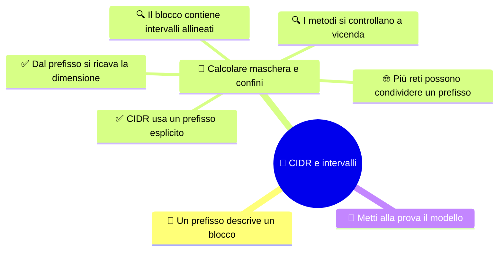

# 🔢 CIDR e intervalli

**4DI · Settembre-Ottobre · S5 · Teoria**

> **Legenda:** ✅ da sapere · 🔍 per capire fino in fondo · 🤓 facoltativo, per curiosi · 🃏 flashcard: rispondi a voce, poi apri per controllare



## 🧭 Un prefisso descrive un blocco

Le vecchie classi IPv4 usavano confini rigidi. Con **CIDR** (*Classless Inter-Domain Routing*) scriviamo invece un indirizzo seguito dal prefisso, per esempio `192.168.40.0/26`. Il prefisso specifica quanti bit iniziali descrivono la rete.

## 🧮 Calcolare maschera e confini

### ✅ CIDR usa un prefisso esplicito

IPv4 ha 32 bit. In una rete `/p`, i primi $p$ bit sono quelli del prefisso; gli altri $32-p$ sono bit host. La maschera scrive gli stessi bit in forma decimale puntata.

| Prefisso | Maschera | Bit host | Indirizzi nel blocco | Host ordinari |
|---:|---|---:|---:|---:|
| `/24` | `255.255.255.0` | 8 | 256 | 254 |
| `/25` | `255.255.255.128` | 7 | 128 | 126 |
| `/26` | `255.255.255.192` | 6 | 64 | 62 |
| `/27` | `255.255.255.224` | 5 | 32 | 30 |
| `/28` | `255.255.255.240` | 4 | 16 | 14 |

Se restano $h$ bit host, il blocco contiene $2^h$ indirizzi. Nel caso ordinario, gli host assegnabili sono $2^h-2$: l'indirizzo di rete e il broadcast hanno usi distinti.

<details>
<summary>🃏 In IPv4, quanti bit ha l'indirizzo?</summary>
32 bit.
</details>
<details>
<summary>🃏 In una rete /27, quanti bit host restano?</summary>
Cinque bit, perché 32 meno 27 fa 5.
</details>
<details>
<summary>🃏 Quanti indirizzi contiene un blocco /27?</summary>
32 indirizzi, perché 2 elevato alla 5 fa 32.
</details>
<details>
<summary>🃏 Quanti host ordinari offre un blocco /27?</summary>
30, escludendo indirizzo di rete e broadcast.
</details>

### ✅ Dal prefisso si ricava la dimensione

Per una maschera che cambia nell'ultimo ottetto, il salto fra blocchi si calcola così:

```text
salto = 256 - valore dell'ottetto della maschera
```

Per `/27`, la maschera finisce con 224 e il salto è $256-224=32$. I blocchi nell'ultimo ottetto cominciano quindi a `.0`, `.32`, `.64`, `.96`, `.128`, `.160`, `.192` e `.224`.

<details>
<summary>🃏 Qual è la maschera di /27?</summary>
255.255.255.224.
</details>
<details>
<summary>🃏 Qual è il salto dei blocchi /27 nell'ultimo ottetto?</summary>
32, perché 256 meno 224 fa 32.
</details>
<details>
<summary>🃏 Qual è la formula del salto nell'ottetto interessato?</summary>
256 meno il valore dell'ottetto della maschera.
</details>

### 🔍 Il blocco contiene intervalli allineati

L'indirizzo `192.168.40.110/27` cade fra `.96` e `.127`, perché 96 è il multiplo di 32 immediatamente precedente. Quindi:

| Informazione | Valore |
|---|---|
| Rete | `192.168.40.96/27` |
| Host ordinari | `192.168.40.97` - `192.168.40.126` |
| Broadcast | `192.168.40.127` |

`.110` è un indirizzo host dentro il blocco; non è il Network ID.

<details>
<summary>🃏 Quali indirizzi comprende il blocco /27 che inizia a .96?</summary>
Da .96 a .127 compresi.
</details>
<details>
<summary>🃏 Qual è il broadcast del blocco 192.168.40.96/27?</summary>
192.168.40.127.
</details>
<details>
<summary>🃏 L'indirizzo .110 è il Network ID di una /27?</summary>
No. È un host nel blocco che inizia a .96.
</details>

### 🔍 I metodi si controllano a vicenda

Per `172.16.5.70/26`, la maschera è `255.255.255.192`. Il salto è $256-192=64$, perciò gli intervalli dell'ultimo ottetto iniziano a 0, 64, 128 e 192. Il 70 cade nell'intervallo da 64 a 127:

- rete: `172.16.5.64/26`;
- host ordinari: `172.16.5.65`-`172.16.5.126`;
- broadcast: `172.16.5.127`.

Si può controllare anche con l'AND fra indirizzo e maschera: l'ottetto 70, in AND con 192, dà 64. Se i metodi danno risultati diversi, occorre ricontrollare i passaggi.

<details>
<summary>🃏 Qual è il salto di una /26 nell'ultimo ottetto?</summary>
64.
</details>
<details>
<summary>🃏 Qual è la rete di 172.16.5.70/26?</summary>
172.16.5.64/26.
</details>
<details>
<summary>🃏 Come si può controllare il Network ID con un'operazione binaria?</summary>
Facendo l'AND fra indirizzo e maschera.
</details>

### 🤓 Più reti possono condividere un prefisso

> Quattro blocchi `/26` consecutivi e allineati possono riempire l'intervallo di una `/24`. Si può allora descrivere l'insieme con un prefisso comune più ampio, se nessun indirizzo estraneo viene incluso.
>
> In questa lezione osserviamo l'idea di rappresentazione compatta; non scegliamo rotte né studiamo tabelle di routing.

<details>
<summary>🃏 A quale intervallo corrispondono quattro blocchi /26 consecutivi che riempiono una /24?</summary>
All'intervallo descritto dalla rete /24, se i blocchi sono contigui e correttamente allineati.
</details>
<details>
<summary>🃏 Che cosa va controllato prima di riassumere più blocchi?</summary>
Che siano contigui e allineati e che il prefisso comune non includa indirizzi estranei.
</details>

## 🧩 Metti alla prova il modello

1. Quanti bit host restano in `/28`? Quanti indirizzi contiene il blocco?
2. Scrivi maschera e dimensione del blocco di `/27`.
3. Per `192.168.7.160/27`, indica rete, intervallo host ordinari e broadcast.
4. Per `172.16.5.70/26`, indica rete, host ordinari e broadcast.
5. Perché una rete `/27` ha 32 indirizzi ma offre 30 host ordinari?

**Uscita:** «In una rete `/p` restano ... bit host, quindi il blocco contiene ... indirizzi».

## 📚 Fonti e risorse

- [RFC 4632 - Classless Inter-domain Routing](https://www.rfc-editor.org/rfc/rfc4632): notazione e principi CIDR.
- [RIPE NCC - IPv4 Subnetting](https://www.ripe.net/manage-ips-and-asns/ipv4/ipv4-subnetting/): spiegazioni e strumento di supporto; prova prima a calcolare a mano.

---

[⬅️ S4 - Reti private e FLSM](%28STU%29%204DI%20sett-ott%20S4%20-%20Reti%20private%20e%20FLSM.md) · [➡️ S6 - VLSM e progettazione](%28STU%29%204DI%20sett-ott%20S6%20-%20VLSM%20e%20progettazione.md) · [🗺️ Indice](%28STU%29%204DI%20-%20SETT-OTT.md)