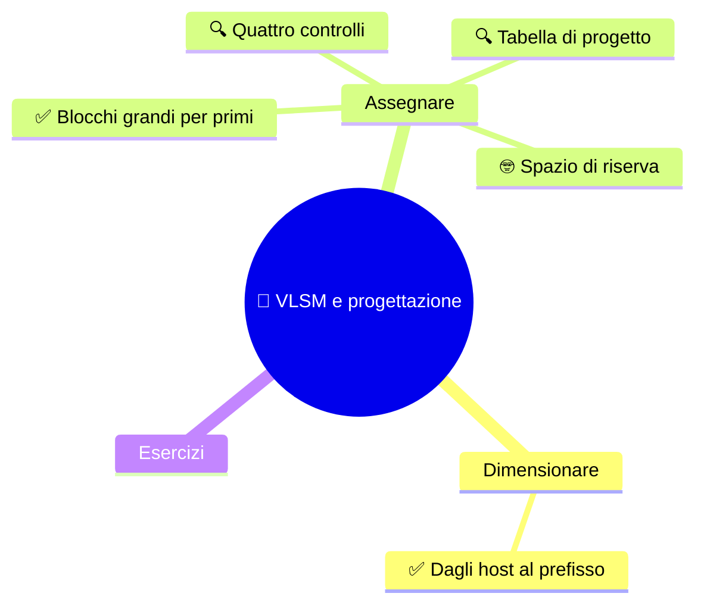

⬅️ [S5 - CIDR e intervalli](%28STU%29%204DI%20sett-ott%20S5%20-%20CIDR%20e%20intervalli.md) · 🏠 [Indice](%28STU%29%204DI%20-%20SETT-OTT.md) · [S7 - Ripasso e troubleshooting](%28STU%29%204DI%20sett-ott%20S7%20-%20Ripasso%20e%20troubleshooting.md) ➡️

# 🧩 VLSM e progettazione

**4DI · Settembre-Ottobre · S6 · Teoria**

⏱️ **Tempo di studio: circa 35 minuti.** ✅ essenziale: 20 min. 🔍 per il voto alto: 15 min. 🤓 si può saltare. Nessun compito obbligatorio a casa.

> **Legenda:** ✅ da sapere · 🔍 per capire fino in fondo · 🤓 facoltativo · 📜 storia · 🧪 esempio · ⚠️ errore comune · 🧠 da ricordare · ✏️ da fare · 🃏 flashcard (rispondi a voce, poi apri)

## 🗺️ Mappa




## 📜 La mappa dei numeri


Negli anni Ottanta gli indirizzi sembrano infiniti. Chi li chiede li riceve a **blocchi interi**, da oltre sedici milioni di indirizzi ciascuno: i blocchi `/8`, quelli della classe A di S3. Pochi, grandi, a chi c'era all'inizio.

Nel 2006 il disegnatore del fumetto *xkcd*, Randall Munroe, fa una mappa di tutto lo spazio IPv4. La disegna con una curva speciale che tiene vicini gli indirizzi vicini: ogni quadrato numerato è un blocco `/8`. Guarda chi compare in alto a sinistra.


*«Map of the Internet», xkcd n. 195, di Randall Munroe, licenza CC BY-NC 2.5. Immagine caricata dal sito [xkcd.com/195](https://xkcd.com/195/).*

Nel disegno compaiono, ognuno con un intero `/8`, nomi come General Electric, IBM, Xerox, HP, DEC, Apple, MIT, Ford. Ognuno ha circa 16,7 milioni di indirizzi: un /8 intero.

Poi gli indirizzi finiscono (S4). E qualcuno comincia a restituire il superfluo: la Stanford University, per esempio, ha riconsegnato il suo blocco `36.0.0.0/8` per aiutare a ritardare l'esaurimento.

La lezione è semplice: **chiedere più del necessario è facile, ed è un lusso che finisce**. VLSM è l'arte opposta: dare a ognuno **quello che serve**, né un indirizzo di più né di meno, e scrivere tutto in una tabella che un altro possa controllare.

> 😄 Un nome per il lavoro che stai per fare: **Tetris degli indirizzi**. Pezzi di forme diverse, un campo di 256 caselle, e nessuna riga si cancella da sola.

## 🧮 Dimensionare


### ✅ Dal numero di host al prefisso

Con **FLSM** (S4) tutte le sottoreti sono uguali. Con **VLSM** (*Variable Length Subnet Masking*) ogni sottorete ha **la propria dimensione**, scelta in base al bisogno.

Il primo passo è **dimensionare**: dato il numero di host, trovare il prefisso più lungo che basta.

1. Quanti host servono? (aggiungi il **gateway**, se ne usa uno della sottorete)
2. Scegli il più piccolo $h$ con $2^h - 2 \ge$ host.
3. Il prefisso è $32 - h$.

| Host richiesti | Bit host minimi | Prefisso | Indirizzi nel blocco | Host ordinari |
|---:|---:|---:|---:|---:|
| 50 | 6 | `/26` | 64 | 62 |
| 25 | 5 | `/27` | 32 | 30 |
| 12 | 4 | `/28` | 16 | 14 |
| 6 | 3 | `/29` | 8 | 6 |

⚠️ **Il gateway occupa un host.** Se un reparto ha 62 host e un gateway, servono **63** indirizzi host: una `/26` (62 host ordinari) non basta, ci vuole una `/25`. Dichiara sempre se hai contato il gateway.

🧠 <u>Prima si dimensiona ogni richiesta. Poi si assegna.</u>

<details>
<summary>🃏 <b>Qual è il prefisso di una rete con 6 bit host?</b></summary>
/26, perché 32 meno 6 fa 26.
</details>
<details>
<summary>🃏 <b>Quale prefisso offre almeno 25 host ordinari?</b></summary>
/27, che ne offre 30.
</details>
<details>
<summary>🃏 <b>Quanti host ordinari offre una /29?</b></summary>
6.
</details>
<details>
<summary>🃏 <b>Se un gateway usa un indirizzo host, va contato nelle richieste?</b></summary>
Sì: occupa uno degli indirizzi host della sottorete.
</details>

✏️ **Prevedi (3 min).** Scrivi il prefisso minimo per 100 host, per 14 host e per 3 host. Poi controlla con la formula $2^h - 2$.

## 🧮 Assegnare


### ✅ Si assegnano prima i blocchi grandi

Ora il progetto. Quattro passaggi, sempre gli stessi:

1. **Dimensiona** ogni richiesta (prefisso e dimensione del blocco).
2. **Ordina** le richieste dalla più grande alla più piccola.
3. **Alloca** i blocchi uno dopo l'altro, partendo dall'inizio dello spazio, ognuno su un confine **allineato**.
4. **Controlla** il risultato (vedi 🔍).

🧪 **La rete `192.168.60.0/24`**, con quattro gruppi: 50, 25, 12 e 6 host. I blocchi sono 64, 32, 16 e 8 indirizzi.

| Gruppo | Rete | Host ordinari | Broadcast |
|---|---|---|---|
| 50 host | `192.168.60.0/26` | `.1` - `.62` | `.63` |
| 25 host | `192.168.60.64/27` | `.65` - `.94` | `.95` |
| 12 host | `192.168.60.96/28` | `.97` - `.110` | `.111` |
| 6 host | `192.168.60.112/29` | `.113` - `.118` | `.119` |

*Ogni blocco inizia dove finisce il precedente. Da `.120` a `.255` resta spazio libero.*

```text
0        64      96   112 120                        255
|--- 64 --|-- 32 --|-16-|-8-|........ spazio libero ........|
```

*La striscia dei 256 indirizzi, con i quattro blocchi uno accanto all'altro.*

**Perché si parte dal più grande?** Proviamo con uno spazio di soli 64 indirizzi e quattro richieste da 8, 32, 16 e 8 indirizzi.

```text
Nell'ordine in cui arrivano (8, 32, 16, 8), senza tornare indietro:
|8| . . . . . . .|-------- 32 --------|  → il 16 non trova più posto

Dal più grande (32, 16, 8, 8):
|-------- 32 --------|---- 16 ----|8|8|  → entrano tutti
```

*Un blocco deve iniziare su un multiplo della sua dimensione. Se si comincia dal piccolo, si lasciano buchi: se poi non si torna a riempirli, il piano fallisce. Partire dal grande evita il problema.*

⚠️ **Non basta che la somma torni.** Lo spazio totale può essere sufficiente, ma senza ordine e allineamento il piano può fallire.

<details>
<summary>🃏 <b>Quali sono i quattro passaggi di un progetto VLSM?</b></summary>
Dimensiona, ordina, alloca, controlla.
</details>
<details>
<summary>🃏 <b>In che ordine si assegnano i blocchi?</b></summary>
Dal più grande al più piccolo.
</details>
<details>
<summary>🃏 <b>Perché partire dal blocco più grande?</b></summary>
Perché i blocchi piccoli, messi per primi, creano buchi che i blocchi grandi non riescono più a usare.
</details>
<details>
<summary>🃏 <b>Qual è la dimensione dei blocchi di 50, 25, 12 e 6 host?</b></summary>
64, 32, 16 e 8 indirizzi.
</details>

✏️ **Disegna (4 min).** Su una striscia da 0 a 255, disegna i quattro blocchi dell'esempio con le loro dimensioni. Poi segna con un colore lo spazio libero.

### 🔍 Quattro controlli per un piano affidabile

Quando hai finito, **controlla** il piano da quattro punti di vista:

| Controllo | Domanda |
|---|---|
| **Capienza** | ogni sottorete ha abbastanza host ordinari? |
| **Allineamento** | ogni rete inizia su un multiplo della propria dimensione? |
| **Non sovrapposizione** | gli intervalli sono separati? |
| **Tracciabilità** | la tabella dice rete, prefisso, host, broadcast e gateway? |

🧪 **Allineamento.** Una `/27` ha blocchi da 32: nell'ultimo ottetto può iniziare solo a 0, 32, 64, 96... `.70` può essere un host del blocco `.64`, ma **non** può essere l'inizio di una `/27`.

<details>
<summary>🃏 <b>Quali sono i quattro controlli di un piano VLSM?</b></summary>
Capienza, allineamento, non sovrapposizione e tracciabilità.
</details>
<details>
<summary>🃏 <b>.70 può essere l'inizio di una /27?</b></summary>
No: il blocco da 32 che lo contiene inizia a .64.
</details>
<details>
<summary>🃏 <b>Qual è il broadcast della rete .64/27?</b></summary>
.95, perché il blocco va da .64 a .95.
</details>

✏️ **Trova l'errore (3 min).** Un piano assegna `192.168.60.40/27` a un gruppo da 25 host. Quale controllo fallisce? Qual è l'inizio valido più vicino?

### 🔍 La tabella è il progetto

Un piano non è una pila di numeri: è un **documento** che un'altra persona deve poter verificare. Una buona tabella dice, per ogni sottorete:

- il **gruppo** servito;
- **rete e prefisso**;
- l'**intervallo degli host** ordinari;
- il **broadcast**;
- l'indirizzo del **gateway** e la convenzione usata.

Il gateway può essere il primo host, l'ultimo, o altro: conta che sia un host **valido** della sottorete e che la scelta sia dichiarata.

<details>
<summary>🃏 <b>Che cosa rende verificabile una tabella VLSM?</b></summary>
Rete e prefisso, intervallo degli host, broadcast, gruppo servito e convenzione dichiarata per il gateway.
</details>
<details>
<summary>🃏 <b>Il gateway deve essere sempre il primo host?</b></summary>
No: può seguire un'altra convenzione, se è un host valido e la scelta è dichiarata.
</details>

### 🤓 Lo spazio libero può essere una scelta

> Non assegnare ogni indirizzo non è per forza uno spreco. Un piano che lascia **spazio di riserva** permette di aggiungere un reparto o far crescere una rete senza rifare tutto. Una riserva è utile se è **ragionata**; è inutile se è dimenticata.
>
> Un piano corretto e facile da estendere batte un piano che usa ogni indirizzo ma è impossibile da modificare.

<details>
<summary>🃏 <b>Perché lasciare indirizzi non assegnati?</b></summary>
Per consentire crescita o riorganizzazione, se la riserva è motivata.
</details>

## ✏️ Esercizi


1. **Dimensiona.** Per 40, 20 e 10 host, scrivi il prefisso minimo e la dimensione del blocco.
2. **Progetta.** Distribuisci quelle tre richieste dentro `10.10.10.0/24`: per ognuna, rete, host ordinari e broadcast. Ordina prima.
3. **Controlla.** Applica i quattro controlli al tuo piano.
4. **Riordina.** Metti in ordine: alloca, controlla, ordina, dimensiona.
5. **Collega (S5).** Qual è il salto di ogni prefisso che hai scelto? I tuoi blocchi iniziano sui suoi multipli?

**Uscita:** «Prima di assegnare un blocco, controllo che ... perché ...».

## 📚 Fonti e risorse


- [xkcd 195 - Map of the Internet](https://xkcd.com/195/): il fumetto-mappa dello spazio IPv4 nel 2006. Guarda chi aveva un `/8` intero.
- [Wikipedia - List of assigned /8 IPv4 address blocks](https://en.wikipedia.org/wiki/List_of_assigned_/8_IPv4_address_blocks): chi aveva ricevuto quali blocchi, e chi li ha restituiti.
- [RIPE NCC - IPv4 Subnetting](https://www.ripe.net/manage-ips-and-asns/ipv4/ipv4-subnetting/): uno strumento per **controllare** il tuo piano. Prima progetta a mano.

---

⬅️ [S5 - CIDR e intervalli](%28STU%29%204DI%20sett-ott%20S5%20-%20CIDR%20e%20intervalli.md) · 🏠 [Indice](%28STU%29%204DI%20-%20SETT-OTT.md) · [S7 - Ripasso e troubleshooting](%28STU%29%204DI%20sett-ott%20S7%20-%20Ripasso%20e%20troubleshooting.md) ➡️
