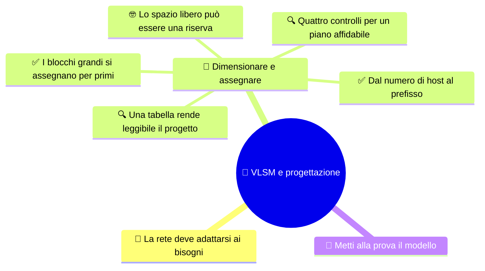

# 🧩 VLSM e progettazione

**4DI · Settembre-Ottobre · S6 · Teoria**

> **Legenda:** ✅ da sapere · 🔍 per capire fino in fondo · 🤓 facoltativo, per curiosi · 🃏 flashcard: rispondi a voce, poi apri per controllare

## 🧭 La rete deve adattarsi ai bisogni

Con FLSM ogni sottorete ha la stessa dimensione. VLSM consente invece di assegnare blocchi diversi a gruppi con bisogni diversi. Per farlo senza sovrapposizioni, dimensioniamo ogni gruppo e procediamo con ordine.

## 🧮 Dimensionare e assegnare

### ✅ Dal numero di host al prefisso

Se una sottorete ha $h$ bit host, contiene $2^h$ indirizzi. Nel caso ordinario, rete e broadcast non si assegnano a host: ne restano $2^h-2$. Scegliamo il più piccolo $h$ che basta e calcoliamo il prefisso con $32-h$.

| Host richiesti | Bit host minimi | Prefisso | Indirizzi nel blocco | Host ordinari |
|---:|---:|---:|---:|---:|
| 50 | 6 | `/26` | 64 | 62 |
| 25 | 5 | `/27` | 32 | 30 |
| 12 | 4 | `/28` | 16 | 14 |
| 6 | 3 | `/29` | 8 | 6 |

Se il gateway usa un indirizzo della sottorete, va contato fra gli host richiesti.

🃏 Qual è il prefisso di una rete con 6 bit host?

/26, perché 32 meno 6 fa 26.

🃏 Quanti host ordinari offre una /26?

62.

🃏 Quale prefisso minimo offre almeno 25 host ordinari?

/27, che offre 30 host ordinari.

🃏 Se un gateway usa un indirizzo host, va contato nel requisito?

Sì, perché occupa uno degli indirizzi host della sottorete.

### ✅ I blocchi grandi si assegnano per primi

Per progettare con VLSM, partiamo dalla rete disponibile e dalla lista di gruppi:

1. calcoliamo il prefisso minimo per ogni richiesta;
2. ordiniamo i gruppi dal blocco più grande al più piccolo;
3. assegniamo gli indirizzi su confini validi;
4. registriamo rete, intervallo host e broadcast.

Nell'esempio della rete `192.168.60.0/24`, i gruppi chiedono 50, 25, 12 e 6 host. I blocchi necessari contengono rispettivamente 64, 32, 16 e 8 indirizzi.

| Gruppo | Rete | Host ordinari | Broadcast |
|---|---|---|---|
| Gruppo da 50 host | `192.168.60.0/26` | `.1` - `.62` | `.63` |
| Gruppo da 25 host | `192.168.60.64/27` | `.65` - `.94` | `.95` |
| Gruppo da 12 host | `192.168.60.96/28` | `.97` - `.110` | `.111` |
| Gruppo da 6 host | `192.168.60.112/29` | `.113` - `.118` | `.119` |

Gli intervalli sono consecutivi e non si sovrappongono. Da `.120` a `.255` resta spazio libero.

🃏 Qual è l'ordine consigliato per assegnare blocchi VLSM?

Dal blocco più grande a quello più piccolo.

🃏 Qual è la dimensione dei blocchi dell'esempio VLSM?

64, 32, 16 e 8 indirizzi.

🃏 Perché una rete deve iniziare su un confine valido?

Per essere allineata alla dimensione del blocco e non sovrapporsi in modo scorretto ad altre reti.

### 🔍 Quattro controlli per un piano affidabile

Un piano VLSM è da controllare da più punti di vista:

- **Capienza:** ogni sottorete ha abbastanza host ordinari?
- **Allineamento:** ogni rete inizia su un confine valido per il suo blocco?
- **Non sovrapposizione:** gli intervalli sono disgiunti?
- **Tracciabilità:** sono indicati rete, prefisso, host, broadcast e convenzione per il gateway?

Una `/27` contiene blocchi da 32 indirizzi: nell'ultimo ottetto gli inizi validi sono multipli di 32. `.70` può essere un host della rete che inizia a `.64`, ma non può essere il Network ID di quella `/27`.

🃏 Quali sono i quattro controlli di un piano VLSM?

Capienza, allineamento, non sovrapposizione e tracciabilità.

🃏 .70 può essere il Network ID di una /27?

No. Il blocco da 32 indirizzi che contiene .70 inizia a .64.

🃏 Qual è il broadcast della rete .64/27?

.95, perché il blocco comprende da .64 a .95.

### 🔍 Una tabella rende leggibile il progetto

Una tabella documenta le scelte e permette a un'altra persona di verificarle. Un piano corretto non è soltanto una raccolta di numeri: deve mostrare a quale gruppo serve ogni blocco e dove cominciano e finiscono gli intervalli.

Il gateway può usare il primo host, l'ultimo o una convenzione diversa. Ciò che conta è che sia un indirizzo host valido della sottorete e che la scelta sia dichiarata.

🃏 Che cosa rende verificabile una tabella VLSM?

Rete e prefisso, intervallo host, broadcast, gruppo servito e convenzione dichiarata per il gateway.

🃏 Il gateway deve sempre usare il primo host?

No. Può seguire una convenzione diversa, purché sia un host valido e la scelta sia dichiarata.

### 🤓 Lo spazio libero può essere una riserva

> Non assegnare ogni indirizzo disponibile non è necessariamente uno spreco. Lo spazio libero può consentire crescita o riorganizzazione. Una riserva è utile quando risponde a un'esigenza ragionata, non quando è lasciata senza spiegazione.
>
> Un piano facile da estendere può essere più utile di uno che usa ogni indirizzo ma non lascia margine.

🃏 Perché un progetto può lasciare indirizzi non assegnati?

Per conservare spazio per crescita o riorganizzazione, se la riserva è motivata.

## 🧩 Metti alla prova il modello

1. Quale prefisso offre almeno 20 host ordinari? Mostra come lo ricavi.
2. Progetta reti per 40, 20 e 10 host dentro `10.10.10.0/24`.
3. Per ogni blocco, scrivi rete, intervallo host e broadcast.
4. Qual è il problema di usare `.70` come Network ID di una `/27`?
5. Elenca i quattro controlli da fare prima di accettare un piano.

**Uscita:** nomina i quattro controlli che useresti prima di consegnare un piano VLSM.

## 📚 Fonti e risorse

- [RFC 4632 - Classless Inter-domain Routing](https://www.rfc-editor.org/rfc/rfc4632): riferimento sui prefissi.
- [RIPE NCC - IPv4 Subnetting](https://www.ripe.net/manage-ips-and-asns/ipv4/ipv4-subnetting/): spiegazioni e strumento di verifica; mostra prima i passaggi manuali.

---

[⬅️ S5 - CIDR e intervalli](%28STU%29%204DI%20sett-ott%20S5%20-%20CIDR%20e%20intervalli.md) · [➡️ S7 - Ripasso e troubleshooting](%28STU%29%204DI%20sett-ott%20S7%20-%20Ripasso%20e%20troubleshooting.md) · [🗺️ Indice](%28STU%29%204DI%20-%20SETT-OTT.md)