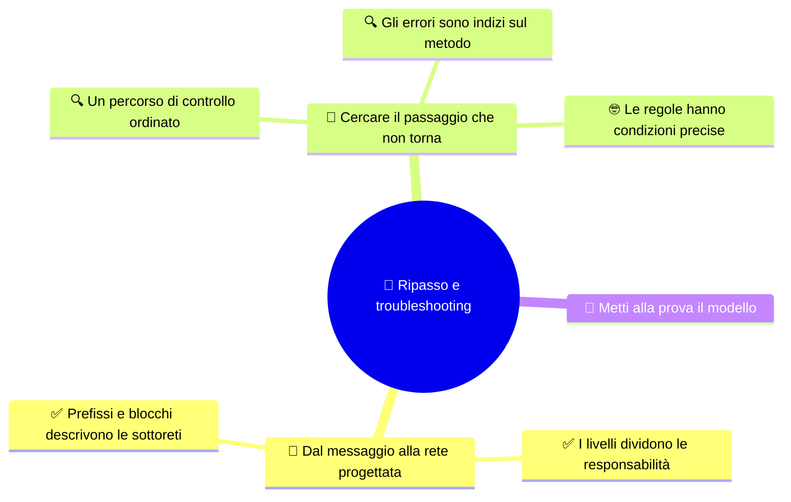

# 🧠 Ripasso e troubleshooting

**4DI · Settembre-Ottobre · S7 · Ripasso**

> **Legenda:** ✅ da sapere · 🔍 per capire fino in fondo · 🤓 facoltativo, per curiosi · 🃏 flashcard: rispondi a voce, poi apri per controllare



## 🧭 Dal messaggio alla rete progettata

### ✅ I livelli dividono le responsabilità

Riprendiamo il viaggio del dato: l'applicazione produce informazioni, i protocolli le preparano, IP le indirizza, il collegamento crea un frame locale e il livello fisico trasmette segnali.

```text
dati → segmento/datagramma → pacchetto → frame → segnali
```

ISO/OSI e TCP/IP sono mappe concettuali. Il frame serve al collegamento locale e può essere ricreato in un tratto successivo; il pacchetto IP accompagna la comunicazione logica.

<details>
<summary>🃏 Qual è l'ordine delle PDU dalla sorgente al mezzo?</summary>
Dati, segmento TCP o datagramma UDP, pacchetto IP, frame, segnali.
</details>
<details>
<summary>🃏 Quale PDU è trattata dal collegamento dati?</summary>
Il frame.
</details>
<details>
<summary>🃏 Che cosa distingue il frame dal pacchetto IP?</summary>
Il frame organizza la consegna sul collegamento locale; il pacchetto IP descrive l'indirizzamento logico.
</details>

### ✅ Prefissi e blocchi descrivono le sottoreti

Il prefisso separa i bit di rete da quelli host. Se restano $h$ bit host, il blocco ordinario contiene $2^h$ indirizzi; rete e broadcast non sono assegnabili agli host.

FLSM assegna blocchi uguali. CIDR esprime il prefisso. VLSM permette blocchi diversi e richiede capienza, allineamento, assenza di sovrapposizioni e documentazione.

<details>
<summary>🃏 Che cosa stabilisce il prefisso?</summary>
Quanti bit iniziali descrivono la rete e quanti bit restano per gli host.
</details>
<details>
<summary>🃏 Quali due indirizzi si escludono dal conteggio ordinario degli host?</summary>
L'indirizzo di rete e il broadcast.
</details>
<details>
<summary>🃏 Qual è la differenza principale fra FLSM e VLSM?</summary>
FLSM usa sottoreti della stessa dimensione; VLSM consente dimensioni diverse.
</details>

## 🔎 Cercare il passaggio che non torna

### 🔍 Un percorso di controllo ordinato

Quando un calcolo di sottorete sembra incoerente, controlla un passaggio alla volta:

1. prefisso e maschera indicano lo stesso confine?
2. il numero di bit host dà la dimensione prevista?
3. il Network ID è allineato a un confine del blocco?
4. rete, host ordinari e broadcast sono distinti?
5. gli intervalli assegnati si sovrappongono?
6. se è indicato, il gateway è un host di quella rete?

Scrivere i passaggi rende l'errore più facile da trovare: puoi capire se nasce dal prefisso, dal blocco o da un singolo limite.

<details>
<summary>🃏 Quale primo controllo fai se maschera e prefisso sembrano discordare?</summary>
Controllo che il numero di bit a 1 nella maschera corrisponda al prefisso.
</details>
<details>
<summary>🃏 Che cosa controlli per verificare l'allineamento di un Network ID?</summary>
Che inizi a un confine valido per la dimensione del blocco.
</details>
<details>
<summary>🃏 Perché conviene scrivere i passaggi del calcolo?</summary>
Per individuare se l'errore riguarda prefisso, dimensione del blocco o un limite dell'intervallo.
</details>

### 🔍 Gli errori sono indizi sul metodo

| Se trovi questo errore... | ...ricontrolla questa distinzione |
|---|---|
| 30 host considerati come 30 indirizzi totali | Una `/27` contiene 32 indirizzi, di cui 30 host ordinari |
| Un indirizzo host scritto come Network ID | Il Network ID deve rispettare il confine del blocco |
| Il broadcast assegnato a un dispositivo | L'ultimo indirizzo del blocco ha un uso distinto |
| Blocchi piccoli assegnati prima di quelli grandi | In VLSM si ordinano prima i blocchi più grandi |
| NAT chiamato firewall | Traduzione e regole di accesso sono compiti diversi |
| IP descritto come consegna garantita | IP offre un servizio best effort |

L'obiettivo non è memorizzare una lista di errori: è riconoscere quale regola o passaggio serve controllare.

<details>
<summary>🃏 Quanti indirizzi totali contiene una /27?</summary>
32 indirizzi, di cui 30 host ordinari nel caso usuale.
</details>
<details>
<summary>🃏 Che cosa può rivelare un Network ID non allineato?</summary>
Che l'indirizzo host è stato confuso con l'inizio del blocco.
</details>
<details>
<summary>🃏 Perché NAT non equivale a un firewall?</summary>
NAT traduce indirizzi; un firewall applica regole di accesso al traffico.
</details>

### 🤓 Le regole hanno condizioni precise

> Dire «un indirizzo che finisce con .0 è sempre una rete» è troppo generico: serve conoscere il prefisso e il confine del blocco. Anche un indirizzo pubblico non è automaticamente raggiungibile: dipende dal contesto e dalle configurazioni.
>
> Una regola è utile quando sappiamo spiegare a quali condizioni si applica.

<details>
<summary>🃏 Un indirizzo che termina con .0 è sempre un Network ID?</summary>
No. Dipende dal prefisso e dal confine valido del blocco.
</details>
<details>
<summary>🃏 Un indirizzo pubblico è sempre raggiungibile?</summary>
No. La raggiungibilità dipende anche da routing e configurazioni.
</details>

## 🧩 Metti alla prova il modello

1. Ordina dati, segmento, pacchetto, frame e segnali.
2. Per `172.20.8.173/27`, indica maschera, rete, host ordinari e broadcast.
3. Quante sottoreti `/26` si ricavano da una `/24`? Quanti host ordinari offre ciascuna?
4. Elenca i quattro controlli più importanti di un piano VLSM.
5. Spiega in una frase la differenza fra NAT e firewall.

**Uscita:** «Quando un calcolo non torna, controllo prima ... perché ...».

## 📚 Fonti e risorse

- [CIDR e intervalli](%28STU%29%204DI%20sett-ott%20S5%20-%20CIDR%20e%20intervalli.md): prefissi e blocchi.
- [VLSM e progettazione](%28STU%29%204DI%20sett-ott%20S6%20-%20VLSM%20e%20progettazione.md): dimensionamento e controlli.
- [RFC 4632](https://www.rfc-editor.org/rfc/rfc4632): riferimento sui prefissi CIDR.

---

[⬅️ S6 - VLSM e progettazione](%28STU%29%204DI%20sett-ott%20S6%20-%20VLSM%20e%20progettazione.md) · [➡️ S8 - Verifica e recupero](%28STU%29%204DI%20sett-ott%20S8%20-%20Verifica%20e%20recupero.md) · [🗺️ Indice](%28STU%29%204DI%20-%20SETT-OTT.md)