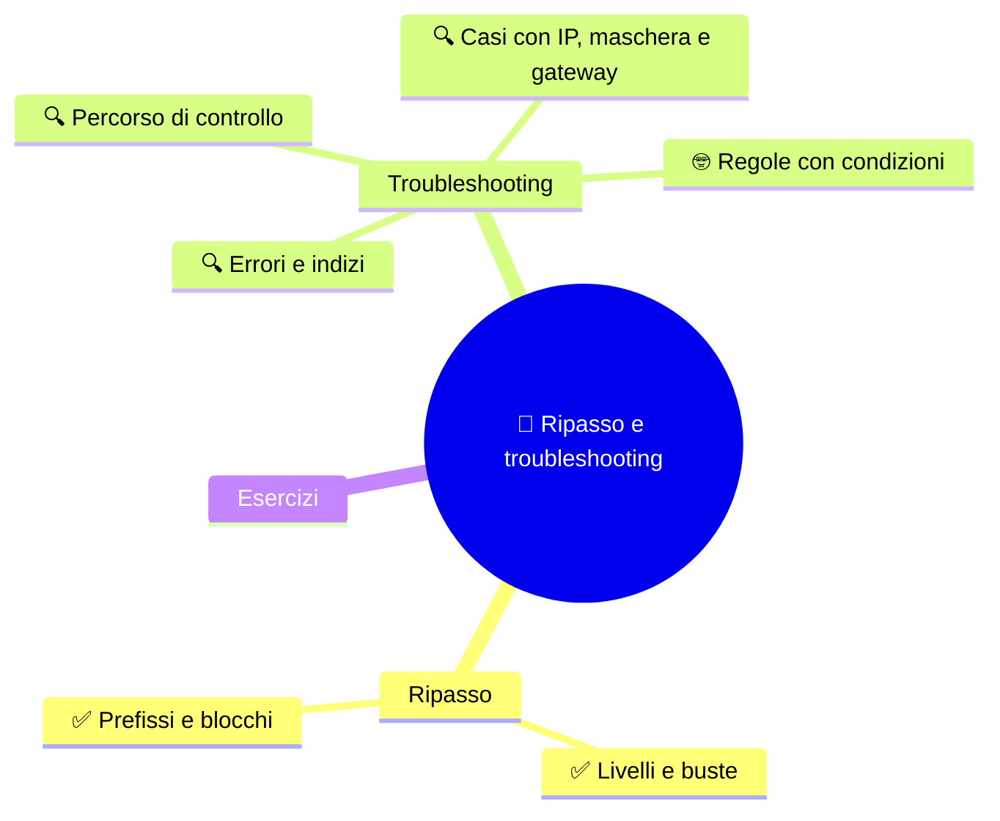
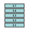
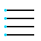

⬅️ [S6 - VLSM e progettazione](%28STU%29%204DI%20sett-ott%20S6%20-%20VLSM%20e%20progettazione.md) · 🏠 [Indice](%28STU%29%204DI%20-%20SETT-OTT.md)

# 🧠 Ripasso e troubleshooting

**4DI · Settembre-Ottobre · S7 · Teoria**

⏱️ **Tempo di studio: circa 30 minuti.** ✅ essenziale: 15 min. 🔍 per il voto alto: 15 min. 🤓 si può saltare. Nessun argomento nuovo e nessun compito obbligatorio a casa.

> **Legenda:** ✅ da sapere · 🔍 per capire fino in fondo · 🤓 facoltativo · 📜 storia · 🧪 esempio · ⚠️ errore comune · 🧠 da ricordare · ✏️ da fare · 🃏 flashcard (rispondi a voce, poi apri)

## 🗺️ Mappa




## 📜 Il caso delle 500 miglia


Un caso vero, raccontato nel 2002 da un amministratore di sistema americano, Trey Harris. L'autore dice di averlo un po' modificato per renderlo più divertente. Ma l'essenza è questa.

Un giorno squilla il telefono. È il direttore del dipartimento di statistica di un'università.

«Non riusciamo a mandare email oltre le 500 miglia», dice.

Harris quasi si strozza con il caffè. «Come, scusi?»

«Non più di 500 miglia. Diciamo 520. Ma non oltre.» E, essendo il direttore di *statistica*, aggiunge che una geostatistica del dipartimento ha disegnato una **mappa** con il raggio entro cui le email arrivano. Il problema esiste da giorni. Non hanno chiamato prima perché «non avevano ancora abbastanza dati».

Harris pensa a uno scherzo. Poi prova. Una mail a Princeton, 400 miglia: arriva. A New York, 420: arriva. A Memphis, 600: **fallisce**. A Boston: fallisce. A Providence, 580: fallisce. Anche l'amico che abita vicino ma ha il provider a Seattle: fallisce. Il problema è reale, preciso, ripetibile.

Il metodo di Harris è quello di ogni buon tecnico: **cambia una cosa alla volta**. Chiede che cosa è cambiato di recente: qualcuno ha «aggiornato il server». Guarda la configurazione della posta: è normale. La confronta con la sua: è identica. Poi si collega al servizio e legge il messaggio di benvenuto... che non è quello che si aspettava.

Il consulente, aggiornando il sistema operativo, aveva **sostituito il programma di posta con una versione più vecchia**, senza cambiare il file di configurazione. La versione vecchia leggeva le opzioni che conosceva e **ignorava le altre**. Per le opzioni ignorate non c'era un valore predefinito, e il programma usava **zero**. Una di quelle opzioni era il tempo massimo per connettersi a un altro server. Il tempo massimo era **zero**.

Con un tempo massimo di circa tre millisecondi, la connessione riesce solo se il server dall'altra parte risponde in tre millisecondi. La rete dell'università era tutta a switch: nessun router rallentava il percorso. Il tempo dipendeva soprattutto dalla **velocità della luce**. E tre millisecondi di luce sono circa 560 miglia: **500 miglia, o poco più**.

Il mistero era risolto. Nessuna magia: un valore a zero, e la fisica.

🧠 <u>Un sintomo strano ha sempre una causa precisa. Si trova controllando un passaggio alla volta, partendo da ciò che è cambiato.</u>

È esattamente quello che faremo oggi, con indirizzi e maschere.

## 🔁 Ripasso



Nessun argomento nuovo: oggi si **ricompone** quello che sai. Prova a rispondere senza guardare gli appunti (un po' di fatica fa bene: ricordare aiuta più di rileggere).

### ✅ I livelli dividono le responsabilità

Nelle prime tre settimane hai incontrato due immagini. La prima è la **busta**:

```text
dati → segmento → pacchetto → frame → segnali
```

*Ogni livello mette la propria busta. Il router cambia il frame a ogni tratto; il pacchetto prosegue.*

- **Livello fisico:** bit ↔ segnali.
- **Collegamento (Ethernet):** frame, MAC, consegna sul tratto locale; lo switch decide con i MAC.
- **Rete (IPv4):** pacchetto, indirizzi IP, best effort.

⚠️ I livelli sono **funzioni**, non pezzi di hardware.

<details>
<summary>🃏 <b>Qual è l'ordine delle PDU quando i dati scendono?</b></summary>
Dati, segmento, pacchetto, frame, segnali.
</details>
<details>
<summary>🃏 <b>Che differenza c'è fra MAC e IP?</b></summary>
Il MAC serve alla consegna sul tratto locale; l'IP indica la destinazione fra reti.
</details>
<details>
<summary>🃏 <b>Che cosa significa best effort?</b></summary>
IP prova a consegnare ma non garantisce consegna, ordine o assenza di duplicati.
</details>

✏️ **Foglio bianco (5 min).** Senza guardare nulla, disegna il viaggio di un messaggio dal tuo PC a un server in un'altra rete: i livelli, le buste e dove cambia il frame. Poi confronta con S1-S3.

### ✅ Prefissi e blocchi descrivono le sottoreti

La seconda immagine è il **confine**:

```text
192.168.40.110/27  →  11000000.10101000.00101000.011 | 01110
                         27 bit di rete             | 5 bit host
```

*Il prefisso taglia l'indirizzo in due. Il numero di bit host dà la dimensione del blocco.*

- Bit host $h$ → indirizzi $2^h$ → host ordinari $2^h - 2$.
- **Salto** $= 256 -$ ottetto della maschera. Le reti iniziano sui multipli del salto.
- **FLSM**: blocchi uguali. **VLSM**: blocchi diversi, assegnati dal più grande, **allineati**, poi controllati.
- **NAT** traduce, **firewall** decide.

<details>
<summary>🃏 <b>Quanti indirizzi ha una /27, e quanti host ordinari?</b></summary>
32 indirizzi, 30 host ordinari.
</details>
<details>
<summary>🃏 <b>Qual è la differenza principale fra FLSM e VLSM?</b></summary>
FLSM usa sottoreti della stessa dimensione; VLSM consente dimensioni diverse.
</details>
<details>
<summary>🃏 <b>Qual è il salto di una /26?</b></summary>
64.
</details>

✏️ **Un po' di tutto (6 min).** Mescola gli argomenti, come in una verifica:
1. Ordina: segnali, frame, dati, pacchetto, segmento.
2. Per `172.20.8.173/27`: maschera, rete, host ordinari, broadcast.
3. Quante sottoreti `/26` ci sono in una `/24`? Quanti host ordinari ha ciascuna?
4. Qual è la differenza fra NAT e firewall, in una frase?

## 🔎 Cercare il passaggio che non torna


### 🔍 Un percorso di controllo ordinato

Quando un calcolo o una configurazione non torna, **non indovinare**. Controlla un passaggio alla volta, come Harris:

1. **Prefisso e maschera** dicono lo stesso confine?
2. I **bit host** danno la dimensione prevista?
3. Il **Network ID** è allineato a un multiplo del salto?
4. **Rete, host ordinari e broadcast** sono distinti?
5. Gli intervalli assegnati **si sovrappongono**?
6. Se c'è un **gateway**, è un host valido **della stessa sottorete**?

Il sesto controllo è l'unico sul gateway, e basta questo: **deve stare nella stessa rete dell'host**. Che cosa faccia lo scopriremo a novembre.

🧠 <u>Scrivi i passaggi. Così capisci in quale nasce l'errore.</u>

<details>
<summary>🃏 <b>Che cosa controlli per primo se maschera e prefisso sembrano discordare?</b></summary>
Che il numero di bit a 1 della maschera sia uguale al prefisso.
</details>
<details>
<summary>🃏 <b>Come verifichi l'allineamento di un Network ID?</b></summary>
Controllo che inizi su un multiplo del salto.
</details>
<details>
<summary>🃏 <b>Perché conviene scrivere i passaggi?</b></summary>
Per capire in quale passaggio nasce l'errore.
</details>
<details>
<summary>🃏 <b>Quale condizione deve rispettare il gateway, per ora?</b></summary>
Deve essere un indirizzo host valido della stessa sottorete dell'host.
</details>

### 🔍 Gli errori sono indizi

| Se trovi questo errore... | ...ricontrolla questa distinzione |
|---|---|
| 30 host scambiati per 30 indirizzi | una `/27` ha 32 indirizzi, 30 host ordinari |
| un host scritto come Network ID | il Network ID deve essere su un confine del blocco |
| il broadcast assegnato a un PC | l'ultimo indirizzo del blocco ha un ruolo proprio |
| blocchi piccoli assegnati prima dei grandi | in VLSM si parte dai grandi |
| NAT chiamato firewall | traduzione e regole di accesso sono compiti diversi |
| IP descritto come consegna garantita | IP è best effort |
| prefisso grande = rete grande | più il prefisso è lungo, più la rete è piccola |

*Non serve memorizzare la lista: serve riconoscere quale regola controllare.*

<details>
<summary>🃏 <b>Quanti indirizzi totali contiene una /27?</b></summary>
32, di cui 30 host ordinari.
</details>
<details>
<summary>🃏 <b>Che cosa rivela un Network ID non allineato?</b></summary>
Che un indirizzo host è stato confuso con l'inizio del blocco.
</details>
<details>
<summary>🃏 <b>Perché NAT non equivale a un firewall?</b></summary>
Il NAT traduce indirizzi; il firewall applica regole di accesso al traffico.
</details>

### 🔍 Casi su carta: IP, maschera e gateway

Per ogni caso, applica il percorso dei sei controlli e scrivi **dove** non torna e **perché**. Un caso è tutto corretto: «non ho trovato errori» è una risposta valida, se la dimostri.

| Caso | Dati |
|---|---|
| **A** | host `192.168.10.130/26`, gateway `192.168.10.1` |
| **B** | host `192.168.10.127/26` |
| **C** | host `192.168.10.64/26` |
| **D** | rete `192.168.10.0` con prefisso `/26` e maschera `255.255.255.224` |
| **E** | sottoreti `192.168.60.64/27` e `192.168.60.80/28` |
| **F** | host `10.0.0.37/24`, gateway `10.0.0.1` |

✏️ **Detective (8 min).** Scegli tre casi e risolvili per iscritto. Per ognuno: quale controllo ha rivelato il problema? Poi confrontati con un compagno: avete trovato le stesse cose?

### 🤓 Le regole hanno condizioni

> «Un indirizzo che finisce con `.0` è sempre una rete» è falso: dipende dal prefisso. «Un indirizzo pubblico è raggiungibile» è falso: dipende anche da percorso e configurazioni. Una regola è utile quando sai **a quali condizioni** vale.
>
> Un buon esercizio: cerca un **controesempio** per ogni regola che hai imparato in queste sette settimane.

<details>
<summary>🃏 <b>Un indirizzo che finisce con .0 è sempre una rete?</b></summary>
No: dipende dal prefisso e dal confine del blocco.
</details>
<details>
<summary>🃏 <b>Che cos'è un controesempio?</b></summary>
Un caso in cui una regola, che sembrava generale, non vale.
</details>

## ✏️ Esercizi



1. **Riordina.** Metti in ordine i sei controlli del percorso di troubleshooting.
2. **Spiega in una frase.** Che cosa ha in comune il caso delle 500 miglia con un errore di subnetting?
3. **Controesempio.** Trova un caso in cui «più banda = connessione migliore» non vale.
4. **Spiega a un compagno assente.** Come passi dall'indirizzo `192.168.40.110/27` alla sua rete? Usa due metodi.

**Uscita:** «Quando un calcolo non torna, controllo prima ... perché ...».

## 📚 Fonti e risorse


- [Trey Harris - The case of the 500-mile email](https://www.ibiblio.org/harris/500milemail.html): il racconto originale del 2002, in inglese, e vale la lettura. Dura circa cinque minuti.
- [RFC 4632 - Classless Inter-domain Routing](https://www.rfc-editor.org/rfc/rfc4632): per ripassare prefissi e blocchi. Per consultazione.
- [RIPE NCC - IPv4 Subnetting](https://www.ripe.net/manage-ips-and-asns/ipv4/ipv4-subnetting/): uno strumento per **controllare** i risultati degli esercizi. Prima calcola a mano.

---

⬅️ [S6 - VLSM e progettazione](%28STU%29%204DI%20sett-ott%20S6%20-%20VLSM%20e%20progettazione.md) · 🏠 [Indice](%28STU%29%204DI%20-%20SETT-OTT.md)
