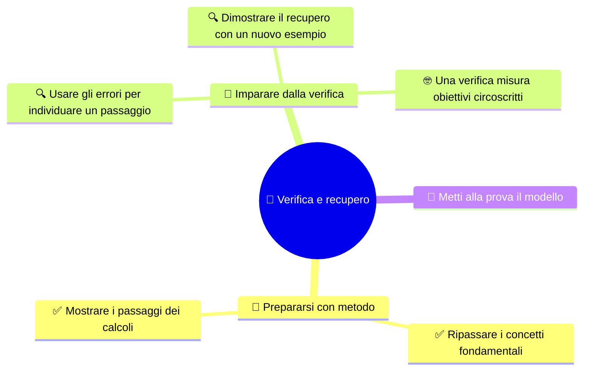

# 🎯 Verifica e recupero

**4DI · Settembre-Ottobre · S8 · Ripasso personale**

> **Legenda:** ✅ da sapere · 🔍 per capire fino in fondo · 🤓 facoltativo, per curiosi · 🃏 flashcard: rispondi a voce, poi apri per controllare

## 🧭 Prepararsi con metodo

### ✅ Ripassare i concetti fondamentali

La verifica del bimestre riguarda i contenuti studiati da S1 a S6. Per ripassare, prova a spiegare senza appunti:

- come ISO/OSI e TCP/IP dividono le responsabilità;
- come dati, segmento, pacchetto, frame e segnali si collegano;
- che cosa fanno il livello fisico e il collegamento dati;
- come prefisso e maschera separano rete e host;
- che cosa distinguono indirizzi privati, NAT e firewall;
- come si dimensionano sottoreti FLSM, CIDR e VLSM.

ARP/RARP, routing, ICMP, `ping`, `traceroute`, DNS e configurazione degli apparati appartengono a un percorso successivo.

🃏 Quali settimane costituiscono il programma della verifica?

S1-S6: modelli, incapsulamento, livello fisico ed Ethernet, IPv4, reti private, FLSM, CIDR e VLSM.

🃏 Quale PDU è associata al livello di rete Internet?

Il pacchetto IP.

🃏 Quali argomenti sono successivi al bimestre?

ARP/RARP, routing, ICMP, ping, traceroute e DNS, oltre alla configurazione degli apparati.

### ✅ Mostrare i passaggi dei calcoli

Quando risolvi un esercizio, scrivi i passaggi in ordine:

1. prefisso e maschera;
2. bit host e dimensione del blocco;
3. Network ID e intervallo;
4. host ordinari e broadcast;
5. per VLSM, verifica di capienza, allineamento e sovrapposizioni.

Una risposta leggibile permette di capire il ragionamento anche se un calcolo intermedio va corretto. Non limitarti a riportare un numero senza spiegare da dove viene.

🃏 Che cosa conviene scrivere prima di trovare l'intervallo di una rete?

Prefisso, maschera, bit host e dimensione del blocco.

🃏 Quali informazioni principali mostra una soluzione completa di subnetting?

Network ID, intervallo host ordinari e broadcast, con prefisso e passaggi coerenti.

🃏 Quali controlli aggiungi in un progetto VLSM?

Capienza, allineamento e assenza di sovrapposizioni.

## 🔁 Imparare dalla verifica

### 🔍 Usare gli errori per individuare un passaggio

Un errore è più utile quando sai dire in quale passaggio è comparso. Se confondi rete e host, ricontrolla il confine del blocco. Se il numero di host non basta, rivedi i bit host. Se due sottoreti si sovrappongono, confronta gli intervalli sulla linea degli indirizzi.

Dopo una correzione, prova un esercizio con numeri diversi: così verifichi di aver capito il metodo e non soltanto memorizzato la risposta.

🃏 Che cosa fai quando una rete non parte su un confine valido?

Ricontrollo la dimensione del blocco e individuo il confine corretto che contiene l'indirizzo.

🃏 Come puoi verificare di aver capito una correzione?

Risolvo un nuovo esempio con dati diversi e mostro i passaggi.

🃏 Perché è utile individuare il passaggio in cui nasce un errore?

Per scegliere quale regola ripassare e correggere il procedimento, non solo il risultato.

### 🔍 Dimostrare il recupero con un nuovo esempio

Per rendere visibile il progresso, usa una traccia breve:

| Che cosa scrivo | Esempio |
|---|---|
| Il passaggio che confondevo | Rete e broadcast |
| La regola che applico ora | Il blocco `/27` contiene 32 indirizzi |
| Il nuovo esempio | Un indirizzo diverso con prefisso `/27` |
| Il controllo finale | Verifico rete, host e broadcast |

Adatta la traccia al tuo errore: modello, livelli, prefisso, conteggio degli host o confini.

🃏 Che cosa deve contenere un esempio di recupero?

Il passaggio da correggere, la regola applicata, un nuovo esempio e un controllo del risultato.

🃏 Perché usare numeri diversi nel nuovo esempio?

Per mostrare che si sa applicare la regola e non si sta ripetendo a memoria una soluzione.

### 🤓 Una verifica misura obiettivi circoscritti

> Una verifica teorica raccoglie evidenze su obiettivi definiti. Non dimostra da sola ogni capacità necessaria per configurare o diagnosticare una rete reale. Altri aspetti si affrontano nelle attività previste dal percorso.
>
> Per studiare bene, concentrati sulle richieste e sui metodi che avete esercitato.

🃏 Una verifica teorica dimostra automaticamente ogni capacità pratica?

No. Misura obiettivi teorici circoscritti; altre capacità richiedono attività specifiche.

## 🧩 Metti alla prova il modello

1. Spiega a voce la differenza fra pacchetto IP e frame.
2. Se restano 6 bit host, quanti indirizzi contiene il blocco? Quanti sono gli host ordinari?
3. Quali controlli fai per un piano VLSM?
4. Scegli un errore corretto e prepara un nuovo esempio per mostrare il metodo.

**Uscita:** «Il passaggio che ora so controllare è ..., perché ...».

## 📚 Fonti e risorse

- [CIDR e intervalli](%28STU%29%204DI%20sett-ott%20S5%20-%20CIDR%20e%20intervalli.md): prefissi e dimensione dei blocchi.
- [VLSM e progettazione](%28STU%29%204DI%20sett-ott%20S6%20-%20VLSM%20e%20progettazione.md): metodo e verifiche.
- [RFC 1918 - Private Address Space](https://www.rfc-editor.org/rfc/rfc1918): riferimento sugli indirizzi IPv4 privati.

---

[⬅️ S7 - Ripasso e troubleshooting](%28STU%29%204DI%20sett-ott%20S7%20-%20Ripasso%20e%20troubleshooting.md) · [🗺️ Indice](%28STU%29%204DI%20-%20SETT-OTT.md)