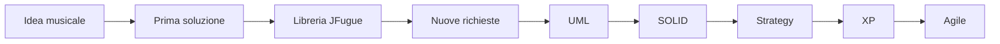
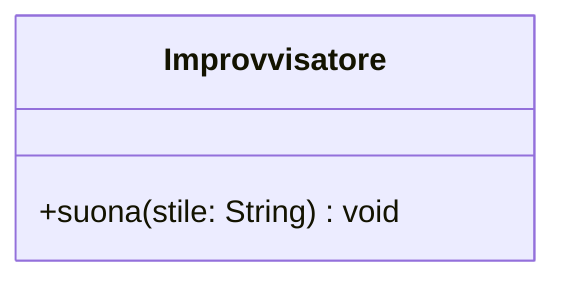
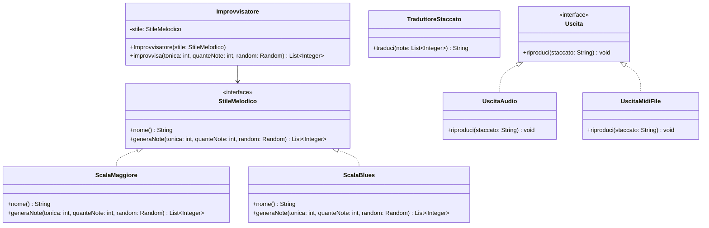
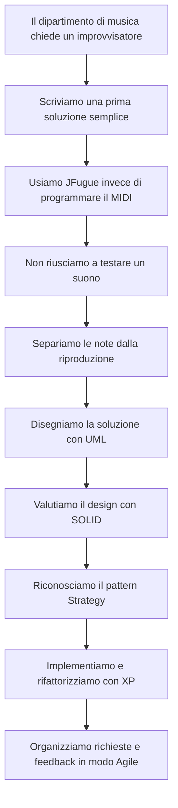

# 🎹 Ingegneria del software e casi di studio

**Introduzione all'ingegneria del software · Caso di studio in Java · Un improvvisatore musicale**

> **Domanda guida:** perché scrivere codice funzionante non basta quando il software deve crescere, cambiare ed essere sviluppato da più persone?

> **Nota:** no, non costruiremo un gestionale. Costruiremo un programma che **suona davvero**.



## 🧭 Programmare o fare ingegneria del software?

Ottobre 1968, Garmisch, Germania. Una cinquantina di esperti si riunisce a una conferenza organizzata dalla NATO. I computer diventano sempre più potenti, ma molti programmi arrivano in ritardo, costano più del previsto e contengono numerosi errori.

Il problema viene chiamato **crisi del software**. In quelle giornate si diffonde l'espressione **ingegneria del software**: se gli ingegneri riescono a progettare sistemi complessi e affidabili, è possibile applicare un approccio altrettanto rigoroso anche ai programmi?

**Programmare** significa dare a un computer istruzioni che risolvono un problema.

L'**ingegneria del software** studia come progettare, costruire, verificare, distribuire e modificare software complesso in modo organizzato e collaborativo.

Un programma non deve soltanto funzionare oggi. Spesso deve anche:

- essere compreso da altri sviluppatori;
- cambiare quando cambiano le esigenze;
- integrare componenti costruiti da terzi;
- essere verificato senza controllare tutto a mano;
- essere sviluppato da più persone;
- continuare a funzionare dopo mesi o anni di modifiche.

> Programmare significa far funzionare il codice. Fare ingegneria del software significa farlo funzionare anche quando cresce, cambia e viene toccato da altre persone.

## 🎼 Il caso: un improvvisatore musicale

Il dipartimento di musica chiede un programma per esercitarsi sull'improvvisazione.

> Come musicista, voglio che il computer suoni una breve melodia casuale costruita su una scala, per avere spunti su cui improvvisare.

Questa frase è una **user story**: descrive **chi** vuole qualcosa, **che cosa** vuole e **perché**.

I primi requisiti sono semplici:

- il programma genera otto note;
- le note appartengono alla scala maggiore oppure alla scala blues;
- il computer le suona.

### Qualche nozione minima di musica digitale

Non serve saper suonare. Bastano tre idee.

Nel protocollo **MIDI** ogni nota è un numero intero da `0` a `127`. Il numero `60` corrisponde al **do centrale**. Salire di `1` significa salire di un **semitono**, cioè del più piccolo intervallo del pianoforte, come passare da un tasto a quello immediatamente successivo.

Una **scala** è un insieme di distanze dalla nota di partenza, detta **tonica**. Per esempio la scala maggiore si ottiene salendo di questi semitoni:

```text
0  2  4  5  7  9  11  12
```

Partendo dal do centrale, quindi da `60`, otteniamo:

```text
60  62  64  65  67  69  71  72
```

La scala **blues** usa distanze diverse e un suono molto riconoscibile:

```text
0  3  5  6  7  10  12
```

Generare una melodia, allora, significa **scegliere numeri** dentro un insieme di numeri ammessi. È un problema perfettamente informatico.

### La prima soluzione

Una prima versione potrebbe essere questa:

```java
class Improvvisatore {
    void suona(String stile) {
        Random random = new Random();
        int[] gradi;

        if (stile.equals("maggiore")) {
            gradi = new int[] { 0, 2, 4, 5, 7, 9, 11, 12 };
        } else if (stile.equals("blues")) {
            gradi = new int[] { 0, 3, 5, 6, 7, 10, 12 };
        } else {
            throw new IllegalArgumentException("Stile sconosciuto");
        }

        String melodia = "";
        for (int i = 0; i < 8; i++) {
            int nota = 60 + gradi[random.nextInt(gradi.length)];
            melodia = melodia + nota + "q ";
        }

        new Player().play("T120 I[Piano] " + melodia);
    }
}
```

Questo codice funziona. Non è automaticamente codice sbagliato: risolve il problema iniziale ed è corto.

Esistono però alcune tensioni:

- lo stile è una stringa che può essere scritta male;
- ogni nuovo stile richiede di modificare il metodo;
- il numero di note è fissato dentro il codice;
- la generazione delle note, la traduzione in testo e la riproduzione sono mescolate;
- non possiamo verificarlo automaticamente, perché l'unico risultato è **un suono**.

Poi arriva la telefonata del dipartimento di musica:

> «Bellissimo! Aggiungete la pentatonica minore, l'arpeggio, la possibilità di scegliere la tonica, un numero di note variabile e la possibilità di salvare le melodie che ci piacciono.»

La domanda interessante non è più «come genero una melodia». Diventa:

> **Quanto costa modificare il programma senza rompere quello che funziona già?**

## 📦 Non reinventare tutto: usare una libreria

Per produrre suono dovremmo generare eventi MIDI, gestire canali, strumenti, durate, tempo e sintetizzatore. È un lavoro grosso e lontano dal nostro problema.

Una **libreria** è una raccolta di codice già scritto e distribuito affinché altri programmi possano riutilizzarlo. Il nostro programma la usa attraverso la sua **API**, cioè l'insieme delle operazioni che mette a disposizione.

Useremo **JFugue**, una libreria Java per la programmazione musicale.

### Scaricare la libreria

JFugue non si trova su Maven Central: si scarica dal sito ufficiale.

1. aprire `http://www.jfugue.org/download.html`;
2. scaricare il file `jfugue-5.0.9.jar`;
3. creare nel progetto una cartella `lib`;
4. copiare il file `.jar` nella cartella;
5. aggiungere il file alle librerie referenziate del progetto;
6. importare nel codice le classi necessarie.

Un file **JAR**, *Java Archive*, è un archivio che contiene classi Java compilate e altre risorse.

In VS Code con l'estensione Java, il file può essere aggiunto dal pannello **Java Projects**, alla voce **Referenced Libraries**. Da riga di comando si indica invece il percorso del JAR nel **classpath**:

```text
javac -cp lib/jfugue-5.0.9.jar -d out src/*.java
java  -cp "lib/jfugue-5.0.9.jar;out" Studio
```

Su Linux e macOS il separatore del classpath è `:` invece di `;`.

### Far suonare il computer

```java
import org.jfugue.player.Player;

public class PrimoSuono {
    public static void main(String[] args) {
        new Player().play("T120 I[Piano] 60q 62q 64q 65q 67q");
    }
}
```

Eseguendo il programma il computer suona cinque note di pianoforte.

La stringa è scritta in **Staccato**, il linguaggio testuale di JFugue:

- `T120` indica il tempo, 120 battiti al minuto;
- `I[Piano]` sceglie lo strumento;
- `60` è una nota indicata con il suo numero MIDI;
- la `q` finale indica la durata, *quarter*, cioè un quarto.

JFugue usa `javax.sound.midi`, già incluso in Java, quindi non servono altri componenti.

> **Dettaglio da documentazione.** In JFugue la nota MIDI `60` viene chiamata `C5`, mentre la notazione scientifica più diffusa la chiama `C4`. Il suono è lo stesso: cambia solo il nome dell'ottava. È un buon esempio di dettaglio che si scopre leggendo la documentazione o provando, non immaginando.

### Usare una libreria comporta responsabilità

- Verificare la **fonte**. Il sito di JFugue è raggiungibile solo in `http`, non in `https`: il file scaricato non è protetto durante il trasferimento. In contesti professionali questo è un problema di **sicurezza della catena di fornitura**.
- Conoscere la **licenza**. JFugue è distribuito con licenza Apache 2.0, che ne permette l'uso anche in progetti propri.
- Valutare la **manutenzione**. L'ultima versione di JFugue è del 2017: la libreria funziona, ma non riceve aggiornamenti da anni.
- Non aggiungere una libreria enorme per un problema minuscolo.

Nei progetti reali le dipendenze sono normalmente gestite da strumenti come **Maven** o **Gradle**, che scaricano automaticamente le librerie dichiarate e le loro dipendenze. JFugue, non essendo pubblicato su Maven Central, ci obbliga al metodo manuale: anche questo fa parte del mestiere.

## 🧪 Il problema interessante: come si testa la musica?

Il dipartimento chiede di essere sicuro che il programma «non sbagli le note».

Proviamo a scrivere una verifica automatica del codice iniziale. Ci accorgiamo subito che non sappiamo come fare: il metodo `suona` non **restituisce** niente. Produce aria che vibra.

```java
// Che cosa dovremmo controllare?
improvvisatore.suona("blues");
```

Qui nasce l'idea centrale della lezione:

> Separiamo **quali note scegliere** da **come farle sentire**.

Le note sono **dati**: una lista di numeri. I dati si possono controllare, confrontare, stampare e verificare automaticamente. Il suono no.

Questa separazione non serve soltanto per i test. Rende possibile anche:

- salvare la melodia in un file invece di suonarla;
- stamparla sullo schermo durante il debug;
- riutilizzare la stessa melodia con strumenti diversi;
- cambiare libreria musicale senza riscrivere la parte che genera le note.

Una buona separazione delle responsabilità nasce quasi sempre da un bisogno concreto.

## 📐 Vedere il progetto: UML

**UML**, *Unified Modeling Language*, è un linguaggio grafico standard usato per descrivere e progettare sistemi software. Non è un linguaggio di programmazione e i suoi diagrammi non vengono eseguiti.

Un diagramma UML serve per ragionare sul progetto, comunicarlo ad altri e documentarlo.

La prima versione del programma è tutta in una classe:



Proviamo a disegnare una struttura che separi le responsabilità:



Nel diagramma:

- il rettangolo rappresenta una classe, divisa in nome, attributi e metodi;
- `+` indica un membro pubblico, `-` un membro privato;
- `<<interface>>` segnala un'interfaccia;
- la linea tratteggiata con il triangolo indica che una classe **realizza** un'interfaccia;
- la freccia continua indica che `Improvvisatore` **usa** un `StileMelodico`.

Il disegno rende visibile una decisione importante: `Improvvisatore` non sa quali stili esistano, e nessuno stile sa come si produce il suono.

UML non sostituisce il codice. Permette di discutere la soluzione prima di occuparci di ogni dettaglio sintattico.

## 🧱 Dal disegno al codice: i principi SOLID

Scriviamo il contratto:

```java
import java.util.List;
import java.util.Random;

public interface StileMelodico {
    String nome();

    List<Integer> generaNote(int tonica, int quanteNote, Random random);
}
```

Due implementazioni:

```java
import java.util.ArrayList;
import java.util.List;
import java.util.Random;

public class ScalaMaggiore implements StileMelodico {
    private static final int[] GRADI = { 0, 2, 4, 5, 7, 9, 11, 12 };

    @Override
    public String nome() {
        return "maggiore";
    }

    @Override
    public List<Integer> generaNote(int tonica, int quanteNote, Random random) {
        List<Integer> note = new ArrayList<>();
        for (int i = 0; i < quanteNote; i++) {
            note.add(tonica + GRADI[random.nextInt(GRADI.length)]);
        }
        return note;
    }
}
```

```java
import java.util.ArrayList;
import java.util.List;
import java.util.Random;

public class ScalaBlues implements StileMelodico {
    private static final int[] GRADI = { 0, 3, 5, 6, 7, 10, 12 };

    @Override
    public String nome() {
        return "blues";
    }

    @Override
    public List<Integer> generaNote(int tonica, int quanteNote, Random random) {
        List<Integer> note = new ArrayList<>();
        for (int i = 0; i < quanteNote; i++) {
            note.add(tonica + GRADI[random.nextInt(GRADI.length)]);
        }
        return note;
    }
}
```

Il coordinatore:

```java
import java.util.List;
import java.util.Random;

public class Improvvisatore {
    private final StileMelodico stile;

    public Improvvisatore(StileMelodico stile) {
        this.stile = stile;
    }

    public List<Integer> improvvisa(int tonica, int quanteNote, Random random) {
        return stile.generaNote(tonica, quanteNote, random);
    }
}
```

Il traduttore, che trasforma i numeri in linguaggio Staccato:

```java
import java.util.List;

public class TraduttoreStaccato {
    public String traduci(List<Integer> note) {
        StringBuilder melodia = new StringBuilder();
        for (int nota : note) {
            melodia.append(nota).append("q ");
        }
        return melodia.toString().trim();
    }
}
```

L'uscita, cioè la destinazione della melodia:

```java
public interface Uscita {
    void riproduci(String staccato);
}
```

```java
import org.jfugue.pattern.Pattern;
import org.jfugue.player.Player;

public class UscitaAudio implements Uscita {
    private final Player player = new Player();

    @Override
    public void riproduci(String staccato) {
        player.play(new Pattern("T120 I[Piano] " + staccato));
    }
}
```

```java
import java.io.File;
import java.io.IOException;
import java.io.UncheckedIOException;

import org.jfugue.midi.MidiFileManager;
import org.jfugue.pattern.Pattern;

public class UscitaMidiFile implements Uscita {
    private final File file;

    public UscitaMidiFile(File file) {
        this.file = file;
    }

    @Override
    public void riproduci(String staccato) {
        try {
            MidiFileManager.savePatternToMidi(
                    new Pattern("T120 I[Piano] " + staccato), file);
        } catch (IOException e) {
            throw new UncheckedIOException(e);
        }
    }
}
```

Il programma principale mette insieme i pezzi:

```java
import java.util.List;
import java.util.Random;

public class Studio {
    public static void main(String[] args) {
        StileMelodico stile = new ScalaBlues();
        Improvvisatore improvvisatore = new Improvvisatore(stile);

        List<Integer> note = improvvisatore.improvvisa(60, 8, new Random());
        System.out.println("Note MIDI: " + note);

        String staccato = new TraduttoreStaccato().traduci(note);
        System.out.println("Staccato: " + staccato);

        Uscita uscita = new UscitaAudio();
        uscita.riproduci(staccato);
    }
}
```

Esempio di esecuzione:

```text
Note MIDI: [63, 70, 72, 66, 70, 67, 63, 66]
Staccato: 63q 70q 72q 66q 70q 67q 63q 66q
```

E il computer suona.

---

**SOLID** è un acronimo che raccoglie cinque principi di progettazione orientata agli oggetti. Non sono leggi matematiche e non garantiscono un buon programma. Sono criteri con cui discutere la qualità di un progetto.

### S — Single Responsibility Principle

> Una classe dovrebbe avere un solo motivo principale per cambiare.

Nel nostro programma:

- gli stili decidono **quali note**;
- `TraduttoreStaccato` decide **come si scrivono**;
- le uscite decidono **dove finiscono**;
- `Improvvisatore` coordina.

Se il dipartimento chiede un nuovo stile, non tocchiamo l'audio. Se cambiamo libreria musicale, non tocchiamo le scale.

Il principio non impone che ogni classe abbia un solo metodo. Invita a non accumulare responsabilità che cambiano per ragioni diverse.

### O — Open/Closed Principle

> Il software dovrebbe essere aperto all'estensione ma chiuso alla modifica.

Aggiungiamo la pentatonica minore:

```java
public class PentatonicaMinore implements StileMelodico {
    private static final int[] GRADI = { 0, 3, 5, 7, 10, 12 };

    @Override
    public String nome() {
        return "pentatonica minore";
    }

    @Override
    public List<Integer> generaNote(int tonica, int quanteNote, Random random) {
        List<Integer> note = new ArrayList<>();
        for (int i = 0; i < quanteNote; i++) {
            note.add(tonica + GRADI[random.nextInt(GRADI.length)]);
        }
        return note;
    }
}
```

`Improvvisatore` non cambia. Nessun `if` viene allungato.

"Chiuso alla modifica" non significa che il codice non verrà mai toccato. Significa prevedere punti di estensione per le variazioni attese.

### L — Liskov Substitution Principle

> Un oggetto di un sottotipo deve poter sostituire un oggetto del tipo generale senza rompere le aspettative del programma.

Ogni `StileMelodico` deve rispettare il contratto implicito:

- restituire esattamente `quanteNote` note;
- restituire numeri MIDI validi, cioè fra `0` e `127`;
- non suonare nulla di sua iniziativa;
- non bloccare il programma.

Uno stile che restituisse `-5` oppure `300` compilerebbe senza errori, ma romperebbe chi lo usa. Scrivere `implements` garantisce la presenza del metodo, non la correttezza del comportamento.

### I — Interface Segregation Principle

> È meglio avere interfacce piccole e mirate che un'unica interfaccia enorme.

`Uscita` richiede un solo metodo:

```java
void riproduci(String staccato);
```

Se avessimo costruito un'unica grande interfaccia `GestoreMusicale` con `riproduci`, `salvaFile`, `stampaSpartito`, `collegaTastiera` e `registraMicrofono`, ogni implementazione sarebbe costretta a dichiarare metodi che non le servono.

### D — Dependency Inversion Principle

> I componenti principali non dovrebbero dipendere dai dettagli concreti; entrambi dovrebbero dipendere da astrazioni.

`Improvvisatore` non contiene:

```java
private ScalaBlues stile;
```

ma:

```java
private StileMelodico stile;
```

Allo stesso modo il programma dipende da `Uscita` e non direttamente da `Player` di JFugue. Questo ha una conseguenza concreta: **JFugue compare in una sola classe**. Se un giorno cambiassimo libreria musicale, riscriveremmo `UscitaAudio` e nient'altro.

## 🧩 Una soluzione ricorrente: il pattern Strategy

La struttura che abbiamo costruito ha un nome: **Strategy**.

Un **design pattern** è una soluzione generale e riconoscibile a un problema di progettazione che si presenta spesso. Non è codice da copiare: descrive ruoli, relazioni e conseguenze.

Strategy racchiude comportamenti alternativi dietro la stessa interfaccia e permette di sostituirli senza modificare chi li utilizza.

| Ruolo nel pattern | Elemento del programma |
|---|---|
| Strategy | `StileMelodico` |
| Concrete Strategy | `ScalaMaggiore`, `ScalaBlues`, `PentatonicaMinore` |
| Context | `Improvvisatore` |
| Client | `Studio`, che sceglie lo stile |

Nel programma compare **due volte**: anche `Uscita` con le sue implementazioni è una Strategy, applicata alla destinazione del suono invece che alla scelta delle note.

Il vantaggio non è soltanto tecnico. Il nome crea un vocabolario condiviso: uno sviluppatore può dire «qui usiamo Strategy» e gli altri capiscono subito l'idea.

I pattern vanno però usati con giudizio. Se il programma dovesse suonare per sempre un'unica scala e nient'altro, tutte queste classi sarebbero complessità inutile. Un pattern deve risolvere un problema reale, non decorare il progetto.

## 🚀 Extreme Programming: realizzare il cambiamento

**Extreme Programming**, o **XP**, è una metodologia agile che porta all'estremo alcune buone pratiche: test continui, programmazione in coppia, integrazione frequente, cicli brevi, refactoring regolare.

Arriva una nuova user story:

> Come musicista, voglio ascoltare un arpeggio minore per esercitarmi sugli accordi.

### Prima il test

Invece di scrivere subito la classe, scriviamo che cosa ci aspettiamo. Ora possiamo farlo, perché gli stili restituiscono **dati**.

```java
import static org.junit.jupiter.api.Assertions.assertEquals;
import static org.junit.jupiter.api.Assertions.assertTrue;

import java.util.List;
import java.util.Random;
import java.util.Set;

import org.junit.jupiter.api.Test;

class ArpeggioMinoreTest {

    @Test
    void generaIlNumeroDiNoteRichiesto() {
        StileMelodico arpeggio = new ArpeggioMinore();

        List<Integer> note = arpeggio.generaNote(60, 8, new Random());

        assertEquals(8, note.size());
    }

    @Test
    void usaSoloLeNoteDellAccordoMinore() {
        StileMelodico arpeggio = new ArpeggioMinore();
        Set<Integer> ammesse = Set.of(60, 63, 67, 72);

        for (int nota : arpeggio.generaNote(60, 200, new Random())) {
            assertTrue(ammesse.contains(nota), "nota fuori accordo: " + nota);
        }
    }
}
```

Il secondo test è particolarmente interessante: non controlla **una** melodia, ma una **proprietà** che deve valere per qualunque melodia generata.

### Rosso, verde, refactor

Il ciclo del **Test-Driven Development**, praticato in XP, si riassume così:

```text
ROSSO → VERDE → REFACTOR
```

1. **Rosso:** scriviamo un test che fallisce, o che non compila nemmeno perché la classe non esiste.
2. **Verde:** scriviamo il minimo codice necessario per farlo passare.

```java
public class ArpeggioMinore implements StileMelodico {
    private static final int[] GRADI = { 0, 3, 7, 12 };

    @Override
    public String nome() {
        return "arpeggio minore";
    }

    @Override
    public List<Integer> generaNote(int tonica, int quanteNote, Random random) {
        List<Integer> note = new ArrayList<>();
        for (int i = 0; i < quanteNote; i++) {
            note.add(tonica + GRADI[random.nextInt(GRADI.length)]);
        }
        return note;
    }
}
```

3. **Refactor:** miglioriamo la struttura senza cambiare il comportamento.

### Il refactoring

A questo punto quattro classi contengono lo stesso ciclo, copiato parola per parola. È **duplicazione**: se scoprissimo un errore nella generazione, dovremmo correggerlo in quattro punti.

Estraiamo la parte comune:

```java
import java.util.ArrayList;
import java.util.List;
import java.util.Random;

public abstract class StileBasatoSuScala implements StileMelodico {

    protected abstract int[] gradi();

    @Override
    public List<Integer> generaNote(int tonica, int quanteNote, Random random) {
        List<Integer> note = new ArrayList<>();
        int[] gradi = gradi();
        for (int i = 0; i < quanteNote; i++) {
            note.add(tonica + gradi[random.nextInt(gradi.length)]);
        }
        return note;
    }
}
```

Ora ogni stile diventa minuscolo:

```java
public class ScalaBlues extends StileBasatoSuScala {

    @Override
    public String nome() {
        return "blues";
    }

    @Override
    protected int[] gradi() {
        return new int[] { 0, 3, 5, 6, 7, 10, 12 };
    }
}
```

Il **refactoring** modifica la struttura interna del codice senza cambiarne il comportamento osservabile. Lo possiamo fare con tranquillità proprio perché i test esistono già: se dopo la modifica restano verdi, abbiamo buone ragioni per credere di non aver rotto nulla.

> Questo è il punto in cui test, SOLID e pattern smettono di essere teoria: senza i test, quel refactoring sarebbe stato un salto nel buio.

### Determinismo e testabilità

C'è un dettaglio progettuale che sembra piccolo ma è decisivo: `generaNote` riceve il `Random` **dall'esterno** invece di crearlo dentro.

```java
@Test
void conLoStessoSemeProduceLaStessaMelodia() {
    List<Integer> prima = new ScalaBlues().generaNote(60, 16, new Random(42));
    List<Integer> seconda = new ScalaBlues().generaNote(60, 16, new Random(42));

    assertEquals(prima, seconda);
}
```

Fornendo lo stesso **seme**, la sequenza casuale si ripete identica. Il programma resta imprevedibile per il musicista, ma diventa ripetibile per chi lo verifica.

Un programma difficile da testare è spesso un programma progettato male. La testabilità non è solo una questione di test: è un indizio sulla qualità delle dipendenze.

### Pair programming

In XP due persone lavorano insieme sullo stesso codice:

- il **driver** usa la tastiera e scrive;
- il **navigator** osserva, individua problemi e pensa al passo successivo.

I ruoli si scambiano spesso. Non è una persona che lavora mentre l'altra guarda: entrambe progettano e controllano.

## 🔁 Agile: organizzare lavoro e cambiamento

**Agile** non è un singolo procedimento. È una famiglia di approcci basati su sviluppo iterativo, collaborazione e feedback frequente.

Nel 2001 diciassette sviluppatori scrissero il **Manifesto per lo sviluppo Agile del software**, che privilegia:

- gli individui e le interazioni più che i processi e gli strumenti;
- il software funzionante più che la documentazione esaustiva;
- la collaborazione con il cliente più che la negoziazione dei contratti;
- rispondere al cambiamento più che seguire un piano.

Le parole «più che» sono essenziali. Il Manifesto non dichiara inutili strumenti, documentazione, contratti e piani: afferma che, dovendo scegliere, gli elementi a sinistra contano di più.

### Lavorare per incrementi

Non costruiamo tutto in una volta:

1. suonare una melodia in scala maggiore;
2. aggiungere la scala blues;
3. scegliere tonica e numero di note;
4. salvare la melodia in un file MIDI;
5. aggiungere la pentatonica minore;
6. aggiungere l'arpeggio;
7. cambiare strumento.

Al termine di ogni ciclo abbiamo qualcosa che **funziona e si può ascoltare**.

Una semplice board rende visibile il lavoro:

| Backlog | In corso | Fatto |
|---|---|---|
| Cambio strumento | Test arpeggio | Scala maggiore |
| Scala giapponese | Classe `ArpeggioMinore` | Scala blues |
| Ritmo variabile |  | Salvataggio MIDI |

### Il valore del feedback

Il dipartimento di musica ascolta il primo incremento e dice:

> «Le note sono giuste, ma saltano troppo. Vorremmo melodie che procedono per gradi vicini.»

È una richiesta che nessuno avrebbe saputo formulare prima di **sentire** il risultato. Non è un fallimento della pianificazione: è informazione nuova, arrivata presto.

In un approccio puramente sequenziale avremmo definito tutti i requisiti, progettato tutto, implementato tutto e fatto ascoltare il risultato soltanto alla fine. Agile preferisce cicli brevi:

```text
Scegliere una piccola funzionalità
              ↓
Progettarla e implementarla
              ↓
Verificarla
              ↓
Mostrare software funzionante
              ↓
Raccogliere feedback
              ↓
Scegliere il passo successivo
```

E la richiesta del dipartimento, nel nostro progetto, è semplicemente **un nuovo stile**: una classe in più, che sceglie la nota successiva vicino alla precedente. Il lavoro fatto sul design ci permette di accogliere il cambiamento invece di subirlo.

## 🔭 Strumenti diversi, livelli diversi

| Strumento o idea | Domanda a cui risponde |
|---|---|
| Libreria | Possiamo riutilizzare una funzionalità affidabile invece di riscriverla? |
| UML | Come rappresentiamo e comunichiamo il progetto? |
| SOLID | Come valutiamo responsabilità, dipendenze ed estensibilità? |
| Design pattern | Esiste una soluzione conosciuta a questo problema ricorrente? |
| XP | Con quali pratiche quotidiane scriviamo e miglioriamo il codice? |
| Agile | Come organizziamo il progetto per ottenere feedback e reagire al cambiamento? |

```text
ORGANIZZAZIONE DEL PROGETTO       Agile
PRATICHE DEL GRUPPO               XP
PROGETTAZIONE DEL CODICE          UML, SOLID, design pattern
IMPLEMENTAZIONE                   Java e librerie
```

I livelli si influenzano:

- le iterazioni brevi di Agile richiedono codice modificabile;
- i test di XP rendono sicuro il refactoring;
- SOLID e Strategy rendono semplice aggiungere uno stile;
- UML aiuta il gruppo a discutere il design;
- la libreria permette di consegnare qualcosa di ascoltabile fin dal primo giorno.

## ⚖️ Progettare con giudizio

La prima versione con gli `if` non era sbagliata. Era una soluzione semplice a requisiti semplici.

Anche la seconda versione ha un costo:

- più file;
- più nomi da ricordare;
- più astrazioni;
- maggiore difficoltà iniziale per chi legge il progetto.

La buona progettazione cerca un equilibrio:

- non costruire oggi un'architettura gigantesca per cambiamenti immaginari;
- non ignorare cambiamenti già richiesti o molto probabili;
- mantenere semplice la soluzione finché il problema è semplice;
- migliorare il progetto quando emergono responsabilità e variazioni reali.

SOLID e i design pattern sono strumenti, non obiettivi. Agile e XP non sostituiscono la competenza tecnica. UML non rende corretto un progetto solo perché è ben disegnato. Una libreria non è sicura solo perché è popolare.

Fare ingegneria significa anche valutare **compromessi**.

## 🌍 Quando il software esce dall'aula: due casi reali

Il nostro improvvisatore è un esempio didattico. Nella realtà, le stesse domande — che cosa riusiamo, quali ipotesi facciamo, come verifichiamo una modifica — possono avere conseguenze molto più grandi.

### ☕ Log4j e Log4Shell: anche una libreria “di servizio” conta

**Log4j 2** è una libreria Java per il **logging**: registra eventi del programma, come un avvio, un ingresso di un utente o un errore. I log aiutano a capire che cosa è successo anche quando lo sviluppatore non era presente.

Nel dicembre 2021 fu divulgata **Log4Shell**, una grave vulnerabilità identificata come **CVE-2021-44228**. Coinvolse numerosi sistemi che usavano versioni vulnerabili di Log4j 2; anche Minecraft Java Edition fu interessato dall'emergenza.

Il problema, in forma semplificata:

```text
Un utente controlla un testo
        ↓
Il programma registra quel testo nel log
        ↓
La libreria vulnerabile interpreta particolari espressioni
        ↓
Può effettuare ricerche verso servizi esterni tramite JNDI
        ↓
In condizioni sfruttabili, l'attaccante può far eseguire codice
```

Il confine critico è fra **trattare il testo come dato** e **interpretarlo con effetti esterni**. Non era sufficiente dire «ma noi stiamo soltanto scrivendo un messaggio nel log».

La CVE riguardava `log4j-core` nelle versioni interessate: la sola presenza di `log4j-api` non significa automaticamente essere vulnerabili. Contano componenti, versioni, configurazione e ambiente.

**Il collegamento con JFugue:** quando aggiungiamo una libreria al progetto, aggiungiamo anche codice e responsabilità che non abbiamo scritto noi. Questo non significa che JFugue abbia la stessa vulnerabilità: significa che dobbiamo conoscere fonte, manutenzione e dipendenze dei componenti scelti.

Una libreria può arrivare anche **indirettamente**, perché è richiesta da un'altra libreria: è una dipendenza *transitiva*. Non aver scritto personalmente un `import` non prova che il componente sia assente.

Per affrontare il problema servivano attività di ingegneria del software:

- individuare dove erano distribuiti i componenti vulnerabili;
- aggiornare alle versioni appropriate;
- verificare che il programma continuasse a funzionare;
- distribuire la correzione e controllare i sistemi;
- indagare eventuali compromissioni già avvenute.

Nel 2021 furono pubblicate più correzioni e individuati problemi ulteriori. Oggi bisogna consultare gli avvisi aggiornati e scegliere una versione supportata, non copiare il numero di versione da un vecchio tutorial.

> 🃏 **Domanda:** se una libreria funziona perfettamente dal punto di vista musicale, possiamo concludere che sia anche sicura?
>
> **Risposta:** no. Correttezza funzionale e sicurezza sono proprietà diverse; richiedono verifiche diverse.

**Da ricordare:** SOLID non impedisce automaticamente una vulnerabilità; i test funzionali non coprono ogni attacco; una patch non annulla un'intrusione già avvenuta. Non servono versioni vulnerabili o prove di attacco per raccontare questo caso.

### 🚀 Ariane 5: riusare codice significa riusare anche ipotesi

Il 4 giugno 1996 il primo volo di **Ariane 5** fallì circa quaranta secondi dopo l'inizio della sequenza di volo.

L'inchiesta individuò una conversione da un numero in virgola mobile a 64 bit a un intero con segno a 16 bit nel software del sistema di riferimento inerziale. Il valore superò l'intervallo rappresentabile; la conversione non era protetta e il sistema si arrestò.

Il software riusava elementi sviluppati per **Ariane 4**, ma Ariane 5 aveva condizioni di volo diverse. Anche il sistema di riserva eseguiva lo stesso software e fallì per lo stesso motivo.

**Il collegamento con il nostro programma:** il contratto degli stili richiede note nell'intervallo MIDI `0–127`. Se cambiamo la tonica o riusiamo uno stile in un altro contesto, dobbiamo verificare che quell'ipotesi resti valida. Il fatto che prima producesse note corrette non garantisce che funzioni con qualsiasi nuovo parametro.

Questo non significa che il software spaziale fosse Java o che un controllo sulle note avrebbe risolto il caso: è un'analogia sul rapporto fra **contratti, intervalli e contesto d'uso**.

Le lezioni dell'inchiesta:

- un componente può essere affidabile in un contesto e inadatto in un altro;
- riusare codice richiede di verificare le sue ipotesi;
- due copie dello stesso software non eliminano un difetto comune;
- servono test nelle condizioni del sistema integrato, non soltanto sui singoli pezzi.

> 🃏 **Domanda:** «Ha funzionato per anni» basta per riusare un componente dopo un cambiamento dei requisiti?
>
> **Risposta:** no. Occorre controllare se valgono ancora le condizioni nelle quali era stato progettato e verificato.

### Il filo comune

| Caso | Domanda da portare nel nostro progetto |
|---|---|
| Log4Shell | Sappiamo quale codice esterno includiamo e come aggiornarlo? |
| Ariane 5 | Sappiamo sotto quali condizioni il codice riusato è corretto? |

**Fonti per approfondire:**

- [Apache Log4j](https://logging.apache.org/log4j/2.x/) e [avvisi di sicurezza Apache Logging](https://logging.apache.org/security.html).
- [Avviso CVE-2021-44228 su GitHub](https://github.com/advisories/GHSA-jfh8-c2jp-5v3q): componente coinvolto e cronologia delle prime correzioni; le indicazioni storiche non sostituiscono quelle attuali.
- [Comunicazione di Minecraft sulla vulnerabilità Java Edition](https://www.minecraft.net/en-us/article/important-message--security-vulnerability-java-edition).
- [Ariane 5 Flight 501 — rapporto della commissione d'inchiesta](https://www-users.cse.umn.edu/~arnold/disasters/ariane5rep.html): copia del rapporto ESA/CNES, in particolare le sezioni 2 e 3.

## 🧠 Ricostruiamo la storia



Il filo che collega tutto è il **cambiamento**:

- il programma deve integrare codice esterno;
- i requisiti cambiano dopo il primo ascolto;
- il progetto deve essere comunicato;
- il codice deve poter essere esteso;
- le modifiche devono essere verificate;
- il gruppo deve decidere che cosa costruire per primo.

> L'ingegneria del software non elimina il cambiamento e la complessità: cerca di renderli governabili.

## 🧩 Domande finali

1. Perché la prima versione con gli `if` non era necessariamente sbagliata?
2. Che cos'è una libreria e che cos'è la sua API?
3. Perché scaricare un JAR da un sito in `http` è un rischio?
4. Perché non si può scrivere un test automatico su un suono?
5. Quale separazione ha reso testabile il programma?
6. A che cosa serve un diagramma UML?
7. Quale principio SOLID applichiamo quando `Improvvisatore` dipende da `StileMelodico`?
8. Perché aggiungere `PentatonicaMinore` rispetta il principio Open/Closed?
9. Quali sono i ruoli del pattern Strategy nel nostro programma?
10. Perché passare il `Random` dall'esterno migliora la testabilità?
11. Che cosa significano rosso, verde e refactor?
12. Qual è la differenza fra XP e Agile?
13. Quando questa architettura sarebbe complessità inutile?

## 🧪 Piccola sfida

Il dipartimento chiede una **scala giapponese**, la *hirajoshi*, e melodie che procedano per gradi vicini.

1. Cerca gli intervalli della scala hirajoshi e scrivi la classe corrispondente estendendo `StileBasatoSuScala`.
2. Scrivi un test che verifichi che tutte le note generate appartengano alla scala.
3. Crea uno stile `PassoVicino` che scelga ogni nota a non più di tre semitoni dalla precedente.
4. Spiega perché `Improvvisatore` non deve essere modificato.
5. Aggiungi una `UscitaTesto` che stampi la melodia invece di suonarla, e usala nei test al posto dell'audio.
6. Aggiungi le nuove user story alla board Agile.

Una possibile user story:

> Come musicista, voglio ascoltare melodie che procedono per gradi vicini, per esercitarmi su frasi cantabili.

## ⏱️ Percorso suggerito per una lezione di un'ora

| Minuti | Attività |
|---:|---|
| 0–5 | Crisi del software, domanda guida, «non solo gestionali» |
| 5–11 | Il caso musicale, note MIDI e scale, prima soluzione con gli `if` |
| 11–17 | Scaricare JFugue e far suonare il computer |
| 17–21 | «Come si testa un suono?» e separazione note/riproduzione |
| 21–26 | Diagramma UML del nuovo progetto |
| 26–34 | Codice e principi SOLID, con enfasi su S, O e D |
| 34–37 | Riconoscimento del pattern Strategy |
| 37–44 | User story dell'arpeggio, test, refactoring e pair programming |
| 44–49 | Iterazioni, feedback del musicista e board Agile |
| 49–54 | Log4j e Log4Shell: responsabilità delle dipendenze |
| 54–57 | Ariane 5: ipotesi del codice riusato e test |
| 57–60 | Tabella riepilogativa e domande finali |

Per restare nell'ora, usare codice già preparato, un solo test dimostrativo e un disegno UML essenziale. I casi storici sono racconti brevi con una domanda ciascuno, non due nuovi laboratori; gli approfondimenti della dispensa restano materiale di consultazione.

## 🛠️ Note tecniche per il docente

### Preparazione prima della lezione

- Scaricare in anticipo `jfugue-5.0.9.jar`: il sito è raggiungibile solo in `http` e potrebbe essere bloccato dalla rete scolastica.
- Verificare che l'audio del computer e del proiettore funzioni.
- Tenere pronto un progetto già configurato con il JAR nel classpath.
- Preparare i frammenti di codice già scritti, per non perdere tempo nella digitazione.
- Provare almeno una volta l'esecuzione: la prima nota può arrivare con un secondo di ritardo, perché Java inizializza il sintetizzatore.

### Se l'audio non funziona

Usare `UscitaMidiFile` per generare un file `.mid` e aprirlo con un lettore esterno, oppure `UscitaTesto` per mostrare le note sullo schermo. Il ragionamento della lezione resta intatto: è esattamente il vantaggio di aver separato la generazione dalla riproduzione.

### Svolgimento come dimostrazione guidata

- Il docente usa il computer e proietta il codice.
- La classe suggerisce modifiche e prova a prevedere il risultato **prima** di ascoltarlo.
- Nel momento del pair programming il docente fa il driver e la classe fa il navigator.
- Prima di ogni esecuzione conviene chiedere: «secondo voi che cosa sentiremo?»

### Verifica rapida da riga di comando

```text
javac -cp lib/jfugue-5.0.9.jar -d out src/*.java
java  -cp "lib/jfugue-5.0.9.jar;out" Studio
```

L'obiettivo dell'ora non è imparare completamente UML, SOLID, Strategy, XP e Agile. È vedere che sono strumenti collegati:

> **servono a costruire software che non soltanto funziona, ma può essere compreso, verificato e modificato.**
